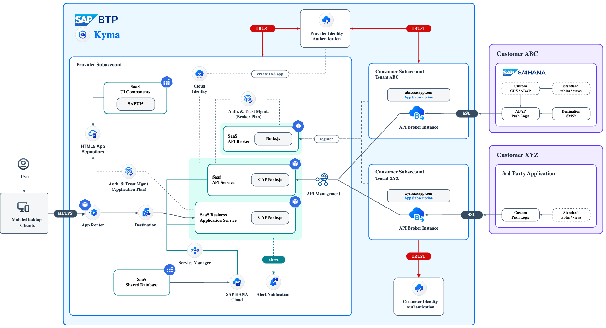
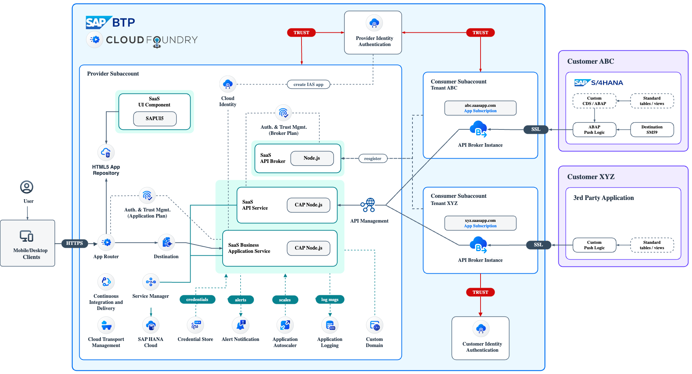

# Develop a multitenant Software as a Service application in SAP BTP using CAP (Kyma + Cloud Foundry)

## Description

The **Sustainable SaaS (SusaaS)** sample application has been built in a partner collaboration to help interested developers, partners, and customers in developing multitenant Software as a Service applications using CAP and deploying them to the SAP Business Technology Platform (SAP BTP). For this use-case, the **SAP BTP, Cloud Foundry** and **Kyma Runtime** were chosen. Still, you can also develop similar SaaS applications in the **SAP BTP, ABAP environment** ([click here](https://help.sap.com/docs/btp/sap-business-technology-platform/multitenancy-and-saas-applications) for further details).

The example focuses on using standard frameworks and SAP BTP services for developing, deploying, and monitoring the solution like the Cloud Application Programming Model (CAP), SAP API Management, Alert Notification, and many more. 

The sample application has a focus on the topic of sustainability and is therefore called **Sustainable SaaS** (Susaas) app. It allows customers (**Consumer Tenants**) of the SaaS application to extend their SAP solutions like SAP S/4HANA with additional features developed by the SaaS vendor (**Provider**). 

Due to the technical and theoretical complexity of the topic, the sample application shall not be seen or used in any kind for productive scenarios. It is supposed to present ideas and approaches for putting your scenario into practice. Our goal is to cover as many topics as we can, but not in the greatest depth that might justify productive usability.  

Below you can find the solution architecture diagrams of our sample application. As you can see, the Kyma as well as the Cloud Foundry architecture both contain a lot of services and tools which you will use in this tutorial (click to enlarge).

**Kyma**

**Cloud Foundry**

## Content

To get started, we recommend to **Discover** some basic skills and learnings first. The following parts of the documentation will introduce you to the basics of this scenario, the concepts of multitenancy, and Software as a Service applications. 

- [1 - Discover the tutorial target](./docu/1-discover/1-discover-tutorial-target/README.md)
- [2 - Basics of SAP BTP, Cloud Foundry, Kyma and CAP](./docu/1-discover/2-learn-basics-btp-cf-kyma/README.md)
- [3 - Partners in SAP BTP ecosystem](./docu/1-discover/3-partners-sap-btp-ecosystem/README.md)
- [4 - Get an idea of SaaS applications](./docu/1-discover/4-get-idea-saas-applications/README.md)
- [5 - Understand SAP BTP multitenancy](./docu/1-discover/5-understand-btp-multitenancy/README.md)
- [6 - What's New](./docu/1-discover/6-whats-new/README.md)

Continue your journey and deploy the **Basic Version** of the SaaS sample application to your SAP BTP, Cloud Foundry or Kyma environment, after preparing your Provider Subaccount by assigning the required entitlements. Learn about the different components used in the comprehensive SaaS sample app running in your environment now and subscribe a first Consumer Tenant. 

- [0 - Introduction of the Basic Version](./docu/2-basic/0-introduction-basic-version/README.md)
- [1 - Understand the repository structure](./docu/2-basic/1-understand-repo-structure/README.md)
- [2 - Prepare the Provider Subaccount](./docu/2-basic/2-prepare-provider-subaccount/README.md)
-  3 - Build and deploy the Application
   - [Build and deploy the Application](./docu/2-basic/3-cf-build-deploy-application/README.md) (**Cloud Foundry** only)
   - [Build your Container Images](./docu/2-basic/3-kyma-build-docker-images/README.md) (**Kyma** only)
   - [Deploy the SaaS Application](./docu/2-basic/3-kyma-deploy-application/README.md) (**Kyma** only)
- [4 - Subscribe a Consumer Subaccount](./docu/2-basic/4-subscribe-consumer-subaccount/README.md)
- [5 - Push data to the SaaS API](./docu/2-basic/5-push-data-to-saas-api/README.md)  
- [6 - Test the SaaS application](./docu/2-basic/6-test-the-application/README.md)
- 7 - Explore technical Application details
  - [Explore the application components](./docu/2-basic/7-explore-the-components/README.md)  
  - [Discover Helm and Kyma Resources](./docu/2-basic/7-kyma-resources-helm/README.md) (**Kyma** only)
- [8 - Unsubscribe Consumer Subaccounts](./docu/2-basic/8-unsubscribe-consumer-subaccount/README.md)
- [9 - Undeploy the SaaS application](./docu/2-basic/9-undeploy-saas-application/README.md)

 Once you successfully deployed the Basic features of the SaaS sample application to your Cloud Foundry landscape or Kyma Cluster, feel free to enhance it with more features as part of the **Advanced Version**. This includes for example a SAP API Management integration to monitor and manage your SaaS API endpoints or SAP Identity Authentication to provide a Central User Management without relying on SAP ID service. Furthermore, you will learn and see a sample of how to integrate a backend system like SAP S/4HANA from a SaaS Consumer perspective. 

- [0 - Introduction of the Advanced Version](./docu/3-advanced/0-introduction-advanced-version/README.md)
- [1 - Prepare the Provider Subaccount](./docu/3-advanced/1-prepare-provider-subaccount/README.md)
- [2 - Central user management with SAP IAS](./docu/3-advanced/2-central-user-management-ias/README.md)
- [3 - Push data from SAP S/4HANA system](./docu/3-advanced/3-push-data-s4hana-system/README.md)
- 4 - Make your API enterprise-ready
  - [Connect Cloud Foundry with SAP API Management](./docu/3-advanced/4-cf-integrate-api-management/README.md) (**Cloud Foundry** only)
  - [Integrate Kyma with SAP API Management](./docu/3-advanced/4-kyma-integrate-api-management/README.md) (**Kyma** only)

After adding some or all of the Advanced Features, the following **Expert Features** contain a variety of different topics, which will make your application and life as a SaaS developer even more convenient. You will learn about management and backup of your Tenant database containers, multi-region deployments of SaaS applications and how to tackle topics like Custom Domain usage. Most of the Advanced Features can be tested with both, the Cloud Foundry and the Kyma Runtime, while some of the features are (as of now) available for a specific runtime only.  

> **Important** - Some of the Expert Features are Work-in-Progress. The code and documentation are subject to change. 

- [Local and hybrid development](./docu/4-expert/local-hybrid-development/README.md)
- [Tenant onboarding with Terraform](./docu/4-expert/btp-terraform-setup/README.md)
- [Custom domain for SAP IAS](./docu/4-expert/custom-domain-for-ias/README.md)
- [Send emails using Microsoft Graph](./docu/4-expert/send-emails-graph-api/README.md)
- [Feature Toggles](./docu/4-expert/feature-toggles/README.md)
- [SaaS Consumer Extensibility](./docu/4-expert/consumer-extensibility/README.md)
- [Manage Tenant database containers](./docu/4-expert/manage-tenant-containers/README.md)
- [HDI container administration](./docu/4-expert/hdi-container-administration/README.md)
- [Backup database containers](./docu/4-expert/backup-database-containers/README.md)
- [Integrate a Consumer IdP](./docu/4-expert/integrate-consumers-idp/README.md)
- [Update Tenant database containers](./docu/4-expert/update-tenant-containers/README.md)

**Cloud Foundry** (only)

- [Custom domain usage](./docu/4-expert/-CloudFoundry-/custom-domain-usage/README.md)
- [Multiple SAP HANA Cloud instances](./docu/4-expert/-CloudFoundry-/multiple-hana-cloud/README.md)
- [Deployment to multiple regions](./docu/4-expert/-CloudFoundry-/deploy-multiple-regions/README.md)
- [Setup a Continuous Integration Scenario](./docu/4-expert/-CloudFoundry-/setup-cicd-for-project/README.md)
- [Using the SAP Theme Designer](./docu/4-expert/-CloudFoundry-/using-sap-theme-designer/README.md)
- [Configure SAP Transport Management](./docu/4-expert/-CloudFoundry-/configure-transport-management/README.md)

**Kyma** (only)

- [Custom domain usage](./docu/4-expert/-Kyma-/custom-domain-usage/README.md)
- [Setup a Continuous Integration Scenario](./docu/4-expert/-Kyma-/setup-cicd-for-project/README.md)

## Requirements

If not yet done, for this sample application we recommend to set up a **Pay-As-You-Go (PAYG)** or **CPEA** account and use the mentioned **Free (Tier) service plans**. A tutorial how to setup a PAYG account (allowing you to use all Free Tier service plans) can be found in the [Tutorial Navigator](https://developers.sap.com/tutorials/btp-free-tier-account.html). 

> **Hint** - This sample scenario (Basic and Advanced Version) can also be deployed to Cloud Foundry and Kyma environments in **Trial** accounts, although we recommend to use one of the two account types mentioned above. When going for a Trial account, please make sure to choose the **us10** region to have access to SAP HANA Cloud. 

### Basic Version

The **Basic Version** of the sample application requires the following set of SAP BTP entitlements in the Provider Subaccount and can be done using **Free (Tier) service plans** of **PAYG** and **CPEA** accounts.

**Kyma**

| Service / Subscription                                                                                                                                                                  | Free Tier / (Trial) Plans            |
| --------------------------------------------------------------------------------------------------------------------------------------------------------------------------------------- | ------------------------------------ |
| [Destination Service](https://discovery-center.cloud.sap/serviceCatalog/destination?service_plan=lite&region=all&commercialModel=cloud)                                                 | Lite                                 |
| [SAP Alert Notification service for SAP BTP](https://discovery-center.cloud.sap/serviceCatalog/alert-notification?region=all)                                                           | Free / *(Trial: Lite)*               |
| [SAP Application Logging Service](https://discovery-center.cloud.sap/serviceCatalog/application-logging-service/?region=all)                                                            | Lite                                 |
| [SAP Authorization and Trust Management Service](https://discovery-center.cloud.sap/serviceCatalog/authorization-and-trust-management-service?region=all&tab=feature)                   | Broker   Application              |
| [SAP BTP, Kyma Runtime](https://discovery-center.cloud.sap/serviceCatalog/kyma-runtime?region=all&tab=feature)                                                                          | Free / *(Trial: Trial)*              |
| [SAP Cloud Management Service for SAP BTP](https://discovery-center.cloud.sap/serviceCatalog/cloud-management-service/?region=all)                                                      | Central                              |
| [SAP HTML5 Application Repository Service for SAP BTP](https://discovery-center.cloud.sap/serviceCatalog/html5-application-repository-service?region=all)                               | App-host   App-runtime            |
| [SAP Software-as-a-Service Provisioning service](https://discovery-center.cloud.sap/serviceCatalog/saas-provisioning-service?service_plan=application&region=all&commercialModel=cloud) | Application                          |
| [SAP HANA Cloud](https://discovery-center.cloud.sap/serviceCatalog/sap-hana-cloud?tab=customerreference&region=all)                                                                     | hana-free *(Trial: hana)*   tools |
| [SAP HANA Schemas & HDI Containers](https://help.sap.com/docs/SAP_HANA_PLATFORM/3823b0f33420468ba5f1cf7f59bd6bd9/e28abca91a004683845805efc2bf967c.html?version=2.0.04&locale=en-US)     | hdi-shared                           |
| [SAP Service Manager](https://discovery-center.cloud.sap/serviceCatalog/service-manager/?region=all)                                                                                    | Container   Subaccount-Admin      |

**Cloud Foundry**

> **Hint** - 1GB of Cloud Foundry Runtime is sufficient for this use-case.

| Service / Subscription                                                                                                                                                              | Free (Tier) / (Trial)  Plans           |
| ----------------------------------------------------------------------------------------------------------------------------------------------------------------------------------- | -------------------------------------- |
| [Application Autoscaler](https://discovery-center.cloud.sap/serviceCatalog/application-autoscaler/?service_plan=standard&region=all&commercialModel=cloud)                          | Standard                               |
| [Destination Service](https://discovery-center.cloud.sap/serviceCatalog/destination?service_plan=lite&region=all&commercialModel=cloud)                                             | Lite                                   |
| [SAP Alert Notification service for SAP BTP](https://discovery-center.cloud.sap/serviceCatalog/alert-notification?region=all)                                                       | Free / *(Trial: Lite)*                 |
| [SAP Application Logging Service](https://discovery-center.cloud.sap/serviceCatalog/application-logging-service/?region=all)                                                        | Lite                                   |
| [SAP Authorization and Trust Management Service](https://discovery-center.cloud.sap/serviceCatalog/authorization-and-trust-management-service?region=all&tab=feature)               | Broker   Application                |
| [SAP BTP, Cloud Foundry Runtime](https://discovery-center.cloud.sap/serviceCatalog/cloud-foundry-runtime?region=all)                                                                | Free / *(Trial: MEMORY)*               |
| [SAP Cloud Management Service for SAP BTP](https://discovery-center.cloud.sap/serviceCatalog/cloud-management-service/?region=all)                                                  | Central                                |
| [SAP Credential Store](https://discovery-center.cloud.sap/serviceCatalog/credential-store?region=all)                                                                               | Free / *(Trial: Trial)*                |
| [SAP HTML5 Application Repository Service for SAP BTP](https://discovery-center.cloud.sap/serviceCatalog/html5-application-repository-service?region=all)                           | App-host  App-runtime               |
| [SAP SaaS Provisioning Service](https://discovery-center.cloud.sap/serviceCatalog/saas-provisioning-service?service_plan=application&region=all&commercialModel=cloud)              | Application                            |
| [SAP HANA Cloud](https://discovery-center.cloud.sap/serviceCatalog/sap-hana-cloud?tab=customerreference&region=all)                                                                 | hana-free / *(Trial: hana)*   tools |
| [SAP HANA Schemas & HDI Containers](https://help.sap.com/docs/SAP_HANA_PLATFORM/3823b0f33420468ba5f1cf7f59bd6bd9/e28abca91a004683845805efc2bf967c.html?version=2.0.04&locale=en-US) | hdi-shared                             |
| [SAP Service Manager](https://discovery-center.cloud.sap/serviceCatalog/service-manager/?region=all)                                                                                | Container   Subaccount-Admin        |

If you need assistance assigning entitlements to your Provider Subaccount, you might find information [here](https://help.sap.com/docs/service-ticket-intelligence/service-ticket-intelligence-user-guide/assign-entitlement-to-subaccount?locale=en-US).

### Advanced Features

The **Advanced Features** require some additional services and software components which are listed below. Please note that the **SAP Identity Authentication Service** is only available in **Pay-As-You-Go (PAYG)** and **CPEA** accounts.

| Service                                                                                                         | Free (Tier) / (Trial) Plans                            |
| --------------------------------------------------------------------------------------------------------------- | ------------------------------------------------------ |
| [SAP Integration Suite](https://discovery-center.cloud.sap/serviceCatalog/integration-suite?region=all)         | Free (Application)   *(Trial: trial (Application))* |
| [Cloud Identity Services](https://discovery-center.cloud.sap/serviceCatalog/identity-authentication?region=all) | default (Application)    Application                |
| SAP S/4HANA 2021 (or newer)                                                                                     |                                                        |
|                                                                                                                 |

Please check the below details on these additional entitlements required for the Advanced Version. Especially using the **Cloud Identity Services** it is essential to understand the licensing model to remain within the **free** usage boundaries! 

**SAP Integration Suite** 

> The **free service plan** is usable for 90 days only. Your tenant will be decommissioned after 90 days and you need to set up a new tenant if you wish to do further validations. 

**Cloud Identity Services**

> When signing up for a PAYG or CPEA account, you're entitled for **one free** test and productive **SAP Identity Authentication Service (SAP IAS)** tenant. Use the **Cloud Identity Services** plan **default (Application)** to create such an instance in your environment. Any further tenant can be licensed as **Additional Tenant** and will be charged according to your account type. Please also check the official SAP Help documentation ([click here](https://help.sap.com/docs/IDENTITY_AUTHENTICATION/6d6d63354d1242d185ab4830fc04feb1/93160ebd2dcb40e98aadcbb9a970f2b9.html?locale=en-US#loio93160ebd2dcb40e98aadcbb9a970f2b9__licensing_section)) and the following blog post ([click here](https://community.sap.com/t5/application-development-blog-posts/is-sap-cloud-identity-services-for-free/ba-p/13512212)) for further information. Please check for potentially existing SAP IAS tenants first, to make sure you are sticking to the free service offering limits. 
> 
> Using the **SAP Identity Authentication Service**, please make sure to comply with the license model, which is highly dependent on the application registration type created in SAP IAS. Using SAP IAS for authentication scenarios involving third-party solutions will result in costs! While SAP Cloud to SAP Cloud Log-ons are usually part of your overall SAP BTP contract, make sure you understand the licensing model before extensively using SAP IAS as part of your overall architecture. Additional information can be found in SAP Help ([click here](https://help.sap.com/docs/identity-authentication/identity-authentication/tenant-model-and-licensing?locale=en-US)).
>
> The service plan **application** allows you to create respective Service Instances within SAP BTP, that will automatically register an application in the **trusted** SAP IAS tenant configured in your Subaccount configuration. 

**SAP S/4HANA** 

> An SAP S/4HANA system is actually not part of your SAP BTP Provider Subaccount, but is required if you want to test the automated data push feature from an existing SAP On-Premise solution. While we recommend to use at least the SAP S/4HANA 2021 release, with a bit of coding effort you should also be able to integrate older releases. This tutorial assumes you have at least access to an SAP S/4HANA 2021 release. Feel free to check out the SAP Cloud Appliance Library (https://cal.sap.com/) to get yourself a free test license. 

## Known Issues
**Open**
  - Automated Credential Rotation (Workaround available - 2023/06/09)
    - **Problem**: Users are facing a callback authentication error after successful login via SAP IAS as part of the One-Domain concept. 
    - **Issue**: Activating the automated credential rotation of the SAP BTP Service Operator renews the X.509 certificate of the respective SAP IAS service bindings. As the Application Router caches the binding details for performance reasons, the cached X.509 certificate is not valid anymore after rotation. This results in an authentication error between Application Router and SAP IAS. 
    - **Workaround**: A restart of the Application Router after credential rotation will solve this issue and the latest X.509 certificate is being cached. This restart can be automated in a Kubernetes/Kyma CronJob, starting a new Deployment rollout according to your credential rotation cycle. Combined with an external Redis cache for Application Router session management, downtimes can be minimized or completely mitigated! Make sure to have a sufficient overlap of both, the old and new X.509 certificate (*rotatedBindingTTL: 24h* & *rotationFrequency: 48h*), so the cached credentials are still valid until the restart has happened!
    - **Solution**: Issue has been addressed and a potential notification mechanism might trigger an automated update of the Application Router cache in the future (subject to change). 
  - Consumer extension API issue (Workaround available - 2022/12/19)
    - **Problem**: Applying a Consumer extension currently results in the Push API not being usable by the extended Tenant anymore. 
    - **Issue**: The current implementation has issues to read and process the CSN file of the extended SaaS CAP service. This service serves as a base for the API CAP service.
    - **Workaround**: Extensibility has been temporarily disabled for the CAP API Service.
    - **Solution**: Issues has been addressed with the CAP product management and potential solutions will be worked on.

## How to obtain support
[Create an issue](https://github.com/SAP-samples/btp-cap-multitenant-saas/issues) in this repository if you find a bug or have questions about the content.
 
For additional support, [ask a question in SAP Community](https://answers.sap.com/questions/ask.html).

## Contributing
If you wish to contribute code or offer fixes or improvements, please send a pull request. Check out our [contribution guide](CONTRIBUTING.md). Due to legal reasons, contributors will be asked to accept a DCO when they create the first pull request for this project. This happens in an automated fashion during the submission process. SAP uses [the standard DCO text of the Linux Foundation](https://developercertificate.org/).

## Code of Conduct

Please follow our [code of conduct](CODE_OF_CONDUCT.md).

## License
Copyright (c) 2023 SAP SE or an SAP affiliate company. All rights reserved. This project is licensed under the Apache Software License, version 2.0 except as noted otherwise in the [LICENSE](LICENSE) file.
