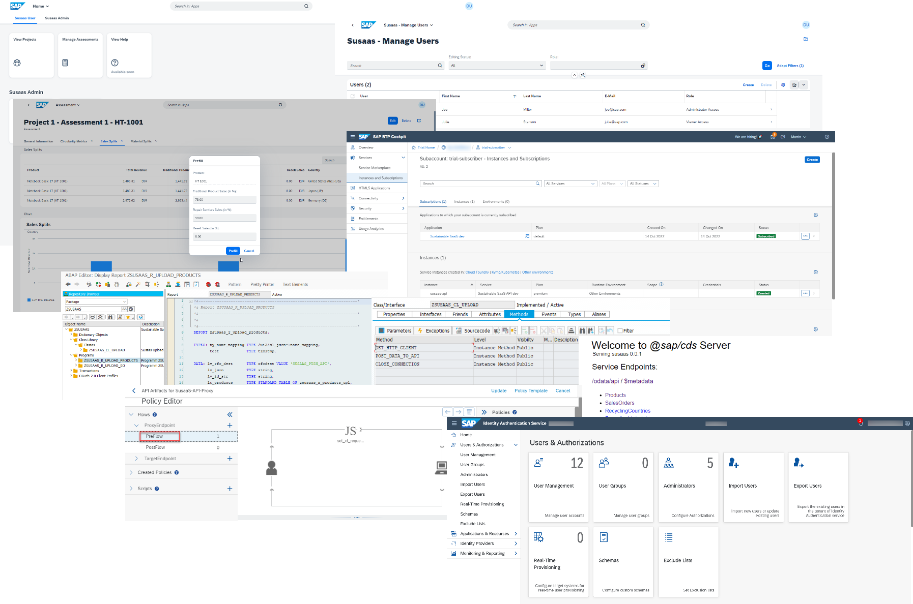
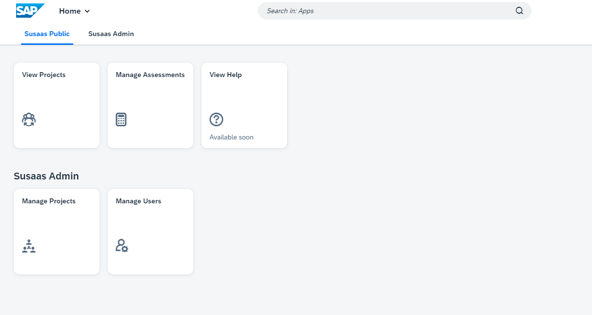
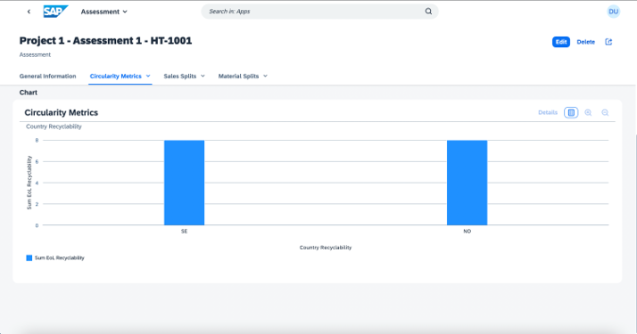
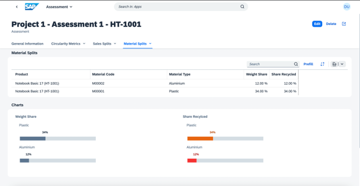
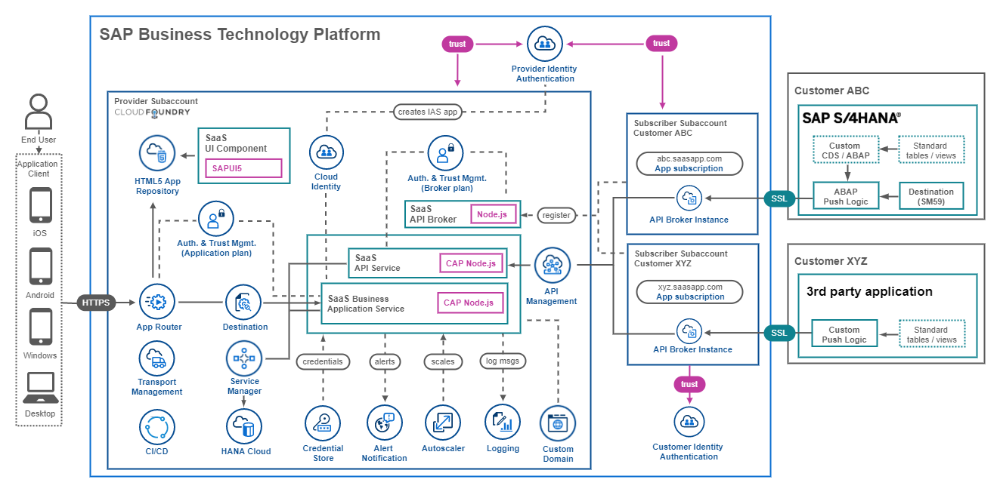

# Discover the Tutorial Target

- **Kyma** ✅ 
- **Cloud Foundry** ✅

In this tutorial, you will learn how to set up a multitenant Software as a Service (SaaS) application using CAP in your SAP Business Technology Platform (SAP BTP) environment. This use-case can be deployed to the **SAP BTP, Cloud Foundry** and also SAP's managed Kubernetes offering, the **SAP BTP, Kyma Runtime**. You are flexible to choose which runtime suits your needs or skills. 

> **Hint** - You will find separate step-by-step tutorials in case the deployment steps differentiate. Ensure to check the chapter introductions, as those will clearly indicate whether a the content targets a specific runtime! Feel free to ignore any content or chapters not related to your chosen runtime! 

The sample application has a focus on the topic of Sustainability and is therefore called **Sustainable SaaS** (Susaas). It allows **consumers** of your SaaS application to extend their SAP solutions like SAP S/4HANA with additional features provided by you as a SaaS **Provider**. 

- [Discover the Tutorial Target](#discover-the-tutorial-target)
  - [1. Tutorial Versions](#1-tutorial-versions)
  - [2. GitHub Repository](#2-github-repository)
  - [3. Tutorial Audience](#3-tutorial-audience)
  - [4. Focus Topics](#4-focus-topics)
  - [5. Obtain Support](#5-obtain-support)
  - [6. Provide Feedback](#6-provide-feedback)
  - [7. What's New](#7-whats-new)

In this simple scenario, the application allows you to assign users to multiple projects, in which they can assess dedicated circularity metrics of products imported from an SAP backend system like SAP S/4HANA. Besides the assessment of financial product sales data, the app also allows to import or to enter recycling data or product design information. See the following screenshots to get an idea of the application features. The details will be described in later parts of the tutorial (click to enlarge).

Due to the technical and theoretical complexity of the topic, the sample application shall not be seen or used in any kind for productive scenarios. Furthermore, it shall give you a lot of ideas and approaches for your own scenario implementation. 

We aim to cover as many topics as possible but not in the greatest depth that might justify productive usability. Below you can find a solution architecture diagram of the sample application for the **Cloud Foundry** and **Kyma** Runtime. The business logic for both runtimes is congruent and only the onboarding of new SaaS tenants requires a few runtime specific code blocks.

As you can see, the app contains a lot of SAP BTP services and tools which you will use during the course of this tutorial. In the context of Kyma, a few services have been replaced by native Kyma or Kubernetes features like **Secrets** replacing the **Credential Store** or **Horizontal Pod Autoscalers** instead of **Autoscaler**. 

**Cloud Foundry**

**Kyma**

As you might have noticed, the architectures of the Kyma and Cloud Foundry are pretty much similar. Same applies for the provided sample code, which only differs in a few runtime specific aspects but is otherwise runtime independent. 

> **Important** - All deployment related artifacts have been removed from the actual code-line into a separate *deploy* directory, so the actual *code* is (except for a few spots) completely runtime independent! 

For the Kubernetes experts amongst you, please feel free to check out a more detailed and Kubernetes focused architecture below. If you are new to Kubernetes, don't worry as we will get you covered along the way if you decide to walk along the Kyma path. 

**Kyma**

## 1. Tutorial Versions

This tutorial is structured in three major versions which are the **Basic** and **Advanced Version** of the SaaS application, complemented by additional **Expert Features**. This section will give you a brief overview of the versions and the requirements from an SAP BTP perspective. 

**Basic Version**

The **Basic Version** contains a very comprehensive version of the **SusaaS (Sustainable SaaS)** application, which can be deployed to your SAP BTP account using **Free (Tier)** or even **Trial** service plans. 

You can use any SAP BTP account type (including Trial) to deploy this version of the sample application to either a Kyma or Cloud Foundry environment. Furthermore, the Basic Version is the foundation of the Advanced Version and contains essential components of a SAP BTP SaaS solution (including a multitenant API). 

**Advanced Version**

The **Advanced** version adds further enterprise features to your SAP BTP SaaS application like 
- a Central User Management in SAP Identity Authentication Service (SAP IAS)
- an integration with SAP API Management for managing your SaaS API
- a sample showcasing how to push data from an SAP S/4HANA backend

All services required to complement the Advanced Version of the sample scenario are available in all SAP BTP account types including Trial accounts. The only exception is (for sure) an SAP S/4HANA system, which you either need to bring yourself or you need to set up a [CAL instance](https://cal.sap.com/) which will cost you a few dollars per month (don't forget to stop your system if not in use :).

> **Hint** - If you don't have access to an SAP S/4HANA system, you can also use the HTTP test files provided as part of this tutorial for testing the multitenant API from a SaaS consumer perspective. 

**Expert Features**

> **Important** - The Expert Features are still Work-in-Progress and constantly evolving. The code and documentation are subject to change. 

The **Expert Features** contain a lot of additional expert knowledge for developers implementing SaaS applications on SAP BTP. The different topics of the Expert Features mostly result from experiences of the latest learnings and challenges of a Proof-of-Concept which was conducted with SAP partners. 

The topics include but are not limited to
 - Local and hybrid testing of multitenant apps
 - Applying extensions as a SaaS consumers
 - Exploring feature toggles in a SaaS context
 - Using a custom domain for your SaaS app 
 - Handling Tenant database containers
 - Providing your SaaS application in multiple regions
 - Integrating a customer's Identity Provider
 - Sending e-mails using Microsoft Graph
 - ...

## 2. GitHub Repository 

You can find the code of the sample application in the following SAP-samples GitHub repository. You can either clone or fork the repository to your own GitHub account. 

https://github.com/SAP-samples/btp-cap-multitenant-saas

The repository contains one branch [**main**](https://github.com/SAP-samples/btp-cap-multitenant-saas/tree/main/) for the tutorial documentation, source code and deployment definitions like Helm Charts and MTA Deployment Descriptor files. 

> **Important** - The code-line is kept generic, so that in a few places you are required to provide your environment specific details. Please make sure to carefully read the step-by-step guide in this case, as we provide guidance on how to use the **-private** filename extension. This will ensure that no confidential or environment specific details will be committed to your GitHub repository.

## 3. Tutorial Audience

While the ecosystem of partner-built software for SAP On-Premise solutions has grown very well over the last decades, the available partner offerings and the interest in building solutions on SAP BTP starts to increase. A lot of SAP partners wonder how to port their existing developments to the cloud, to satisfy the demand of their existing customers moving to SAP BTP, or reach out to a much broader market than before. 

For that reason, this tutorial and the related topic of developing multitenant SaaS applications using the **SAP BTP, Cloud Foundry** or **Kyma Runtime** is of great interest to partners and customers. It is supposed to give all interested stakeholders an introduction to the theoretical basics of Software as a Service on SAP BTP and provides a great codebase that can be used to kickstart your own implementation. 

There is no previous development knowledge required for the **Cloud Foundry** sample of this tutorial, so all new but also experienced developers can set up the sample application. Nevertheless, a basic understanding of SAP BTP service offerings will help you grasp the ideas and concepts. Furthermore, you should have a basic idea how to use the SAP BTP Cockpit to assign entitlements, role-collections and similar foundational concepts. 

For the **Kyma** track, you will require at least some basic Kubernetes knowledge and ideally have a Kyma Cluster up and running in your environment. Furthermore, you should be familiar connecting to your Cluster using kubectl.

## 4. Focus Topics

The main topics of the tutorial include:

* Understanding Software as a Service and multitenancy
* Discover how CAP supports developing multitenant apps
* Using SaaS-features of SAP Business Technology Platform
* Developing extensions for SAP solutions like S/4HANA based on 
  - the latest SAP CAP release features
  - a UI based on SAP Fiori Elements for OData v4 
  - SAP HANA Cloud as a powerful persistence layer
  - APIs for flexible Subscriber data integration
  - and many more...
* Expert topics to consider when building SaaS apps like
  - development efficiency using local and hybrid testing
  - set up a custom domain for your app
  - deploying your app to multiple regions
  - handling Tenant database containers
  - approaching local development and hybrid testing
  - and many more...

## 5. Obtain Support

Please check if you find your issue described in the **Known Issues** section ([click here](../../../README.md#known-issues)). If not, please create a GitHub issue to get support or to report a bug (https://github.com/SAP-samples/btp-cap-multitenant-saas/issues).

## 6. Provide Feedback

Nobody is perfect so please let us know how we can improve our samples so that you can take the most out of it! Feel free to share your feedback with us by creating an issue in GitHub as described above. This will help us to improve this tutorial and further content for you and other stakeholders. 

## 7. What's New

Check the latest release and **What's New** details in the respective card of the **Discover** tutorial version ([click here](../6-whats-new/README.md)).
