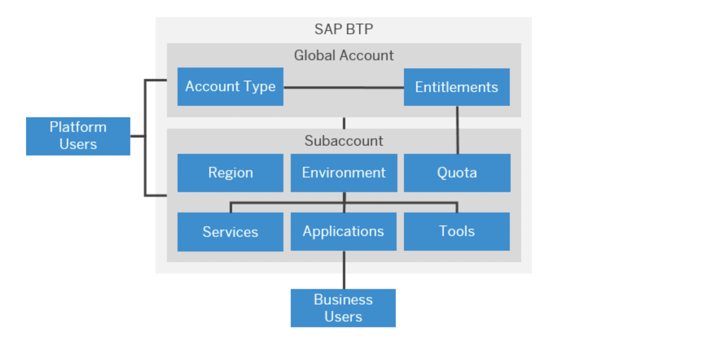

# The Basics of SAP BTP, Cloud Foundry, Kyma and CAP

- **Kyma** ✅ 
- **Cloud Foundry** ✅

The **SAP Business Technology Platform (SAP BTP)** is an integrated offering comprised of four technology portfolios: database and data management, application development and integration, analytics, and intelligent technologies. The platform offers users the ability to turn data into business value, compose end-to-end business processes, and build and extend SAP applications quickly.

- [The Basics of SAP BTP, Cloud Foundry, Kyma and CAP](#the-basics-of-sap-btp-cloud-foundry-kyma-and-cap)
  - [1. Basic Platform Concepts](#1-basic-platform-concepts)
  - [2. SAP BTP, Cloud Foundry Runtime](#2-sap-btp-cloud-foundry-runtime)
  - [3. SAP BTP, Kyma Runtime](#3-sap-btp-kyma-runtime)
  - [4. Cloud Application Programming Model (CAP)](#4-cloud-application-programming-model-cap)

## 1. Basic Platform Concepts

> **Hint** - Check the official documentation to learn more ([click here](https://help.sap.com/docs/btp/sap-business-technology-platform/sap-business-technology-platform)).

SAP BTP offers customers and partners the ability to turn data into business value, compose end-to-end business processes, and build and extend SAP applications quickly. The services and solutions of SAP BTP are available on multiple Cloud Infrastructure Providers in data centers all around the globe. 

- Amazon Web Services (AWS)
- Microsoft Azure
- Google Cloud Platform (GCP)
- Ali Cloud

The multi-cloud strategy supports different environments and runtimes for application development, such as **Kyma**, **Cloud Foundry**, **ABAP Cloud**, as well as multiple different regions, and a broad choice of programming languages. This tutorial will provide detailed end-to-end development guidance for the **Cloud Foundry** as well as the **Kyma** Runtime. 

The central point of entry to the platform is the SAP BTP Cockpit, where you can access your accounts and applications and manage all activities associated with them. You can find the region-specific URLs below. 

> **Hint** - You can use any of those links to access any of your SAP BTP accounts. The regional availability serves the performance of the Cockpit application, so we suggest to use the closest regional URL when working with the Cockpit.

- EMEA: https://emea.cockpit.btp.cloud.sap
- Restricted EU-Access: https://eu-access.cockpit.btp.cloud.sap
- Americas: https://amer.cockpit.btp.cloud.sap
- Asia-Pacific, Oceania: https://apac.cockpit.btp.cloud.sap
- Trial: https://cockpit.hanatrial.ondemand.com/trial

As this tutorial is not about an extensive SAP BTP introduction, we would like to refer you to the official [SAP Help](https://help.sap.com/docs/BTP/65de2977205c403bbc107264b8eccf4b/73beb06e127f4e47b849aa95344aabe1.html?locale=en-US) documentation for further information.

**Enterprise vs. Trial Accounts**

> **Hint** - Check the official documentation to learn more ([click here](https://help.sap.com/docs/btp/sap-business-technology-platform/trial-accounts-and-free-tier)).

Just a few comments on the SAP BTP Account requirements for this use case. You can set up our sample application in any SAP BTP environment using **Free (Tier) service plans** ([click here](https://help.sap.com/docs/btp/sap-business-technology-platform/using-free-service-plans) to learn more) of your own **Pay-as-you-Go** (PAYG) or **CPEA** account ([click here](https://help.sap.com/docs/btp/sap-business-technology-platform/what-is-consumption-based-commercial-model?locale=en-US) to learn more). 

We highly suggest to create such an **Enterprise Account** for the purpose of validating this and any future use case. While you can set up our sample application also in **Trial** accounts, only an **Enterprise Account** allows you to move from **Free Tier** to **Paid** service plans if required. Additionally, Trial accounts encompass a few more limitations like a restricted 14 day test period for any new Kyma Cluster.

> **Hint** - A tutorial how to set up a **free PAYG account** (allowing you to use all Free Tier service plans) can be found in the [Tutorial Navigator](https://developers.sap.com/tutorials/btp-free-tier-account.html). 

**Runtimes**

The key pillars of developing business applications on SAP BTP are the runtimes which can be chosen based on the customer's requirement and expertise. In this scenario, the established **Cloud Foundry Runtime** as well as SAP's managed Kubernetes offering called **Kyma Runtime** will be covered in greater detail below. 

 If you are new to SAP BTP, or in case you already used the **Cloud Foundry Runtime** and now wonder whether you should also discover the **Kyma Runtime**, please read the runtime introductions below and check out the great runtime comparison in the following blog post [click here](https://blogs.sap.com/2023/04/28/developing-an-application-on-sap-cloud-foundry-runtime-and-sap-kyma-runtime-a-comparative-analysis/). If you are interested in scenarios covering the **ABAP Cloud** environment, please check out the [developers.sap.com](https://developers.sap.com/tutorial-navigator.html?tag=software-product%3Atechnology-platform%2Fsap-business-technology-platform%2Fsap-btp-abap-environment) for a bunch of great tutorials!

**Further links**

To learn more about SAP BTP in general, feel free to check out and bookmark the following links for your convenience. 

SAP BTP Best Practices  
https://help.sap.com/docs/btp/best-practices/best-practices-for-sap-btp

SAP BTP Tools and APIs  
https://help.sap.com/docs/btp/best-practices/tools 
https://help.sap.com/docs/btp/best-practices/apis

## 2. SAP BTP, Cloud Foundry Runtime

The **SAP BTP, Cloud Foundry Runtime** is a very convenient way to get started when developing applications on SAP BTP. It offers developers a flexible and open platform, empowering them to leverage a wide range of programming languages, frameworks, and provides access to a wide range of SAP BTP services. It supports the principles of microservices architecture, allowing for the creation of modular and scalable applications. 

With its container-based approach (leveraging so-called Diego cells), developers can package their applications along with their dependencies, ensuring portability across different environments. It is easy to use, a lot of heavy-lifting requirements are handled by Cloud Foundry under the hood and the developer doesn't need to worry about low-level configurations including network security.

The SAP BTP, Cloud Foundry runtime is available in the majority of all SAP BTP regions around the globe, which simplifies a high-availability or cross-regional setup of your application workloads!

**Key Features and Benefits**

- Multi-cloud Deployment: The Cloud Foundry Runtime enables deploying applications across various cloud providers, giving businesses the freedom to choose the infrastructure that best suits their needs.
- Developer Productivity: Developers can take advantage of a rich set of development tools, including integrated development environments (IDEs) like SAP Business Application Studio, command-line interfaces (CLIs), and continuous integration/continuous deployment (CI/CD) services, facilitating efficient application development and deployment processes.
- Scalability and Resilience: The Cloud Foundry Runtime provides automatic scaling capabilities, allowing applications to handle varying workloads and ensure optimal performance. It also offers self-healing mechanisms, enabling applications to recover from failures and ensure high availability.
- Service Marketplace: The SAP BTP, Cloud Foundry Runtime offers an extensive marketplace of services, including databases, messaging systems, authentication services, and more. Developers can easily integrate these services into their applications, reducing development time and effort.

To learn more about SAP BTP, Cloud Foundry Runtime and to explore its capabilities, you can visit the following links:

- SAP BTP Documentation Overview: [SAP BTP Overview on SAP Help](https://help.sap.com/docs/btp?locale=en-US)
- Official SAP BTP Documentation: [SAP BTP Documentation](https://help.sap.com/docs/btp/sap-business-technology-platform/)
- Cloud Foundry on SAP BTP : [Environment Introduction](https://help.sap.com/docs/btp/sap-business-technology-platform/cloud-foundry-environment) 
- Cloud Foundry Official Website: [Cloud Foundry Website](https://www.cloudfoundry.org/)

These resources provide comprehensive information, guides, and examples to help you get started with SAP BTP, Cloud Foundry Runtime and leverage its capabilities to accelerate your application development and deployment in the Cloud. 

## 3. SAP BTP, Kyma Runtime

In addition, the SAP BTP offers the state-of-the-art **Kyma Runtime** as a powerful alternative for developers to build, extend, and connect applications in a cloud-native manner. In contrast to the Cloud Foundry Runtime, the **Open Source** Kyma project provides a different approach and set of features, enhancing the capabilities of SAP BTP. The Kyma environment leverages **Kubernetes** as its underlying container orchestration platform, providing developers with enhanced flexibility, scalability, and extensibility. It allows businesses to seamlessly connect and extend SAP solutions, third-party applications, and custom-built applications in a unified and secure manner.

While Cloud Foundry automatically handles various low-level configurations like the routing and networking layer, Kyma provides much more flexibility and control options in this concern! Especially for highly scalable and business application with advanced requirements (e.g., concerning network security), the **SAP BTP, Kyma Runtime** should be considered! Same holds true for customers and partners having extensive Kubernetes expertise within their teams or scenarios in which multiple applications justify the more expensive investment in a managed Kubernetes Cluster. 

**Key Features and Benefits**

- Extensibility: Kyma empowers developers to easily extend existing SAP applications by building and integrating custom microservices in a Kubernetes environment. These container-based microservices can be created using various programming languages and frameworks, ensuring compatibility and flexibility.
- Event-Driven Architecture: With Kyma, developers can take advantage of event-driven architecture patterns to build reactive and loosely-coupled applications. This enables seamless integration and real-time data processing across different systems and services.
- Integration Capabilities: Like Cloud Foundry, also Kyma offers a wide range of options for integrating with various systems, such as SAP S/4HANA, SAP SuccessFactors, and more. It enables developers to build integrations that span different applications and services, providing a unified user experience.
- Custom Resource Definitions (CRDs): Kyma allows defining custom resource types to represent specific business entities or processes. This feature facilitates the creation of domain-specific APIs and enables developers to model their applications based on specific business needs.
- Serverless Functions: With Kyma, developers can leverage serverless functions to execute small, event-triggered code snippets. This enables efficient scaling, cost optimization, and simplified management of application logic.
- Service Integration: While Cloud Foundry offers the most advanced integration with SAP BTP Service offerings, Kyma is catching up quickly and most SAP BTP Services can also be seamlessly connected to your Kyma Cluster! 

To explore SAP BTP, Kyma Environment further and understand its capabilities in comparison to the Cloud Foundry Runtime, you can visit the following links:

- SAP BTP Documentation Overview: [SAP BTP Overview on SAP Help](https://help.sap.com/docs/btp?locale=en-US)
- Official SAP BTP Documentation: [SAP BTP Documentation](https://help.sap.com/docs/btp/sap-business-technology-platform/)
- Cloud Foundry on SAP BTP : [Environment Introduction](https://help.sap.com/docs/btp/sap-business-technology-platform/kyma-environment) 
- Kyma Project Official Website: [Kyma Project Website](https://kyma-project.io/)
- Kyma Documentation: [Kyma Documentation](https://kyma-project.io/docs/kyma/latest)

These resources provide detailed information, guides, and examples to help you understand and leverage the unique features of SAP BTP, Kyma Environment. Whether you require extensibility, event-driven architecture, or seamless integration capabilities, Kyma offers a robust platform to accelerate your application development and enhance your SAP BTP experience.

**Hint** - To successfully follow along this tutorial, please take a short break and read the following blog post of Maximilian Streifeneder. He has written a great summary containing all relevant basics required when planning to deploy CAP-based workloads to SAP BTP, Kyma Environment. We will link this blog post a few more times throughout the tutorial, so take your time and take a first glimpse right now! It will give you an idea of what to expect when approaching our Kyma-based tutorial.

[Surviving and Thriving with the SAP Cloud Application Programming Model: Deployment to SAP BTP, Kyma runtime](https://blogs.sap.com/2023/03/07/surviving-and-thriving-with-the-sap-cloud-application-programming-model-deployment-to-sap-btp-kyma-runtime/)

Additionally, check out the following resources, to learn more about Kyma.

- [GitHub - Kyma Runtime Extension Samples](https://github.com/SAP-samples/kyma-runtime-extension-samples)
- [Youtube - Understand the value proposition of SAP BTP, Kyma runtime by example](https://www.youtube.com/watch?v=RhSF9ZBcHsg)
- [Youtube- 2 Minutes of Cloud Native](https://www.youtube.com/playlist?list=PL6RpkC85SLQCwaJ54TAAHMvSl5wpVPrai)

If you are completely new to Kubernetes, we also highly recommend to acquaint yourself with a respective introduction to the basics of Kubernetes.

- [https://kubernetes.io/training/](https://kubernetes.io/training/)

## 4. Cloud Application Programming Model (CAP)

As our SaaS sample application is based on the so-called **Cloud Application Programming Model** also known as **CAP**, so please familiarize yourself with the basics of this brilliant framework! As we cannot summarize the essence of CAP any better than the official **Capire** documentation (https://cap.cloud.sap/docs/about/), let us briefly check how the experts describe it. 

*"The SAP Cloud Application Programming Model (CAP) is a framework of languages, libraries, and tools for building enterprise-grade services and applications. It guides developers along a ‘golden path’ of proven [best practices](https://cap.cloud.sap/docs/about/#enterprise-best-practices) and a great wealth of [out-of-the-box solutions](https://cap.cloud.sap/docs/about/#generic-providers) to recurring tasks.*

*CAP-based projects benefit from a [primary focus on domain](https://cap.cloud.sap/docs/about/#domain-modeling). Instead of delving into overly technical disciplines, we focus on [accelerated development](https://cap.cloud.sap/docs/about/#grow-as-you-go) and [safeguarding investments](https://cap.cloud.sap/docs/about/#agnostic-approach) in a world of rapidly changing cloud technologies."*

Besides using CAP for the definition of our SaaS **tenant data model**, as well as the data model shared amongst all subscribers, we are using much more features as part of this SaaS sample application. Based on these **data models**, CAP provides the required **OData Services** including **Annotations** used by our Fiori Elements UIs out-of-the-box, CAP is backing our multitenant **SaaS Inbound API**, and handles security checks across our application. Last but not least, we are making use of the latest **@sap/mtxs** package ([click here](https://cap.cloud.sap/docs/guides/multitenancy/mtxs)), utilized to simplify multitenant related requirements like **tenant provisioning** ([click here](https://cap.cloud.sap/docs/guides/multitenancy/mtxs#saasprovisioningservice)), **extensibility** ([click here](https://cap.cloud.sap/docs/guides/multitenancy/mtxs#extensibilityservice)) or even **feature toggle** support ([click here](https://cap.cloud.sap/docs/guides/extensibility/feature-toggles)). 

If you're to CAP, please acquaint yourself with the basics of CAP right now, before you start getting your head around our SaaS sample application deployment. Start by reading what CAP is all about (https://cap.cloud.sap/docs/about/), set foot on the Getting Started guide (https://cap.cloud.sap/docs/get-started/), run the Hello World application (https://cap.cloud.sap/docs/get-started/hello-world) and get the core features of CAP in a nutshell (https://cap.cloud.sap/docs/get-started/in-a-nutshell).

Feel free to explore the following resources to learn more about CAP and check out the latest community discussions ([click here](https://blogs.sap.com/tags/9f13aee1-834c-4105-8e43-ee442775e5ce/)):

- CAP Documentation - https://cap.cloud.sap/docs/
- CAP Tutorials - [https://developers.sap.com/](https://developers.sap.com/tutorial-navigator.html?tag=software-product-function%3Asap-cloud-application-programming-model&tag=tutorial%3Atype%2Fmission)
  - Build an Application End-to-End Using CAP, Node.js and VS Code - [click here](https://developers.sap.com/group.btp-app-cap-create.html)
  - Create an SAP Cloud Application Programming Model Project for SAP HANA Cloud - [click here](https://developers.sap.com/tutorials/hana-cloud-cap-create-project.html)
  - ...
- Node.js CAP Samples - https://github.com/sap-samples/cloud-cap-samples
- Java CAP Samples - https://github.com/SAP-samples/cloud-cap-samples-java
- CAP and Fiori Elements - https://github.com/SAP-samples/cap-sflight