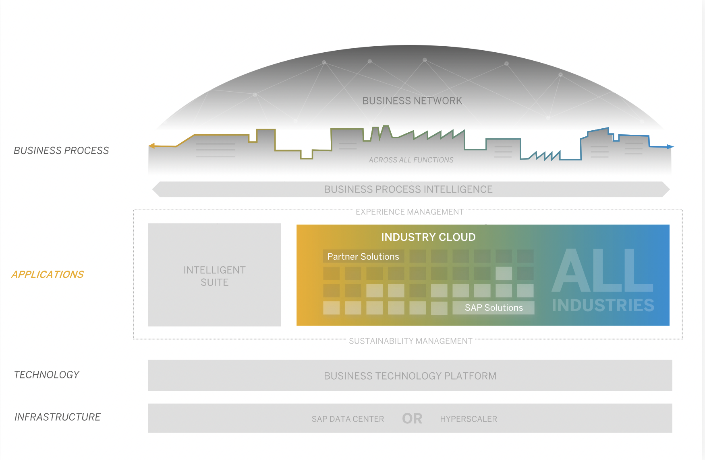
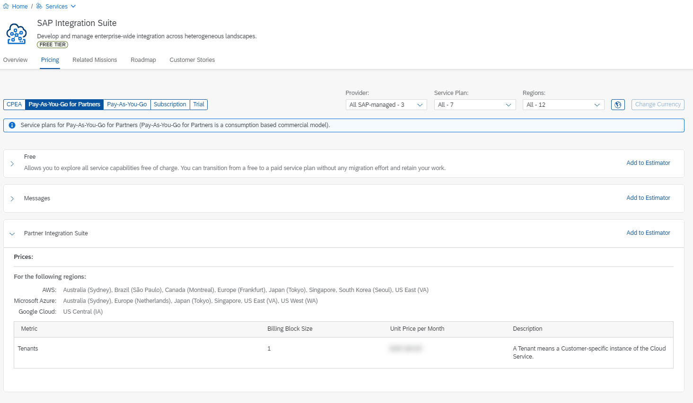

# Partners in SAP BTP Ecosystem 

To learn more about how SAP BTP is helping partners and businesses succeed, check out the [Accelerating Innovation and Time to Market with SAP BTP](https://news.sap.com/2022/04/idc-study-on-sap-btp-partners-accelerate-innovation/) article, some [recent partner success stories](https://www.sap.com/products/technology-platform/partners.html) or, if you’re interested in SAP BTP software partnership opportunities with SAP, please visit [SAP PartnerEdge, Build](https://www.sap.com/partners/partner-program/build.html) for more information. Let us also use the chance to provide you with some more input about **SAP Industry Cloud** in this context. 

## What is SAP Industry Cloud?

SAP’s industry cloud simplifies access to innovative vertical solutions across industries. Built by SAP and SAP partners on an open platform, these solutions are interoperable with SAP's intelligent suite, enabling partners to drive business transformation profitably and sustainably, seize new opportunities, and manage business disruption and changes within their industry.

Please see the diagram below for an overview of the structure of SAP Industry Cloud. And please refer [here](https://help.sap.com/docs/BTP/7db4dc653edc4597825628ba6d20a2c2/72a88b859f5e406d9cd44346b1a219fd.html?locale=en-US) for further information.

## Pay-As-You-Go for partners pricing

As an SAP partner, make sure to check out the latest SAP Discovery Center feature, which is providing **Pay-As-You-Go for Partners** pricing information. Make sure to log in to SAP Discovery Center to see the respective tab in your browser. 

## Further information

Please use the following links to find further information on the topics above:

* [sap.com - SAP PartnerEdge - Build](https://www.sap.com/partners/partner-program/build.html)
* [SAP Blog - Step-By-Step Guide to Pay-As-You-Go for Partners](https://blogs.sap.com/2021/09/21/step-by-step-guide-to-pay-as-you-go-for-partners/)
