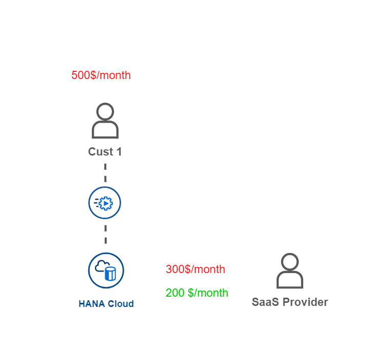
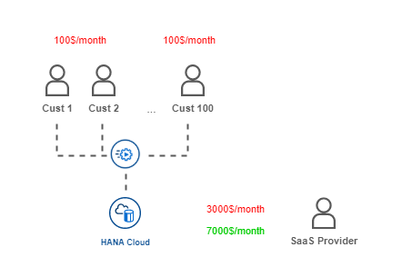

# Get the idea of a SaaS application

- **Kyma** ✅ 
- **Cloud Foundry** ✅

This part of the tutorial is to explain the ideas and advantages of **Software as a Service (SaaS)** applications. You might have heard of SaaS in combination with other abbreviations like **IaaS** (Infrastructure as a Service) and **PaaS** (Platform as a Service). Without the intention to cover all these topics in the greatest detail, let's at least try to cover the basics here. For more information please feel free to consult your favorite search engine provider, which will deliver a ton of results for the search terms above. 

SaaS applications are part of our daily life and not just in a B2B world but also in B2C environments. If you think of subscription services like Office365 which is used by a lot of private customers, this is a perfect example of Software as a Service in which Microsoft provides you the well-known Microsoft Office tools as web applications (and as a desktop version if you like). All you need to do is sign up for an account and you're ready to go. No installation, configuration, or updates are required. So let's see how the idea of SaaS evolved throughout the last years. 

While 15 years ago, most SAP customers hosted ECC systems on their servers, this paradigm is shifting. Especially with affordable offerings of hyperscaler companies like Amazon, Microsoft, or Google, it becomes more and more lucrative for businesses to outsource the hosting of their systems like SAP S/4HANA to infrastructure providers. These **Infrastructure as a Service** providers can offer cheap alternatives by hosting thousands of servers in their data centers, and also taking away the pain of handling low-level infrastructure tasks like Network or Storage requirements. While IaaS is a huge business and gives companies across the globe great flexibility in designing their IT landscape, it still requires a comparable high effort for a lot of scenarios that can be standardized. 

Let's take extension requirements in a customer's SAP landscape for example. Let's assume you want to extend a standard SAP S/4HANA app, you might probably need some kind of persistency, a service managing your events, a development tool for your team, and all services required by a professional app like Runtime, Logging, Alerts, Security and more. Setting up all these requirements in an IaaS environment for each new extension application would be quite some overhead. For this reason, the idea of **Platform as a Service (PaaS)** was born. PaaS offerings often provide very broad features and tools, that allow you to focus on specific tasks, without dealing with the requirement to set up lower or medium-level requirements. This might reach from Storage or Networking requirements, up to managed Databases or Operating systems. With the PaaS provider being responsible for all these components, the developers can fully concentrate on their actual job of developing the extension application instead of caring about the required technology stack (which is almost equal for each app). 

The final evolution of the **as a Service** concept is **Software as a Service** (SaaS). Compared to IaaS and PaaS, in this scenario, a customer does not get in touch with the underlying platform or infrastructure anymore. Ideally, a SaaS Consumer doesn't even know or is interested in the details of the technology stack but is just interested in using a highly standardized software product, fulfilling a specific purpose. Compared to IaaS or SaaS, the flexibility in this scenario is very limited, on the other side, the maintenance for a consumer is almost zero, as almost all reliability is with the SaaS provider. Is it updates to the databases, deployment of new releases, scaling of the solutions, fixing bugs, or anything else on the infrastructure and platform level. 

SAP S/4HANA Cloud is a perfect example of such a SaaS application in a B2B context. SAP's S/4HANA Cloud customers don't have to deal with hosting, updates, bugfixes, or any cumbersome system management tasks anymore. All of this is taken care of by SAP, which is a huge relief for many customers nowadays. On the other side, the customizing features are extremely limited compared to an SAP S/4HANA On Premise system. The reason for that is very simple. A SaaS offering is only profitable for the SaaS provider if further licenses can be sold with minimal marginal costs per instance. So imagine selling a thousand SAP S/4HANA Cloud instances and allowing all consumers to adapt ABAP code on a low level, a collective update of all instances will be almost impossible. This is why SaaS applications are usually very restricted in customizing features allowing a stable core application that can be easily hosted, updated, and maintained. This price advantage can then be handed on to the SaaS customer, profiting from unbeatable prices compared to a self-hosted system instance. 

This is why the topic of Software as a Service gains more and more interest in a B2B context and also SAP offers its customers and partners great ways to develop and sell SaaS applications built on the SAP Business Technology platform. While partners and customers in former times had to deploy their applications manually to the SAP servers of their customers, they can now use the features and possibilities of SAP BTP and provide their software to thousands of SAP consumers with just a few clicks. 

Just imagine how many SAP customers out there might be interested in a SaaS offering that connects to their SAP S/4HANA on Premise or S/4HANA Cloud Solution and improves the long-missed feature of having a nice app to analyze your environmental footprint based on SAP standard tables? For just a few dollars per month and user maybe? Without the need to develop anything on the customer side and be constantly updated to the latest regulatory requirements? Wow, this sounds like a super feasible and cheap option for all SAP customers being required to report to regulatory bodies. For sure, the provider of such a SaaS application will have a considerable effort of maintaining such a SaaS offering and keeping it up to date, but imagine one day 1000 companies subscribe to your app for on average 10 users per month? And you charge them 10 dollars per user... That will be 100000 dollars per month and 1200000 dollars per year. Wow! What a business model! 

So you might now ask yourself, okay sounds good but still as a SaaS provider I need to pay for the Platform or Infrastructure resources. Which sense does it make if I make a million bugs per year but need to pay 90% of this money for the infrastructure used by my SaaS application? Well, this is the point where multitenancy comes into play and makes the Software as a Service concept even more powerful. 

## SaaS and multitenancy

For sure there are a lot of examples in which it makes sense to provide a Software as a Service application in a single-tenant setup, which would mean that you deploy a separate application instance to a dedicated landscape, which is not being shared with other Consumer tenants. This means for example a dedicated database or dedicated runtime memory for your SaaS consumers. 

> The single consumer in this scenario pays 500\$ per year for the SaaS subscription. The SaaS provider is charged 300\$ for the dedicated SAP HANA Cloud instance and some GBs of runtime. All in all, the provider is left with a profit of 200\$.  

While such a setup might be required for certain scenarios (e.g. high-risk customers) in most scenarios it makes sense to share resources (like an SAP HANA Cloud database) between multiple consumer tenants. If you design your SaaS application to support multitenancy, this means a great advantage for your TCO as a SaaS provider. While the SaaS consumer doesn't even notice that resources are shared in the background, you can for example safely store the data of 1000 consumer Tenants on the same database. In case of an SAP HANA Cloud database, this will reduce the costs of a powerful in-memory system to a minimum for each of the 1000 consumers making the concept very profitable for both sides. 

> In this scenario, 100 consumers pay 100$ per year for the SaaS subscription (= 10.000\$). The SaaS provider is charged 3.000\$ for a large SAP HANA Cloud instance and the necessary runtime memory. All in all, the provider is left with a profit of 7.000\$.  

This is why as a SaaS provider (especially if you're relying on powerful and expensive services) on SAP BTP, you should always make sure to design your SaaS application multitenant enabled. A lot of services and frameworks on SAP BTP are usable in multitenant scenarios like SAP HANA Cloud, XSUAA, SAP Event Mesh, Destination Service, or the SAP CAP framework. This allows you to develop powerful applications on the SAP BTP platform by leveraging the integration capabilities with your consumer's On-Premise or Cloud SAP landscape. 

## Further information

Please use the following links to find further information on the topics above:

* [SAP Blogs - Fundamentals of Multitenancy in SAP BTP](https://blogs.sap.com/2022/08/27/fundamentals-of-multitenancy-in-sap-btp/)