# Introduction to the Basic Version

- **Kyma** ✅ 
- **Cloud Foundry** ✅

The **Basic Version** of the sample application will provide you with the core elements required for a Software as a Service (SaaS) application on SAP Business Technology Platform (SAP BTP). 

- [Introduction to the Basic Version](#introduction-to-the-basic-version)
  - [1. Step-by-Step](#1-step-by-step)
  - [2. Version Features](#2-version-features)
  - [3. Results](#3-results)

You can set up the **Basic Version** in any **SAP BTP, Kyma** or **Cloud Foundry** environment using **Free (Tier) service plans** of your own **Pay-as-you-Go** (PAYG) or **CPEA** account. Check the following architectures to get an idea of the Basic Version components used in our respective **Cloud Foundry** and **Kyma** scenario:

> **Hint** - The sample application can also be deployed to **Trial** accounts, although we highly recommend to use one of the aforementioned account types. 

**Cloud Foundry**

**Kyma**

As you can see, the two architectures appear pretty much similar, still some of the services used in the Cloud Foundry Runtime, are replaced by native Kyma components in our Kubernetes-based architectures. 

This includes e.g., the Credential Store or the Autoscaler Service, where Kubernetes Secrets or Horizontal Pod Autoscalers are being used. Again, for our **Kubernetes** friends, a more detailed depiction including some of the used Kyma and native Kubernetes components:

[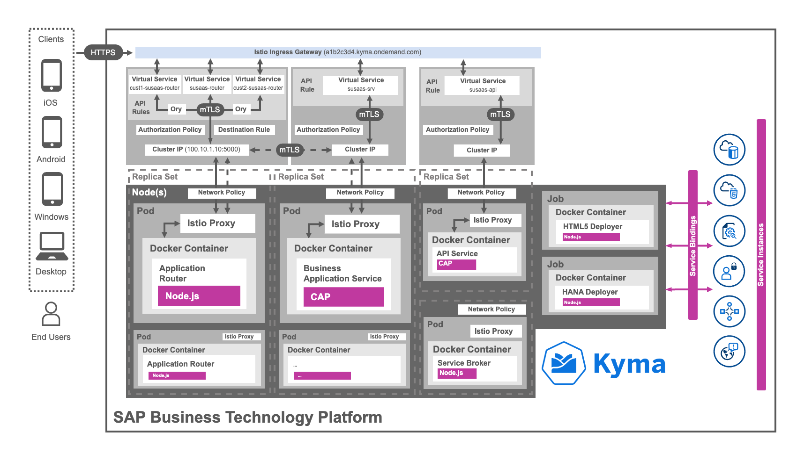](./images/App_Architecture_BasicDetails.png?raw=true)

## 1. Step-by-Step

To deploy the **Basic Version** of our SaaS application and to learn more about **Cloud Foundry**, the **Kyma Runtime** and Kubernetes please follow the steps below. 

While most of our step-by-step guides cover both runtimes, a few chapters are runtime specific as indicated in the table below. Please make sure to check the introduction of the respective step-by-step tutorials, to see whether the instructions target a certain runtime only.

|                  |                                                                                                                               |
| ---------------- | ------------------------------------------------------------------------------------------------------------------------------------------------- |
| 1 - Get started      | Start by **Understanding the repository structure**  ➜ ([click here](../1-understand-repo-structure/README.md))                                   |
|                  | **Prepare your Provider Subaccount** for deployment ➜ ([click here](../2-prepare-provider-subaccount/README.md))                                  |
| 2 - Build and Deploy | **Build and deploy** your SaaS application to Cloud Foundry ➜ ([click here](../3-cf-build-deploy-application/README.md)) (**Cloud Foundry** only) |
|                  | **Build and push** the container images of your application ➜ ([click here](../3-kyma-build-docker-images/README.md)) (**Kyma** only)             |
|                  | **Deploy** your SaaS application to Kyma using Helm ➜ ([click here](../3-kyma-deploy-application/README.md)) (**Kyma** only)                      |
| 3 - Test the app     | After deployment **subscribe a Consumer Subaccount** ➜ ([click here](../4-subscribe-consumer-subaccount/README.md))                               |
|                  | Provide sample content by **pushing data to the SaaS API** ➜ ([click here](../5-push-data-to-saas-api/README.md))                                 |
|                  | Explore the app and **test features end-to-end**  ➜ ([click here](../6-test-the-application/README.md))                                           |
| 4- Deep Dives      | Explore the **application components** in greater detail ➜ ([click here](../7-explore-the-components/README.md))                                  |
|                  | Learn about utilized **Kyma resources** and **Helm charts**  ➜ ([click here](../7-kyma-resources-helm/README.md)) (**Kyma only**)                 |
| 5 - Undeploy the app | Learn how to **unsubscribe a Consumer tenant** ➜ ([click here](../8-unsubscribe-consumer-subaccount/README.md))                                   |
|                  | **Undeploy** the SaaS application ➜ ([click here](../9-undeploy-saas-application/README.md))                                                      |

## 2. Version Features

The **Basic Version** of the sample application provides the basic implementation of a CAP-based multitenant SaaS application containing features like a

- **SAP HANA Cloud** database model to store the application or API data of all Tenants and a data model shared among all tenants.
- **CAP OData service** providing an OData v4 service for the application layer including annotations (Service Engine).
- **Fiori Elements** application based on various annotations and samples for extension options (UI Component).
- **CAP API service** providing all Tenants an interface to provide data from solutions like SAP S/4HANA (SaaS API).
- **Service Broker** allowing Tenants to create a service broker instance to access the application's API (API Broker).

Furthermore, the **Basic Version** of the application provides sample integrations and usage scenarios of SAP BTP services including 

- basic enterprise application features like
    - **Alert Notification Service** informing you about issues with your application like a crash or errors during Tenant onboarding.
    - **Autoscaling Features** scaling your SaaS application components in case of increased workload by your SaaS tenants.
    - **HTML5 Application Repository** storing and serving your static application content making your app more resilient.
- important components for SaaS usage like
    - **SAP HANA Cloud** allowing you to use the powerful container concept for Tenant separation on the same database.
    - **Service Manager** which is responsible for handling a secure communication with the Tenant database containers. 
    - **Application Router** which is one of the key pillars in handling the multitenancy features of your SaaS application.
- Authorization & Trust Management service instances of
    - **application** plan which handles the XSUAA-based application authentication and authorization of all tenants.
    - **broker** plan which takes care of the XSUAA-based API access security requirements for all tenants.

As the setup includes a lot of different services and components, only the elements which are not self-explanatory will be covered in detail by this tutorial. We highly recommend checking SAP Help or related component docs (e.g., npm packages) in case you want to learn more. 

## 3. Results

The results of finishing this step-by-step tutorial will be a sample SaaS application running in your own **Cloud Foundry** environment or **Kyma Cluster** which:

- offers your Tenants a user interface to
    - **manage** the tenant-specific SaaS application **users**.
    - create **projects** and assign users as **members** to different projects.
    - setup **assessments** for analyzing product sustainability metrics.
- provides an SAP HANA Cloud HDI (*) container based **data separation** for all tenants.
- can be subscribed from subaccounts (**consumers**) in the same Global Account.
- creates a **service broker instance** for registering a **service broker** during the subscription.
- allows your Tenants to **read** and **update data** using a multitenant **API** endpoint.
- let Tenants **prefill** their assessments with data uploaded through the API.

(*) HDI - HANA Deployment Infrastructure

See the following screenshots will give you an idea of the basic application version (click to enlarge).

| [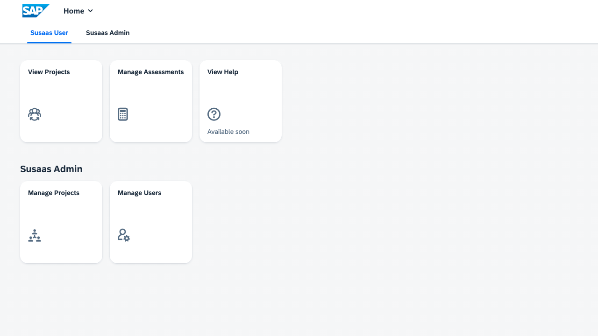](./images/App_Sample01.png?raw=true) | [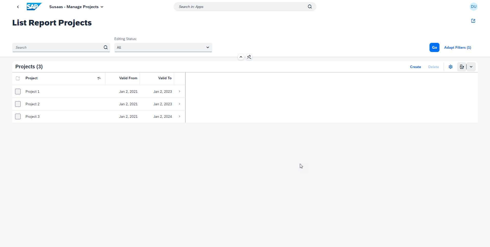](./images/App_Sample02.png?raw=true) |
| :------------------------------------------------------------------------------------------------------: | :---------------------------------------------------------------------------------------------------------: |
|                                               *Main Menu*                                                |                                               *Project List*                                                |

| [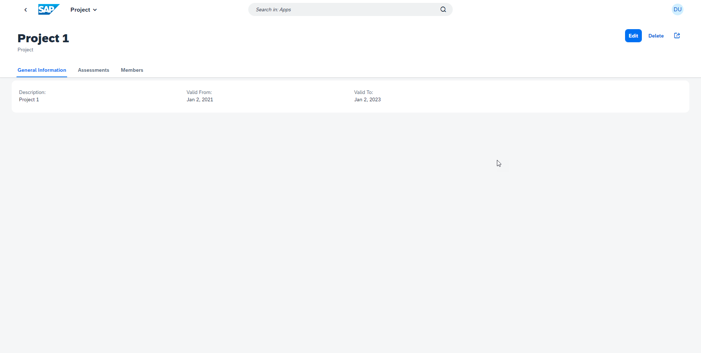](./images/App_Sample03.png?raw=true) | [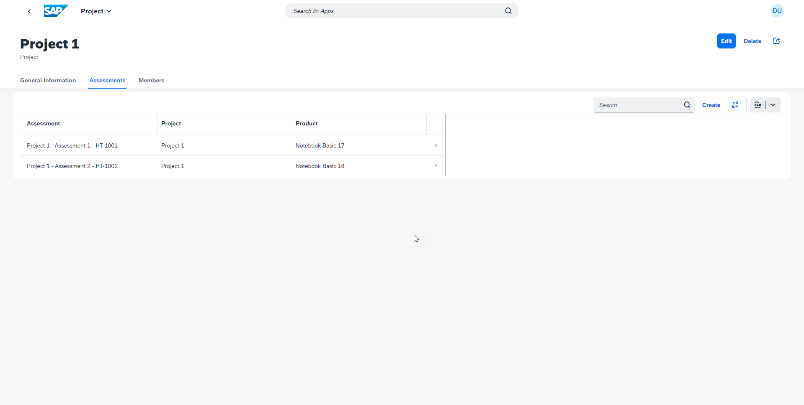](./images/App_Sample04.png?raw=true) |
| :------------------------------------------------------------------------------------------------------------: | :----------------------------------------------------------------------------------------------------------------: |
|                                               *Project Details*                                                |                                               *Project Assessments*                                                |

| [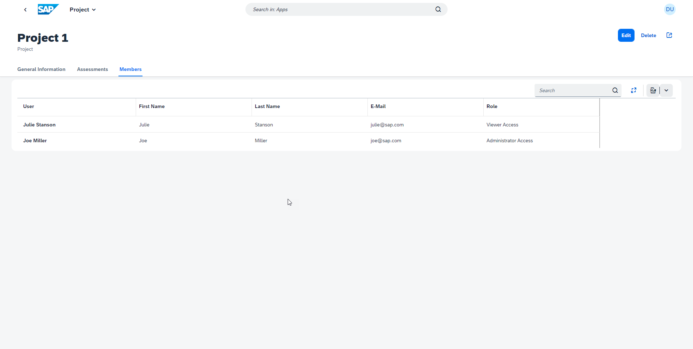](./images/App_Sample05.png?raw=true) | [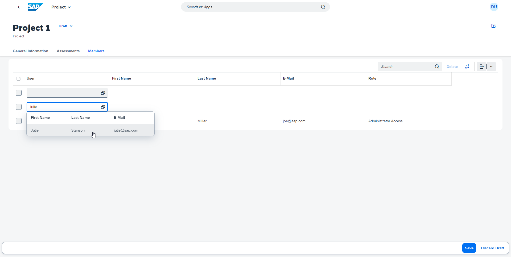](./images/App_Sample06.png?raw=true) |
| :------------------------------------------------------------------------------------------------------------: | :---------------------------------------------------------------------------------------------------------------: |
|                                               *Project Members*                                                |                                               *Add Project Member*                                                |

| [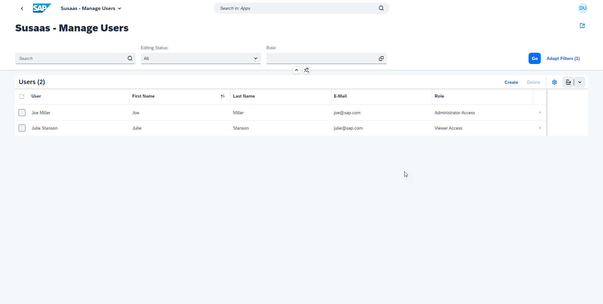](./images/App_Sample07.png?raw=true) | [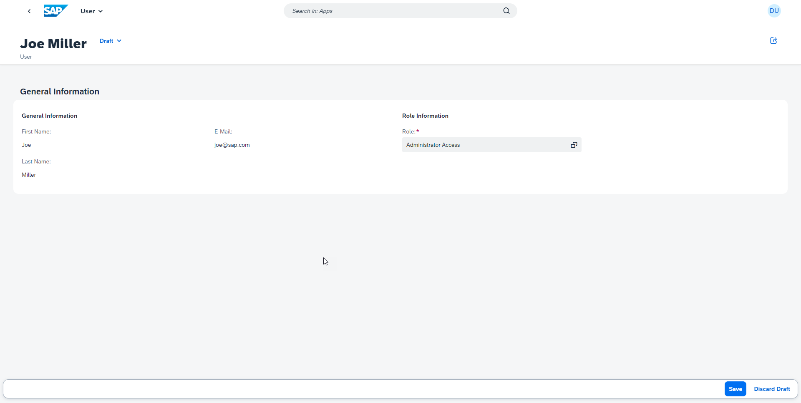](./images/App_Sample08.png?raw=true) |
| :------------------------------------------------------------------------------------------------------: | :---------------------------------------------------------------------------------------------------------: |
|                                               *User List*                                                |                                               *User Details*                                                |

| [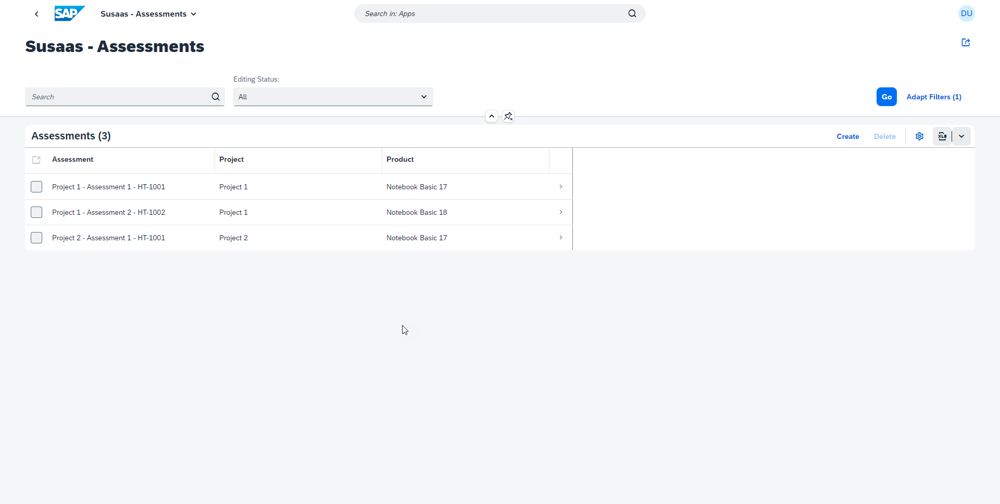](./images/App_Sample09.png?raw=true) | [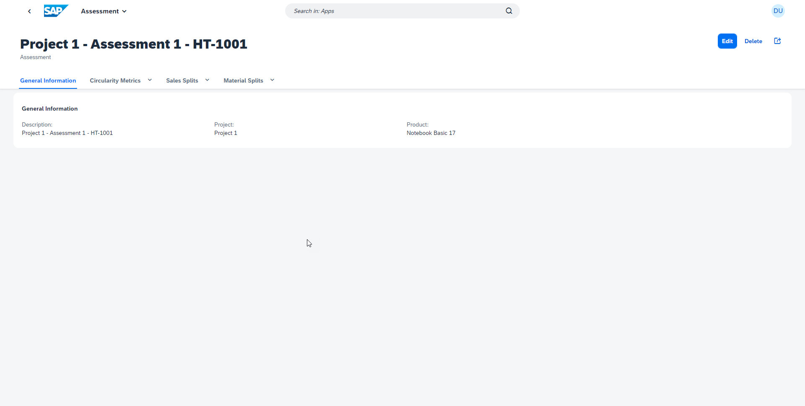](./images/App_Sample10.png?raw=true) |
| :------------------------------------------------------------------------------------------------------------: | :---------------------------------------------------------------------------------------------------------------: |
|                                               *Assessment List*                                                |                                               *Assessment Details*                                                |

| [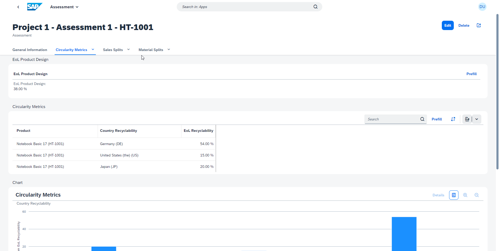](./images/App_Sample11.png?raw=true) | [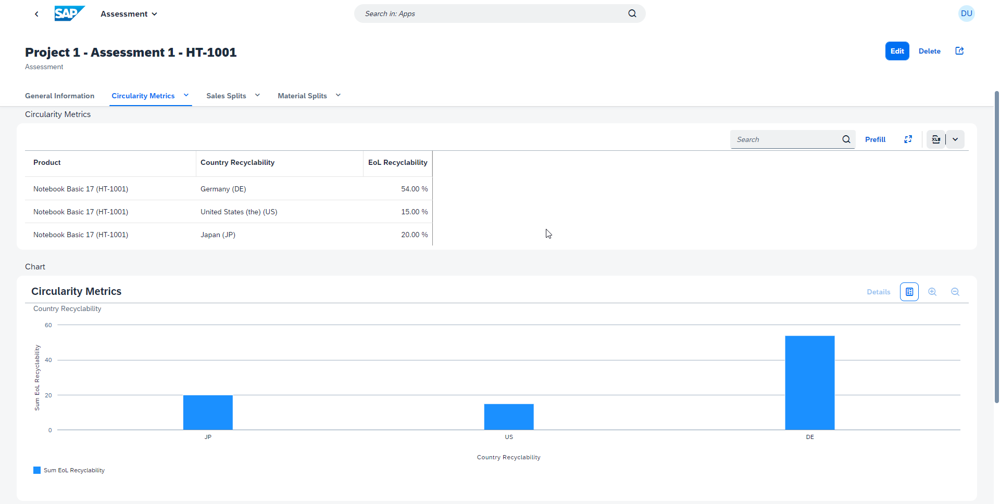](./images/App_Sample12.png?raw=true) |
| :----------------------------------------------------------------------------------------------------------------: | :---------------------------------------------------------------------------------------------------------------: |
|                                               *Circularity Metrics*                                                |                                               *Circularity Charts*                                                |

| [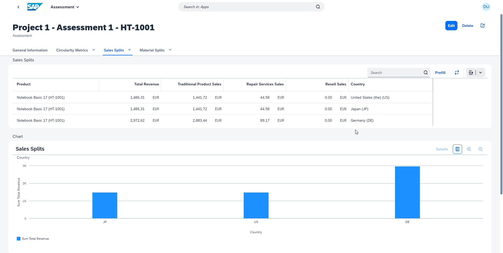](./images/App_Sample13.png?raw=true) | [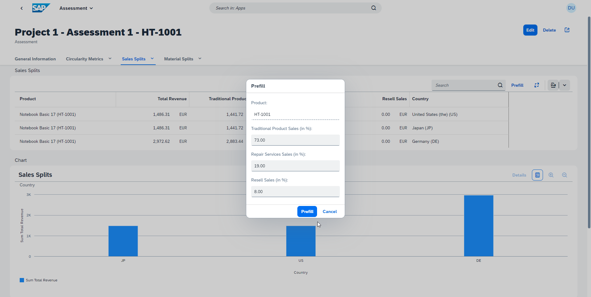](./images/App_Sample14.png?raw=true) |
| :---------------------------------------------------------------------------------------------------------: | :-----------------------------------------------------------------------------------------------------------------: |
|                                               *Sales Splits*                                                |                                               *Prefill Sales Splits*                                                |

| [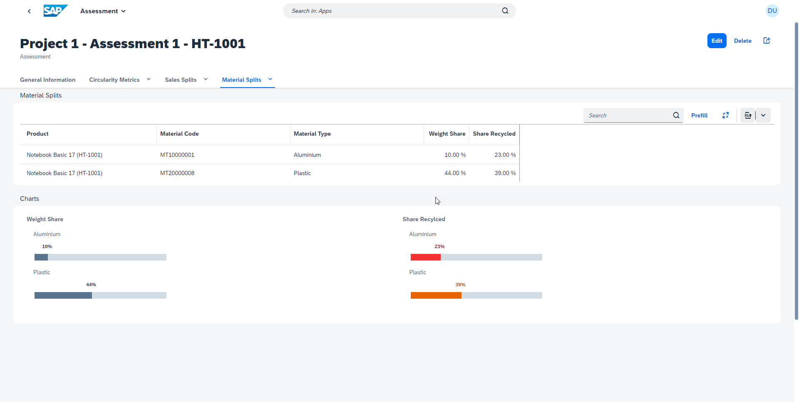](./images/App_Sample15.png?raw=true) | [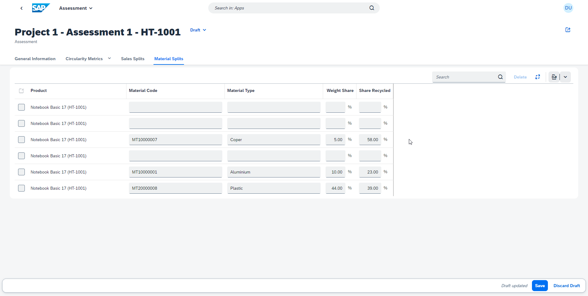](./images/App_Sample16.png?raw=true) |
| :------------------------------------------------------------------------------------------------------------: | :-------------------------------------------------------------------------------------------------------------------: |
|                                               *Material Splits*                                                |                                               *Modify Material Splits*                                                |

| [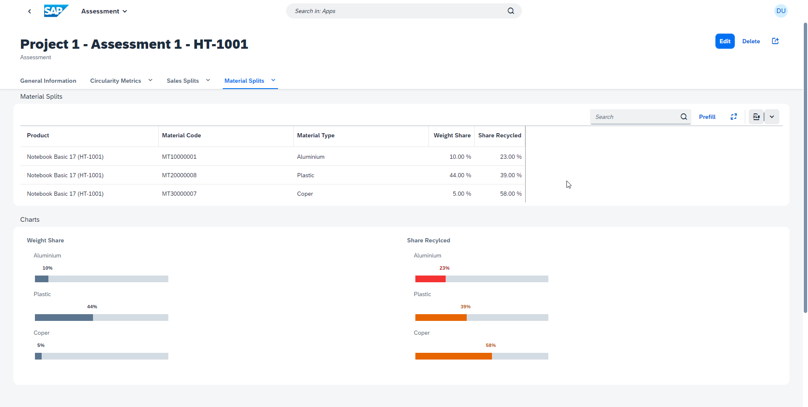](./images/App_Sample17.png?raw=true) |
| :------------------------------------------------------------------------------------------------------------: |
|                                               *Material Splits*                                                |