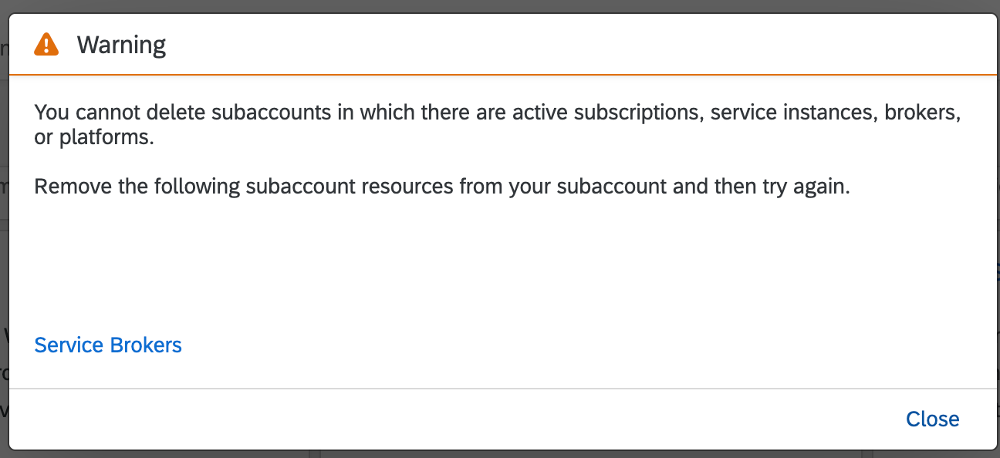
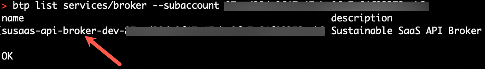

# Troubleshooting

- **Kyma** ✅ 
- **Cloud Foundry** ✅

In this section of the **Basic Version** you can find troubleshooting information that might help you in case of errors or issues. The content of this section will be continuously enhanced in the future. 

- [Troubleshooting](#troubleshooting)
  - [1. Deployment Issues](#1-deployment-issues)
  - [2. Service Broker Issues](#2-service-broker-issues)

## 1. Deployment Issues

The most probable reasons why your deployment might fail are listed below.

1.1. Make sure you have assigned all required entitlements to your provider subaccount before deploying the solution! If a certain entitlement is missing, you will face errors during deployment. You can find the required entitlements in the **Prepare your Provider Subaccount** chapter of the mission ([click here](../2-prepare-provider-subaccount/README.md)).

1.2. If the deployment logs show errors related to SAP HANA Cloud or HDI container deployment issues, make sure your SAP HANA Cloud instance is up and running. When using **Free (Tier) service plans** (e.g., hana-free), HANA Cloud is stopped automatically on a daily basis. Once restarted in SAP HANA Cloud Central, please wait a few minutes before trying a new deployment.  

1.3. If the deployment logs show errors related to the service broker, make sure you executed the required **npx** script generating a custom *catalog.json* file for your service broker and the broker credentials. Make sure to put the hashed credentials into the correct place of your mtaext file! 

```sh
  SBF_BROKER_CREDENTIALS_HASH:  >
  {
    "broker-user": "<paste your hash credentials here>"
  }
```

1.4. If the deployment fails because of service plan-related issues, you're probably deploying to an SAP BTP Trial subaccount. The default **Basic Version** deployment descriptor contains e.g., the Credential Store **free** service plan which is not available in Trial accounts. Please use the respective MTA Extension Descriptor file ([trial.mtaext](../../../deploy/cf/mtaext/trial.mtaext)) for Trial deployments to use the correct service plans (see snippet below).

```sh
ID: susaas.trial
extends: susaas

resources:
  - name: susaas-alert-notification
    parameters:
      service-plan: standard
  - name: susaas-credstore
    parameters:
      service-plan: trial
```

1.5 If you are using SAP Business Application Studio and having deployment issues because of the npm registry problem, please see this [issue](https://github.com/SAP-samples/btp-cf-cap-multitenant-susaas/issues/5).


## 2. Service Broker Issues

2.1. Make sure that you unregistered all Service Brokers before you delete your consumer subaccount. If you face the error below when trying to delete a tenant subaccount probably the reason is you still have **registered Service Brokers** in your tenant subaccount. 

> **Important** - Please do **not** use the subaccount force-delete option, if there a Service Broker is still registered in the respective subaccount!

[](./images/subaccount-delete-error.png?raw=true)

To be able to fix that issue you need to run the command in your terminal with the help of BTP CLI.

```sh
btp list services/broker --subaccount <subaccountId-of-your-tenant-subaccount>
```

[](./images/list-broker.png?raw=true)

Then run the command below to unregister from your Service Broker:
```
btp unregister services/broker --name <nameofyourbroker> --url <brokerurl> --user broker-user --password <brokerpassword>  --subaccount <subaccountId>
```

2.2. In case you already removed/uninstalled/undeployed your Service Broker application in the provider subaccount, you will not be able to delete an abandoned Service Broker registration in your consumer subaccounts. In that case, make sure to deploy your solution incl. the Service Broker application again before manually attempting to unregister the Service Broker as described in 2.1.
