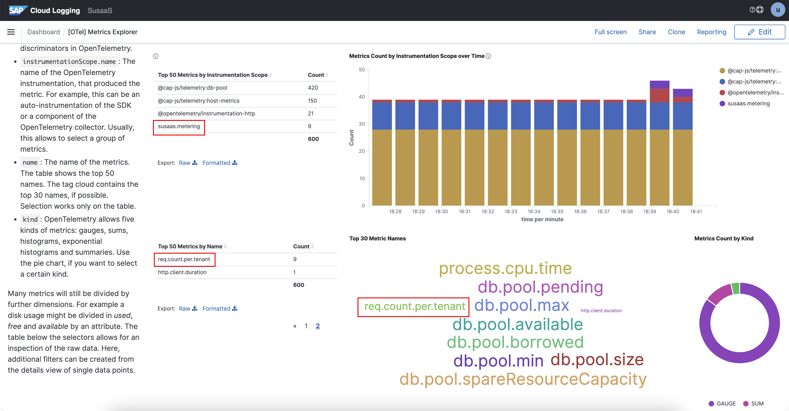
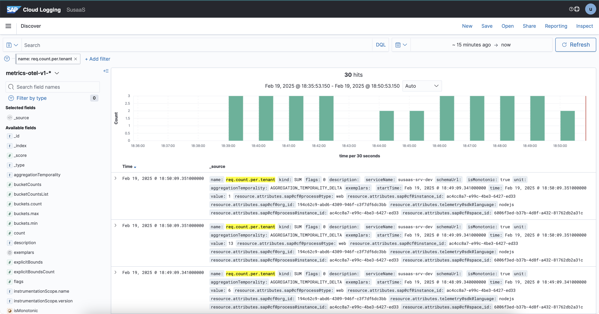
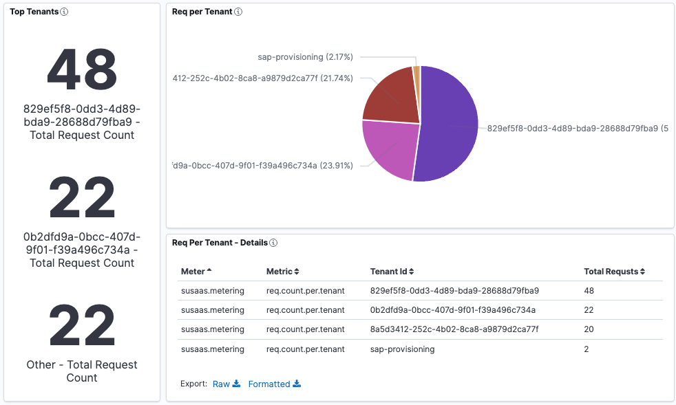

# Create a Custom Metric

- **Kyma** ✅ 
- **Cloud Foundry** ✅

This part of the tutorial will provide deeper insights into creating a custom metric and explore the metric in SAP Cloud Logging service. 

## Steps

Follow these steps to create a custom metric that counts the number of requests to the service for each tenant, and then display the metric in the SAP Cloud Logging service.
- Add below code in [server.js](../../../code/srv/srv/server.js) file to create a custom metric and update the metric value for each request.
  ```js
  const { metrics } = require('@opentelemetry/api');
  let counterRequestCountByTenant;

  // Initialise 'Request Count by Tenant' Custom Counter
  cds.on('listening', () => {  
      counterRequestCountByTenant = metrics.getMeter('susaas.metering').createCounter('req.count.per.tenant');
  })

  // Add Middleware to update the 'Request Count by Tenant' Custom Counter
  cds.middlewares.add((req, _, next) => {
      counterRequestCountByTenant.add(1, { 'susaas_tenant_id': cds.context.tenant })
      next()
  })
  ```
  Explanation: In the above code, first, a custom counter is initialized with the name **_req.count.per.tenant_** once the server is ready and is listening to incoming erquests. Then, a middleware is added to the application to update the counter value for each request. The counter value is incremented by 1 for each request, and the tenant ID is used as a label to differentiate the requests from different tenants.
- Once the code is added, build and deploy the application. Then you can explore the custom metric in the SAP Cloud Logging service.
- Custom metric is automatically part of the OpenTelemetry explorer dashboard in the SAP Cloud Logging service.     
  [](./images/cls-dashboard-ot-custom-metric-1.png?raw=true)
- Similarly, you can explore more details about custom metric using '**_metrics-otel-v1-*_**' data source.     
  [](./images/cls-dashboard-ot-custom-metric-2.png?raw=true)
- Lastly, you can also create a custom dashboard and visualization using the custom metric.    
  [](./images/cls-dashboard-ot-custom-metric-3.png?raw=true)


## Further information

Please use the following links to find further information on the topics above:
* [CAP - Lifecycle Events - listening](https://cap.cloud.sap/docs/node.js/cds-server#listening)
* [CAP - CDS Middlewares](https://cap.cloud.sap/docs/node.js/cds-serve#cds-middlewares)
* [OpenTelemetry API - Counter](https://opentelemetry.io/docs/specs/otel/metrics/api/#counter)