# Kyma - Observability with Cloud Logging Service

- **Kyma** ✅ 
- **Cloud Foundry** ❌

**Important** - This part of the tutorial is required for **Kyma** deployments only!

In this tutorial, You will also learn how to ship logs, traces, and metrics from your saas application to the SAP Cloud Logging service using the Telemetry plugin.

- [Kyma - Observability with Cloud Logging Service](#kyma---observability-with-cloud-logging-service)
  - [1. Introduction to SAP Cloud Logging Service](#1-introduction-to-sap-cloud-logging-service)
  - [2. Add Observability with Telemetry plugin](#2-add-observability-with-telemetry-plugin)
  - [3. Deploy and Integrate to Cloud Logging.](#3-deploy-and-integrate-to-cloud-logging)
  - [4. Further information](#4-further-information)  

## 1. Introduction to SAP Cloud Logging Service
[SAP Cloud Logging](https://discovery-center.cloud.sap/index.html#/serviceCatalog/cloud-logging) service is an instance-based observability service that builds upon OpenSearch to store, visualize, and analyze application logs, metrics, and traces from SAP BTP Cloud Foundry, Kyma, Kubernetes and other runtime environments. For Cloud Foundry and Kyma, it offers an easy integration by providing predefined contents to investigate load, latency, and error rates of the observed applications based on their requests and correlate them with additional data.

The SAP Cloud Logging service offers multiple service plans (e.g., Standard, Large, and Dev) to cater to different use cases and requirements. These plans provide different ingestion and storage capabilities. For example:
- Standard/Large plans are designed for production workloads, supporting higher data volumes and extended retention.
- Dev plan is only for non-production environments and evaluation purposes which lacks cloud qualities.

For more information, see the [SAP Cloud Logging](https://help.sap.com/docs/SAP_CLOUD_LOGGING/454331d80e3b42b1804d83a672cf098b/what-is-sap-cloud-logging?locale=en-US&state=PRODUCTION&version=Cloud) and its [plans](https://help.sap.com/docs/SAP_CLOUD_LOGGING/454331d80e3b42b1804d83a672cf098b/service-plans?locale=en-US&state=PRODUCTION&version=Cloud) documentation. You can also check the [service innovation guide](https://community.sap.com/t5/technology-blogs-by-sap/from-application-logging-to-cloud-logging-service-innovation-guide/ba-p/13938380) to understand the innovation journey from SAP Application Logging Service towards SAP Cloud Logging Service and its benefits.

## 2. Add Observability with Telemetry plugin
The [Telemetry (@cap-js/telemetry) plugin](https://github.com/cap-js/telemetry) provides observability features such as tracing and metrics, including [automatic OpenTelemetry instrumentation](https://opentelemetry.io/docs/concepts/instrumentation/zero-code/). By enabling the plugin in your project, various kinds of telemetry data will be automatically collected.

Let's add the Telemetry plugin to the project and enable it by customizing few configurations. 

- Switch to **_code_** directory and install dependencies
  ```bash
  ## Run in ./code ##
  npm i @cap-js/telemetry @grpc/grpc-js @opentelemetry/exporter-metrics-otlp-grpc@0.57.2 @opentelemetry/exporter-trace-otlp-grpc@0.57.2 @opentelemetry/host-metrics @opentelemetry/exporter-logs-otlp-grpc@0.57.2
  ``` 
- Add following configuration under **_requires_** key in both [code/srv/.cdsrc.json](../../../code/srv/.cdsrc.json) and [code/api/.cdsrc.json](../../../code/api/.cdsrc.json) file folder.
  ```json
  "telemetry": {
    "[hybrid]": {
      "kind": "telemetry-to-cloud-logging"
    },
    "[local-with-mtx]": {
      "kind": "telemetry-to-console"
    },
    "[development]": {
      "kind": "telemetry-to-console"
    }
  }
  ```
- Test your application locally by following steps in [section 1](../../4-expert/local-hybrid-development/README.md#1-running-the-multitenant-application-locally-susaas-srv) to see the telemetry in the console.
- This should show traces and metrics data (also refferred to as signals) in the console as shown below:    

  - **_Traces_**:   
    Traces allow you to analyze how a request, message, task, etc. is being processed by your application. It provides a detailed view of the flow of the request and the time taken by each operation.    
    [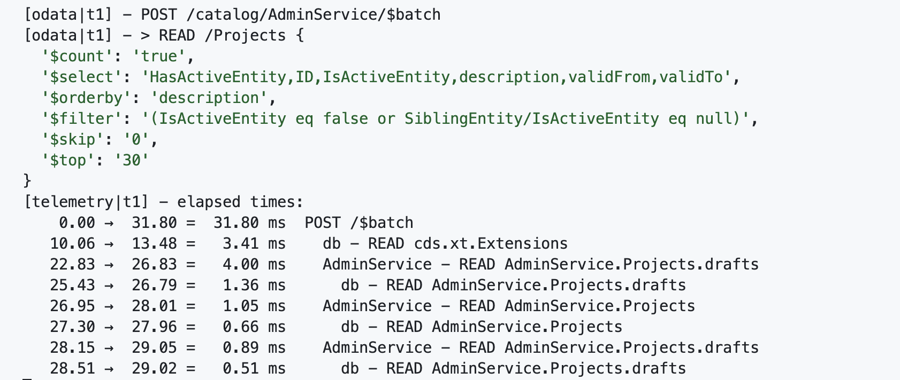](./images/local-trace.png?raw=true)    

  - **_Metrics_**:    
    Metrics are measurements captured at runtime. It helps you to understand health and performance of the application.   

    Out of the box, @cap-js/telemetry offers HTTP metric [http.server.duration](https://opentelemetry.io/docs/specs/semconv/http/http-metrics/#metric-httpserverrequestduration) which measures different values like minimum/maximum response time, total duration across requests, distribution of request durations etc. It helps analyze performance, detect bottlenecks, and optimize response times.      
    [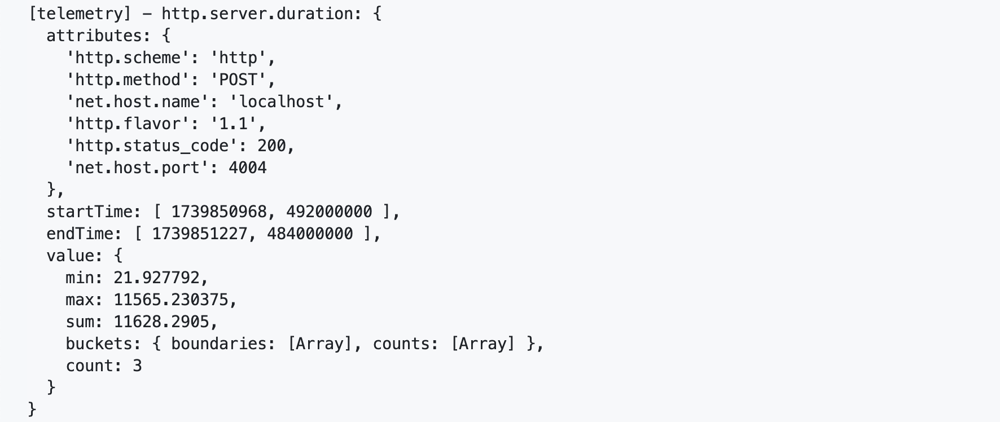](./images/local-metrics-1.png?raw=true)     
    <br/>
    Additionally, @cap-js/telemetry instantiates and provides host metrics like cpu usage and memory usage etc ([@opentelemetry/host-metrics](https://www.npmjs.com/package/@opentelemetry/host-metrics)).       
    [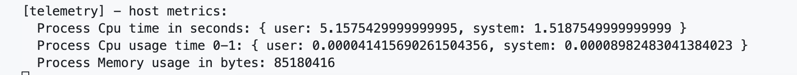](./images/local-metrics-2.png?raw=true)

## 3. Deploy and Integrate to Cloud Logging.
- **Prepare for Deployment**
  - Ensure that you have installed following dependencies in your project (check in [code/package.json](../../../code/package.json)).
    ```bash
    ## Run in ./code ##
    npm i @cap-js/telemetry @grpc/grpc-js @opentelemetry/exporter-metrics-otlp-grpc@0.57.2 @opentelemetry/exporter-trace-otlp-grpc@0.57.2 @opentelemetry/host-metrics @opentelemetry/exporter-logs-otlp-grpc@0.57.2
    ```
  - Add following configuration under **_requires_** key in both [code/srv/srv/.cdsrc.json](../../../code/srv/srv/.cdsrc.json) and [code/api/srv/.cdsrc.json](../../../code/api/srv/.cdsrc.json) file.      
    ```json
    "telemetry": {
      "kind": "to-otlp"
    } 
    ```    
  - Enable otlp config under global in helm chart as shown below in [/charts/sustainable-saas/Values.yaml](../../../deploy/kyma/charts/sustainable-saas/values.yaml)
    ```yaml
    ## setting enabled: true ##
    otlp:
      metrics:
        enabled: true
        endpoint: http://telemetry-otlp-metrics.kyma-system.svc.cluster.local:4317
      traces:
        enabled: true
        endpoint: http://telemetry-otlp-traces.kyma-system.svc.cluster.local:4317
    ```
  - Build and Deploy your application.
- Enable telemetry module in your Kyma cluster. For details, see [Adding and Deleting a Kyma Module](https://help.sap.com/docs/btp/sap-business-technology-platform/enable-and-disable-kyma-module).
  [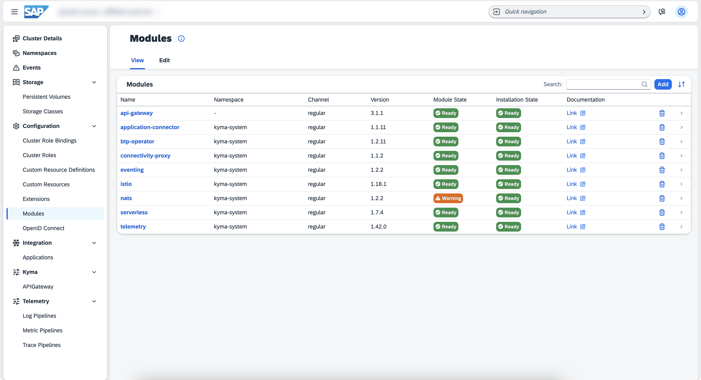](./images/telemetry-module.png?raw=true)

  - The Telemetry module focuses only on the signals of application logs, distributed traces, and metrics. Other kinds of signals are not considered. Also, audit logs are not in scope.
  - The telemetry module ships a kubernetes operator [Telemetry Manager](https://help.sap.com/docs/btp/sap-business-technology-platform/telemetry-manager) as its core component. Telemetry Manager manages the whole lifecycle of all other components covered in the telemetry module. Telemetry Manager watches module configuration for changes and sync the module status to it. It also watches for the user-created Kubernetes resources: LogPipeline, TracePipeline, and MetricPipeline. In these resources, you specify what data of a signal type to collect and where to ship it. For more details, see [Module Lifecycle](https://help.sap.com/docs/btp/sap-business-technology-platform/telemetry-manager#module-lifecycle).
  - If Telemetry Manager detects a configuration, it deploys the related [gateway components](https://help.sap.com/docs/btp/sap-business-technology-platform/telemetry-gateways) and [agent components](https://help.sap.com/docs/btp/sap-business-technology-platform/kyma-telemetry-module#:~:text=Telemetry%20Gateways.-,Log%20Agent,-The%20log%20agent) accordingly and keeps them in sync with the requested pipeline definition. For more details see [Architecture](https://help.sap.com/docs/btp/sap-business-technology-platform/kyma-telemetry-module#architecture) of the telemetry module.
- **Service Instance Creation / Binding**   
  There are multiple methods to create an instance of the SAP Cloud Logging service as follows.     
    - [Create an SAP Cloud Logging Instance through SAP BTP Cockpit](https://help.sap.com/docs/SAP_CLOUD_LOGGING/d82d23dc499c44079e1e779c1d3a5191/create-sap-cloud-logging-instance-through-sap-btp-cockpit)     
    - [Create an SAP Cloud Logging Instance through Cloud Foundry CLI](https://help.sap.com/docs/SAP_CLOUD_LOGGING/d82d23dc499c44079e1e779c1d3a5191/create-sap-cloud-logging-instance-through-cloud-foundry-cli)     
    - [Create an SAP Cloud Logging Instance through SAP BTP CLI](https://help.sap.com/docs/SAP_CLOUD_LOGGING/d82d23dc499c44079e1e779c1d3a5191/create-sap-cloud-logging-instance-through-sap-btp-cli)  
    - [Create an SAP Cloud Logging Instance through SAP BTP Service Operator](https://help.sap.com/docs/cloud-logging/cloud-logging/create-sap-cloud-logging-instance-through-sap-btp-service-operator?version=Cloud)

  Preferred approach for Kyma environment would be to use BTP Service Operator. It helps in creating necessary secrets and also telemetry module intelligently rortates and switches to new credentials without any action from developer.
  - [cls-instance-binding.yaml](../../../deploy/kyma/cls/cls-instance-binding.yaml)
    ```cmd
    ## Run in ./deploy/kyma ##
    kubectl apply -f ./cls/cls-instance-binding.yaml
    ```
- **Enable Configurations in Kyma and Ship Logs, Traces, Metrices to SAP Cloud Logging**  
  - **_Ship application logs:_**
    Application running in Kyma runtime will send logs to stdout or stderr. To ship these logs to SAP Cloud Logging a LogPipeline (customer resources) needs to be created. The Telemetry module based on the LogPipeline details will capture and ship them to SAP Cloud Logging. 
     ```cmd
    ## Run in ./deploy/kyma ##
    kubectl apply -f ./cls/logpipeline-app-logs.yaml
    ```
    You can check the status of pipeline whether telemetry flow is healthy. 
    [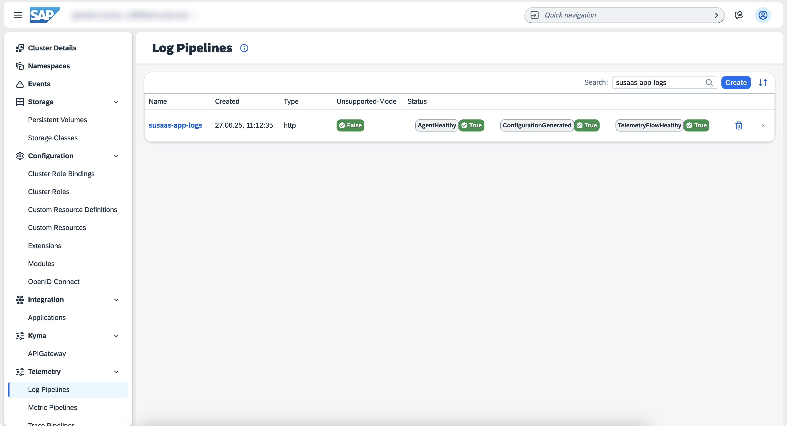](./images/logpipeline-status.png?raw=true)
    ```yaml
    ## logpipeline-app-logs.yaml ##
    apiVersion: telemetry.kyma-project.io/v1alpha1
    kind: LogPipeline
    metadata:
      name: susaas-app-logs
    spec:
      input:
        application:
          containers:
            exclude:
              - istio-proxy
          namespaces:
            include:
              - susaas
      output:
        http:
          dedot: true
          host:
            valueFrom:
              secretKeyRef:
                name: susaas-logging
                namespace: susaas
                key: ingest-mtls-endpoint
          tls:
            cert:
              valueFrom:
                secretKeyRef:
                  name: susaas-logging
                  namespace: susaas
                  key: ingest-mtls-cert
            key:
              valueFrom:
                secretKeyRef:
                  name: susaas-logging
                  namespace: susaas
                  key: ingest-mtls-key
          uri: /customindex/kyma
    ```
    This will push all application logs within susaas namespace to logs-json-kyma-* index pattern. Note that the logs will be automaically filled with tenant id. Also in above configuration, you can specify input details to control log shipping from selected applications, containers, and namespaces.
    [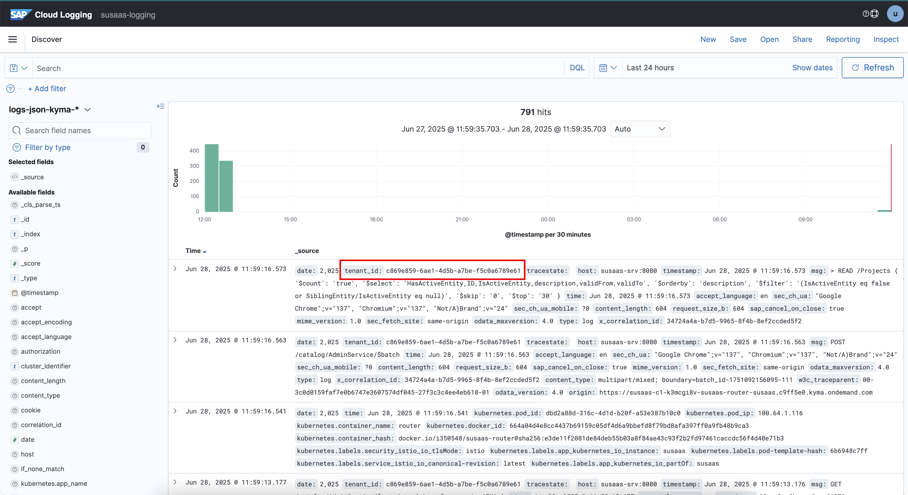](./images/logs-json-kyma.png?raw=true)
  - **_Ship istio access logs_**
    Istio access logs provide fine-grained details about the traffic when accessing the workloads. The Istio access logs provide useful information relating to 4 golden signals, such as latency, traffic, errors, and saturation as well as any troubleshooting anomalies.
    ```cmd
    ## Run in ./deploy/kyma ##
    kubectl apply -f ./cls/istio-trace-default.yaml
    kubectl apply -f ./cls/logpipeline-istio-logs.yaml
    ```
    ```yaml
    ## istio-trace-default.yaml ##
    apiVersion: telemetry.istio.io/v1alpha1
    kind: Telemetry
    metadata:
      name: istio-trace-default
      namespace: susaas
    spec:
      accessLogging:
      - providers:
        - name: stdout-json
    ```
    The Istio setup shipped with the Istio module provides a pre-configured extension provider for access logs, which configures the Istio proxies to print access logs to stdout using the JSON format. Above config enables istio access log for the namespace susaas. Hwoever, It is also possible to have fine grained configuration. See more details on [Configure Istio Access Logs](https://help.sap.com/docs/btp/sap-business-technology-platform/configuring-istio-access-logs)
    
    To send access logs to SAP Cloud Logging following LogPipeline needs to be created. 
    ```yaml
    ## logpipeline-istio-logs.yaml ##
    apiVersion: telemetry.kyma-project.io/v1alpha1
    kind: LogPipeline
    metadata:
      name: susaas-istio-logs
    spec:
      input:
        application:
          keepAnnotations: true
          containers:
            include:
              - istio-proxy
          namespaces:
            include:
              - susaas
      output:
        http:
          dedot: true
          host:
            valueFrom:
              secretKeyRef:
                name: susaas-logging
                namespace: susaas
                key: ingest-mtls-endpoint
          tls:
            cert:
              valueFrom:
                secretKeyRef:
                  name: susaas-logging
                  namespace: susaas
                  key: ingest-mtls-cert
            key:
              valueFrom:
                secretKeyRef:
                  name: susaas-logging
                  namespace: susaas
                  key: ingest-mtls-key
          uri: /customindex/istio-envoy-kyma
    ```
    There are pre-build visulization available to analyze the data such as _**Four Golden Signals**_ (i.e. Latency, Traffic, Errors, and Saturation). 
    [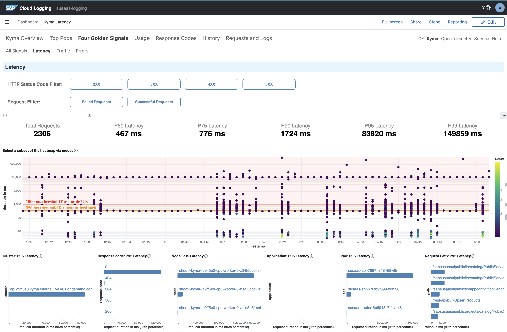](./images/kyma-fgs-latency.png?raw=true) 
    [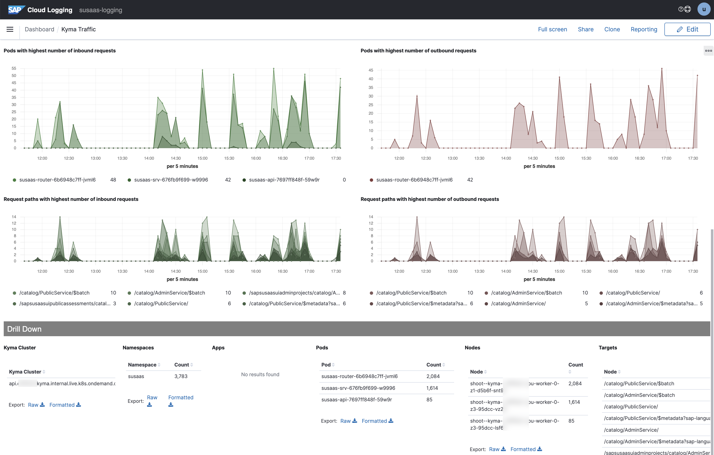](./images/kyma-fgs-traffic.png?raw=true) 
    [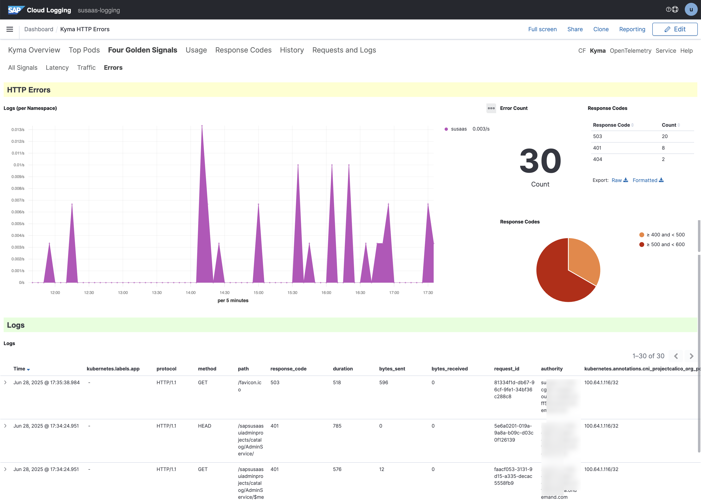](./images/kyma-fgs-errors.png?raw=true)  
  - **_Ship Trace Details_**
    ```yaml
    ## istio-trace-default.yaml ##
    apiVersion: telemetry.istio.io/v1alpha1
    kind: Telemetry
    metadata:
      name: istio-trace-default
      namespace: susaas
    spec:
      accessLogging:
      - providers:
        - name: stdout-json
      tracing:
      - providers:
        - name: "kyma-traces"
        randomSamplingPercentage: 10.0
    ```
    With this configuration, you enable tracing 10% of all requests that enter the Kyma workload within susaas namespace via Istio Service mesh. To optimize resource and network usage, it is important to set the sampling percentage value to a sensible default.

    To ship trace logs to SAP Cloud Logging following TracePipeline needs to be created.
    ```cmd
    ## Run in ./deploy/kyma ##
    kubectl apply -f ./cls/tracepipeline-app-traces.yaml
    ```
    ```yaml
    ## tracepipeline-app-traces.yaml ##
    apiVersion: telemetry.kyma-project.io/v1alpha1
    kind: TracePipeline
    metadata:
      name: susaas-traces
    spec:
      output:
        otlp:
          endpoint:
            valueFrom:
              secretKeyRef:
                name: susaas-logging
                namespace: susaas
                key: ingest-otlp-endpoint
          tls:
            cert:
              valueFrom:
                secretKeyRef:
                  name: susaas-logging
                  namespace: susaas
                  key: ingest-otlp-cert
            key:
              valueFrom:
                secretKeyRef:
                  name: susaas-logging
                  namespace: susaas
                  key: ingest-otlp-key
    ```
    Telemetry Manager configures the gateway according to the TracePipeline resource, including the target backend for the trace gateway.The trace gateway sends the data to the observability system that’s specified in your TracePipeline resource. 
    You can find traces of a request in SAP Cloud Logging by following steps:
    - Get the request id from network details:
      [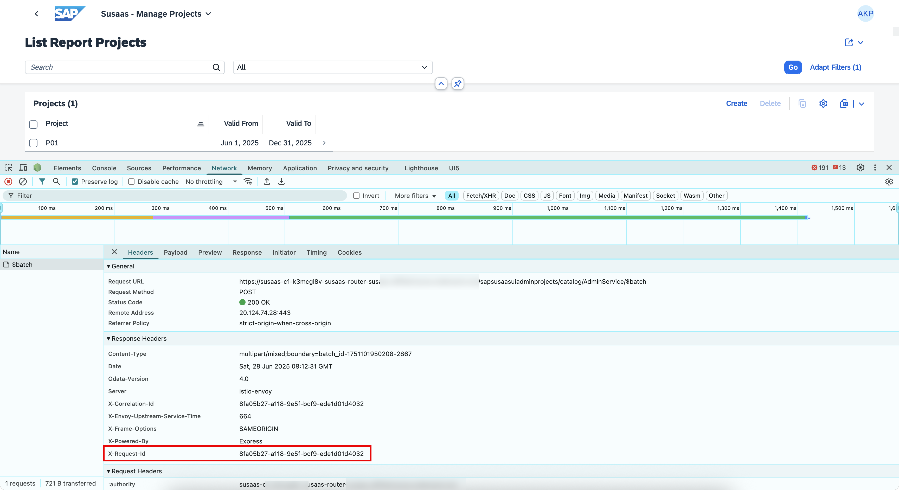](./images/kyma-traces-1.png?raw=true)
    - Get trace id by filtering logs based on the request id
      [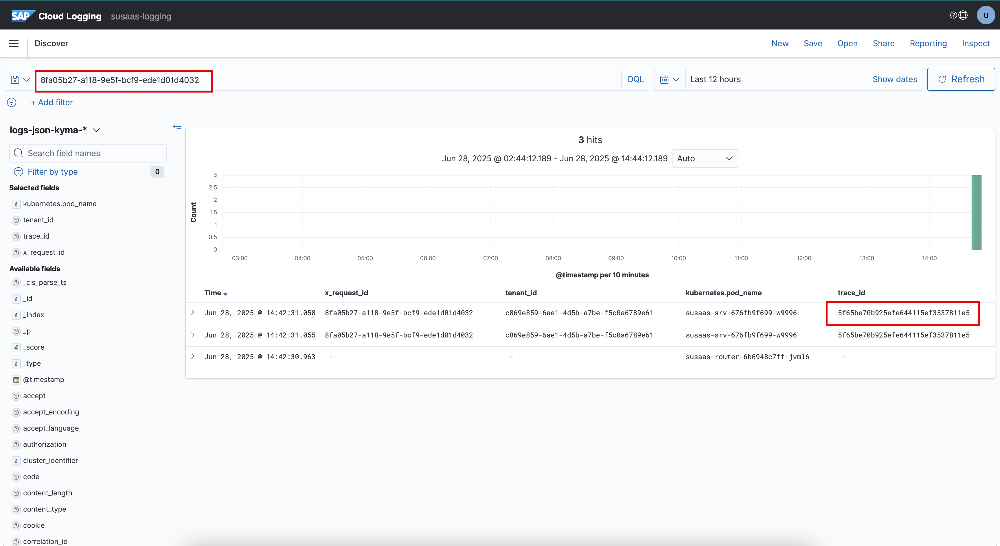](./images/kyma-traces-2.png?raw=true)
    - Find trace based on trace id in observability - trace analytics.
      [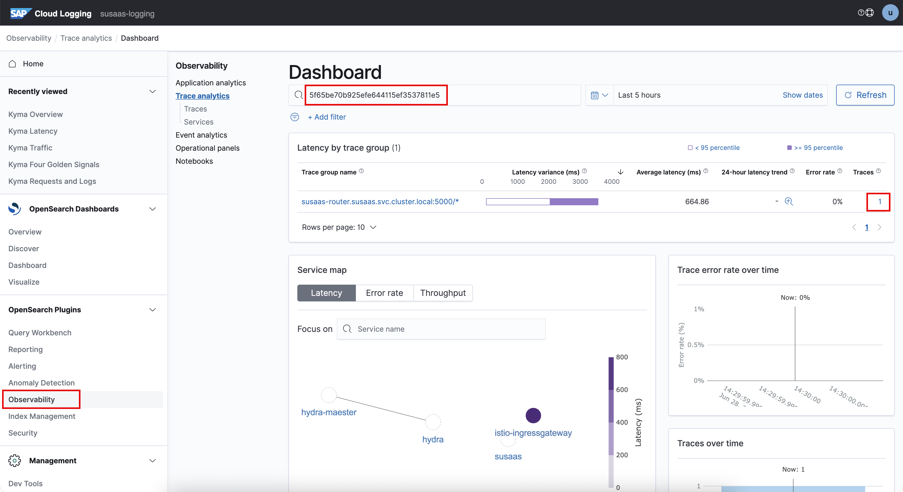](./images/kyma-traces-3.png?raw=true)
      [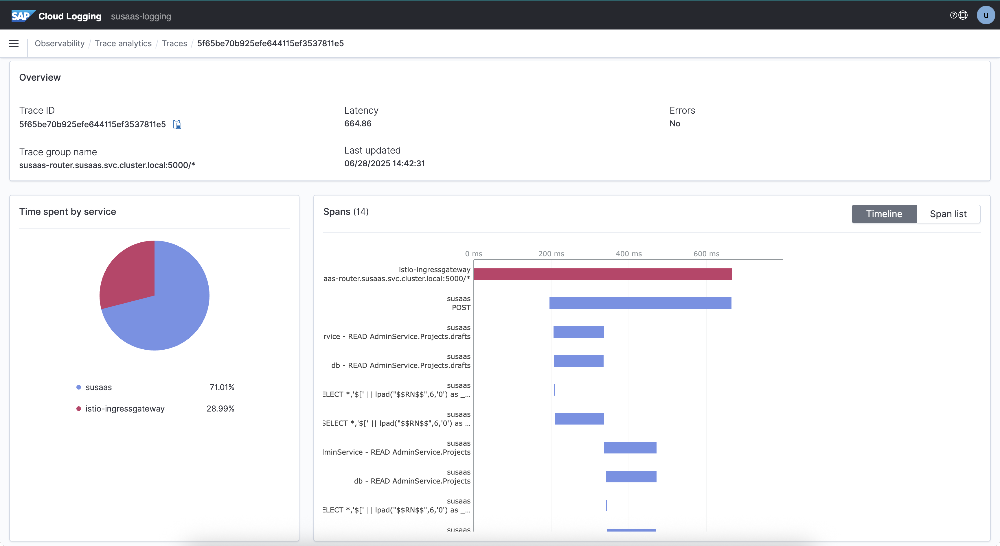](./images/kyma-traces-4.png?raw=true)
  - **_Ship Metric Details_**
    To metrices to SAP Cloud Logging following MetricPipeline needs to be created.
    ```cmd
    ## Run in ./deploy/kyma ##
    kubectl apply -f ./cls/metricpipeline-app-metrics.yaml
    ```
    ```yaml
    ## metricpipeline-app-metrics.yaml ##
    apiVersion: telemetry.kyma-project.io/v1alpha1
    kind: MetricPipeline
    metadata:
      name: susaas-metrices
    spec:
      input:
        prometheus:
          enabled: false
        istio:
          enabled: false
        runtime:
          enabled: false
        otlp:
          namespaces:
            include:
              - susaas
      output:
        otlp:
          endpoint:
            valueFrom:
              secretKeyRef:
                name: susaas-logging
                namespace: susaas
                key: ingest-otlp-endpoint
          tls:
            cert:
              valueFrom:
                secretKeyRef:
                  name: susaas-logging
                  namespace: susaas
                  key: ingest-otlp-cert
            key:
              valueFrom:
                secretKeyRef:
                  name: susaas-logging
                  namespace: susaas
                  key: ingest-otlp-key
    ```
    This configuration will collect metrices from susaas namespace and send to SAP Cloud Logging. Telemetry Manager configures the agent and gateway according to the MetricPipeline resource specification, including the target backend for the metric gateway. The metric gateway sends the data to the observability system that’s specified in your MetricPipeline resource . You can enable metrics for istio by changing the resource specification. See more details on [Setting up a MetricPipeline](https://help.sap.com/docs/btp/sap-business-technology-platform/metrics#setting-up-a-metricpipeline)
    
    You can see metrices data that is auto collected by Telemetry plugin in OpenTelemetry/Metrics Tab as shown below
    [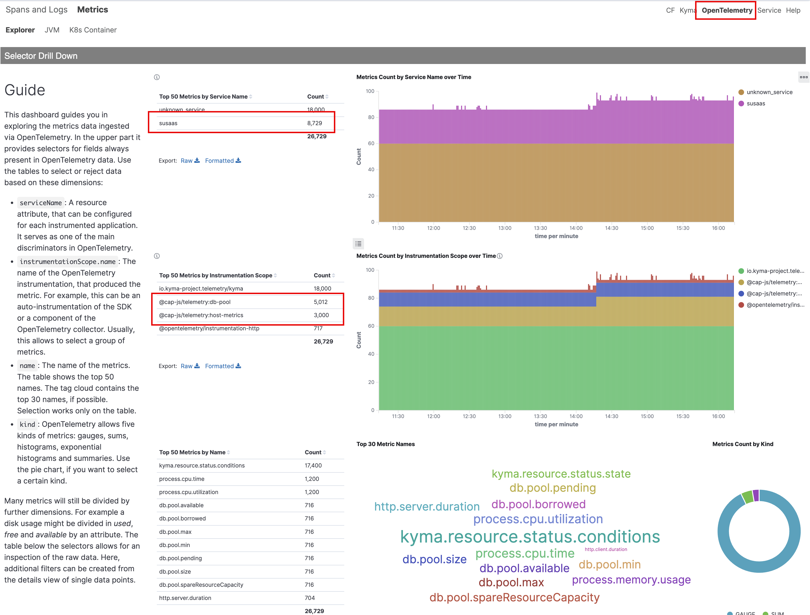](./images/kyma-metrices.png?raw=true)

- **Access SAP Cloud Logging Service and Explore Dashboards** 
  You can explore the dashboard and check the request details, logs, traces, and metrics data of your application under Kyma tab (as shown below). There are pre-build visulization available to analyze the data. Some of the visulizations are as below:
  [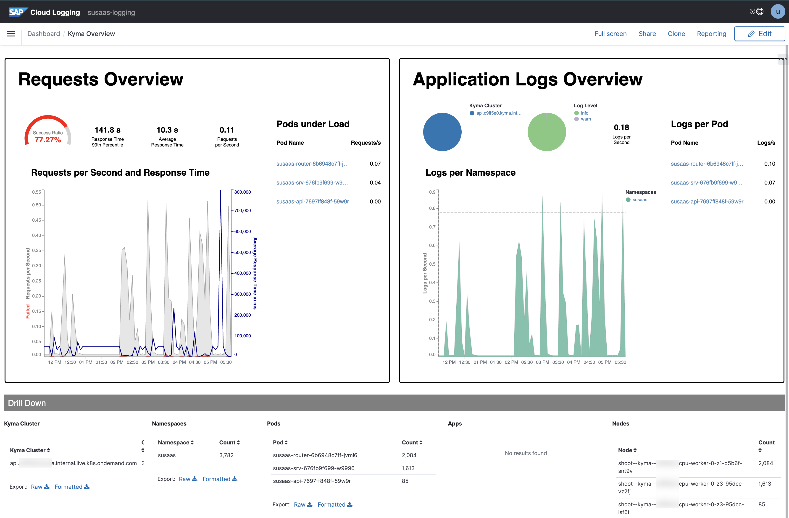](./images/kyma-dashboard-1.png?raw=true)     
  [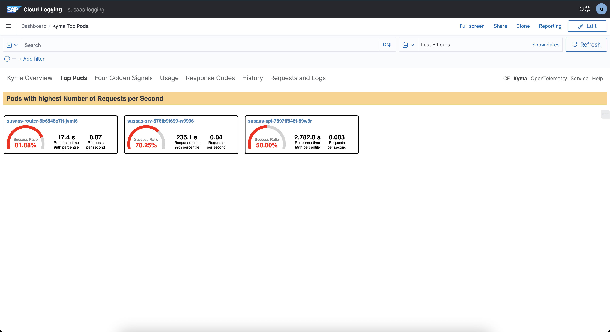](./images/kyma-dashboard-2.png?raw=true)   
  [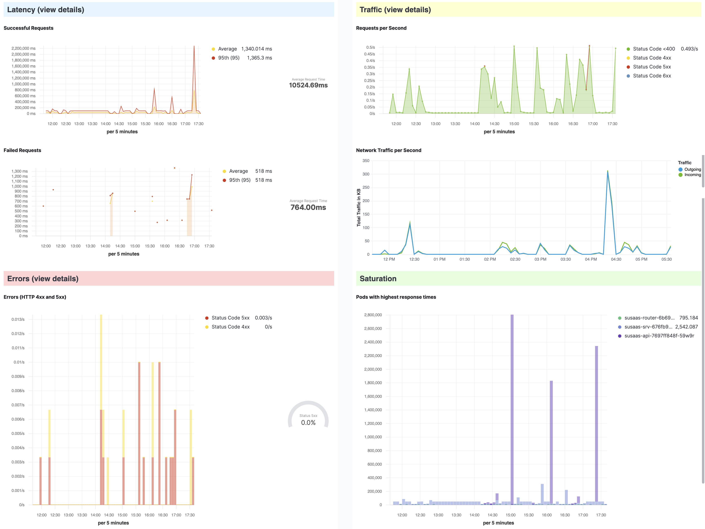](./images/kyma-dashboard-3.png?raw=true)   
  [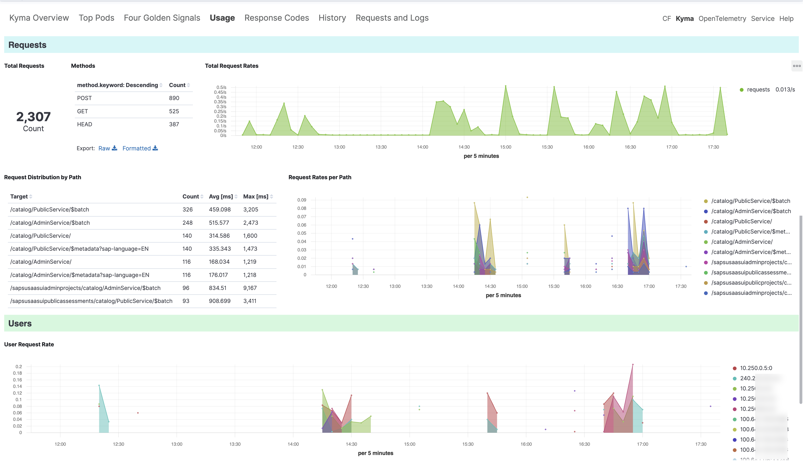](./images/kyma-dashboard-4.png?raw=true) 
  [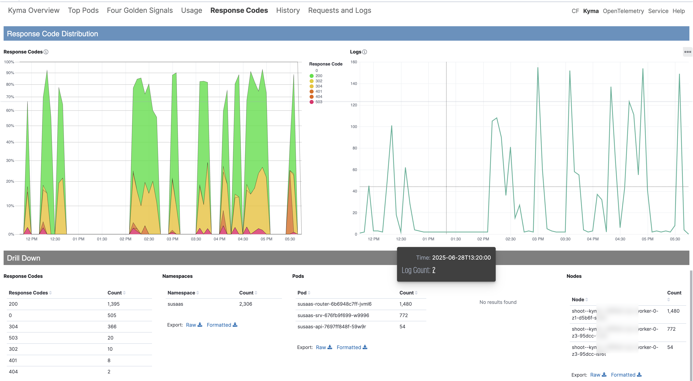](./images/kyma-dashboard-5.png?raw=true)   
  [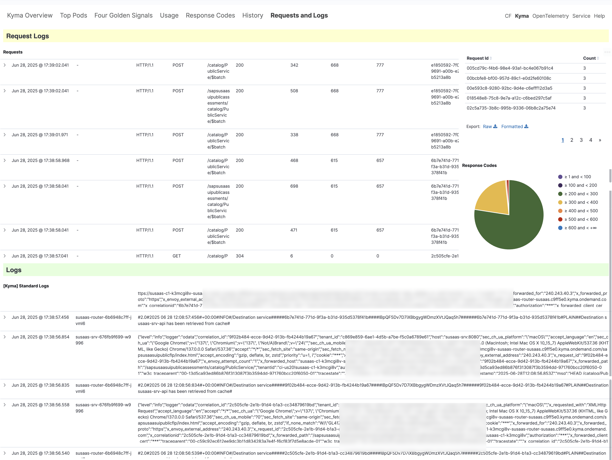](./images/kyma-dashboard-6.png?raw=true) 

> **NOTE**: It is also possible to add custom metric and visualize it in the dashboard. To learn more about creating a custom metric, refer to the [Create a Custom Metric](../11-cf-add-cls/custom-metric.md) documentation.

## 4. Further information

Please use the following links to find further information on the topics above:
* [SAP Help - SAP Cloud Logging Service](https://help.sap.com/docs/cloud-logging)
* [SAP Discovery Center - SAP Cloud Logging](https://discovery-center.cloud.sap/serviceCatalog/cloud-logging)
* [CAP - Telemetry Plugin Documentation](https://cap.cloud.sap/docs/plugins/#telemetry)
* [Github - Telemetry Plugin](https://github.com/cap-js/telemetry#readme)
* [Kyma Integration with SAP Cloud Logging. Part 1: Introduction and shipping Logs](https://community.sap.com/t5/technology-blog-posts-by-sap/kyma-integration-with-sap-cloud-logging-part-1-introduction-and-shipping/ba-p/13648649)
* [Kyma Integration with SAP Cloud Logging. Part 2: Let's ship some traces](https://community.sap.com/t5/technology-blog-posts-by-sap/kyma-integration-with-sap-cloud-logging-part-2-let-s-ship-some-traces/ba-p/13674600)