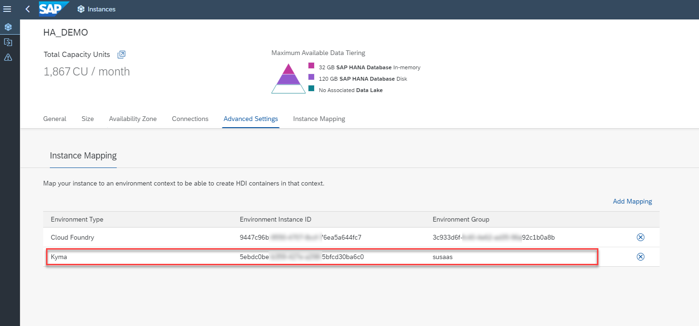
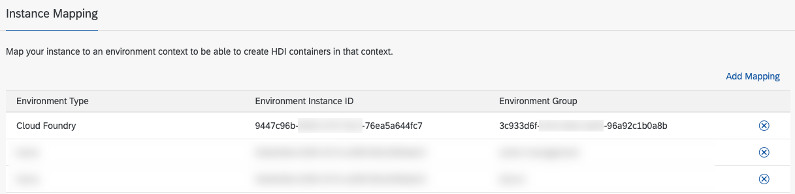
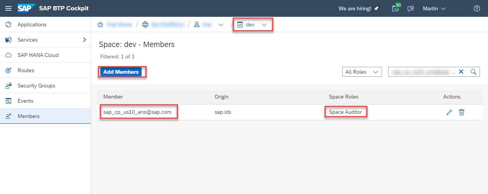

# Prepare the Provider Subaccount

- ### **Kyma** ✅ 
- ### **Cloud Foundry** ✅

In this chapter, you will learn how to prepare your SAP BTP Provider Subaccount for the deployment of the sample SaaS solution by assigning the required entitlements and setting up the foundational components. This includes a SAP HANA Cloud instance which you need to share with your **Cloud Foundry** environment or your **Kyma Cluster** before deployment. 

- [Prepare the Provider Subaccount](#prepare-the-provider-subaccount)
  - [1. Prerequisites for Provider Subaccount](#1-prerequisites-for-provider-subaccount)
  - [2. Entitlements for Provider Subaccount](#2-entitlements-for-provider-subaccount)
  - [3. SAP HANA Cloud prerequisite](#3-sap-hana-cloud-prerequisite)
  - [4. SAP Alert Notification Technical User](#4-sap-alert-notification-technical-user)
  - [5. Limitations of free and trial services plans](#5-limitations-of-free-and-trial-services-plans)
  - [6. Further information](#6-further-information)

## 1. Prerequisites for Provider Subaccount

As already mentioned, you can set up the **Basic Version** of the sample application in any SAP BTP environment using **Free (Tier) service plans** of your own **Pay-as-you-Go** (PAYG) or **CPEA** account. A tutorial how to setup a PAYG account (allowing you to use all Free Tier service plans) can be found in the [Tutorial Navigator](https://developers.sap.com/tutorials/btp-free-tier-account.html). 

> **Hint** - While a setup in Trial accounts is possible, we strongly recommend the usage of **free tier** services plans in a PAYG or CPEA account. This will allow you to change to a paid service plan in the future. If you decide to with the Trial landscape, please make sure to choose the **us10** region to use SAP HANA Cloud.

Please make sure to cater the following prerequisites:

**Cloud Foundry**

* In **Free Tier** scenarios, please create your SAP BTP Cloud Foundry environment using the **free** service plan (! assign in Entitlements if not visible !). 
  > **Important** - Make sure to create your SAP BTP Kyma Runtime using the **free** plan and not the **Standard** plan.  
  > **Important** - Please make sure to your Organization and Space name do not contain any spaces, special characters (except "-") or capital letters!
  > **Hint** - In Trial environments, the correct entitlement (**MEMORY** service plan) is auto-assigned to your default subaccount.  

**Kyma**

* In **Free Tier** scenarios, please set up the SAP BTP Kyma Runtime using the **free** service plan (! assign in Entitlements if not visible !). 
  > **Important** - Make sure to create your SAP BTP Kyma Runtime using the **free** plan and not the **Standard** plan.  
  > **Hint** - Follow the official documentation in SAP Tutorial navigator ([click here](https://developers.sap.com/tutorials/cp-kyma-getting-started.html)) if required.
  > **Hint** - In Trial environments, you have to assign the **trial** service plan to your subaccount.  

**HANA Cloud**

* Set up a SAP HANA Cloud instance (**hana-free** service plan) using the **SAP HANA Cloud Tools** (**tools** service plan).
  > **Hint** - In Trial environments, you have to assign the **hana** service plan to your subaccount.  
  > **Hint** - Check the following blog post to find more details about how to setup your SAP HANA Cloud instance using the HANA Tools ([click here](https://blogs.sap.com/2022/09/21/sap-hana-cloud-goes-multi-environment-part-2-getting-started/).

> **Important** - Please make sure to select the correct free service plans in PAYG or CPEA scenarios, as paid service plans will generate costs in your account! 

Please check the limitations mentioned below when it comes to the usage of some SAP BTP service plans like e.g., hana-free. Furthermore, please note that the hana-free service plan is not available in all SAP BTP regions. You can check the availability in SAP Discovery Center ([click here](https://discovery-center.cloud.sap/serviceCatalog/sap-hana-cloud?region=all&tab=service_plan&service_plan=free&commercialModel=cloud)).

## 2. Entitlements for Provider Subaccount

The application requires the following set of SAP BTP entitlements in the Provider Subaccount:

**Kyma**

| Service / Subscription                                                                                                                                                                  | Free Tier / (Trial) Plans            |
| --------------------------------------------------------------------------------------------------------------------------------------------------------------------------------------- | ------------------------------------ |
| [Destination Service](https://discovery-center.cloud.sap/serviceCatalog/destination?service_plan=lite&region=all&commercialModel=cloud)                                                 | Lite                                 |
| [SAP Alert Notification service for SAP BTP](https://discovery-center.cloud.sap/serviceCatalog/alert-notification?region=all)                                                           | Free / *(Trial: Lite)*               |
| [SAP Application Logging Service](https://discovery-center.cloud.sap/serviceCatalog/application-logging-service/?region=all)                                                            | Lite                                 |
| [SAP Authorization and Trust Management Service](https://discovery-center.cloud.sap/serviceCatalog/authorization-and-trust-management-service?region=all&tab=feature)                   | Broker   Application              |
| [SAP BTP, Kyma Runtime](https://discovery-center.cloud.sap/serviceCatalog/kyma-runtime?region=all&tab=feature)                                                                          | Free / *(Trial: Trial)*              |
| [SAP Cloud Management Service for SAP BTP](https://discovery-center.cloud.sap/serviceCatalog/cloud-management-service/?region=all)                                                      | Central                              |
| [SAP HTML5 Application Repository Service for SAP BTP](https://discovery-center.cloud.sap/serviceCatalog/html5-application-repository-service?region=all)                               | App-host   App-runtime            |
| [SAP Software-as-a-Service Provisioning service](https://discovery-center.cloud.sap/serviceCatalog/saas-provisioning-service?service_plan=application&region=all&commercialModel=cloud) | Application                          |
| [SAP HANA Cloud](https://discovery-center.cloud.sap/serviceCatalog/sap-hana-cloud?tab=customerreference&region=all)                                                                     | hana-free *(Trial: hana)*   tools |
| [SAP HANA Schemas & HDI Containers](https://help.sap.com/docs/SAP_HANA_PLATFORM/3823b0f33420468ba5f1cf7f59bd6bd9/e28abca91a004683845805efc2bf967c.html?version=2.0.04&locale=en-US)     | hdi-shared                           |
| [SAP Service Manager](https://discovery-center.cloud.sap/serviceCatalog/service-manager/?region=all)                                                                                    | Container   Subaccount-Admin      |

**Cloud Foundry**

> **Hint** - 1GB of Cloud Foundry Runtime is sufficient for this use-case.

| Service / Subscription                                                                                                                                                              | Free (Tier) / (Trial)  Plans           |
| ----------------------------------------------------------------------------------------------------------------------------------------------------------------------------------- | -------------------------------------- |
| [Application Autoscaler](https://discovery-center.cloud.sap/serviceCatalog/application-autoscaler/?service_plan=standard&region=all&commercialModel=cloud)                          | Standard                               |
| [Destination Service](https://discovery-center.cloud.sap/serviceCatalog/destination?service_plan=lite&region=all&commercialModel=cloud)                                             | Lite                                   |
| [SAP Alert Notification service for SAP BTP](https://discovery-center.cloud.sap/serviceCatalog/alert-notification?region=all)                                                       | Free / *(Trial: Lite)*                 |
| [SAP Application Logging Service](https://discovery-center.cloud.sap/serviceCatalog/application-logging-service/?region=all)                                                        | Lite                                   |
| [SAP Authorization and Trust Management Service](https://discovery-center.cloud.sap/serviceCatalog/authorization-and-trust-management-service?region=all&tab=feature)               | Broker   Application                |
| [SAP BTP, Cloud Foundry Runtime](https://discovery-center.cloud.sap/serviceCatalog/cloud-foundry-runtime?region=all)                                                                | Free / *(Trial: MEMORY)*               |
| [SAP Cloud Management Service for SAP BTP](https://discovery-center.cloud.sap/serviceCatalog/cloud-management-service/?region=all)                                                  | Central                                |
| [SAP Credential Store](https://discovery-center.cloud.sap/serviceCatalog/credential-store?region=all)                                                                               | Free / *(Trial: Trial)*                |
| [SAP HTML5 Application Repository Service for SAP BTP](https://discovery-center.cloud.sap/serviceCatalog/html5-application-repository-service?region=all)                           | App-host  App-runtime               |
| [SAP SaaS Provisioning Service](https://discovery-center.cloud.sap/serviceCatalog/saas-provisioning-service?service_plan=application&region=all&commercialModel=cloud)              | Application                            |
| [SAP HANA Cloud](https://discovery-center.cloud.sap/serviceCatalog/sap-hana-cloud?tab=customerreference&region=all)                                                                 | hana-free / *(Trial: hana)*   tools |
| [SAP HANA Schemas & HDI Containers](https://help.sap.com/docs/SAP_HANA_PLATFORM/3823b0f33420468ba5f1cf7f59bd6bd9/e28abca91a004683845805efc2bf967c.html?version=2.0.04&locale=en-US) | hdi-shared                             |
| [SAP Service Manager](https://discovery-center.cloud.sap/serviceCatalog/service-manager/?region=all)                                                                                | Container   Subaccount-Admin        |

If you need assistance assigning entitlements to your Provider Subaccount, you might find information [here](https://help.sap.com/docs/service-ticket-intelligence/service-ticket-intelligence-user-guide/assign-entitlement-to-subaccount?locale=en-US).

## 3. SAP HANA Cloud prerequisite

> **Hint** - To learn more about SAP HANA Cloud in general, please check the following Learning Journey (https://learning.sap.com/learning-journey/provision-and-administer-databases-in-sap-hana-cloud).

If not available yet, please create a SAP HANA Cloud instance in your Provider subaccount or share an existing SAP HANA Cloud from any other subaccount within the same SAP BTP region (e.g., eu10). Any SAP HANA Cloud instance in the same region as your Cloud Foundry environment or Kyma Cluster, can be enabled for usage within your Provider subaccount. 

Once you created the SAP HANA Cloud instance, please map it with your Cloud Foundry environment or Kyma Cluster using the **Instance Mapping** feature. You can either map the SAP HANA Cloud instance with all namespaces in the Kyma Cluster or provide a dedicated namespace name. Same applies for Cloud Foundry, where you can map the SAP HANA Cloud instance to a whole Organization or a specific Space. 

**Kyma** 

More information on how to share your SAP HANA Cloud instance with your Kyma Cluster can be found in the following blog post [(click here)](https://blogs.sap.com/2022/12/15/consuming-sap-hana-cloud-from-the-kyma-environment/). 

> **Important** - Please make sure to use the new **SAP HANA Cloud Tools** service (service plan **tools**) for this purpose! The instance mapping feature for Kyma is not available in the SAP HANA Cloud Central UI. 

**Cloud Foundry**

More information on how to share your SAP HANA Cloud instance with your Cloud Foundry environment can be found in the following SAP Help document [(click here)](https://help.sap.com/docs/hana-cloud/sap-hana-cloud-administration-guide/map-sap-hana-database-to-another-environment-context?locale=en-US). Similar features are also offered by the **SAP HANA Cloud Tools**, which can also be used to map an existing SAP HANA Cloud instance to your Cloud Foundry landscape.

## 4. SAP Alert Notification Technical User

**Kyma**

For the Kyma environment, this step is not required as no lifecycle events are send by the sample application using the Alert Notification Service. 

**Cloud Foundry**

If you are using the Cloud Foundry Runtime, please add a dedicated Technical User as a Space Auditor to the Cloud Foundry Space of your Provider Subaccount. This user is required by SAP Alert Notification to inform you about lifecycle events of your SaaS application. You can find a list of users per region in the official SAP Help documentaton ([click here](https://help.sap.com/docs/ALERT_NOTIFICATION/5967a369d4b74f7a9c2b91f5df8e6ab6/4255e6064ea44f20a540c5ae0804500d.html?locale=en-US)).

For **us10** region, please add for example **sap_cp_us10_ans@sap.com** as a Space Auditor. 

## 5. Limitations of free and trial services plans

When using **free** SAP BTP services plans like **trial** for Kyma or **hana-free** for SAP HANA Cloud, please be aware of the following limitations:

**Kyma**

- Your **Free Kyma Clusters** in **trial**, PAYG and CPEA accounts have a restrictive resource limitation. Make sure you have enough resources left before deploying the sample application. Check out the details provided in [Discovery Center](https://discovery-center.cloud.sap/serviceCatalog/kyma-runtime?region=all&tab=service_plan&service_plan=free&commercialModel=cloud) to learn more.
- SAP BTP Kyma **trial** service plan is usable for 14 days only ([click here](https://blogs.sap.com/2022/09/13/sap-btp-kyma-runtime-trial-clusters-lifespan-limited-to-14-days/)). After this period, you need to setup a new SAP BTP Kyma Cluster. This limitation does not exist in CPEA or PAYG accounts using the **free tier** service plans. Therefore, we highly recommend to use a PAYG or CPEA account combined with **free tier** service plans. 

**Cloud Foundry**

- All **Cloud Foundry** workloads in **trial** environments, will be stopped on a daily basis, to reduce resource consumption. Check (and if necessary restart) your applications before using your SaaS scenarios.

**HANA Cloud**

- Free **SAP HANA Cloud** instances will be stopped on a daily basis, to reduce resource consumption. Check (and if necessary restart) your SAP HANA Cloud instance before using your SaaS scenarios. Furthermore, you have **30 days** to **restart** your instances or they will be **deleted**.

## 6. Further information

Please use the following links to find further information on the topics above:

* [SAP Help - Trial Accounts and Free Tier](https://help.sap.com/docs/BTP/65de2977205c403bbc107264b8eccf4b/046f127f2a614438b616ccfc575fdb16.html?locale=en-US)
* [SAP Help - Enterprise Accounts](https://help.sap.com/docs/BTP/65de2977205c403bbc107264b8eccf4b/171511cc425c4e079d0684936486eee6.html)
* [SAP Help - Account Administration in the Cockpit](https://help.sap.com/docs/BTP/65de2977205c403bbc107264b8eccf4b/8061ecc529d74465b2b9566a634943ec.html)
* [SAP Help - Create a Subaccount](https://help.sap.com/docs/BTP/65de2977205c403bbc107264b8eccf4b/05280a123d3044ae97457a25b3013918.html?locale=en-US)
* [SAP Help - Configure Entitlements and Quotas for Subaccounts](https://help.sap.com/docs/BTP/65de2977205c403bbc107264b8eccf4b/5ba357b4fa1e4de4b9fcc4ae771609da.html?locale=en-US)
* [SAP Discovery Center](https://discovery-center.cloud.sap)