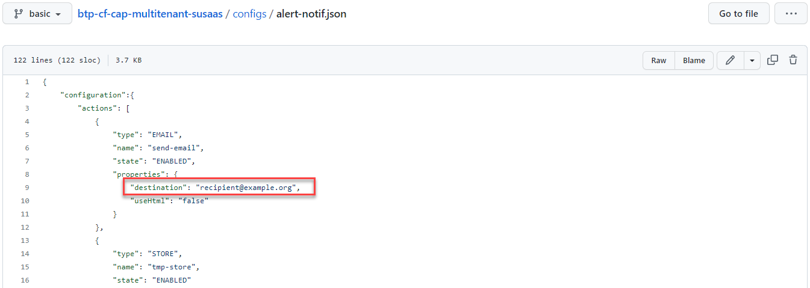
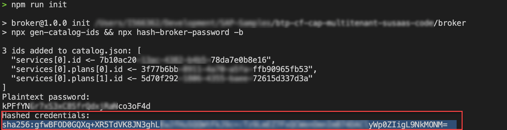
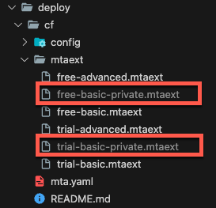
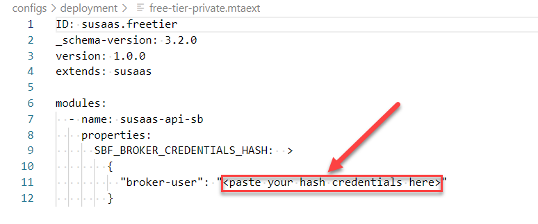
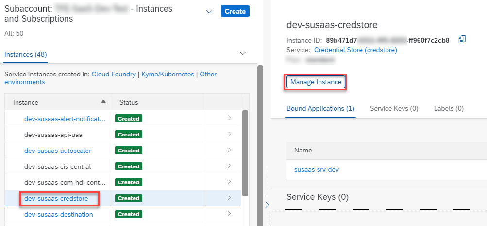
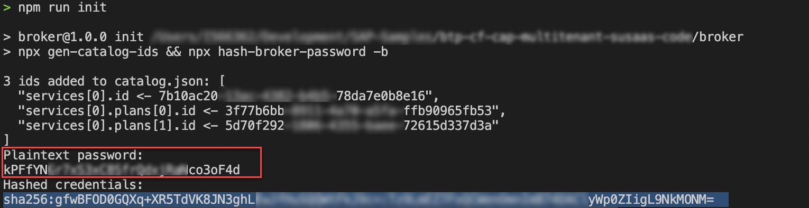
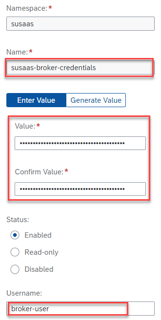

# Cloud Foundry - Build and deploy the SaaS application

- **Kyma** ❌
- **Cloud Foundry** ✅


**Important** - This part of the tutorial is required for **Cloud Foundry** deployments only!

Before the deployment of the sample application to your **Cloud Foundry** environment, you need to build the project and do some basic steps which are required for security purposes. 
**After deployment**, please make sure that the required credential values are stored in the SAP Credential Store created during deployment.  

- [Cloud Foundry - Build and deploy the SaaS application](#cloud-foundry---build-and-deploy-the-saas-application)
  - [1. Prepare the SaaS Application for deployment](#1-prepare-the-saas-application-for-deployment)
  - [2. Setup the Credential Store](#2-setup-the-credential-store)
  - [3. Troubleshooting](#3-troubleshooting)
  - [4. Further information](#4-further-information)


## 1. Prepare the SaaS Application for deployment

Let's get started with the preparation of the codebase in which a few customizations need to be undertaken before you can start the build and deployment to your provider subaccount. 

1.1. (Fork and) Clone this repository, switch to the **deploy** directory where you can find a folder called **cf** containing all objects required for the **Cloud Foundry** deployment. 

```sh
git clone https://github.com/SAP-samples/btp-cap-multitenant-saas
cd deploy/cf
```

1.2. Provide a receiver mail address in the **Alert Notification** service configuration file *alert-notif.json* which you can find in the **config** directory.

> **Hint** - You can also create an *alert-notif-private.json* file or rename the existing file, so your details are not being committed to GitHub. In this case, please make sure to adjust the *mta.yaml* file accordingly or add the respective reference to your *mtaext* file (see upcoming steps). 

[](./images/DEPL_EmailNotifSrv.png?raw=true)

1.3. From the *deploy/cf* directory please run the following npm scripts to create unique catalog IDs and credentials for your service broker instance. 

```sh
npx --yes -p @sap/sbf hash-broker-password -b
npx --yes -p @sap/sbf gen-catalog-ids ../../code/broker/catalog.json
```

1.4.  After completing the previous step please note that your unique IDs are added to your */code/broker/catalog.json* and you should see an output similar to the screenshot below. Store the plaintext password for later usage and please copy the hashed credentials which are highlighted below.

> **Important** - Please make sure to store the hashed credentials and the plaintext password in a secure place especially in a productive scenario. You and also other SAP BTP platform administrators should have access at any time! The corresponding user in this scenario is **broker-user**. 

[](./images/broker-credentials.png?raw=true)

1.5. To prevent your hashed credentials being committed to GitHub, please first copy the *free-basic.mtaext* or *trial-basic.mtaext* file (depending on your target environment) and add *-private* to the filename (e.g., free-basic-private.mtaext). 

> **Important** - Files named *-private.mtaext will be ignored by Git.

[](./images/MTA_DescExt01.png?raw=true)

1.6. Paste the hashed credential value to the **private** deployment descriptor MTA Extensions file you just created. As explained, we highly recommend using **private** MTA Extension Descriptors for this purpose which are not being pushed to Git by mistake. 

[](./images/MTA_DescExt02.png?raw=true)

> **Hint** - If you created a private config file for Alert Notification (*alert-notif-private.json*), please also include it in your mtaext file accordingly as you can see below! 
> ```sh
> resources:
>  - name: susaas-alert-notification
>    parameters: 
>      service-plan: standard
>      path: ./config/alert-notif-private.json
>  ```


1.7. Build your project from the *deploy/cf* directory. Make sure to reference your MTA Extension Descriptor file, **either now, when building or later, when deploying** your application!

> **Hint** - Make sure to use the *mtaext* file for trial scenarios if you are deploying the solution to a trial environment.

**Sample**

```sh
$ mbt build -e ./mtaext/free-basic-private.mtaext
$ cf deploy mta_archives/susaas_0.0.1.mtar
```


1.8. Please run the command below to deploy the SaaS application to your provider subaccount. Make sure to reference your MTA Extension Descriptor file, **if not done during the build process yet**! In that case, you can just skip the additional parameter. 

```sh
$ cf deploy mta_archives/<your_mtar_file> -e <path of your MTA Extension Descriptor file>
```

**Sample** 

```sh
$ cf deploy mta_archives/susaas_0.0.1.mtar -e ./mtaext/free-basic-private.mtaext
```

1.9. After the deployment of the Alert Notification service instance, you should have an e-mail in your inbox, requiring a confirmation that you're willing to receive messages from Alert Notification. Please confirm this request accordingly.

> **Hint** - If you don't receive an e-mail, please make sure you successfully completed step 1.2. of the current chapter. If not, please repeat the previous steps or change the recipient in the existing Alert Notification service instance. Also check your Spam folder. 

[](./images/AN_ConfirmMail.png?raw=true)

1.10. Once the deployment has finished, you're almost ready to go. To support some automation steps like the creation of routes or deployment of the API Service Broker in the consumer subaccounts, make sure not to miss the next step before settings up your first consumer subaccount. 


## 2. Setup the Credential Store

Before you learn how to subscribe new tenants in the next part of the mission, you need to provide two credentials in the Credential Store. These credentials are essential for some parts of the automated subscription process. 

2.1. In your provider subaccount, please go to the Instances and Subscriptions menu and click on your **\<SpaceName>-susaas-credstore** instance or use the **Manage Instance** button. 

[](./images/CS_Service.png?raw=true)

2.2. In the instance management, please switch to the **Credential Store** menu and click on **Create Namespace**. 

[](./images/CS_Namespace.png?raw=true)

2.3. A namespace needs to be created together with the first credential value. Therefore, please select the Credential Type **Password** and click on **Next**. 

[](./images/CS_InitialValue.png?raw=true)

2.4. In the following screen, define the namespace called **susaas** and provide the following credential value details.  

**Name**: btp-admin-user

**Value & Username**: 

Provide the e-mail address (Username) and password (Value) of an SAP BTP user which is used for automation purposes. Make sure this user has the **Subaccount Administrator** role-collection in your **Provider subaccount** and the **Space Developer** role in the respective Cloud Foundry Space. For testing purposes, your current user should be sufficient. 

> **Hint** - If you don't want to use a personal/named user for this purpose, we recommend using a custom IdP and defining a technical user there. The usage of **P or S-User** for technical tasks is possible but especially for productive scenarios not recommended by SAP. 

[](./images/CS_AdminUser.png?raw=true)

2.5. Please create a second **Password** credential value as described below.

**Name**: susaas-broker-credentials

**Value & Username**: 

As Value please provide the **Plaintext Password** of your API broker user. This password is required when registering the API broker in any of your consumer subaccounts during automation.

> **Hint** - You created this password in step 1.4 of "[Prepare the SaaS Application for deployment](#1-Prepare-the-SaaS-Application-for-deployment)". <br>
  [](./images/SB_PlainText.png?raw=true)

As a Username please use the value **broker-user**. 

[](./images/CS_BrokerUser.png?raw=true)


## 3. Troubleshooting

For troubleshooting please check the separate **Troubleshooting** section ([click here](../10-troubleshooting/README.md)).


## 4. Further information

Please use the following links to find further information on the topics above:

* [SAP Help - SAP Alert Notification service for SAP BTP](https://help.sap.com/docs/ALERT_NOTIFICATION?locale=en-US)
* [SAP Help - SAP Alert Notification service for SAP BTP Client](https://github.com/SAP/alert-notification-node-client)
* [npmjs - @sap/sbf Service Broker Framework](https://www.npmjs.com/package/@sap/sbf)
* [SAP Help - Multitarget Applications in the Cloud Foundry Environment](https://help.sap.com/docs/BTP/65de2977205c403bbc107264b8eccf4b/d04fc0e2ad894545aebfd7126384307c.html?locale=en-US)
* [SAP Help - Multitarget Application Commands for the Cloud Foundry Environment](https://help.sap.com/docs/BTP/65de2977205c403bbc107264b8eccf4b/65ddb1b51a0642148c6b468a759a8a2e.html?locale=en-US)
* [SAP Help - Defining MTA Extension Descriptors](https://help.sap.com/docs/BTP/65de2977205c403bbc107264b8eccf4b/50df803465324d36851c79fd07e8972c.html?locale=en-US)
* [Cloud MTA Build Tool (MBT)](https://sap.github.io/cloud-mta-build-tool/)
* [CAP documentation - Providing Initial Data](https://cap.cloud.sap/docs/guides/databases?q=hdbtabledata#providing-initial-data)
* [CAP documentation - Configuration Profiles](https://cap.cloud.sap/docs/node.js/cds-env#profiles)
* [SAP Help - SAP Credential Store](https://help.sap.com/docs/CREDENTIAL_STORE?locale=en-US)