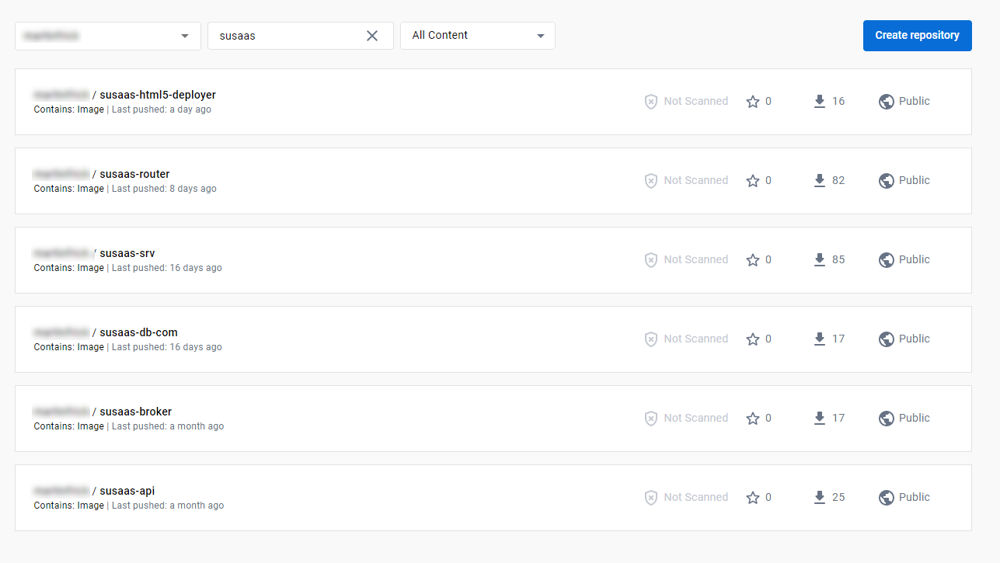
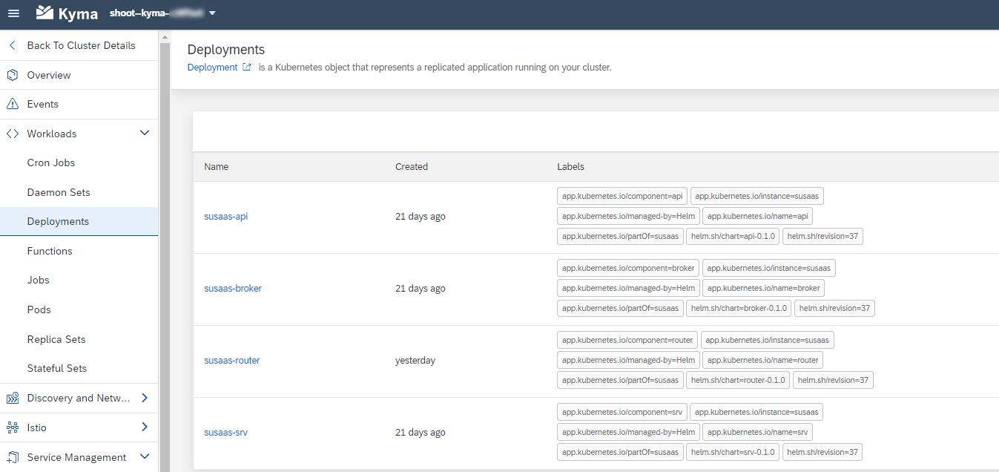
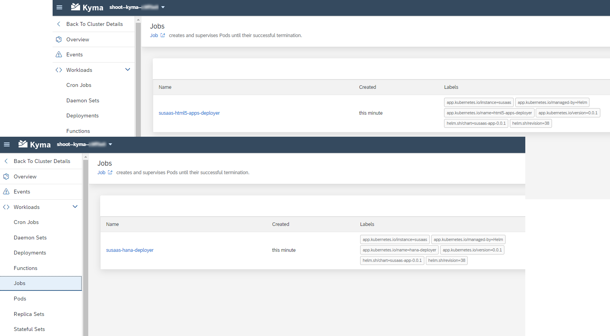
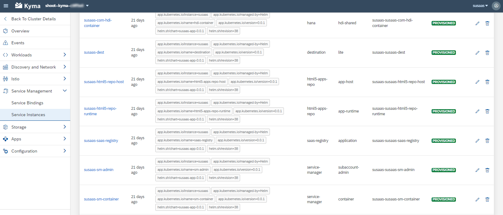
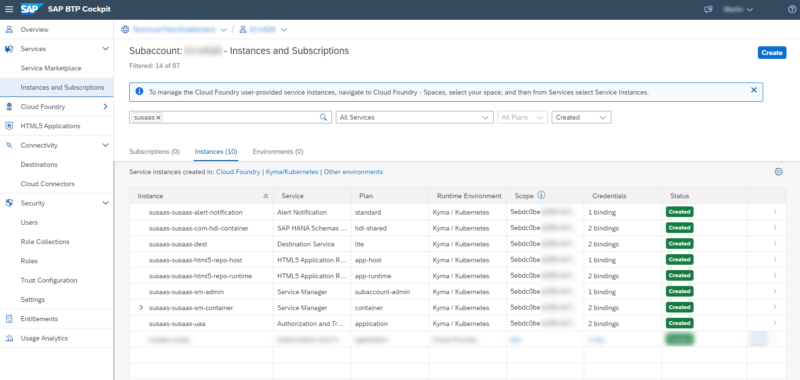
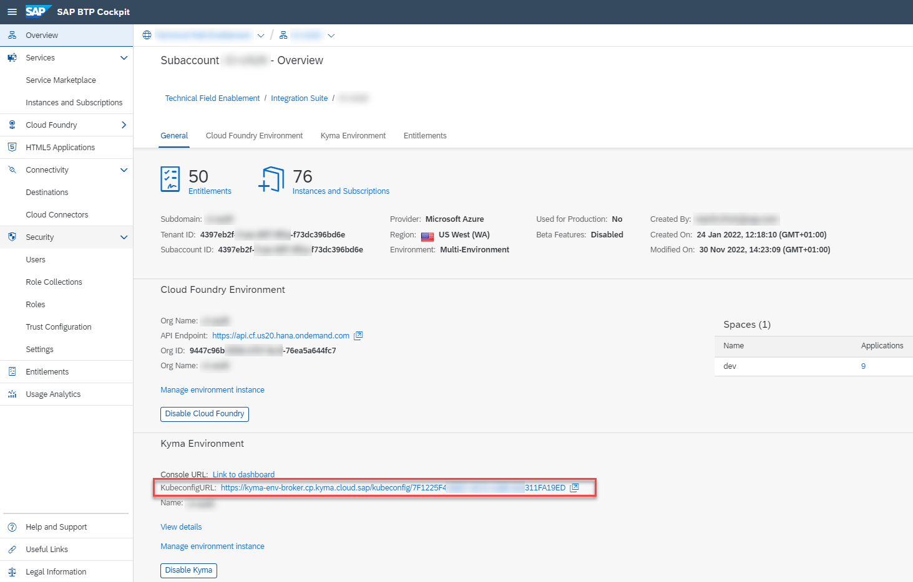
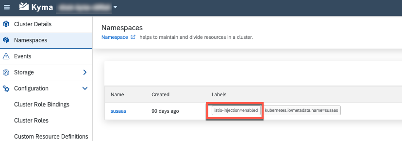
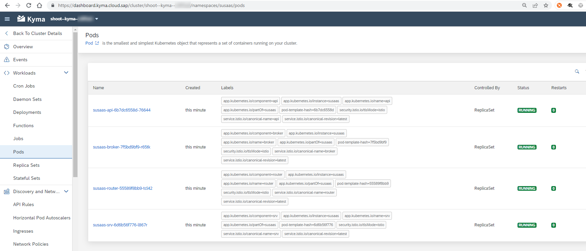
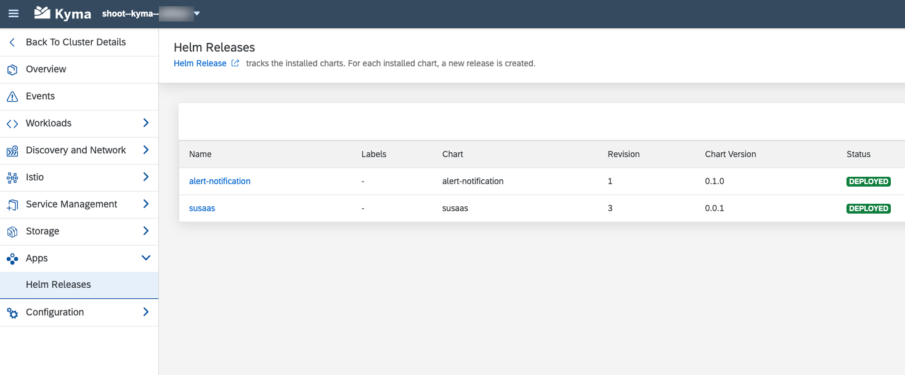

# Kyma - Deploy the SaaS application

- ### **Kyma** ✅ 
- ### **Cloud Foundry** ❌

**Important** - This part of the tutorial is required for **Kyma** deployments only!

Before you deploy the sample application to your **SAP BTP, Kyma Runtime**, please make sure you completed the previous tutorial chapter. Your Docker Images have to be available in your Container Registry, so Helm can access and pull them during the upcoming deployment. 

- [Kyma - Deploy the SaaS application](#kyma---deploy-the-saas-application)
  - [1. Introduction](#1-introduction)
  - [2. Create a new Kyma namespace](#2-create-a-new-kyma-namespace)
  - [3. Prepare the Helm deployment](#3-prepare-the-helm-deployment)
  - [4. Deploy to your Kyma Cluster](#4-deploy-to-your-kyma-cluster)
  - [5. Multiple Deployments](#5-multiple-deployments)

> **Important** - The sample application can be deployed multiple times if either the **Release Name**, the **Kyma Namespace** or the **Kyma Cluster** are different. In the latter case, the cluster has to be in a different SAP BTP Subaccount (due to conflicting Role Collection names). 

If you are facing any issues during the following steps of our tutorial, please feel free to consult the excellent **Developer Tutorial** on **Deploy Your CAP Application on SAP BTP Kyma Runtime**. It describes similar steps and will get you covered in great detail, in case you get stuck in our sample scenario.

https://developers.sap.com/mission.btp-deploy-cap-kyma.html


## 1. Introduction

The deployment of the Sustainable Saas solution to your SAP BTP Kyma Cluster is handled by [Helm](https://helm.sh/). To learn more about the basic concepts of Helm, visit the respective chapter of the tutorial ([click here](../8-kyma-resources-helm/README.md)). Repeating myself, I also suggest to read and inhale the brilliant blog post of Maximilian Streifeneder on the topics of Kyma, Helm, Paketo and a lot more! It will give you a great overview and introduction if you are new to the Kubernetes, Docker and Kyma world!

https://blogs.sap.com/2023/03/07/surviving-and-thriving-with-the-sap-cloud-application-programming-model-deployment-to-sap-btp-kyma-runtime/

Furthermore, if you are facing any issues during the following steps of our tutorial, please feel free to consult the excellent **Developer Tutorial** on **Deploy Your CAP Application on SAP BTP Kyma Runtime**. It describes similar steps and will get you covered in great detail, in case you get stuck in our sample scenario.

https://developers.sap.com/mission.btp-deploy-cap-kyma.html


Before you proceed with the following steps, please make sure you have successfully built your Docker Images and pushed them to the Container Registry of your choice (e.g., Docker Hub or GitHub). Helm will not make use of your local Docker Images, but will pull the latest Images from the provided registry and deploy them to your Kyma Cluster. 

The following Docker Images should be available in your Container Registry:

- susaas-srv - Backend CAP Service
- susaas-api - API CAP Service
- susaas-broker - API Service Broker
- susaas-router - Application Router
- susaas-db-com - Shared Database Deployer
- susaas-html5-deployer - HTML5 Apps Deployer

Here a sample screenshot taken from Docker Hub. 

[](./images/ImageOverview.png?raw=true)

During Deployment, Helm will generate the required Kubernetes resources (*manifest files*) based on the provided Helm templates (again - feel free to check out our [Helm Introduction](../7-kyma-resources-helm/README.md)) and deploy them to your Kyma Cluster. This will result in various different objects like **Deployments**, **Jobs** or **SAP BTP Service Instances** or **Bindings**. 

> **Hint** - To learn more about all the various Kyma and native Kubernetes resources utilized by our sample application, please check out the respective deep-dive chapters ([click here](../7-kyma-resources-helm/README.md))! 

**Kubernetes Deployments**

[](./images/Deployments.png?raw=true)

- susaas-srv
- susaas-api 
- susaas-broker
- susaas-router 

These workloads are constantly running in your Cluster after deployment, as they need to be contiguously reachable for external traffic. They come with further components like API Rules or Istio related configurations, which are explained in further detail as part of our dedicated Kyma tutorial ([click here](../8-kyma-resources-helm/README.md)). 


**Kubernetes Jobs**

[](./images/JobsOverview.png?raw=true)

- susaas-hana-deployer
- susaas-html5-apps-deployer

The deployment of the shared data model using the Node.js based HDI Deployer is only required upon initial setup or when any changes are applied to the data model. The same applies for the static UI5 modules. This is why, both applications components are running as Jobs whenever a *helm install* or *helm upgrade* is initiated. After the Jobs finished successfully, they are deleted from the Cluster again. 


**SAP BTP Service Instances/Bindings**

The Helm deployment will create a list of SAP BTP Service Instances and corresponding Service Bindings required by your workloads. While these Service Instances can also be seen from within the SAP BTP Cockpit, the Service Credentials can only be retrieved and accessed from your Kyma Dashboard.

[](./images/ServiceInstancesKyma.png?raw=true)
[](./images/ServiceInstancesCf.png?raw=true)

> **Hint** - SAP BTP Service Bindings will create corresponding Kyma Secrets, which are consumed by your Kubernetes workloads (Pods, Jobs) and allow your applications to communicate with the respective SAP BTP Service Instances like you know it from the Cloud Foundry context. Npm packages like @sap/xsenv ([see here](https://blogs.sap.com/2022/07/12/the-new-way-to-consume-service-bindings-on-kyma-runtime/)) natively support these kind of Service Bindings in Kyma and Cloud Foundry. Check out Max Streifeneder's blog post ([click here](https://blogs.sap.com/2023/03/07/surviving-and-thriving-with-the-sap-cloud-application-programming-model-deployment-to-sap-btp-kyma-runtime/)), who also provides a great summary of this concept (just search for "How does CAP know where to get the service binding information from?"). 


## 2. Create a new Kyma namespace

Using Helm, you can deploy the SaaS sample application to either the *default* Kyma namespace or create a **new namespace** of your choice for this sample application. In the following, you will learn how to create a new namespace called *susaas* in Kyma. 

2.1. First of all, please install the [**kubectl**](https://kubernetes.io/docs/tasks/tools/#kubectl) command line tool in your development environment. 

> **Hint** - Kubectl allows you to interact with your Kyma Cluster from your command line, as you are used to from any other Kubernetes environment. [Click here](https://kubernetes.io/docs/tasks/tools/#kubectl) to find further information about **kubectl**. Helm will make use of **kubectl** during the deployment process to create the required resources in your Cluster. 

> **Installation Shortcuts**<br>
> **MacOS** - brew install kubectl<br>
> **Windows** - choco install kubernetes-cli

To learn more about **kubectl** commands check the [official documentation](https://kubernetes.io/docs/reference/generated/kubectl/kubectl-commands) and the [kubectl cheat sheet](https://kubernetes.io/docs/reference/kubectl/cheatsheet/). Learning how to use **kubectl** is one of the most essential requirements when starting off with Kubernetes and Kyma. The command syntax is quite simple to understand and follows a consistent pattern. So don't shy to have a little deep-dive into the provided documentations. It pays! 


2.2. Before you continue with the next step, make sure you can successfully execute the following command. This proves that kubectl has been successfully added to your Environment Variables. In case of errors, please try again from a new command line instance and make sure you followed all steps of the kubectl installation instructions.  

```sh
> kubectl version

Client Version: version.Info{Major:"1", Minor:"26", ...
```

2.3. To connect to your Kyma Cluster, you have to install another tool called [**kubelogin**](https://github.com/int128/kubelogin#setup). Please use the below shortcuts or the installation details in the linked documentation to proceed. 

> **Installation Shortcuts**<br>
> **MacOS** - brew install int128/kubelogin/kubelogin<br>
> **Windows** - choco install kubelogin

Check the successful installation by running the following command.

```sh
> kubelogin

kubelogin version v1.26.0 
```

2.4. Download the so-called **kubeconfig** file of your Kyma Cluster from your SAP BTP Cockpit. You can find it in your SAP BTP subaccount **Overview** section. This file contains all required access details and credentials so that **kubectl** can connect to your Kyma Cluster. 

> **Important** - Do not share this file with anyone else and do not commit it to your GitHub repository.

[](./images/Kubeconfig.png?raw=true)


2.5. Once you downloaded the *kubeconfig.yaml* file, please store it as a file named **config** (! without any file name extension !) in your hidden *$HOME/.kube* directory. Kubectl will check this **hidden** directory for an available configuration file named **config**. This is probably the most convenient way to provide your Cluster access details to kubectl. 

> **Hint** - In Windows, the directory is e.g., C:\Users\\<Username\>\\.kube

Alternatively, you can also configure the location of your configuration file in the environment variable **KUBECONFIG** or by adding the kubectl parameter *--kubeconfig* to any kubectl command (which is obviously a bit cumbersome). 

```sh
EXPORT KUBECONFIG=/sample/path/config

kubectl get pods --kubeconfig=/sample/path/config
```

If you are facing issues in this step of the tutorial, feel free to consult the excellent **Developer Tutorial** on **Deploy Your CAP Application on SAP BTP Kyma Runtime** ([click here](https://developers.sap.com/tutorials/btp-app-kyma-prepare-dev-environment.html)), which describes this step in further detail!

> **Hint** - If you have to manage multiple Kyma or Kubernetes Clusters, make sure to research the **kubectx** command line tool (https://github.com/ahmetb/kubectx)! It provides you a very convenient way to switch the context between various clusters. 

2.6. Run the following command to check whether kubectl can successfully connect to your cluster using the respective config file.  

> **Hint** - Depending on your landscape, you will need to setup Two-Factor-Authentication using e.g., the SAP Authenticator App. 

```sh
> kubectl cluster-info

Kubernetes control plane is running at https://api.a1b2c3d4.kyma.ondemand.com
```

2.7. The following kubectl command, finally allows you to create a new namespace in your Kyma cluster. To learn more about **kubectl** commands check the [official documentation](https://kubernetes.io/docs/reference/generated/kubectl/kubectl-commands) and the [kubectl cheat sheet](https://kubernetes.io/docs/reference/kubectl/cheatsheet/). 

> **Hint** - This is just a sample for your reference. If you want, you can deploy the sample application also to the Kyma *default* namespace or any other namespace of your choice! Just make sure to adapt the sample commands provided in this documentation accordingly.

```sh
> kubectl create namespace susaas

namespace/susaas created
```

2.8. Use the following command, to enable the **Istio** Sidecar Injection for your new namespace.

> **Hint** - **Istio** is one of the most popular **Service Mesh** offerings for Kubernetes and manages Cluster-internal communication as well as external access to your workloads! We highly recommend to learn more about [**Istio Service Mesh**](../8-kyma-resources-helm/README.md), by visiting the respective part of the tutorial. The features and possibilities are mind-blowing compared to what you can do in a Cloud Foundry scenario! 

> **Important** - If you plan to use an existing namespace, make sure this label is configured and if necessary, please update the namespace using **kubectl** or the Kyma Dashboard! 

```sh
kubectl label namespace susaas istio-injection=enabled
```

You can either use **kubectl** or check in your Kyma Dashboard, whether the respective label has been successfully set!

> **Hint** - Here you can see another kubectl command called **describe**, providing you more information (than a simple **get**) about a certain object like in this case a namespace. 

```sh
> kubectl describe namespace susaas 

Name:         susaas
Labels:       istio-injection=enabled
              kubernetes.io/metadata.name=susaas
```

[](./images/IstioInjectionLabel.png?raw=true)


2.9. To delete a namespace, just execute the following **kubectl** command. Already getting an idea about how the kubectl commands are structured? Great! 

> **Important** - Be **extremely sensitive** when deleting a namespace containing a **SaaS application** with **active subscribers**. This can result in very situations, where SAP BTP Service Instances like XSUAA can only be deleted with complex additional effort. Before you **delete a namespace** or **uninstall a Helm Release**, always make sure there are no more active subscribers! 

```sh
> kubectl delete namespace susaas

namespace/susaas deleted
```

Okay great, by now you should be equipped with either a new namespace or the default Kyma namespace. So let us prepare the SaaS sample application for deployment next. 


## 3. Prepare the Helm deployment

Let's get started with the preparation of our **Helm deployment** or **Helm installation**. Based on your own Kyma environment, you will need to update the *values.yaml* file of your **Umbrella Chart**. This is a regular process step, which you need to undertake as part of almost any Helm installation to inject environment-specific details which cannot be pre-configured by the application/package vendor. 

3.1. Either copy or rename the Umbrella Chart *values.yaml* file (of our SaaS sample application) in the *deploy/kyma/charts/sustainable-saas* directory ([click here](../../../deploy/kyma/charts/sustainable-saas/values.yaml)) and add **-private** as part of the filename *values-private.yaml*

> **Important** - By adding **-private** to the filename, no confidential or environment specific details will be committed to Git, as these files will be ignored by Git. 

3.2. In the **values-private.yaml** file, please provide values for the following parameters, based on your own environment and the Container Registry used. 

**global**

* imagePullSecret - Name of a Image Pull Secret if required.
  > **Hint** - This value needs to contain the reference to a potential Image Pull Secret of your Container Registry. If you're using a free Docker Hub account and public Docker Images, this property can be left unchanged. This is probably the easiest approach if you are new to Docker and Kubernetes. Otherwise, please make sure to create a Kyma **Secret** containing your imagePullSecret and provide the reference to your Secret here. 
  
  > Find more details in the following blog post ([click here](https://blogs.sap.com/2022/12/04/sap-btp-kyma-kubernetes-how-to-pull-from-private-repository/)) or check out the **Deploy Your CAP Application on SAP BTP Kyma Runtime** tutorial in the SAP Tutorial Navigator([click here](https://developers.sap.com/tutorials/btp-app-kyma-prepare-dev-environment.html)). Our colleagues will get you covered! 

* domain - Your Kyma Cluster default or custom domain.
  > **Hint** - This parameter requires your default Kyma cluster domain (e.g. a1b2c3d4.kyma.ondemand.com). To get the default domain of your Kyma Cluster you can run the following kubectl command: 
  >
  > ```kubectl get configMaps/shoot-info -n kube-system -o jsonpath='{.data.domain}'```
  > 
  > This will return the required result like *a1b2c3d4.kyma.ondemand.com*. *a1b2c3d4* is a placeholder for a string of characters that’s unique for your cluster (the so-called **shootName** which we need in the next step). 

* shootName - The unique shoot name of your Kyma Cluster.
  > **Hint** - As Kyma is based on [Gardener](https://gardener.cloud/), the managed Clusters are also called **Shoot**-Clusters (flower analogy). In our sample the **shootName** parameter, ensures the uniqueness of application registered in the SAP BTP SaaS Registry. As the SaaS application names registered in the SaaS registry need to be unique across a SAP BTP region (e.g. eu10), the shootName of your Kyma cluster will be part of that SaaS application names. This ensures you are not colliding with any other developer deploying the sample application. To get the **shootName** of your Kyma Cluster, run the following kubectl command:  
  > 
  >```kubectl get configMaps/shoot-info -n kube-system -o jsonpath='{.data.shootName}'```.<br> 
  > 
  > In a productive SAP BTP landscape, your **shootName** will always starts with a letter like *a1b2c3d4* or with the prefix **c-** like c-1b2c3d4*. 

* gateway - The Istio Ingress Gateway to be used.
  > **Hint** - This value only has to be changed if your Istio setup deviates from the default setup. For example, if you are using a custom domain and you have set up a new Istio Ingress Gateway for this domain. In that case, please update the respective property accordingly. For the **Basic Version**, you should be fine leaving the parameters unchanged. 

* api - Details of the API Service workload. 
  > **Hint** - These values only need to be changed if your setup deviates from the default sample configuration. This is the case if you intentionally set a different **fullName** property for your API Service or expose a **custom hostname**. For the **Basic Version**, you should be fine leaving the parameters unchanged. 

* broker - Details of the Service Broker workload. 
  > **Hint** - These values only need to be changed if your setup deviates from the default sample configuration. This is the case if you intentionally set a different **fullName** property for your Service Broker or expose a **custom hostname**. For the **Basic Version**, you should be fine leaving the parameters unchanged. 

* router - Details of the Application Router workload.
  > **Hint** - These values only need to be changed if your setup deviates from the default sample configuration. This is the case if you intentionally set a different **fullName** property for your Application Router or expose a **custom hostname**. For the **Basic Version**, you should be fine leaving the parameters unchanged. 

**router**

* image.repository - Provide the details of your [Application Router](../3-build-your-docker-images/) Docker Image like \<username\>/susaas-router if your Image is stored in Docker Hub or ghcr.io/\<namespace\>/susaas-router in case of GitHub. For other Container Registries, please check the respective provider documentation.

**srv**

* image.repository - Provide the details of your [Backend Service](../3-build-your-docker-images/) Docker Image repository like \<username\>/susaas-srv.
  
**api**

* image.repository - Provide the details of your [API Service](../3-build-your-docker-images/) Docker Image repository like \<username\>/susaas-api


**broker**

* image.repository - Provide the details of your [API Service Broker](../3-build-your-docker-images/) Docker Image repository like \<username\>/susaas-broker.
  
* config.serviceId + planId(s) - You can provide unique GUIDs (e.g., 332e966f-a1ab-a2ab-a3ab-b9facec65bad) for your service plans and the broker instance itself. If you do not provide any GUIDs, they will be auto-generated by Helm upon deployment! 

    > **Important** - While auto-generating the GUIDs is fine for testing purposes, in a productive scenario those GUIDs must remain constant after first deployment. Therefore, we recommend to generate GUIDs upfront using your command line or available generators and providing them right here. You can run the following script, which will generate new GUIDs as part of the */code/broker/catalog.json* file which can be used for this requirement.<br>
    > ```npx --yes -p @sap/sbf gen-catalog-ids ../../code/broker/catalog.json ```

**hana_deployer**

* image.repository - Provide the details of your [HDI Container Deployer](../3-build-your-docker-images/) Docker Image repository like \<username\>/susaas-db-com.
  
**html5_apps_deployer**

* image.repository - Provide the details of your [HTML5 Apps Deployer](../3-build-your-docker-images/) Docker Image repository like \<username\>/susaas-html5-deployer.

3.3. Before running the respective **Helm** commands to generate the Kubernetes resource definitions, please configure the **redirect-uris** of you *xs-security.json* ([click here](../../../deploy/kyma/charts/sustainable-saas/xs-security.json)). In the **oauth2-configuration** section, please provide your default Cluster Domain or your Custom Domain (if configured). Keep the **localhost** redirects for local testing purposes. 

> **Hint** - Use the following **kubectl** command to get your default Cluster domain
> 
> ```kubectl get configMaps/shoot-info -n kube-system -o jsonpath='{.data.domain}'```

```json
"oauth2-configuration": {
  "token-validity": 900,
  "redirect-uris": [
    // Replace with your Cluster Domain or Custom Domain
    "https://*.a1b2c3d4.kyma.ondemand.com/**", 
    "http://*.localhost:5000/**",
    "http://localhost:5000/**"
  ],
  "credential-types": [
    "binding-secret",
    "x509"
  ]
}
```

> **Hint** - You can also create a *xs-security-private.json* file, which will not commit this change to GitHub. Just make sure to change the *xs-security.json* link in your *values-private.yaml* file accordingly.
> ```yaml
> xsuaa:
>   ...
>   config: xs-security-private.json
> ```

3.4. Wow, that was quite some work but luckily this is a one-time action. Let's relax and check if your Kubernetes resource definitions are successfully generated by Helm, running the following command within the *deploy/kyma* directory.

> **Hint** - In case of errors, check if you maybe missed one of the above parameters or a mistake (like a space or special character) has slipped in.

```sh
cd deploy/kyma
helm template ./charts/sustainable-saas \
 -f ./charts/sustainable-saas/values-private.yaml
```

This will log the generated **yaml** files in your console. If required, you can also store the results into a local file by running the following command. 

```sh
helm template ./charts/sustainable-saas \
 -f ./charts/sustainable-saas/values-private.yaml > helm-template-private.yaml
```

Double-check if the correct Docker Image repositories can be found in the generated resource definitions before you continue with the next chapter. 

```yaml
apiVersion: apps/v1
kind: Deployment
spec:
  template:
    spec:
      containers:
      - image: sap-demo/susaas-broker:latest
        name: broker
```


## 4. Deploy to your Kyma Cluster

While we could have skipped the whole part of building your own Docker Images and updating most of the *values.yaml* parameters, it is essential to understand both process steps! If you would like to apply any changes to the provided sample application, this is the actual way to proceed. Okay, but finally you should now be all set to deploy the sample application (based on your own Docker Images) to your Kyma Cluster. 

4.1. First of all, deploy a **SAP Alert Notification Service** instance to your namespace of choice. Before doing so, please update the recipient e-mail address for the respective notifications in the *values.yaml* file ([*./charts/alert-notification/values.yaml*](../../../deploy/kyma/charts/alert-notification/values.yaml)). 

> **Hint** - If you want, you can also follow the approach of using a *values-private.yaml* file in this case and maintain your email address in a values-private.yaml. 


```yaml
# SAP Alert Notification Service 
alert_notification:
  fullnameOverride: alert-notification
  serviceOfferingName: destination
  servicePlanName: lite
  parameters:
    configuration:
      actions:
        - name: send-email
          properties:
            # Update to your receiver e-mail address
            destination: john.doe@example.com 
          state: ENABLED
          type: EMAIL
  ...
```

> **Important** - In case of SAP BTP **Trial Account** usage, please make sure to change the **servicePlanName** to **lite**!

4.2. Save your changes and deploy the Alert Notification Service Instance to your desired Kyma Namespace, by running the following **Helm** command from within the *code* directory. 

> **Hint** - There can only be one Alert Notification Service instance per Kyma Namespace (or Cloud Foundry Space). Given this restriction, SAP Alert Notification Service is deployed as a standalone Helm installation in our example. Binding that Service Instance to the lifecycle of our SaaS application might conflict with other applications also requiring Alert Notification Service in the same namespace.

> **Hint** - You might be asked to re-login to your Cluster using Multi-Factor-Authentication, when running **helm** commands from time to time.   

```sh
helm install alert-notification ./charts/alert-notification -n <namespace>
```

Using a *values-private.yaml* file bearing your email address, the command to consider this file would look as follows. 

```sh
helm install alert-notification ./charts/alert-notification -n <namespace> \
 -f ./charts/alert-notification/values-private.yaml
```


4.3. After the Alert Notification Service has been deployed (wait for a confirmation in the console or check the Helm Release status in the Kyma Dashboard), please run the following command from within the *deploy/kyma* directory to deploy the Sustainable SaaS sample application to a namespace of your choice.

> **Hint** - Feel free to add the *--debug* parameter to get some more verbose output if you're interested what's happening under the hood!

```sh
helm install susaas ./charts/sustainable-saas -n <namespace> \ 
 -f ./charts/sustainable-saas/values-private.yaml 
```

If you want to make your application to make use of the SAP Alert Notification Service, please include an additional **yaml** file into the installation process. This will generate a new Service Binding between the Alert Notification instance and your SaaS Backend Service. 

```sh
helm install susaas ./charts/sustainable-saas -n <namespace> \ 
 -f ./charts/sustainable-saas/values-private.yaml \
 -f ./charts/sustainable-saas/values-anf.yaml
```

An alternative approach using the *helm upgrade* command would look as follows. This will either upgrade an existing installation of our SaaS sample application or install a new version if not available in the respective namespace yet. 

```sh
helm upgrade susaas ./charts/sustainable-saas --install -n <namespace> \
 -f ./charts/sustainable-saas/values-private.yaml \
 (-f ./charts/sustainable-saas/values-anf.yaml) 
```

4.4. The deployment of the Helm Release to your Kyma cluster, will take a few minutes. 

4.5. You can use this time to switch back to your Kyma Dashboard, where you can monitor the installation/deployment progress and respective objects being instantiated. Once you see the following four **Pods** in **Running** state, your deployment finished successfully. 

> **Trivia** - We're kind of mixing up the terms Deployment/Installation/Release in this tutorial. 

[](./images/PodOverview.png?raw=true)

4.6. You can also check the successful deployment of your application in the **Apps** section of the Kyma Dashboard. Here you can find all **Helm Releases**. 

[](./images/HelmOverview.png?raw=true)

4.7. For any further updates of the Helm Release, you must now use the *helm upgrade* command (already mentioned above).

```sh
helm upgrade susaas ./charts/sustainable-saas -n <namespace> \
 -f ./charts/sustainable-saas/values-private.yaml \
 (-f ./charts/sustainable-saas/values-anf.yaml)
```

4.8. To undeploy/uninstall a Helm Release, you can use the following command. 

> **Important** - Please make sure to check the respective **Undeploy** chapter of the documentation first! Uninstalling a SaaS application with existing subscribers, can result in corrupt Service Instance setups which are very cumbersome to resolve. 

```sh
helm uninstall susaas -n <namespace>
```

## 5. Multiple Deployments

The sample application has been designed for multiple deployments in the **same Kyma Namespace** using **different** Release Names (e.g., susaas-dev, susaas-test, susaas-prod). If required, the sample application can also be deployed to **different Kyma Namespaces** using the **same** Release Name (e.g., susaas in default namespace, susaas in test namespace). 

The (Helm) Release Name, is the value following the *helm install* command. You can have multiple releases based on the same Helm Chart if required. 

```sh
helm install susaas-dev ./charts/sustainable-saas -n <namespace> \   
 -f ./charts/sustainable-saas/values-private.yaml \
 (-f ./charts/sustainable-saas/values-anf.yaml)
```

- 1 ** n installations with different Release Names (using the same Kyma Namespace)
- 1 ** n installations in different Kyma Namespaces (using same Release Name)

> **Hint** - Please note, you can not deploy the application to equally named namespaces in different Kyma Clusters of the same SAP BTP subaccount. In this case, the Role Collection names will collide. Still, feel free to cover this requirement yourself by adapting the Role Collection name logic. 

The respective Kyma Namespace and Release Name will be part of your **xsappname** and also part of your SAP BTP Role Collections. To ensure the uniqueness of applications registered in the SAP BTP SaaS Registry Service, please make sure to provide the correct **shootName** property in your *values.yaml* file! The same application name can only be registered once in the same SAP BTP region (e.g., eu10).  
