# Subscribe a Tenant Subaccount

- **Kyma** ✅ 
- **Cloud Foundry** ✅

In this part of the tutorial, you will learn how to subscribe your first Tenant Subaccount and how to create a first administrator user for your Subscriber Tenant.

- [Subscribe a Tenant Subaccount](#subscribe-a-tenant-subaccount)
  - [1. SaaS application subscription](#1-saas-application-subscription)
  - [2. API Service Broker instance](#2-api-service-broker-instance)
  - [3. Initialize the SaaS application](#3-initialize-the-saas-application)
  - [4. Improvement options](#4-improvement-options)
  - [5. Further Information](#5-further-information)

## 1. SaaS application subscription

1.1. Create a new subaccount for your first SaaS Tenant. Make sure the Tenant Subaccount is in the same region as the Provider Subaccount. 

> **Important** - Especially in production scenarios, we recommend to **keep the unique ID** which is automatically generated for new subaccounts like **tenant-a16ef7** instead of changing it to **tenant**. Otherwise, you might face issues with blocked subaccount subdomains as these must be unique per SAP BTP region (like eu10). You will be able to set a proper customer subdomain when subscribing to the SaaS sample application.

[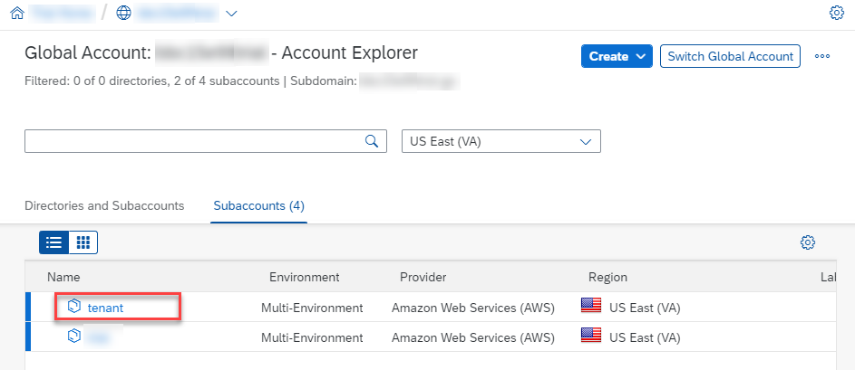](./images/SUB_SubsTenant.png?raw=true)

1.2. In the new Tenant Subaccount, **do not** enable any kind of runtime (like Kyma or Cloud Foundry).

1.3. Create a new subscription in the Tenant Subaccount. Therefore, please go to **Instances and Subscriptions** and click on **Create**. 

[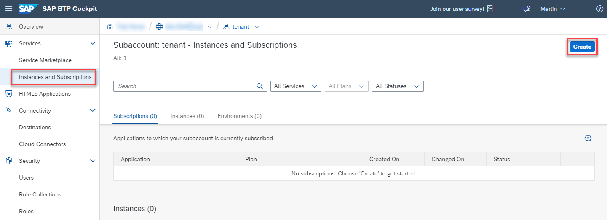](./images/SUB_CreateSub01.png?raw=true)

1.4. Select the **Sustainable SaaS** service from the dropdown list.

> **Hint** - In case of multiple deployments in the SAP BTP region (e.g., different Cloud Foundry Spaces or different Kyma Namespaces), make sure to use the correct service offering by checking the unique Service Id format in case of Kyma **\<ReleaseName>-\<Namespace>-\<ShootName>** and in case of Cloud Foundry **susaas-\<Space>-\<Organization>**.

**Kyma**

[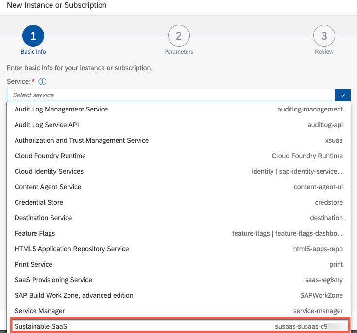](./images/SUB_CreateSub02Kyma.png?raw=true)

**Cloud Foundry**

[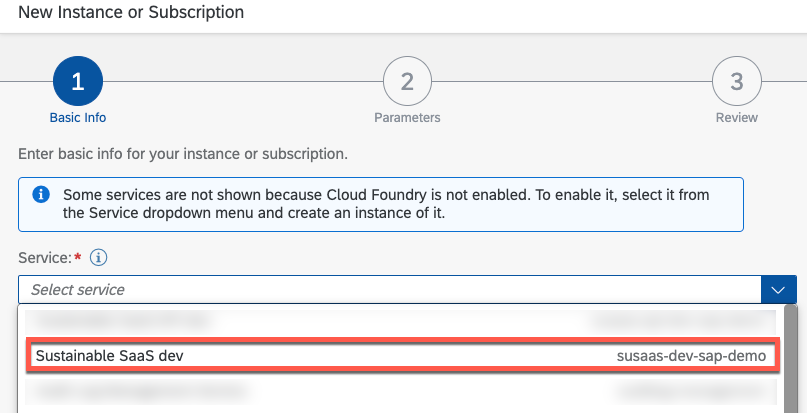](./images/SUB_CreateSub02Cf.png?raw=true)

1.5. Select a plan of your choice (e.g., **default**). In the Kyma version of this sample application, click on **Next**. In the Cloud Foundry scenario, please ignore the next step.  

1.6. In the Kyma scenario, you can now define a **custom subdomain** for your Subscriber Tenant. Please make sure to understand this feature before making use of it. If you leave this field blank, the URL of your Subscriber Tenant will be created in the following format.

> **\<SubaccountSubdomain>-\<ReleaseName>-router-\<Namespace>.\<ShootName>.kyma.ondemand.com** 
> e.g., subscriber-c3b2a1-susaas-router-default.a1b2c3.kyma.ondemand.com

While this may result in long and inconvenient URLs for your subscribers, the uniqueness of the generated subdomain is ensured when following this format. If you decide to provide a custom subdomain, the resulting URL will have the following format (as long as you are not using a custom domain).

> **\<CustomDomain>.\<ShootName>.kyma.ondemand.com**  
> e.g., subscriber.a1b2c3.kyma.ondemand.com

In this sample, we did not implement a check for the uniqueness of the value provided. It is in your responsibility to ensure, not to double-assign the same custom subdomain to your subscribers! 

1.7. Click on **Create** to setup the subscription for your Subscriber Tenant. 

1.8. Wait until your subscription is in status **Subscribed**, which can take a few minutes. In the background, the Backend Service running in your Cloud Foundry environment or Kyma Cluster will setup a new HDI Database Container for the Subscriber Tenant and create a new Cloud Foundry Route or Kyma API Rule to expose the Subscriber subdomain. This might even take a few seconds longer than implied by the **Subscribed** status.

[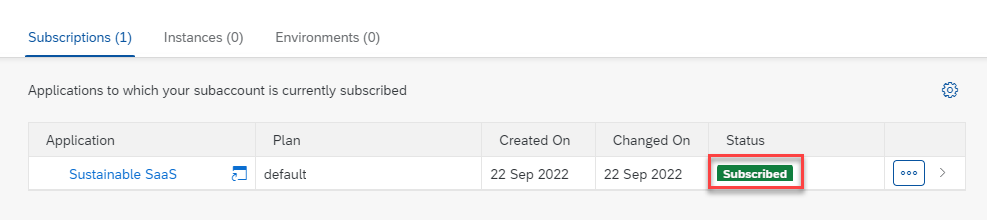](./images/SUB_CreateSub03.png?raw=true)

## 2. API Service Broker instance

Once you subscribed to the SaaS sample application from a Tenant Subaccount, you can also create a new instance of the API Service Broker. The Service Broker was automatically registered in the Tenant Subaccount during the subscription/provisioning process. 

2.1. So let us continue and create an instance of the API Service Broker which was registered in the Tenant Subaccount during the provisioning process. 

2.2. Therefore, go to the **Instances and Subscriptions** menu and click on **Create** again. Select the new **Sustainable SaaS API** service from the list. 

> **Hint** - In case of multiple deployments in the same SAP BTP region (e.g., different Cloud Foundry Space or Kyma Namespace), make sure to use the correct service offering by checking the Service Id format in Kyma **\<Release>-api-\<Namespace>-\<ShootName>**) or in Cloud Foundry **susaas-api-\<Space>-\<Organization>**.

**Kyma**

[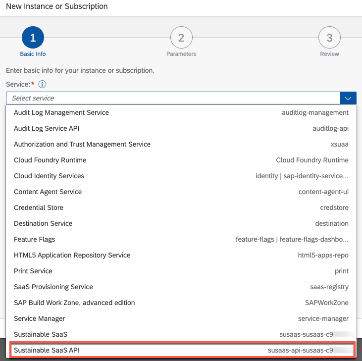](./images/SUB_CreateAPI01Kyma.png?raw=true)

**Cloud Foundry**

[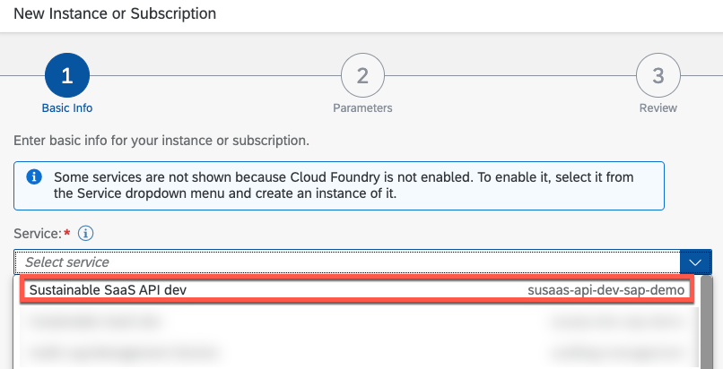](./images/SUB_CreateAPI01Cf.png?raw=true)

2.3. Decide on a service plan of your choice like **default**. There is no difference in available features for testing purposes. As Runtime Environment select **Other** and give your instance a name like **susaas-api**. Then click on **Create**.

[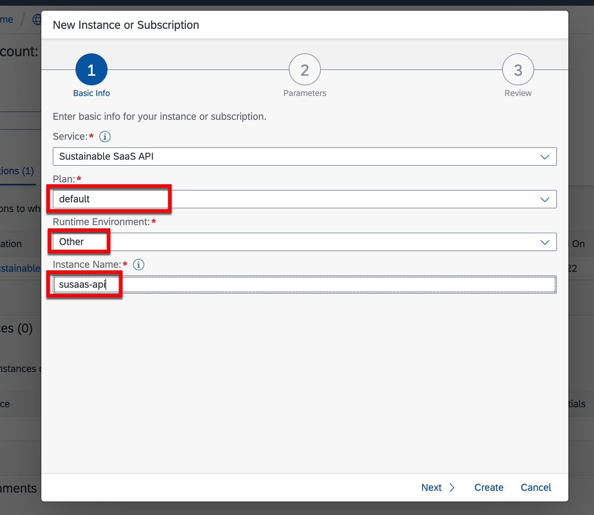](./images/SUB_CreateAPI02.png?raw=true)

2.4. Once the instance is created, you will see it in your list of available services. 

[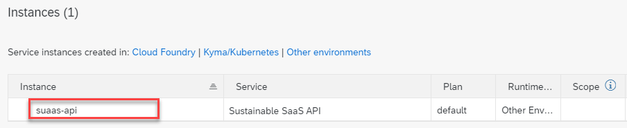](./images/SUB_CreateAPI02.png?raw=true)

2.5. You can now create a new **Service Binding** which can be used by your API clients like e.g., SAP S/4HANA or any other third-party tool interacting with the SaaS API. In this sample, the binding is named **default**. 

> **Hint** - Clicking on the service binding will show you the Client Credentials required for API access. 

[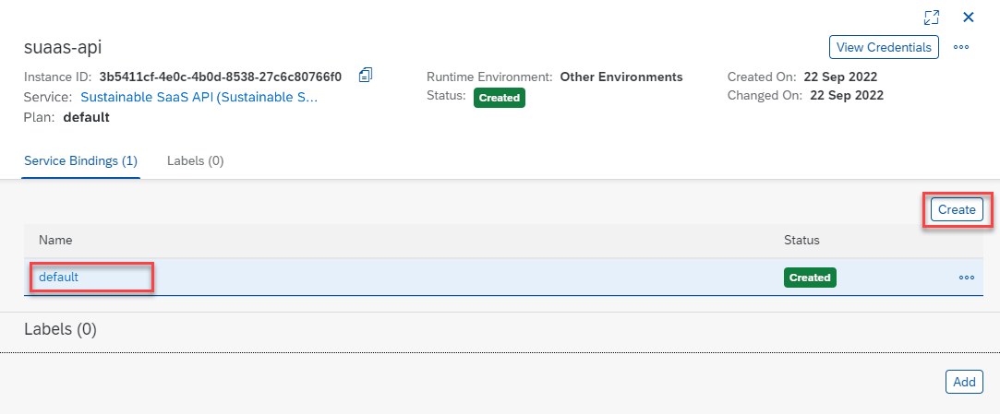](./images/SUB_CreateAPI04.png?raw=true)

2.6. Here you see a sample of the Client Credentials containing the actual API endpoint as well as the authentication endpoints, Client ID, and Client Secret which are essential for external access to the SaaS API. As you can see, the credentials for Kyma and Cloud Foundry have a very similar structure.

> **Important** - The Client ID and Secret are unique for each Subscriber Tenant and tokens created using these credentials are used by CAP to identify a Tenant interacting with this API.

**Kyma**

[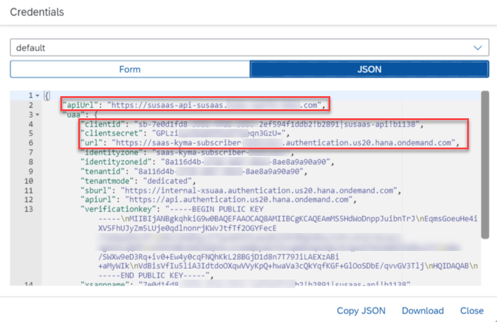](./images/SUB_CreateAPI05Kyma.png?raw=true)

**Cloud Foundry**

[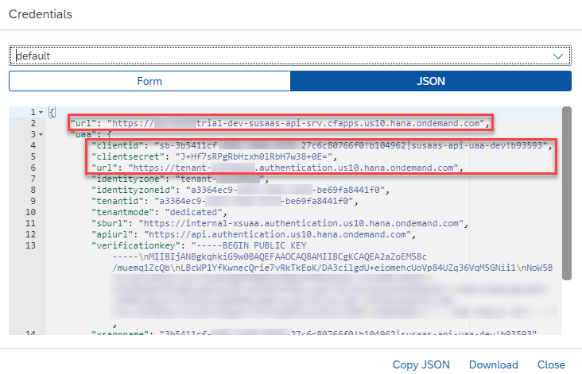](./images/SUB_CreateAPI05Cf.png?raw=true)

2.7. Keep the last steps in mind, as you will need the Client Credentials again in one of the next tutorial steps.

## 3. Initialize the SaaS application

Once the SaaS subscription was successful and you created a new API Service Broker instance in the Tenant Subaccount, you (as a Provider) need to set up a first administrative user for your tenant's SaaS application instance.

> **Important** - As the SaaS application offers an in-app user management component, all regular Tenant users can created and managed from within the application. If you create users manually from the SAP BTP Cockpit and assign a role collection, these users will not show up in the in-app user management.  

3.1. To give the first Tenant administrator access to the SaaS instance, please **temporarily** assign the **Susaas Administrator** role collection to your own user to finish the onboarding process in the Tenant Subaccount. This is the only time a **temporary** assignment of a role collection in the SAP BTP Cockpit takes place to complete the onboarding process.

Make sure to select the correct role collection if you deployed the SaaS sample application multiple times in the same SAP BTP region. For example in Kyma, the format in parenthesis is as follows - **\<ReleaseName>-\<Namespace>** and in Cloud Foundry it contains the **Space** name.

**Kyma** 

[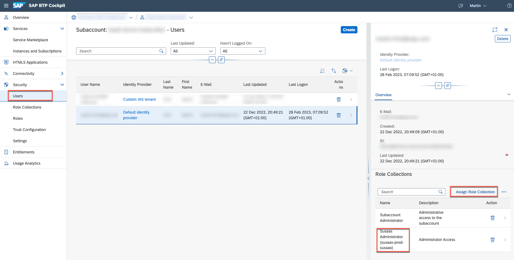](./images/SUB_InitApp02Kyma.png?raw=true)

**Cloud Foundry**

[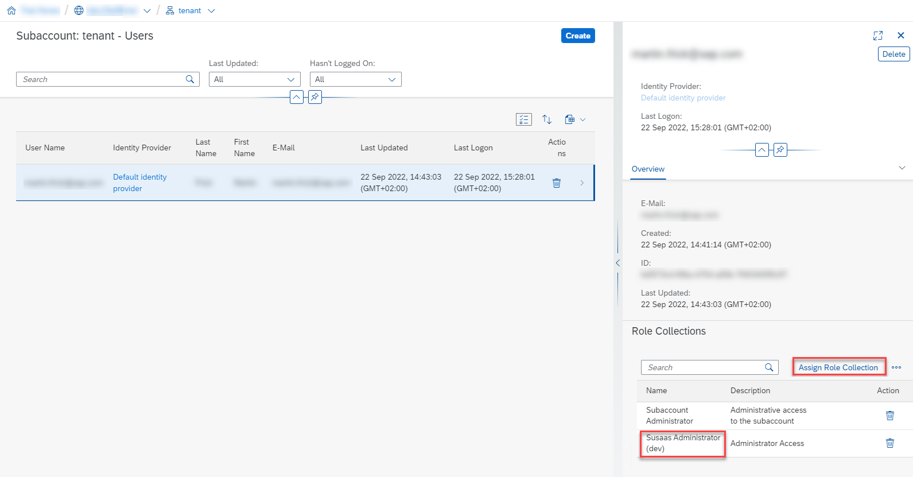](./images/SUB_InitApp02Cf.png?raw=true)

> **Hint** - The **Susaas Administrator** role allows users to create new projects, assign members to projects, and create assessments in the sample application. Furthermore, an administrator can add new users to the tenant's SaaS instance. The **Susaas Member** role collection allows project members to create new assessments in a dedicated project. The **Susaas Extension** role collection allows developers of a Subscriber Tenant to extend the SaaS application using standard CAP extension features for SaaS Apps.

[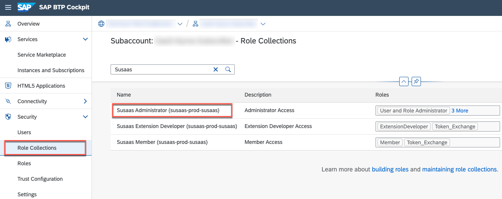](./images/SUB_InitApp01.png?raw=true)

3.2. Once the **Susaas Administrator** role collection is temporarily assigned to you as a Provider (doing the initial onboarding), go back to the **Instances and Subscriptions** and open the subscription in an Incognito window so that the latest scopes are available. 

[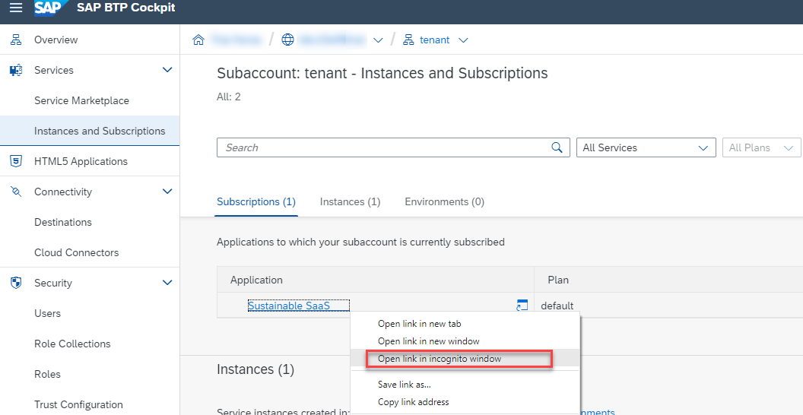](./images/SUB_InitApp03.png?raw=true)

3.3. After successful login using your Provider administrator user, open the **Manage Users** tile. 

[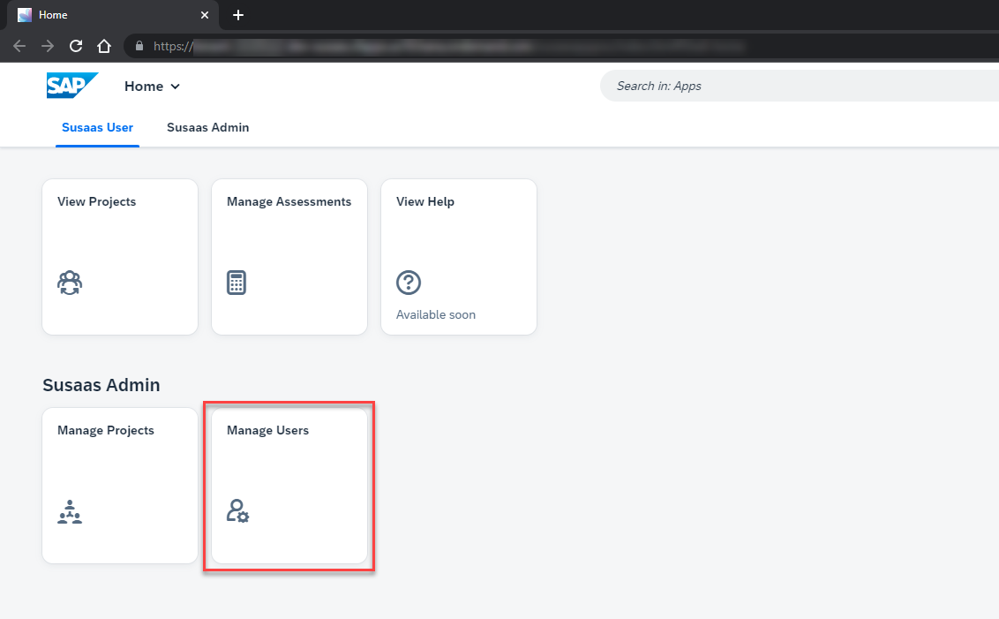](./images/SUB_InitApp05.png?raw=true)

3.4. Click on **Create** to add a new Tenant administrator user to the tenant's SaaS application instance. This will be the first real administrative user of the SaaS application from a Tenant perspective.

[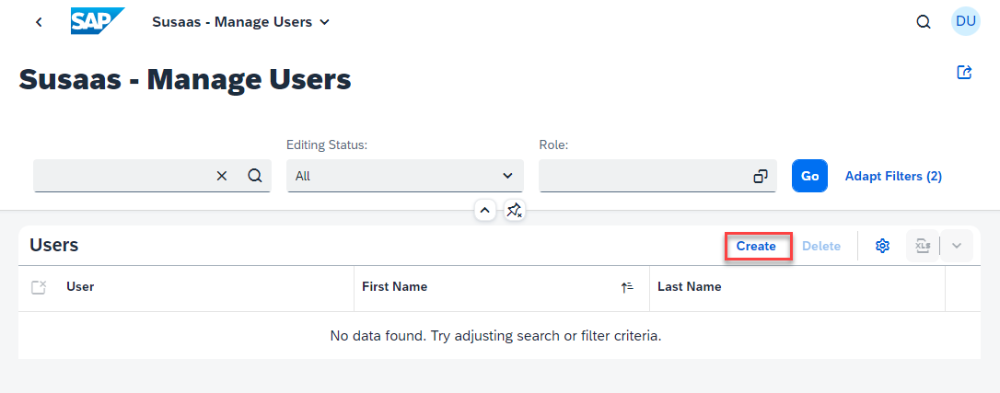](./images/SUB_InitApp06.png?raw=true)

3.5. Provide the first and last name of the first Tenant administrator and a valid e-mail address. This e-mail address has to match an existing SAP ID Service user (e.g., a valid S or P user)! 

> **Hint** - To create a new SAP ID Service account that can be used for this purpose, please follow [this tutorial](https://developers.sap.com/tutorials/hcp-create-trial-account.html).

[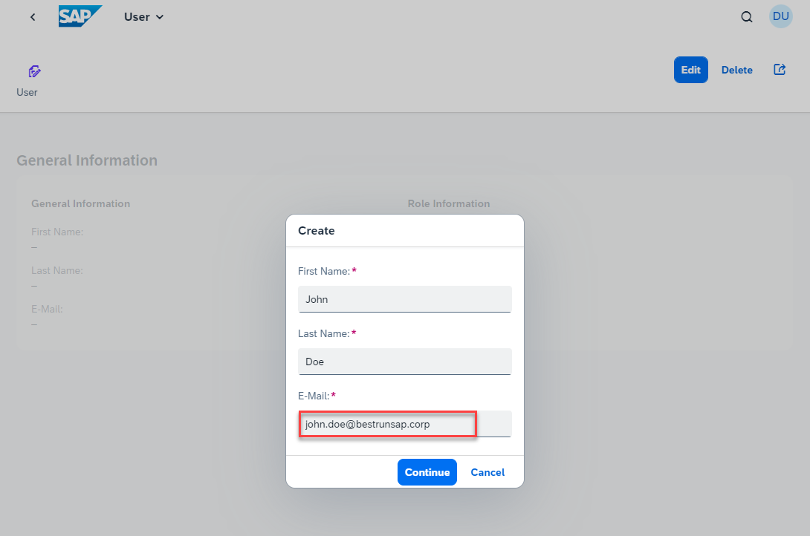](./images/SUB_InitApp07.png?raw=true)

3.6. Assign the required **Susaas Administrator** role using the selection field. Click on **Create** to set up the user in the Tenant database container as well as to trigger an automated user creation and role assignment in the Tenant Subaccount. 

[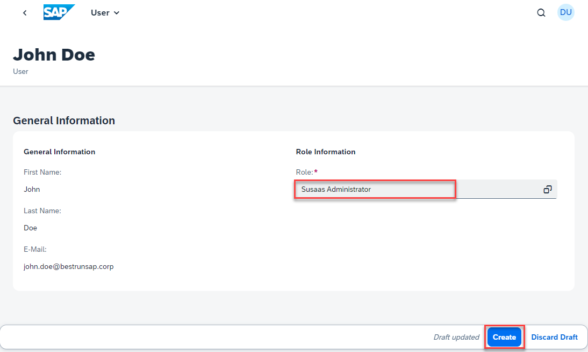](./images/SUB_InitApp08.png?raw=true)

3.7. Clicking on the back arrow in the top left of your screen, you can switch back to the user list and should see the first Tenant administrator user you just created. This finalizes the onboarding process from a Provider perspective. 

[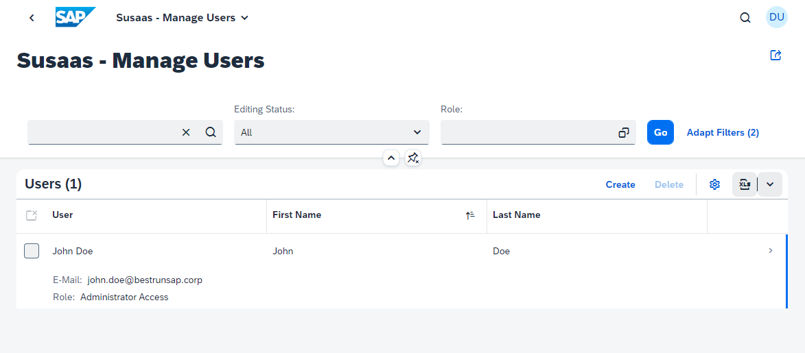](./images/SUB_InitApp09.png?raw=true)

3.8. Going back to the SAP BTP Cockpit, you can see the Tenant administrator user you just created in the **Users** menu, with the respective Susaas Administrator role collection assigned. Remember not to create, change or delete any users or administrator outside the in-app user management!

[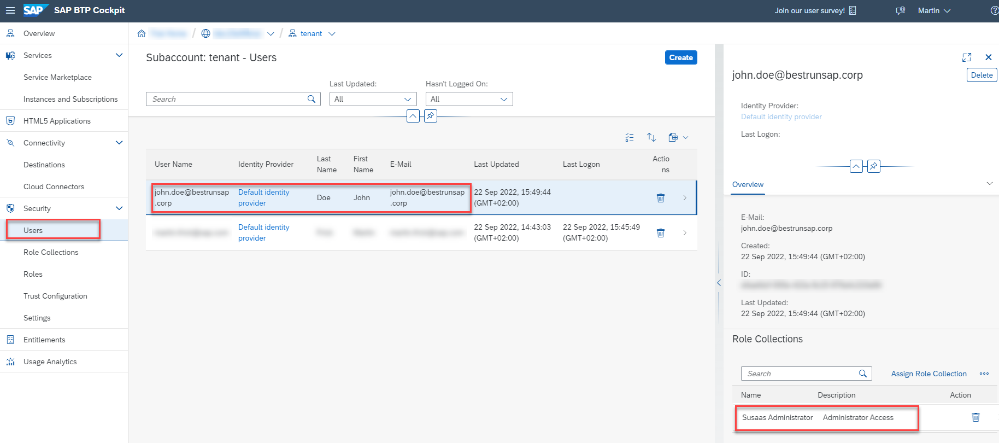](./images/SUB_InitApp10.png?raw=true)

3.9. This Tenant administrator user can now log in to the Tenant instance of the SaaS application and create further Tenant members or administrators using the in-app user management. Just provide them with the URL of the tenant-specific subscription. 

[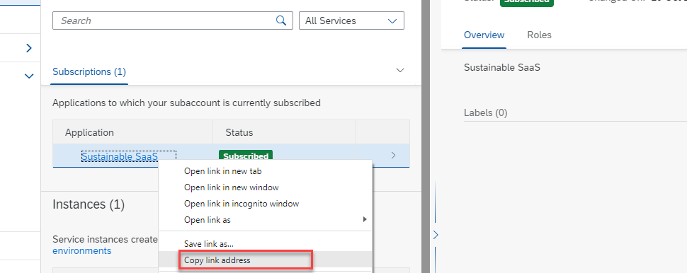](./images/SUB_TenantURL.png?raw=true)

3.10. You can now remove the **Susaas Administrator** role collection from your own user again using the SAP BTP Cockpit features. Remember - The **temporary** role collection assignment was only required for the initial onboarding of the first **tenant administrator** user using the in-app user management.

## 4. Improvement options

Concerning the automation of onboarding processes, some further aspects of the previous steps could be automated:

- Automating the whole Tenant Subaccount onboarding
- Further automating the overall subscription process
- Automating the setup of a first Tenant administrator

These aspects have not been covered in the sample application (for now), but feel free to add further features to this sample application using a pull request. 

## 5. Further Information

Please use the following links to find further information on the topics above:

* [SAP Help - Providing Multitenant Applications to Consumers](https://help.sap.com/docs/BTP/65de2977205c403bbc107264b8eccf4b/7a013f1d89f34a0084ea3d9a8bb2adbd.html?locale=en-US)
* [SAP Help - Create a Subaccount](https://help.sap.com/docs/BTP/65de2977205c403bbc107264b8eccf4b/05280a123d3044ae97457a25b3013918.html?locale=en-US)
* [SAP Help - Subscribe to Multitenant Applications Using the Cockpit](https://help.sap.com/docs/BTP/65de2977205c403bbc107264b8eccf4b/7a3e39622be14413b2a4df7c02ca1170.html?locale=en-US)
* [SAP Help - Managing Services Using the SAP BTP Cockpit](https://help.sap.com/docs/SERVICEMANAGEMENT/09cc82baadc542a688176dce601398de/cdce096d411242bcbfb9644d0860fd0f.html?locale=en-US)
* [SAP Help - Security Administration: Managing Authentication and Authorization](https://help.sap.com/docs/BTP/65de2977205c403bbc107264b8eccf4b/1ff47b2d980e43a6b2ce294352333708.html?locale=en-US)
* [SAP Help - Assigning Role Collections to Users or User Groups](https://help.sap.com/docs/BTP/65de2977205c403bbc107264b8eccf4b/31532c77bd61421e9d40d100fd75ef52.html?locale=en-US)