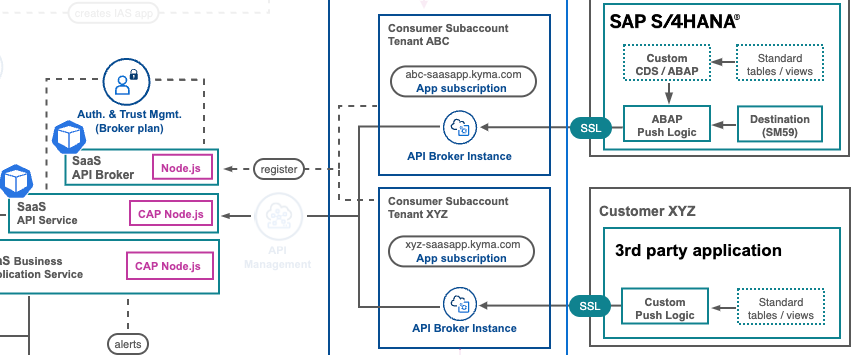
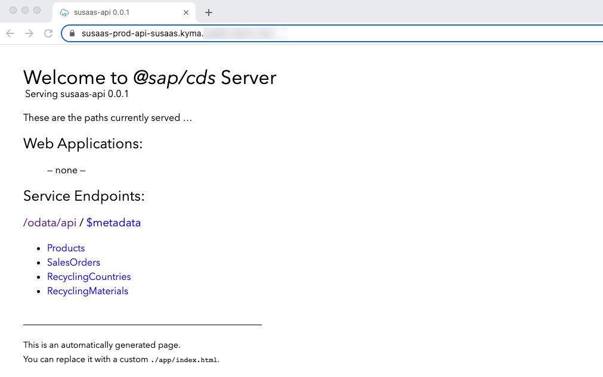
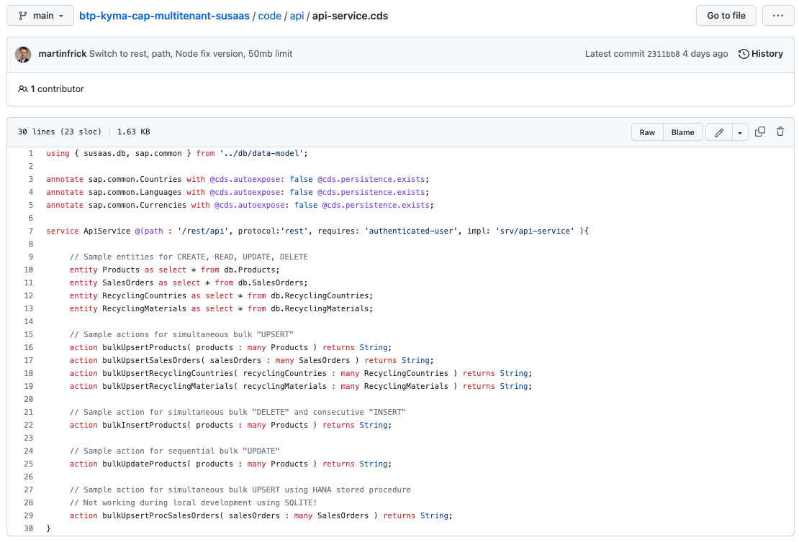
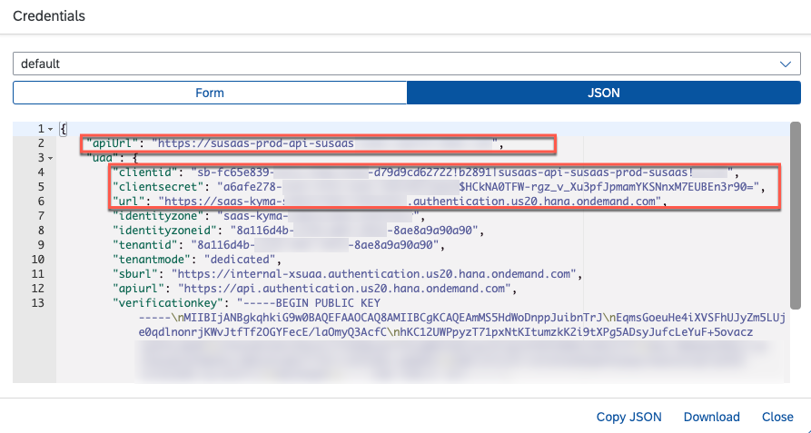
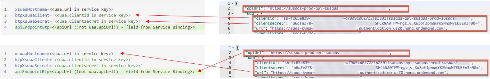
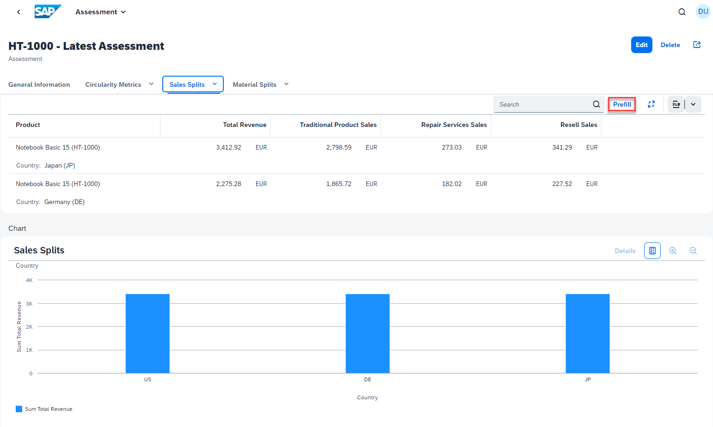

# Push data to the SaaS API

- **Kyma** ✅ 
- **Cloud Foundry** ✅

The SaaS sample application is equipped with a built-in SaaS API, that your subscribers can use, to push data to their Tenant database containers or to modify existing data. In this part of the tutorial, you will learn how to connect to this API endpoint as a SaaS Tenant and push some sample data. 

- [Push data to the SaaS API](#push-data-to-the-saas-api)
  - [1. SaaS API access](#1-saas-api-access)
  - [2. Further Information](#2-further-information)

In the **Basic Version**, we will keep it short and simple and explain how to interact with the SaaS API using the HTTP sample files provided as part of the GitHub repository. You can also run similar requests using tools like Postman or Insomnia. 

[](./images/API_ArchDetails.png?raw=true)


## 1. SaaS API access

Below you can see the tables of the Tenant data model which can be maintained by subscribers using the SaaS API. Besides product master data, SaaS subscribers can also use the API for transactional data allowing them to prefill their Sustainability assessments.

[](./images/DM_Tables.png?raw=true)

The main entities like Products, Sales Orders and further Recycling data can be maintained using the API. As you can see, also some sample endpoints are provided for bulk inserts, updates, and upserts (implemented using a SAP HANA Stored Procedure or native CAP Upsert features). 

[](./images/API_Endpoints01.png?raw=true)
[](./images/API_Endpoints02.png?raw=true)

To connect to the SaaS API as a subscriber, make sure you followed all steps described in **Subscribe a Consumer Subaccount** ([click here](../4-subscribe-consumer-subaccount/README.md)). You will need the service binding credentials which you created for the API Broker service instance in the Subscriber Subaccount. If you haven't created this service binding yet, please go back and do it now. 

[](./images/API_ServiceKey.png?raw=true)

1.1. Get started by switching to the **/code/test/http** directory. Here you will find sample API calls that you can use to push sample data to Tenant database containers using the multitenant SaaS API. In this sample we will push **Product** sample data (*apiProducts.http*) to the SaaS API which will be stored in the respective Tenant database container. Make sure you have the required plugin (e.g., for VS Code) installed to execute requests in HTTP files.  

1.2. Before executing the https calls, we need to create a **.env** file within the same folder **/code/test/http**, in which you can provide the tenant-specific Client Credentials.

> **Important** - Make sure **not to commit** these details to GitHub! Either remove the credentials before saving or rename your HTTP files to **-private.http** (e.g., apiProducts-private.http), which are excluded by the *.gitignore* file. 

The content of the file needs to be as follows:

```xsuaaHostname=<<uaa.url in service key>>
btpXsuaaClient='<<uaa.clientid in service key>>'
btpXsuaaSecret='<<uaa.clientsecret in service key>>'
apiEndpointBtp=<<apiUrl (!not uaa.apiUrl!) - field from Service Binding>>
```

Please use the marked fields for the input.
[](./images/API_HttpCreds.png?raw=true)

> **Hint** - The *xsuaaHostname* is equal to the *uaa.url* parameter. The *apiEndpointBtp* equals the *apiUrl* parameter.

1.3. After updating the relevant parameters based on your Tenant Subaccount Client Credentials, you can request an OAuth token for accessing the SaaS API. Therefore, execute the following request which will return a Bearer access token that can be used for the upcoming API calls. This token will allow the CAP framework to uniquely identify a certain Tenant and to connect it to the correct Tenant database container.

> **Important** - If you're facing an **Unauthorized** error, please try to URL-encode (various web-tools or npm packages available to do so) your Client ID and Secret and try to fetch a token again!

```http
# @name getXsuaaToken

POST {{xsuaaHostname}}/oauth/token
Accept: application/json
Content-Type: application/x-www-form-urlencoded

client_id={{btpXsuaaClient}}
&client_secret={{btpXsuaaSecret}}
&grant_type=client_credentials
```

1.4. Once you obtained an access token, run the following request to upload sample products to the SaaS API on behalf of your current Subscriber Tenant. The respective product data will be stored in the Tenant database container and can be used to create new assessments in the SaaS sample application instance of the Tenant. The required access token is taken from the results of the previous OAuth request. 

> **Hint** - In the **Advanced Features**, you will learn that the sample EPM model provides the same data values, and that your subscriber's on-premise solutions like SAP S/4HANA can use the same SaaS API endpoints to push this sample product data. 

```http
@access_token = {{getXsuaaToken.response.body.$.access_token}}

# @name uploadProductsBtp

POST {{apiEndpointBtp}}/rest/api/bulkUpsertProducts
Authorization: Bearer {{access_token}}
Content-type: application/json

{
"products" : [
        {"ID":"HT-1000","typeCode":"PR","category":"Notebooks","supplierId":"0100000046","taxTarifCode":1,"measureUnit":"EA","weightMeasure":4.2,"weightUnit":"KG","price":956,"text":"Notebook Basic 15","language_code":"E","currency_code":"EUR"},
        {"ID":"HT-1001","typeCode":"PR","category":"Notebooks","supplierId":"0100000047","taxTarifCode":1,"measureUnit":"EA","weightMeasure":4.5,"weightUnit":"KG","price":1249,"text":"Notebook Basic 17","language_code":"E","currency_code":"EUR"},
        {"ID":"HT-1002","typeCode":"PR","category":"Notebooks","supplierId":"0100000048","taxTarifCode":1,"measureUnit":"EA","weightMeasure":4.2,"weightUnit":"KG","price":1570,"text":"Notebook Basic 18","language_code":"E","currency_code":"USD"},
        {"ID":"HT-1003","typeCode":"PR","category":"Notebooks","supplierId":"0100000049","taxTarifCode":1,"measureUnit":"EA","weightMeasure":4.2,"weightUnit":"KG","price":1650,"text":"Notebook Basic 19","language_code":"E","currency_code":"EUR"},
        {"ID":"HT-1055","typeCode":"PR","category":"Multifunction Printers","supplierId":"0100000069","taxTarifCode":1,"measureUnit":"EA","weightMeasure":6.3,"weightUnit":"KG","price":99,"text":"Multi Print","language_code":"E","currency_code":"EUR"},
        {"ID":"HT-1056","typeCode":"PR","category":"Multifunction Printers","supplierId":"0100000070","taxTarifCode":1,"measureUnit":"EA","weightMeasure":4.3,"weightUnit":"KG","price":119,"text":"Multi Color","language_code":"E","currency_code":"JPY"},
        {"ID":"HT-1060","typeCode":"PR","category":"Mice","supplierId":"0100000071","taxTarifCode":1,"measureUnit":"EA","weightMeasure":0.09,"weightUnit":"KG","price":9,"text":"Cordless Mouse","language_code":"E","currency_code":"EUR"},
        {"ID":"HT-1063","typeCode":"PR","category":"Keyboards","supplierId":"0100000074","taxTarifCode":1,"measureUnit":"EA","weightMeasure":2.1,"weightUnit":"KG","price":14,"text":"Ergonomic Keyboard","language_code":"E","currency_code":"BRL"},
        {"ID":"HT-1120","typeCode":"PR","category":"Keyboards","supplierId":"0100000065","taxTarifCode":1,"measureUnit":"EA","weightMeasure":1,"weightUnit":"KG","price":29,"text":"Cordless Bluetooth Keyboard","language_code":"0","currency_code":"EUR"}
    ]
}
```

1.5. Enrich the product data stored in your Tenant database container with further details, by using the following request. It will update existing product records with sales split details and additional sustainability notions. 

> **Hint** - You might ask yourself why these additional details are not part of the initial product data request?! Unfortunately, this advanced product information is not part of the EPM model and has been added for illustration purposes of a potential sustainability use-case. Therefore, it has to be provided by a manual upload or maintained in the SaaS application itself. 

```http
# @name uploadProductsExtendedBtp

POST {{apiEndpointBtp}}/rest/api/bulkUpsertProducts
Authorization: Bearer {{access_token}}
Content-type: application/json

{
    "products" : [
        {"ID": "HT-1000","eolProductDesign": 43,"traditionalSalesShare": 82,"repairSalesShare": 8,"resellSalesShare": 10},
        {"ID": "HT-1001","eolProductDesign": 38,"traditionalSalesShare": 97,"repairSalesShare": 3,"resellSalesShare": 0},
        {"ID": "HT-1002","eolProductDesign": 35,"traditionalSalesShare": 87,"repairSalesShare": 5,"resellSalesShare": 8},
        {"ID": "HT-1003","eolProductDesign": 42,"traditionalSalesShare": 74,"repairSalesShare": 20,"resellSalesShare": 6},
        {"ID": "HT-1055","eolProductDesign": 56,"traditionalSalesShare": 98,"repairSalesShare": 1,"resellSalesShare": 1},
        {"ID": "HT-1056","eolProductDesign": 49,"traditionalSalesShare": 95,"repairSalesShare": 3,"resellSalesShare": 2},
        {"ID": "HT-1060","eolProductDesign": 25,"traditionalSalesShare": 99,"repairSalesShare": 0,"resellSalesShare": 1},
        {"ID": "HT-1063","eolProductDesign": 34,"traditionalSalesShare": 97,"repairSalesShare": 1,"resellSalesShare": 2},
        {"ID": "HT-1120","eolProductDesign": 28,"traditionalSalesShare": 95,"repairSalesShare": 2.5,"resellSalesShare": 2.5}
    ]
}
```

1.6. In case you want to go ahead and upload the same sample data which is also provided in the CSV test files ([click here](https://github.com/SAP-samples/btp-cap-multitenant-saas/tree/main/code/test/data)), you can use the remaining HTTP files to do so. Simply provide the Tenant Subaccount specific Client Credentials in the header of the HTTP files and you're ready to push the sample content to dedicated Subscriber tenants. Don't forget to rename your files to *-private.http, preventing them from being committed to Git. 

- [Products](https://github.com/SAP-samples/btp-cap-multitenant-saas/blob/main/code/test/http/apiProducts.http)
- [Sales Orders](https://github.com/SAP-samples/btp-cap-multitenant-saas/blob/main/code/test/http/apiSalesOrders.http)
- [Recycling by Country](https://github.com/SAP-samples/btp-cap-multitenant-saas/blob/main/code/test/http/apiRecyclingCountries.http)
- [Recycling by Material](https://github.com/SAP-samples/btp-cap-multitenant-saas/blob/main/code/test/http/apiRecyclingMaterials.http)

1.7. After pushing all data provided in the HTTP files, you will be able to progress with the next part of this tutorial and test the SaaS sample application end-to-end. You can create Assessments for the uploaded products and even **prefill** Sales Orders, Materials, and Recycling sample values. Below you can see a sample Assessment which was created based on the provided data of product **HT-1000**.

[](./images/API_SampleHT1000.png?raw=true)

1.8. Feel free to proceed with the next part of the tutorial and test the SaaS sample application end-to-end from a Subscriber perspective.


## 2. Further Information

Please use the following links to find further information on the topics above:

* [SAP Help - Creating Service Keys in Cloud Foundry](https://help.sap.com/docs/SERVICEMANAGEMENT/09cc82baadc542a688176dce601398de/6fcac08409db4b0f9ad55a6acd4d31c5.html?&locale=en-US)
* [Capire documentation - Embedded CQL with cds.ql](https://cap.cloud.sap/docs/node.js/cds-ql)
* [Cloud Foundry Documentation - Client Credentials Grant](https://docs.cloudfoundry.org/api/uaa/version/76.1.0/index.html#client-credentials-grant)
* [VS Code - REST Client](https://marketplace.visualstudio.com/items?itemName=humao.rest-client)
* [SAP Help - HANA UPSERT Statement](https://help.sap.com/docs/HANA_CLOUD_DATABASE/c1d3f60099654ecfb3fe36ac93c121bb/ea8b6773be584203bcd99da76844c5ed.html?locale=en-US)
* [SAP Help - HANA Procedures](https://help.sap.com/docs/HANA_CLOUD_DATABASE/d1cb63c8dd8e4c35a0f18aef632687f0/d43d91578c3b42b3bacfd89aacf0d62f.html?locale=en-US)