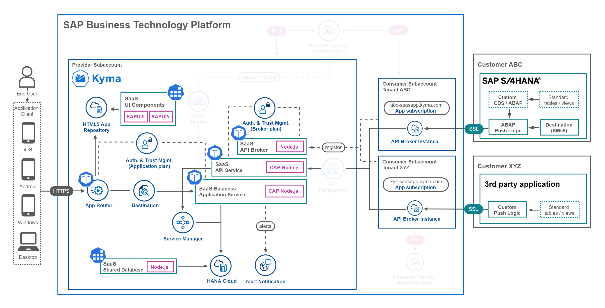
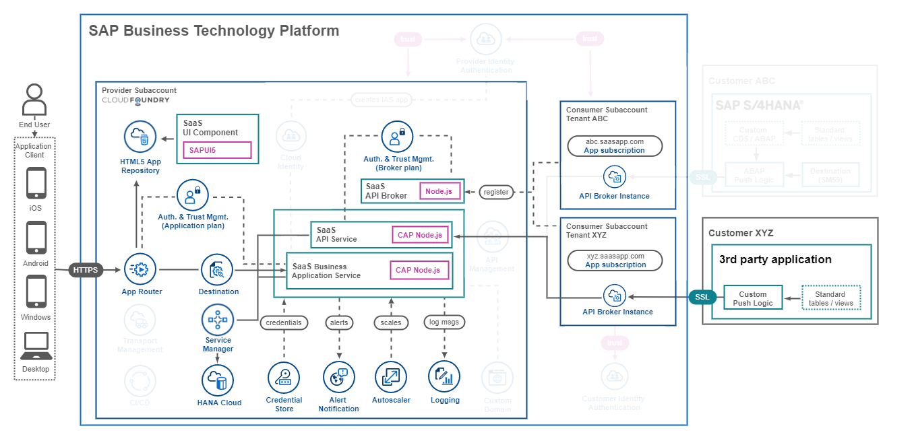
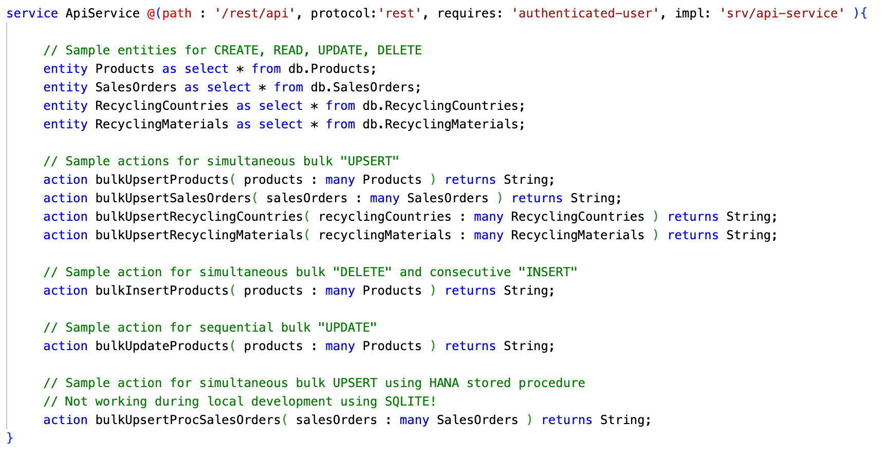
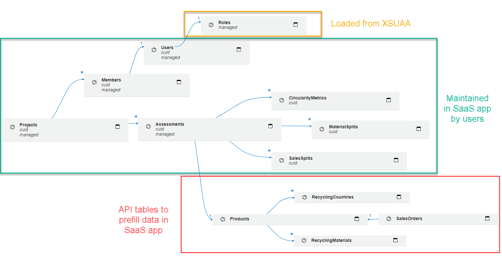

# Explore the application components

- **Kyma** ✅ 
- **Cloud Foundry** ✅

After you have deployed the sample application the following components will be available in the Cloud Foundry environment or respectively  the Kyma Cluster of your SAP BTP Provider Subaccount.

- [Explore the application components](#explore-the-application-components)
  - [1. Application Router](#1-application-router)
  - [2. UI Components](#2-ui-components)
  - [3. Business Application Service](#3-business-application-service)
  - [4. API Service](#4-api-service)
  - [5. API Service Broker](#5-api-service-broker)
  - [6. Tenant database containers](#6-tenant-database-containers)
  - [7. Shared database container](#7-shared-database-container)
  - [8. Further information](#8-further-information)

This part of the tutorial will provide deeper insights for the different components and lets you build up some expert knowledge about topics like **Service Brokers** or **Multitenancy**. The screenshot below shows the architectures of the **Basic Version** using **Free (Tier) service plans** of your own **Pay-as-you-Go** (PAYG) or **CPEA** account.

**Kyma**

**Cloud Foundry**

## 1. Application Router 

> **Important** - Find more details in the [Multitenancy Readme](./components/Multitenancy.md) Reamde document!

The Application Router is the single point of entry for most applications running in SAP BTP. An Application Router can be used to serve static content, authenticate users, rewrite URLs, and forward or proxy requests to other microservices while propagating user and tenant information.

As of today, each multitenant application has to deploy its own Application Router, authorizing and routing requests of all tenants to the SaaS application. The Application Router is able to determine the tenant identifier out of the URL and then forwards the authentication request to the User Account and Authentication \(UAA\) service of the related identity (xsuaa) zone.

Furthermore, the Application Router is routing traffic to the various UI components, which are stored in the HTML5 Application Repository. 

## 2. UI Components

The user interface of this sample application has been developed using **SAP Fiori Elements**. SAP Fiori Elements applications benefit from a template and metadata-driven approach. SAP Fiori Elements provides designs for UI patterns and predefined floorplans for common application use cases. App developers can use SAP Fiori Elements to create SAP Fiori applications based on OData services and annotations that don't need JavaScript UI coding. 

The resulting Fiori Elements components use predefined views and controllers that are provided centrally. This means no application-specific view instances are required. SAPUI5 interprets metadata and annotations of the underlying OData service and uses the corresponding views for the SAP Fiori app at startup. Still, SAP Fiori Elements applications can also be extended with minimal coding effort.

To learn more about SAP Fiori Elements please check out the excellent [**SAP Fiori elements for OData V4 Feature Showcase**](https://github.com/SAP-samples/fiori-elements-feature-showcase/) and the links provided in the **Further Information** section.

## 3. Business Application Service

> **Important** - Find more details in the [Helper Classes](./components/HelperClasses.md) document!

The service layer of the SaaS sample application has been developed using the **SAP Cloud Application Programming (CAP)** framework. It provides OData services for the UI modules and has built-in support for multitenancy using an SAP HANA Cloud database. Furthermore, it provides subscription callbacks required for Tenant onboarding. While the definition of OData services and custom handlers is straightforward, most of the interesting code snippets can be found in the **code/srv/utils** directory, providing functions and classes used for the automation of subscription requirements or user management. The Business Application Service also contains the annotations required by SAP Fiori Elements for automatically rendering a proper UI. 

## 4. API Service 

> **Important** - Find more information on how to use the SaaS API in the following part of the tutorial ([click here](../5-push-data-to-saas-api/README.md))!

For consumers that want to push data to their database container instances, a CAP-based API endpoint has been developed. Tenants can use this API to push data to their own SAP HANA HDI database containers for calculation and analysis purposes. The API is accessible using Client Credentials provided to Consumer Tenants using a service instance of our custom SaaS API Service Broker. 

Below you can see the available entities of the SaaS API like Product details and Sales Orders.

Besides the default CRUD methods for entity maintenance, also sample actions are provided allowing bulk upload (UPSERT, DELETE & INSERT) for the main application entities. Finally, you can find a great sample of an OData action allowing you to UPSERT Sales Orders using a SAP HANA Stored procedure.

## 5. API Service Broker 

> **Important** - Find more details in the [Service Broker](./components/ServiceBrokers.md) document!

A service broker is responsible for managing service instances of a certain service implementation running in the SAP BTP environment. Such services instances can then be bound to applications that require the features provided by such a service implementation. For this purpose, a service broker can also be used to create an manage bindings between service instances and applications that want to make use of the service features. 

In this application scenario, we created an API for SaaS subscribers as a backing service. Therefore, the service broker is responsible of creating [SaaS API](#saas-api) service instances in the Subscriber Subaccounts. Using these service instances, subscribers can then create so called service bindings, providing them with Client Credentials to interact with the SaaS API. Both, creating a service instance and corresponding service bindings, is handled by the API Service Broker. 

## 6. Tenant database containers

The application provides a sample data model, which supports the flexible usage of SAP Fiori Elements including features like Draft support. This data model is deployed upon subscription of a new Consumer Tenant into a separate SAP HANA HDI database container. You don't have to take care of this process as it is automatically handled by a **SAP Service Manager** Instance (*container* plan). Check the [**Further Information**](#8-further-information) section to learn more about HDI containers managed by SAP Service Manager. Using the SAP HANA Deployment Infrastructure (HDI) and associated containers, allows secure isolation of all tenant-related data. 

As CAP is a great backing service for the usage of SAP Fiori Elements providing the required OData services and annotations, also the data model structure has to be compliant with an easy-to-consume user interface usage. Furthermore, the requirement of a tenant-based SaaS API is fulfilled by dedicated tables which Tenants can maintain using the SaaS API. By decoupling these tables from draft-enabled application tables, consumers can decide to prefill content into their assessments but are also flexible in setting up their own scenarios using the manual data input. 

Below you can see an overview of the tables deployed into Tenant database containers upon subscription.

> **Hint** - The **Roles** table is only used for local development scenarios. If running the app in SAP BTP, the roles are automatically fetched from SAP XSUAA and no separate storage is required. 

## 7. Shared database container

> **Important** - Find more details in the [Shared Container](./components/SharedContainer.md) document!

To have the ability of sharing data among your Consumer tenants, a shared database container is set up for our sample scenario. This allows you as a Provider to maintain e.g., central master data in a dedicated place and update it simultaneously for all Consumer tenants. This concept is building on the cross-container access capabilities of HDI database containers. 

## 8. Further information

Please use the following links to find further information on the topics above:

* [SAP Help - Application Router](https://help.sap.com/docs/BTP/65de2977205c403bbc107264b8eccf4b/01c5f9ba7d6847aaaf069d153b981b51.html?locale=en-US)
* [SAP Help - Multitenancy](https://help.sap.com/docs/BTP/65de2977205c403bbc107264b8eccf4b/5310fc31caad4707be9126377e144627.html)
* [npmjs - @sap/approuter](https://www.npmjs.com/package/@sap/approuter)
* [Fiori Design Guidelines - SAP Fiori Elements](https://experience.sap.com/fiori-design-web/smart-templates/)
* [SAPUI5 - Developing Apps with SAP Fiori Elements](https://sapui5.hana.ondemand.com/sdk/#/topic/03265b0408e2432c9571d6b3feb6b1fd)
* [GitHub - SAP Fiori Elements for OData V4 Feature Showcase](https://github.com/SAP-samples/fiori-elements-feature-showcase/)
* [CAP documentation - Serving Fiori UIs](https://cap.cloud.sap/docs/advanced/fiori)
* [CAP documentation - Welcome to CAP](https://cap.cloud.sap/docs/)
* [SAP Blog - The hidden life of ServiceManager handled containers](https://community.sap.com/t5/technology-blogs-by-sap/the-hidden-life-of-servicemanager-handled-containers/ba-p/13477851)