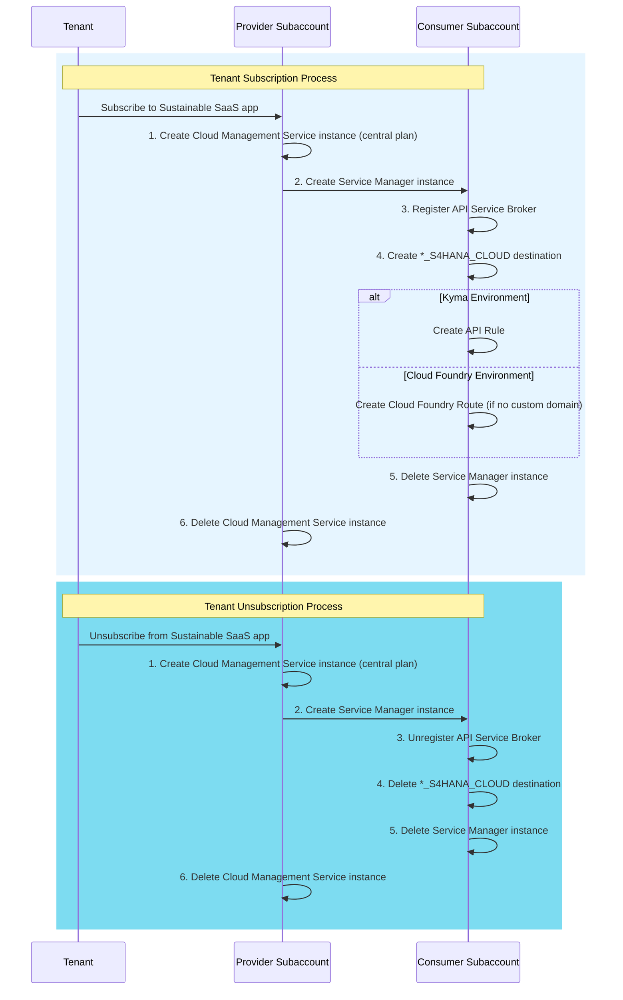

# Deep Dive into Helper Classes

- **Kyma** ✅ 
- **Cloud Foundry** ✅

In this part of the tutorial, you will learn about the different helper classes implemented in the business application service. These classes mainly support the automation of the Tenant subscription process. Furthermore, they contain the logic of the in-app user management.  

- [Deep Dive into Helper Classes](#deep-dive-into-helper-classes)
  - [1. Overview](#1-overview)
  - [2. Automator (tenant-automator.js)](#2-automator-tenant-automatorjs)
  - [3. Cloud Management Helper (cloud-management-service.js)](#3-cloud-management-helper-cloud-management-servicejs)
  - [4. Service Manager Helper (service-manager.js)](#4-service-manager-helper-service-managerjs)
  - [5. Token Helper (token-helper.js)](#5-token-helper-token-helperjs)
  - [6. Destination Helper (destination.js)](#6-destination-helper-destinationjs)
  - [7. Credential Store Helper (credential-store.js)](#7-credential-store-helper-credential-storejs)
  - [8. User Management Helper (user-management.js)](#8-user-management-helper-user-managementjs)
  - [9. Alert Notification Helper (alert-notification.js)](#9-alert-notification-helper-alert-notificationjs)
  - [10. Kyma Utils (kyma-helper.js)](#10-kyma-utils-kyma-helperjs)
  - [11. Cloud Foundry Utils (cloud-foundry.js)](#11-cloud-foundry-utils-cloud-foundryjs)

## 1. Overview

The table below shows all helper classes used by the Sustainable SaaS business application service:

| Util          | Source Code                | Description                                                           | 
| ------------- | -------------------------- | --------------------------------------------------------------------- |
| [Automator](#2-automator-tenant-automatorjs)     | [tenant-automator.js](https://github.com/SAP-samples/btp-cap-multitenant-saas/blob/main/code/srv/srv/utils/tenant-automator.js)| Runtime-specific helper classes for automatic creation and deletion of artifacts on Tenant (un-)subscription | 
| [Cloud-Management-Helper](#3-cloud-management-helper-cloud-management-servicejs) | [cloud-management-service.js](https://github.com/SAP-samples/btp-cap-multitenant-saas/blob/main/code/srv/srv/utils/cloud-management-service.js) | Helper class interacting with Cloud Management Service (central plan) |
| [Service-Manager-Helper](#4-service-manager-helper-service-managerjs) | [service-manager.js](https://github.com/SAP-samples/btp-cap-multitenant-saas/blob/main/code/srv/srv/utils/service-manager.js) | Helper class interacting with Service Manager Subaccount (admin plan) |
| [Token-Helper](#5-token-helper-token-helperjs)  | [token-helper.js](https://github.com/SAP-samples/btp-cap-multitenant-saas/blob/main/code/srv/srv/utils/token-helper.js) | Helper class retrieving tokens from relevant OAuth2 servers |
| [Destination-Helper](#6-destination-helper-destinationjs)  | [destination.js](https://github.com/SAP-samples/btp-cap-multitenant-saas/blob/main/code/srv/srv/utils/destination.js) | Helper module interacting with the SAP Destination Service |
| [Credential-Store-Helper](#7-credential-store-helper-credential-storejs)  | [credential-store.js](https://github.com/SAP-samples/btp-cap-multitenant-saas/blob/main/code/srv/srv/utils/credential-store.js) | Helper module interacting with the SAP Credential Store when using Cloud Foundry |
| [User-Management-Helper](#8-User-Management-Helper)  | [user-management.js](https://github.com/SAP-samples/btp-cap-multitenant-saas/blob/main/code/srv/srv/utils/user-management.js) | Helper class for User and Role management interacting with SAP Identity Authentication and XSUAA |
| [Alert-Notification-Helper](#9-alert-notification-helper-alert-notificationjs)  | [alert-notification.js](https://github.com/SAP-samples/btp-cap-multitenant-saas/blob/main/code/srv/srv/utils/alert-notification.js) | Helper class for interacting with SAP Alert Notification service |
| [Kyma-Utils](#10-kyma-utils-kyma-helperjs)  | [kyma-helper.js](https://github.com/SAP-samples/btp-cap-multitenant-saas/blob/main/code/srv/srv/utils/kyma-helper.js) | Helper module interacting with the SAP Kyma Runtime API (e.g., to create Kyma API Rules) |
| [Cloud-Foundry-Utils](#11-cloud-foundry-utils-cloud-foundryjs)  | [cloud-foundry.js](https://github.com/SAP-samples/btp-cap-multitenant-saas/blob/main/code/srv/srv/utils/cloud-foundry.js) | Helper module interacting with the Cloud Foundry API (e.g., to create Cloud Foundry Routes) |

## 2. Automator (tenant-automator.js)

The Tenant Automator module automates the provisioning and deprovisioning of tenants in SAP BTP. It ensures the necessary service instances, bindings, destinations, and Cloud Foundry (CF) routes are created and cleaned up efficiently.

This module supports both Cloud Foundry and Kyma environments. The workflow execution follows a step-based approach with built-in rollback mechanisms to handle failures and prevent idle resources.

As a few steps of the automation process are runtime dependent, the respective module is returning different Java Script Classes, which are overwriting and extending a TenantAutomator Base Class. While most automation steps are congruent for the **Kyma** and **Cloud Foundry Runtime** and can be handled by the Base Class implementation, the runtime-specific Classes take care of specific configurations like setting up API Rules (in Kyma) or Routes (in Cloud Foundry).

The Automator is responsible for the following tasks:

- Creation of destinations in a **Consumer Subaccount** on subscription with the help of [destination.js](https://github.com/SAP-samples/btp-cap-multitenant-saas/blob/main/code/srv/srv/utils/destination.js).
- Deletion of destinations from **Consumer Subaccount** on unsubscription with the help of [destination.js](https://github.com/SAP-samples/btp-cap-multitenant-saas/blob/main/code/srv/srv/utils/destination.js).
- Creation of a Cloud Management service instance & binding within the **Provider Subaccount** [cloud-management-service.js](https://github.com/SAP-samples/btp-cap-multitenant-saas/blob/main/code/srv/srv/utils/cloud-management-service.js)
- Deletion of a Cloud Management service instance & binding from the **Provider Subaccount** [cloud-management-service.js](https://github.com/SAP-samples/btp-cap-multitenant-saas/blob/main/code/srv/srv/utils/cloud-management-service.js)
- Creation of a service manager service instance & binding within a **Consumer Subaccount** with the help of [cloud-management-service.js](https://github.com/SAP-samples/btp-cap-multitenant-saas/blob/main/code/srv/srv/utils/cloud-management-service.js).
- Deletion of a service manager service instance & binding from a **Consumer Subaccount** with the help of [cloud-management-service.js](https://github.com/SAP-samples/btp-cap-multitenant-saas/blob/main/code/srv/srv/utils/cloud-management-service.js).
- Registering of a service broker in a **Consumer Subaccount** on subscription with the help of [service-manager.js](https://github.com/SAP-samples/btp-cap-multitenant-saas/blob/main/code/srv/srv/utils/service-manager.js).
- Unregistering of a service broker from a **Consumer Subaccount** on unsubscription with the help of [service-manager.js](https://github.com/SAP-samples/btp-cap-multitenant-saas/blob/main/code/srv/srv/utils/service-manager.js).

  **Kyma**  
  - Creation of new API Rules for the respective Consumer Subaccount during subscription with the help of [kyma-helper.js](https://github.com/SAP-samples/btp-cap-multitenant-saas/blob/main/code/srv/srv/utils/kyma-helper.js).
  - Deletion of existing API Rules for the respective Subaccount during unsubscription with the help of [kyma-helper.js](https://github.com/SAP-samples/btp-cap-multitenant-saas/blob/main/code/srv/srv/utils/kyma-helper.js).

  **Cloud Foundry**
  - Creation of new Routes for the respective Consumer Subaccount during subscription with the help of [cloud-foundry.js](https://github.com/SAP-samples/btp-cap-multitenant-saas/blob/main/code/srv/srv/utils/cloud-foundry.js).
  - Deletion of existing Routes for the respective Subaccount during unsubscription with the help of [cloud-foundry.js](https://github.com/SAP-samples/btp-cap-multitenant-saas/blob/main/code/srv/srv/utils/cloud-foundry.js).

When a Tenant **subscribes** to the Sustainable SaaS app,
1. A new Cloud Management Service instance (central plan) will be created in the **Provider Subaccount**. 
2. A new Service Manager instance will be created in the **Consumer Subaccount** using the Cloud Management Service instance.
3. The API Service Broker will be registered in the **Consumer Subaccount** by the Service Manager instance created in step 2.
4. A sample destination called **\*_S4HANA_CLOUD** will be created in the **Consumer Subaccount**.
5. The Service Manager instance created in step 2 will be deleted from the **Consumer Subaccount** again.
6. The Cloud Management Service instance created in step 1 will be deleted from the **Provider Subaccount** again.
  
    **Kyma** 
      - A new API Rule will be created for the new Consumer Subaccount.

    **Cloud Foundry** 
      - A new Cloud Foundry Route will be created for the new Consumer Subaccount (not required when using a custom domain).

When a Tenant **unsubscribes** from the Sustainable SaaS app,
1. A new Cloud Management Service instance (central plan) will be created in the **Provider Subaccount**. 
2. A new Service Manager instance will be created in the **Consumer Subaccount** using the Cloud Management Service instance.
3. The API Service Broker will be unregistered from the **Consumer Subaccount** by the Service Manager instance created in Step 2.
4. The **\*_S4HANA_CLOUD** destination will be deleted from the **Consumer Subaccount**.
5. The Service Manager instance created in Step 2 will be deleted from the **Consumer Subaccount**.
6. The Cloud Management Service instance created in step 1 will be deleted again from the **Provider Subaccount**.
  
    **Kyma** 
      - The API Rule of the Consumer Subaccount triggering the **Unsubscription** will be removed. 

    **Cloud Foundry** 
      - The Cloud Foundry Route of the Consumer Subaccount triggering the **Unsubscription** will be removed (not required when using a custom domain).

Here is an overview diagram for the flow:

## 3. Cloud Management Helper (cloud-management-service.js)
[SAP BTP Cloud Management Service](https://help.sap.com/docs/btp/sap-business-technology-platform/account-administration-using-apis-of-sap-cloud-management-service) enables SAP BTP administrators to handle administrative tasks via APIs.

In the Sustainable SaaS application context, we are using **SAP BTP Cloud Management Service** to create and delete Service Manager instances in Consumer Subaccounts. To be able to do this, the Cloud Management helper class contains functions to create and to delete a new Cloud Management Service instance (central plan) on runtime within the Provider Subaccount. The usage of the **central plan** is essential, as this plan allows management operations across subaccounts. 

Only a Cloud Management Service instance of plan "**central**" and grant type **clientCredentials** can be used to create service instances in other subaccounts (like in this case a Service Manager instance). This special type of Cloud Management Service instance (with grant type **clientCredentials**) cannot be created upon deployment, but has to be created and deleted during runtime, using a dedicated Service Manager instance of plan **subaccount-admin**. 

**Flow** 

Service Manager (subaccount admin plan) in Provider Subaccount
**creates** Cloud Management Service (central plan) in Provider Subaccount
**creates** Service Manager (subaccount admin plan) in Consumer Subaccount
**registers** API Service Broker (in Consumer Subaccount)

> **Hint** - The default Service Manager instance used by the SAP BTP Service Operator in Kyma (plan service-operator-access) cannot be used to create such an instance! 

## 4. Service Manager Helper (service-manager.js)
The Service Manager is a central registry for service brokers and platforms. It tracks service instances creation and allows sharing of services and service instances between different platform instances. The Service Manager allows an application to use services and service instances of multiple platforms.

The [Service Manager helper](https://github.com/SAP-samples/btp-cap-multitenant-saas/blob/main/code/srv/srv/utils/service-manager.js) module is used for (un-)registering the custom API Service Broker in the Sustainable SaaS App context by interacting with the [Service Manager service instance](https://api.sap.com/api/APIServiceManagment/overview), created in the Consumer Subaccount by the Cloud Management Service (central plan).

## 5. Token Helper (token-helper.js)
The [Token helper](https://github.com/SAP-samples/btp-cap-multitenant-saas/blob/main/code/srv/srv/utils/token-helper.js) module is used for retrieving tokens from OAuth2 servers using the client credentials flow.

## 6. Destination Helper (destination.js)
The [Destination helper](https://github.com/SAP-samples/btp-cap-multitenant-saas/blob/main/code/srv/srv/utils/destination.js) is used for retrieving, creating, and deleting destinations in any given subaccount.

## 7. Credential Store Helper (credential-store.js)
The [Credential Store helper](https://github.com/SAP-samples/btp-cap-multitenant-saas/blob/main/code/srv/srv/utils/credential-store.js) module is used to interact with the [SAP Credential Store](https://api.sap.com/package/CredentialStore/rest) service in the provider subaccount and is being used as part of the **Cloud Foundry** based scenario. In the Kyma scenario, Kubernetes Secrets are used instead. 

## 8. User Management Helper (user-management.js)
The [User Management helper](https://github.com/SAP-samples/btp-cap-multitenant-saas/blob/main/code/srv/srv/utils/user-management.js) module is used for handling users and role assignments in both SAP IAS and XSUAA. For this use-case, it is required to allow in-app user management for SaaS Consumers.

**Requirements**
1. A Tenant administrator should be able to create users without accessing the SAP BTP Consumer Subaccount.
2. A Tenant administrator should be able to assign role collections to users without accessing the SAP BTP Consumer Subaccount.
3. A Tenant administrator should be able to delete users without accessing the SAP BTP Consumer Subaccount.

**How does the creation of a user work?**
1. A User is created in [SAP IAS](https://help.sap.com/docs/IDENTITY_AUTHENTICATION/6d6d63354d1242d185ab4830fc04feb1/d17a116432d24470930ebea41977a888.html?version=Cloud&locale=en-US) (**Only if IAS usage is enabled!**).
2. An XSUAA shadow user is created in the SAP BTP Consumer Subaccount.
3. The chosen role is assigned to the Shadow User for authorization purposes.

**How does the deletion of a user work?**
1. The user is deleted from the Tenant Subaccount.
2. The User is deleted from SAP IAS (**Only if IAS usage is enabled!**).

To be able to provide this functionality, the User-Management-Helper interacts with SAP IAS APIs as well as XSUAA APIs.

## 9. Alert Notification Helper (alert-notification.js)

The [Alert Notification helper](https://github.com/SAP-samples/btp-cap-multitenant-saas/blob/main/code/srv/srv/utils/alert-notification.js) helper is used to interact with the SAP BTP Alert Notification Service. In this sample, the provided functions allow you to send a generic notification to recipients of the event. 

## 10. Kyma Utils (kyma-helper.js)
The [Kyma utilities](https://github.com/SAP-samples/btp-cap-multitenant-saas/blob/main/code/srv/srv/utils/kyma-helper.js) are used during subscription, to create new API Rules in the Kyma Cluster. These API rules expose a dedicated host for each Subscriber like **customer.c-a1b2c3.kyma.ondemand.com** if a custom value is provided during the subscription process. If the subscription does not require a custom domain, the default host pattern incl. the Consumer subaccount subdomain will be used like **customer-379a13f-susaas-router-susaas.c-a1b2c3.kyma.ondemand.com**. 

>**Hint** - If you are using a custom domain, the result will include your custom domain instead of **c-a1b2c3.kyma.ondemand.com**.

## 11. Cloud Foundry Utils (cloud-foundry.js)
The [Cloud Foundry utilities](https://github.com/SAP-samples/btp-cap-multitenant-saas/blob/main/code/srv/srv/utils/cloud-foundry.js) are used during subscription, to create new Cloud Foundry routes. These routes expose a dedicated host for each Subscriber like like **customer-379a13f-susaas-router-susaas.cfapps.eu10.hana.ondemand.com**. Using a custom domain or dedicated hostname defined during the subscription process is (as of today) not possible. To fulfill this requirement, the usage of the **SAP Custom Domain Service** is essential. To learn more, please check the respective expert features. 

>**Hint** - If you are using a custom domain, the result will include your custom domain instead of **cfapps.eu10.hana.ondemand.com***.

