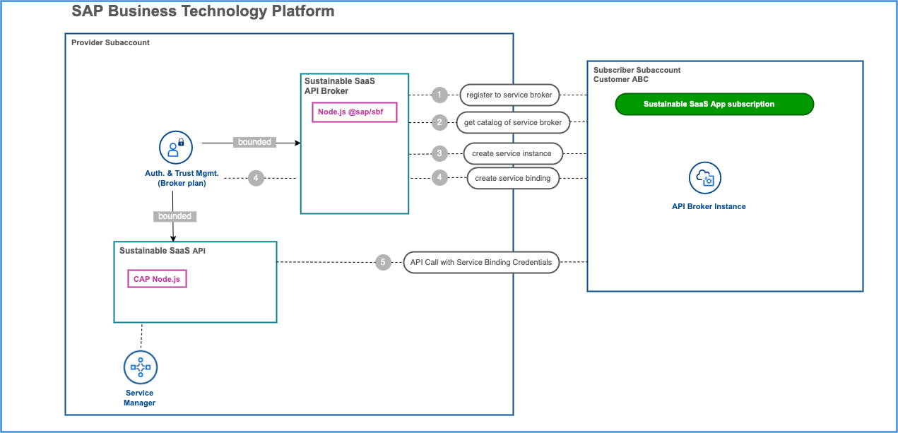
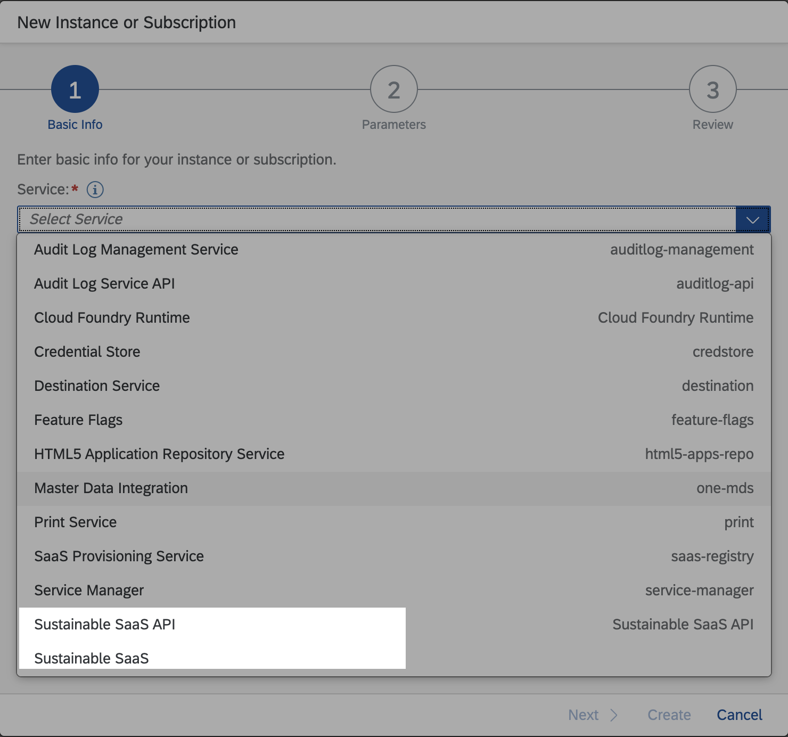
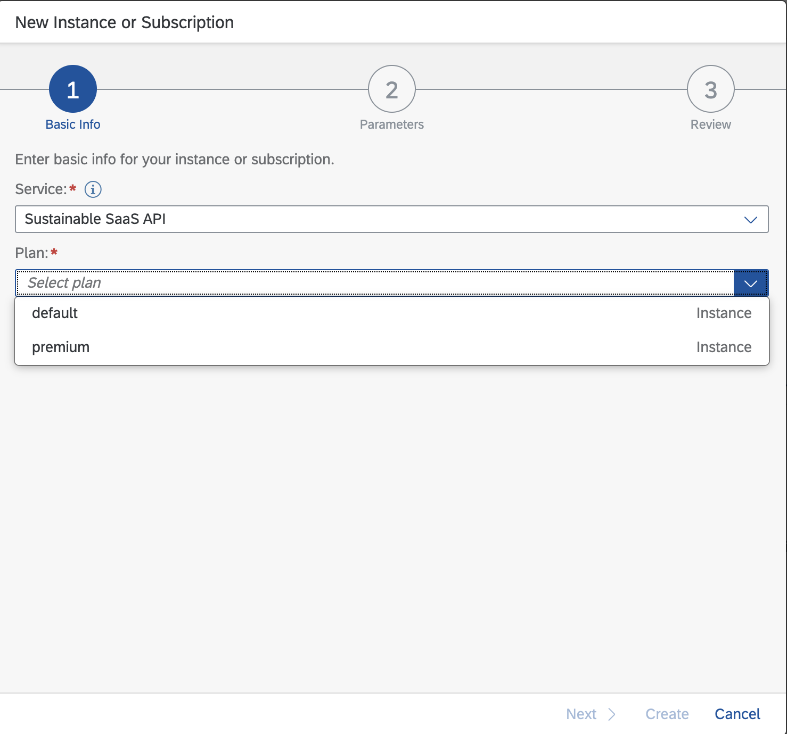
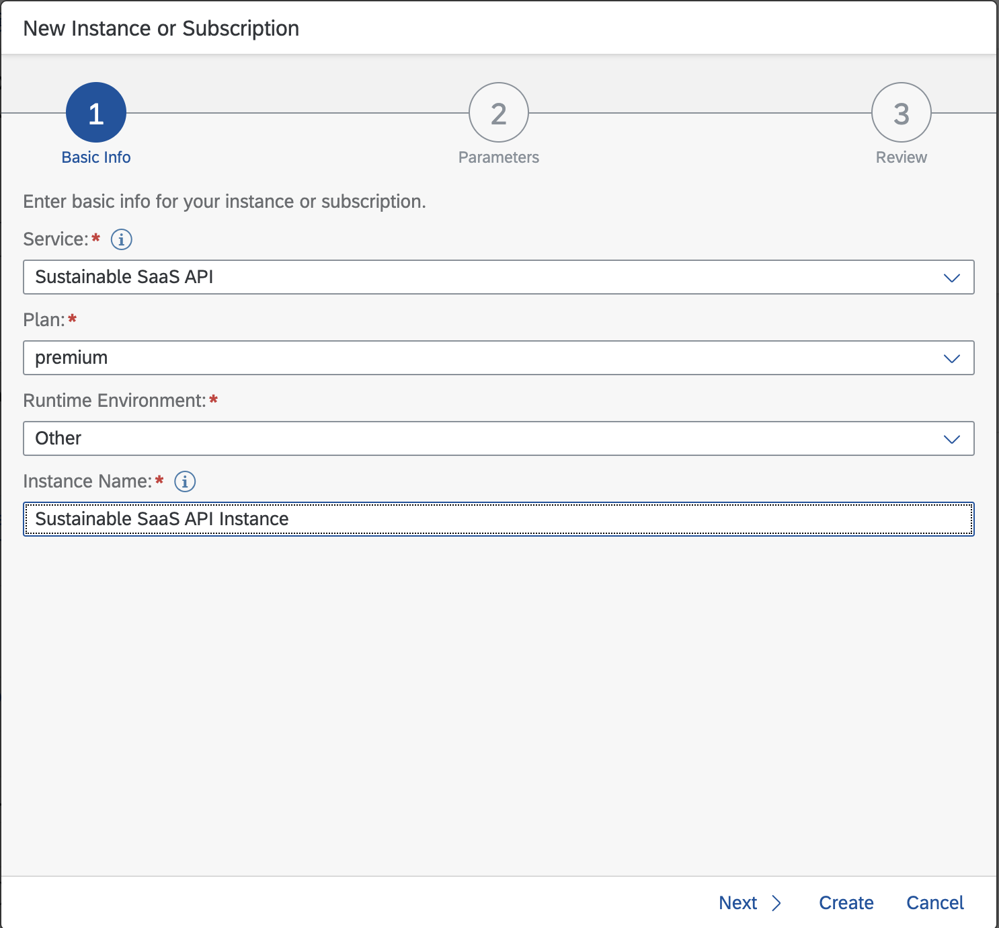
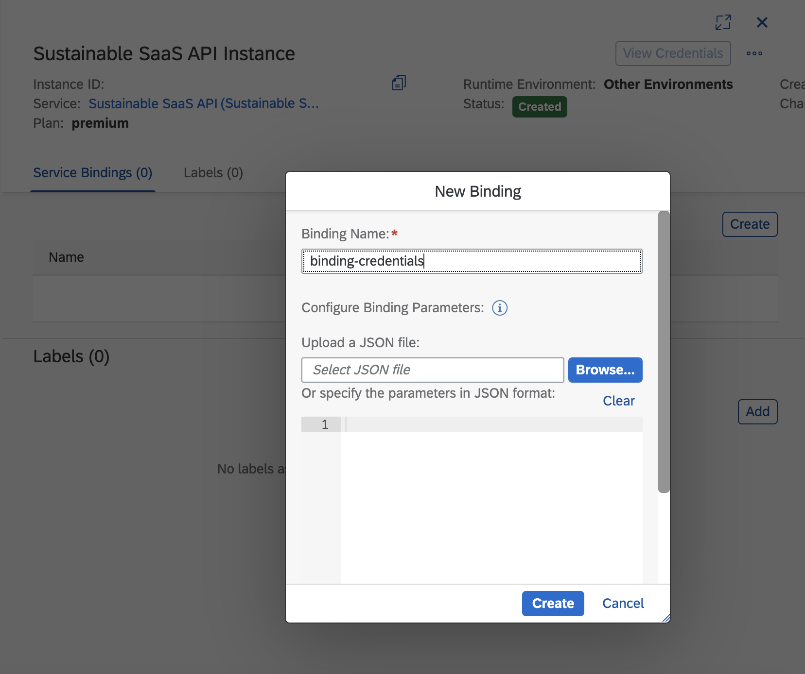
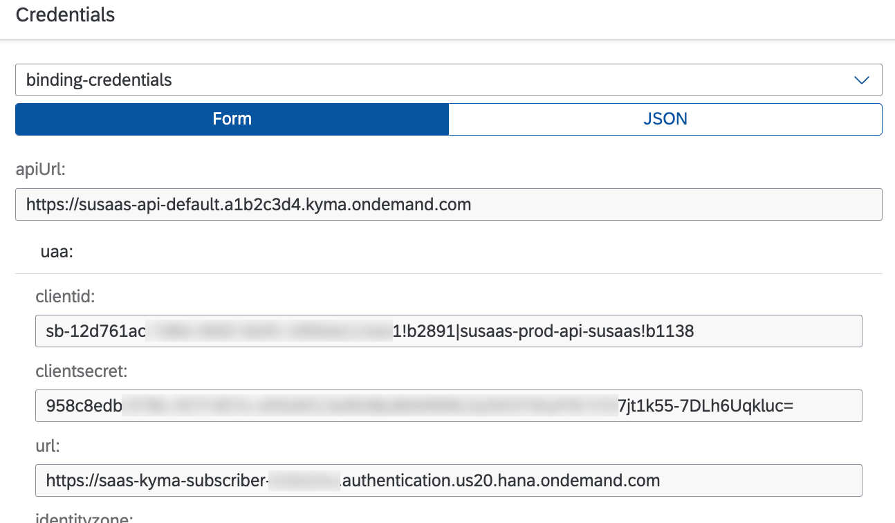

# Deep Dive into Service Brokers

- **Kyma** ✅ 
- **Cloud Foundry** ✅

This part of the tutorial will explain the details of the SaaS API backing service implementation together with a dedicated service broker since both components are working hand in hand to provide a multitenant SaaS API. 

- [Deep Dive into Service Brokers](#deep-dive-into-service-brokers)
  - [1. What is a Service Broker?](#1-what-is-a-service-broker)
  - [2. OSB API Standards](#2-osb-api-standards)
  - [3. How does a platform interact with a service broker?](#3-how-does-a-platform-interact-with-a-service-broker)
    - [3.1. Implementation of Catalog Management or "Which plans do you have service broker?"](#31-implementation-of-catalog-management-or-which-plans-do-you-have-service-broker)
    - [3.2. Implementation of Creation of a Service Instance (Provisioning)](#32-implementation-of-creation-of-a-service-instance-provisioning)
    - [3.3. Implementation of Service Binding Creation - Binding Request](#33-implementation-of-service-binding-creation---binding-request)
    - [3.4. Implementation of Service Binding Deletion](#34-implementation-of-service-binding-deletion)
    - [3.5. Implementation of Service Instance Deletion](#35-implementation-of-service-instance-deletion)
    - [3.6. Registering to Service Broker](#36-registering-to-service-broker)
  - [4. What is @sap/sbf?](#4-what-is-sapsbf)
  - [5. Sample multitenant SaaS API (Backing Service) in SAP BTP](#5-sample-multitenant-saas-api-backing-service-in-sap-btp)
    - [5.1. Request Number 1](#51-request-number-1)
      - [Catalog Before Subscribing to the Sustainable SaaS application](#catalog-before-subscribing-to-the-sustainable-saas-application)
      - [Catalog After Subscribing to the Sustainable SaaS application](#catalog-after-subscribing-to-the-sustainable-saas-application)
    - [5.2. Request Number 2](#52-request-number-2)
    - [5.3. Request Number 3](#53-request-number-3)
    - [5.4. Request Number 4](#54-request-number-4)
    - [5.5. Request Number 5](#55-request-number-5)
- [6. Further learnings](#6-further-learnings)

## 1. What is a Service Broker?

First things first, what is a service broker? To answer that question, let us start with the "Why do we need a service broker?" before going into details. 

Let us imagine a scenario, in which you have a service running on your local server or any other place. And it is so important for you that you can not continue your development without having access to that service. Imagine something like the following:

```js
const express = require('express')
const app = express()
const port = 3000

app.post('/super-hard-calculation', async (req, res) => {  
   let result = await doSuperComplexStuff(req);
   res.send(result)
})

app.listen(port, () => {
  console.log(`Example app listening on port ${port}`)
})

```

Since the calculation is super critical for your business you're planning to use it from several applications already deployed to SAP BTP. So you would like to create, delete instances, and bind to or unbind from your applications running on
SAP BTP in a flexible style, like any other backing service already available on SAP BTP such as XSUAA, application autoscaler, etc - But how can you achieve this?

So here is the situation.

Let's assume there is no connection between SAP BTP and your service yet. Since all service management actions are triggered by SAP BTP the actual challenge is - how to inform our service about the lifecycle events of our application such as the creation of instances, deletion of instances, new bindings, and so on.

Okay, so knowing the problem that needs to be solved would it not be great if there would be a standard for platforms such as SAP BTP, to send the requests in a standardized format that all the backing services in the world can implement to handle these lifecycle events? Because then every backing service could implement these standards in their applications and they could work hand in hand with any platform.

The good news! There is one! It is called [Open Service Broker API](https://www.openservicebrokerapi.org).

Okay, but what is Open Service Broker API or **OSBAPI** in short? Let us check the official definition.

"*The Open Service Broker API project allows independent software vendors, SaaS providers and developers to easily provide backing services to workloads running on cloud native platforms such as Cloud Foundry and Kubernetes. The specification, which has been adopted by many platforms and thousands of service providers, describes a simple set of API endpoints which can be used to provision, gain access to and managing service offerings.*"

Now we know that there is a standard, let us closer explore what are those [standards](https://github.com/openservicebrokerapi/servicebroker/blob/master/spec.md#provisioning).


## 2. OSB API Standards

For the sake of simplicity, we will only cover the following sections of these standards:
 1) [Catalog Management](https://github.com/openservicebrokerapi/servicebroker/blob/master/spec.md#catalog-management)
 2) [Provisioning (Creating a service instance)](https://github.com/openservicebrokerapi/servicebroker/blob/master/spec.md#provisioning)
 3) [Deprovisioning (Deleting a service instance)](https://github.com/openservicebrokerapi/servicebroker/blob/master/spec.md#deprovisioning)
 4) [Binding (Creating service binding for any application](https://github.com/openservicebrokerapi/servicebroker/blob/master/spec.md#binding)
 5) [Unbinding (Deleting service binding of service instance)](https://github.com/openservicebrokerapi/servicebroker/blob/master/spec.md#unbinding)

 > For further information about these standards please visit the official [OSB API repository](https://github.com/openservicebrokerapi/servicebroker)

So in summary, what is the answer to the **What is a service broker?** question?

**Answer:** Any application which implements the **OSBAPI** standards is a service broker!


## 3. How does a platform interact with a service broker? 
In this section, you will learn how a platform like SAP BTP interacts with a service broker.


### 3.1. Implementation of Catalog Management or "Which plans do you have service broker?"
Catalog management request - in very simple terms - will be the first question of a platform to the service broker:
"Hey service broker, what kind of service instances and plans you have got?"

Basically, it is a **GET** request to the endpoint */v2/catalog*

So very primitive implementation in our sample would be something like the below:
> Please note that the code is just an example for understanding and will not work end-to-end. 

```js
const express = require('express')
const app = express()
const port = 3000

/* Broker Endpoints */
app.get('/v2/catalog'), async(req,res) => {
   res.send(200,{
    id:"dummy123", // ID of service instance, have might be any unique id
    name:"Super Complex Calculation Service", // Name of of service
    description:"This service does a super complex calculation which is very important for our business", // Description
    bindable:true, // Tells if the service is bindable, then the platform keeps this information
    plans:[{id:1,name:"Super Plan"},{id:2,name:"Normal Plan"}] // Plans of the service
   })
}
/* End of Broker Endpoints */

app.post('/super-hard-calculation', async(req, res) => {  
   let result = await doSuperComplexStuff(req);
   res.send(result)
})

app.listen(port, () => {
  console.log(`Example app listening on port ${port}`)
})

```

In response the service broker returns the following information to the requesting platform:
- It provides a service called **Super Complex Calculation Service**
- It is bindable so binding requests are allowed
- It has two service plans - **Super Plan** and **Normal Plan**


### 3.2. Implementation of Creation of a Service Instance (Provisioning)

Most of the time after the catalog request which you have seen in the first step, a second request will be sent to create a service instance. In OSBAPI Standards this is called **provisioning**.

This time it is a **PUT** request to the endpoint */v2/service_instances/:instance_id*

Let's assume that a platform (like SAP BTP) sends a body like the following:
```js
{
   service_id: "dummy123" // Our service ID 
   plan_id: 1 // Super plan ID
   parameters : {...}  // Parameters for the service instance to be created. Example: xs-security.json file content for XSUAA

}
```

Let us also add a primitive example implementation for provisioning:

```js
const express = require('express')
const app = express()
const port = 3000

/* Broker Endpoints */

// Step 1) Catalog Request
app.get('/v2/catalog', async(req,res) => {
   res.send(200,{
    id:"dummy123", // ID of service instance, have might be any unique id
    name:"Super Complex Calculation Service", // Name of of service
    description:"This service does a super complex calculation which is very important for our business", // Description
    bindable:true, // Tells if the service is bindable, then the platform keeps this information
    plans:[{id:1,name:"Super Plan"},{id:2,name:"Normal Plan"}] // Plans of the service
   })
}
)

// Step 2) Provisioning request (Create a service Instance)
app.put('/v2/service_instances/:instance_id', async(req,res) => {
    let instanceId = req.params.instance_id;
    let serviceMetadata = await createNewResourcesForNewInstance(instanceId);
    res.send(201, serviceMetadata);
})

/* End of Broker Endpoints */

app.post('/super-hard-calculation', async(req, res) => {  
   let result = await doSuperComplexStuff(req);
   res.send(result)
})

app.listen(port, () => {
  console.log(`Example app listening on port ${port}`)
})

```
Since now you have seen the implementation of service instance creation, this leads us to the next step, which is binding creation.


### 3.3. Implementation of Service Binding Creation - Binding Request

After the creation of a service instance, most of the time the next request coming will be for the creation of a service binding.

It is also a **PUT** request to the endpoint */v2/service_instances/:instance_id/service_bindings/:binding_id*

```js 
const express = require('express')
const app = express()
const port = 3000

/* Broker Endpoints */

// Step 1) Catalog Request
app.get('/v2/catalog', async(req,res) => {
   res.send(200,{
    id:"dummy123", // ID of service instance, have might be any unique id
    name:"Super Complex Calculation Service", // Name of of service
    description:"This service does a super complex calculation which is very important for our business", // Description
    bindable:true, // Tells if the service is bindable, then the platform keeps this information
    plans:[{id:1,name:"Super Plan"},{id:2,name:"Normal Plan"}] // Plans of the service
   })
})

// Step 2) Provisioning request (Create a service Instance)
app.put('/v2/service_instances/:instance_id', async(req,res) => {
    let instanceId = req.params.instance_id;
    let serviceMetadata = await createNewResourcesForNewInstance(instanceId);
    res.send(201,serviceMetadata);
})

// Step 3) Create Service Binding 
app.put('/v2/service_instances/:instance_id/service_bindings/:binding_id', async(req,res) => {
    let instanceId = req.params.instance_id;
    let bindingId  = req.params.binding_id;
    let serviceBinding = await createNewServiceBinding(instanceId,bindingId);
    res.send(201,serviceBinding);
})

/* End of Broker Endpoints */

app.post('/super-hard-calculation', async(req, res) => {  
   let result = await doSuperComplexStuff(req);
   res.send(result)
})

app.listen(port, () => {
  console.log(`Example app listening on port ${port}`)
})

```


### 3.4. Implementation of Service Binding Deletion

Another action request that a service broker handles is the deletion of service bindings.

And unsurprisingly the request is a **DELETE** request to */v2/service_instances/:instance_id/service_bindings/:binding_id*

Let us also add that to our trivial implementation:

```js 
const express = require('express')
const app = express()
const port = 3000

/* Broker Endpoints */

// Step 1) Catalog Request
app.get('/v2/catalog', async(req,res) => {
   res.send(200,{
    id:"dummy123", // ID of service instance, have might be any unique id
    name:"Super Complex Calculation Service", // Name of of service
    description:"This service does a super complex calculation which is very important for our business", // Description
    bindable:true, // Tells if the service is bindable, then the platform keeps this information
    plans:[{id:1,name:"Super Plan"},{id:2,name:"Normal Plan"}] // Plans of the service
   })
})

// Step 2) Provisioning request (Create a service Instance)
app.put('/v2/service_instances/:instance_id', async(req,res) => {
    let instanceId = req.params.instance_id;
    let serviceMetadata = await createNewResourcesForNewInstance(instanceId);
    res.send(201,serviceMetadata);
})

// Step 3) Create Service Binding 
app.put('/v2/service_instances/:instance_id/service_bindings/:binding_id', async(req,res) => {
    let instanceId = req.params.instance_id;
    let bindingId  = req.params.binding_id;
    let serviceBinding = await createNewServiceBinding(instanceId,bindingId);
    res.send(201,serviceBinding);
})

// Step 4) Delete Service Binding 

app.delete('/v2/service_instances/:instance_id/service_bindings/:binding_id', async(req,res) => {
    let instanceId = req.params.instance_id;
    let bindingId  = req.params.binding_id;
    let serviceBinding = await deleteInvalidateServiceBinding(instanceId,bindingId);
    res.send(200,{});
})


/* End of Broker Endpoints */

app.post('/super-hard-calculation', async(req, res) => {  
   let result = await doSuperComplexStuff(req);
   res.send(result)
})

app.listen(port, () => {
  console.log(`Example app listening on port ${port}`)
})

```


### 3.5. Implementation of Service Instance Deletion

The next action you will be handling in your service broker is the deletion of service instances.

The request is another **DELETE** request to */v2/service_instances/:instance_id*

```js 
const express = require('express')
const app = express()
const port = 3000

/* Broker Endpoints */

// Step 1) Catalog Request
app.get('/v2/catalog', async(req,res) => {
   res.send(200,{
    id:"dummy123", // ID of service instance, have might be any unique id
    name:"Super Complex Calculation Service", // Name of of service
    description:"This service does a super complex calculation which is very important for our business", // Description
    bindable:true, // Tells if the service is bindable, then the platform keeps this information
    plans:[{id:1,name:"Super Plan"},{id:2,name:"Normal Plan"}] // Plans of the service
   })
})

// Step 2) Provisioning request (Create a service Instance)
app.put('/v2/service_instances/:instance_id', async(req,res) => {
  
    let instanceId = req.params.instance_id;
    let serviceMetadata = await createNewResourcesForNewInstance(instanceId);
    res.send(201,serviceMetadata);
})

// Step 3) Create Service Binding 
app.put('/v2/service_instances/:instance_id/service_bindings/:binding_id', async(req,res) => {
  
    let instanceId = req.params.instance_id;
    let bindingId  = req.params.binding_id;
    let serviceBinding = await createNewServiceBinding(instanceId,bindingId);
    res.send(201,serviceMetadata);
})

// Step 4) Delete Service Binding 

app.delete('/v2/service_instances/:instance_id/service_bindings/:binding_id', async(req,res) => {
    let instanceId = req.params.instance_id;
    let bindingId  = req.params.binding_id;
    let serviceBinding = await deleteInvalidateServiceBinding(instanceId,bindingId);
    res.send(200,{});
})

// Step 5) Delete Service Instance 

app.delete('/v2/service_instances/:instance_id', async(req,res) => {
    let instanceId = req.params.instance_id;
    let serviceBinding = await deleteServiceInstance(instanceId,bindingId);
    res.send(200,{});
})

/* End of Broker Endpoints */

app.post('/super-hard-calculation', async(req, res) => {  
   let result = await doSuperComplexStuff(req);
   res.send(result)
})

app.listen(port, () => {
  console.log(`Example app listening on port ${port}`)
})

```


### 3.6. Registering to Service Broker
All of the trivial implementations we've done so far was on the backing service side. But to be able to interact with your service broker you have to tell your platform to go and talk with your service broker.

This is called **registration to the service broker.**

For example in SAP BTP, the [BTP CLI](https://help.sap.com/docs/BTP/btp-cli/intro.html) command below can be used for registering to a service broker from a Consumer Subaccount:

```sh
  btp register services/broker --name NAME --url URL --user USER --password PASSWORD --subaccount SUBACCOUNTID
```

For more details please check the official [documentation](https://help.sap.com/docs/BTP/btp-cli/btp-register-services-broker.html).


## 4. What is @sap/sbf? 
In the previous sections, you have learned what a service broker is and for which purpose it serves.

Now let's imagine a scenario like the following.

Let's say you have three different backing services which you would like to use from SAP BTP. You would have to go to each of these three different backing services and implement OSBAPI standards, and the corresponding code would probably be very similar in all of the backing services. Furthermore, you would need to implement credentials for each of these services. If you have 10 business services, multiply this implementation effort by 10.

Then the question arises: *Can we avoid the effort of implementing OSBAPI for all of our backing services?*
The answer is: *Yes, you can!*

The Service Broker Framework ([@sap/sbf](https://www.npmjs.com/package/@sap/sbf?activeTab=readme#additional-service-configuration)) 
is a Node.js framework that implements the Open Service Broker API. It can be used in the SAP Business Technology Platform or on-premise as part of the SAP HANA XS Advanced model. Therefore, when you deploy this npm module as explained in the official documentation, you will have a service broker which implements OSBAPI out-of-the-box.

Please refer to the official documentation of @sap/sbf for further information.


## 5. Sample multitenant SaaS API (Backing Service) in SAP BTP

After all the theoretical background on service brokers, you will learn how we implemented the multitenant API of our sample app using the service broker approach. Before going into all details let us remember the flow again. 

[](./images/sbflow.png?raw=true)

As you can see in the diagram above,
 - Our backing service is the **Sustainable SaaS API** and is hosted in the Provider Subaccount.
 - The **Sustainable SaaS API Broker** is the service broker for our backing service.
 - An XSUAA service instance with **broker** plan has been bound to both **Service Broker** and **Backing Service**.

Let's briefly go through the flow in the diagram for a better understanding.


### 5.1. Request Number 1
This request represents the registration of a service broker from **Consumer Subaccount** so that you can create a service instance afterward. After this step, your backing service is visible in the SAP BTP Service catalog within the Consumer Subaccount. 

In the sample app, when a Tenant subscribes to the multitenant business application, this request is automatically send from the multitenant business application.

Let us check how does that look like.

#### Catalog Before Subscribing to the Sustainable SaaS application 
As you can see, before the subscription process, only the Sustainable SaaS multitenant business application is available in the catalog. This is because the multitenant business application automatically registers the **Sustainable SaaS API Service Broker** during the subscription.

[](./images/catalog-before-subscription.png?raw=true)

#### Catalog After Subscribing to the Sustainable SaaS application
See below that after subscribing, the Sustainable SaaS API is there and available.

[](./images/catalog-after-subscription.png?raw=true)


### 5.2. Request Number 2
This request is sent by SAP BTP to your service broker to see which plans your service offers before service creation. For instance, default plan, premium plan, etc. This is the screenshot of request number 2 from SAP BTP to our **Sustainable SaaS API Broker**. The response is basically **trial**, **default** and **premium** as configured in the respective [catalog.json](https://github.com/SAP-samples/btp-cap-multitenant-saas/blob/main/code/broker/catalog.json) file.

[](./images/catalog-plans.png?raw=true)


### 5.3. Request Number 3
This request creates your service instance and triggers the provisioning event on your @sap/sbf module. You should handle this request accordingly. For example, if you offer a database service, you might go and create a new DB instance when this request is triggered. Please see below to understand how SAP BTP sends the service creation request to the **Sustainable SaaS API Service Broker**.

[](./images/create-instance.png?raw=true)


### 5.4. Request Number 4
This request is sent when the platform needs to create credentials that are valid for your service instance and/or bind your service instance to an application. Since @sap/sbf and the XSUAA broker plan are used by the service broker, this is automatically handled in our case. Whenever a binding request comes in, it first reaches the **Sustainable SaaS API Service Broker** @sap/sbf instance then which automatically creates credentials for the specific subaccount which sent the binding request by talking with XSUAA using the broker plan instance. These credentials will be valid since we have also bound the same XSUAA instance to our backing service (API).

[](./images/create-binding.png?raw=true)


### 5.5. Request Number 5
Having the credentials, a Tenant is now ready to call the backing service **Sustainable SaaS API** from their subaccount, from their SAP S/4HANA system, or any other third-party system. Since the JWT token contains the subaccount id, our CAP-based API will identify the incoming Tenant and upload the data directly to the correct Tenant database container with the help of the SAP Service Manager *container plan*. Using the service binding credentials like the ones below, the Sustainable SaaS API (reachable by the **apiUrl**) can be called. The API itself is a CAP-based OData API .

[](./images/binding.png?raw=true)


# 6. Further learnings

Please check this [blog post](https://community.sap.com/t5/technology-blogs-by-sap/exploring-service-brokers-and-service-consumption-on-sap-business/ba-p/13524313) and [video series](https://www.youtube.com/watch?v=5_Ns0ihQPD4&list=PL6RpkC85SLQDaxcABfWlLuIDR79DxDrLi) by DJ Adams if you want to deep dive into this concept.
