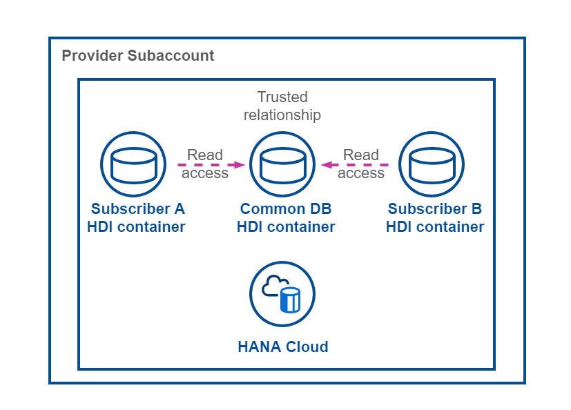

# Shared Database Container

- ### **Kyma** ✅ 
- ### **Cloud Foundry** ✅

To have the ability to share data among your Consumer tenants, a shared database container is set up for this sample scenario. This allows you as a Provider to maintain e.g., master data in a central place and update it simultaneously for all Consumer tenants. 

- [Shared Database Container](#shared-database-container)
  - [1. Deployment Definitions](#1-deployment-definitions)
    - [Kyma Helm Chart](#kyma-helm-chart)
    - [Cloud Foundry Deployment Descriptor](#cloud-foundry-deployment-descriptor)
  - [2. Tenant Database Container](#2-tenant-database-container)
  - [3. Keep in mind](#3-keep-in-mind)
  - [4. Further information](#4-further-information)

This concept is building on the cross-container-access capabilities of SAP HANA Cloud HDI database containers. In this sample scenario, the shared database container is used to share a sample table and master data along the Tenant database containers.

[](./images/CD_Flow.png?raw=true)


## 1. Deployment Definitions

Depending on your runtime of choice, the shared database container is set up differently as part of your Kyma Helm Charts or Cloud Foundry Deployment Descriptor. 


### Kyma Helm Chart

The HDI container required for the shared data is defined in the *values.yaml* file ([click here](../../../../deploy/kyma/charts/sustainable-saas/values.sample.yaml)) of our Umbrella Chart and created during the deployment of the SaaS application to the Provider Subaccount. 

> **Hint** - For the Tenant database container instances, SAP Service Manager (container plan) takes care of the whole container lifecycle. Therefore, there is no need to specify additional HDI resources for these containers in the *values.yaml* file. 

```yaml
# SAP HANA Cloud HDI Container
# Required for shared data model deployment
com_hdi_container:
  serviceOfferingName: hana
  servicePlanName: hdi-shared
```

To deploy content (like tables and views) to our shared database container, an additional component is required resulting in a Kubernetes Job, responsible for the deployment of your shared database artifacts.

```yaml
# Shared Database Container Deployer Job
# Deploys the shared data model to a database container
hana_deployer:
  image:
    # Provide your HDI Container Deployer Docker Image repository
    repository: <<namespace>>/susaas-db-com
    tag: latest
  bindings:
    hana:
      serviceInstanceName: com-hdi-container
  resources:
    limits:
      cpu: 500m
      memory: 1G
    requests:
      cpu: 500m
      memory: 1G
```

To allow access from your tenant-specific database containers to the shared database container, it needs to be added as a binding to the SaaS Backend service component. This is a prerequisite as the required dependency between new Tenant database containers and the shared database container needs to be resolved upon subscription of each new Consumer Tenant. 

```yaml
# Backend Service Workload
srv:
  port: 8080
  bindings:
    xsuaa:
      serviceInstanceName: xsuaa
    sm-container: # <-- Tenant database containers
      serviceInstanceName: sm-container
    hana:  # <-- Shared database container
      serviceInstanceName: com-hdi-container
```

As you might know it from Cloud Foundry deployments, also in Kyma a so-called **Service Replacement** definition is required for this cross-container-access scenario. The respective environment variable is defined in the following *values.yaml* file ([click here](../../../../deploy/kyma/charts/sustainable-saas/charts/susaas-srv/values.yaml)).

```yaml
env:
  SERVICE_REPLACEMENTS: '[{ "key" : "com-hdi-container", "service" : "hana" }]'
```

The **mtxs** tooling responsible for the deployment of the data model into the tenant database container, relies on the so called VCAP_SERVICES environment variable in case of service replacements being used. Therefore, another essential feature configuration is required, so that CAP *emulates* this environment variable in a Kyma context. The respective feature can be enabled, by setting the following JSON value for the **cds_features** environment variable. 

```yaml
env:
  cds_features: '{ "emulate_vcap_services" : true }'
```

> **Hint** - Enabling this CAP feature in the **package.json** will not work as expected in this scenario. 


### Cloud Foundry Deployment Descriptor

The HDI container required for the shared database container is defined in the mta.yaml file and created during the deployment of the SaaS application to the provider subaccount. 

>**Hint** - For the tenant database containers, SAP Service Manager (container plan) takes care of the container lifecycle. For that reason, there is no need to specify any resources for these tenant containers in the mta.yaml file. 

```yaml
  # ----------------- COMMON DB HDI CONAINER -------------------
  - name: susaas-com-hdi-container
  # ------------------------------------------------------------
    type: com.sap.xs.hdi-container
    parameters:
      service-name: ${space}-susaas-com-hdi-container
    properties:
      com-container-name: '${service-name}' 
```

To deploy content (like tables and views) to your shared database container, an additional module definition is required resulting in a Node.js application responsible for the deployment of your shared database artifacts.

```yaml
  # --------------------- COMMON DB MODULE ---------------------
  - name: susaas-db-com
  # ------------------------------------------------------------
    type: hdb
    path: ../../code/gen/db-com
    parameters:
      app-name: susaas-db-com-${space}
      memory: 256MB
      disk-quota: 1024MB
    requires:
      - name: susaas-com-hdi-container
```

To allow access from your tenant database containers to the shared database container, it needs to be added as a dependency to the SaaS service module. This is a prerequisite as the required dependency between new tenant database containers and the shared database container needs to be resolved upon subscription of each new consumer tenant. As the subscription is handled by the SaaS Service module, it is essential to provide the binding in form of a so-called **Service Replacement**. 

```yaml
  # --------------------- SERVER MODULE ------------------------
  - name: susaas-srv
  # ------------------------------------------------------------
    type: nodejs
    path: ../../code/gen/srv
    parameters:
      app-name: susaas-srv-${space}
      memory: 256MB
      disk-quota: 1024MB
      command: node ./node_modules/@sap/cds/bin/cds-serve
    requires:
      - name: susaas-uaa
      - name: susaas-com-hdi-container
        group: SERVICE_REPLACEMENTS
        properties:
           key: com-hdi-container
           service: '~{com-container-name}'
```


## 2. Tenant Database Container

The concept of cross-container-access is based on a trusted relation between containers. Still, to make the shared database container accessible from your tenant-specific database containers, some prerequisites need to be fulfilled. 

>**Important** - The concept of cross-container-access is very powerful but not trivial. Please refer to the official documentation in SAP Help to learn more ([click here](https://help.sap.com/docs/HANA_CLOUD_DATABASE/b9902c314aef4afb8f7a29bf8c5b37b3/4adba34bd86544a880db8f9f1e32efb7.html?&locale=en-US)).

**/code/db-com/data-model.cds**

```json
context susaas.common {
    entity Shared : cuid {
        value : String;
    }
}
```

First of all, you need to assign the technical users of your Tenant containers dedicated access roles defined in the shared database container. Therefore, a role **COM_EXTERNAL_ACCESS** is defined in the shared database container, providing **READ** access to a shared sample table called **SUSAAS_COMMON_SHARED** (see definition above). For the so-called **Object Owner(s)** of the accessing Tenant database containers, a similar role **COM_EXTERNAL_ACCESS#** is required, which includes the same permissions **including grant option**. 

**/code/db-com/src/COM_EXTERNAL_ACCESS.hdbrole**

```json
{
    "role": {
        "name": "COM_EXTERNAL_ACCESS",
        "object_privileges": [
            { 
                "name":"SUSAAS_COMMON_SHARED", 
                "type":"TABLE", 
                "privileges":[ "SELECT" ], 
                "privileges_with_grant_option":[] 
            }
        ]
    }
}
```

These roles can now be used in the Tenant database containers, where they need to be assigned to the **Object Owner(s)** and **Application User(s)** using a so-called **.hdbgrants** file. This file is processed before the deployment of a new Tenant database container starts. 

It ensures, that the technical users used during creation of new Tenant database container (but also during runtime access) have the required permissions to access the shared database container. 

>**Hint** - Here you can find the name of the **key** of the service replacement again (**com-hdi-container**). This allows the deployer to dynamically identify the correct service. 

**db/cfg/COM.hdbgrants**
```json
{
    "com-hdi-container": {
        "object_owner": {
            "container_roles": [
                "COM_EXTERNAL_ACCESS#"
            ]
        },
        "application_user": {
            "container_roles": [
                "COM_EXTERNAL_ACCESS"
            ]
        }
    }
}
```

After ensuring the technical users of new Tenant database containers are assigned the required roles to access the shared database container, you need to define so-called **synonyms** for the shared target objects (e.g., tables or views). Therefore, two files are required. A so-called **.hdbsynonymconfig** and a **.hdbsynonym** file. 

>**Hint** - Also here you can find the name of the **key** of the service replacement again (**com-hdi-container**). This allows the deployer to dynamically identify the correct service and derive the correct schema name. 

**/code/db/cfg/COM.hdbsynonymconfig**
```json
{
    "SUSAAS_COMMON_SHARED": {
        "target": {
            "object": "SUSAAS_COMMON_SHARED",
            "schema.configure": "com-hdi-container/schema"
        }
    }
}
```

**/code/db/src/COM.hdbsynonym**
```json
{
  "SUSAAS_COMMON_SHARED": {}
}
```

Whereas the hdbsynonym file defines your synonym database object, the hdbsynonymconfig file is processed before the provisioning of a new Tenant database container and provides configuration information to the Node.js deployer. In this case, the deployer is advised to dynamically read the schema name of the shared database container from the container service details. 

As no fixed schema name is defined for the shared database container, the schema name is automatically generated upon deployment of the SaaS application. That's why for required references in the Tenant database containers, we need to read the schema name dynamically from the container service binding details. See it as some kind of dynamic replacement instead of providing the unique schema name which could be something like ABC123XYZ987DEF456UVW.... 

The synonyms can now be used in CDS model definitions or other native SAP HANA database objects like Views or Calculation Views. Just make sure to use `@cds.persistence.exists` annotation in case of CDS usage, to prevent the CDS compiler from creating a new database artifact for the existing synonym.  

**/code/db/hana/data-model.cds**
```json
context susaas.common {
  @cds.persistence.exists
  entity Shared : cuid {
        value  : String;
  }
}
```

**Important** - The cross-container-access only works in SAP HANA Cloud scenarios. Therefore, for local testing, the respective shared table is mocked by removing the *@cds.persistence.exists* annotation and providing some sample data.

**/code/db/sqlite/data-model.cds**
```json
context susaas.common {
  entity Shared : cuid {
        value  : String;
  }
}
```


## 3. Keep in mind

Please keep in mind that for database container backups, cross-container access requirements cause some additional complexity. If you export a Tenant database container and plan to import it again, you first need to ensure that the technical users of the new target database container (which you're planning to import the backup in) need to have the correct shared database container roles assigned (see hdbgrants details above) before applying the backup. 

> **Hint** - The hdbgrants files will not be applied in this case and you need to assign roles manually using the HDI Container APIs of the shared database container ([click here](https://help.sap.com/docs/SAP_HANA_PLATFORM/3823b0f33420468ba5f1cf7f59bd6bd9/40ba784dcaf44989b23f7eda316b4a0b.html?locale=en-US)). 


## 4. Further information

Please use the following links to find further information on the topics above:

* [SAP Help - Application Router](https://help.sap.com/docs/BTP/65de2977205c403bbc107264b8eccf4b/01c5f9ba7d6847aaaf069d153b981b51.html?locale=en-US)
* [SAP Help - SAP HANA Cloud, SAP HANA Database Deployment Infrastructure Reference](https://help.sap.com/docs/HANA_CLOUD_DATABASE/c2cc2e43458d4abda6788049c58143dc/4077972509f5437c85d6a03e01509417.html?locale=en-US)
* [Youtube - HANA Cloud: HDI - Under the Hood](https://www.youtube.com/watch?v=UmOkjPxE6Us)
* [SAP Help - Enable Access to Objects in Another HDI Container](https://help.sap.com/docs/HANA_CLOUD_DATABASE/b9902c314aef4afb8f7a29bf8c5b37b3/4adba34bd86544a880db8f9f1e32efb7.html?locale=en-US)
* [SAP Help - Database Synonyms in SAP HANA Cloud](https://help.sap.com/docs/HANA_CLOUD_DATABASE/c2b99f19e9264c4d9ae9221b22f6f589/556452cac83f423597d3a38a6f225e4b.html?locale=en-US)
* [SAP Help - Syntax Options in the hdbgrants File](https://help.sap.com/docs/HANA_CLOUD_DATABASE/c2b99f19e9264c4d9ae9221b22f6f589/f49c1f5c72ee453788bf79f113d83bf9.html?locale=en-US)
* [Youtube - SAP HANA Academy - HANACloud: Intra-HDI Container Access](https://www.youtube.com/watch?v=5duW3MUoKEQ)

