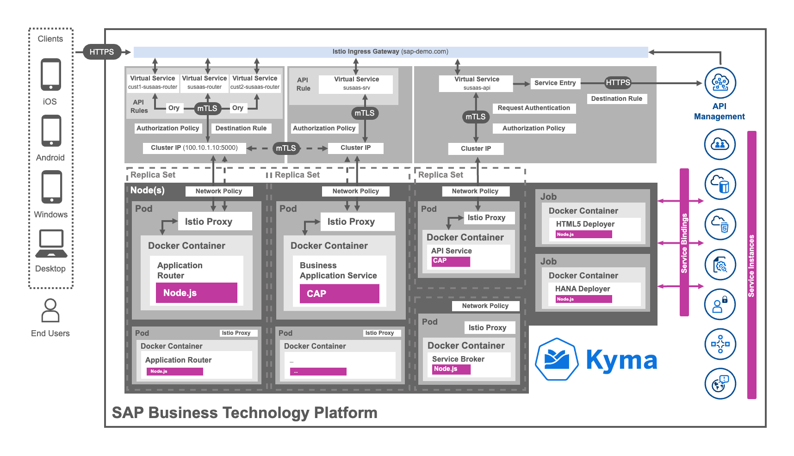

# Helm Charts and Kyma resources

While our next chapter will focus on the functional perspective of the different application components like Multitenancy in Application Router, this chapter will give you a deep-dive into the resources and technology used for the deployment of our sample scenario. For your convenience and a better structure, this chapter has been split up into three parts.

- [Helm Charts and Kyma resources](#helm-charts-and-kyma-resources)
  - [1. Helm Charts](#1-helm-charts)
  - [2. Resource Overview](#2-resource-overview)
  - [3. Template Details](#3-template-details)

While we could write books about Helm or the various Kyma and Kubernetes resources, the main purpose of this chapter is a different one. We want to provide you with an initial introduction to those highly relevant topics in relation to our sample application. Whereas tons online documentations provide comprehensive details on all the subjects covered by this chapter, we assume that a use case related context will provide you a much better understanding. Once you have tackled the basics, and have an idea what benefits the different Helm features as well as Kyma and Kubernetes resources provide, it will be much easier to deep-dive into the official docs and adapt things according to your own requirements. 

So let us get started with the fundamentals of the Deployment technology used for our sample scenario which is called **Helm**. 

## 1. Helm Charts

> **Important** - Find more details in the [Helm Charts](./components/HelmCharts.md) documentation!

While most SAP BTP developers are familiar with Cloud Foundry deployments using a Multitarget Application Deployment Descriptor (mta.yaml), in Kyma/Kubernetes things are a bit different. As within other Kubernetes environments, Kyma makes use of various yaml files to deploy the various application resources (like Deployments, Network Policies, Horizontal Pod Autoscalers, ...) to the Cluster. 

To support and ease this deployment process and creation of yaml files, we are using [Helm](https://helm.sh/) in our project, which allows a simplified and template-based generation these manifests. Helm is the de-facto industry standard and the so-called Helm Charts (which can partly be generated using CAP standard features), simplify the definition of repeatable patterns and allow the usage of centrally defined variables and smart templating approaches. This reduces the overhead of creating dozens of yaml files manually for each and every Kubernetes resource. 

Furthermore, Helm allows you to deploy a whole application with multiple components (in our case defined in so-called Helm Subcharts), with just one single command. The sample applies for upgrades and undeployments. So if you are new to Helm, you should definitely check out the provided documentation, to get a very first initial idea. 

Find more details in the [Helm Charts](./components/HelmCharts.md) documentation!

## 2. Resource Overview

> **Important** - Find more details in the [Resource Overview](./components/ResourceOverview.md) documentation!

The SAP BTP Kyma Runtime allows developers to use a variety of native Kubernetes resources but also adds several custom Kyma objects (like API Rules) to the available toolset. Additionally, our SaaS sample application is relying on a number of so-called Istio resources, used for setting up a so-called service mesh in our Kyma Cluster. Check out the linked documentation, to get an idea what kind of resources are being used in our scenario. The provided introduction will help you understand the relation between all those resources and the sample application workloads running in your Kyma Cluster. 

The following visualization shows a range of resources used by our SaaS application, and briefly summarizes the provided capabilities in context our sample use case. 

Find more details in the [Resource Overview](./components/ResourceOverview.md) documentation!

## 3. Template Details

> **Important** - Find more details in the [Template Details](./components/TemplateDetails.md) documentation!

Once you have gained some experience with Helm and you learned about the various Kyma and Kubernetes objects used in our sample project, feel free to join us on a little deep dive. We spared no effort and provided you an extensive overview, describing the purpose of the most relevant Helm templates used in this sample project. While most of the templates are very similar in the respective Helm Subcharts (like Authorization Policies or Service Bindings), some of the templates (or actually the resulting Kubernetes resources) have a very special job to fulfill. 

Therefore, feel free to follow along and to learn more about selected Helm templates, providing you with an even better understanding of what is going on under the hood, once you deployed the sample application to your Kyma Cluster. 

Find more details in the [Template Details](./components/TemplateDetails.md) documentation!