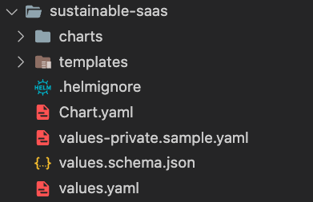
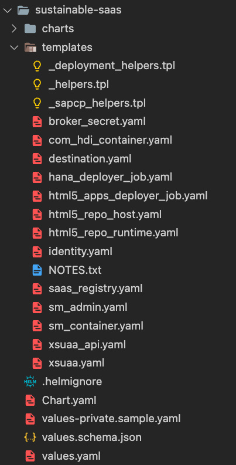

# Helm Charts 

- **Kyma** ✅ 
- **Cloud Foundry** ❌

This part of the tutorial contains a brief documentation on the topic of Helm and how it is being used in the context of our Sustainable SaaS sample application. Helm is an extremely powerful tool set simplifying the automated definition of Kubernetes/Kyma resources and the subsequent deployment to your Cluster. 

Given the sheer complexity of Helm, this tutorial will only cover certain basic aspects that will simplify starting your own learning journey. Once you start adapting the templates based on your own needs, there will be no shortcut but a deep-dive into the official documentation is inevitable.

- [Helm Charts](#helm-charts)
  - [1. Introduction](#1-introduction)
    - [Introduction to fundamental Helm concepts](#introduction-to-fundamental-helm-concepts)
    - [Understanding the fundamental Helm commands](#understanding-the-fundamental-helm-commands)
  - [2. Understanding the general purpose of Helm Charts](#2-understanding-the-general-purpose-of-helm-charts)
  - [3. Getting Started with the sample application Helm Charts](#3-getting-started-with-the-sample-application-helm-charts)
    - [3.1. Chart.yaml file](#31-chartyaml-file)
    - [3.2. Values.yaml file](#32-valuesyaml-file)
    - [3.3. values.schema.json file](#33-valuesschemajson-file)
    - [3.4. Templates in Helm Chart](#34-templates-in-helm-chart)
    - [3.5. Render Helm Chart to preview the Kyma Resources](#35-render-helm-chart-to-preview-the-kyma-resources)
  - [4. Customizing the Helm Chart using templates](#4-customizing-the-helm-chart-using-templates)
    - [4.1. Creating a Config Map and adding it as a template](#41-creating-a-config-map-and-adding-it-as-a-template)
    - [4.2. Adding a simple template call](#42-adding-a-simple-template-call)
    - [4.3. Using values from the values.yaml file](#43-using-values-from-the-valuesyaml-file)
    - [4.4. Using built-in functions of Helm templates](#44-using-built-in-functions-of-helm-templates)
  - [5. Reusing templates via named templates](#5-reusing-templates-via-named-templates)
    - [Defining a named template](#defining-a-named-template)
    - [Reusing existing named templates from helper files](#reusing-existing-named-templates-from-helper-files)
  - [6. Relation between Umbrella Charts the Subcharts](#6-relation-between-umbrella-charts-the-subcharts)
  - [7. Further Readings](#7-further-readings)

## 1. Introduction 

Before proceeding with this tutorial, please make sure you have [installed Helm](https://helm.sh/docs/intro/install/#helm) on your local device!

Helm can be thought of as a "box" that contains all the necessary components and instructions for deploying and managing an application on a Kubernetes (K8s - for the eight characters between K and s) Cluster.

Imagine you have a box full of different parts and pieces for building a toy car. The box contains the wheels, the body, the engine, and the instructions for putting it all together.

Similarly, a Helm Chart contains all the necessary components for deploying an application on a Kubernetes Cluster, such as the Container images, configuration files, and instructions for creating and managing the various Kubernetes resources, such as Pods and Services. You can find the official Helm documentation and great tutorials [here](https://helm.sh/).

### Introduction to fundamental Helm concepts

Understanding the fundamental ideas of Helm is necessary if you want to use Helm to successfully manage applications running on Kubernetes. Helm's package management system is built around these ideas.

- **Chart**: A Helm Chart is a set of files defining the Kubernetes resources required to operate a specific application. Kubernetes Deployments, Services, and Service Entry objects, as well as Config Maps, Secrets, and Persistent Volume Claims, are examples of these resources.
- **Release**: A Helm release is the deployed instance of a Helm Chart. Each release has its own unique name and specific version.
- **Value**: Helm values ​​are configurable parameters used by charts to customize Deployments. Values ​​can be set in a variety of ways, including command line arguments and (as in our case) *values.yaml* ​​files. 
- **Template**: A Helm template is a file that defines the structure of a Kubernetes manifest file. A template is used to generate a Kubernetes manifest file from a chart using values ​​provided during installation. 
- **Dependency**: A Helm dependency is another Helm Chart that your chart depends on in order to function properly.
- **Repository**: From a high level perspective, a Chart Repository is a location where charts can be stored and shared. The Helm client packs and ships Helm Charts to a Chart Repository. Simply speaking, a Chart Repository is a basic HTTP server that hosts an index.yaml file and some packaged charts.

### Understanding the fundamental Helm commands

1. helm install: A chart is installed on a Kubernetes/Kyma Cluster using this command, which also creates any Deployments, Services, and Containers that are required.
2. helm upgrade: This command updates an already released chart to a new version or allows configuration value adjustments.
3. helm delete: This command deletes a release from a Kubernetes/Kyma Cluster, removing all associated Kubernetes/Kyma resources.
4. helm template: This command generates the Kubernetes/Kyma manifest files for a chart, without installing it, allowing users to see what will be created before actually installing the chart.


## 2. Understanding the general purpose of Helm Charts

A Helm Chart is a package that contains all the necessary information and configuration to deploy and manage an application on a Kubernetes/Kyma Cluster. It is used by Helm, which is a package manager for Kubernetes, to automate the deployment and management of applications on the Cluster.

A Helm Chart is defined using a YAML file called [Chart.yaml](../../../../deploy/kyma/charts/sustainable-saas/Chart.yaml), which contains metadata about the chart such as its name, version, and description. The chart also includes a collection of templates written in Go Templating Language, that define the configuration for Kubernetes resources such as Pods, Services, Deployments.

For more detailed information, please refer to the official Helm documentation ([click here](https://helm.sh/)).


## 3. Getting Started with the sample application Helm Charts

As you might see from the repository, the chart directory looks as below.

[](./images/HELM_Chart_Dir.png?raw=true)

In following sections you will be inspecting the files and their purposes in the [chart](../../../../deploy/kyma/charts/sustainable-saas/) directory.


### 3.1. [Chart.yaml](../../../../deploy/kyma/charts/sustainable-saas/Chart.yaml) file

Chart.yaml is a file in a Helm Chart that contains metadata about the chart, including its name, version, description, and other information. This file is used by Helm to manage the chart and its dependencies, and it is required for every Helm Chart.

The Chart.yaml file contains information about the Helm Chart such as:

 - **name**: The name of the Helm Chart
 - **version**: The version of the Helm Chart. This must be a Semantic Versioning (SemVer) compatible version string, such as "1.2.3".
 - **appVersion**: The version of the application a Helm Chart represents. This is separate from the Helm Chart version and is used to track changes to the application itself, independent of changes to the Helm Chart.
 - **description**: Provides general information on what this Helm Chart is doing.
 - **dependencies**: An array of other charts that this Helm Chart depends on.
 - **type**: The type field specifies the type of the Helm Chart (in this case **application**)

    ```sh
    apiVersion: v2  
    name: susaas-app
    description: Sustainable SaaS
    type: application
    version: 0.0.1
    appVersion: 0.0.1
    dependencies:
      - name: susaas-srv
        alias: srv
        version: 0.1.0
      - name: susaas-router
        alias: router
        version: 0.1.0
      - name: susaas-broker
        alias: broker
        version: 0.1.0
      - name: susaas-api
        alias: api
        version: 0.1.0
    ```

     > **Hint** - This Helm Chart contains four so-called Subcharts as dependencies. These charts are separate Helm Charts and the relation will be covered in detail by this documentation.


### 3.2. [Values.yaml](../../../../deploy/kyma/charts/sustainable-saas/values.yaml) file

The [values.yaml](../../../../deploy/kyma/charts/sustainable-saas/values.yaml) file is used to specify a range of options and settings that control the behavior and configuration of a chart. 

For example, it might include values for resource limits, image names, feature flags, and other settings that control the behavior and appearance of the components defined in a chart.

Please take a look at the given section of [values.yaml](../../../../deploy/kyma/charts/sustainable-saas/values.yaml) file below, to get a better understanding.

```sh
...
router:
  bindings:
    xsuaa:
      serviceInstanceName: xsuaa
    destination:
      serviceInstanceName: destination
    html5-apps-repo:
      serviceInstanceName: html5-repo-runtime
  image:
    repository: sap-demo/susaas-router
    tag: latest
  resources:
    limits:
      ephemeral-storage: 1G
      memory: 500M
      cpu: 300m
    requests:
      ephemeral-storage: 1G
      cpu: 300m
      memory: 500M
...
```

Above part is the section of a YAML file used for configuring a Kubernetes Deployment for the **Application Router** of our sample application. 

The Deployment consists of:

- A Docker image located at "sap-demo/susaas-router" with the "latest" tag
- Resource requests and limits for the Deployment
  - Ephemeral storage: 1G
  - Memory: 500M
  - CPU: 300m

The Deployment also has three SAP BTP Service Instances bound to it:
- xsuaa (Authorization & Trust Management Service)
- destination (Destination Service)
- html5-apps-repo (HTML5 Application Repository Service)


### 3.3. [values.schema.json](../../../../deploy/kyma/charts/sustainable-saas/values.schema.json) file

This JSON file is a so-called schema file. A JSON schema is a standard for describing the structure and constraints of JSON data, and it is also used to validate *values.yaml* values. This ensures that values provided by the user follow the schema laid out by the chart maintainer, providing better error reporting when the user provides an incorrect set of values for a chart.

Validation occurs when any of the following commands is invoked:
 - helm install
 - helm upgrade
 - helm template
 - helm lint

For example, let us add a test property in the **router** section of the *values.yaml* file as shown below:

```sh
...
router:
  bindings:
    xsuaa:
      serviceInstanceName: xsuaa
    destination:
      serviceInstanceName: destination
    html5-apps-repo:
      serviceInstanceName: html5-repo-runtime
  image:
    repository: sap-demo/susaas-router
    tag: latest
  resources:
    limits:
      ephemeral-storage: 1G
      memory: 500M
      cpu: 300m
    requests:
      ephemeral-storage: 1G
      cpu: 300m
      memory: 500M
  test: my value ## This property has been added
...
```

Try to run the following command in the root directory:

```sh
helm template ./deploy/kyma/charts/sustainable-saas 
```

You should instantly face an error, because **test** is an invalid value according to the JSON schema configuration.

```sh
Error: ...
router:
- resources.requests: Additional property test is not allowed
```

Proper schema files can be used to validate template parameters, which becomes especially useful when shipping your Helm Charts to a broader audience! For now, please remove the **test** property again, to make the chart installable and valid for upcoming sections again.


### 3.4. [Templates](../../../../deploy/kyma/charts/sustainable-saas/templates/) in Helm Chart

Templates in Helm Charts are files that define how resources should be deployed to a Kyma Cluster. They are used to generate manifest files for Kyma/Kubernetes resources, such as Pods, Services or Service Bindings, based on chart-defined values and configuration parameters. Templates are written in the **Helm template language(*)** and use its syntax and features to dynamically generate the manifests based on user-defined and default values of the chart.

 > **Hint** - (*) Helm Template Language definition according to [Helm official documentation](https://helm.sh/docs/chart_template_guide/functions_and_pipelines/): "While we talk about the "Helm template language" as if it is Helm-specific, it is actually a combination of the Go template language, some extra functions, and a variety of wrappers to expose certain objects to the templates. Many resources on Go templates may be helpful as you learn about templating."

[*/code/chart/templates/*](../../../../deploy/kyma/charts/sustainable-saas/templates/) directory contains the templates of the Helm Chart.

[](./images/HELM_Chart_Temp_Dir.png?raw=true)

The [templates](../../../../deploy/kyma/charts/sustainable-saas/templates/) directory contains the template files, which will be converted to Kubernetes resource definitions when running *helm template* or *helm install*. 

> **Important** - Filenames starting with an underscore (_) are assumed not to contain a manifest template inside. These files are not converted to Kubernetes resource definitions, but are available within other chart templates for reuse purposes. Details will be covered in further sections.


### 3.5. Render Helm Chart to preview the Kyma Resources 

Without actually deploying a chart to a Kyma/Kubernetes Cluster, you can use the **helm template** command to preview its final state. Doing so, you can see which Kubernetes resources will be created and how they will be configured. Furthermore, the template command can also be used to test and debug a chart.

Feel free to run the command below, to see the generated Kubernetes resources of the sample application.

```sh
# Run from root directory #
helm template ./deploy/kyma/charts/sustainable-saas
```

Running this command will provide you a yaml-based console output. This output contains all necessary Kyma/Kubernetes resources to deploy the Sustainable SaaS application on a Kyma Cluster. 

> **Hint** - The example below is (obviously) just a part of the generated resources. The complete console output is much longer.

```sh
...
# Source: susaas/charts/srv/templates/api-rule.yaml
apiVersion: gateway.kyma-project.io/v1beta1
kind: APIRule
metadata:
  name: release-name-srv
  labels:
    helm.sh/revision: "1"
    helm.sh/chart: srv-0.1.0
    app.kubernetes.io/managed-by: Helm
    app.kubernetes.io/name: srv
    app.kubernetes.io/instance: release-name
    app.kubernetes.io/component: srv
    app.kubernetes.io/partOf: susaas
spec:
  gateway: default/cdomain-gateway
  host: release-name-srv-default.sap-demo.com
  rules:
  - methods: ["GET", "POST", "PUT", "DELETE", "PATCH", "HEAD"]
    path: /-/cds/.*
    accessStrategies:
      - handler: allow
  service:
    name: release-name-srv
    port: 8080
---
# Source: susaas/charts/router/templates/istio-dest-rule.yaml
apiVersion: networking.istio.io/v1alpha3
kind: DestinationRule
metadata:
  name: release-name-router
  labels:
    helm.sh/revision: "1"
    helm.sh/chart: router-0.1.0
    app.kubernetes.io/managed-by: Helm
    app.kubernetes.io/name: router
    app.kubernetes.io/instance: release-name
    app.kubernetes.io/component: router
    app.kubernetes.io/partOf: susaas
spec:
  host: release-name-router.default.svc.Cluster.local
  trafficPolicy:
    loadBalancer:
      consistentHash:
        httpCookie:
          name: JSESSIONID
          path: /
          ttl: 0s
...
```

## 4. Customizing the Helm Chart using templates

Now that you have learned about the Helm Chart basics of Sustainable SaaS Application, you can add your own custom template to get a better understand of how templates work.

Making your own template file can be a worthwhile learning experience. You gain a deeper understanding of Helm's behavior and how to use it to manage your resources in a Kyma Cluster.

> **Information**: If you want to gain deeper understanding of Helm templating it is strongly recommended to follow [Chart Template Guide](https://helm.sh/docs/chart_template_guide/getting_started/) section of Helm official documentation. 


### 4.1. Creating a Config Map and adding it as a template

In the [templates directory](../../../../deploy/kyma/charts/sustainable-saas/templates/), create a file called **my-config-map.yaml**, and paste the below content inside the file.

```sh
apiVersion: v1
kind: ConfigMap
metadata:
  name: my-config-map
data:
  exampleKey: "exampleValue"
```

After doing so, run the following command from your root directory:

```sh
# Run from root directory #
helm template ./deploy/kyma/charts/sustainable-saas > test.yaml
```

You should now see a file called **test.yaml** in your root directory. Open the **test.yaml* file and search for "my-config-map". 
You should see that your Config Map has been generated as a new Kyma/Kubernetes resource which can be deployed to your Cluster.

> **Hint** - The command *helm template* is extremely useful if you want to debug your Helm Chart and evaluate the generated outcome. 


### 4.2. Adding a simple template call

In the following, you learn how to add the release name as a prefix your Config Map object.

Modify your *my-config-map.yaml* file created in the [previous step](#41-creating-a-config-map-and-adding-it-as-a-template) as shown below.

```sh
apiVersion: v1
kind: ConfigMap
metadata:
  name:  {{ .Release.Name }}-my-config-map.yaml ## Modify this line accordingly
data:
  exampleKey: "exampleValue"
```

After the modification please run the command below.

```sh
# Run from root directory #
helm template myrelease ./deploy/kyma/charts/sustainable-saas > test.yaml
```

Search once again for the term **my-config-map** in your *test.yaml* file, you should see that your release name **myrelease** is now used as a prefix.

The respective resource definition should look like the following.

```sh
---
# Source: susaas-app/templates/my-config-map.yaml
apiVersion: v1
kind: ConfigMap
metadata:
  name:  myrelease-my-config-map.yaml 
data:
  exampleKey: "exampleValue"
---
```

As you can see, *.Release.Name* is a built-in object (similar to a variable) in Helm. It is set to the release name you provide to the **helm template** command. There are also other built-in objects set by Helm automatically. A list of those objects can be seen found in the [official documentation](https://helm.sh/docs/chart_template_guide/builtin_objects/).


### 4.3. Using values from the [values.yaml](../../../../deploy/kyma/charts/sustainable-saas/values.yaml) file

One of the Helm key concepts, is generating the Kubernetes/Kyma manifest files in a more dynamic way, using configuration details defined in the [values.yaml](../../../../deploy/kyma/charts/sustainable-saas/values.yaml) file.
In this section you will be adding a new configuration to the *values.yaml* file and then reference it from within your template.

Open your [values.yaml](../../../../deploy/kyma/charts/sustainable-saas/values.yaml) and append the following configuration.

```sh
...
html5_apps_deployer:
  cloudService: susaas.service
  image:
    repository: sap-demo/susaas-html5-deployer
    tag: latest
  bindings:
    html5-apps-repo:
      serviceInstanceName: html5-repo-host
  resources:
    limits:
      cpu: 500m
      memory: 500M
    requests:
      cpu: 300m
      memory: 500M

## Append below to the end of your values yaml
my_config_map:  
    value: testvalue
```

Switch to your [my-config-map.yaml](../../../../deploy/kyma/charts/sustainable-saas/templates/my-config-map.yaml) file and edit it as shown below:

```sh
apiVersion: v1
kind: ConfigMap
metadata:
  name:  {{ .Release.Name }}-my-config-map.yaml 
data:
  exampleKey: {{ .Values.my_config_map.value }} ## Modify this line accordingly
```

After editing, run the following command:

```sh
# Run from root directory #
helm template ./deploy/kyma/charts/sustainable-saas > test.yaml
```

Check the updated *test.yaml* file in your root directory. Searching for your Config Map, should see the below output:

```sh
---
# Source: susaas-app/templates/my-config-map.yaml
apiVersion: v1
kind: ConfigMap
metadata:
  name:  release-name-my-config-map.yaml 
data:
  exampleKey: testvalue
---
```


### 4.4. Using built-in functions of Helm templates

As explained, Helm's main purpose is all about creating manifest files for Kubernetes/Kyma which can be customized at Deployment time, making it easier to configure and install applications. 

For this purpose, [built-in Helm template functions](https://helm.sh/docs/chart_template_guide/function_list/) can be used for various operations on configuration values or to generate dynamic content.

In this section you will use a built-in template function provided by Helm, allowing you to apply dynamic changes to your Deployments.

Imagine you would like to "quote" the value you set in [step 4.3](#43-using-values-from-valuesyaml-file). To be able to "quote" a value, the built-in Helm **quote** function can be used in your [my-config-map.yaml](../../../../deploy/kyma/charts/sustainable-saas/templates/my-config-map.yaml) file.

```sh
apiVersion: v1
kind: ConfigMap
metadata:
  name: {{ .Release.Name }}-my-config-map.yaml 
data:
  exampleKey: {{ .Values.my_config_map.value | quote }} ## Modify this line accordingly
```

Run the command below to see the effect of the function in action.

```sh
# Run from root directory #
helm template ./deploy/kyma/charts/sustainable-saas > test.yaml
```

Searching once again in your *test.yaml* file, you should find your updated Config Map resource definition as below. As expected, the **exampleKey** value is now quoted.

```sh
---
# Source: susaas-app/templates/my-config-map.yaml
apiVersion: v1
kind: ConfigMap
metadata:
  name: release-name-my-config-map.yaml ## Modify this line accordingly
data:
  exampleKey: "testvalue"
---
```


## 5. Reusing templates via named templates

Before commencing this section let us briefly define the meaning of *named templates* in Helm.

A named template (sometimes also referred to as partial template), is a reused template that can be accessed from other templates in the same chart. Named templates allow you to define a block of code that can be reused without duplicating it. Therefore, named templates are a very effective method to reuse code in Helm Charts, while keeping your templates DRY (Don't Repeat Yourself).

*Named templates* are usually stored in files starting with \"\_\" for a simple reason. Filenames  prefixed with an underscore are considered void by Helm. These files are not converted into Kubernetes resource definitions, but are accessible for usage in other chart templates.


### Defining a named template

Assume you have a code block, which you would like to reuse in numerous other templates. A sample for such a named template could look as follows:

```sh
{{- define "mysecret" -}}
apiVersion: v1
kind: Secret
metadata:
  name: {{ .Release.Name }}-secret
type: Opaque
data:
  mykey: {{ .Values.secret.mykey | b64enc }}
{{- end }}
```

After defining the named template **mysecret**, you can simply refer to it in any of your templates:

```sh
{{- include "mysecret.yaml" . -}}
```

> **Hint** - The parameter \".\" passes the current Helm execution context into your include. This allows you to use other build-in objects (variables) like *.Release.Name*.


### Reusing existing named templates from helper files

With this theoretical background in mind, the following section explains you how to reuse an existing *named template* defined in the [_helpers.tpl](../../../../deploy/kyma/charts/sustainable-saas/templates/_helpers.tpl) file.

Open the [_helpers.tpl](../../../../deploy/kyma/charts/sustainable-saas/templates/_helpers.tpl) file and search for "cap.labels". You should see that a named template called "cap.labels" is defined as below.

> **Hint** - Please note that named templates are usually defined in files starting with an underscore, since those files are not considered as Kubernetes or Kyma manifests by Helm.

```sh
...
{{/*
Labels for a component
*/}}
{{- define "cap.labels" -}}
helm.sh/revision: {{ .Release.Revision | quote }}
helm.sh/chart: {{ printf "%s-%s" .Chart.Name .Chart.Version | replace "+" "_" | trunc 63 | trimSuffix "-" }}
app.kubernetes.io/name: {{ .name }}
app.kubernetes.io/managed-by: {{ .Release.Service }}
app.kubernetes.io/instance: {{ .Release.Name }}
{{- if .Chart.AppVersion }}
app.kubernetes.io/version: {{ .Chart.AppVersion }}
{{- end }}
{{- end -}}
...
```

In your *my-config-map.yaml* file, you can now reuse this *named template*. Open your [my-config-map.yaml](../../../../deploy/kyma/charts/sustainable-saas/templates/my-config-map.yaml) file and edit it as shown below.

```sh
apiVersion: v1
kind: ConfigMap
metadata:
  name:  {{ .Release.Name }}-my-config-map.yaml 
  labels: 
  {{- include "cap.labels" . | nindent 4 }} ## Add this line
data:
  exampleKey: {{ .Values.my_config_map.value | quote }}
```

Adding this line, will automatically add all labels to your Config Map including the required indentation. The Helm *nindent* function takes care of the indentation.

Run the usual helm template command to see your changes in action.

```sh
# Run from root directory #
helm template ./deploy/kyma/charts/sustainable-saas > test.yaml
```

Search for "my-config-map" in the updated *test.yaml* file, and you will see that your Config Map resource is now generated as shown below.

```sh
...
---
# Source: susaas-app/templates/my-config-map.yaml
apiVersion: v1
kind: ConfigMap
metadata:
  name:  release-name-my-config-map.yaml 
  labels:
    helm.sh/revision: "1"
    helm.sh/chart: susaas-app-0.0.1
    app.kubernetes.io/name: 
    app.kubernetes.io/managed-by: Helm
    app.kubernetes.io/instance: release-name
    app.kubernetes.io/version: 0.0.1
data:
  exampleKey: "testvalue"
---
...
```

As you can see, you have reused the "cap.labels" named template to add predefined labels to your Config Map. This way, you can add the same labels to all of your Kubernetes/Kyma resources, simplifying the management of resources in your Cluster.


## 6. Relation between Umbrella Charts the Subcharts

Using an Umbrella Chart is an established way to group various charts connected to each other and manage them as a single entity.

With the help of Helm's *Subcharts* feature, you can manage and organize complicated, multi-component applications, each requiring a separate set of Kubernetes resources. While things might sound complicated, it is actually quite simple to explain. A Helm Chart embedded into another Helm Chart as a dependency is known as Subchart.

According to the official Helm documentation: "*The current best practice for composing a complex application from discrete parts is to create a top-level umbrella chart that exposes the global configurations, and then use the chart's subdirectory to embed each of the components.*".

Which is exactly the approach chosen in our sample application.

```sh
apiVersion: v2  
name: susaas-app
description: Sustainable SaaS
type: application
version: 0.0.1
appVersion: 0.0.1
dependencies:
  - name: susaas-srv
    alias: srv
    version: 0.1.0
  - name: susaas-router
    alias: router
    version: 0.1.0
  - name: susaas-broker
    alias: broker
    version: 0.1.0
  - name: susaas-api
    alias: api
    version: 0.1.0
```

As you can see above, **susaas-app** is the Umbrella Chart and 
 - susaas-srv
 - susaas-router
 - susaas-broker
 - susaas-api
  
are the Subcharts, all located in the [charts](../../../../deploy/kyma/charts/sustainable-saas/charts/) directory of the corresponding Umbrella Chart.

In short, **susaas-app** is - the one Helm Cart to rule them all - and the respective Subcharts are receiving their configurations from the *values.yaml* file of the **susaas-app** chart.

## 7. Further Readings

- [Helm official documentation](https://helm.sh/docs/)
- [Why do dev-ops engineers love Helm?](https://www.cncf.io/blog/2020/08/26/why-do-devops-engineers-love-helm/)
- [Relevant resources on medium](https://medium.com/tag/helm-chart)