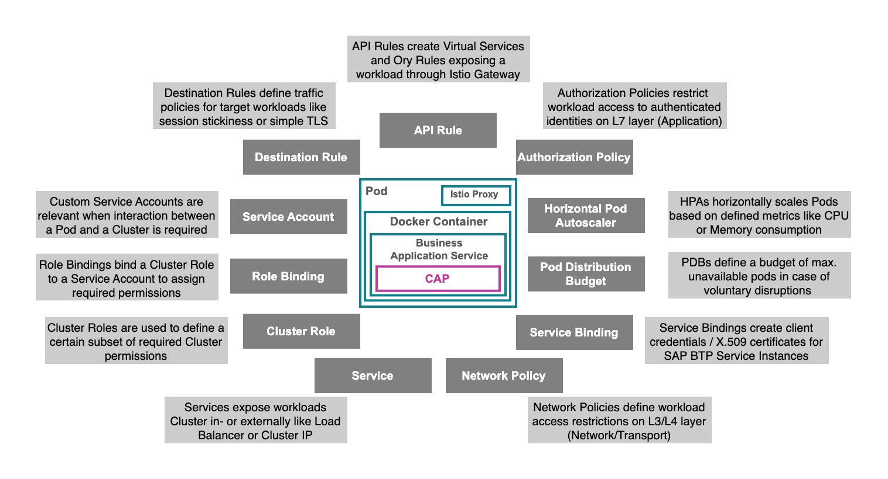
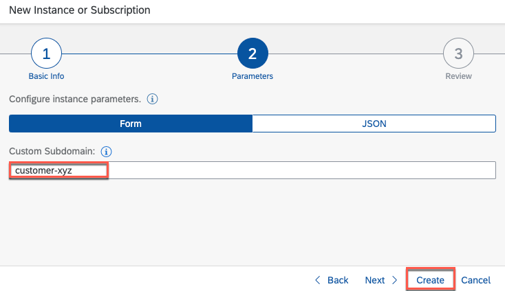

# Resource Overview

- **Kyma** ✅ 
- **Cloud Foundry** ❌

This SaaS sample application makes use of various Kubernetes as well as custom Kyma resource definitions. In this chapter, you will get a brief introduction to the various resources and links where to find further valuable information if required. 

While you can find comprehensive details for all of these resources online, in this part of the tutorial, we try to explain the purpose of the components in relation to the given scenario - using our own words. So please understand, that our explanations might not necessarily match the official documentation content for all resources. If you find any inconsistencies, feel free to provide adjustments or recommendations using a pull request.

In the following visualizations, you can allocate most of the documented resources. Some of them, which are consumed most Pods in a similar fashion, have been removed from the high-level architecture diagram for readability purposes. Their usage is described in the secondary visualization.

[](./images/ResourceDetailsArch.png?raw=true)

Our assumption is the following - if you understand the basic ideas and concepts of all resources in the context of our sample scenario, this will make it much easier for you to understand the comprehensive but very generic official documentations. If you are new to the Kyma and Kubernetes ecosphere (as we were to the beginning of this project), an explanation focused on an exemplary sample use-case is often more beneficial than pages of generic resource documentation. If you have never worked with **Kubernetes** before, we suggest to equip yourself with at least some [basic concepts](https://kubernetes.io/docs/concepts/) before you continue. Learn about Clusters, Nodes, Pods and how the basic Kubernetes resources relate to each other. This will ease your upcoming trip through our content. 

[](./images/KymaObjectsGeneral.png?raw=true)

Once you have gained some basic understanding of Kubernetes, we highly recommend getting started with the [**Deployment**](#deployment) resource type and continuing your journey with the [**Istio Service Mesh**](#istio-service-mesh), before deep-diving into topics like [**Service Accounts**](#service-account), [**Network Policies**](#network-policy) or [**Horizontal Pod Autoscalers**](#pod-autoscaler). Feel free to use the provided high-level architecture diagram, to follow along the path which an incoming request takes, when targeting the different components of the sample application.

So much for the introduction. Below you can find the alphabetical list of the most important resource types used in our sample application. Get your hands dirty and have fun! 

- [Resource Overview](#resource-overview)
  - [API Rule](#api-rule)
  - [Cluster Role](#cluster-role)
  - [ConfigMap](#configmap)
  - [Deployment](#deployment)
  - [Istio Service Mesh](#istio-service-mesh)
    - [Istio Data/Traffic Flow](#istio-datatraffic-flow)
    - [Authorization Policy](#authorization-policy)
    - [Destination Rule](#destination-rule)
    - [Request Authentication](#request-authentication)
    - [Service Entry](#service-entry)
    - [Sidecar](#sidecar)
    - [Virtual Service](#virtual-service)
  - [Job](#job)
  - [Network Policy](#network-policy)
  - [Ory](#ory)
  - [Pod Autoscaler](#pod-autoscaler)
  - [Pod Disruption Budget](#pod-disruption-budget)
  - [Role Binding](#role-binding)
  - [Secret](#secret)
  - [Service](#service)
  - [Service Account](#service-account)
  - [Service Binding](#service-binding)
  - [Service Instance](#service-instance)


## API Rule

> **Learn more** - https://kyma-project.io/docs/kyma/latest/05-technical-reference/00-custom-resources/apix-01-apirule

This custom Kyma Resource allows you to simplify the public exposure of workloads. An API Rule will automatically setup a Istio [Virtual Service](#virtual-service) and so-called [Ory](#ory) rules. While the [Virtual Service](#virtual-service) handles the routing of traffic arriving through the so-called [Istio](#istio-service-mesh) Ingress Gateway, [Ory](#ory) facilitates the mutation of header values or to apply access policies like OAuth2 or JWT validation strategies. Please check the details of the respective components to learn more. 

> **Hint** - Access strategies are currently not being used in our scenario, as authentication and authorization take place within CAP workloads. The usage of [Ory](#ory) Mutators to set custom headers is being used as part of the Subscriber API Rules. 

In our sample, API Rules are defined for the Application Router, the Backend Service, the API Service and the API Service Broker. Only the integration of SAP API Management makes use of a dedicated [Virtual Service](#virtual-service) definition instead of an API Rule. This results from the fact, that API Rules indeed simplify the process of exposing your workloads, nevertheless they do not provide all features that the native usage of [Virtual Services](#virtual-service) offers (e.g., having different target routes for the same request host). 

**Example**

Upon deployment, the following Kyma API Rule definition will create an [Istio](#istio-service-mesh) [Virtual Service](#virtual-service) instance, defining traffic rules for the [Istio](#istio-service-mesh) Ingress Gateway **cdomain-gateway** (defined in namespace **default**). This [Virtual Service](#virtual-service) will route any traffic arriving for host **susaas-router-default.sap-demo.com** to the [Cluster IP Service](#service) **susaas-router** on port **5000**. 

> **Hint** - As the usage of a custom domain is not part of the Basic Version, your gateway and host might look a bit different as the default Kyma domain will be used. Furthermore, you might see [Virtual Services](#virtual-service) samples which are using the hostname instead of the FQDN (full qualified domain name) in the host field. We recommend to use the FQDN whenever possible, to prevent any unforeseen behavior caused by automated determination of the correct domain.

```yaml
apiVersion: gateway.kyma-project.io/v1beta1
kind: APIRule
metadata:
  name: susaas-router
spec:
  # The API Rule will handle requests arriving for this Istio Gateway
  gateway: default/cdomain-gateway
  # The API Rule will handle all requests arriving for this host
  host: susaas-router-default.sap-demo.com
  rules:
	# Traffic on all paths will be routed to the Cluster IP service
    - methods:
        - GET
        - POST
        - PUT
        - DELETE
        - HEAD
      path: /.*
      # "allow" strategy will disable Ory Oathkeeper for target routing
      accessStrategies:
        - handler: allow
  # Cluster IP Service to which the traffic is routed
  service:
    name: susaas-router
    port: 5000
```

The generated [Virtual Service](#virtual-service), which will look like below and is updated whenever you apply changes to the corresponding API Rule. 

> **Important** - As [Virtual Service](#virtual-service) will be updated automatically, please do not apply manual changes to instances associated to API Rules. If the API Rule feature scope is not sufficient, please create a dedicated [Virtual Service](#virtual-service) instead!

```yaml
apiVersion: networking.istio.io/v1beta1
kind: VirtualService
metadata:
  name: susaas-router
spec:
  gateways:
    - default/cdomain-gateway
  hosts:
    - susaas-router-default.sap-demo.com
  http:
    - corsPolicy:
        allowMethods:
          - GET
          - POST
          - PUT
          - DELETE
          - PATCH
      headers:
        # Original target host is retained in header
        request:
          set:
            x-forwarded-host: susaas-router-default.sap-demo.com
      match:
        - uri:
            regex: /.*
      route:
        # Route traffic to the Cluster IP Service of the Application Router workload
        - destination:
            host: susaas-router.default.svc.cluster.local
            port:
              number: 5000
          weight: 100
```

The API Rules generated for the Subscriber Tenants during onboarding, will result in slightly different [Virtual Services](#virtual-service) as they need to fulfill an additional requirement to inject an **x-custom-host** header. This header allows the usage of custom domains instead of the mostly cumbersome and random subaccount subdomains. 

```js
...
  try{
    const access_strategy = {
      path: '/.*',
      methods: ['GET','POST','PUT','PATCH','DELETE','HEAD'],
      accessStrategies: [{ handler: 'noop' }],
      // Mutator definitions result in Ory Mutators handled by Ory Oathkeeper
      mutators: [{
        handler: 'header',
        config: {
          // Custom Header injected into request by Ory Oathkeeper
          headers: {
            // Sample value - subscriber-a1b2c3-susaas-router-default.sap-demo.com
            "x-custom-host": `${subdomain}-${svcName}-${namespace}.${clusterDomain}`,
          }
        }
      }]
    };
...
```

A resulting **API Rule** and corresponding [Virtual Service](#virtual-service) based on the **Ory Mutator** definition above could look similar to the following.

**API Rule**
> For **SaaS** Tenant with subdomain **subscriber-a1b2c3**

```yaml
apiVersion: gateway.kyma-project.io/v1beta1
kind: APIRule
metadata:
  name: susaas-tenant-e1771
spec:
  # Handle requests arriving for this Istio Gateway
  gateway: default/cdomain-gateway
  # Handle requests for this custom Subscriber subdomain
  host: subscriber.sap-demo.com
  rules:
    - methods:
        - GET
        - POST
        - PUT
        - DELETE
        - HEAD
      path: /.*
      accessStrategies:
        - handler: noop
      mutators:
        - config:
            headers:
              x-custom-host: subscriber-a1b2c3-susaas-router-default.sap-demo.com
          handler: header
      path: /.*
  # Cluster IP Service the traffic is routed after passing Ory Oathkeeper
  service:
    name: susaas-router
    port: 5000
```

**Virtual Service** 
> For **SaaS** Tenant with subdomain **subscriber-a1b2c3**

```yaml
apiVersion: networking.istio.io/v1beta1
kind: VirtualService
metadata:
  name: susaas-tenant-e1771-25rzp
spec:
  gateways: ["default/cdomain-gateway"]
  hosts: ["subscriber.sap-demo.com"]
  http:
    - headers:
        # Original target host is retained in header
        request:
          set:
            x-forwarded-host: subscriber.sap-demo.com
      match:
        - uri:
            regex: /.*
      route:
        # Route traffic to the Cluster IP Service of Ory Oathkeeper
        # x-custom-host header added by Ory Oathkeeper
        - destination:
            host: ory-oathkeeper-proxy.kyma-system.svc.cluster.local
            port:
              number: 4455
          weight: 100
```

[Ory](#ory) Oathkeeper will apply the defined mutator by setting the **x-custom-host** header and forward traffic to the Application Router Cluster IP Service. Combined with the Application Router environment variable **EXTERNAL_REVERSE_PROXY**, this allows us to provide dynamic custom domains to Subscriber tenants, while retaining the original Tenant subdomain in the **x-custom-host** header to comply with our TENANT_HOST_PATTERN deriving the Tenant identifier. 

> **Hint** <br>
> Tenant-Host-Pattern: (.*)-susaas-router-default.sap-demo.com <br>
> Custom Domain: subscriber.sap-demo.com <br>
> X-Custom-Host: subscriber-a1b2c3-susaas-router-default.sap-demo.com <br>
> Identified Tenant: **subscriber-a1b2c3**

Please note, as [Ory](#ory) is subject to depreciation, the header mutator feature will be replaced in a future release. A potential candidate might be the usage of respective Istio features.  


## Cluster Role

> **Learn more** - https://kubernetes.io/docs/reference/access-authn-authz/rbac/#role-and-clusterrole

A Cluster Role allows you to define a collection of custom permissions for your Cluster. In our sample scenario, this is essential for the creation of [API Rules](#api-rule) at runtime. Whenever a new Subscriber is onboarded to the Sustainable SaaS application, a new [API Rule](#api-rule) is created at runtime. This new Rule will expose a tenant-specific URI (e.g., customer-xyz.sap-demo.com) reachable from the public internet. If configured during subscription, the [API Rule](#api-rule) and the corresponding (auto-generated) [Virtual Service](#virtual-service) will act as an *External Reverse Proxy*, allowing you to define custom domains, which do not necessarily match the subscriber's subaccount subdomain. 

> **Hint** - Check the */srv/utils/apiRule.js* coding to learn more. Additionally, the [Application Router documentation](https://www.npmjs.com/package/@sap/approuter#Configurations) provides further information on the EXTERNAL_REVERSE_PROXY flag, which is enabled for the reverse proxy feature. 

[](./images/KOCustomDomain.png?raw=true)

The required [Cluster Role](../../../../deploy/kyma/charts/sustainable-saas/charts/susaas-srv/templates/cluster-role.yaml) in oru sample scenario, contains permissions to create, delete and modify [API Rules](#api-rule). This Cluster Role is assigned to a dedicated [Service Account](#service-account) using a so-called [Role Binding](#role-binding). In our example, the Cluster Role is bound to a [Service Account](#service-account), which is (in turn) assigned to the SaaS Backend Application workload (Pod). At runtime, the Backend Application can interact with the Kyma Cluster on behalf of this [Service Account](#service-account), as the respective [Service Account](#service-account) token is so-called auto-mounted to the workload. 

Auto-mounting a [Service Account](#service-account) token to your workload, lets you fetch the credentials to connect to the Cluster API as follows (Node.js): 

```js
  const kc = new k8s.KubeConfig();
  kc.loadFromCluster();
  ...
```

> **Hint** - Check out the [Deployment](#deployment) section of this tutorial to learn more about the binding of [Service Accounts](#service-account) to a workload and how a [Service Account](#service-account) token can be auto-mounted for usage at runtime. 

```yaml
apiVersion: rbac.authorization.k8s.io/v1
kind: ClusterRole
metadata:
  name: susaas-srv
rules:
  - apiGroups: ["gateway.kyma-project.io"]
    resources: ["apirules"]
    verbs:
      - create
      - delete
      - get
      - list
      - patch
      - update
      - watch
  - apiGroups:  ["gateway.kyma-project.io"]
    resources: ["apirules/status"]
    verbs: ["get"]
```


## ConfigMap

> **Learn more** - https://kubernetes.io/docs/concepts/configuration/configmap/

A ConfigMap allows you to provide additional (configuration) information to your workloads like in our scenario the details of the Service Broker configuration. 

```yaml
apiVersion: v1
kind: ConfigMap
metadata:
  name: susaas-broker-config
data:
  serviceConfigs: | 
    {   
      "susaas-api-susaas-default-a1b2c3": {
        "extend_credentials": {
          "shared": {
              "apiUrl": "https://susaas-api-default.sap-demo.com"
            }
        },
        "extend_catalog": {
          "metadata": {
              "displayName": "Sustainable SaaS API"
          }
        }
      }
    }
```

ConfigMaps can e.g., be referenced in your workload or replication controller definitions like [Deployments](#deployment). In our sample scenario, a ConfigMap serves as dynamic content provider for an environment variable of our Service Broker (required on startup). Using ConfigMaps, we can keep our configurations dynamic and flexible by using Helm templates for references or [Deployment](#deployment)-specific variables (like the namespace or the domain in the apiUrl).

```yaml
apiVersion: apps/v1
kind: Deployment
metadata:
  name: susaas-broker
spec:
  ...
    spec:
      ...
      containers:
      - image: sap-demo/susaas-broker:latest
        ...
        env:
        - name: SBF_SERVICE_CONFIG
          valueFrom:
            configMapKeyRef:
              name: susaas-broker-config
              key: serviceConfigs
```

Another interesting scenario is the mounting of ConfigMaps into the file system of a container. In our sample scenario, the API Service Broker requires access to a so-called *catalog.json* file on startup. This file contains information on available service plans, and the content cannot be provided as environment variable. Instead, the respective environment variable SBF_CATALOG_FILE expects a path pointing to the *catalog.json* file. 

```yaml
apiVersion: v1
kind: ConfigMap
metadata:
  name: susaas-broker-catalog
data:
  # File name which will be created when mounted to container file system
  catalog.json: | 
    {
        "services": [{
            ...
```

Mounting this ConfigMap to the file system of a container, will create a respective *catalog.json* file in the */etc/config* path. This path is then being referenced in the environment variable. 

> **Hint** - The file name is based on the property value **catalog.json** in your ConfigMap instance. 

```yaml
apiVersion: apps/v1
kind: Deployment
metadata:
  name: susaas-broker
spec:
  ...
    spec:
      ...
      containers:
      - image: sap-demo/susaas-broker:latest
        ...
        env:
        # Provide path of generated file to env variable
        - name: SBF_CATALOG_FILE
          value: "/etc/config/catalog.json"
        ...
        # Mount available volume to dedicated path
        volumeMounts:
        - name: susaas-broker-catalog
          mountPath: "/etc/config"
          readOnly: true
        ...
      ...
      # Define ConfigMap as volume in your workload
      volumes:
        - name: susaas-broker-catalog
          configMap: 
            name: susaas-broker-catalog
```

Again, in case you wonder why we are not providing the catalog.json file as part of our API Service Broker Docker Image. The above approach allows us to keep the Docker Image for the API Service Broker extremely dynamic and pass the required instance properties upon deployment, based on the respective environment details. 


## Deployment

> **Learn more** - https://kubernetes.io/docs/concepts/workloads/controllers/deployment/

Deployments contain the core definitions of your workloads (Pods). Instead of directly creating [Pods](https://kubernetes.io/docs/concepts/workloads/pods/) or [Replica Sets](https://kubernetes.io/docs/concepts/workloads/controllers/replicaset/) in your Cluster, you should make use of Deployments whenever possible. A Deployment will automatically instantiate Replica Sets and Pods based on the workload definition in your Deployment configuration. 

A major advantage of Deployments is the fact, that associated Replica Sets will automatically be re-instantiate, in case you deletion. Furthermore, a Replica Set will always spin up new Pods as defined in your Deployment specification, whenever an instance is deleted/terminated. So instead of creating dedicated Replica Sets or Pods, the general recommendation is to make use of Deployments. Those will manage respective Replica Sets, which again will manage the associated Pods for you.  

Before getting your head around Deployments, lets take a quick detour and understand the usage of Volumes, how they can be referenced in your Pods and mounted to your Containers. 

**Volumes**

To understand the usage of Volumes, let us go one step back to the Pod level. You can imagine a Pod being a little computer running a certain application. This application can consist of several containers, which are handling the different application processes. 

All containers share the resources of the Pod they are running in. This includes Network Components, CPU, RAM or other compute resources. But - unlike a normal computer (where processes also share the same file system), Containers in Pods behave differently. In a Pod, each Container has its own file system. While required Volumes are defined on Pod level, they are separately mounted into the file systems of the respective Containers. 

In this sample, Volumes are primarily being used to provide the SAP BTP [Service Binding](#service-binding) credentials to our workloads. By mounting those Volumes to a predefined path called */bindings/*, frameworks like CAP are able to use the Service Bindings at runtime ([click here](https://community.sap.com/t5/technology-blogs-by-sap/the-new-way-to-consume-service-bindings-on-kyma-runtime/ba-p/13540594) to learn more). To find different examples of how to use Volumes e.g., for [ConfigMaps](#config-map), please visit the [respective chapter](#config-map) in this tutorial. 

So much for the introduction of Deployments and Volumes. Let us check out a concrete sample - in this case for the Application Router Deployment.

```yaml
apiVersion: apps/v1
kind: Deployment
metadata:
  name: susaas-router
spec:
  selector:
    matchLabels:
      app.kubernetes.io/name: router
  template:
    metadata:
      labels:
        app.kubernetes.io/name: router
    # Specification of Pod / Workload
    spec:
      # Define if Service Account token shall be auto-mounted to Pod
      # Necessary if interaction with Cluster required at runtime
      automountServiceAccountToken: false
      # Service Account name (also "default" Service Account possible)
      serviceAccountName: susaas-router
      # Container(s) to run within Pods of this deployment
      # Istio Sidecar will be injected automatically 
      containers:
        # Definition of Container running in the Pod
        - image: sap-demo/susaas-router:latest
          name: router
          # Port and protocol this container exposes 
          ports:
            - name: http
              containerPort: 5000
              protocol: TCP
          # Environment Variables available during runtime
          env:
            # SAP BTP Service Bindings Volume mount path
            - name: SERVICE_BINDING_ROOT
              value: /bindings
            - name: PORT
              value: "5000"
            - name: APPLICATION_NAME
              value: susaas-router
            # Tenant Host Pattern for multitenancy
            - name: TENANT_HOST_PATTERN
              value: "^(.*)-susaas-router-default"
            # Enable External Reverse Proxy feature
            - name: EXTERNAL_REVERSE_PROXY 
              value: "true"
            # Additional environment variables required at runtime
            - name: APPLICATION_URI
              value: susaas-router
            - name: KYMA_NAMESPACE
              value: default
          # Endpoints for Liveness, Readiness and Startup probes
          livenessProbe:
            # These endpoints should exist and return a 200 response code
            # Otherwise, your Pods might not start successfully
            httpGet:
              path: /healthz
              port: http
          readinessProbe:
            httpGet:
              path: /healthz
              port: http
          startupProbe:
            httpGet:
              path: /healthz
              port: http
            failureThreshold: 15
            periodSeconds: 2
          # Volumes mounted to container incl. SAP BTP Service Bindings
          # All SAP BTP Service Bindings are mounted on /bindings/ path
          volumeMounts:
            - mountPath: /bindings/destination/
              name: "destination"
              readOnly: true
            - mountPath: /bindings/html5-apps-repo/
              name: "html5-apps-repo"
              readOnly: true
            - mountPath: /bindings/xsuaa/
              name: "xsuaa"
              readOnly: true
          # Resource configurations for Container
          resources:
            limits:
              cpu: 300m
              ephemeral-storage: 1G
              memory: 500M
            requests:
              cpu: 300m
              ephemeral-storage: 1G
              memory: 500M
          # Container security config additional to Pod level restrictions
          securityContext:
            allowPrivilegeEscalation: false
            capabilities:
              drop:
                - ALL
            privileged: false
            readOnlyRootFilesystem: false
      # Pod restart policy
      restartPolicy: Always
      # Security config applying to all containers in the Pod
      securityContext:
        runAsNonRoot: true
        runAsUser: 1000
      # Topology Spread Constraints control how Pods are allocated within your Cluster 
      # Allows you to define failure domains like "Nodes" to enable high-availability
      topologySpreadConstraints:
        - labelSelector:
            matchLabels:
              app.kubernetes.io/name: router
          maxSkew: 1
          topologyKey: kubernetes.io/hostname
          whenUnsatisfiable: DoNotSchedule
      # Volumes required by workload resources incl. SAP BTP Service Bindings
      volumes:
        - name: destination
          secret:
            secretName: susaas-router-destination
        - name: html5-apps-repo
          secret:
            secretName: susaas-router-html5-apps-repo
        - name: xsuaa
          secret:
            secretName: susaas-router-xsuaa
```

To learn more about the topic of high availability and the **topologySpreadCosntraints** used as part of the auto-generated Deployment configurations, feel free to read the official Kubernetes documentation ([click here](https://kubernetes.io/docs/concepts/scheduling-eviction/topology-spread-constraints/)).


## Istio Service Mesh

> **Learn more** <br>
> https://istio.io/ <br> 
> https://istio.io/latest/docs/concepts/security/

Istio is among the most widely and adopted Service Mesh solutions for Kubernetes. Istio enriches your Cluster with features providing an uniform and efficient way to secure, connect, and monitor communication between your services and associated workloads. Istio is an Open Source project and comes pre-configured with your Kyma Cluster. In our sample, we are using Istio primarily to ensure a secure communication within the Cluster as well as for exposing the sample SaaS application to the public internet. This includes a variety of different components, which are described in closer detail in the upcoming sections. 

If you enable the **Istio-Injection** in a certain Kyma namespace (by setting the required namespace annotation), whenever you create a new Pod in that namespace, a so called Istio Sidecar [Proxy](https://istio.io/latest/docs/ops/deployment/architecture/#envoy) (based on **Envoy** - [see details](https://www.envoyproxy.io/)) will be automatically injected into the workload. This Proxy ensures that in- and outgoing communication between services (and associated workloads) always traverses through these Istio Proxies. For this purpose, Istio supports all kind of Kubernetes [Service](#service) types, but in our scenario, we are always referring to a Cluster IP [Service](#service) when talking about [Services](#service). To get a better understanding of how Proxies enrich and control the communication flow between workload, check out the following visualization taken from the official Istio documentation. 

[](./images/IstioArchitecture.svg)<br>
*Source: https://istio.io/latest/docs/ops/deployment/architecture/*

So you might ask yourself, what is the benefit of this additional Proxy handling the communication between services? Well, besides great traffic monitoring features, this architecture allows an encrypted, secure and transparent communication within or even across different Nodes of your Cluster, which otherwise could happen unencrypted (if not enforced by workload itself). Furthermore, Istio comes with a bagful of handy tools, that allow you to define traffic routing policies or authorization checks for your [Services](#service). To learn more about the idea of Sidecar Proxies and how so-called mutual TLS (mTLS) communication can be enforced across your Service Mesh, check out the following documentation ([click here](https://istio.io/latest/docs/ops/configuration/traffic-management/tls-configuration/)). 

[](./images/IstioArchitectureDetails.svg)<br>
*Source: https://istio.io/latest/docs/concepts/security/*

Besides handling [Service](#service) to [Service](#service) communication within your Cluster, Istio also simplifies workload exposure to external stakeholders. By positioning dedicated Envoy Proxy at the edge of your Cluster (called Gateway - [see details](https://istio.io/latest/docs/concepts/traffic-management/#gateways)), Istio supports you in making [Services](#service) reachable through the public internet in a secure manner. As a nice side-effect, it saves you from spending a lot of money on public IP addresses, as Load Balancer [Services](#service) are not required anymore to expose your workloads. The below screenshot shows a sample of using a tool called **Kiali** ([learn more](https://kiali.io/)), to monitor traffic flows managed by Istio. 

[](./images/KOKialiIstioIngress.png?raw=true)<br>
*Source: https://istio.io/latest/docs/examples/microservices-istio/istio-ingress-gateway/*

The visualization contains a sample for such an (Ingress) Gateway, allowing external access to the [Services](#service) in your Service Mesh. Istio provides an extremely powerful toolset and within this sample scenario, we are only using it to a very reduced scope. For productive workloads, it is essential to acquaint yourself in detail with the comprehensive Istio Documentation ([click here](https://istio.io/latest/docs/)). 

### Istio Data/Traffic Flow 

To get a better understanding of how Istio manages the communication between your [Services](#service) or any incoming external traffic, let us have another brief look at the data flow visualization and some high-level details provided below. Feel free to swing along and learn more about the different Istio components used to secure the interaction of external stakeholders with your workloads. 

[](./images/ResourceDetailsArch.png?raw=true)

**Ingress Traffic**

Let's check what is happening under the hood, when a request from the public internet arrives in our Kyma Cluster. This is the default case, whenever a user is opening the SaaS application in his browser or tries to reach out to the SaaS API endpoints (with an additional exception in case of SAP API Management usage).

1) First of all, the request reaches the so-called Istio (Ingress) **Gateway** [see details](https://istio.io/latest/docs/concepts/traffic-management/#gateways) acting at the edge of the Service Mesh. 
   - As mentioned, the Istio (Ingress) [Gateway](https://istio.io/latest/docs/concepts/traffic-management/#gateways) is another so-called **Envoy**-based Proxy providing similar features as internal Sidecar Proxies. 
   - The [Gateway](https://istio.io/latest/docs/concepts/traffic-management/#gateways) provides features like handling the TLS termination and ensures that any onward traffic targeting the mesh-internal [Services](#service) is using mTLS (mutual TLS). 
   - You can use multiple Istio (Ingress) Gateway instances in the same Service Mesh to e.g., handle incoming traffic different custom domains. 
   - Except for scenarios in which you need a custom domain in your Service Mesh, you can use the default Kyma Istio (Ingress) Gateway. 

      > **Istio-Documentation** - You use a gateway to manage inbound and outbound traffic for your mesh, letting you specify which traffic you want to enter or leave the mesh. Gateway configurations are applied to standalone Envoy proxies that are running at the edge of the mesh, rather than sidecar Envoy Proxies running alongside your service workloads ([see details](https://istio.io/latest/docs/concepts/traffic-management/#gateways)).

2) For routing traffic to the correct [Service](#service) (and associated workloads) in the Service Mesh, Istio makes use of so-called [**Virtual Services**](#virtual-service). 
   - [Virtual Services](#virtual-service) define flexible rules, of how traffic is routed to [Services](#service) within the Service Mesh. 
   - Besides mesh-internal [Services](#service), you can also route traffic to mesh-external services like SAP API Management using [Service Entries](#service-entry).
   - While not used in our sample scenario, [Virtual Services](#virtual-service) can also be used for sophisticated mesh-internal routing requirements.
      > **Hint** - In this case *mesh* needs to be added as a [Virtual Service](#virtual-service) Gateway and the corresponding target [Service](#service) host value needs to be added like *susaas-router* (or even better *susaas-router.default.svc.cluster.local*).
   - In our sample scenario, [Virtual Services](#virtual-service) are mostly auto-generated by so-called Kyma [API Rules](#api-rule), hiding the Istio details from developers. For default scenarios, this is just fine and simplifies the whole routing and service exposure setup.
   - Only for the Integration of SAP API Management, a dedicated [Virtual Service](#virtual-service) is being used in our sample scenario. The feature scope offered by [API Rules](#api-rule) is not sufficient for this requirement. 

      > **Istio-Documentation** - [Virtual Services](#virtual-service), along with [Destination Rules](#destination-rule), are the key building blocks of Istio’s traffic routing functionality. A [Virtual Service](#virtual-service) lets you configure how requests are routed to a service within an Istio Service Mesh, building on the basic connectivity and discovery provided by Istio and your platform. Each [Virtual Service](#virtual-service) consists of a set of routing rules that are evaluated in order, letting Istio match each given request to the [Virtual Service](#virtual-service) to a specific real destination within the mesh ([see details](https://istio.io/latest/docs/concepts/traffic-management/#virtual-services)).

3) After identifying the correct routing target, so-called [**Destination Rules**](#destination-rule) come into play. 
   - [Destination Rules](#destination-rule) allow you to specify further traffic-related policies after successful routing. The rule you configured is applied on the destination given by your [Virtual Service](#virtual-service).  
   - In a lot of scenarios, this includes e.g., load-balancing between different subsets of a target workload. 
      > **Hint** - This can be especially useful for A/B testing scenarios or [locality failover scenarios](https://istio.io/latest/docs/tasks/traffic-management/locality-load-balancing/failover/).
   - The source of the traffic (mesh internal or external) is not of importance for the [Destination Rule](#destination-rule).
   - In our sample scenario, Destination Rules are used to ensure session-stickiness for traffic targeting the Application Router. 
      > **Hint** - This ensures that clients are always routed to the same Pod based on a session cookie. 

      > **Istio-Documentation** - You can think of [Virtual Services](#virtual-service) as how you route your traffic to a given destination, and then you use [Destination Rules](#destination-rule) to configure what happens to traffic for that destination. [Destination Rules](#destination-rule) are applied after [Virtual Service](#virtual-service) routing rules are evaluated, so they apply to the traffic’s “real” destination ([see details](https://istio.io/latest/docs/concepts/traffic-management/#destination-rules)).

4) Depending on your use-case, further Istio features are applied before a request finally reaches a target [Service](#service). 
   
   > **Hint** - While [Virtual Services](#virtual-service) and [Destination Rules](#destination-rule) are always tied to certain hosts and ensure proper routing to target [Services](#service), [Request Authentication](#request-authentication) and [Authorization Policy](#authorization-policy) definitions are applied to workloads. They specify what authentication methods are supported by workloads and enable access control on workloads in the Service Mesh. If desired, they can also be applied at e.g., namespace or even mesh-level (like enforcing mTLS across a Service Mesh). 

   - If you need to validate whether a request is properly authenticated you can for example use [**Request Authentication**](#request-authentication).  
     - In our scenario, this allows us to ensure that requests targeting the SaaS API Service, contain a valid JWT token, issued by the SAP XSUAA tenant of the Provider Subaccount. If the authentication details are valid, the request will contain a so-called **authenticated identity** for further checks. In combination with an [**Authorization Policy**](#authorization-policy), this prevents our API from being accessed by malicious, unauthorized attackers.
   - If you want to restrict access to a certain workload, you can make use of [**Authorization Policies**](#authorization-policy). 
     - The [Authorization Policy](#authorization-policy) in our sample scenario checks the authenticated identity (validated by the [Request Authentication](#request-authentication) resource) and only grants access to the target [Service](#service), if the details of the identity match a certain value. 

5) Finally, after all policies have been applied, the request has been authenticated and the correct incoming identity was confirmed, the traffic reaches your workloads through the Istio Sidecar Proxy residing in the same Pod. 
  
  > **Important** - As stated in the beginning - the mesh-internal traffic all along the way (from your Ingress Gateway to the Istio Sidecar Proxy of your workload) will be mTLS encrypted! 


**Egress Traffic**

Also outbound communication can be handled by Istio Service Mesh. In our scenario, traffic is leaving the Service Mesh, when we forward requests to SAP API Management where our API Policies are applied. This happens, any time a user tries to call the SaaS API Service and ensures, that traffic policies like Rate Limiting are being enforced by SAP API Management. Once the request has passed through SAP API Management, it will be redirected to Kyma again and can be served by our API Service. 

> **Hint** - The setup details of this SAP API Management integration scenario, are described as part of the Advanced Features.

1) As for any other ingress traffic, the external request targeting our API Service reaches our KymaCluster via the Istio (Ingress) Gateway.
   
2) In this case, a [Virtual Service](#virtual-service) handling the traffic for our API Service workloads, will (in a first iteration) route the request to SAP API Management. 
   
   > **Hint** - The [Virtual Service](#virtual-service) decides based on a custom header, whether the request has already passed through SAP API Management or not. 
   
3) The required SAP API Management host is defined as so-called [Service Entry](#service-entry) and can be addressed by Istio (e.g., in [Virtual Service](#virtual-service)) like a mesh-internal [Service](#service).

4) A separate [Destination Rule](#destination-rule) (specifying how to handle traffic targeting the [Service Entry](#service-entry)) allows an exception from the default mesh-internal mTLS communication for the external traffic. 

In our simple scenario, for the outbound communication, we are not using a separate Istio (Egress) Gateway. Having substantial outgoing traffic in your service mesh, you might think about setting up a dedicated Istio Egress Gateway. An Egress Gateway is the counterpart of an Istio Ingress Gateway and from a functionality perspective (once again) resembles an **Envoy** proxy placed "at the edge" of the Service Mesh. 


**Good To Know**
 
There are a few things that you should be aware of, when using Istio in a Kyma context. 

- By default, Istio is using so-called **Auto mTLS** for [Service](#service) to [Service](#service) communication within the mesh. Therefore, it is not necessary to define [Destination Rules](#destination-rule) enabling mutual TLS (*ISTIO_MUTUAL*) for your workloads. Only if you need to disable mTLS for any of your routing targets (like in our case SAP API Management), you can overwrite respective settings in a [Destination Rule](#destination-rule). 

  > **Istio-Documentation** - Istio makes this easy with a feature called “Auto mTLS”. Auto mTLS works by doing exactly that. If TLS settings are not explicitly configured in a DestinationRule, the sidecar will automatically determine if Istio mutual TLS should be sent. This means that without any configuration, all inter-mesh traffic will be mTLS encrypted ([see details](https://istio.io/latest/docs/ops/configuration/traffic-management/tls-configuration/#auto-mtls)).

- By default, Kyma has enabled so-called **STRICT** [Peer Authentication](https://istio.io/latest/docs/reference/config/security/peer_authentication/) in the **istio-system** namespace. Peer Authentication specifies how or traffic will be tunneled (if required) to your Sidecar Proxies. This setting defined on **istio-system** namespace level, applies the respective Peer Authentication setting for the whole Service Mesh. Consequently, the Istio Sidecar Proxies will only accept mTLS traffic except a different settings has been explicitly defined. 

  > **Kyma-Documentation** - In Kyma's default Istio configuration, peer authentication is set to Cluster-wide STRICT mode. This ensures that your workload only accepts mutual TLS traffic where both, client and server certificates, are validated to have all traffic encrypted. This provides each service with a strong identity, with reliable key and certificate management system.


### Authorization Policy

> **Learn more** - https://istio.io/latest/docs/reference/config/security/authorization-policy/

Authorization Policies are required to secure workloads in your Service Mesh based on a variety of rules. In our sample we are using Authorization rules to limit internal communication within the Service Mesh, by allowing access to our workloads only to authenticated so-called principals. Below you can see a sample in which a request to our Backend Service will only be granted access, if it can prove one of the following requirements:

- The request has passed through [Istio](#istio-service-mesh) Ingress Gateway and tries to call a */-/cds/** path. This requirement is fulfilled by all requests arriving in the Kyma Cluster through the public internet, as the CAP Provisioning or Extensibility endpoints will be directly called from either SAP BTP or developers deploying an extension. 

- The request is originating from our Application Router. As we are using mTLS communication within the Cluster, Istio will automatically extract the identity of the source (in this case our Application Router) and place it into the *source.principal* property. In case of mTLS communication within the Service Mesh, the principal value is based on the [Service Account](#service-account) assigned to origin workload and has the following standardized format (\<TRUST_DOMAIN>/ns/\<Namespace>/sa/\<SERVICE_ACCOUNT>) while *ns* means namespace and *sa* means [Service Account](#service-account). 


```yaml
apiVersion: security.istio.io/v1beta1
kind: AuthorizationPolicy
metadata:
  name: susaas-srv
spec:
  selector: 
    matchLabels:
      app.kubernetes.io/name: srv
  action: ALLOW
  rules:
  # External traffic will reach the Service through Istio Ingress Gateway
  # Only /-/cds/* paths are exposed to direct external traffic
  - from: 
    - source:
        principals:
          - cluster.local/ns/istio-system/sa/istio-ingressgateway-service-account
    to:
    - operation:
        paths: 
          - /-/cds/*
  # Traffic on all paths can reach the Service through Application Router
  - from:
    - source:
        principals: 
          - cluster.local/ns/default/sa/susaas-router
```

An external request which is trying to reach the API Service after passing through our SAP API Management policies, can be check for an authenticated identity based on the *requestPrincipal* property. In the below sample, an Authorization Policy restricts access to the SaaS API workloads to requests that can prove their identity using a JWT token that was issued by *https://ci-us20.authentication.us20.hana.ondemand.com/oauth/token* and contains a subject starting with *sb-susaas-api-default!*. In our scenario, this allows us to protect endpoints from being accessed by requestors that are not in possession of valid SAP XSUAA Client Credentials. The respective JWT token is injected by SAP API Management after all traffic policies have been successfully applied. 

> **Hint** - As you can see, for mesh-internal communication between two Sidecar Proxies (using mTLS), we can rely on the *principal* property of the source (to securely identify the origin of the request). Additionally, we can check the *requestPrincipals* property to restrict access, based on the authenticated identity which a request provides in a valid JWT token of a trusted issuer. 

```yaml
apiVersion: security.istio.io/v1beta1
kind: AuthorizationPolicy
metadata:
  name: susaas-api-apim
spec:
  selector:
    matchLabels:
      app.kubernetes.io/name: api
  action: ALLOW
  rules:
  - from:
    # Grant access to requests from Istio Ingress Gateway that can proof a certain requestPrincipal value 
    - source:
        principals:
          - cluster.local/ns/istio-system/sa/istio-ingressgateway-service-account
        requestPrincipals: 
          - https://sap-demo.authentication.us20.hana.ondemand.com/oauth/token/sb-susaas-api-default!*
```

If you enable **access strategies** in your Kyma [API Rules](#api-rule) or you make use of **mutators**, please make sure to also grant access to the [Ory](#ory) Oathkeeper Service Account principal. In our scenario this is required for the Application Router [Service](#service), as [Ory](#ory) will mutate incoming requests and inject the **x-custom-host** header containing the subdomain of the respective Subscriber Tenant. This allows dynamic definition of custom domains while still being able to uniquely identify a Tenant based on the given TENANT_HOST_PATTERN. 

```yaml
apiVersion: security.istio.io/v1beta1
kind: AuthorizationPolicy
metadata:
  name: susaas-router
spec:
  selector: 
    matchLabels:
      app.kubernetes.io/name: router
  action: ALLOW
  rules:
  - from: 
    - source:
        principals:
          - cluster.local/ns/istio-system/sa/istio-ingressgateway-service-account
          - cluster.local/ns/kyma-system/sa/oathkeeper-maester-account
```

> **Hint** - To retain Application Router access without the necessity of using a dedicated Subscriber tenant, another default [API Rule](#api-rule) was defined which is bypassing [Ory](#ory) and can be used for development or test-purposes. Therefore, also the Istio Ingress Gateway Principal is still part of the Authorization Policy.


### Destination Rule

> **Learn more** - https://istio.io/latest/docs/reference/config/networking/destination-rule/

Destination Rules are used to define policies for traffic targeting a [Service](#service) after routing by [Virtual Service](#virtual-service) has happened. In our sample we are using Destination Rules to enable Session Stickiness for traffic targeting the Application Router Service. As the Application Router is storing client sessions, we need ensure that traffic is always routed to same workload storing the corresponding client session. Therefore, we use a **loadBalancer** Traffic Policy route traffic based on the JSESSIONID cookie of the incoming request.

```yaml
apiVersion: networking.istio.io/v1alpha3
kind: DestinationRule
metadata:
  name: susaas-router
spec:
  host: susaas-router.default.svc.cluster.local
  trafficPolicy:
    loadBalancer:
      consistentHash:
        httpCookie:
          name: JSESSIONID
          path: /
          ttl: 0s
```

Another scenario requiring Destination Rules, is the mesh-external communication with SAP API Management. Whenever we reach out to SAP API Management from our Service Mesh, the following Destination Rule ensures that a simple TLS connection is being used for the upstream communication (instead of the default Cluster internal mTLS communication). 

> **Hint** - For communication within the Service Mesh, Istio enforces mTLS communication if not explicitly overridden by a Destination Rule. 

```yaml
apiVersion: networking.istio.io/v1alpha3
kind: DestinationRule
metadata:
  name: susaas-apim
spec:
  host: sap-demo.prod.apimanagement.eu10.hana.ondemand.com
  trafficPolicy:
    portLevelSettings:
      - port:
          number: 443
        tls:
          mode: SIMPLE
```

Another use-case for using Destination Rules is the Load Balancing between different workload versions using so-called subsets. While not being used in our sample scenario, this allows scenarios like A/B testing by only forwarding a certain percentage of your traffic to latest workload versions. The remaining traffic continuously targets the legacy workload version. [Click here](https://istio.io/latest/docs/reference/config/networking/destination-rule/#Subset) for more details.

> **Hint** - Make sure the respective label is added by the [Virtual Service](#virtual-service) to enable subset routing. 

```yaml
apiVersion: networking.istio.io/v1alpha3
kind: DestinationRule
metadata:
  name: susaas-sample
spec:
  host: susaas-sample.default.svc.cluster.local
  trafficPolicy:
    loadBalancer:
      simple: LEAST_REQUEST
  subsets:
  - name: latestfeatures
    labels:
      version: v2
    trafficPolicy:
      loadBalancer:
        simple: ROUND_ROBIN
```


### Request Authentication

> **Learn more** - https://istio.io/latest/docs/reference/config/security/request_authentication/

An Istio Request Authentication allows you to check an incoming request for valid authentication details e.g., based on a JWT token in the request header. In our sample scenario, we are using a strategy, which validates the eligibility of a JWT token based on a list of so-called trusted issuers. 

This means, whenever a request is able to present a JWT token (in the custom x-jwt-assertion header) which is issued by a trusted issuer (in our case the XSUAA tenant of the Provider Subaccount), the respective authentication details are considered **valid**. Consequently, the respective authentication details will be available for further processing (e.g., the authenticated identity). If the request is not able to provide a valid JWT token, it will not be rejected, but will just simply not contain **valid** authentication information (like the authenticated identity). 

> **Hint** - Request Authentication definitions are especially useful in combination with so-callled [Authorization Policies](#authorization-policy). Based on the extracted authentication details, those policies define, whether or not a request is ultimately allowed to reach a service. 

```yaml
apiVersion: security.istio.io/v1beta1
kind: RequestAuthentication
metadata:
  name: susaas-api
spec:
  selector:
    matchLabels:
      app.kubernetes.io/name: api
  # List of authentication rules applied to requests targeting the workload 
  jwtRules:
    # List of trusted JWT token issuers
    - issuer: https://sap-demo.authentication.us20.hana.ondemand.com/oauth/token
      jwksUri: https://sap-demo.authentication.us20.hana.ondemand.com/token_keys
      # Custom header field of JWT token is not in "Authorization"
      fromHeaders:
        - name: x-jwt-assertion
```

To identify the issuer and jwksUri details in case of XSUAA usage, you can follow the below format. Please make sure to provide the Subdomain and Region of your SAP BTP Provider Subaccount. 

**issuer** - https://\<SUBDOMAIN>.authentication.\<REGION>.hana.ondemand.com/oauth/token <br>
**jwksUri** - https://\<SUBDOMAIN>.authentication.\<REGION>.hana.ondemand.com/token_keys


### Service Entry

> **Learn more** - https://istio.io/latest/docs/reference/config/networking/service-entry/

To enable communication from your Service Mesh to external services like SAP API Management, you need to define a so called Istio **Service Entry**. Besides the host of your external service, this resource type defines ports, protocols and how the host will be resolved like in our case using a DNS-based resolution. 

Once the Service Entry is defined, it will be available on Istio service registry then it can be used in your Service Mesh. In our sample scenario, it is part of a [Virtual Service](#virtual-service) routing definition, which you can find in a subsequent part of this chapter ([see here](#virtual-service)).

```yaml
apiVersion: networking.istio.io/v1alpha3
kind: ServiceEntry
metadata:
  name: susaas-apim
spec:
  hosts: 
    - sap-demo.prod.apimanagement.us20.hana.ondemand.com
  location: MESH_EXTERNAL
  ports:
  - number: 443
    name: https
    protocol: TLS
  resolution: DNS
```

### Sidecar

> **Learn more** <br>
> https://istio.io/latest/docs/reference/config/networking/sidecar/ <br>
> https://community.sap.com/t5/technology-blogs-by-sap/optimising-istio-sidecar-usage-in-kyma-runtime/ba-p/13538653

By default, Istio enables communication between all [Services](#service) in the mesh, storing required details in each Sidecar Proxy. While not extremely relevant in a small sample scenario, with a growing number of [Services](#service) in your Service Mesh, this will become a huge overhead, as usually a micro service only needs to communicate with a few other microservices but not with the full mesh. To optimize the communication between your [Services](#service) (and the required configurations stored in your Sidecar Proxies), you can define so-called Sidecars resources.

Those Sidecars resources allow you to specify which [Services](#service) a certain workload needs to reach within the mesh. In the below sample, we tell the Istio, that the Sidecar Proxy of our Application Router only needs to reach out to [Services](#service) in the same (./*) and in the istio-system namespace. So even if there are thousands of [Services](#service) in your Mesh one day, only the required configurations for a few [Services](#service) would be fetched from the Istio Control Plane and stored in the Sidecar Proxy. This will reduce CPU, memory and disk usage in the Istio Control Plane as well as the Sidecar Proxies. 

> **Hint** - While this is not part of our sample scenario, even Ingress traffic settings could be further specified in this context. Check the official documentation to learn more.  

```yaml
apiVersion: networking.istio.io/v1beta1
kind: Sidecar
metadata:
  name: susaas-router
spec:
  # Workload selector which this Sidecar configuration is applied to 
  workloadSelector: 
    labels:
      app.kubernetes.io/name: router
  # Only fetches and stores Istio configuration for certain hosts
  # In this case for egress traffic in the same and the istio-system namespace
  egress:
    - hosts:
      - ./*
      - istio-system/*
```


### Virtual Service

> **Learn more** - https://istio.io/latest/docs/reference/config/networking/virtual-service/

Virtual Services allow you to route traffic to the [Services](#service) associated with your workloads based on various conditions. In our sample scenario, the majority of Virtual Services define traffic rules based on the initial host which the incoming request is targeting. In the below example, whenever a request for the **susaas-router-default.sap-demo.com** host arrives through Istio Ingress Gateway, we need to instruct Istio to which [Service](#service) this traffic has to be routed. Obviously, in this case the traffic is intended for our Application Router workload. So we can simply provide the Cluster IP [Service](#service) details of our Application Router workload in the destination details of the route. 

> **Hint** - In this example, a custom domain is being used. In a default setup, the default Kyma **kyma-system/kyma-gateway** Gateway as well as the default Cluster domain would be used (e.g., susaas-router-default.a1b2c3.kyma.ondemand.com).

The Virtual Services required for this sample scenario, are (except for one exception) automatically created and manged by so-called Kyma [API Rules](#api-rule). This means, whenever you create or update an [API Rule](#api-rule), a corresponding Virtual Service is created or updated. While this reduced flexibility (as [API Rules](#api-rule) only offer a subset of the Virtual Service features) it simplifies the majority of scenarios, which are just about a simple exposure of workloads. 

In the below sample, the Virtual Service (created by the corresponding and equally named [API Rule](#api-rule)) will match any request arriving through the Istio Gateway name **cdomain-gateway**, targeting the **susaas-router-default.sap-demo.com** host. Any matching request will be routed to the Cluster IP [Service](#service) of our Application Router workload, while attaching an *x-forwarded-host* header, which is retaining the initial target host. 

```yaml
apiVersion: networking.istio.io/v1beta1
kind: VirtualService
metadata:
  name: susaas-router
spec:
  # Handle requests of the cdomain-gateway Gateway
  gateways:
    - default/cdomain-gateway
  # Handle requests targeting the susaas-router-default host
  hosts:
    - susaas-router-default.sap-demo.com
  http:
    # Match requests for all paths 
    - match:
      - uri:
          regex: /.*
      # Add x-forwarded-host header to retain initial target host
      headers:
        request:
          set:
            x-forwarded-host: susaas-router-default.sap-demo.com
      # Route to Cluster IP Service of Application Router
      route:
        - destination:
            host: susaas-router.default.svc.cluster.local
            port:
              number: 5000
```

As already described as part of the [API Rule](#api-rule) documentation, the **Virtual Services** created for the Subscriber Tenants manifest in slightly different results. As we require an additional **x-custom-host** header to uniquely identify the subdomain of a Subscriber tenant, the Virtual Service will route traffic through [Ory](#ory) Oathkeeper. Based on our [API Rule](#api-rule) definition, [Ory](#ory) will add the respective header.   

Below you can find a sample for such a generated Virtual Service instance serving a Subscriber Tenant and routing traffic through [Ory](#ory) for required header mutation.

```yaml
apiVersion: networking.istio.io/v1beta1
kind: VirtualService
metadata:
  name: susaas-tenant-e1771-25rzp
spec:
  gateways: ["default/cdomain-gateway"]
  hosts: ["subscriber.sap-demo.com"]
  http:
    - headers:
        # Original target host is retained in header
        request:
          set:
            x-forwarded-host: subscriber.sap-demo.com
      match:
        - uri:
            regex: /.*
      route:
        # Route traffic to the Cluster IP Service of Ory Oathkeeper
        # x-custom-host header added by Ory Oathkeeper
        - destination:
            host: ory-oathkeeper-proxy.kyma-system.svc.cluster.local
            port:
              number: 4455
          weight: 100
```

The integration of SAP API Management is the only exception for which a dedicated Virtual Service instance is defined in our sample application Helm charts. In this case, any request targeting the API Service host (e.g., susaas-api-default.sap-demo.com) is checked for a custom header named *x-jwt-assertion*. 

This custom header is added by SAP API Management after validating associated API Policies (e.g., Rate Limiting). Only requests that have passed through SAP API Management and contain this custom header, will match the second HTTP match pattern and are consequently routed to the Cluster IP [Service](#service) of the API Service workload. In any other case, requests (missing the custom header) are routed to SAP API Management (defined as mesh external [Service Entry](#service-entry)). 

> **Important** - As of today, [API Rules](#api-rule) do not allow multiple routes for the same host, therefore a dedicated Virtual Service is necessary to provide this routing requirements. 

```yaml
apiVersion: networking.istio.io/v1beta1
kind: VirtualService
metadata:
  name: susaas-api
spec:
  # Handle requests of the cdomain-gateway Gateway
  gateways: 
    - default/cdomain-gateway
  # Handle requests targeting the susaas-api-default host
  hosts: 
    - susaas-api-default.sap-demo.com
  http:
    # Match requests containing the custom x-jwt-assertion header
    - match:
        - headers:
            x-jwt-assertion: {}
      # Route requests to the Cluster IP Service of the SaaS API Service workload
      route:
      - destination:
          host: susaas-api.default.svc.cluster.local
          port:
            number: 5000
    # Match requests without the custom x-jwt-assertion header
    - match:
        - withoutHeaders:
            x-jwt-assertion: {}
      # Rewrite the URL and add the API Proxy path of SAP API Management
      rewrite:
        uri: /kyma-api-susaas/
        authority: sap-demo.prod.apimanagement.us20.hana.ondemand.com
      # Route request to SAP API Management based on Istio Service Entry 
      route:
      - destination:
          host: sap-demo.prod.apimanagement.us20.hana.ondemand.com
          port:
            number: 443
```

To learn more about the integration of SAP API Management, please read the respective chapter in the Advanced Features ([click here](../../../3-advanced/4-kyma-integrate-api-management/README.md)).

**Cluster Internal Routing**

The sample scenario is not leveraging [Virtual Service](#virtual-service) to apply mesh-internal traffic routing rules. So, whenever the Application Router is sending requests to our Backend Service, it will not use any [Virtual Service](#virtual-service) rules to do so. Instead, the traffic will be directly send to the respective Cluster IP [Service](#service) of the workload. 

In case you want to use [Virtual Services](#virtual-service) also for mesh-internal routing, check the below sample in which an additional Gateway and Host is added to enable mesh-internal routing. In this example (which probably doesn't make any sense from a functionality perspective), the external traffic is send to the subset v1 while internal traffic is routed to a corresponding subset v2. This subset label can now be used to e.g., apply further load-balancing policies in subsequent [Destination Rules](#destination-rule). 

```yaml
apiVersion: networking.istio.io/v1beta1
kind: VirtualService
metadata:
  name: susaas-router
spec:
  gateways: 
    - default/cdomain-gateway
    - mesh # Enables Virtual Service for mesh internal usage
  hosts: 
    - susaas-router-default.sap-demo.com
    - susaas-router.default.svc.cluster.local 
  http:
    # HTTP route mapping based on Gateway
    - match:
        - gateways:
            - default/cdomain-gateway
      route:
        - destination:
            host: susaas-router.default.svc.cluster.local
            subset: v1
    - match:
        - gateways:
            - mesh
      route:
        - destination:
            host: susaas-router.default.svc.cluster.local
            subset: v2
```

That is it for the Istio related parts of the documentation. Let's go on with the remaining Kubernetes and Kyma resources being used by our sample application.


## Job

> **Learn more** - https://kubernetes.io/docs/concepts/workloads/controllers/job/

Jobs are a convenient way to run one-time workloads in a Kubernetes Cluster. A Job ends, once the associated Pod(s) terminates successfully. In our sample, we are using Jobs for two requirements. 

#1 - The deployment of our Shared Database Model to an SAP HANA Cloud HDI Database Container 

#2 - The deployment of our SAPUI5 components to an HTML5 Application Repository instance

Both deployments are one-time actions which only need to be executed if there are changes in the data model or any of the UI5 applications. Once the changes are successfully deployed to the respective SAP BTP [Service Instances](#service-instance), the associated Pods can be terminated and the Job will be deleted. 

Below you can see the Job which is deploying our SAPUI5 Applications to a HTML5 Application Repository bound to the workload. Similar to a regular [Deployment](#deployment) definition, the Job will spin up a new Pod based on the configuration provided. Once the process in the container signals a successful completion of the assigned tasks (e.g., a successful deployment of the latest UI5 apps to the HTML5 Application Repository), the Pod will successfully terminate and the Job will be removed from the Cluster. 

```yaml
apiVersion: batch/v1
kind: Job
metadata:
  name: susaas-html5-apps-deployer
spec:
  # Number of retries of a Job fails 
  backoffLimit: 4
  template:
    # Istio Sidecar Injection is not required for this Pod and can be disabled
    metadata:
      labels:
        sidecar.istio.io/inject: "false"
    spec:
      restartPolicy: Never
      # Volumes required by the workload incl. SAP BTP Service Bindings
      volumes:
        - name: html5-apps-repo-secret
          secret:
            secretName: "susaas-html5-apps-deployer-html5-apps-repo"
      # Containers to be placed into the Pod (e.g., HTML5 Apps Deployer)
      containers:
        - name: html5-deployer
          image: sap-demo/susaas-html5-deployer:latest
          imagePullPolicy: Always
          volumeMounts:
            - name: html5-apps-repo-secret
              mountPath: /bindings/html5-apps-repo
              readOnly: true
          resources:
            limits:
              cpu: 500m
              memory: 500M
            requests:
              cpu: 300m
              memory: 500M
          # Environment variables
          env:
            - name: SERVICE_BINDING_ROOT
              value: /bindings
              # Will ensure the process exits after upload - process.exit()
              # Signals successful completion of Job to Kubernetes
            - name: EXIT_PROCESS_AFTER_UPLOAD
              value: "true"
            - name: ASYNC_UPLOAD
              value: "true"
            - name: PORT
              value: "5000"
```

The deletion of Jobs after successful termination is triggered by respective Helm Hooks. The below sample triggers a deletion of the associated Kubernetes artifact (in our case the Job), before a new Job artifact is created in the Cluster and after the Job successfully terminated. This will ensure that you are not ending up with dozens of orphaned jobs when upgrading your Helm installation several times. 

> **Hint** - In case you would like to retain your Jobs, you need to modify or remove the respective hook-delete-policy in the Helm templates. 

```yaml
annotations:
  "helm.sh/hook": "post-install,post-upgrade"
  "helm.sh/hook-delete-policy": before-hook-creation,hook-succeeded
```

## Network Policy

> **Learn more** <br>
> https://kubernetes.io/docs/concepts/services-networking/network-policies/ <br>
> https://istio.io/latest/blog/2017/0.1-using-network-policy/

Network Policies provide you additional security features on the L3 and L4 layer (Network/Transport), while Istio [Authorization Policies](#authorization-policy) offer similar features on the Application/Service layer (L7). Therefore, it is recommended to use both resources to protect your workloads in the best possible way with [zero-trust](https://en.wikipedia.org/wiki/Zero_trust_security_model) mindset.

In case there is any issue with the Istio images used by your Sidecar Proxies and you are facing a security breach on application level (L7), your workloads are still protected from access by workloads not listed in the Network Policy. [Authorization Policies](#authorization-policy) are applied at at Pod level, whereas Network Policies are enforced on a Node level. 

In the below sample, the Network Policy ensures, that **network** traffic targeting the API Service Broker is only granted to workloads of our [Istio](#istio-service-mesh) Ingress Gateway. This protects our Service Broker from being maliciously accessed by any other workload in the Cluster. Network Policies are especially useful in scenarios where Istio Sidecar injection is disabled. 

```yaml
apiVersion: networking.k8s.io/v1
kind: NetworkPolicy
metadata:
  name: susaas-broker
spec:
  policyTypes:
    - Ingress
  podSelector:
    matchLabels:
      app.kubernetes.io/name: broker
      app.kubernetes.io/instance: susaas
  ingress:
    - from:
        - podSelector:
            matchLabels:
              app: istio-ingressgateway
          namespaceSelector:
            matchLabels:
              name: istio-system
```

Let's check another example. Besides access from the Istio Ingress Gateway, the following Network Policy of our Backend Service also permits access from the Application Router workload. This is required to allow a communication from our Application Router to the Backend Services after successful authentication and determination of the Tenant identifier. 

```yaml
apiVersion: networking.k8s.io/v1
kind: NetworkPolicy
metadata:
  name: susaas-srv
spec:
  policyTypes:
    - Ingress
  podSelector:
    matchLabels:
      app.kubernetes.io/name: srv
      app.kubernetes.io/instance: susaas
  ingress:
    - from:
        - podSelector:
            matchLabels:
              app.kubernetes.io/name: router
              app.kubernetes.io/instance: susaas
          namespaceSelector:
            matchLabels:
              name: default
        - podSelector:
            matchLabels:
              app: istio-ingressgateway
          namespaceSelector:
            matchLabels:
              name: istio-system
```

If you enabled **access strategies** in your Kyma [API Rules](#api-rule) or you make use of **mutators**, please also grant access to the [Ory](#ory) Oathkeeper workloads in addition to the [Istio](#istio-service-mesh) Ingress Gateway workloads. In our scenario, this is required for the Application Router workloads, as [Ory](#ory) is responsible for the injection of the **x-custom-host** header and traffic is not directly routed from Istio Ingress Gateway to our Services. 

```yaml
apiVersion: networking.k8s.io/v1
kind: NetworkPolicy
metadata:
  name: susaas-broker
spec:
  policyTypes:
    - Ingress
  podSelector:
    matchLabels:
      app.kubernetes.io/name: broker
      app.kubernetes.io/instance: susaas
  ingress:
    - from:
        - podSelector:
            matchLabels:
              app: istio-ingressgateway
          namespaceSelector:
            matchLabels:
              name: istio-system
        - podSelector:
            matchLabels:
              app.kubernetes.io/name: oathkeeper
              app.kubernetes.io/instance: ory
          namespaceSelector:
            matchLabels:
              name: kyma-system
```

Network Policies can also be used to prevent any communication from your Cluster trying to bypass a potential **Istio Egress Gateway**. This can be facilitated by permitting cluster-wide egress traffic from respective Istio Egress Gateway workloads only. 


## Ory

> **Learn more** <br>
> https://www.ory.sh/docs/welcome <br>
> https://kyma-project.io/docs/kyma/latest/05-technical-reference/00-custom-resources/apix-01-apirule <br>
> https://kyma-project.io/blog/2019/7/31/kyma-collaboration-with-ory

Although, not extensively used in our sample scenario, multiple [Ory](https://www.ory.sh/) components are a pre-configured part of your Kyma Cluster and provide additional security features to prevent unauthorized access to your workloads. 

This includes an OAuth Server named [Ory Hydra](https://www.ory.sh/docs/hydra), mutator features allowing us to inject custom headers, as well as **access strategies** which can be enabled in your Kyma [API Rules](#api-rule) and are handled by the so-called [Ory Oathkeeper](https://www.ory.sh/docs/oathkeeper). Ory Oathkeeper's primary task is the authentication and authorization of incoming HTTP requests.

Below you can find an example of an **hypothetical** [API Rule](#api-rule), which makes use of a JWT-based access strategy, validating whether the JWT token of a request is issued by a trusted XSUAA tenant.

```yaml
apiVersion: gateway.kyma-project.io/v1beta1
kind: APIRule
metadata:
  name: susaas-api
spec:
  # The API Rule will handle requests arriving for this Istio Gateway
  gateway: default/cdomain-gateway
  # The API Rule will handle all requests arriving for this host
  host: susaas-api-default.sap-demo.com
  rules:
    # Traffic on all paths will be routed to the Cluster IP service
    - methods:
        - GET
        - POST
        - PUT
        - DELETE
        - HEAD
      path: /.*
      # Access strategies defined here will result in Ory Oathkeeper Rules
      accessStrategies:
        - handler: jwt
          config:
            jwks_urls:
              - https://sap-demo.authentication.us20.hana.ondemand.com/token_keys
            trusted_issuers:
              - https://sap-demo.authentication.us20.hana.ondemand.com/oauth/token
  # Cluster IP Service to which the traffic is routed
  service:
    name: susaas-api
    port: 5000
```

Enabling access strategies in [API Rules](#api-rule) (being validated Ory Oathkeeper), will also update the auto-generated [Virtual Services](#virtual-service). In this case, the [Virtual Service](#virtual-service) generated by the Kyma [API Rule](#api-rule), is not directly routing requests to the corresponding Cluster IP [Service](#service) anymore, but initially routes traffic to the Ory Oathkeeper [Service](#service) workloads. Ory takes care of validating the provided access strategy details, before redirecting the traffic to the intended target [Service](#service). 

```yaml
apiVersion: networking.istio.io/v1beta1
kind: VirtualService
metadata:
  name: susaas-api
spec:
  gateways:
    - default/cdomain-gateway
  hosts:
    - susaas-api-default.sap-demo.com
  http:
    - match:
        - uri:
            regex: /.*
      ...
      # Route to Ory Oathkeeper instead of the API Service
      headers:
        # Original host is retained in header
        request:
          set:
            x-forwarded-host: susaas-api-default.sap-demo.com
      route:
        # Virtual Service routes traffic to Ory Oathkeeper Service
        - destination:
            host: ory-oathkeeper-proxy.kyma-system.svc.cluster.local
            port:
              number: 4455
```

Below you can see a simple definition of a custom so-called **Ory Rule** (which is automatically created in a similar fashion when deploying the above [API Rule](#api-rule)). In this sample, the Ory Rule ensures that requests targeting the **susaas-api-default.sap-demo.com** host, have to provide a valid JWT token, issued by a trusted XSUAA tenant. Otherwise, the request will not be granted access to the so-called upstream target (Cluster IP [Service](#service) of our API Service). 

> **Important** - The Ory components (first of all the Ory Hydra OAuth Server) will be removed in upcoming Kyma releases. While the majority of existing features provided by Kyma [API Rules](#api-rule) will be replaced (e.g., by corresponding [Istio](#istio-service-mesh) features), we strongly recommend not to use **native Ory objects** anymore. The Ory-related details are only mentioned to give you an idea of what is happening under the hood, when creating a new [API Rule](#api-rule) including access strategies. 

```yaml
apiVersion: oathkeeper.ory.sh/v1alpha1
kind: Rule
metadata:
    name: susaas-api
spec:
  authenticators:
    - handler: jwt
      config: 
        jwks_urls:
          - https://sap-demo.authentication.us20.hana.ondemand.com/token_keys
        trusted_issuers:
          - https://sap-demo.authentication.us20.hana.ondemand.com/oauth/token
  authorizer:
    handler: allow
  match:
    methods: ["GET", "POST", "PUT", "DELETE", "PATCH", "HEAD"]
    url: <http|https>://susaas-api-default.sap-demo.com/<.*>
  upstream:
    url: http://susaas-api.default.svc.cluster.local:5000
```

Another **Ory** feature set which is actively being used in the [API Rules](#api-rule) of our Subscriber tenants, are so-called [mutators](https://www.ory.sh/docs/oathkeeper/pipeline/mutator#header). In our scenario, mutators facilitate the injection of the **x-custom-host** header required for Tenant identification. Check out the sample below to find a respective mutator definition. 

> **Hint** - In the future this might be replaced by an Istio-based approach setting the custom header. 

```yaml
apiVersion: gateway.kyma-project.io/v1beta1
kind: APIRule
metadata:
  name: susaas-tenant-e1771
spec:
  # Handle requests arriving for this Istio Gateway
  gateway: default/cdomain-gateway
  # Handle requests for this custom Subscriber subdomain
  host: subscriber.sap-demo.com
  rules:
    - methods:
        - GET
        - POST
        - PUT
        - DELETE
        - HEAD
      path: /.*
      accessStrategies:
        - handler: noop
      # Mutator definition injecting a custom header 
      mutators:
        - config:
            headers:
              x-custom-host: subscriber-a1b2c3-susaas-router-default.sap-demo.com
          handler: header
      path: /.*
  # Cluster IP Service the traffic is routed after passing Ory Oathkeeper
  service:
    name: susaas-router
    port: 5000
```


## Pod Autoscaler

> **Learn more** - https://kubernetes.io/docs/tasks/run-application/horizontal-pod-autoscale/

The Horizontal Pod Autoscaler (as the name suggests) horizontally scales your workloads based on defined metrics like CPU utilization. Autoscalers can be applied to Replication Controllers like [Deployments](#deployment) or Replica Sets. In our example the Horizontal Pod Autoscalers are assigned to the [Deployments](#deployment) of our sample application and provide a basic scaling example, based on the CPU consumption of the workloads. 

The following Autoscaler definition ensures, that at least one Pod of our API Service workload is constantly running in the Cluster. Furthermore, it will automatically create up to three pods, in case the average CPU utilization across the existing API Service workloads reaches 80 percent. 

> **Hint** - In simple sample scenarios, a Horizontal Pod Autoscaler is probably not required but becomes highly relevant with an increasing workload! Please be aware, that **high-availability** scenarios cannot be achieved with a minReplica setting of 1. At least two Pods (ideally on different Nodes) have to be available in this case.

```yaml
apiVersion: autoscaling/v2
kind: HorizontalPodAutoscaler
metadata:
  name: susaas-api
spec:
  # Set minReplicas value > 2 if High Availability is required
  minReplicas: 1
  maxReplicas: 3
  # HPAs can be applied to Replication Controllers
  scaleTargetRef:
    apiVersion: apps/v1
    kind: Deployment
    name: susaas-api
  metrics:
  - type: Resource
    resource:
      name: cpu
      target:
        type: Utilization
        averageUtilization: 80
```


## Pod Disruption Budget

> **Learn more** <br>
> https://kubernetes.io/docs/tasks/run-application/configure-pdb/<br>
> https://kubernetes.io/docs/concepts/workloads/pods/disruptions/#pod-disruption-budgets

Pod Disruption Budgets are - like Horizontal [Pod Autoscalers](#pod-autoscaler) - not extremely relevant in our small sample scenario. Pod Disruption Budgets are required for so called **voluntary disruptions**, for example in case an administrator is planning to take down a Node (e.g., for updates). In these scenarios, the Pod Disruption Budget ensures, that certain availability conditions are fulfilled, before a respective disruption can take place. 

In the following sample, the Pod Disruption Budget ensures, that at least two Pods of our Service Broker workload are still available across the remaining Nodes of your Cluster, in case of voluntary disruptions. While an Horizontal [Pod Autoscaler](#pod-autoscaler) will step in and spin up new Pods (in case you are taking down a Node with a certain number of Pods), this scaling process will take some time until the new Pods are available. Using a Pod Disruption Budget, your Administrator will not be able to take down a Node, if the remaining Nodes do not provide the minimal number of required Pods for the associated workload. 

> **Important** - The Pod Disruption Budgets does not cover unplanned disruptions like power-outages. In this case, you might face situations in which the minimum number of Pods in your Cluster is temporarily lower than required, until your [Deployment](#deployment) or Autoscaler spins up new pods in the remaining Nodes.

```yaml
apiVersion: policy/v1
kind: PodDisruptionBudget
metadata:
  name: susaas-broker
spec:
  minAvailable: 2
  selector:
    matchLabels:
      app.kubernetes.io/name: broker
```

> **Hint** - A Pod Disruption Budget with a minAvailable value of 1 and a corresponding replica/minReplica (Deployment/Autoscaler) of 1 will not guarantee high availability. Only if at least 2 Pods are running on different Nodes in your Cluster, a minAvailable value of 1 will ensure high availability in case of voluntary disruptions. In case of 1-1 scenarios, the a Pod will only be instantiated, once the existing Pod successfully terminated. 


## Role Binding

> **Learn more** - https://kubernetes.io/docs/reference/access-authn-authz/rbac/#rolebinding-and-clusterrolebinding

A Role Binding allows you to assign existing or custom [Cluster Roles](#cluster-role) to [Service Accounts](#service-account). In our sample scenario, this is used to provide the [Service Account](#service-account) of our Backend Service the required permissions to create [API Rules](#api-rule) at runtime. The respective permissions are defined in a corresponding [Cluster Role](#cluster-role). 

```yaml
apiVersion: rbac.authorization.k8s.io/v1
kind: RoleBinding
metadata:
  name: susaas-srv
# Subject to assign the Cluster role to (e.g., Service Account)
subjects:
  - kind: ServiceAccount
    name: susaas-srv
    namespace: susaas
# Cluster role which is supposed to be assigned to subject
roleRef:
  name: susaas-srv
  kind: ClusterRole
  apiGroup: rbac.authorization.k8s.io
```

## Secret

> **Learn more** - https://kubernetes.io/docs/reference/access-authn-authz/rbac/#role-and-clusterrole

Kubernetes Secrets allow you to store secret values like passwords or any other kind of sensitive information in your Cluster. Secrets can be referenced in your workload definitions, so that for example credential values can be securely consumed as environment variables at runtime. 

In our scenario Secrets are being used in two different facets. The following sample covers the most common Secret use-case, storing custom credentials, like the unique Broker Password and User in our scenario. The respective Secret can be conveniently referenced as part of the [Deployment](#deployment) container definition and added as an environment variable. 

```yaml
apiVersion: v1
kind: Secret
metadata:
  name: susaas-broker
type: Opaque
data:
  BROKER_USER : "YnJva2VyLXVzZXI="
  BROKER_PASSWORD : "a2RweTRhZ3oxSCV0ExckkzeDN0VXU="
  BROKER_HASH : "c2hhMjU2OlRYaFl"
```

Below you can see, how to reference this Secret from within your container definition. 

```yaml
apiVersion: apps/v1
kind: Deployment
metadata:
  name: susaas-broker
spec:
  selector:
    matchLabels:
      app.kubernetes.io/name: broker
  template:
    metadata:
      labels:
        app.kubernetes.io/name: broker
    spec:
      containers:
      - image: sap-demo/susaas-broker:latest
        name: broker
        envFrom:
        - secretRef:
            name: susaas-broker
```

The second important scenario for Secret usage is the SAP BTP [Service Binding](#service-binding). Whenever a SAP BTP [Service Binding](#service-binding) is required by our Kyma workloads, the respective Kyma [Service Binding](#service-binding) resource will automatically generate a Secret, which contains the Client Credentials or X.509 keys. 

> **Learn more** - https://community.sap.com/t5/technology-blogs-by-sap/the-new-way-to-consume-service-bindings-on-kyma-runtime/ba-p/13540594

These "Service Binding" Secrets are then mounted to the container file systems using the **bindings** path. This makes the SAP BTP [Service Binding](#service-binding) credentials available to workloads and frameworks like CAP, being able to consume them at runtime by using the @sap/xsenv package.

```yaml
kind: Secret
apiVersion: v1
metadata:
  name: susaas-broker-xsuaa-api
data:
  apiurl: https://api.authentication.us20.hana.ondemand.com
  clientid: sb-susaas-api!b8342
  clientsecret: 53e9f606-...-bb44-898903
  credential-type: binding-secret
  ...
type: Opaque
```

Below, you can find the [Deployment](#deployment) referencing the generated SAP BTP Service Binding Secret. 

```yaml
apiVersion: apps/v1
kind: Deployment
metadata:
  name: susaas-broker
spec:
  selector:
    matchLabels:
      app.kubernetes.io/name: broker
  template:
    metadata:
      labels:
        app.kubernetes.io/name: broker
    spec:
      containers:
      - image: sap-demo/susaas-broker:latest
        name: broker
        env:
        # File system path where you mount your Service Binding Secrets
        - name: SERVICE_BINDING_ROOT
          value: /bindings
        # Volumes mounted on respective /bindings/ path
        volumeMounts:
        - mountPath: /bindings/xsuaa-api/
          name: "xsuaa-api"
          readOnly: true
      ...
      # SAP BTP Service Binding Secrets provided as volumes
      volumes:
      - name: xsuaa-api
        secret:
          secretName: susaas-broker-xsuaa-api
```

## Service

> **Learn more** - https://kubernetes.io/docs/concepts/services-networking/service/

A Kubernetes Service provides a stable communication interface for your workloads and can have various facets. While our scenario is using the default Service type called Cluster IP (stable internal IP within the Cluster), there are also other Service types like Load Balancer. A Load Balancer Service assigns a static external IP to your workloads, while a Cluster IP Service uses an internal IP range only. 

> **Hint** - While your workloads typically consist of multiple Pods (which all have different and changing internal IP addresses), a Cluster IP Service provides a stable internal IP address and load-balances traffic to the various Pods of your target workload (e.g., in a Round Robin approach). 

For our scenario, internal IP addresses are sufficient, as all external traffic targeting our workloads is handled by [Istio](#istio-service-mesh) Ingress Gateway. Therefore, our Cluster only requires one single Service Instance of type Load Balancer, which is used by [Istio](#istio-service-mesh) Ingress Gateway. Once the traffic has passed through the Gateway, the requests are internally routed to the respective Cluster IP Service instances based on the initial target host. 

> **Hint** - On the one hand, this allows us to leverage the powerful [Istio](#istio-service-mesh) features, on the other hand we also save a lot of money compared to reserving external IP addresses for all of our workloads! 

```yaml
apiVersion: v1
kind: Service
metadata:
  name: susaas-api
spec:
  # Workload selector defining the traffic targets
  selector:
    app.kubernetes.io/name: api
  ports:
    - port: 5000
      targetPort: 5000
      protocol: TCP
```


## Service Account

> **Learn more** - https://kubernetes.io/docs/tasks/configure-pod-container/configure-service-account/<br>

A Service Account allows us to a assign a so-called identity to processes running in our workloads. Using this identity and its permissions, processes can e.g., interact with the Cluster API at runtime. In our sample use-case, this is required as part of the subscription process, to create new [API Rules](#api-rule) at runtime, using the SaaS Backend Service. If no dedicated Service Account is assigned to a workload, the **default** Service Account is used. Below you can find the definition of a dedicated Service Account used by the SaaS Backend Service workloads.

You can grant custom permissions to a Service Account using existing or new [Cluster Role](#cluster-role) definitions. These [Cluster Roles](#cluster-role) can be bound to a Service Account using [Role Bindings](#role-binding). Service Accounts are attached to workloads as part of the [Deployment](#deployment) definition (see sample below). If required, the so called Service Account Token can be **auto-mounted**. This enables your workload processes to interact with your Cluster API on-behalf of the Service Account.

```yaml
apiVersion: v1
kind: ServiceAccount
metadata:
  # Name of the Service Account to be created
  name: susaas-srv
```

Sample of a [Deployment](#deployment) definition using a dedicated Service Account, as well as the mentioned **auto-mount** feature. 

```yaml
apiVersion: apps/v1
kind: Deployment
metadata:
  name: susaas-srv
spec:
  selector:
    matchLabels:
      app.kubernetes.io/name: srv
  template:
    metadata:
      labels:
        app.kubernetes.io/name: srv
    spec:
      # Enables the auto-mount feature of the Service Account Token
      automountServiceAccountToken: true
      # Assign a dedicated Service Account to the workload
      serviceAccountName: susaas-srv
      containers:
        - image: sap-demo/susaas-srv:latest
        ...
```

## Service Binding

> **Learn more** <br>
> https://help.sap.com/docs/btp/sap-business-technology-platform/using-sap-btp-services-in-kyma-environment <br>
> https://community.sap.com/t5/technology-blogs-by-sap/the-new-way-to-consume-service-bindings-on-kyma-runtime/ba-p/13540594

A Service Binding is a custom Kyma resource and simplifies the integration of SAP BTP [Service Instances](#service-instance). Creating a new Service Binding resource for a corresponding [Service Instances](#service-instance), will result in new Client Credentials or X.509 Certificates. These credentials or certificates will be automatically stored in Kubernetes [Secrets](#secret). These [Secrets](#secret) can then be consumed in your workloads, by mounting them as a volume to a specific path in your containers. Check the respective documentation on [Secrets](#secret) to learn more. Using npm packages like @sap/xsenv, CAP can consume these bindings as you are used to from the Cloud Foundry environment. 

The following sample creates a Service Binding for the **susaas-api-uaa** [Service Instance](#service-instance), intended to be used by the **susaas-broker** workload (as you can determine by the name).

```yaml
apiVersion: services.cloud.sap.com/v1
kind: ServiceBinding
metadata:
  name: susaas-broker-xsuaa-api-uaa
spec:
  # Service Instance for which a new Service Binding is required
  serviceInstanceName: susaas-api-uaa
```

Below, you can see a sample [Secret](#secret), created by the above Service Binding. As you can see, it contains the typical Client Credentials you already know from the Cloud Foundry environment.

```yaml
kind: Secret
apiVersion: v1
metadata:
  name: susaas-broker-xsuaa-api
data:
  apiurl: https://api.authentication.us20.hana.ondemand.com
  clientid: sb-susaas-api!b8342
  clientsecret: 53e9f606-...-bb44-898903
  credential-type: binding-secret
  ...
type: Opaque
```

## Service Instance

> **Learn more** <br>
> https://help.sap.com/docs/btp/sap-business-technology-platform/using-sap-btp-services-in-kyma-environment <br>
> https://community.sap.com/t5/technology-blogs-by-sap/the-new-way-to-consume-service-bindings-on-kyma-runtime/ba-p/13540594

Like [Service Bindings](#service-binding), also SAP BTP Service Instances are custom Kyma resources and act as kind of counterpart. Using the SAP BTP Service Manager (available in each Kyma Cluster), the usage of Service Instances allows you to create and maintain SAP BTP Service Instances from within your Cluster. The definition of such Service Instances is comparable to the mta.yaml-based definitions in the Cloud Foundry environment. 

Besides providing the name of the required service offering (e.g., xsuaa or hana) and corresponding plan (e.g., application or hdi-shared), you can define all required Service Instance parameters. This applies for any kind of service type available for the Kyma runtime, like the Destination Service example which you can find below. 

> **Hint** - If you are referencing a json file containing your instance parameters (like often done for xsuaa), please make sure the file resides in the same directory as your Helm template for this Service Instance. 

> **Hint** - Before creating Service Instances from within your Kyma Cluster, please assign the required entitlements to the respective SAP BTP subaccount. Most SAP BTP Services are available for the Kyma Runtime already, still there are a few exceptions like SAP Build Workzone. In those cases, you have to create a Service Instance in Cloud Foundry and and manually provide the generated [Service Binding](#service-binding) credentials as a [Secret](#secret) to your Kyma Cluster. 


```yaml
apiVersion: services.cloud.sap.com/v1
kind: ServiceInstance
metadata:
  name: susaas-dest
spec:
  serviceOfferingName: destination
  servicePlanName: lite
  externalName: susaas-dest
  parameters:
    HTML5Runtime_enabled: false
    init_data:
      instance:
        destinations:
        - Authentication: NoAuthentication
          HTML5.DynamicDestination: true
          HTML5.ForwardAuthToken: true
          Name: susaas-srv-api
          ProxyType: Internet
          Type: HTTP
          URL: http://susaas-srv:8080
        existing_destinations_policy: update
    version: 1.0.0
```
