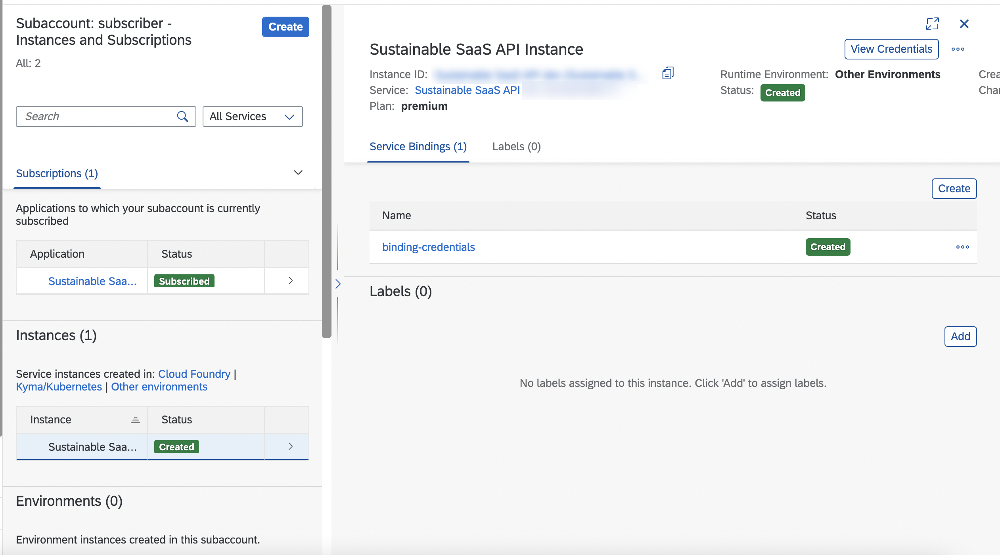
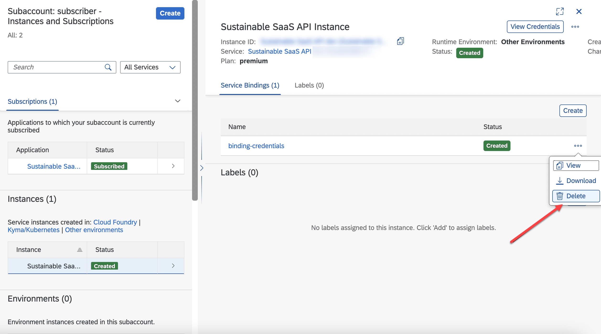
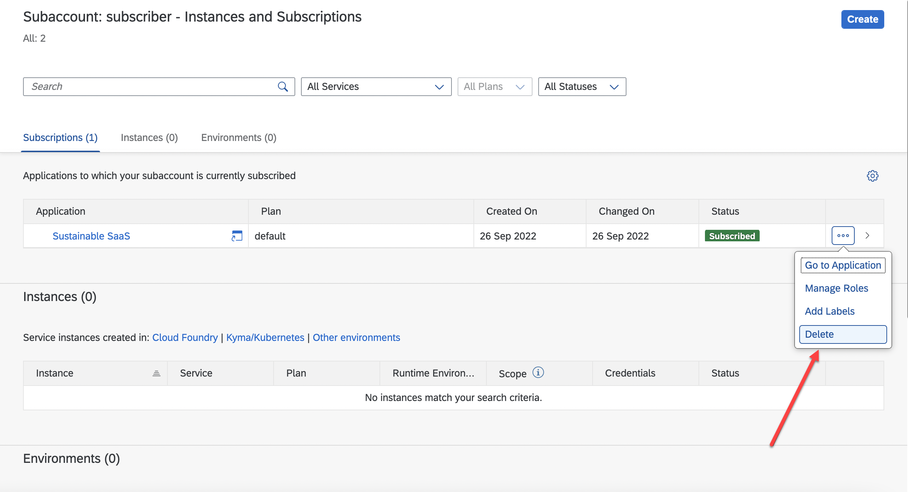
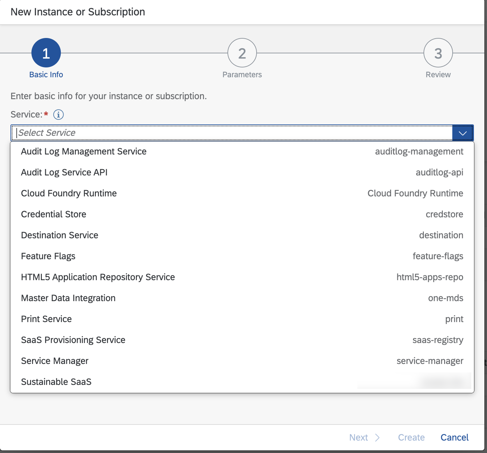

# Unsubscribe from a Consumer Subaccount

> **Important** - If you are planning to setup the **Advanced Version** next, please consider this part of the tutorial optional!

If a subaccount is subscribed to our multitenant SaaS sample application and created a service instance for the related SaaS API, the subaccount will resemble the below screenshot. 

The following steps show you how to unsubscribe from the SaaS application and how to remove the API Service Broker instance from such a Tenant Subaccount.

- [Unsubscribe from a Consumer Subaccount](#unsubscribe-from-a-consumer-subaccount)
  - [1. Delete the service instance and unsubscribe](#1-delete-the-service-instance-and-unsubscribe)
  - [2. Check successful Unsubscription](#2-check-successful-unsubscription)
  - [3. Further Information](#3-further-information)

## 1. Delete the service instance and unsubscribe

1.1. Remove the service binding of the Sustainable SaaS API service instance.

1.2. Delete the Sustainable SaaS API service instance.

1.3. Unsubscribe from the Sustainable SaaS sample application.

## 2. Check successful Unsubscription

Please check, whether the Sustainable SaaS API Service Broker has unregistered successfully. The **Sustainable SaaS API Service Broker** is automatically unregistered when unsubscribing from the Sustainable SaaS application in a Consumer Subaccount. Consequently, the Sustainable SaaS API Service should not be visible in a Consumer Subaccount anymore, when a new service instance creation attempt is made from that subaccount. As you can see below, the **Sustainable SaaS API** Service is not visible anymore.

> **Hint** - If your Service Broker is not unregistered automatically, you must unregister it with the help of SAP BTP CLI using this [command](https://help.sap.com/docs/BTP/btp-cli/btp-unregister-services-broker.html). Make sure your Service Broker is unregistered because otherwise you can **not** delete the respective subaccount.

## 3. Further Information

Please use the following links to find further information on the topics above:

* [SAP Help - Deleting Service Instances](https://help.sap.com/docs/SERVICEMANAGEMENT/09cc82baadc542a688176dce601398de/753463e1542f445895b420cd7957811c.html?&locale=en-US)
* [SAP Help - Unregister Services Broker](https://help.sap.com/docs/BTP/btp-cli/btp-unregister-services-broker.html)