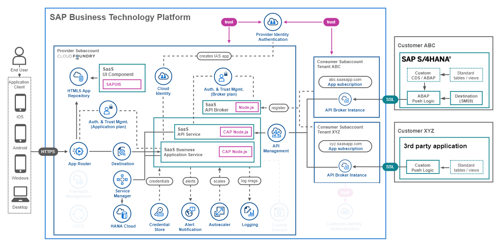
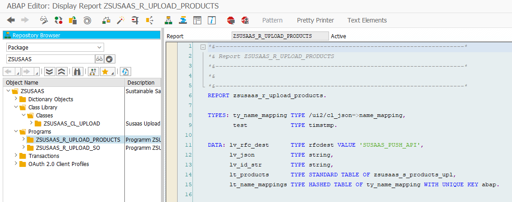

# Advanced Version Introduction

- ### **Kyma** ✅
- ### **Cloud Foundry** ✅

The **Advanced Version** of the sample application requires a certain **Basic** setup, which means you have to get started with the **Basic Version**, before challenging yourself with the Advanced Version. The **Expert Features** contain additional components and tutorials that can be applied to both the Basic **and** Advanced Version.

In the [Basic Version](../../2-basic/0-introduction-basic-version/README.md) we provided you with the core elements required for a **Cloud Foundry** or **Kyma-based** Software as a Service (SaaS) application on SAP Business Technology Platform (SAP BTP). The idea of the **Advanced Version** is about taking all the features implemented in the **Basic Version** and extending them to the next level with other great services provided by SAP BTP. This will take you one step closer to an enterprise-read SaaS application

- [Advanced Version Introduction](#advanced-version-introduction)
  - [1. Step-by-Step Guide](#1-step-by-step-guide)
  - [2. Included Features](#2-included-features)
  - [3. Advanced Version Result](#3-advanced-version-result)

Take a look at the following architectures to get an idea of the Advanced Version in the Kyma and Cloud Foundry Runtime.

**Kyma**

**Cloud Foundry**

## 1. Step-by-Step Guide

For completing the **Advanced Version** of this tutorial please run through the steps described in the following Readme documents. If not stated differently, the respective step-by-step tutorial will cover both runtimes. 

1. **Prepare the Provider Subaccount** by adding additional entitlements. ➜ ([click here](../1-prepare-provider-subaccount/README.md))
2. Set up the **Central User Management** feature using **SAP Identity Authentication Service** (SAP IAS). ➜ ([click here](../2-central-user-management-ias/README.md))
3. Configure an SAP S/4HANA system for an **automated sample data push**. ➜ ([click here](../3-push-data-s4hana-system/README.md))
4. Integrate **SAP API Management** for API management and monitoring. ➜ ([Kyma](../4-kyma-integrate-api-management/README.md)) ([Cloud Foundry](../4-cf-integrate-api-management/README.md))

## 2. Included Features

The **Advanced Version** provides the sample implementation of a CAP-based multitenant SaaS application containing all the features of the **Basic Version**. Furthermore, the **Advanced Version** provides sample integrations and usage scenarios of SAP BTP services including:

> (*) indicates that the feature is only available in the Advanced Version, all other features are also available in Basic Version.

- basic enterprise application features like
    - **Alert Notification Service** informing you about issues with your application like a crash or errors during Tenant onboarding.
    - **Autoscaling** which is scaling your SaaS application components in case of increased workload by your SaaS tenants.
    - **HTML5 Application Repository** storing and serving your static application content making your app more resilient.
- important components for SaaS usage like
    - **SAP HANA Cloud** allowing you to use the powerful container concept for Tenant separation on the same database.
    - **Service Manager** which is responsible for handling a secure communication with the Tenant database containers.
    - **Application Router** which is one of the key players in handling the multitenancy features of your SaaS application.
- Authorization & Trust Management service instances of
    - **application** plan which handles the XSUAA-based application authentication and authorization of all tenants.
    - **broker** plan which takes care of the XSUAA-based API access security requirements for all tenants.
- additional enterprise readiness features like an
    - (*) **SAP Cloud Identity** services for handling a Central User Management and In-App user management operations on SAP Identity Authentication Service.
    - (*) **SAP S/4HANA push** example which enables consumers to push business data from their On-Premises systems in a certain format.
    - (*) **SAP API Management** setup which allows SaaS Providers to add enterprise API qualities to the API endpoints provided to subscribers.

## 3. Advanced Version Result

As a result of this Advanced tutorial, you have a SaaS application running in the **Cloud Foundry** environment or **Kyma Cluster** of your own SAP BTP Subaccount.

> (*) indicates that the feature is only available in the Advanced Version, all other features are also available in Basic Version.

- offers your Subscriber Tenants a user interface to
    - **manage** the Tenant specific **users** of the SaaS application.
    - create **projects** and assign **members** to different projects.
    - setup **assessments** for analyzing product circularity metrics.
- provides an HDI container based **data separation** for all tenants.
- can be subscribed from **Consumer Subaccounts** in the same Global Account.
- creates a dedicated **service broker instance** for **API access** during the subscription.
- allows your Tenants to read and **update data** using a multitenant **API** endpoint.
- let Tenants **prefill** assessments using data uploaded using the **API**.
- (*) automates the creation of **shadow users** and **SAP IAS users** from the in-app user management.
- (*) to which Tenants can securely **push** sample data from their On-Premise systems.
- (*) allows SaaS consumers to apply enterprise-ready API qualities such as **Rate Limiting**, **Quotas**, ... .

While the user interface of the SaaS application remains the same as in the Basic Version, the following screenshots will give you an idea of the additional Advanced Version features like the usage of SAP IAS or SAP API Management.

|  |  
|:----------------: | :----------------: | 
| *SAP IAS Overview* | *SAP API Management Rate Limiter* | 

|  |
|:----------------: | 
| *SAP S/4HANA Push with ABAP* | 