# Central user management using SAP Identity Authentication Service

- ### **Kyma** ✅
- ### **Cloud Foundry** ✅

In this part of the tutorial, you will learn how you as a SaaS Provider can set up a central user management using SAP Identity Authentication Service (SAP IAS). This makes your solution independent from SAP ID Service, which requires users of your SaaS consumers to sign up for an SAP-managed user account. Using SAP IAS you can manage (register, unregister, reset passwords, ...) all SaaS Consumer users in a central place. 

- [Central user management using SAP Identity Authentication Service](#central-user-management-using-sap-identity-authentication-service)
  - [1. SAP Identity Authentication](#1-sap-identity-authentication)
  - [2. SAP IAS tenant and XSUAA trust setup](#2-sap-ias-tenant-and-xsuaa-trust-setup)
  - [3. Configure the XSUAA and IAS settings](#3-configure-the-xsuaa-and-ias-settings)
  - [4. Update your application deployment](#4-update-your-application-deployment)
    - [Kyma](#kyma)
    - [Cloud Foundry](#cloud-foundry)
  - [5. Understand the registration and login flow](#5-understand-the-registration-and-login-flow)
  - [6. Test the SAP IAS integration](#6-test-the-sap-ias-integration)
  - [7. Why that complicated?!](#7-why-that-complicated)
  - [8. Possible enhancement scenarios](#8-possible-enhancement-scenarios)
  - [9. Further information](#9-further-information)

The following tutorial will start with the technical setup requirements of the **Advanced Version** when it comes to the usage of SAP IAS before explaining the architecture and concepts in greater detail! We recommend going through the whole tutorial to understand what's happening under the hood! To integrate SAP Identity Authentication Service as a central user management tool, please follow the upcoming sections.

- Understand the basics of SAP Identity Authentication Service.
-  If required, set up a new SAP IAS tenant and
    * configure the trust between SAP IAS and your Provider Subaccount.
    * configure the trust between SAP IAS and your Consumer Subaccount.
-  Disable the creation of Shadow Users for security purposes.
-  Configure the trusted domain of your Kyma Cluster in SAP IAS.
-  Ensure you understand the architecture and flow using SAP IAS.
-  Test the end-to-end scenario in a Subscriber Tenant.
-  Understand the reasons and complexity of the current setup.
-  Check out the possible enhancement scenarios of this setup.


## 1. SAP Identity Authentication

**What is SAP Identity Authentication**

What is SAP Identity Authentication Service? A crisp description can be found on the official SAP Identity Authentication Service Community page [(click here)](https://community.sap.com/topics/cloud-identity-services/identity-authentication). 

> *"Identity Authentication is a cloud service for authentication, single sign-on, and user management in SAP cloud and on-premise applications. It can act as an identity Provider itself or be used as a proxy to integrate with an existing single sign-on infrastructure."*

So while SAP IAS **can** be used for user management and authentication like in our sample use-case, it can also act as a proxy and forward authentication requests to Identity Providers like an Active Directory. This feature allows you, to offer your SaaS consumers the option to integrate their own IdPs. This requirement will be briefly covered in the Expert Features of the tutorial. 

For further information on SAP Identity Authentication Service please also check the official SAP Help documentation [click here](https://help.sap.com/docs/IDENTITY_AUTHENTICATION?locale=en-US).

**Advantages of using SAP IAS**

The usage of SAP IAS provides signification advantages for your SaaS application and for you as a SaaS Provider with some of them listed below:
- Centrally manage (e.g., register, unregister) all Consumer users for each SaaS application.
  > Each SaaS application registered in SAP IAS can manage its own SaaS Consumer users.
- Customize the onboarding process (e.g., registration) and the user experience (e.g., login screens).
- Define login procedures like social login or secure multi-factor authentication on a Consumer basis.
- Include your consumer's Identity Provider and set up custom login logic for each Consumer Subaccount.
- Automate the SAP IAS instance, user, and application management using existing and upcoming APIs.
- Simple integration/trust setup with Consumer Subaccounts using OpenID Connect (OIDC).


## 2. SAP IAS tenant and XSUAA trust setup

In case you already have an existing trust between SAP XSUAA of Provider Subaccount and your SAP IAS tenant, there are only a few additional steps to take when setting up a new Consumer account.

* Set up your central SAP IAS tenant as a trusted IdP in your Consumer Subaccounts.
* Disable the creation of shadow users in the SAP IAS trust configurations. 

> **Important** - Make sure that the shadow user creation is **also disabled in your Provider Subaccount**! 

In case you don't have an SAP IAS tenant or you haven't configured it as a trusted Identity Provider in your **Provider and consumer** subaccounts yet, please follow the steps below:

2.1. There are multiple ways to get an SAP IAS instance. Usually an SAP customer is supposed to have one productive SAP IAS instance in his SAP landscape. An SAP IAS instance can either be created right from within the SAP BTP Cockpit or a customer/partner gets it in a bundle with solutions like SAP SuccessFactors. 

2.2. To check whether there's already an SAP IAS tenant available which can be used for this scenario, please go to your Provider Subaccount and switch to the **Trust Configuration** in the **Security** section. Click on **Establish Trust**. If there is an SAP IAS tenant available in your landscape and a mapping between your SAP BTP Global Account and your SAP CRM customer number exists, you should be able to select it from the list in the respective popup and finish the trust setup using the **Next** button. Please repeat the same process in each Consumer Subaccount and you're done with the trust set up and you can skip the next steps. 

> **Important** - Don't forget to continue with steps *3 - Disable Automatic Shadow User Creation* to finish the technical setup in your **Provider and Consumer Subaccounts**.

[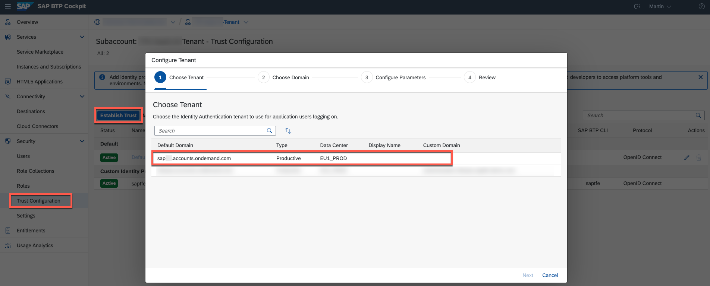](./images/IAS_Trust_Config.png?raw=true)

2.3. If there is no SAP IAS tenant available for your customer account, you can create a new tenant from your Provider Subaccount or any other subaccount. Please switch to **Instances and Subscriptions** in the **Services** section and create a new service instance of type **Cloud Identity Service** with service plan **default**. 

[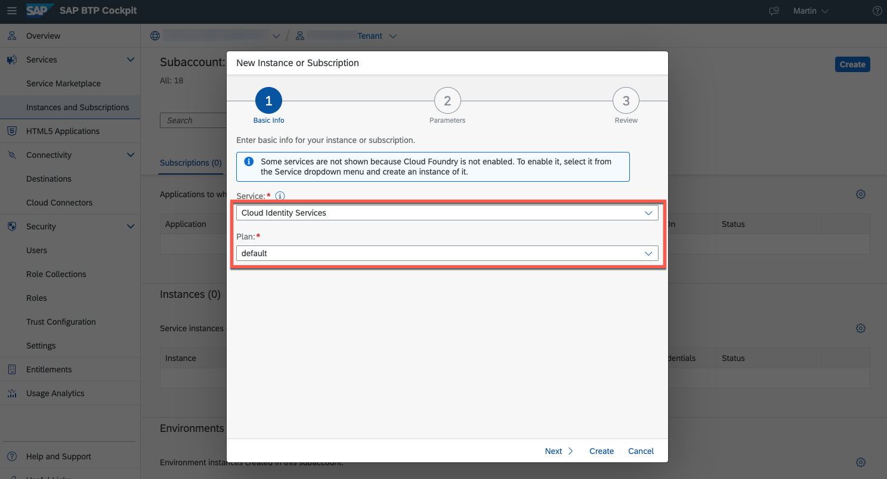](./images/IAS_SetupIAS.png?raw=true)

> **Important** - If you're missing this service or service plan, please make sure to add it to your subaccount entitlements. While the **default (Application)** service plan will create a new SAP IAS tenant, the **application** service plan will create a new application registration in an SAP IAS tenant configured as a trusted IdP to the respective subaccount.
> [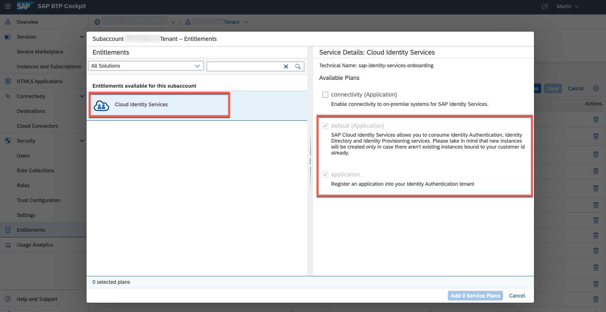](./images/IAS_EntConfig.png?raw=true)


2.4. Decide if you want to set up a productive or test tenant of SAP Identity Authentication and click on **Create** to trigger the setup. 

2.5. You or your SAP BTP Global Account administrator will receive a mail with instructions on how to initialize your new SAP IAS tenant once it is provisioned. The initial admin user can create further users or admins in SAP IAS. 

[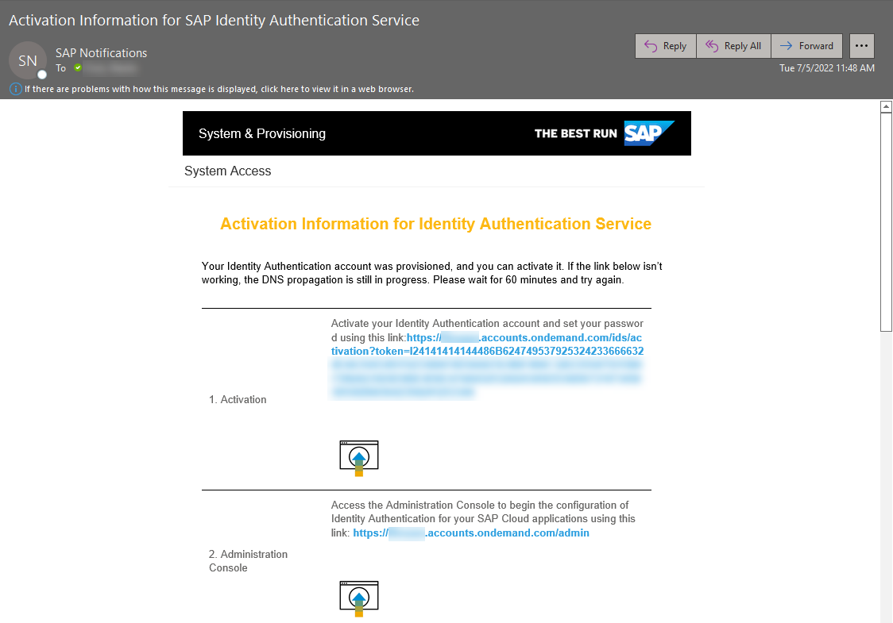](./images/IAS_ActivationMail.png?raw=true)

2.6. Once the IAS tenant is provisioned, it will also appear in the configuration popup of your **Trust Configuration** and you can finish the trust set up in your Consumer and Provider Subaccounts.

2.7. Please make sure you're able to log in to the SAP IAS Administration Console as an Administrator user by either initializing the SAP IAS tenant yourself or by requesting a respective user from your administrator.


## 3. Configure the XSUAA and IAS settings

**Disable Automatic Shadow User Creation**

Right after setting up the trust between your SAP IAS instance and your **Provider** and **consumer** subaccounts, please disable the **Automated Creation of Shadow Users** in the **Trust Configuration** of your SAP IAS trust settings. This is a one-time action, which you need to apply for each new Subscriber tenant!

[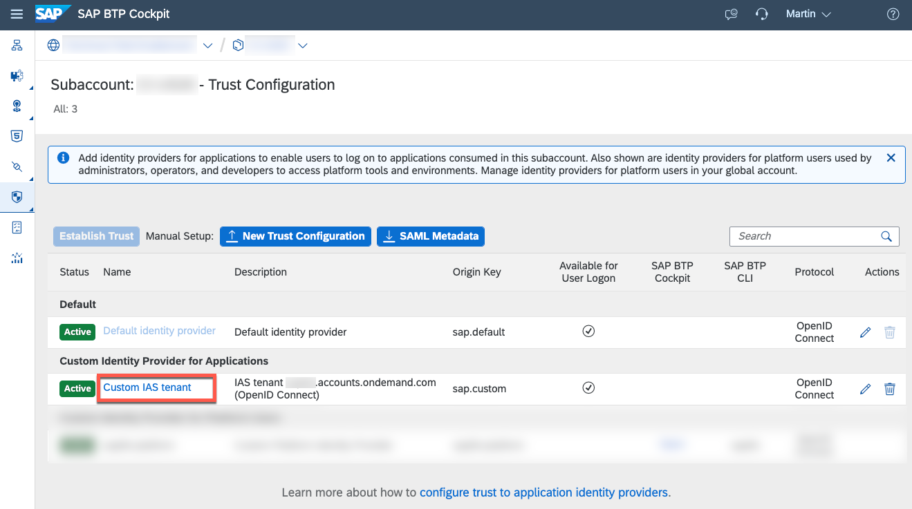](./images/IAS_ShadowUser01.png?raw=true)

[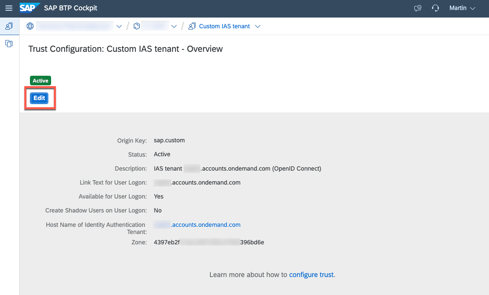](./images/IAS_ShadowUser02.png?raw=true)

An Automated creation of shadow users would result in a setup in which each and every SAP IAS user can authenticate to each Consumer Subaccount. As your central SAP IAS instance contains the users of all consumers, this is not desirable! Instead, we will create the subaccount-specific shadow users upon user creation in the SaaS in-app user management. While this is a bit more coding an maintenance effort, it provides a much more reliable and secure setup.


**Configure trusted domains in SAP IAS**

To allow an automated forwarding of users to the respective tenant SaaS instances after registration in SAP IAS, you need to add your SaaS application domain as a trusted domain in the SAP IAS **Tenant Settings**. Therefore, please login to SAP Identity Authentication Service as an Administrator and follow the screenshots below. SAP IAS will only allow redirects to domains which have been explicitly whitelisted in the Tenant Settings.

[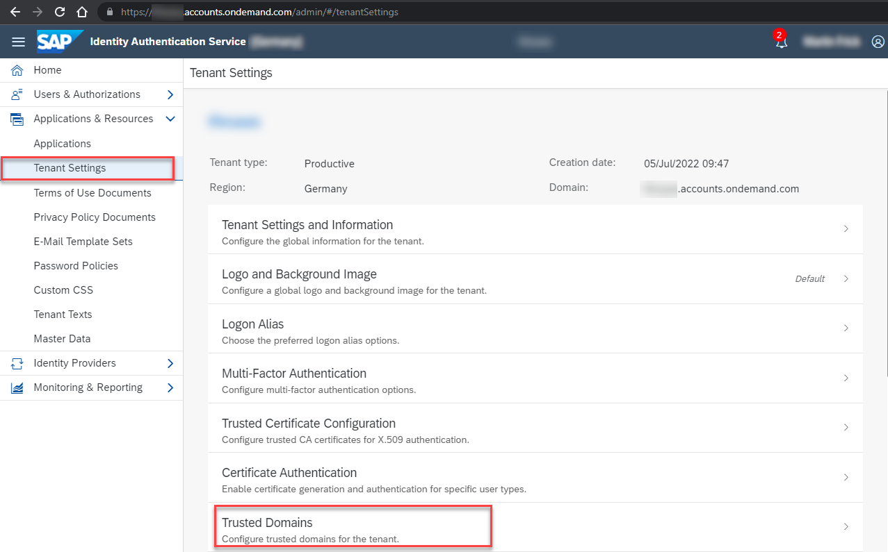](./images/IAS_TrustedDomain01.png?raw=true)

**Kyma**

[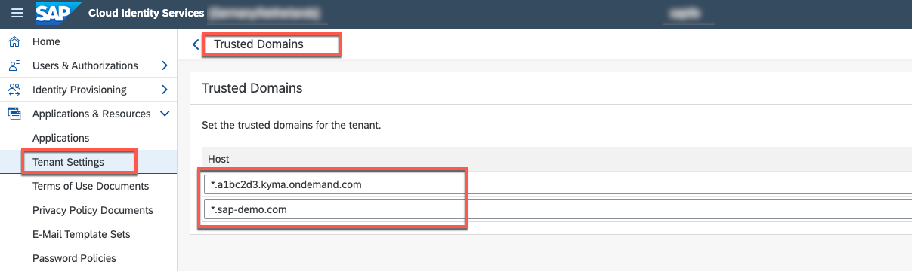](./images/IAS_TrustedDomain02.png?raw=true)

**Cloud Foundry**

[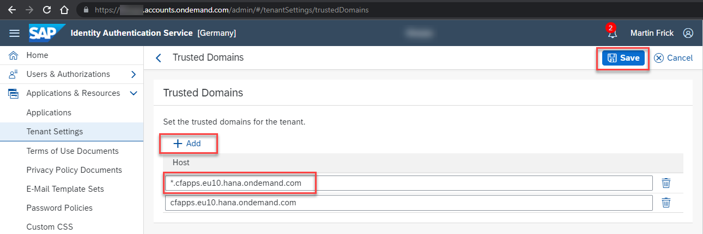](./images/IAS_TrustedDomain02Cf.png?raw=true)


If required for increased security, don't use your Cloud Foundry or Kyma subdomain with a wildcard, but specify the full qualified hostname including the different tenant-identifiers. Alternatively you can also use your own custom domain. For information can be found in SAP Help ([click here](https://help.sap.com/docs/IDENTITY_AUTHENTICATION/6d6d63354d1242d185ab4830fc04feb1/08fa1fe816704d99a6bcab245158ebca.html?locale=en-US)).


## 4. Update your application deployment

To enable the Central User Management leveraging SAP Identity Authentication Service in your environment, please make sure to update your application deployment accordingly. For this advanced feature, an additional Service Instance is required, generating a new application registration in your trusted SAP IAS tenant. Furthermore, this Service Instance will be bound to your backend application and allows you to programmatically interact with SAP IAS (e.g., to create new SaaS Consumer users).

### Kyma

> **Important** - Please make sure, you successfully configured the trust between your SAP Identity Authentication Service tenant, and both, the Provider and Subscriber Subaccount.

For this Advanced feature, please add the **values-ias.yaml** ([./files/values-ias.yaml](./files/values-ias.yaml)) details to your main **values-private.yaml** file (located in [*deploy/kyma/charts/sustainable-saas*](../../../deploy/kyma/charts/sustainable-saas/*)). Your *values-private.yaml* should look similar to this (some values replaced by ... to increase readability). 

```yaml
...

srv:
  ####################### Existing Configuration ########################
  image:
    repository: sap-demo/susaas-srv
    tag: latest
  ######################### Added Configuration ######################### 
  bindings:
    identity:
      serviceInstanceName: identity
      parameters:
        credential-type: X509_GENERATED
      credentialsRotationPolicy:
        enabled: true
        rotatedBindingTTL: 1h
        rotationFrequency: 24h

...

######################### Added Configuration ######################### 
identity:
  serviceOfferingName: identity
  servicePlanName: application
  parameters:
    display-name: [...]
    oauth2-configuration:
      redirect-uris: [...]
      post-logout-redirect-uris: [...]
      grant-types: ["authorization_code"]
      credential-types: ["binding-secret", "x509"]
    xsuaa-cross-consumption: false
    multi-tenant: false
```

After updating your **values-private.yaml** file, please start an upgrade of your existing Sustainable SaaS deployment, by running the following command. This will create the new Service Instance and requires Service Bindings. 

```sh
# Run in ./deploy/kyma #
helm upgrade susaas ./charts/sustainable-saas -f ./charts/sustainable-saas/values-private.yaml -n <Namespace>

# Example #
helm upgrade susaas ./charts/sustainable-saas -f ./charts/sustainable-saas/values-private.yaml -n default
```

In your **Service Instances** you should now see a new instance of type **identity** and plan **application**, which has a **Service Binding** to your Backend Service. 

[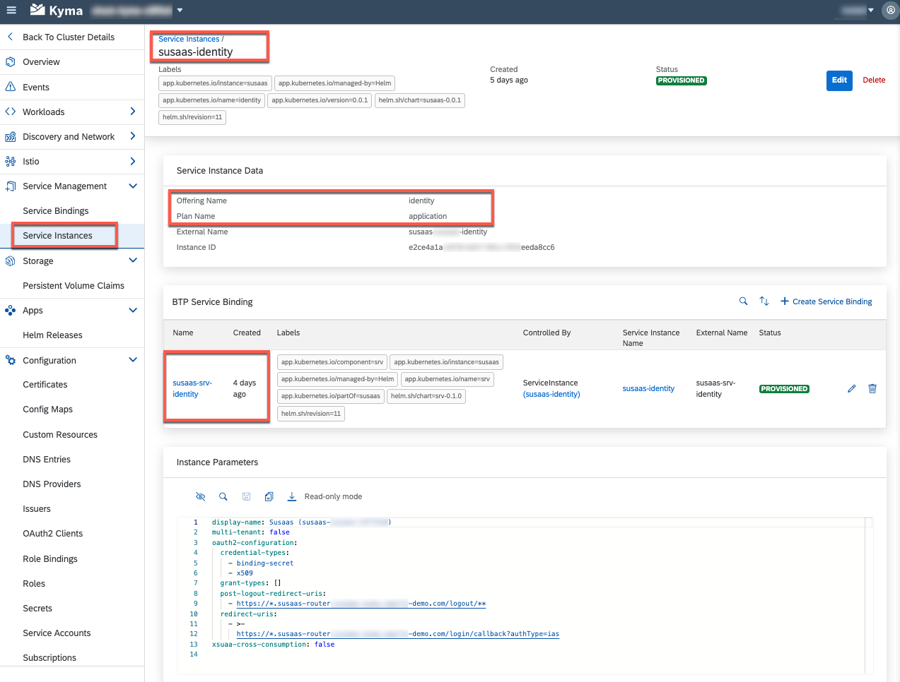](./images/IAS_InstanceKyma.png?raw=true)

A **Cloud Identity** service instance creates a new Application Registration in the SAP IAS tenant which is configured as Trusted Identity Provider of the given subaccount. Using the X.509 certificate of a respective Service Binding of this Cloud Identity Service instance, allows you to call the API endpoints of SAP IAS, to register or delete new users on behalf of the Application Registration. 

**Details**

Below, you can find the Service Instance definition of the SAP Cloud Identity Service Instance being created.

```yaml 
# SAP Cloud Identity Service Instance
# Provides an SAP IAS integration for central user management
identity:
  serviceOfferingName: identity
  servicePlanName: application
  externalName: default-susaas-identity
  parameters:
    display-name: SusaaS (susaas-default-a1b2c3)
    multi-tenant: false
    oauth2-configuration:
      credential-types:
      - binding-secret
      - x509
      grant-types:
      - authorization_code
      post-logout-redirect-uris:
      - https://*.susaas-router-default.a1b2c3.kyma.ondemand.com/logout/**
      redirect-uris:
      - https://*.susaas-router-default.a1b2c3.kyma.ondemand.com/login/callback?authType=ias
```

Besides the new Service Instance, also a new Service Binding between the **SaaS Backend Service** and the **Cloud Identity** Service Instance is configured. In this case a special binding type (X.509) is required, while for all other Service Bindings we are using the standard Client Credential binding. 

```yaml 
# SAP Cloud Identity Service Instance Binding
# Creates a binding between the Service Instance and the SaaS Backend Service
srv:
  bindings:
    identity:
      serviceInstanceName: susaas-identity
      parameters: 
        credential-type: X509_GENERATED
      credentialsRotationPolicy: 
        enabled: true
        rotatedBindingTTL: 1h
        rotationFrequency: 24h
```

There are no changes required in the application logic, as the availability of the SAP Cloud Identity Service Binding is determined at runtime. If a Service Binding is identified, different logic is being executed. 

**/code/srv/srv/utils/user-management.js**

```js
class UserManagement {
    constructor(token) {
        this.ias = this.#checkIASBinding();
    }

    async createUser(userInfo) {
        try {
            ...
            // User in SAP IAS only created if Service Binding exists
            this.ias && (createdUserInfo.iasLocation = await this.createIASUser(userInfo)) 
            ...
        }
    }

    #checkIASBinding() {
        try {
            return xsenv.getServices({ ias: { label: 'identity' } }) && true;
        } catch (error) {
            return false
        }
    }
}

```

### Cloud Foundry

> **Important** - Please make sure, you successfully configured the trust between your SAP Identity Authentication Service tenant, and both, the Provider and Subscriber Subaccount.

By adding a different Deployment Descriptor extension file (**mtaext**) file to your **mbt build** or **cf deploy** command, a new **Cloud Identity** Service Instance of type **application** is created upon deployment to your Cloud Foundry environment. 

Before running the following commands, please open the respective **advanced** *mtaext* sample file (depending on your environment) in the *deploy/cf/mtaext* directory. Update the **Service Broker Credential Hash** placeholder and save as a new file adding the **-private** file name extension again (to ensure the credentials are not committed to GitHub!). Check the following screenshot to get an idea how your **advanced** *mtaext* file and the respective directory should be looking like!

[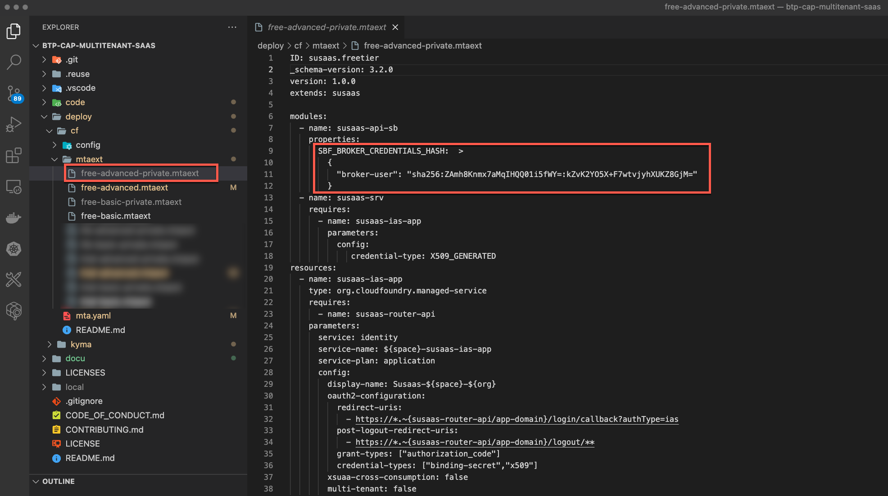](./images/APP_Mtaext_Dir.png?raw=true)

Once your created your private Deployment Descriptor extension file, please run the following commands to deploy the new features to your existing application. 

```sh
# Run in /deploy/cf #
mbt build -e ./mtaext/free-advanced-private.mtaext
cf deploy
```

Once the deployment has finished, you are good to go and the integration with SAP Identity Authentication should be working as expected. In your **Service Instances** you should now see a new instance of type **identity** and plan **application**, which has a **Service Binding** to your Backend Service. 

[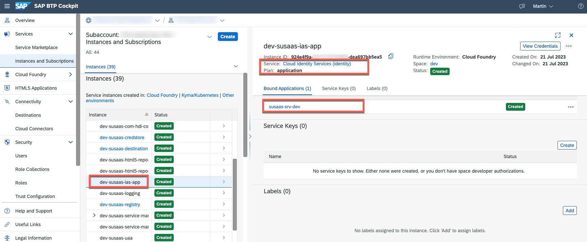](./images/IAS_InstanceCf.png?raw=true)


**Details**

Below, you can find the Service Instance definition (which is part of the Deployment Descriptor Extension) of the SAP Cloud Identity Service Instance being created.

```yaml 
# SAP Cloud Identity Service Instance
# Provides an SAP IAS integration for central user management
resources:
  - name: susaas-ias-app
    type: org.cloudfoundry.managed-service
    requires:
      - name: susaas-router-api
    parameters:
      service: identity
      service-name: ${space}-susaas-ias-app
      service-plan: application
      config:
        display-name: Susaas-${space}-${org}
        oauth2-configuration:
          redirect-uris:
            - https://*.~{susaas-router-api/app-domain}/login/callback?authType=ias
          post-logout-redirect-uris: 
            - https://*.~{susaas-router-api/app-domain}/logout/**
          grant-types: ["authorization_code"]
          credential-types: ["binding-secret","x509"]
        xsuaa-cross-consumption: false
        multi-tenant: false
```

Besides the new Service Instance, also a new Service Binding between the **SaaS Backend Service** and the **Cloud Identity** Service Instance is configured (as part of the Deployment Descriptor Extension file). In this case a special binding type (X.509) is required, while for all other Service Bindings we are using the standard Client Credential binding. 

```yaml 
- name: susaas-srv
    requires:
      - name: susaas-ias-app
        parameters:
          config: 
             credential-type: X509_GENERATED
```

Like in the Kyma scenario, also in case of Cloud Foundry, there are no changes required in the application logic, as the availability of the SAP Cloud Identity Service Binding is determined at runtime. Consequently, different logic is being executed. 

**/code/srv/srv/utils/user-management.js**

```js
class UserManagement {
    constructor(token) {
        this.ias = this.#checkIASBinding();
    }

    async createUser(userInfo) {
        try {
            ...
            // User in SAP IAS only created if Service Binding exists
            this.ias && (createdUserInfo.iasLocation = await this.createIASUser(userInfo))
            ...
        }
    }

    #checkIASBinding() {
        try {
            return xsenv.getServices({ ias: { label: 'identity' } }) && true;
        } catch (error) {
            return false
        }
    }
}
```


## 5. Understand the registration and login flow

See the following screenshots to get an idea of the user management architecture and to understand how registration as well as authentication works in the sample application including SAP IAS (click to enlarge). 

**Kyma**

[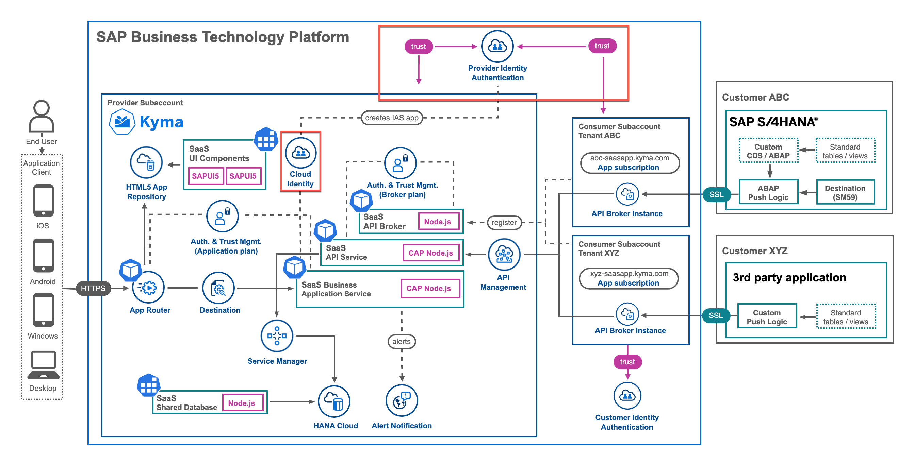](./images/APP_Architecture.png?raw=true)

**Cloud Foundry**

[](./images/APP_Architecture.png?raw=true)

**User Registration & Login Flow**

[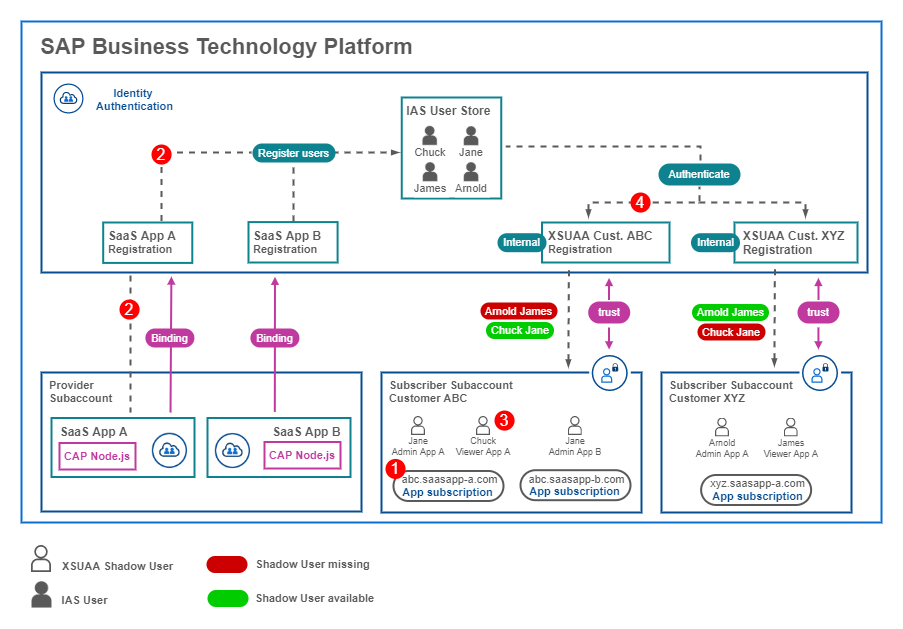](./images/IAS_Architecture.png?raw=true)

Compared to the Basic Version, the **Advanced Version** relies on the usage of a central SAP Identity Authentication tenant. This central SAP IAS instance is managed by the SaaS Provider and added to each Consumer Subaccount as a trusted IdP. This allows all SAP IAS users to authenticate against Consumer Subaccounts using SAP IAS instead of the default SAP ID Service. As you've learned in the Basic Version, the intention of the sample application is to offer in-app user management. For that reason also SAP IAS has to be part of the existing automation. So whenever a user is created or deleted in the SaaS application, it now also needs to be registered or unregistered from the corresponding SAP IAS application registration. So let's have a closer look at the registration and authentication process in case of the new user being added to the SaaS in-app user management. 

5.1. Let's assume the admin Jane of SaaS Consumer **ABC** creates a new user **Chuck** in the in-app user management of their Consumer SaaS instance. Consequently, a new user in SAP IAS has to be *registered/created* and a so-called **shadow user** in XSUAA has to be *created*. 

> You might ask yourself - Why do we need to manage users in SAP IAS and in XSUAA? In this sample, we decided to maintain the shadow users on the XSUAA side manually. While SAP IAS is used as a central user store **for all SaaS consumers**, this manual approach ensures that only the users that exist as shadow users in the corresponding Consumer Subaccount can access the application. In the sample flow (see above), **James** exists as a user in SAP IAS and as a **shadow user** in the XYZ Consumer Subaccount. This gives him access to the Consumer SaaS instance in subaccount XYZ. On the other side, Chuck and Jane of Consumer ABC will not be able to access XYZ's SaaS instances, because no corresponding shadow users exist for them in the respective subaccount.

5.2. Understanding the basic idea of SAP IAS and XSUAA shadow users, let's check how the actual flow continues once Jane added the new user Chuck within ABC's SaaS in-app user management. 

Using a binding to a service instance of type **Cloud Identity Service** (application plan) defined in the **values.yaml** files of our Umbrella Helm Chart, the SaaS backend is able to interact with the central SAP IAS tenant. A Cloud Identity Service instance with service plan *application* can only be created in subaccounts with an SAP IAS instance configured as a trusted Identity Provider. 

**Kyma**

[](./images/IAS_ServiceInstance.png?raw=true)

**Cloud Foundry**

[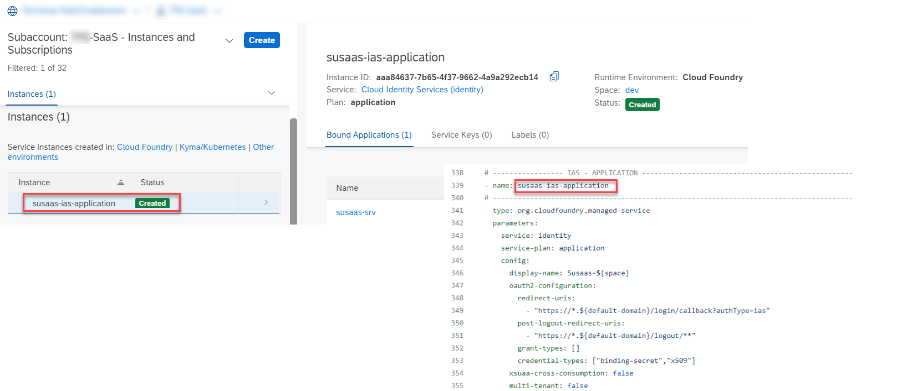](./images/IAS_ServiceInstanceCf.png?raw=true)

> **Important** - When setting up the SAP IAS trust in the SAP BTP **Trust Configuration**, an application registration in SAP IAS is created, which is used for authentication to all XSUAA-based applications in the subaccount. 

[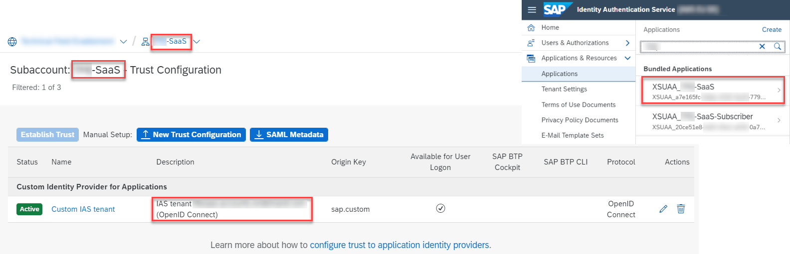](./images/IAS_ProviderTrust.png?raw=true)

Additionally, the Cloud Identity Service instance (application plan) defined in the mta.yaml of our sample application creates another application registration in SAP IAS during deployment. This service instance is bound to the SaaS backend and is used to programmatically interact with SAP IAS (e.g., to register or unregister users)

**Kyma**

[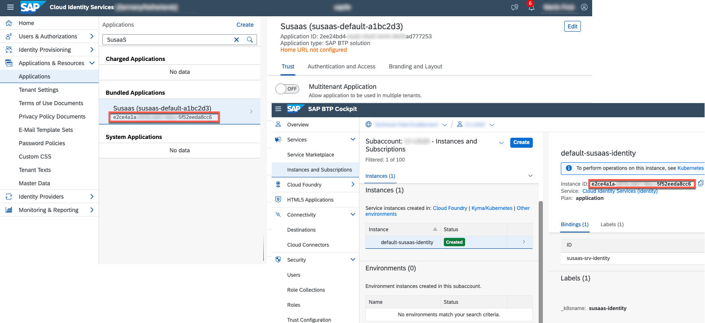](./images/IAS_ServiceAppReg01.png?raw=true)
[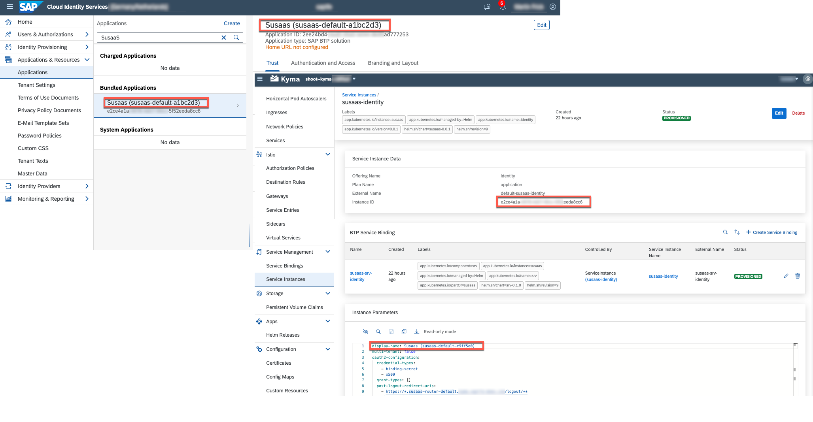](./images/IAS_ServiceAppReg02.png?raw=true)

**Cloud Foundry**

[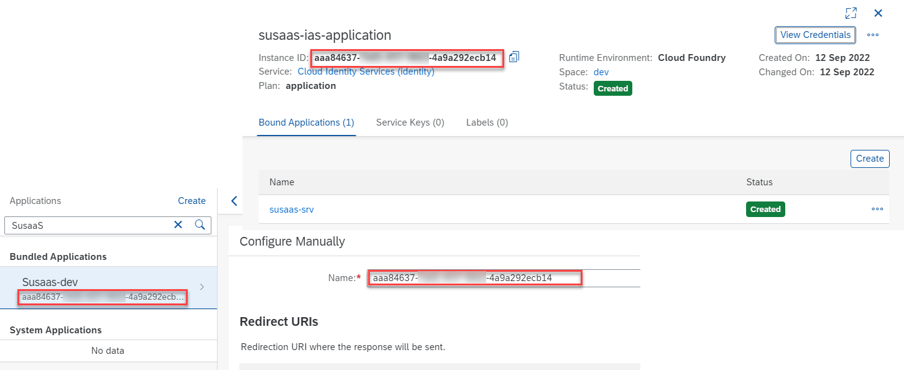](./images/IAS_ServiceAppReg01Cf.png?raw=true)
[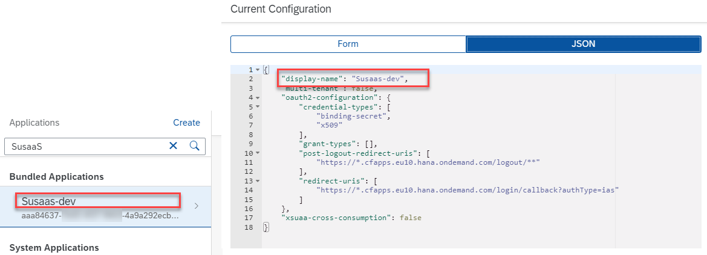](./images/IAS_ServiceAppReg02Cf.png?raw=true)

Binding such a service instance to the SaaS backend will give you access to an X.509 certificate. Using this X.509 certificate, the SaaS backend can call SAP IAS APIs (e.g. to register or unregister users) on behalf of the application registration which is created in SAP IAS by the service broker.

**Kyma**

[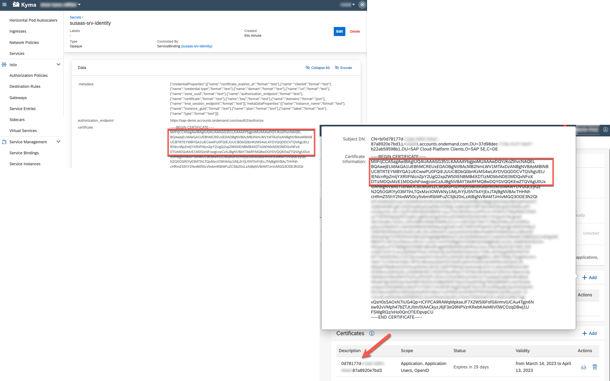](./images/IAS_BindingCert01.png?raw=true)

**Cloud Foundry**

[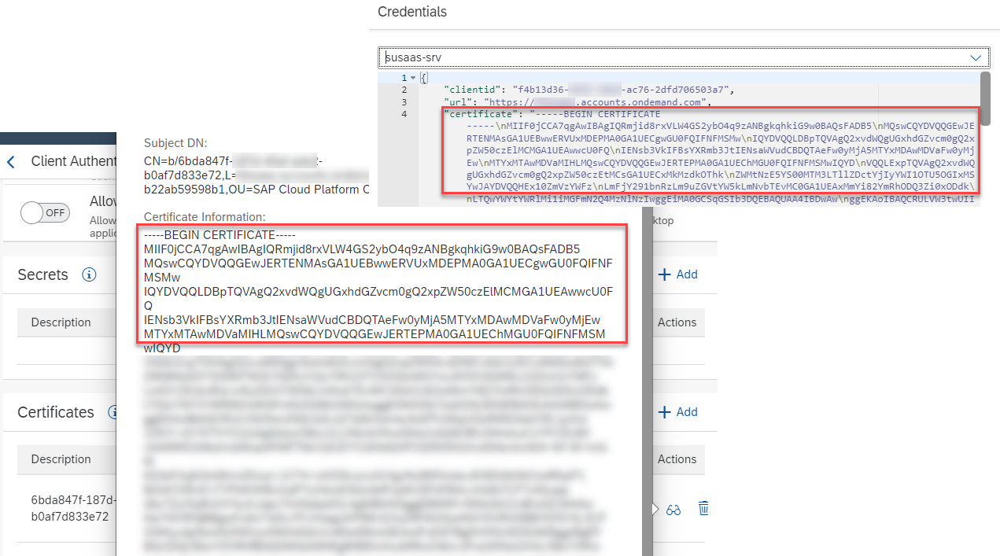](./images/IAS_BindingCert01Cf.png?raw=true)


As you can see in the screenshot below, the X.509 certificate generated during the binding process, allows you to manage the application registration in SAP IAS and manage (register, unregister) users on behalf of the application registration. Keep in mind, this application registration in SAP IAS is created during the deployment of the SaaS application and is independent of the various application registrations created by trust setups between XSUAA and SAP IAS for each subaccount. 

**Kyma**

[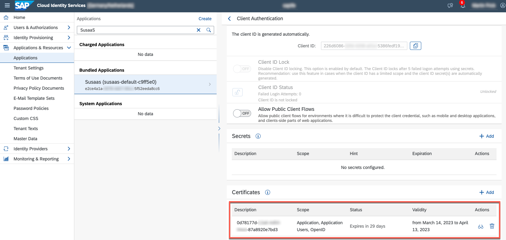](./images/IAS_BindingCert02.png?raw=true)

**Cloud Foundry**

[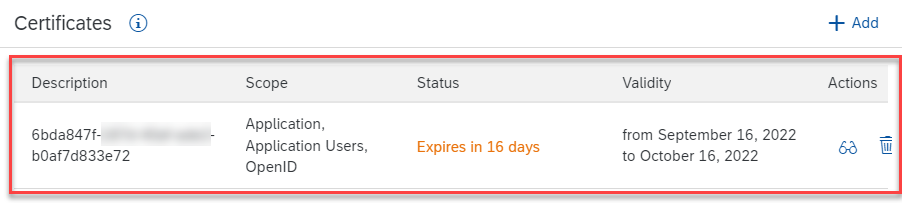](./images/IAS_BindingCert02Cf.png?raw=true)


Being able to programmatically interact with SAP IAS, the SaaS backend can create a new user in SAP IAS on behalf of the app-specific application registration. Once the user **Chuck** is registered in SAP IAS, he receives an automated email, asking him to complete the SAP Identity Authentication registration. This e-mail (style and content) can be customized by the SaaS Provider. 

> **Summary** - For **all Consumer Subaccounts** there is a separate application registration in SAP IAS (created by the trust between XSUAA and SAP IAS). These application registrations are **used for authentication** to the XSUAA-protected SaaS instances in the different Consumer Subaccounts! 
> Additionally, for **each SaaS application**, one dedicated application registration is created in SAP IAS which is being **used to register and unregister users** in SAP IAS across all SaaS consumers in an automated fashion!

5.3. While the user registration process is triggered in SAP IAS, **Chuck** is also created as a **shadow user** in the dedicated XSUAA user base of the ABC Consumer Subaccount and the respective **role collection** is assigned. For this shadow user, the central SAP IAS tenant (*Custom IAS tenant* managed by the Provider) is chosen as **Identity Provider** instead of the default SAP ID Service (**Basic Version**). 

[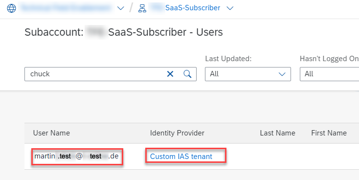](./images/IAS_UserCustomIdP.png?raw=true)

Based on the XSUAA - SAP IAS trust setup and a dedicated shadow user in XSUAA of the Consumer Subaccount, SAP IAS (acting as IdP) can now be used to authenticate requests to XSUAA-based applications like the SaaS sample application - As long as the shadow user exists and has the required role collections assigned. 

5.4. After successful registration, **Chuck** can now authenticate to the SaaS Tenant of Consumer ABC using SAP IAS as trusted IdP. This is where things are a bit tricky to understand, so please excuse if some explanations are repeated. 

As explained - while we're using a dedicated SAP IAS application registration for user management (register, unregister, ...), we cannot use the same application registration for authentication processes. 

SaaS users have to authenticate using the application registration created when the trust between a Consumer Subaccount and SAP IAS is initiated - as XSUAA will propagate the authentication to SAP IAS (acting as IdP) using this Consumer Subaccount-specific application registration. 

[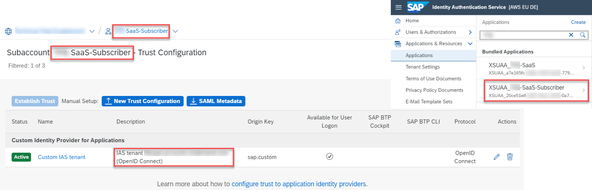](./images/IAS_SubscriberTrust.png?raw=true)

Until a native integration of SAP IAS into CAP (incl. role management in SAP IAS) is in place, the authentication using the Consumer Subaccount-specific application registration has to be used. This application registration can unfortunately not be used for automated user management at the same time, as it does not manifest in a service instance on the SAP BTP side. 

Okay wow, that was a lot of information to digest. Let's summarize the steps again!

- A new user is created from within the SaaS in-app user management by a Consumer administrator.
- It is registered in SAP IAS, using the X.509 certificate of a Cloud Identity service binding.
- In the Consumer Subaccount, an XSUAA shadow user is created and role collections are assigned.
- The user registers himself in SAP IAS after retrieving an automated invitation mail.
- The user can now authenticate using the application registration created by the Consumer Subaccount XSUAA - SAP IAS trust.


## 6. Test the SAP IAS integration

Before testing the SAP IAS integration, please double check whether your meet the following prerequisites.

- SAP Identity Authentication instance with administrator access ([click here](#1-sap-identity-authentication))
- Existing trust configuration between Provider Subaccount and SAP IAS ([click here](#2-sap-ias-tenant-and-xsuaa-trust-setup))
- Existing trust configuration between Subscriber Subaccount and SAP IAS ([click here](#2-sap-ias-tenant-and-xsuaa-trust-setup))
- Automated Shadow User Creation disabled for all trust configurations ([click here](#3-configure-the-xsuaa-and-ias-settings))
- Domain of your SaaS application added as trusted domain in SAP IAS ([click here](#3-configure-the-xsuaa-and-ias-settings))
- Application deployment updated with new Service Instance and Service Binding ([click here](#4-update-your-application-deployment))
- Basic understanding of the registration and login flow ([click here](#5-understand-the-architecture-and-login-flow))
- Existing Tenant Subaccount with Sustainable SaaS Subscription ([click here](../../2-basic/4-subscribe-consumer-subaccount/README.md))

All set? Great - then let's check whether the SAP IAS Integration works as expected! 

6.1. Switch to your (Test) Tenant Subaccount and make sure you have the SusaaS Administrator Role assigned and to test things in a new browser session or Incognito mode. 

6.1. Open the SaaS application in one of your Subscriber Subaccounts using the **Instances and Subscriptions** section of your SAP BTP Cockpit. 

[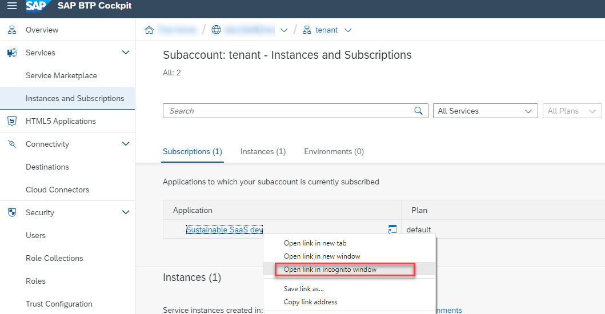](./images/SUB_InitApp.png?raw=true)

6.2. As you have setup a trust between the XSUAA environment of your Subscriber Subaccount and the central SAP IAS tenant, you should now be facing a new selection screen, asking you which Identity Provider to use for authentication. As you did not create a SAP IAS user so far, please continue with the **Default Identity Provider** and login with your default SAP Identity Service credentials. 

[](./images/IAS_IdPSelection.png?raw=true)

6.3. Switch to the **Manage Users** interface and create a new user. For testing purposes, feel free to set up a second user for yourself, but make sure to use **a different e-mail address** this time! 

[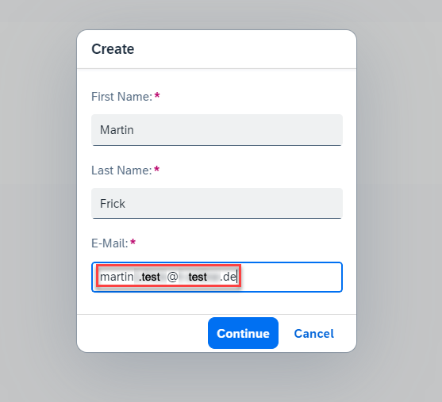](./images/IAS_CreateUser01.png?raw=true)
[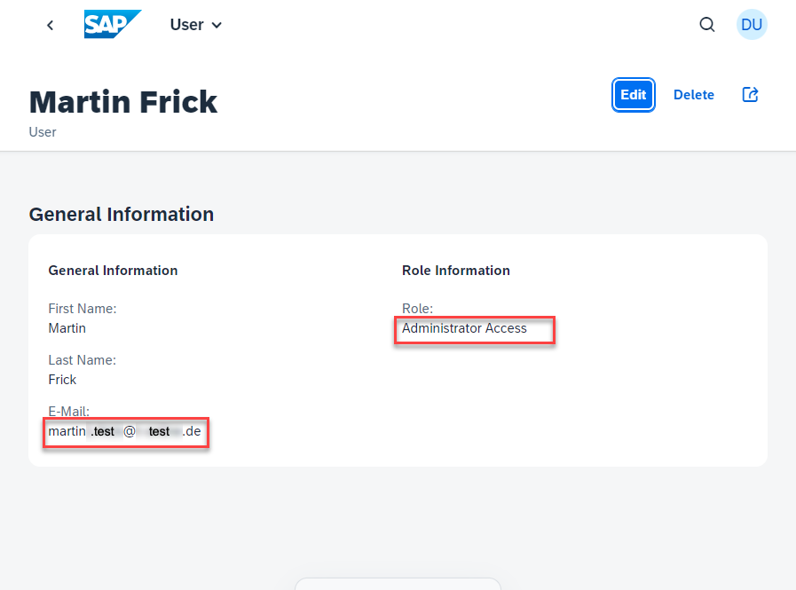](./images/IAS_CreateUser02.png?raw=true)

6.4. Once the new user is successfully created, check your e-mail inbox, which should contain a message from the central SAP Identity Authentication Service instance. In this e-mail, the you will be asked to sign-up for the Sustainable SaaS application. 

> **Hint** - The style and content of this e-mail can be modified for each application registration in SAP Identity Authentication Service ([click here](https://help.sap.com/docs/IDENTITY_AUTHENTICATION/6d6d63354d1242d185ab4830fc04feb1/b2afbcdccdf7410f8953e1e833e77de0.html?locale=en-US)). 

[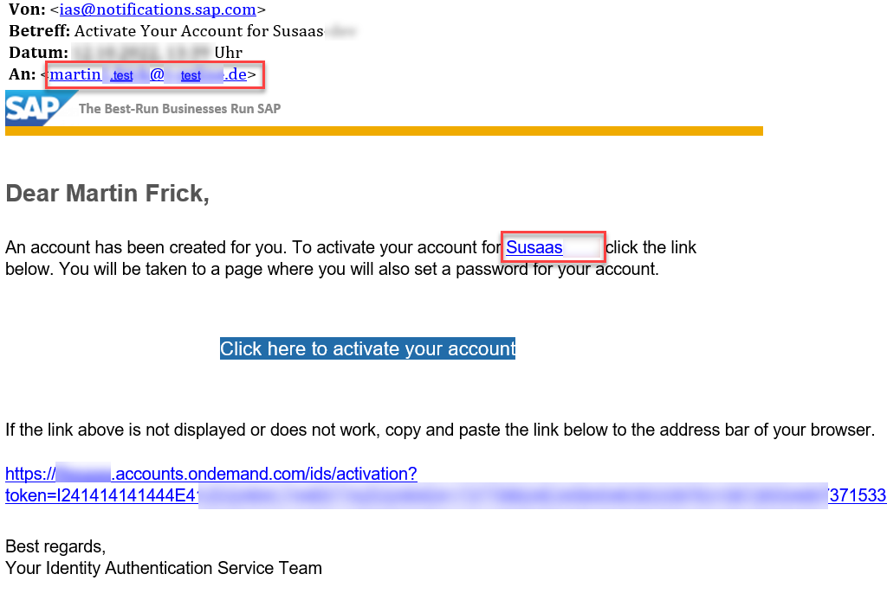](./images/IAS_Email01.png?raw=true)

6.5. Click on the provided link, to reach the registration form in which you can change your first and last name if required and set a password for the SAP Identity Authentication Service account. 

[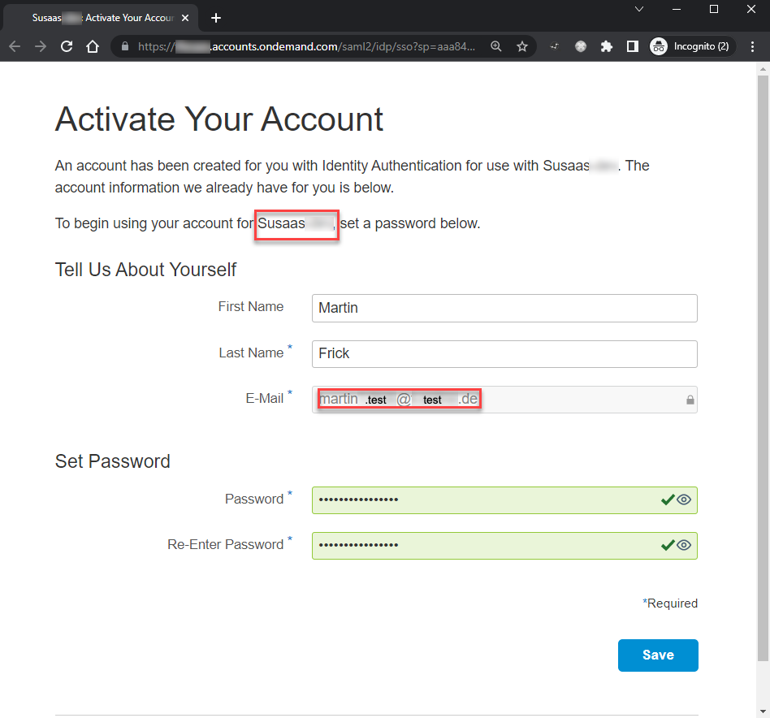](./images/IAS_Registration.png?raw=true)

6.6. Once you completed the registration, a success message is displayed and the page can be closed. Alternatively, you can click on **Continue**, to be redirected to the SaaS application instance of your Subscriber Tenant. 

[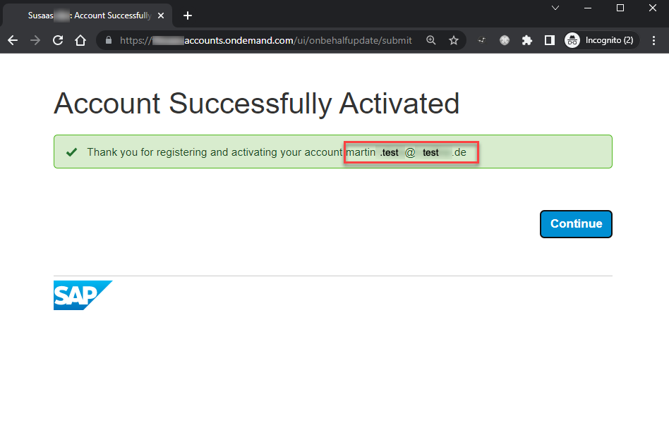](./images/IAS_RegSuccess.png?raw=true)

6.7. Now the new user can log in to the Consumer Tenant instance using the SAP IAS credentials. In the respective selection screen, now just simply select your SAP IAS tenant instead of the **Default Identity Provider**. 

[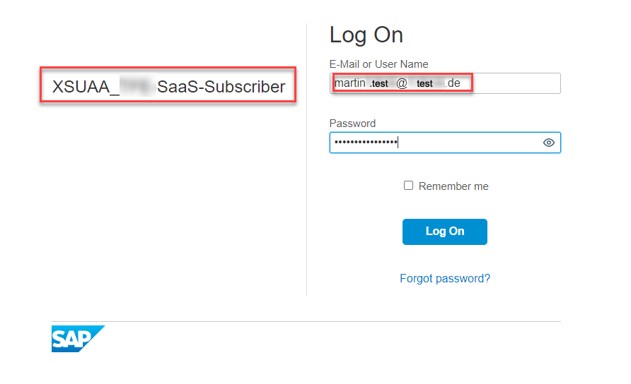](./images/IAS_LoginSubscr.png?raw=true)

> **Hint** - You will not see the name of the SaaS application registration in the authentication screen but the name of the application registration created by the XSUAA - SAP IAS trust setup. This relates to the [Architecture Setup](../2-central-user-management-ias/README.md#5-understand-the-registration-and-login-flow) described in chapter *Central user management using SAP Identity Authentication Service*. This screen can also be customized in SAP Identity Authentication Service ([click here](https://help.sap.com/docs/IDENTITY_AUTHENTICATION/6d6d63354d1242d185ab4830fc04feb1/32f8d337f0894d269f5f89956803efac.html?locale=en-US)).


6.8. As a **Provider administrator** you will see the new user in your XSUAA user management using the SAP BTP Cockpit. In the following screenshot, you can see that the Provider administrator (using the Default Platform Identity Provider -> SAP ID Service) has set up the new user (now assigned to the Custom Identity Provider -> SAP Identity Authentication). 

[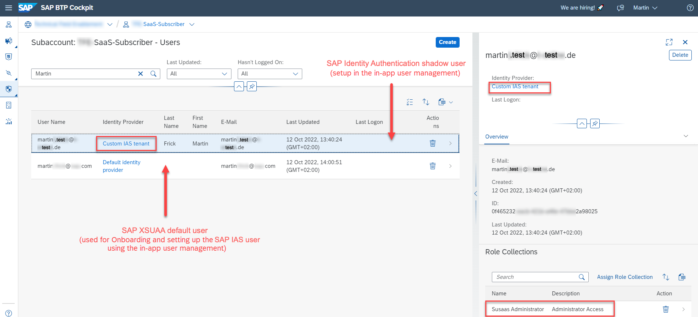](./images/IAS_XSUAAUsers.png?raw=true)

6.9. As an Administrator, log in to SAP Identity Authentication Service - Administration Console and you can see the new user in the User Management section of SAP IAS. Switching to the **Applications** tab you will notice that the user has been **registered** by the *Sustainable SaaS* application but authenticates using the consumer-specific *XSUAA_<Subaccount-Name>* application.

[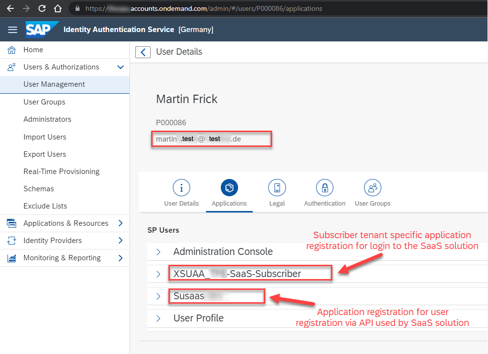](./images/IAS_UserDetails.png?raw=true)


6.10. To skip the Identity Provider selection screen using SAP IAS as default Identity Provider, please disable the login using SAP ID Service in the **Trust Configuration** settings of the respective Tenant Subaccount. 

> **Important** - Please keep in mind, changing this setting that your initial user (mapped to SAP Identity Service) cannot log in to the Tenant subscription instance anymore.

[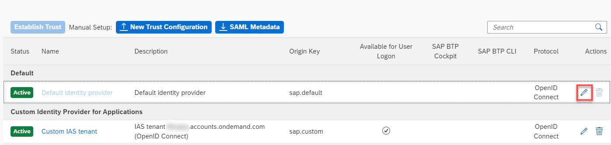](./images/IAS_DisableLogon01.png?raw=true)
[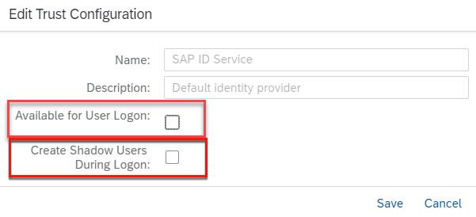](./images/IAS_DisableLogon02.png?raw=true)


## 7. Why that complicated?!

Yes, we have to admit, the setup is a bit complicated and not easy to understand at first glance. Still, it offers certain advantages that we want to highlight here. 

7.1. Why not use the existing XSUAA - SAP IAS trust application registration for the SAP IAS API access?
    
  - While technically this is a possible option, it is currently not automatable and has some further drawbacks outlined below! As described, in our setup we're using the X.509 certificate of the Cloud Identity service binding (application plan) to access SAP IAS APIs from the SaaS backend application. Setting up the trust between XSUAA and SAP IAS **does not** result in a bindable service instance. Therefore, the certificate or client credentials need to be manually created and rotated in SAP IAS and stored on the SAP BTP side. Not ideal! 

7.2. Why is a separate application registration used for each SaaS application to register users in SAP IAS?
  - Besides the automation goodie described above, this approach has also other good reasons. First of all, it allows you to customize e-mail templates and forms of each SaaS application that a SaaS Provider is offering. Furthermore, this setup supports scenarios in which a user is supposed to use multiple SaaS apps in a Consumer Subaccount. What does that mean?

    Let's assume that only one single application registration (e.g. the one of the XSUAA - SAP IAS trust) is used to register and unregister the users of multiple SaaS applications. If you unregister a user from that application registration, it will be instantly removed from the SAP IAS user store. This happens because SAP IAS removes a user from the user store, once he's unregistered from the last application registration. Result - The user cannot log in any more!
    
    Having multiple application registrations for each SaaS application and assigning a user separately to each of them, will mitigate this issue. The user will still be able to authenticate to the remaining SaaS apps as long as he's not removed from all application registrations. 

7.3. Isn't there a way to manage SAP IAS users using an SAP IAS administration API endpoint?
  - Sure, there is a way to do that. SAP IAS provides an API endpoint that allows you to create new users in the user store instead of registering them on behalf of an application registration. Nevertheless, to use that API endpoint an additional manual step requires you to create a technical user in SAP IAS and to store and rotate its credentials on the SAP BTP side. Furthermore, you will miss the nice feature of registering users to an application, which will trigger an e-mail to the new user that you can customize. 

7.4. Does that mean we can also customize the login behavior (screens or flows like social login) for each SaaS application?
  - No, this is currently not possible as these application registrations (unique per application and not per consumer) are only used for (un-)registering users in SAP IAS but not for authentication. As of today, if a user wants to authenticate to a SaaS application protected by XSUAA, he has to authenticate using application registration created by the XSUAA - SAP IAS trust. As explained, this means one SAP IAS application registration is used for the authentication of **all applications** in a Consumer Subaccount. While this is a minor downside as e.g. certain SaaS applications might have stricter authentication requirements than others, it still allows you to at least define different authentication flows per Consumer Subaccount. 

7.5. Will this setup be simplified/enhanced in the future? 
  - Probably yes - but there is no concrete timeline yet. Once there is an end-to-end integration (incl. role management) between SAP IAS and frameworks like CAP (currently XSUAA-based), a dedicated application registration for each SaaS application might be a viable option for future authentication and user management. This will allow users to directly authenticate against the same application registration which is also used for managing the users in SAP IAS. 


## 8. Possible enhancement scenarios

This setup is only one sample of how to approach a central user store using SAP Identity Authentication Service. Still, there are further options to enhance or modify this scenario depending on your own requirements. Let's check out some of them. 

8.1. Provide a separate SAP IAS tenant to each and every Consumer. In case one of your consumers wants to have the ownership and management capabilities of its user base, you can provide access to a separate SAP IAS tenant. In this case, you need to ensure, that you set up the trust between the Consumer Subaccount and the dedicated Consumer SAP IAS instance. 

In-app user management will not work out of the box in this case, as the SaaS backend application (running in the Provider Subaccount) will not be able to create an application registration within the Consumer SAP IAS tenant. In that case, you need to modify the implementation to support the following scenarios:

  * Manually create an application registration for user management in the SAP IAS Consumer tenant and store the respective credentials on the Consumer Subaccount side (e.g., in a Destination or Credential Store instance). Use the credentials in the SaaS application to allow in-app user management again. 
  * Make use of group assignments in the dedicated SAP IAS Consumer tenant. Applying the corresponding XSUAA group mapping in the Consumer Subaccount will make the role assignment work again. Also, this approach requires changes in the coding, as you will need to implement additional API calls to SAP IAS for the respective group assignment. In the case of a dedicated SAP IAS tenant, you can enable the automatic creation of shadow users, skipping the manual user creation on the XSUAA side.

8.2. Allow consumers to bring their own Identity Providers. For large SaaS consumers, this might be a preferred option, as they don't need to manage users manually in the SaaS application but access will be granted based on group memberships. 

  * In-app user management will either not be required or needs to be modified in this case. If required, the SaaS application needs to be enhanced in a way that supports the consumer's IdP APIs for user creation and/or group assignment. While this is not necessarily impossible, it cannot be covered by this sample application. The integration of a custom Identity Provider can either happen on the XSUAA level, which lets you skip SAP IAS, or within SAP IAS. SAP IAS will act as a proxy and forward the authentication to the consumer's IdP (find more details in the **Expert Features**).

8.3. Use SAP IAS as a central user store and switch to an authentication approach based on user group mappings. This will allow you to skip the assignment of role collections to shadow users on the XSUAA side but will cause more management effort on the SAP IAS side. 

  * Using dedicated user groups in SAP IAS like "Admin_ConsumerABC" and "Admin_ConsumerXYZ", you can set up a corresponding group mapping in the respective subaccounts of consumers ABC and XYZ. Instead of manually assigning role collections to your XSUAA shadow users, the only thing that needs to be done now is to map the role collections of the SaaS application to the consumer-specific user groups. Certain changes in the code will be required to automate the creation of consumer-specific user groups in SAP IAS and connect your in-app user management with the group assignment logic of SAP IAS. In this scenario, you need to ensure, that users in SAP IAS are assigned to the correct user group.
  

## 9. Further information

Please use the following links to find further information on the topics above:

* [SAP Help - SAP Cloud Identity Services](https://help.sap.com/docs/SAP_CLOUD_IDENTITY?locale=en-US)
* [SAP Community - SAP Cloud Identity Services - Identity Authentication](https://community.sap.com/topics/cloud-identity-services/identity-authentication)
* [SAP Help - SAP Cloud Identity Services - Identity Authentication](https://help.sap.com/docs/IDENTITY_AUTHENTICATION?locale=en-US)
* [SAP Help - Trust and Federation with Identity Providers](https://help.sap.com/docs/BTP/65de2977205c403bbc107264b8eccf4b/cb1bc8f1bd5c482e891063960d7acd78.html)
* [SAP Help - Establish Trust and Federation Between UAA and Identity Authentication](https://help.sap.com/docs/BTP/65de2977205c403bbc107264b8eccf4b/161f8f0cfac64c4fa2d973bc5f08a894.html?locale=en-US)
* [SAP Help - Switch Off Automatic Creation of Shadow Users](https://help.sap.com/docs/BTP/65de2977205c403bbc107264b8eccf4b/d8525671e8b14147b96ef497e1e1af80.html)
* [SAP Help - Configure Trusted Domains](https://help.sap.com/docs/IDENTITY_AUTHENTICATION/6d6d63354d1242d185ab4830fc04feb1/08fa1fe816704d99a6bcab245158ebca.html?locale=en-US)
