# Push data from SAP S/4HANA system

- ### **Kyma** ✅
- ### **Cloud Foundry** ✅

A feature that will make your SaaS application even more valuable to your SaaS consumers, is an integration with other SAP solutions. This will allow your consumers to make use of their own data within your SaaS service offering and gain real business value out of it. For sure a SaaS solution can always offer an Excel upload or an online interface for maintaining tenant-specific data, but an automated backend integration is more than just a nice to have especially when dealing with constantly changing data sets. 

In this part of the tutorial, you will learn how your SaaS consumers can connect an ABAP-based backend like SAP S/4HANA with their Consumer Tenant SaaS instance and push data into their Tenant database container in an automated fashion. 

- [Push data from SAP S/4HANA system](#push-data-from-sap-s4hana-system)
  - [1. Architecture](#1-architecture)
  - [2. Prerequisites](#2-prerequisites)
  - [3. Certificate setup](#3-certificate-setup)
  - [4. Development package](#4-development-package)
  - [5. OAuth Client Profile](#5-oauth-client-profile)
  - [6. OAuth Client](#6-oauth-client)
  - [7. Destination configuration](#7-destination-configuration)
  - [8. ABAP Coding Environment](#8-abap-coding-environment)
    - [8.1. Structures](#81-structures)
    - [8.2. ABAP Objects Class](#82-abap-objects-class)
    - [8.3. ABAP Programs](#83-abap-programs)
  - [9. Program test](#9-program-test)
  - [10. Background Job](#10-background-job)
  - [11. Further Information](#11-further-information)

> **Important** - The CAP payload size limitation for this sample has been increased to 50 MB. Please check the *server.js* file ([click here](../../../code/api/srv/server.js)) to remove or modify this setting if required. Keep in mind that when using SAP API Management, different file size limits apply and you will need to using streaming features to upload larger files. 

## 1. Architecture

While you already learned about the SaaS API in the Basic Version, the API calls in this part of the tutorial will not be triggered by a random external source anymore but will be directly sent from an SAP S/4HANA system. Using a scheduled job on the data provider side, the Tenants can constantly provide their users with the latest data input. 

See the relevant part of the solution architecture below:

[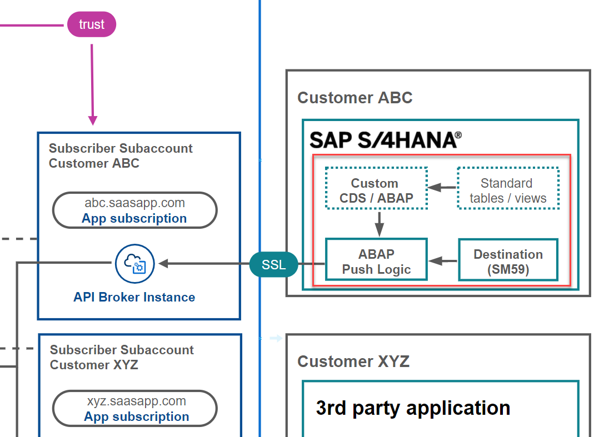](./images/S4_Architecture.png?raw=true)

## 2. Prerequisites

You will need a NetWeaver system that contains the Enterprise Procurement Model (EPM). The EPM model should be available in the NetWeaver stacks (EHP 2, > 7.3) and in ABAP Platforms (> 1809).

> **Hint** - EPM is a sample data model containing sales and purchase orders for various products, which can be generated using a dedicated ABAP transaction. Please check if you can access the transaction **SEPM_DG** in your system, which is the respective Data Generator for the EPM model. Furthermore, please ensure the development package **RS_TCO_EPM** is available in the system as views from this package will be used by the sample code

- You will need advanced authorizations in your system to e.g.,
    - configure and HTTP destination in **SM59**.
    - configure OAuth 2.0 clients in **OA2C_CONFIG**.
    - develop in **SE80** or the ABAP Development tools.
    - maintain required SSL certificates in **STRUST**.

- Your system needs to allow outbound HTTP connections to SAP BTP.

Feel free to generate some first sample data values in your EPM model using the **SEPM_DG** transaction.

## 3. Certificate setup 

To make sure your push setup is working properly, you might need to import additional SSL certificates to your ABAP backend. Depending on whether you're using a custom domain or a default SAP Kyma Subdomain for your API, please import the respective certificates to the **SSL client SSL Client (Anonymous)**  and **SSL client SSL Client (Standard)** PSE using the **STRUST** transaction. 

**Kyma**

[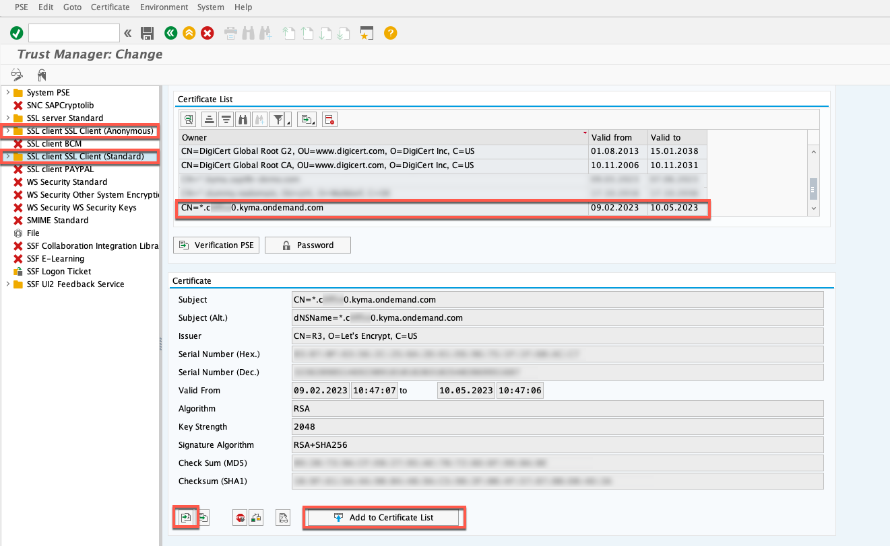](./images/S4_Certificates.png?raw=true)

**Cloud Foundry**

[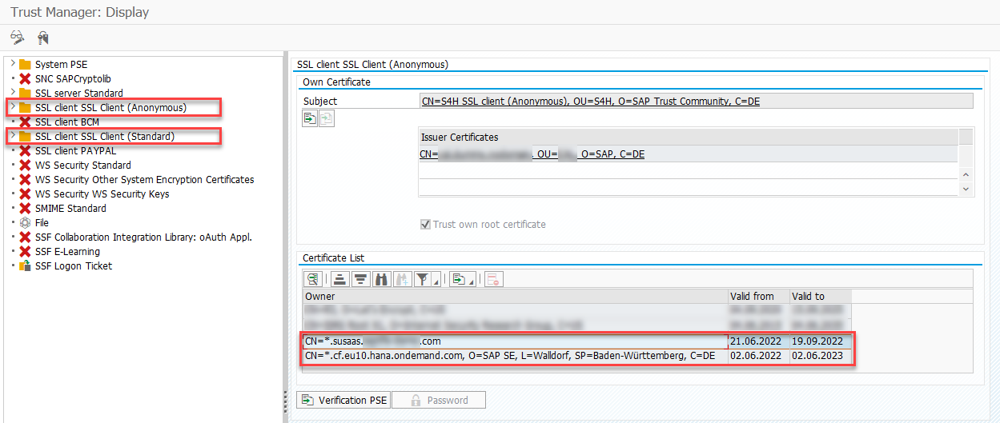](./images/S4_CertificatesCf.png?raw=true)

Especially in scenarios using a custom domain (e.g., with a CSR signed by Let's Encrypt) you might need to import additional certificates incl. missing Root certificates. This ensures secure and encrypted communication between your backend system and your API on SAP BTP. Check the detailed explanation in SAP Help ([click here](https://help.sap.com/docs/SAP_NETWEAVER_AS_ABAP_752/916a7da9481e4265809f28010a113a6a/a5a3ae031c3042f293e72bf6c5c90620.html?locale=en-US))

You as a SaaS provider, but also your consumers can download their respective certificate right from within the browser (like Chrome) as you can see in the following screenshots:

[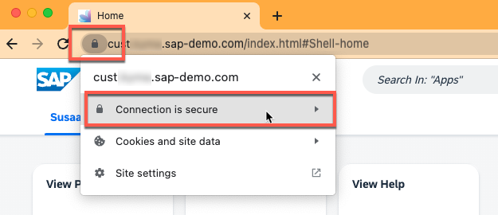](./images/CERT_01.png?raw=true)
[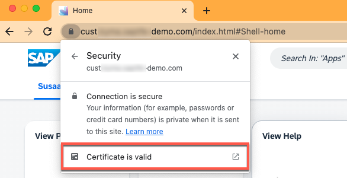](./images/CERT_02.png?raw=true)

[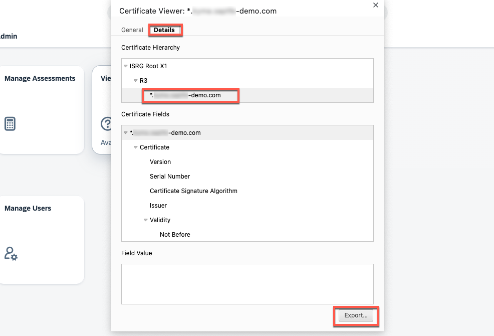](./images/CERT_03.png?raw=true)
[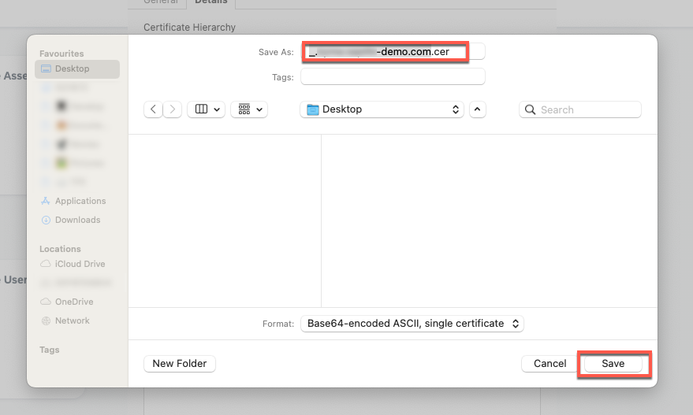](./images/CERT_04.png?raw=true)

Please use the trace files (Goto -> Trace File) in transaction **SMICM** to analyze certificate-related errors! 

## 4. Development package

Create a new development package in ABAP Development Tools for Eclipse or using ABAP Development workbench (SE80). Give it a name like **ZSUSAAS** or another name of your choice.  

## 5. OAuth Client Profile

5.1. Create an OAuth Client Profile in your ABAP development package named **ZSUSAAS_PUSH_API** (click to enlarge). 

[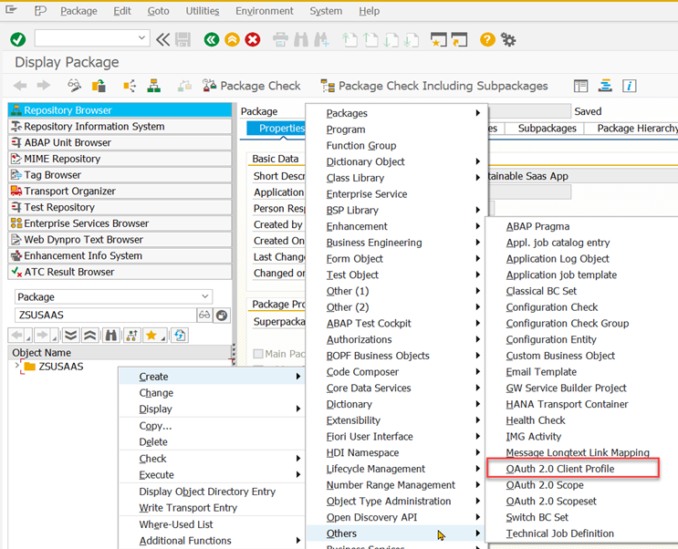](./images/S4_ClntProf01.png?raw=true)

Select **DEFAULT** as the type. This Client Profile is required when setting up your OAuth Client in the next step. 

[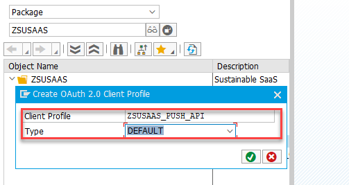](./images/S4_ClntProf02.png?raw=true)

5.2. In the **Scopes** section please add the **uaa.resource** scope. 

[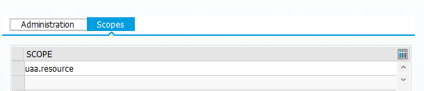](./images/S4_ClntProfScope.png?raw=true)

## 6. OAuth Client

6.1. Create a new OAuth Client in the web-based transaction **OA2C_CONFIG**. The default path for the respective transaction is `https://<host_name>:<https_port>/sap/bc/webdynpro/sap/oa2c_config?sap-client=<client e.g. 100>`. Log in with a user authorized to create new OAuth Clients and click on **Create ...**.

[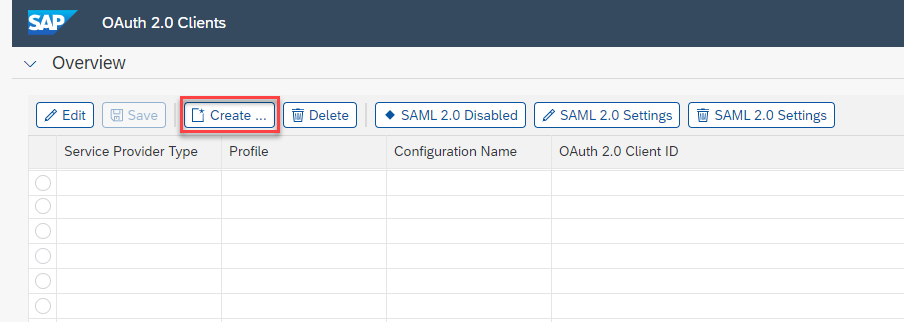](./images/S4_OAuth01.png?raw=true)

6.2. Enter the following values and choose **OK**. 

- OAuth 2.0 Client Profile: `ZSUSAAS_PUSH_API` or the name of the OAuth Client profile defined in the previous step
- Configuration Name: `SUSAAS_PUSH_API_S4` or another name of your choice
- OAuth 2.0 Client ID: Enter the **clientid** of the service binding created for the API service instance ([click here](../../2-basic/5-subscribe-consumer-subaccount/README.md#2-api-service-broker-instance))

  **Kyma**

  [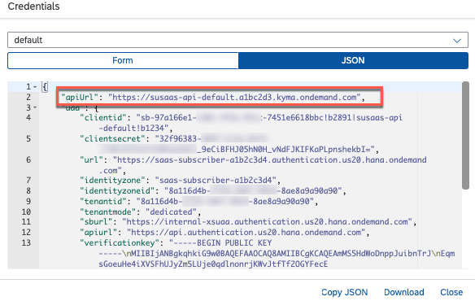](./images/S4_OAuth02.png?raw=true)

  **Cloud Foundry**

  [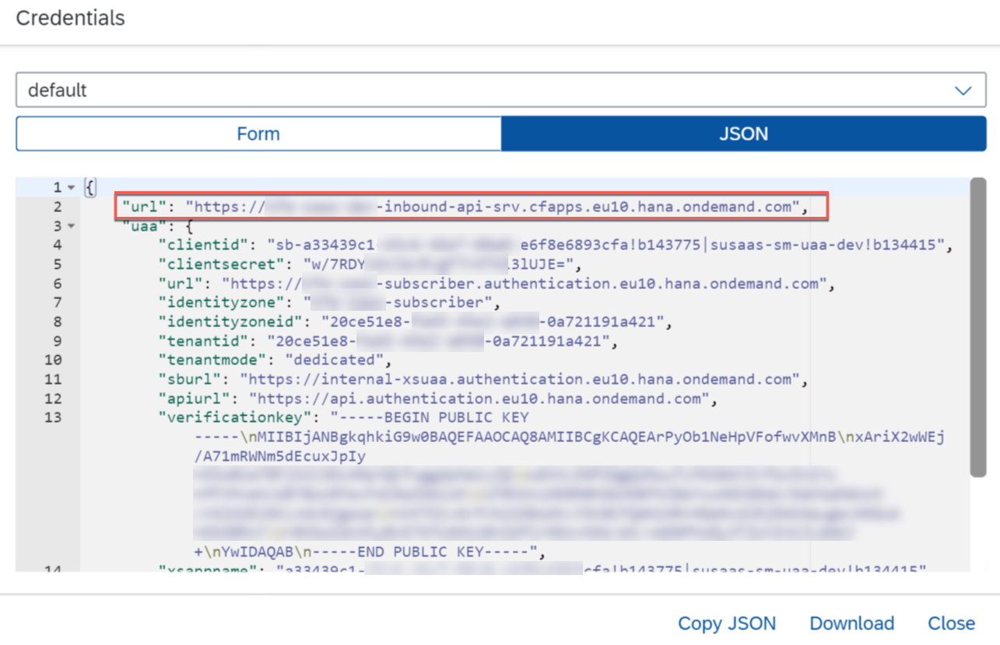](./images/S4_OAuth02Cf.png?raw=true)

6.3. On the Administration tab enter the client secret of the service key.

6.4. Under Authorization Server Settings, enter the URL for the **authorization** endpoint.
> Take the **uaa.url** parameter of your service key, remove the https:// prefix and add **/oauth/authorize**

6.5. Under Authorization Server Settings, enter the URL for the **token** endpoint.
> Take the **uaa.url** parameter of your service key, remove the https:// prefix and add **/oauth/token**

6.6. Under Access Settings, select the following settings and afterward, click on **Save** at the very top of the screen. 

- Client Authentication: Basic
- Resource Access Authentication: Header Field
- Selected Grant Type: Client Credentials

> **Important** - Note that the proxy settings must be configured beforehand.

6.7. Your configuration should look similar to the following (click to enlarge).

[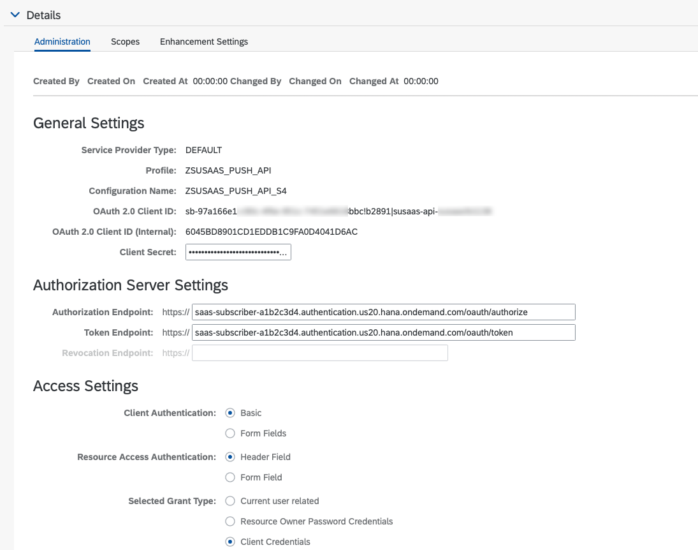](./images/S4_OAuth03.png?raw=true)

## 7. Destination configuration

The ABAP logic pushing the EPM sample data to the SaaS API will make use of a destination defined in your NetWeaver system. Check the steps below to learn how to set up such a destination. 

7.1. Open transaction **SM59** and choose **Create**.

7.2. Enter a name like **SUSAAS_PUSH_API** for the RFC destination.

7.3. Select connection type G (HTTP Connection to External Server).

7.4. On the Technical Settings tab, enter the following data:
    - Target Host: apiUrl (not uaa.url!) parameter of your service key (**without https:// prefix!**)
    - Port: 443

  **Kyma**

  [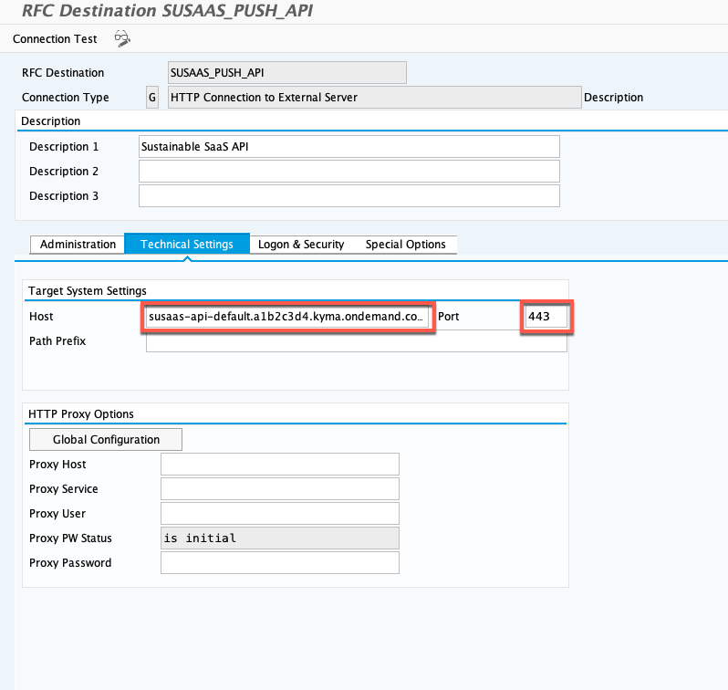](./images/S4_Dest01.png?raw=true)

  **Cloud Foundry**

  [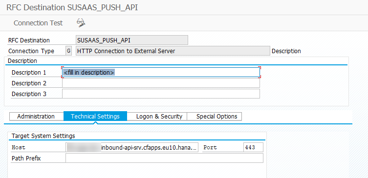](./images/S4_Dest01Cf.png?raw=true)

7.5. On the Logon & Security tab provide the following settings:
    
  - Check **Do not use a user**
  - Set SSL to **Active**
  - Check **Do not use certificate for logon**

  [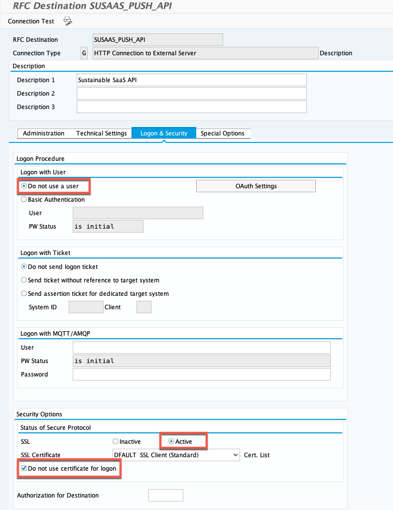](./images/S4_Dest02.png?raw=true)

7.6. Select **OAuth Settings** and provide the profile and configuration as follows:

  > **Important** - Setting the OAuth Settings within **SM59** requires an SAP S/4HANA system of release 2021 or higher. For earlier releases, please check for blogs and tutorials explaining how to setup the OAuth2 flow as part of your ABAP coding. Search the community for **Configuring OAuth 2.0 and Creating an ABAP Program That Uses OAuth 2.0 Client API** to get an idea how to setup things in your system if required.
  
  - Profile : ZSUSAAS_PUSH_API or the profile name you specified
  - Configuration: SUSAAS_PUSH_API_S4 or the configuration you specified

  [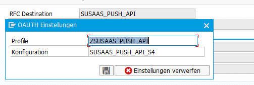](./images/S4_Dest03.png?raw=true)

7.7. Save your entries and click on **Connection Test** in the top left.

7.8. Make sure the test is successful and a code **200** is returned.

  [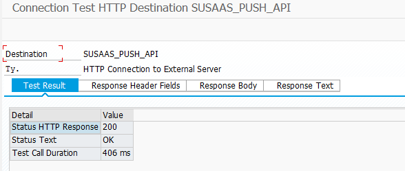](./images/S4_Dest04.png?raw=true)

Your destination is now ready to be used from within the ABAP coding. 

## 8. ABAP Coding Environment

Let's now put the puzzle pieces together and push some data using the SaaS API and the connection defined in SM59. The following ABAP development objects can either be created in [SAP GUI](https://launchpad.support.sap.com/#/softwarecenter/search/SAP%2520GUI) or by using the [ABAP Development Tools](https://tools.hana.ondemand.com/#abap). 

### 8.1. Structures

Please go to your ABAP Development Tools in eclipse or use SE80 transaction in your SAP GUI to create two structures required for the upload process.

> **Important** - Please double-check if the structure field names and types match with the corresponding target views **EPM_V_PROD** and **EPM_V_SALES_DATA**. We cannot guarantee consistency across all releases. 

[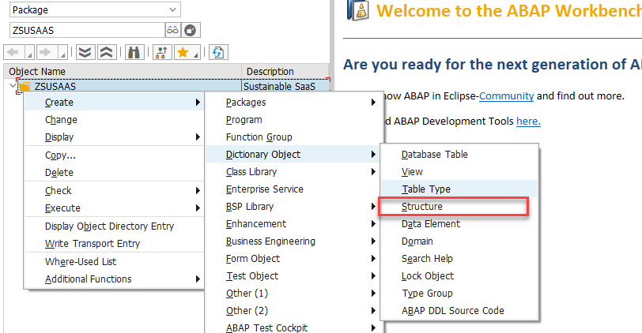](./images/S4_Dev01.png?raw=true)

**Structure ZSUSAAS_S_PRODUCTS_UPL** 
Description - Susaas Products Upload Structure

 [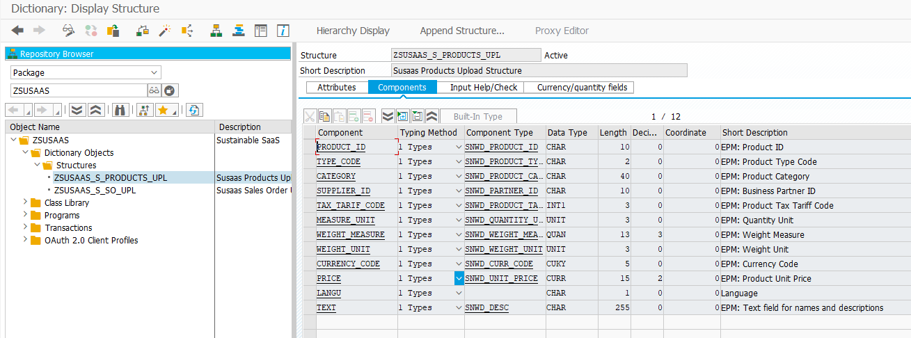](./images/S4_Dev02.png?raw=true)

| Component | Typing Method | Component Type | Data Type | Length | Decimals | Coordinate | Short Description | 
|:----|:----|:----|:----|:----|:----|:----|:----|
|PRODUCT_ID | 1 Types | SNWD_PRODUCT_ID | CHAR | 10 | 0 | 0 | EPM: Product ID | 
|TYPE_CODE | 1 Types | SNWD_PRODUCT_TYPE_CODE | CHAR | 2 | 0 | 0 | EPM: Product Type Code | 
|CATEGORY | 1 Types | SNWD_PRODUCT_CATEGORY | CHAR | 40 | 0 | 0 | EPM: Product Category | 
|SUPPLIER_ID | 1 Types | SNWD_PARTNER_ID | CHAR | 10 | 0 | 0 | EPM: Business Partner ID | 
|TAX_TARIF_CODE | 1 Types | SNWD_PRODUCT_TAX_TARIF_CODE | INT1 | 3 | 0 | 0 | EPM: Product Tax Tariff Code | 
|MEASURE_UNIT | 1 Types | SNWD_QUANTITY_UNIT | UNIT | 3 | 0 | 0 | EPM: Quantity Unit | 
|WEIGHT_MEASURE | 1 Types | SNWD_WEIGHT_MEASURE | QUAN | 13 | 3 | 0 | EPM: Weight Measure | 
|WEIGHT_UNIT | 1 Types | SNWD_WEIGHT_UNIT | UNIT | 3 | 0 | 0 | EPM: Weight Unit | 
|CURRENCY_CODE | 1 Types | SNWD_CURR_CODE | CUKY | 5 | 0 | 0 | EPM: Currency Code | 
|PRICE | 1 Types | SNWD_UNIT_PRICE | CURR | 15 | 2 | 0 | EPM: Product Unit Price | 
|LANGU | 1 Types | (use Built-In Type) | CHAR | 1 | 0 | 0 | Language | 
|TEXT | 1 Types | SNWD_DESC | CHAR | 255 | 0 | 0 | EPM: Text field for names and descriptions | 

Please also map the required Currency/quantity fields mapping as shown below.

[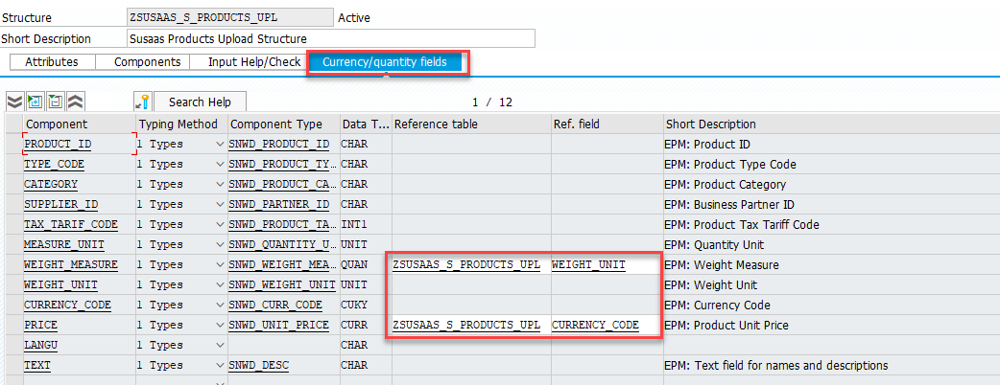](./images/S4_StrCurQan01.png?raw=true)

**Structure ZSUSAAS_S_SO_UPL** 
Description - Susaas Sales Order Upload Structure

| Component | Typing Method | Component Type | Data Type | Length | Decimals | Coordinate | Short Description | 
|:----|:----|:----|:----|:----|:----|:----|:----|
|SO_ID | 1 Types | SNWD_SO_ID | CHAR | 10 | 0 | 0 | EPM: Sales Order Number|
|LIFECYCLE_STATUS | 1 Types | SNWD_SO_LC_STATUS_CODE | CHAR | 1 | 0 | 0 | EPM: Sales Order Lifecycle Status|
|BILLING_STATUS | 1 Types | SNWD_SO_CF_STATUS_CODE | CHAR | 1 | 0 | 0 | EPM: Sales Order Confirmation Status|
|DELIVERY_STATUS | 1 Types | SNWD_SO_OR_STATUS_CODE | CHAR | 1 | 0 | 0 | EPM: Sales Order Ordering Status|
|SO_ITEM_POS | 1 Types | SNWD_SO_ITEM_POS | CHAR | 10 | 0 | 0 | EPM: Sales Order Item Position|
|CURRENCY_CODE | 1 Types | SNWD_CURR_CODE | CUKY | 5 | 0 | 0 | EPM: Currency Code|
|GROSS_AMOUNT | 1 Types | SNWD_TTL_GROSS_AMOUNT | CURR | 15 | 2 | 0 | EPM: Total Gross Amount|
|TAX_AMOUNT | 1 Types | SNWD_TTL_TAX_AMOUNT | CURR | 15 | 2 | 0 | EPM: Total Tax Amount|
|NET_AMOUNT | 1 Types | SNWD_TTL_NET_AMOUNT | CURR | 15 | 2 | 0 | EPM: Total Net Amount|
|QUANTITY | 1 Types | SNWD_QUANTITY | QUAN | 13 | 3 | 0 | EPM: Quantity|
|QUANTITY_UNIT | 1 Types | SNWD_QUANTITY_UNIT | UNIT | 3 | 0 | 0 | EPM: Quantity Unit|
|DELIVERY_DATE | 1 Types | TIMESTAMPL | DEC | 21 | 7 | 0 | UTC Time Stamp in Long Form (YYYYMMDDhhmmssmmmuuun)|
|PRODUCT_ID | 1 Types | SNWD_PRODUCT_ID | CHAR | 10 | 0 | 0 | EPM: Product ID|
|CATEGORY | 1 Types | SNWD_PRODUCT_CATEGORY | CHAR | 40 | 0 | 0 | EPM: Product Category|
|BP_ROLE | 1 Types | SNWD_BUSINESS_PARTNER_ROLE | CHAR | 3 | 0 | 0 | EPM: Business Partner Role|
|BP_ID | 1 Types | SNWD_PARTNER_ID | CHAR | 10 | 0 | 0 | EPM: Business Partner ID|
|COMPANY_NAME | 1 Types | SNWD_COMPANY_NAME | CHAR | 80 | 0 | 0 | EPM: Company Name|
|TEXT | 1 Types | SNWD_DESC | CHAR | 255 | 0 | 0 | EPM: Text field for names and descriptions|
|ITEM_ATP_STATUS | 1 Types | SNWD_SO_ITEM_ATP_STATUS_CODE | CHAR | 1 | 0 | 0 | EPM: Sales Order Item ATP Status|
|COUNTRY | 1 Types | SNWD_COUNTRY | CHAR | 3 | 0 | 0 | EPM: Country Code|
|FIRST_NAME | 1 Types | SNWD_FIRST_NAME | CHAR | 40 | 0 | 0 | EPM: First Name|
|LAST_NAME | 1 Types | SNWD_LAST_NAME | CHAR | 40 | 0 | 0 | EPM: Last Name|
|OVERALL_STATUS | 1 Types | SNWD_SO_OA_STATUS_CODE | CHAR | 1 | 0 | 0 | EPM: Sales Order Overall Status|
|LANGUAGE | 1 Types | (use Built-In Type) | CHAR | 1 | 0 | 0 | Language |

Please also map the required Currency/quantity fields mapping as shown below.

[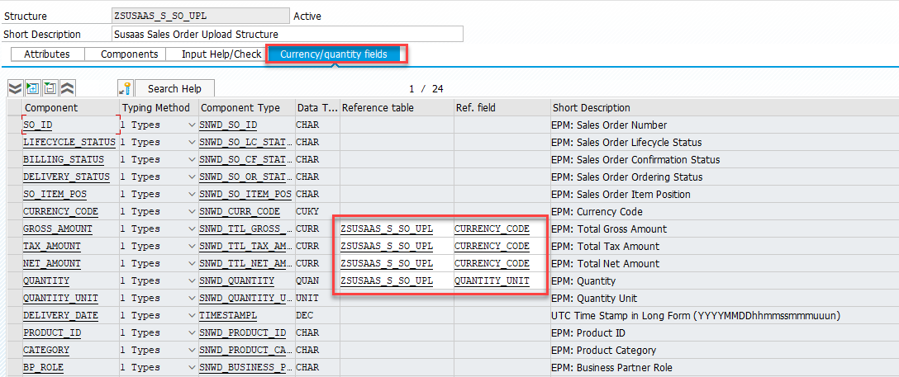](./images/S4_StrCurQan02.png?raw=true)

### 8.2. ABAP Objects Class

Create a new ABAP Objects class in your ZSUAAS development package. You can find the required code snippet in the **code** sub-directory ([click here](./code/)). 

> **Hint** - This helper class is used in your sample programs to support the relevant upload process. It is a generic implementation that can be used to send data to different API endpoints using the same coding for various entities like in our case - Products and Sales Orders. 

**Class ZSUSAAS_CL_UPLOAD**  
([click here](./code/ZSUSAAS_CL_UPLOAD.CLAS) for the code)

[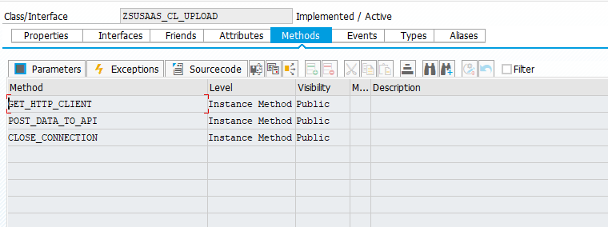](./images/S4_Dev03.png?raw=true)

The class provides a method **GET_HTTP_CLIENT** used to create an instance of the default ABAP HTTP Client feature, which allows you to send HTTP requests to the SaaS API using the connection defined in SM59. The **POST_DATA_TO_API** method is responsible for sending the dataset to the respective API endpoints using the HTTP client instance. The method implementation in this sample is very lean and can be enhanced based on your requirements to introduce features like packaging larger-scale datasets or proper error handling in case of erroneous requests. The **CLOSE_CONNECTION** method ensures that the API connection is closed again after sending the data to your SaaS APIs. 

Feel free to scroll through the implementation to get a better understanding of what is happening under the hood when calling the method implementations from the programs which you import in the next steps. 

### 8.3. ABAP Programs

In this sample application, we will use ABAP programs to upload the **Product** and **Sales Order** datasets available in the Enterprise Procurement Model. As mentioned at the beginning of this tutorial, feel free to generate new Sales Orders using the data generator transaction before doing your first data push. 

For the data push implementation, please create two programs in your ZSUSAAS development package. You can find the respective sample coding in the **code** sub-directory. 

**Program ZSUSAAS_R_UPLOAD_PRODUCTS**  
([click here](./code/ZSUSAAS_R_UPLOAD_PRODUCTS.PROG) for the code)

 

**Program ZSUSAAS_R_UPLOAD_SO**  
([click here](./code/ZSUSAAS_R_UPLOAD_SO.PROG) for the code)

 [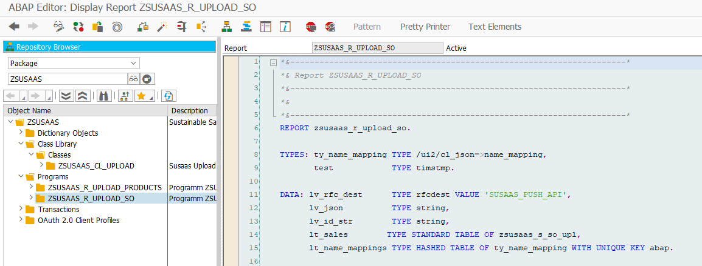](./images/S4_Dev05.png?raw=true)

Feel free to scroll through the implementation to get a better understanding which EPM views are read, how the data is converted into the required JSON payload, and finally send to the SaaS API. The code is not very complex but please be aware, this is a very simple scenario, which is not supposed to handle scenarios like mass uploads or proper error handling (e.g. in case of duplicate key issues or connection problems). 

Of special importance are the following lines of the coding. This is where the name of your SM59 destination is defined and the relevant endpoint for the respective dataset is declared. Please modify your code accordingly if you didn't follow the names proposed in this tutorial. 

[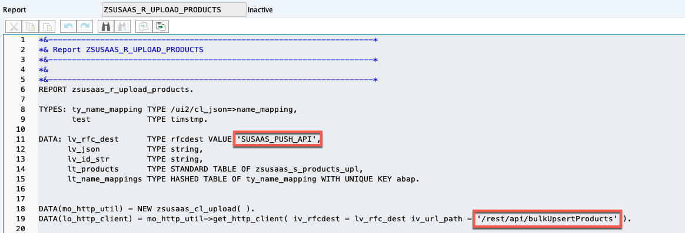](./images/S4_Dev06.png?raw=true)

## 9. Program test

To test the SaaS Push API end-to-end, you can just simply execute the programs which you created in the previous step. 

 [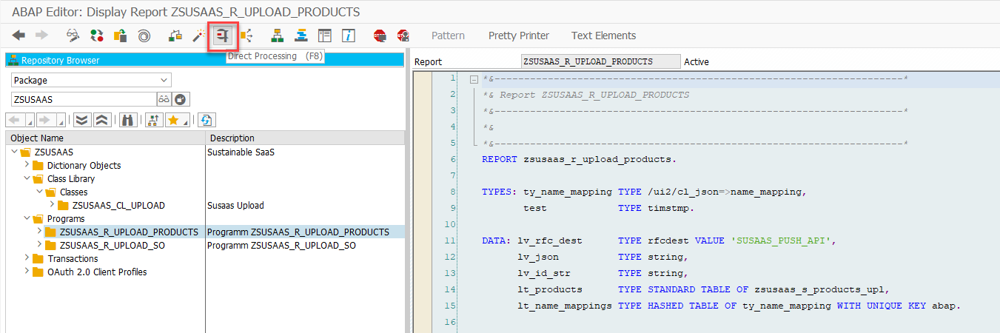](./images/S4_Dev07.png?raw=true)

If you're not facing any error messages, your upload was probably successful. To check whether the data was successfully uploaded to the Tenant database container, you can log in to the respective Tenant of your SaaS application and check the available products (when creating a new assessment) or refer to the logs of the API service application instance in the Provider Subaccount.

## 10. Background Job

To automate the push process of the latest EPM data, you can use the programs which you just created within a background job. To create a new background job, please go to transaction **SM36** and follow the steps below for both programs defined above and your personal scheduling requirements (hourly, daily, weekly, ...).

10.1. Define a name for your background job like **ZSUSAAS_UPLOAD_PRODUCTS**. Set the priority to C and select the target application server. 

[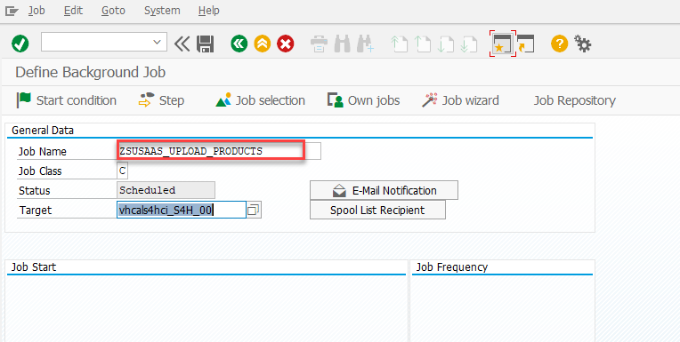](./images/S4_Job01.png?raw=true)

10.2. By hitting **Enter**, you can define the first **Step** of your job. Select **ABAP program** and enter the name of your program like **ZSUSAAS_R_UPLOAD_PRODUCTS**. After clicking on **Check**, please save the step. 

[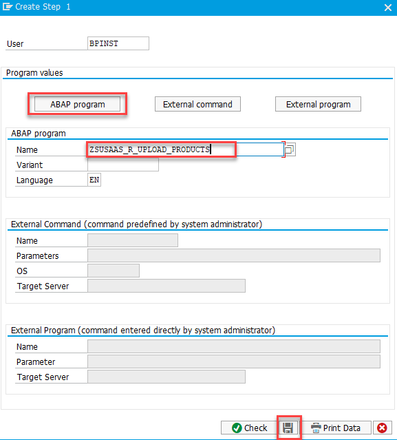](./images/S4_Job02.png?raw=true)

10.3. Go back to your job details.

[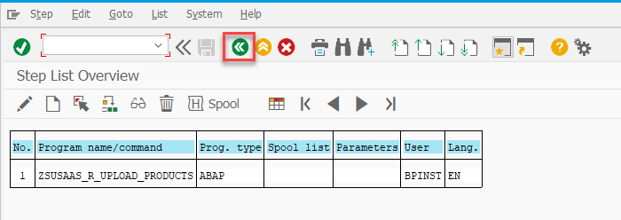](./images/S4_Job03.png?raw=true)

10.4. Next you have to define a **Start Condition** for your job, which allows you to set up the scheduling. 

[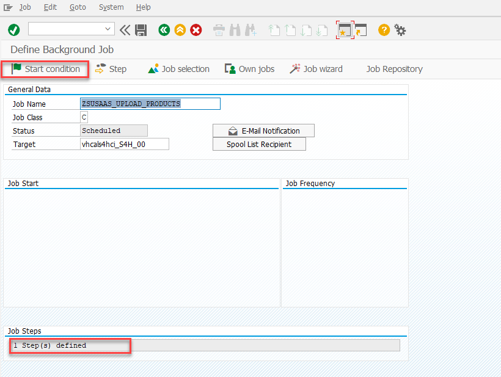](./images/S4_Job04.png?raw=true)

10.5. As condition type select **Date/Time** and enter the first start date and time of your background job. Ensure the checkbox for **Periodic Job** is checked and then select **Period Values** to set up the schedule. 

[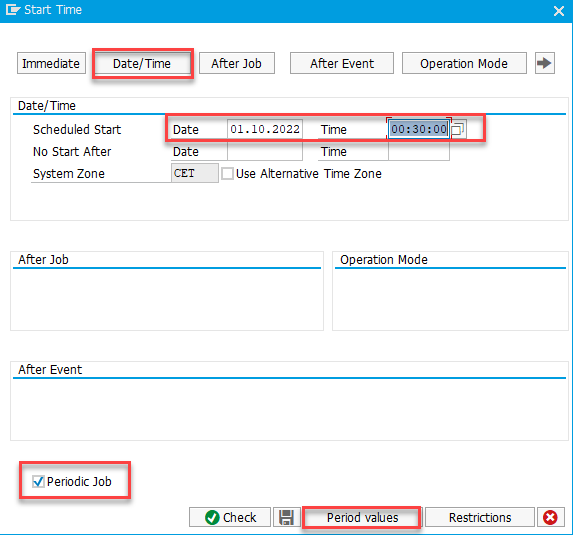](./images/S4_Job05.png?raw=true)

10.6. Decide in which repeated schedule you want to run your job. Click on **Check** and then save the settings. 

[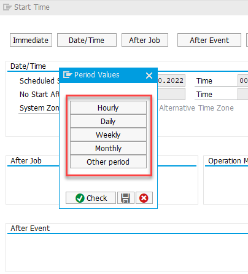](./images/S4_Job06.png?raw=true)

10.7. Review and save your start condition to return to your job details. 

[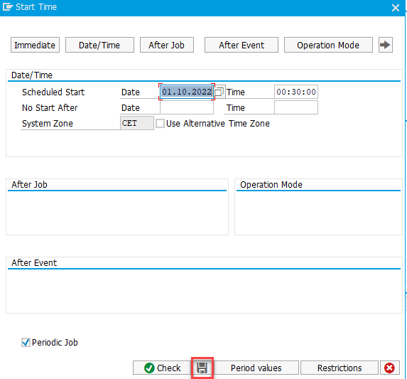](./images/S4_Job07.png?raw=true)

10.8. You should now see that your job is properly configured. 

10.9. Save the job to release and enable it.

[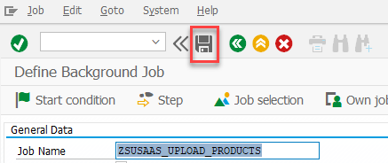](./images/S4_Job09.png?raw=true)

10.10. You should see a success message confirming your job is released. 

[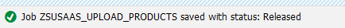](./images/S4_Job10.png?raw=true)

10.11. You can check the status of your job in the **Job Selection**. Make sure to set the correct filters, especially for the start date. 

[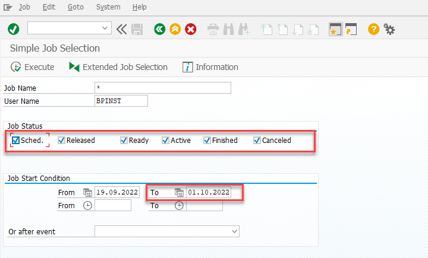](./images/S4_Job11.png?raw=true)

10.12. You will see the job in status **Released** in the Job Overview screen. 

[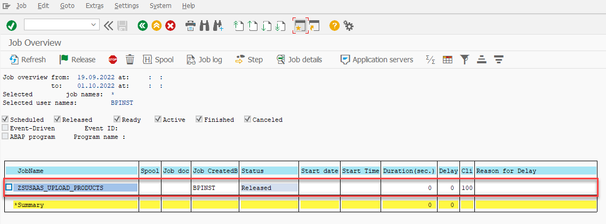](./images/S4_Job12.png?raw=true)

## 11. Further Information

Please use the following links to find further information on the topics above:

* [SAP Help - Enterprise Procurement Model](https://help.sap.com/docs/SAP_NETWEAVER_AS_ABAP_752/a602ff71a47c441bb3000504ec938fea/124a3cf203d64d3198b5bcc9570f31ac.html?locale=en-US)
* [SAP Help - Configuring OAuth 2.0 for AS ABAP](https://help.sap.com/docs/SAP_NETWEAVER_AS_ABAP_752/916a7da9481e4265809f28010a113a6a/cdb122d5b0784c77bf1bcce17f730e74.html?locale=en-US)
* [SAP Help - SSL/TLS Trust Between Service Provider and AS ABAP](https://help.sap.com/docs/SAP_NETWEAVER_AS_ABAP_752/916a7da9481e4265809f28010a113a6a/a5a3ae031c3042f293e72bf6c5c90620.html?locale=en-US)
* [SAP Help - Configuring an OAuth 2.0 Client in the AS ABAP](https://help.sap.com/docs/SAP_NETWEAVER_AS_ABAP_752/916a7da9481e4265809f28010a113a6a/2e5104fd87ff452b9acb247bd02b9f9e.html?locale=en-US)
* [SAP Help - Maintaining Remote Destinations](https://help.sap.com/docs/SAP_NETWEAVER_AS_ABAP_752/753088fc00704d0a80e7fbd6803c8adb/488965b484b84e6fe10000000a421937.html?locale=en-US)
* [SAP Help - System Security for SAP NetWeaver AS](https://help.sap.com/docs/SAP_NETWEAVER_AS_ABAP_752/280f016edb8049e998237fcbd80558e7/4c5bc0fdf85640f1e10000000a42189c.html?locale=en-US)
* [SAP Help - Transport Layer Security on SAP NetWeaver AS for ABAP](https://help.sap.com/docs/SAP_NETWEAVER_AS_ABAP_752/e73bba71770e4c0ca5fb2a3c17e8e229/5dcb88b33cad4f5da9dd77a3802e172f.html?locale=en-US)
* [SAP Help - Creating the HTTP Client](https://help.sap.com/docs/SAP_NETWEAVER_AS_ABAP_752/753088fc00704d0a80e7fbd6803c8adb/b286b4512ea4414fb36f17b0568a86ac.html?locale=en-US)
* [SAP Help - Job Scheduling Explained](https://help.sap.com/docs/SAP_NETWEAVER_AS_ABAP_752/b07e7195f03f438b8e7ed273099d74f3/4b2bbeee4c594ba2e10000000a42189c.html?locale=en-US)