# Integrate SAP API Management

- **Kyma** ❌
- **Cloud Foundry** ✅

**Important** - This part of the tutorial is required for **Cloud Foundry** deployments only!

As your SaaS application contains an API that allows the SaaS consumers to interact programmatically with their tenant database containers, you need to ensure that your API endpoints are properly managed and monitored. For this purpose, you should implement features like rate limiting to prevent e.g., DoS attacks. Furthermore, you can ensure fair usage of the resources among your consumers by e.g., setting up a quota depending on the chosen plan. A premium consumer might be eligible to send more requests per second than a standard consumer. Proper monitoring of your API will help you to analyze performance issues and to identify problems of your consumers. 

In this part of the mission, you will learn how to ensure that each and every request to your SaaS API is first going through SAP API Management, which will be the dedicated standard solution provided by SAP for all API-related requirements. 

- [Integrate SAP API Management](#integrate-sap-api-management)
  - [1. Architecture](#1-architecture)
  - [2. Prerequisites](#2-prerequisites)
  - [3. APIM as route service](#3-apim-as-route-service)
  - [4. Bind the route service](#4-bind-the-route-service)
  - [5. API Policy Deep Dive](#5-api-policy-deep-dive)
    - [5.1. Decode the JWT token](#51-decode-the-jwt-token)
    - [5.2. Spike Arrest Policy](#52-spike-arrest-policy)
    - [5.3. API Quota Policies](#53-api-quota-policies)
    - [5.5. Update API Proxy and deploy changes](#55-update-api-proxy-and-deploy-changes)
  - [6. Test the setup](#6-test-the-setup)
  - [7. Deployment Descriptor](#7-deployment-descriptor)
  - [8. Further Information](#8-further-information)


## 1. Architecture

SAP API Management is a new component in the central part of the **Advanced Version** architecture. While in the Basic Version, the API calls were directly accessing the CAP-based API service, now all requests will be passing through this additional component, giving you great flexibility in how to handle your in and outbound API traffic. 

See the relevant part of the solution architecture below (click to enlarge):

[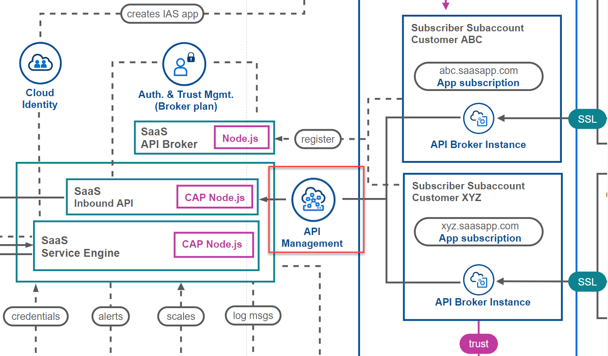](./images/API_Architecture.png?raw=true)


## 2. Prerequisites

For this setup, please make sure you have an SAP API Management instance up and running. As SAP API Management is a capability of **SAP Integration Suite**, please subscribe to SAP Integration Suite and activate the respective **API Management** feature. 

Check the following SAP Help documentations to find detailed step-by-step guide.

- [SAP Help - Setting Up API Management Capability from Integration Suite](https://help.sap.com/docs/sap-api-management/sap-api-management/setting-up-api-management-capability-from-integration-suite)
- [Tutorial Navigator - Set Up API Management from Integration Suite](https://developers.sap.com/tutorials/api-mgmt-isuite-initial-setup.html)

[](./images/API_IntegrationSuite.png?raw=true)

Please ensure the **API Management** capability of your **SAP Integration Suite** instance is successfully enabled before continuing with any of the next steps! 


## 3. APIM as route service

To connect your SaaS API with SAP API Management, you can use an SAP BTP service called "APIM-as-route-service", which is also explained in greater detail by the following blog posts [click here](https://blogs.sap.com/2020/10/10/sap-apim-route-service-plan-to-manage-cloud-foundry-apps/) and [here](https://blogs.sap.com/2020/08/10/part-3-service-plan-of-sap-api-management-in-cloud-foundry-environment/). Further information about route services can be found in the official Cloud Foundry documentation [click here](https://docs.cloudfoundry.org/services/route-services.html).

Combining this service instance with your API route allows you to enforce API policies like Spike Arrest or Quotas no matter whether the accessing client is calling the API Proxy URL or the standard route of your API. So please set up an instance of the **apim-as-a-route-service** offering as you can see in the following screenshot. 

> **Hint** - If you cannot find the respective service plan, make sure you assigned it in your subaccount entitlements! The service plan is part of the **API Management, API portal** service! 

[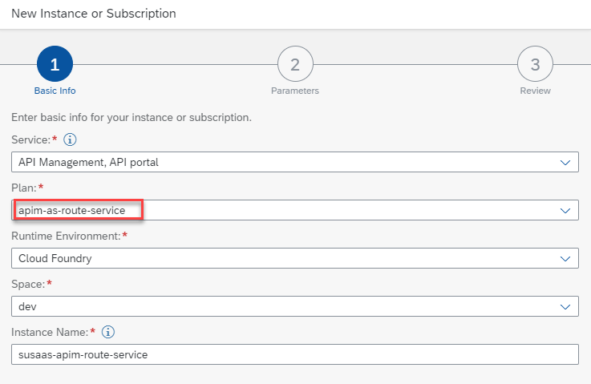](./images/API_ServiceInstance.png?raw=true)

As SAP Integration Suite is one of the most powerful but also quite expensive SaaS products, you might consider the usage for your **productive SaaS environment** only.


## 4. Bind the route service

Now you need to bind the route service to your standard SaaS API route. This can be done using the cf CLI command bind-route-service (or brs). 

**Windows (Command Line)**

>```sh
> cf brs `<API service domain>` `<route service>` --hostname `<API service hostname>` -c '{\"api_name\":\"<API-Proxy name>\"}'
>
> # Example #
> cf brs cfapps.eu10.hana.ondemand.com susaas-apim-route-service --hostname dev-susaas-api-srv -c '{\"api_name\":\"SusaaS-API-Proxy\"}'
>```

**Mac & Windows (Power Shell)**

>```sh
> cf brs `<API service domain>` `<route service>` --hostname `<API service hostname>` -c "{\"api_name\":\"<API-Proxy name>\"}"
>
> # Example #
> cf brs cfapps.eu10.hana.ondemand.com susaas-apim-route-service --hostname dev-susaas-api-srv -c "{\"api_name\":\"SusaaS-API-Proxy\"}"
>```

* **route service** - The name of your route-service instance created in the [last step](./README.md#3-apim-as-route-service).
* **API-Proxy name** - You're free to choose a name your choice for the API-Proxy which will be created in API Management.
* **API service domain** - The domain of your API service like *cfapps.eu10.hana.ondemand.com* or your custom domain.
* **API service hostname** - The hostname of your API service returned by the *cf apps* CLI command. <br>
[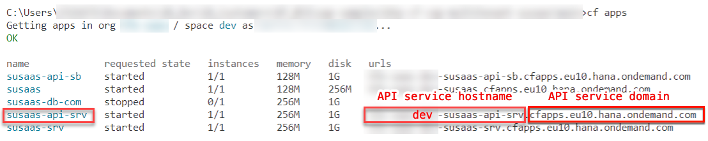](./images/API_Hostname.png?raw=true)

> **Important** - The command might differ depending on your cf CLI version. You can use *cf brs --help* to find the correct command related to your cf CLI version. Also make sure to change the change the API service domain in case of Custom Domain usage.

After successfully running this command in your cf CLI, you will see a new API Proxy called **SusaaS-API-Proxy** in your SAP API Management **Develop** menu. 

[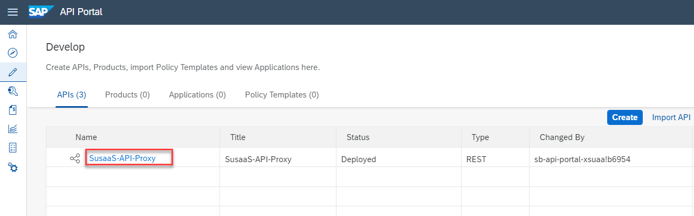](./images/API_Proxy.png?raw=true)

Checking the API Proxy details you will see in the description that this API Proxy is bound to a Cloud Foundry application which is your SaaS API. From now on, all requests reaching your SaaS API route will be running through SAP API Management, and respective API policies are applied.

[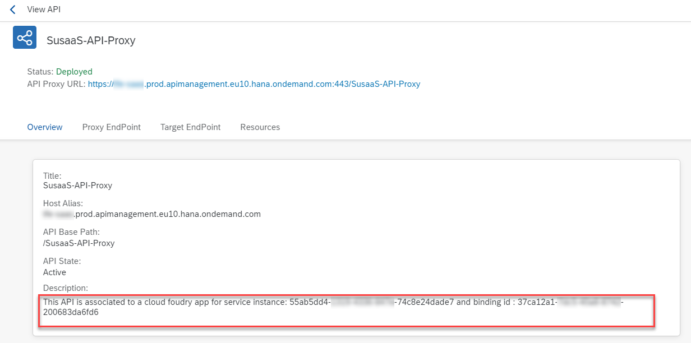](./images/API_ProxyDetails.png?raw=true)


## 5. API Policy Deep Dive

You can now apply relevant API Policies to your API Proxy using preconfigured templates and features. In this sample, you will learn how to set up a Spike Arrest component for rate limiting and different quotas based on the plan (standard/premium) subscribed by the consumer. 

To set up the respective policies, click on **Policies** in the top right of your API Proxy. 

[](./images/API_Policies.png?raw=true)

Switch to edit mode by clicking on **Edit** in the Policy Editor. 

[](./images/API_EditMode.png?raw=true)


### 5.1. Decode the JWT token

Let us start with the **PreFlow** of our API Proxy, in which we place the **Rate Limiter** of our SaaS API. Check the following [SAP Help documentation](https://help.sap.com/docs/SAP_CLOUD_PLATFORM_API_MANAGEMENT/66d066d903c2473f81ec33acfe2ccdb4/08b40d9e47a0470a8b14cc47abab89ec.html?locale=en-US) to learn more about the **Flow** types in SAP API Management.

5.1.1. In this use-case, we will distinguish our SaaS API clients by their unique Client ID, which can be found in the JWT token of each request. Therefore, please first add a feature called **DecodeJWT** which will allow you to make use of the JWT token content in subsequent steps. 

[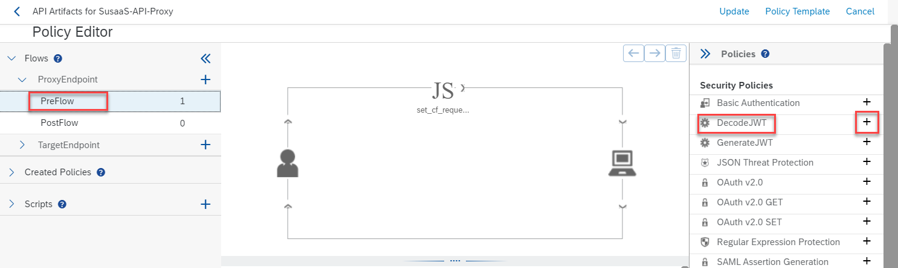](./images/API_DecodeJWT01.png?raw=true)

5.1.2. Rename the flow element **decodeJwt**. If you choose a different name, please keep track of it, as you will need it in one of the next steps. 

[](./images/API_DecodeJWT02.png?raw=true)

5.1.3. Please remove the **`<Source>var.jwt</Source>`** line from the configuration. 

[](./images/API_DecodeJWT03.png?raw=true)


### 5.2. Spike Arrest Policy

The Spike Arrest Policy allows you to throttle the number of requests processed by your API Proxy. It protects you against performance lags as well as downtimes and is an essential component of each enterprise-ready API Proxy. 

5.2.1. After decoding the JWT token, we can make use of the **Spike Arrest** feature in our policies toolbox. Please add a new instance and rename the flow element **spikeArrest**. 

[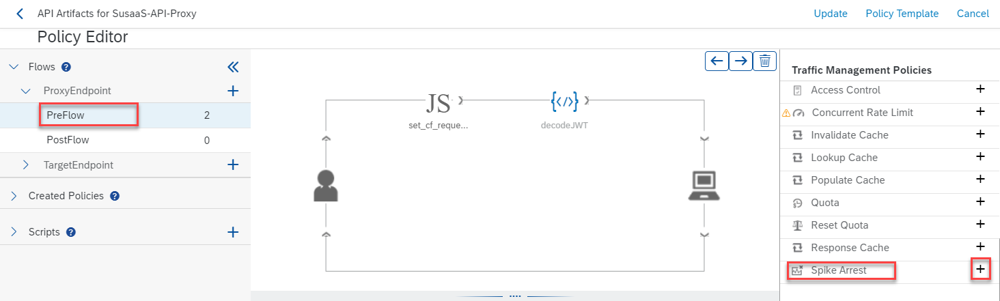](./images/API_SpikeArrest01.png?raw=true)

5.2.2. The Spike Arrest instance requires a Client identifier which is the Client Id in our scenario. The Client Id is origination from the previous flow element (used to decode the JWT token). You might need to change the **decodeJwt** value in case you named your initial flow element differently. 

```xml
<Identifier ref="jwt.decodeJwt.claim.client_id"/>
```

5.2.3. Feel free to adapt the number of requests which you want to allow per minute (pm) or second (ps). Check the documentation [click here](https://docs.apigee.com/api-platform/reference/policies/spike-arrest-policy) of Spike Arrest as the configuration options are extremely comprehensive. 

```xml
<Rate>1ps</Rate> instead of <Rate>30pm</Rate>
```

[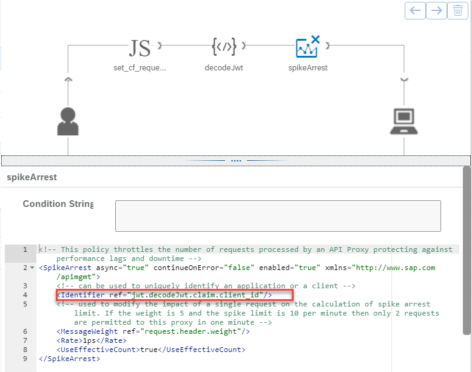](./images/API_SpikeArrest02.png?raw=true)


### 5.3. API Quota Policies

Besides an API Rate Limit (protecting our SaaS API from DoS attacks), we enhance our API Proxy by introducing a **plan-based Quota**. This allows us to differentiate standard from premium customers, offering different service levels (like number of requests per day) for the SaaS API.

5.3.1. To differentiate between the different API service plans, we are using **Subflows**. Those Subflows will be executed based on a certain condition, after the PreFlow was executed. 

Just create a new Subflow for the **Proxy Endpoint**, by clicking on the **+** icon.

[](./images/API_Quota01.png?raw=true)

5.3.2. We use three Subflows called **standardPlanFlow**, **premiumPlanFlow** and **trialPlanFlow**. These Subflows will be executed right after the generic PreFlow, depending on conditions you define. The PreFlow is executed for **all** requests. 

[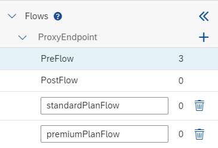](./images/API_Quota02.png?raw=true)

5.3.3. Once again, we differentiate our requests by using the decoded JWT token data. Our SaaS API Service Broker ensures, that the selected **service plan** is injected as a **scope** to all issued JWT tokens. This allows you to read the service plan details and to include it in the **Flow Condition** as follows: 

> **Hint** - Please make sure to select the **standardPlanFlow** before adding the condition. 

```jwt.decodeJwt.claim.scope ~ "*plan_standard"```

[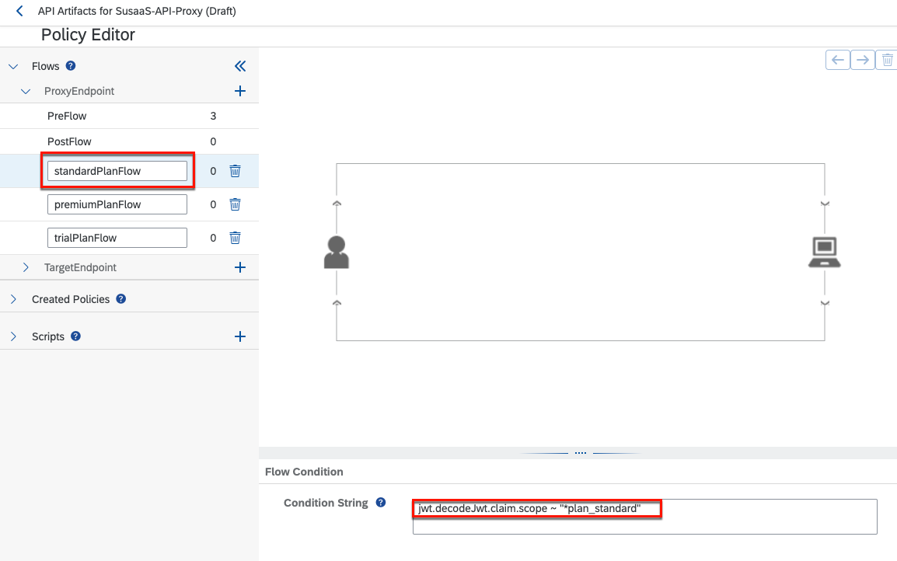](./images/API_Quota03.png?raw=true)

5.3.4. For the premiumPlanFlow the condition looks as follows.

  ```jwt.decodeJwt.claim.scope ~ "*plan_premium"```

5.3.5. For the trialPlanFlow the condition looks as follows.

  ```jwt.decodeJwt.claim.scope ~ "*plan_trial"```

> **Hint** - Reading the service plan from the JWT token scopes might be improved by a different approach in the future.

5.3.6. Now requests will be handled by the different Subflows depending on the consumer's service plan selection. In those Subflows, we can define different **Quota** allowances. To add a very simple **Quota limit** to the API, we use the **Quota** feature from the policies toolbox. Please name the new flow elements **quotaStandard** in the standard, **quotaPremium** in the premium and **quotaTrial** in the trial flow. 

[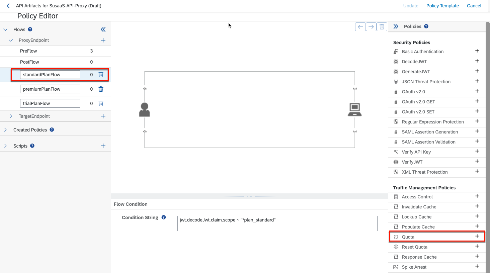](./images/API_Quota04.png?raw=true)

5.3.7. For our sample application, the **standard** and **trial** quota is configure as below. This configuration allows API customers exactly 1200 daily requests to your API. The comprehensive configuration options of the **Quota** policy can be found in the respective documentation [click here](https://docs.apigee.com/api-platform/reference/policies/quota-policy). 

> **Hint** - For the **premium plan**, you we double the number of daily requests to 2400, but feel free to update it to a configuration of your choice.  

> **Important** - Please ensure, the **Quota** policy configuration once again contains the **Client Id** identifier as in the following sample. 

> **Important** - Please make sure not to provide any value into the **Condition String** field of the **Quota** policy (See screenshots below).

```xml
<Quota async="false" continueOnError="false" enabled="true" type="calendar" xmlns="http://www.sap.com/apimgmt">
 	<Identifier ref="jwt.decodeJwt.claim.client_id"/>
 	<Allow count="1200"/>
 	<Interval>1</Interval>
	<Distributed>true</Distributed>
 	<StartTime>2015-2-11 12:00:00</StartTime>
	<Synchronous>true</Synchronous>
 	<TimeUnit>day</TimeUnit>
</Quota>
```

[](./images/API_Quota05.png?raw=true)

5.3.8. Double check the **Condition String**s of your Subflows and the respective quota configurations, which should resemble the following screenshots.

[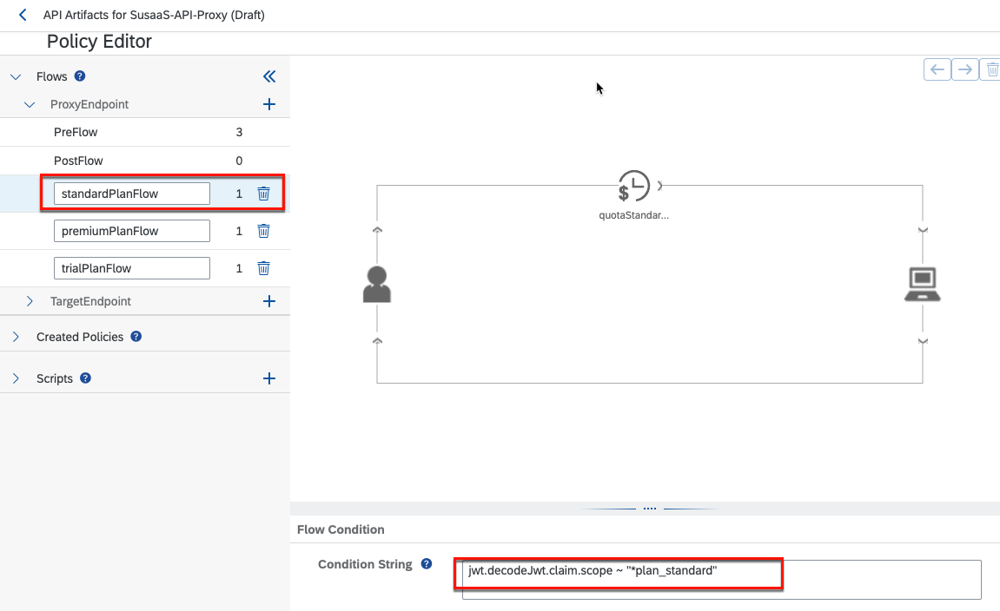](./images/API_Subflows03.png?raw=true)
[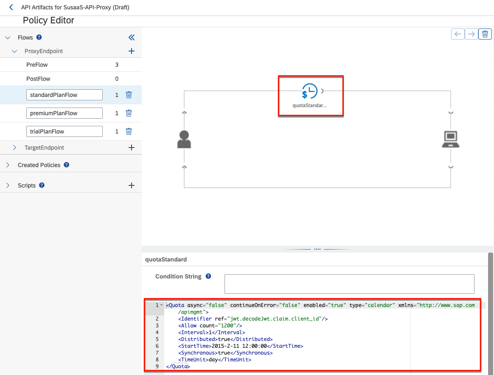](./images/API_Subflows04.png?raw=true)

[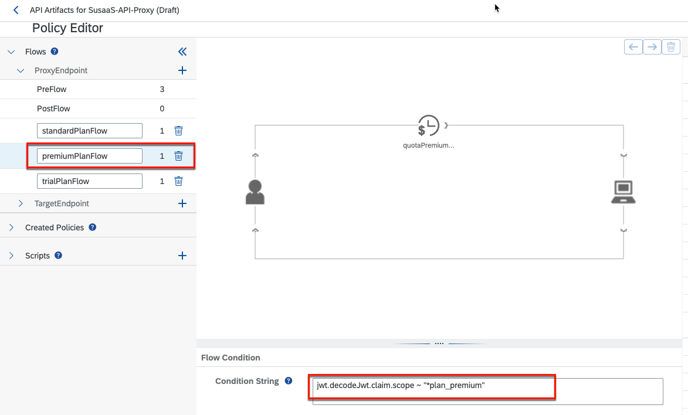](./images/API_Subflows05.png?raw=true)
[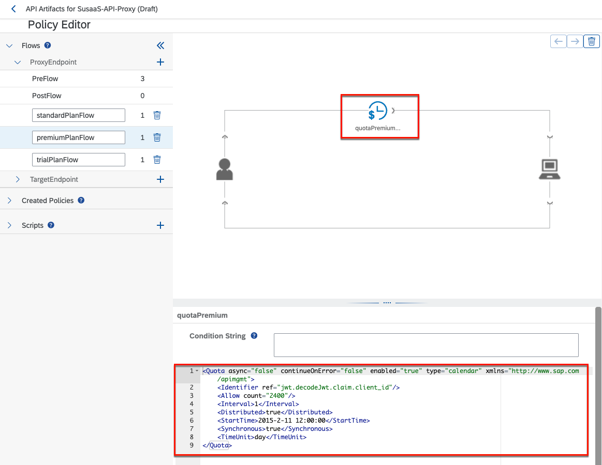](./images/API_Subflows06.png?raw=true)

[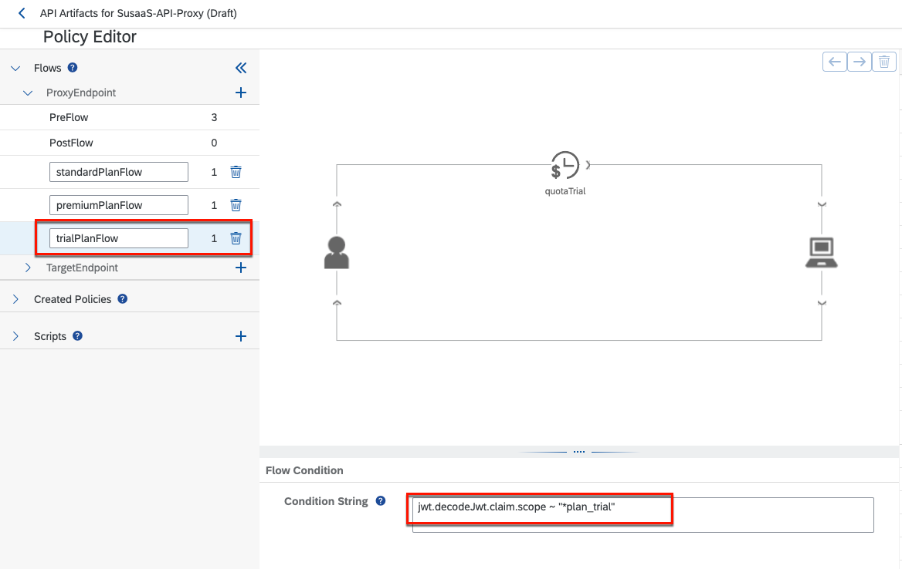](./images/API_Subflows07.png?raw=true)
[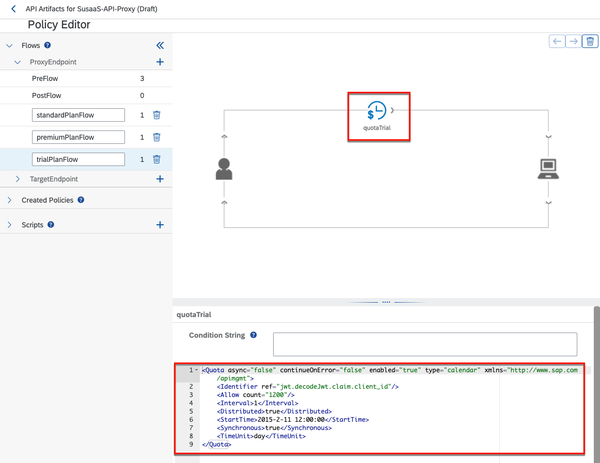](./images/API_Subflows08.png?raw=true)


### 5.5. Update API Proxy and deploy changes 

5.5.1. Please click on **Update** in the upper right of your **Policy Editor**. 

[](./images/API_Deploy01.png?raw=true)

5.5.2. Save your API Proxy changes by clicking on **Save**. 

[](./images/API_Deploy02.png?raw=true)

5.5.3. Make sure to **Deploy** the latest version of your API Proxy by selecting the respective option. 

[](./images/API_Deploy03.png?raw=true)


## 6. Test the setup

That's it, you've successfully integrated your SaaS API with SAP API Management and already configured some API Policies. To test the setup, feel free to create a new service key in a consumer subaccount (or use an existing one) and try calling your API endpoint e.g., using the sample HTTP files.

You will notice that calling the API more than once per second (e.g. using Postman or the HTTP files), will result in an error message sent by SAP API Management as the Spike Arrest policy will jump in. 

[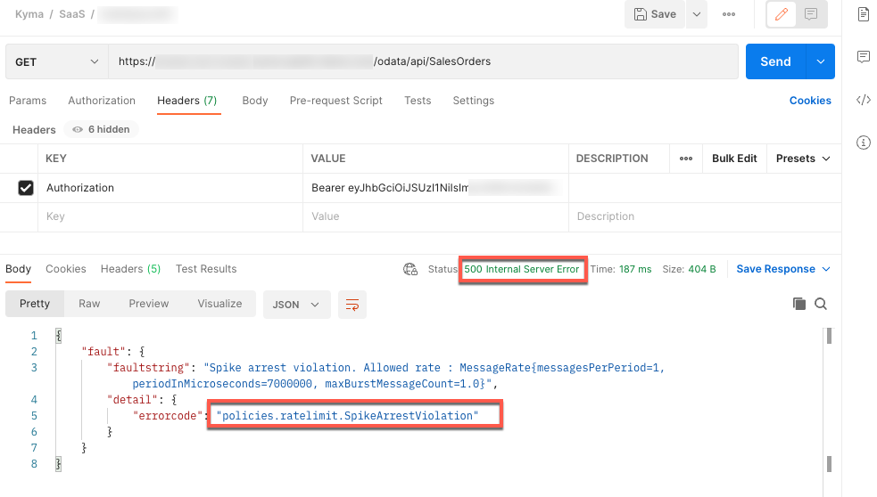](./images/API_SpikeArrest.png?raw=true)


## 7. Deployment Descriptor

The API Management as route service (sap-apim-route-service) instance can also be defined in your mta.yaml deployment descriptor. Just add the following code snippet to your resources. Still, you will need to execute the **cf bind-route-service** command as described in this tutorial. 

```yaml
resources:
  - name: susaas-api-route-service
    type: org.cloudfoundry.managed-service
    parameters:
      service: apimanagement-apiportal
      service-plan: apim-as-route-service
```

## 8. Further Information

Please use the following links to find further information on the topics above:

* [SAP Help - SAP Integration Suite](https://help.sap.com/docs/SAP_INTEGRATION_SUITE?locale=en-US)
* [SAP Help - SAP API Management](https://help.sap.com/docs/SAP_CLOUD_PLATFORM_API_MANAGEMENT?locale=en-US)
* [SAP Help - SAP API Management in the Cloud Foundry Environment](https://help.sap.com/docs/SAP_CLOUD_PLATFORM_API_MANAGEMENT/66d066d903c2473f81ec33acfe2ccdb4/7d8514b4ab46455e8416723003b414d7.html?locale=en-US)
* [Cloud Foundry CLI Reference Guide - v8](https://cli.cloudfoundry.org/en-US/v8/)
* [Cloud Foundry CLI Reference Guide - v7](https://cli.cloudfoundry.org/en-US/v7/)
* [SAP Blog - SAP APIM - Route Service to Manage Cloud Foundry Apps](https://blogs.sap.com/2020/10/10/sap-apim-route-service-plan-to-manage-cloud-foundry-apps/)
* [SAP Blog - Service Plan of SAP API Management in Cloud Foundry Environment](https://blogs.sap.com/2020/08/10/part-3-service-plan-of-sap-api-management-in-cloud-foundry-environment/)
* [Cloud Foundry Documentation - Route Services](https://docs.cloudfoundry.org/services/route-services.html)
* [apigee Documentation - Policy reference overview](https://docs.apigee.com/api-platform/reference/policies/reference-overview-policy)
* [apigee Documentation - SpikeArrest policy](https://docs.apigee.com/api-platform/reference/policies/spike-arrest-policy)
* [apigee Documentation - Quota policy](https://docs.apigee.com/api-platform/reference/policies/quota-policy)
* [SAP Help - Flows](https://help.sap.com/docs/SAP_CLOUD_PLATFORM_API_MANAGEMENT/66d066d903c2473f81ec33acfe2ccdb4/08b40d9e47a0470a8b14cc47abab89ec.html?locale=en-US)
* [SAP Help - Condition Strings](https://help.sap.com/docs/SAP_CLOUD_PLATFORM_API_MANAGEMENT/66d066d903c2473f81ec33acfe2ccdb4/66561009a5b343658be2408981d005bb.html?locale=en-US)
* [SAP Help - Policy Types](https://help.sap.com/docs/SAP_CLOUD_PLATFORM_API_MANAGEMENT/66d066d903c2473f81ec33acfe2ccdb4/c918e2803dfd4fc487e86d0875e8462c.html?locale=en-US)