# Integrate SAP API Management

- ### **Kyma** ✅
- ### **Cloud Foundry** ❌

**Important** - This part of the tutorial is required for **Kyma** deployments only!

As your SaaS application contains an API that allows your Subscriber to interact programmatically with their Tenant database containers, you need to ensure that your API endpoints are properly managed and monitored. For this purpose, you should implement features like **Rate Limiting** to prevent DoS attacks. Furthermore, you can ensure fair usage of the resources among your consumers by setting up a **Quota** based on the chosen service plan. A premium Subscriber can be eligible to send more requests per second than a standard Consumer. Proper monitoring of your API will help you analyze performance issues and to identify problems of your consumers. 

In this part of the tutorial, you will learn how to ensure that each and every request targeting your SaaS API is passing through SAP API Management first. SAP API Management (as part of SAP Integration Suite), is SAP's standard cloud software offering for all API-related requirements. 

- [Integrate SAP API Management](#integrate-sap-api-management)
  - [1. Architecture](#1-architecture)
  - [2. Prerequisites](#2-prerequisites)
  - [3. Integration Setup](#3-integration-setup)
  - [4. Under the hood](#4-under-the-hood)
  - [5. API Policy Deep Dive](#5-api-policy-deep-dive)
    - [5.1. Decode JWT Token Policy](#51-decode-jwt-token-policy)
    - [5.2. Spike Arrest Policy](#52-spike-arrest-policy)
    - [5.3. API Quota Policies](#53-api-quota-policies)
    - [5.4. Kyma Authentication Policies](#54-kyma-authentication-policies)
    - [5.5. Statistics Collection Policies](#55-statistics-collection-policies)
    - [5.6. Update API Proxy and deploy changes](#56-update-api-proxy-and-deploy-changes)
  - [6. Test the setup](#6-test-the-setup)
  - [7. Further Information](#7-further-information)

> **Important** - SAP API Management limits the payload size of a single HTTP request to 10 MB for non-streamed HTTP requests and responses ([see details](https://me.sap.com/notes/0003087398)). If you want to transfer larger files, please consider streaming! 


## 1. Architecture

SAP API Management is a new component in the central part of the **Advanced Version** architecture. While in the Basic Version, the API calls were directly accessing the Kyma API Service workloads, now all requests are passing through this additional component, giving you great flexibility in how to handle your in and outbound API traffic. See the relevant part of the solution architecture below (click to enlarge):

[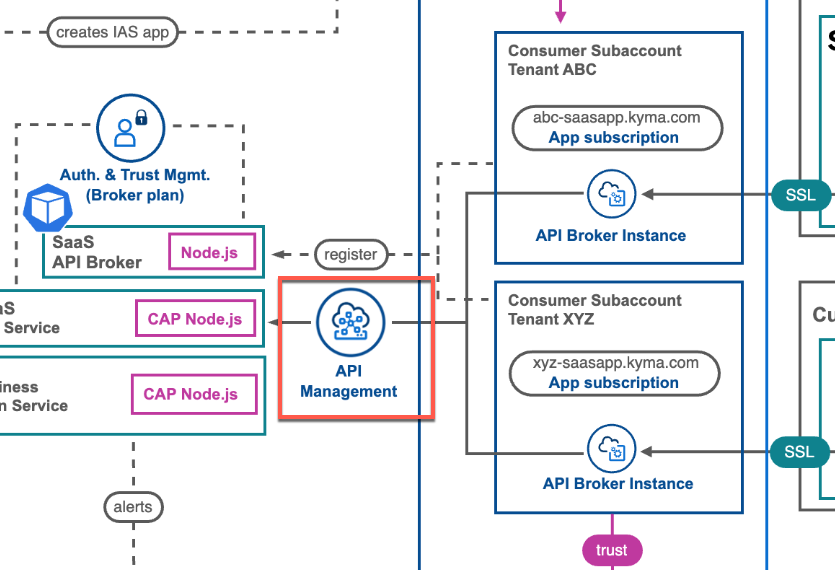](./images/API_Architecture.png?raw=true)


## 2. Prerequisites

For this setup, please make sure you have an SAP API Management tenant up and running. As SAP API Management is a capability of **SAP Integration Suite**, please subscribe to SAP Integration Suite and activate the respective **API Management** feature. Check the following SAP Help documentation to find a detailed step-by-step guide ([click here](https://help.sap.com/docs/sap-api-management/sap-api-management/setting-up-api-management-capability-from-integration-suite?locale=en-US)). As part of this documentation, we cannot provide additional details on the setup process of SAP Integration Suite. 

[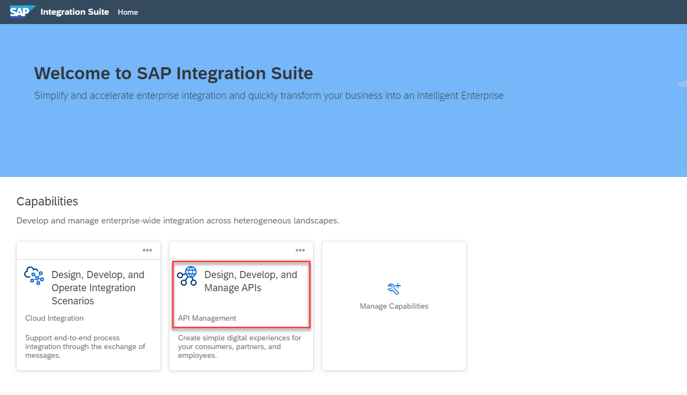](./images/API_IntegrationSuite.png?raw=true)


## 3. Integration Setup

While Cloud Foundry offers a very convenient integration option using so-called **Route Services** (directly intercepting the traffic targeting your API), in Kyma we need to setup the necessary routing ourself. As already covered in the introductory Kyma chapters ([see here](../../2-basic/7-kyma-resources-helm/README.md)), any request targeting our Kyma API Service is initially routed to **SAP API Management**, where relevant API Rules (Rate Limiting, Quotas) are being checked. 

Only if those rules are passed, the traffic is send back to Kyma and routed to the actual API Service workloads. The relevant SAP API Management instance details for this routing have to be maintained in an additional *values-apim.yaml* file. 

3.1. Below you can see the required configuration for the API Management Integration. You can find a respective sample in the provided [./files/values-apim.yaml](./files/values-apim.yaml) file of this Advanced Feature. Please add this sample configuration to the existing **api** section of your **values-private.yaml** file in your [deploy/kyma/charts/sustainable-saas](../../../deploy/kyma/charts/sustainable-saas) directory. The **api** section in your *values-private.yaml* file should look as follows:

```yaml
...

api:
  ####################### Existing Configuration ########################
  image:
    repository: sap-demo/susaas-api
    tag: latest
  ######################### Added Configuration ######################### 
  serviceKeys:
    # Service Key to be used by SAP API Management
    xsuaa-apim:
      serviceInstanceName: xsuaa-api
  apim:
    # SAP API Management Runtime Host (without https://)
    # e.g., sap-demo.prod.apimanagement.eu10.hana.ondemand.com
    host: <ProviderSubaccountSubdomain>.prod.apimanagement.<ProviderSubaccountRegion>.hana.ondemand.com
    # SAP API Management Runtime Port (default - 443)
    port: 443
    # SAP API Management API Proxy Path (default - susaas-api)
    path: susaas-api
    # Details of the API XSUAA SAP BTP Service Instance
    xsuaa: 
      # Provide the XSUAA tenant URL of Provider Subaccount in the following format
      # e.g., sap-demo.authentication.eu10.hana.ondemand.com
      host: <ProviderSubaccountSubdomain>.authentication.<ProviderSubaccountRegion>.hana.ondemand.com
      # Provide the Client ID of your API XSUAA Service Instance in the following format
      # e.g., sb-susaas-api-default
      sub: sb-<ReleaseName>-api-<Namespace>

...
```

3.2. After updating the above configuration based on your own environment details, please run another **helm upgrade** to apply the changes to your Kyma Cluster.

```sh
# Run in ./deploy/kyma # 
helm upgrade <ReleaseName> ./charts/sustainable-saas -f ./charts/sustainable-saas/values-private.yaml -n <Namespace> 

# Example # 
helm upgrade susaas ./charts/sustainable-saas -f ./charts/sustainable-saas/values-private.yaml -n default 
```

3.3. Switch over to **SAP API Management** to configure the missing integration parts and to upload our **sample API Proxy**. 

3.4. First of all, you need to store valid XSUAA Client Credentials in SAP API Management. To do so, please open the **Configure** menu and select **APIs**. Switch to the **Key Value Maps** tab and click on **Create**.

[](./images/API_KeyValue01.png?raw=true)

3.5. Create a new Key Value Map named **susaas-api** containing the **Client Id** and **Token Endpoint** of your XSUAA Service Instance. 

> **Hint** - You can find the required details in your **\<ReleaseName\>-api-xsuaa-apim** Kyma Secret, which was created during the *helm upgrade*. Either get the Secret details via the Kyma Dashboard or using the following kubectl commands. <br>
> > ```kubectl get secret <ReleaseName>-api-xsuaa-apim -o jsonpath='{.data.clientid}' | base64 --decode```<br>
> > ```kubectl get secret <ReleaseName>-api-xsuaa-apim -o jsonpath='{.data.clientsecret}' | base64 --decode```<br>
> > ```kubectl get secret <ReleaseName>-api-xsuaa-apim -o jsonpath='{.data.url}' | base64 --decode```<br>
> [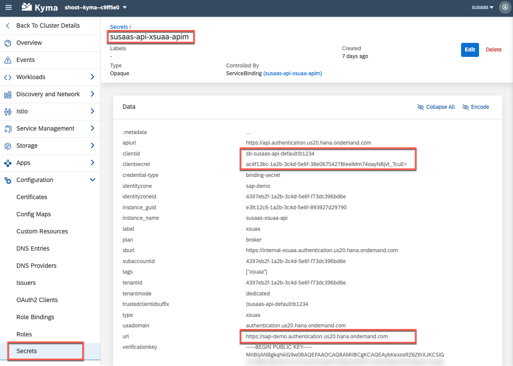](./images/API_SecretDetails.png?raw=true)

- clientId: **clientid** property of Kyma Secret
  > Example -> sb-susaas-api-default!b1234
- tokenEndpoint: **url** property of Kyma Secret (**without https://**)
  > Example -> sap-demo.authentication.us20.hana.ondemand.com

  [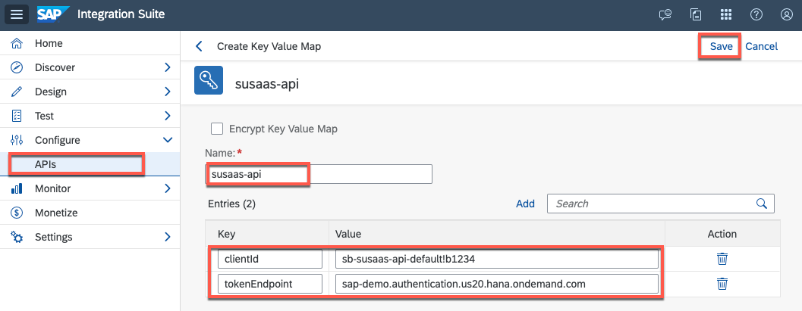](./images/API_KeyValue02.png?raw=true)

3.6. Create a second **Key Value Map** named **susaas-api-key** containing the **Client Secret** of your XSUAA Service Instance. Enable encryption for this Key Value Map before you save it. 

- clientSecret : **clientsecret** property of the aforementioned Kyma Secret.
  > Example -> ac4f13bc-a1b2-c3d4-e5f6-38e067544oayNBjvt=

  [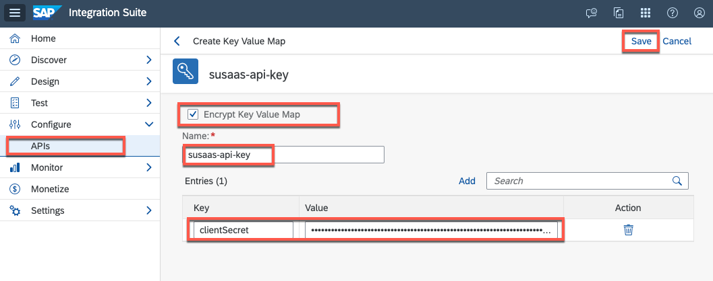](./images/API_KeyValue03.png?raw=true)

3.7. As the provided sample **API Proxy** contains an additional monitoring features (like tracking the XSUAA Zone ID of the client as well as the requested OData entity), please add those additional **Dimensions** in the **Monitoring** section of your SAP API Management instance. Therefore, please switch to the **APIs** section of the **Monitoring** menu and click on **+ Add**.

[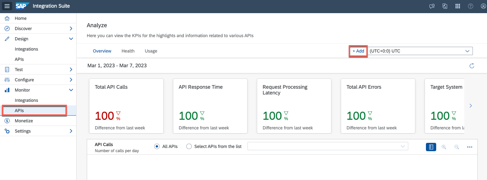](./images/API_Dimensions01.png?raw=true)

3.8. Create the following three **Dimensions**, which are being used by the sample API Proxy. Click on **OK** to save the changes.

- ODataEntityList
- ODataPrimaryEntity
- Zone

[](./images/API_Dimensions02.png?raw=true)

3.9. Return to the **Design** environment and upload the provided sample **APIProxy.zip** file, which you can find in the **files** subfolder ([click here](./files/)) of this tutorial.

[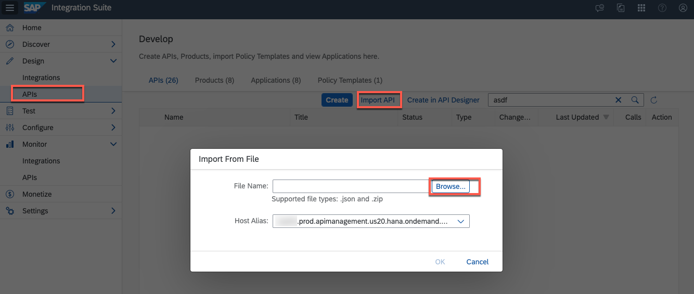](./images/API_Upload01.png?raw=true)
[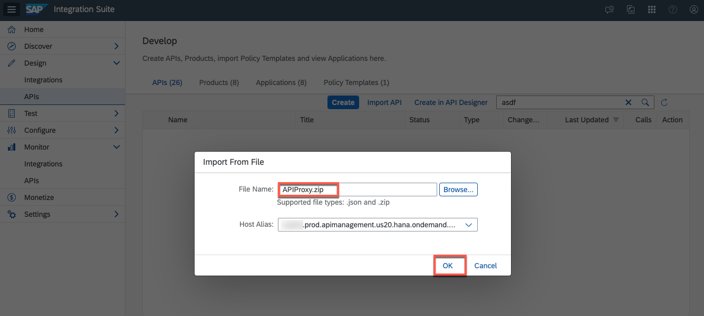](./images/API_Upload02.png?raw=true)

3.10. Once uploaded, please open the susaas-api **API Proxy** definition and update the **Target Endpoint** with your Kyma API Service URI (e.g., susaas-api-default.a1b2c3.kyma.ondemand.com) as you can see in the following screenshots. 

> **Hint** - If you are using a **custom domain** in your Kyma environment, please also use in this context (e.g., susaas-api-default.sap-demo.com).

[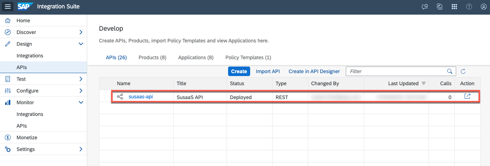](./images/API_Proxy01.png?raw=true)
[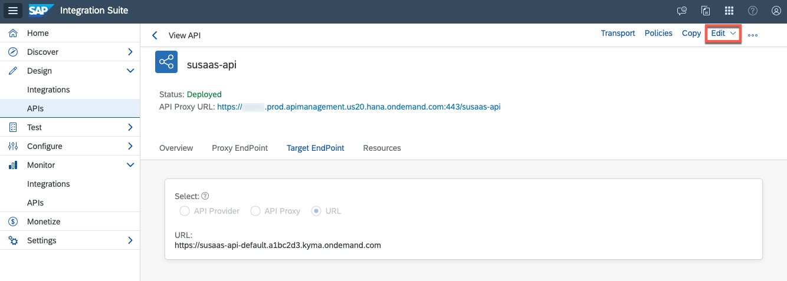](./images/API_Proxy03.png?raw=true)

[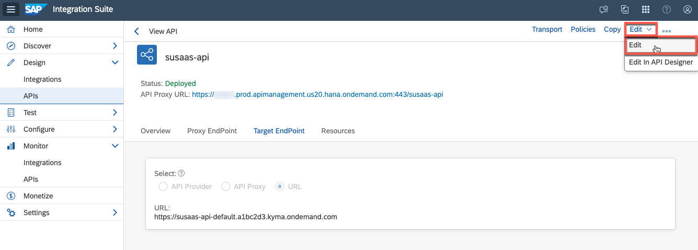](./images/API_Proxy04.png?raw=true)
[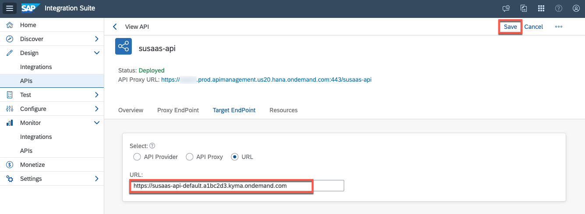](./images/API_Proxy05.png?raw=true)

3.11. Save your changes and deploy the **API Proxy** as shown in the following screenshots. 

[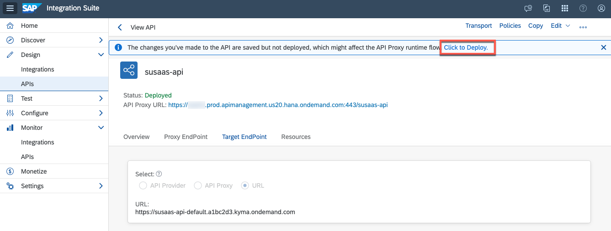](./images/API_Proxy06.png?raw=true)
[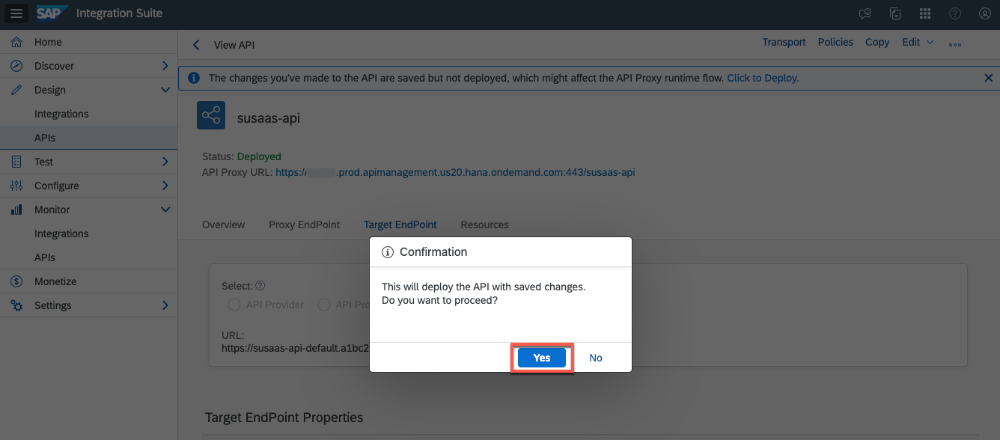](./images/API_Proxy07.png?raw=true)

[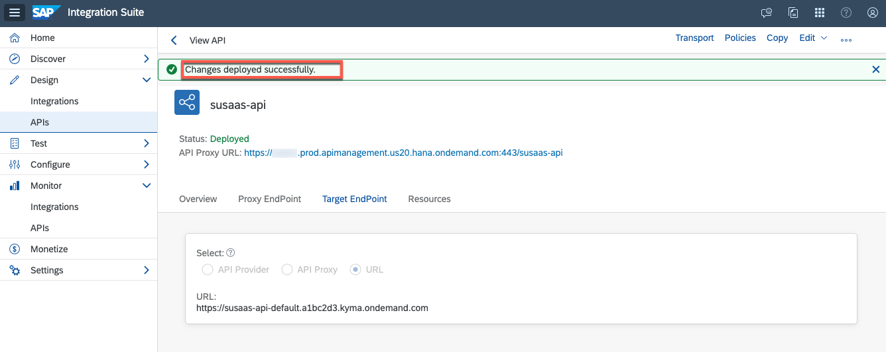](./images/API_Proxy08.png?raw=true)

This is it - From now on, all requests targeting your Kyma API Service workloads will be routed through SAP API Management to enforce policies like **Rate Limiting** or **Quotas**. If the policies checks are passed, the request is returning to Kyma and is served by our API Service **Target Endpoint**. In the next chapter, we will provide you with a sneak peak of what is happening under the hood of this architecture.


## 4. Under the hood 

As briefly touched in our [Template Details](../../2-basic/8-kyma-resources-helm/components/TemplateDetails.md) chapter, we make use of dedicated Istio resources to accomplish this integration path. Let us summarize the respective flow once again, so you get an idea of what's happening under the hood. As this approach can also be applied for any other kind of external service apart from SAP API Management, make sure you understand the basic concept. This will allow you a similar integration with iFlows of SAP Integration Suite. 

[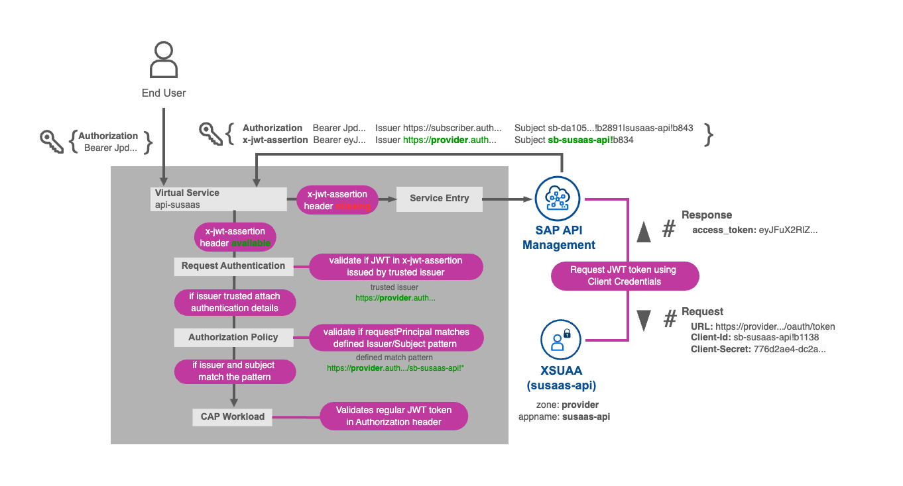](./images/API_KymaRouting.png?raw=true)

The general target should be clear by now. We need to ensure that no request can reach our Kyma API Service without passing through the policy checks in SAP API Management. As visualized above, respective Istio resources ensure, that a valid JWT token is part of any incoming request (**x-jwt-assertion** custom header). This JWT token header, is the core component of this integration, and is generated and injected by SAP API Management (see details in [API Policy Deep Dive](#5-api-policy-deep-dive)), based on dedicated Client Credentials of an XSUAA service instance.  

That summary already gave you a glimpse of an idea how things will gear into each other? Excellent! Let's tackle one step after the other! 

- Everything starts with an API request arriving in our Kyma Cluster through the **Istio Ingress Gateway**. While you can also provide your Tenants the API Proxy endpoints, we decided to leverage the additional flexibility offered by Istio when it comes to an end-to-end routing scenario.

  > **Important** - The additional hop from Kyma to SAP API Management will result in slightly longer response times, so if your use-case targets minimal response times, you might think about equipping your subscribers with the API Proxy endpoints. If your scenario is all about latency and you are transferring huge loads through the API endpoints, you might also think about API Rule checks as part of your API Service implementation or leveraging Istio features for Rate Limiting.   

- To integrate **SAP API Management** with our Service Mesh, a dedicated **Istio Virtual Service** is used. This Virtual Service defines routing rules for all requests arriving for our API Service through **Istio Ingress Gateway**. The routing rules are based on the availability of the custom **x-jwt-assertion** header. If the header is missing (initial request), traffic is routed to the SAP API Management API Proxy. If the custom header is part of the request, traffic is routed to our Kyma API Service. 

  > **Important** - The **x-jwt-assertion** custom header is injected by SAP API Management, once the request has successfully passed all Traffic Policies (like Rate Limiting).

  ```yaml
  apiVersion: networking.istio.io/v1beta1
  kind: VirtualService
  spec:
    # Matches all requests arriving on host exposed by SusaaS API Service 
    gateways: 
      - kyma-system/kyma-gateway
    hosts: 
      - susaas-api-default.a1b2c3.kyma.ondemand.com
    http:
      - match:
          # Matches requests containing the x-jwt-assertion header
          - headers:
              x-jwt-assertion: {}
        # Routes requests to Cluster IP Service of our SaaS API 
        route:
          - destination:
              host: susaas-api.default.svc.cluster.local
              port:
                number: 5000
      # Matches requests without the x-jwt-assertion header
      - match:
          - withoutHeaders:
              x-jwt-assertion: {}
        # Rewrite URL path to add API Proxy path and authority details
        rewrite:
          uri: /susaas-api/
          authority: sap-demo.prod.apimanagement.us20.hana.ondemand.com
        # Routes to SAP API Management defined in the Service Entry
        route:
          - destination:
              host: sap-demo.prod.apimanagement.us20.hana.ondemand.com
              port:
                number: 443
  ```

  > **Side note** - A so-called **Service Entry** makes SAP API Management known as a mesh-external service. This allows us to it as destination in Virtual Services routing rules. 

- Once a request has successfully passed all Policies in SAP API Management, the API Proxy will request a new JWT **access token** using XSUAA Client Credentials, which are securely stored in respective Key Value Maps. Those have already been set up by you in the introduction of this tutorial. Only SAP API Management is in possession of those Client Credentials, so no Tenant will ever be able to generate a valid access token himself. By checking the validity of this JWT token (passed in the x-jwt-assertion header), you can ensure, that a request has successfully passed through SAP API Management. The request incl. the custom header is finally send back to Kyma. 

  > **Important** - Your SaaS subscribers nor any other person should never get access to those Client Credentials. Also make sure to rotate them on a regular basis. 

As a smart and knowledgeable security enthusiast, you will probably wonder about the following question... "Well, the routing based on a custom header is nice, but does it protect me from anyone just adding the respective custom header manually to the request?!" You are absolutely right and this would bypass the routing to SAP API Management... but no worries, our API Service wouldn't budge an inch, as the probability of generating a valid JWT token is close to zero. Read along, to learn how the token validation is implemented in Kyma using various Istio components. 

- First of all, an Istio **Request Authentication** checks, whether a request targeting the API Service provides a **valid** JWT token in the **x-jwt-assertion** header, which is issued by a trusted issuer. If this is the case, the request is **considered authenticated** and respective **identity details** can be used by subsequent authorization checks in Authorization Policies. 

  > **Hint** - A standalone Request Authentication does not necessarily restrict access to your Services. It only allows you to **authenticate** requests and ensures that JWT tokens are issued by a trusted issuer. The extracted identity details (like the **requestPrincipals** property) still have to be validated in respective Authorization Policies. In case of untrusted JWT issuers or an invalid token, the request will still be forwarded, but is considered "un-authenticated". Therefore, the required **identity details** to pass an Authorization Policy are missing!

  ```yaml
  apiVersion: security.istio.io/v1beta1
  kind: RequestAuthentication
  spec:
    # Any request targeting the Kyma API Service workload
    selector:
      matchLabels: 
        app.kubernetes.io/name: api
    # Check if request contains a valid JWT token issued by XSUAA instance of the the Provider Subaccount
    jwtRules:
      - issuer: https://sap-demo.authentication.us20.hana.ondemand.com/oauth/token
        jwksUri: https://sap-demo.authentication.us20.hana.ondemand.com/token_keys
        # As the JWT token of the initial user request shall be retained a custom header is being used
        fromHeaders:
          - name: x-jwt-assertion
  ```
 
- An Istio **Authorization Policy** ensures, that our API Service can only be reached by requests proving a dedicated Issuer and Subject claim as part of the **validated identity details**. In our sample scenario, we check the **requestPrincipals** property, which is following the structure - **\<JWT-Issuer\>/\<JWT-Subject\>**. Keep in mind, if the JWT token in the **x-jwt-assertion** header is invalid or has not been issued by a trusted XSUAA tenant, this property will be empty and the request is blocked!

  > **Hint** - In case of XSUAA, the JWT issuer equals the **token endpoint** of the Provider Subaccount XSUAA Tenant (like https://</span>sap-demo.authentication.us20.hana.ondemand.com/oauth/token) and the **Subject claim** contains the Client Id of the API XSUAA Service Instance. The default Subject structure follows **sb-\<Release-Name\>-api-\<Release-Namespace\>** and has to be provided in the *values.yaml* file (like **sb-susaas-api-default**). The asterisk is used on purpose in this case, as the Client Ids generated by XSUAA always contain a random character sequence after the exclamation mark! 

  ```yaml
  apiVersion: security.istio.io/v1beta1
  kind: AuthorizationPolicy
  spec:
    action: ALLOW
    # Any request targeting the Kyma API Service workload
    selector:
      matchLabels:
        app.kubernetes.io/name: api
    # Only grant access if Issuer and Subject of the authenticated request match a defined pattern
    # The Issuer has to match the XSUAA token endpoint of the Provider Subaccount 
    # The prefix of the Subject claim has to match the Client Id of the API XSUAA Service Instance
    rules:
      - from:
        - source:
            # Will only be available if Request Authentication was successful
            requestPrincipals: 
              - https://sap-demo.authentication.us20.hana.ondemand.com/oauth/token/sb-susaas-api-default!*
  ```

- The Istio **Destination Rule** is another resource used in this sample and allows us to use simple TLS communication for egress traffic targeting SAP API Management. As Istio enforces mutual TLS as default communication within the service mesh, any exception has to be explicitly defined. Just to let you know : ) 

  ```yaml
  # Source: susaas/charts/api/templates/apim-proxy/istio-dest-rule-apim.yaml
  apiVersion: networking.istio.io/v1alpha3
  kind: DestinationRule
  metadata:
    name: susaas-apim
    labels:
      app.kubernetes.io/name: api
  spec:
    host: sap-demo.prod.apimanagement.us20.hana.ondemand.com
    trafficPolicy:
      portLevelSettings:
      - port:
          number: 443
        tls:
          mode: SIMPLE
  ```

This is it, now you should be in the know about how the secure integration of SAP API Management is set up in our sample scenario. An alerted reader might probably ask the following additional question now. Why all the fuzz about a custom header? Couldn't we just use the **Authorization** header for this purpose? Excellent question and for a proper answer, let us check the visualization once again. 

[](./images/API_KymaRouting.png?raw=true)

While the Authorization header would obviously be the go-to place for such a JWT token, it is unfortunately already occupied by the initial request. It contains a JWT token issued by the XSUAA tenant of the  **Subscriber Subaccount** and is used by CAP to identify the Tenant in our multitenancy context. So we have to retain this token and loop it through the whole process. For that reason, we decided to store the additional JWT token (identifying a successful processing by API Management) in a custom header. 

While you are an expert for the theoretical concept now, let's face the school of hard knocks and decent into the engine room of SAP API Management. Time for some API Policies! 


## 5. API Policy Deep Dive

The API Policies of our sample API Proxy are primarily based on SAP API Management Standard features. In the following section of the tutorial, you will learn how to set up some of the used API Policies yourself. This includes a Spike Arrest component for rate limiting and different Quotas based on the plan (trial/standard/premium) selected by a Subscriber. 

> **Important** - The following steps have already been completed in the sample API Proxy which you deployed in the beginning of this tutorial (**APIProxy.zip**). If you want to redo the following part of the step-by-step guide, feel free to remove the existing API Proxy and upload the **APIProxyPolicies.zip**. Otherwise, just follow along and try to reflect the steps and components in your existing API Proxy.  

To view and change the policies of an API Proxy, just click on **Policies** in the top right of your API Proxy.

[](./images/API_Policies.png?raw=true)

Switch to edit mode by clicking on **Edit** in the Policy Editor. 

[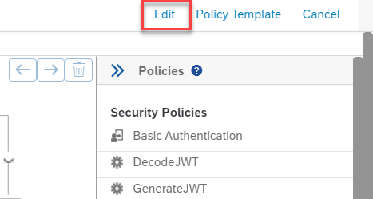](./images/API_EditMode.png?raw=true)


### 5.1. Decode JWT Token Policy

Let us start with the **PreFlow** of our API Proxy, in which we place the **Rate Limiter** of our SaaS API. Check the following [SAP Help documentation](https://help.sap.com/docs/SAP_CLOUD_PLATFORM_API_MANAGEMENT/66d066d903c2473f81ec33acfe2ccdb4/08b40d9e47a0470a8b14cc47abab89ec.html?locale=en-US) to learn more about the **Flow** types in SAP API Management.

5.1.1. In this use-case, we distinguish our API clients by their unique Client ID, which can be found in the JWT token of each request (! this time the JWT token in the default Authorization header !). Therefore if you decided to rebuild the API Policies from scratch, please add the API feature called **DecodeJWT**, allowing you to make use of the decoded JWT token in subsequent steps. 

[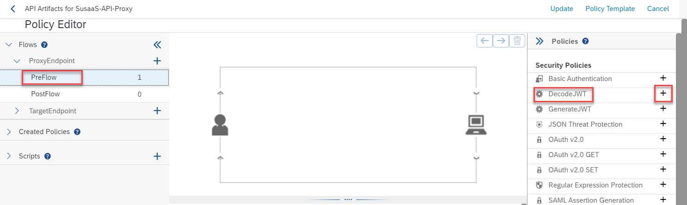](./images/API_DecodeJWT01.png?raw=true)

5.1.2. If you are rebuilding the API Policies from scratch, rename the flow element **decodeJwt**. If you choose a different name, please keep track of it, as you will need it in one of the next steps. 

[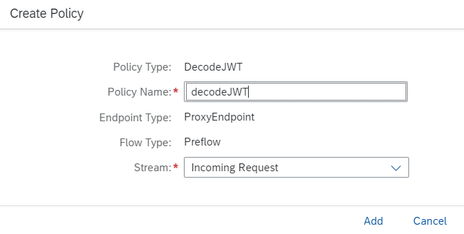](./images/API_DecodeJWT02.png?raw=true)

5.1.3. If you are rebuilding the API Policies from scratch, please remove the **`<Source>var.jwt</Source>`** line from the configuration. 

[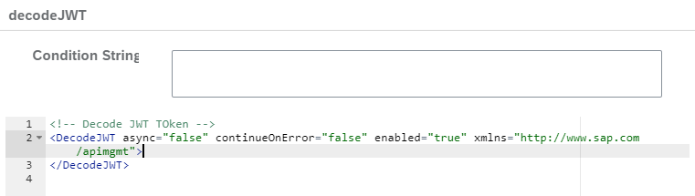](./images/API_DecodeJWT03.png?raw=true)


### 5.2. Spike Arrest Policy

The Spike Arrest Policy allows you to throttle the number of requests processed by your API Proxy. It protects you against performance lags as well as downtimes and is an essential component of each enterprise-ready API Proxy. 

5.2.1. After decoding the JWT token, we can make use of the **Spike Arrest** feature in our policies toolbox. If you are rebuilding the API Policies from scratch, please add a new instance and rename the flow element **spikeArrest**. 

[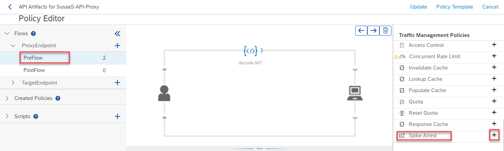](./images/API_SpikeArrest01.png?raw=true)

5.2.2. The Spike Arrest instance requires a Client identifier which is the Client Id in our scenario. The Client Id is origination from the previous flow element (used to decode the JWT token). If you are rebuilding the API Policies from scratch, you might need to change the **decodeJwt** value in case you named your initial flow element differently. 

```xml
<Identifier ref="jwt.decodeJwt.claim.client_id"/>
```

5.2.3. Feel free to adapt the number of requests which you want to allow per minute (pm) or second (ps). Check the documentation [click here](https://docs.apigee.com/api-platform/reference/policies/spike-arrest-policy) of Spike Arrest as the configuration options are extremely comprehensive. 

```xml
<Rate>1ps</Rate> instead of <Rate>30pm</Rate>
```

[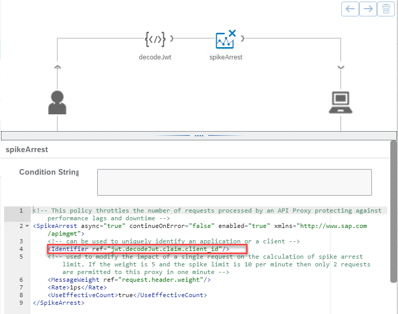](./images/API_SpikeArrest02.png?raw=true)


### 5.3. API Quota Policies

Besides an API Rate Limit (protecting our SaaS API from DoS attacks), we enhance our API Proxy by introducing a **plan-based Quota**. This allows us to differentiate standard from premium customers, offering different service levels (like number of requests per day) for the SaaS API. 

5.3.1. To differentiate between the different API service plans, we are using **Subflows**. Those Subflows will be executed based on a certain condition, after the PreFlow was executed. If you are rebuilding the API Policies from scratch, just create a new Subflow for the **Proxy Endpoint**, by clicking on the **+** icon.

[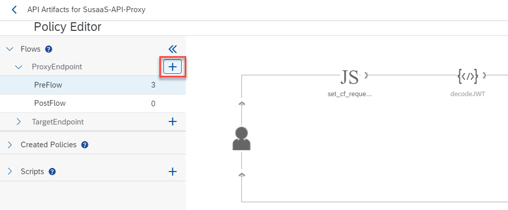](./images/API_Quota01.png?raw=true)

5.3.2. We use three Subflows called **standardPlanFlow**, **premiumPlanFlow** and **trialPlanFlow**. These Subflows will be executed right after the generic PreFlow, depending on conditions you define. The PreFlow is executed for **all** requests. 

[](./images/API_Quota02.png?raw=true)

5.3.3. Once again, we differentiate our requests by using the decoded JWT token data. Our SaaS API Service Broker ensures, that the selected **service plan** is injected as a **scope** to all issued JWT tokens. This allows you to read the service plan details and to include it in the **Flow Condition** as follows: 

> **Hint** - If you are rebuilding the API Policies from scratch, please select the **standardPlanFlow** before adding the condition. 

  ```jwt.decodeJwt.claim.scope ~ "*plan_standard"```

[](./images/API_Quota03.png?raw=true)

5.3.4. For the premiumPlanFlow the condition looks as follows.

  ```jwt.decodeJwt.claim.scope ~ "*plan_premium"```

5.3.5. For the trialPlanFlow the condition looks as follows.

  ```jwt.decodeJwt.claim.scope ~ "*plan_trial"```


> **Hint** - Reading the service plan from the JWT token scopes might be improved by a different approach in the future.

5.3.6. Now requests will be handled by the different Subflows depending on the consumer's service plan selection. In those Subflows, we can define different **Quota** allowances. To add a very simple **Quota limit** to the API, we use the **Quota** feature from the policies toolbox. If you are rebuilding the API Policies from scratch, name the new flow elements **quotaStandard** in the standard, **quotaPremium** in the premium and **quotaTrial** in the trial flow. 

[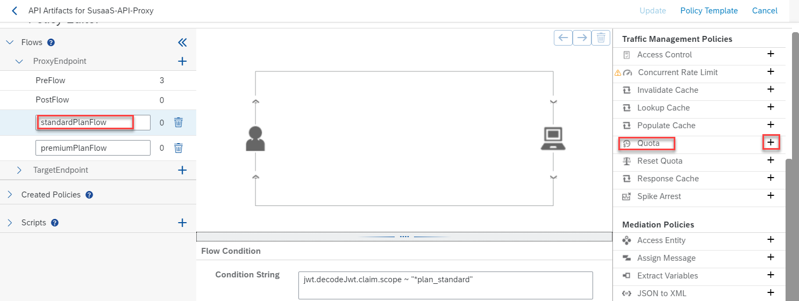](./images/API_Quota04.png?raw=true)

5.3.7. For our sample application, the **standard** and **trial** quota is configure as below. This configuration allows API customers exactly 1200 daily requests to your API. The comprehensive configuration options of the **Quota** policy can be found in the respective documentation [click here](https://docs.apigee.com/api-platform/reference/policies/quota-policy). 

> **Important** - Please ensure, the **Quota** policy configuration once again contains the **Client Id** identifier as in the following sample.

```xml
<Quota async="false" continueOnError="false" enabled="true" type="calendar" xmlns="http://www.sap.com/apimgmt">
 	<Identifier ref="jwt.decodeJwt.claim.client_id"/>
 	<Allow count="1200"/>
 	<Interval>1</Interval>
	<Distributed>true</Distributed>
 	<StartTime>2015-2-11 12:00:00</StartTime>
	<Synchronous>true</Synchronous>
 	<TimeUnit>day</TimeUnit>
</Quota>
```

> **Hint** - For the **premium plan**, you we double the number of daily requests to 2400, but feel free to update it to a configuration of your choice.  

[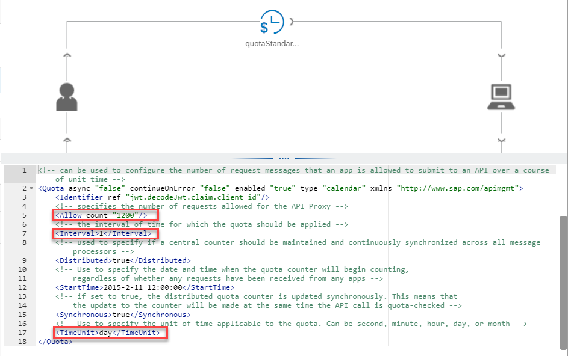](./images/API_Quota05.png?raw=true)


### 5.4. Kyma Authentication Policies

The custom **x-jwt-assertion** header (which is used by Kyma to check whether a request has successfully passed the API Polices) is injected as part of the **TargetEndpoint - PreFlow**. Without going into further details, the respective elements in the **PreFlow** will request an **access token** from the XSUAA token endpoint stored within the **Key Value Maps** created in the beginning of this tutorial. 

For authentication, the associated **Client Id** and **Secret** (also stored in the Key Value Maps) are used. This JWT access token, is **cached** in SAP API Management based on its validity date and is automatically reused for further requests if applicable. 

[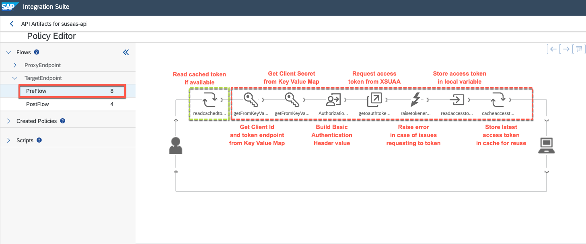](./images/API_KymaAuth.png?raw=true)


### 5.5. Statistics Collection Policies

As part of the **TargetEndpoint - PostFlow**, the requested (or cached) XSUAA JWT access token will be added to the HTTP request as **x-jwt-assertion** custom header. As defined in our API Proxy settings, the **Target Endpoint** is finally again the API Service of our Kyma Cluster (e.g., susaas-api-default.a1b2c3.kyma.ondemand.com). 

If a successful response is returned from our API Service workload, some statistic details are stored before finally returning the response to the client. This includes the requested OData Entity and the XSUAA zone of the client. These details can later be visualized in a custom Monitoring dashboard. 

[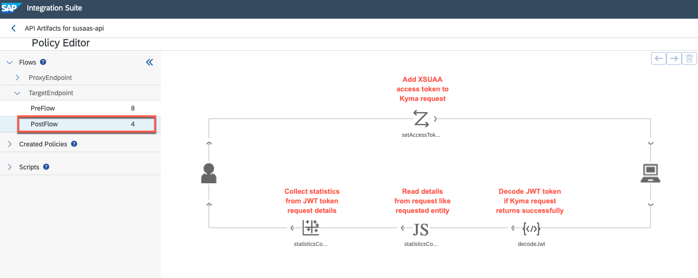](./images/API_Statistics.png?raw=true)

A very simple Monitoring dashboard using these dimensions could look as follows.

[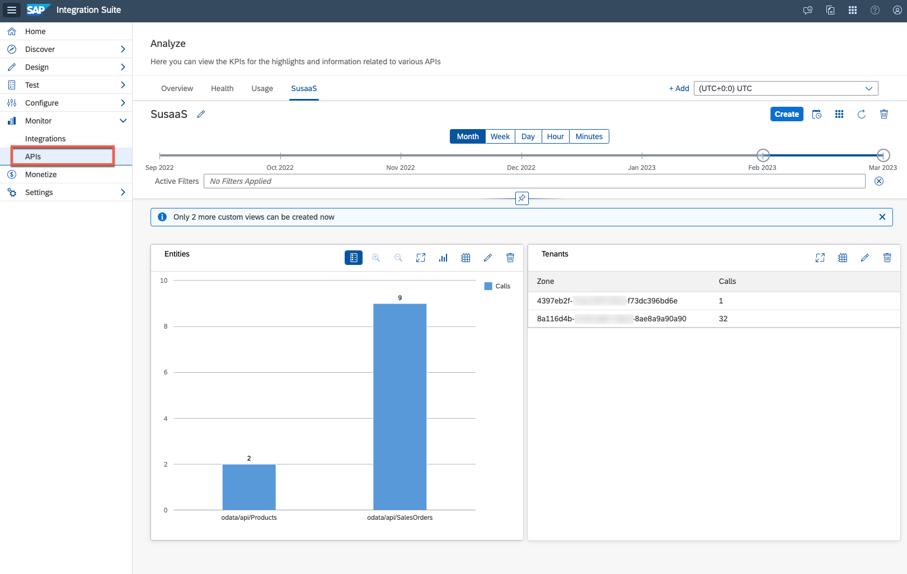](./images/API_StatisticDashboard.png?raw=true)

### 5.6. Update API Proxy and deploy changes 

5.6.1. If you are rebuilding the API Policies from scratch, or you changed any of the existing policies, please click on **Update** in the upper right of your **Policy Editor**. 

[](./images/API_Deploy01.png?raw=true)

5.6.2. Save your API Proxy changes by clicking on **Save**. 

[](./images/API_Deploy02.png?raw=true)

5.6.3. Make sure to **Deploy** the latest version of your API Proxy by selecting the respective option. 

[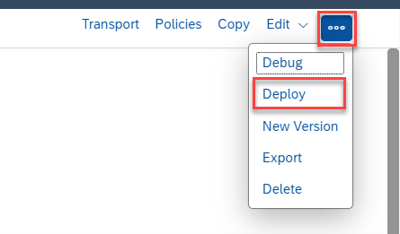](./images/API_Deploy03.png?raw=true)


## 6. Test the setup

That's it, you've successfully integrated your Kyma-based SaaS API with SAP API Management and configured some API Policies. To test the setup, feel free to create a new service key in a Subscriber Subaccount (or use an existing one) and try calling your API endpoint e.g., using the sample HTTP files.

You will notice that calling the API more than once per second (e.g. using Postman or the HTTP files), will result in an error message sent by SAP API Management as the Spike Arrest (Rate Limit) policy will jump in. 

[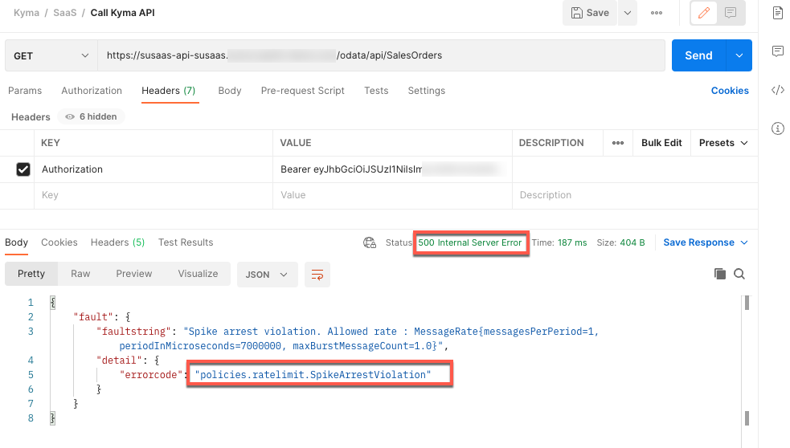](./images/API_SpikeArrest.png?raw=true)


## 7. Further Information

Please use the following links to find further information on the topics above:

* [SAP Help - SAP Integration Suite](https://help.sap.com/docs/SAP_INTEGRATION_SUITE?locale=en-US)
* [SAP Help - SAP API Management](https://help.sap.com/docs/SAP_CLOUD_PLATFORM_API_MANAGEMENT?locale=en-US)
* [apigee Documentation - Policy reference overview](https://docs.apigee.com/api-platform/reference/policies/)
* [apigee Documentation - SpikeArrest policy](https://docs.apigee.com/api-platform/reference/policies/spike-arrest-policy)
* [apigee Documentation - Quota policy](https://docs.apigee.com/api-platform/reference/policies/quota-policy)
* [SAP Help - Flows](https://help.sap.com/docs/SAP_CLOUD_PLATFORM_API_MANAGEMENT/66d066d903c2473f81ec33acfe2ccdb4/08b40d9e47a0470a8b14cc47abab89ec.html?locale=en-US)
* [SAP Help - Condition Strings](https://help.sap.com/docs/SAP_CLOUD_PLATFORM_API_MANAGEMENT/66d066d903c2473f81ec33acfe2ccdb4/66561009a5b343658be2408981d005bb.html?locale=en-US)
* [SAP Help - Policy Types](https://help.sap.com/docs/SAP_CLOUD_PLATFORM_API_MANAGEMENT/66d066d903c2473f81ec33acfe2ccdb4/c918e2803dfd4fc487e86d0875e8462c.html?locale=en-US)