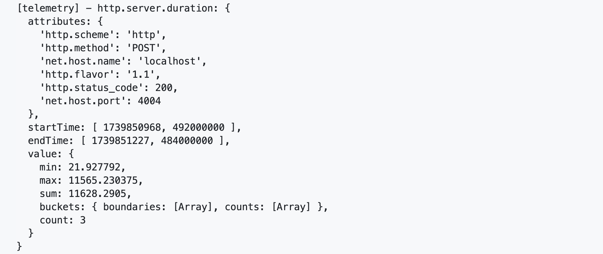

# Cloud Foundry - Observability with Cloud Logging Service

- **Kyma** ❌
- **Cloud Foundry** ✅


**Important** - This part of the tutorial is required for **Cloud Foundry** deployments only!    

In this section, you will learn how to create a new instance of the SAP Cloud Logging service and bind it to your Cloud Foundry application. This will enable you to monitor your application's logs using the SAP Cloud Logging service.

- [Cloud Foundry - Observability with Cloud Logging Service](#cloud-foundry---obeservability-with-cloud-logging-service)
  - [1. Introduction to SAP Cloud Logging Service](#1-introduction-to-sap-cloud-logging-service)
  - [2. Add Observability with Telemetry plugin](#2-add-observability-with-telemetry-plugin)
  - [3. Deply and Bind to SAP Cloud Logging service](#3-deply-and-bind-to-sap-cloud-logging-service)
  - [4. Further information](#4-further-information)

## 1. Introduction to SAP Cloud Logging Service
[SAP Cloud Logging](https://discovery-center.cloud.sap/index.html#/serviceCatalog/cloud-logging) service is an instance-based observability service that builds upon OpenSearch to store, visualize, and analyze application logs, metrics, and traces from SAP BTP Cloud Foundry, Kyma, Kubernetes and other runtime environments. For Cloud Foundry and Kyma, it offers an easy integration by providing predefined contents to investigate load, latency, and error rates of the observed applications based on their requests and correlate them with additional data.

The SAP Cloud Logging service offers multiple service plans (e.g., Standard, Large, and Dev) to cater to different use cases and requirements. These plans provide different ingestion and storage capabilities. For example:
- Standard/Large plans are designed for production workloads, supporting higher data volumes and extended retention.
- Dev plan is only for non-production environments and evaluation purposes which lacks cloud qualities.

For more information, see the [SAP Cloud Logging](https://help.sap.com/docs/SAP_CLOUD_LOGGING/454331d80e3b42b1804d83a672cf098b/what-is-sap-cloud-logging?locale=en-US&state=PRODUCTION&version=Cloud) and its [plans](https://help.sap.com/docs/SAP_CLOUD_LOGGING/454331d80e3b42b1804d83a672cf098b/service-plans?locale=en-US&state=PRODUCTION&version=Cloud) documentation. You can also check the [service innovation guide](https://community.sap.com/t5/technology-blogs-by-sap/from-application-logging-to-cloud-logging-service-innovation-guide/ba-p/13938380) to understand the innovation journey from SAP Application Logging Service towards SAP Cloud Logging Service and its benefits.

## 2. Add Observability with Telemetry plugin
The [Telemetry (@cap-js/telemetry) plugin](https://github.com/cap-js/telemetry) provides observability features such as tracing and metrics, including [automatic OpenTelemetry instrumentation](https://opentelemetry.io/docs/concepts/instrumentation/zero-code/). By enabling the plugin in your project, various kinds of telemetry data will be automatically collected.

Let's add the Telemetry plugin to the project and enable it by customizing few configurations. 

- Switch to **_code_** directory and install dependencies
  ```bash
  ## Run in ./code ##
  npm i @cap-js/telemetry @grpc/grpc-js @opentelemetry/exporter-metrics-otlp-grpc @opentelemetry/exporter-trace-otlp-grpc @opentelemetry/host-metrics @opentelemetry/exporter-logs-otlp-grpc
  ``` 
- Add following configuration under **_requires_** key in both [code/srv/.cdsrc.json](../../../code/srv/.cdsrc.json) and [code/api/.cdsrc.json](../../../code/api/.cdsrc.json) file folder.
  ```json
  "telemetry": {
    "[hybrid]": {
      "kind": "telemetry-to-cloud-logging"
    },
    "[local-with-mtx]": {
      "kind": "telemetry-to-console"
    },
    "[development]": {
      "kind": "telemetry-to-console"
    }
  }
  ```
- Test your application locally by following steps in [section 1](../../4-expert/local-hybrid-development/README.md#1-running-the-multitenant-application-locally-susaas-srv) to see the telemetry in the console.
- This should show traces and metrics data (also refferred to as signals) in the console as shown below:    

  - **_Traces_**:   
    Traces allow you to analyze how a request, message, task, etc. is being processed by your application. It provides a detailed view of the flow of the request and the time taken by each operation.    
    [](./images/local-trace.png?raw=true)    

  - **_Metrics_**:    
    Metrics are measurements captured at runtime. It helps you to understand health and performance of the application.   

    Out of the box, @cap-js/telemetry offers HTTP metric [http.server.duration](https://opentelemetry.io/docs/specs/semconv/http/http-metrics/#metric-httpserverrequestduration) which measures different values like minimum/maximum response time, total duration across requests, distribution of request durations etc. It helps analyze performance, detect bottlenecks, and optimize response times.      
    [](./images/local-metrics-1.png?raw=true)     
    <br/>
    Additionally, @cap-js/telemetry instantiates and provides host metrics like cpu usage and memory usage etc ([@opentelemetry/host-metrics](https://www.npmjs.com/package/@opentelemetry/host-metrics)).       
    [](./images/local-metrics-2.png?raw=true)

## 3. Deply and Bind to SAP Cloud Logging service
- **Prepare for Deployment**
  - Ensure that you have installed following dependencies in your project (check in [code/package.json](../../../code/package.json)).
    ```bash
    ## Run in ./code ##
    npm i @cap-js/telemetry @grpc/grpc-js @opentelemetry/exporter-metrics-otlp-grpc @opentelemetry/exporter-trace-otlp-grpc @opentelemetry/host-metrics
    ```
  - Add following configuration under **_requires_** key in both [code/srv/srv/.cdsrc.json](../../../code/srv/srv/.cdsrc.json) and [code/api/srv/.cdsrc.json](../../../code/api/srv/.cdsrc.json) file.      
    ```json
    "telemetry": {
      "kind": "to-cloud-logging"
    } 
    ```    
  - Add the following property to the [server (susaas-srv)](../../../deploy/cf/mta.yaml#L169) and [api (susaas-api-srv)](../../../deploy/cf/mta.yaml#L286) modules in the [mta.yaml](../../../deploy/cf/mta.yaml) file to set the OpenTelemetry component name which is used while sending signals to cloud logging service.
    ```yaml
    properties:
      OTEL_SERVICE_NAME: ${app-name}
    ```
- **Service Instance Creation / Binding**   
  There are multiple methods to create an instance of the SAP Cloud Logging service as follows.     
    - [Create an SAP Cloud Logging Instance through SAP BTP Cockpit](https://help.sap.com/docs/SAP_CLOUD_LOGGING/d82d23dc499c44079e1e779c1d3a5191/create-sap-cloud-logging-instance-through-sap-btp-cockpit)     
    - [Create an SAP Cloud Logging Instance through Cloud Foundry CLI](https://help.sap.com/docs/SAP_CLOUD_LOGGING/d82d23dc499c44079e1e779c1d3a5191/create-sap-cloud-logging-instance-through-cloud-foundry-cli)     
    - [Create an SAP Cloud Logging Instance through SAP BTP CLI](https://help.sap.com/docs/SAP_CLOUD_LOGGING/d82d23dc499c44079e1e779c1d3a5191/create-sap-cloud-logging-instance-through-sap-btp-cli)     

  It is also possible to create the instance while deployment of the application using the `mta.yaml` file. As the same SAP Cloud Logging service can be used across multiple applications, it is recommended to create the instance separately and bind it to the applications.

  If you want to create the instance during deployment, replace the following code snippet in the [mta.yaml](../../../deploy/cf/mta.yaml) file.

  ```yaml
  # Before
  - name: susaas-logging
    type: org.cloudfoundry.managed-service
    parameters:
      service: application-logs
      service-name: ${space}-susaas-logging
      service-plan: lite

  # After
  - name: susaas-logging
    type: org.cloudfoundry.managed-service
    parameters:
      service: cloud-logging
      service-name: ${space}-susaas-cls-logging
      service-plan: standard
      config:
        ingest_otlp:
          enabled: true
        retention_period: 14
        backend:
          max_data_nodes: 2
        dashboards:
          custom_label: 'SusaaS'
        saml:
          enabled: false
  ```
  To learn more about each parameter and adjust the initialization settings, review the [configuration parameters](https://help.sap.com/docs/SAP_CLOUD_LOGGING/d82d23dc499c44079e1e779c1d3a5191/configuration-parameters) documentation.

  > Note: It is also possible to **_share the same instance of the SAP Cloud Logging service across different spaces_** within a Cloud Foundry organization. This allows for the consolidation of observability data from multiple spaces, streamlining monitoring and analysis. For more details, refer to the [documentation]((https://help.sap.com/docs/cloud-logging/sap-cloud-logging/ingest-via-cloud-foundry-runtime#loiof5a7c993743c4ee79722479371b90b37__share_service_instance_across_different_spaces)).

  If you have created the instance separately, you can declare it in your `mta.yaml` file as a existing resource.

  ```yaml
  - name: susaas-logging
    type: org.cloudfoundry.existing-service
  ```

  To bind the instance to your application, simply declare it in your `mta.yaml` file as a required service. Add `susaas-logging` to the `requires` section of the [server (susaas-srv)](../../../deploy/cf/mta.yaml#L169) and [api (susaas-api-srv)](../../../deploy/cf/mta.yaml#L286) modules in the [mta.yaml](../../../deploy/cf/mta.yaml) file.
  ```yaml
  requires:
    - name: susaas-logging
  ```
- **Deploy the Application**    
  Build and deploy the application, then subscribe to it from a consumer subaccount. Finally, test the application to ensure it functions as expected from the consumer's perspective. Follow the steps from the following sections:    
    - [3 - Build and deploy the Application](../3-cf-build-deploy-application/README.md)
    - [4 - Subscribe a Consumer Subaccount](../4-subscribe-consumer-subaccount/README.md)
    - [5 - Push data to the SaaS API](../5-push-data-to-saas-api/README.md)
    - [6 - Test the application](../6-test-the-application/README.md)

- **Access SAP Cloud Logging Service and Explore Dashboards**   
  - Navigate to the SAP BTP Cockpit, open the cloud logging service and create a service key. Then open the dashboard by navigation to **_View Dashboard_** in actions menu.    
    [](./images/cls-instance.png?raw=true)    

  - Log into the dashboard using the credentials provided (dashboards-username and dashboards-password:) in the service key. This should show the welcome page of the dashboard.     
    [](./images/cls-sk.png?raw=true)      

  - You can explore the dashboard and check the request details, logs, traces, and metrics data of your application under CF tab (as shown below). There are pre-build visulization available to analyze the data such as _**Four Golden Signals**_ (i.e. Latency, Traffic, Errors, and Saturation), **_Performance and Quality_**, **_Requests and Logs_**.    
    [](./images/cls-dashboard-1.png?raw=true)     
    [](./images/cls-dashboard-2.png?raw=true)   
    [](./images/cls-dashboard-3.png?raw=true)   
    [](./images/cls-dashboard-4.png?raw=true)    

  - You can see traces and metrics data that is auto collected by Telemetry plugin in OpenTelemetry/Metrics Tab as shown below:     
    [](./images/cls-dashboard-ot-1.png?raw=true)    
    [](./images/cls-dashboard-ot-2.png?raw=true)     
    
  - If you want to explore metrics in more details, you can navigate to '**_Discover_**' menu item and choose '**_metrics-otel-v1-*_**' data source.     
    [](./images/cls-dashboard-ot-3.png?raw=true)    

> **NOTE**: It is also possible to add custom metric and visualize it in the dashboard. To learn more about creating a custom metric, refer to the [Create a Custom Metric](./custom-metric.md) documentation.

## 4. Further information

Please use the following links to find further information on the topics above:
* [SAP Help - SAP Cloud Logging Service](https://help.sap.com/docs/cloud-logging)
* [SAP Discovery Center - SAP Cloud Logging](https://discovery-center.cloud.sap/serviceCatalog/cloud-logging)
* [CAP - Telemetry Plugin Documentation](https://cap.cloud.sap/docs/plugins/#telemetry)
* [Github - Telemetry Plugin](https://github.com/cap-js/telemetry#readme)

