# Setup SAP Cloud Transport Management

In this part of the **Expert scope** you will learn how to set up the **SAP Cloud Transport Management** service for continuous deployment of your SaaS solution to further SAP BTP subaccounts like a Test oder Production environment.

1. [Introduction](#1-Introduction)
2. [Setup SAP Cloud Transport Management](#2-Setup-SAP-Cloud-Transport-Management)
3. [Assign User Roles and Permissions](#3-Assign-User-Roles-and-Permissions)
4. [Configuring the TMS Landscape](#4-Configuring-the-TMS-Landscape)
5. [Connect to CI/CD Pipeline](#5-Connect-to-CI/CD-Pipeline)
6. [Import queue of Cloud Transport Management](#6-Import-queue-of-Cloud-Transport-Management)
7. [Further Information](#7-Further-Information)


## 1. Introduction

As soon as you have a release candidate of your app version in form of a fully qualified archive, you want to propagate it to your test or production subaccount. You can do it either fully automated as part of a pipeline – ideally based on the Continuous Integration best practices or pipeline templates or with a standardized, enterprise-ready change management process, if you desire more control especially of your production environment – using our cloud-based **SAP Cloud Transport Management** service. 

In the following part of the **Expert Scope** we will show how to combine SAP CI/CD service & SAP Cloud Transport Management service combining the best of both worlds.

We can differentiate - 

* A *development* landscape, based on **Continuous Integration** principles and used to verify single developer changes by an automated pipeline and

* A *delivery* landscape, based on strict **transport management rules** (such as policies, schedules, and roles) and used to verify release candidate versions, where propagation towards production is typically done with manual confirmation)

[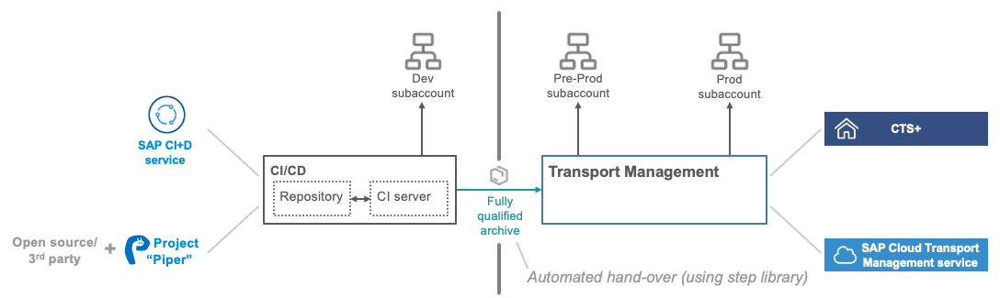](./images/tms1.png?raw=true)

> **Prerequisites** - Make sure that you have three subaccounts (Dev, Test, Prod) to successfully execute the transport and release. Additionally to a **Dev** subaccount, create **Test** and **Prod** subaccounts with a sufficient quota to deploy the application. Alternatively, you can also use three different Cloud Foundry **Spaces** in the same subaccount for testing purposes. For a production scenario, separate subaccounts are recommended. 

> **Hint** - The subaccounts don't have to be in the same region necessarily. Still, if you decide to use the same region, you can share certain services like SAP HANA Cloud among the subaccounts.


## 2. Setup SAP Cloud Transport Management

Before we can combine both services, we need to set up SAP Cloud Transport Management. The required steps are described below.

2.1. To subscribe to SAP Cloud Transport Management, open your subaccount in your SAP BTP Cockpit. 

2.2. Go to **Services** > **Service Marketplace**.

2.3. Search for **Cloud Transport Management**.

2.4. Select the Cloud Transport Management tile, choose (Actions) and click on Create.

2.5. In the subsequent dialog, select the saas-application plan and click on Create.

[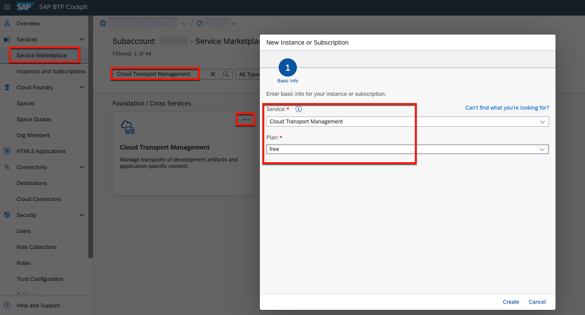](./images/tms2.png?raw=true)


## 3. Assign User Roles and Permissions

After a successful subscription, you need to configure user access to the subscription. You need different role collections for the different Cloud Transport Management roles, and assign roles to the role collections based on the application templates. Afterward, you assign the role collections to users or user groups.

3.1. Create two role collections for your Cloud Transport Management subscription.

* TMS Import Operator
* TMS Admin

3.2. To create a new role collection, in your subaccount, choose **Security** > **Role Collections**.

3.3. Click on **+**.
     
[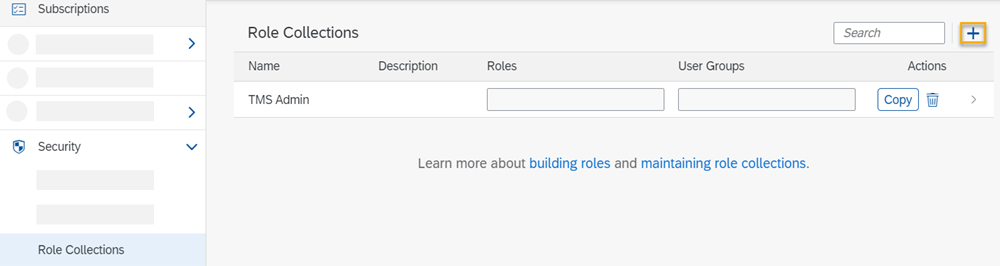](./images/tms3.png?raw=true)

3.4. Enter the name **TMS Import Operator** for the new role collection, and click on **Create**. 
     
[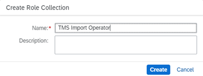](./images/tms4.png?raw=true)

3.5. Repeat the previous steps to create the **TMS Admin** role collection.

3.6. The new role collections are added to the list.
     
[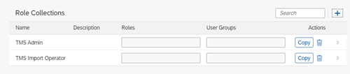](./images/tms5.png?raw=true)

3.7. In your subaccount, choose **Services** > **Instances and Subscriptions**.
  
[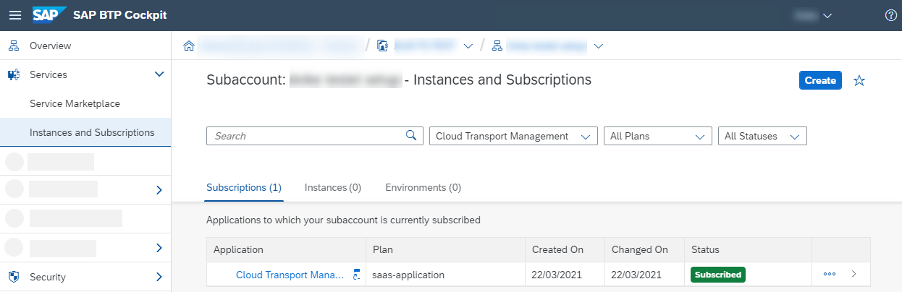](./images/tms6.png?raw=true)
    
3.8. On the Subscriptions tab, in the Cloud Transport Management row, choose ... (Actions) and Manage Roles.
  
[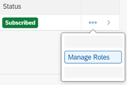](./images/tms7.png?raw=true)

3.9. The default role templates are displayed.
  
[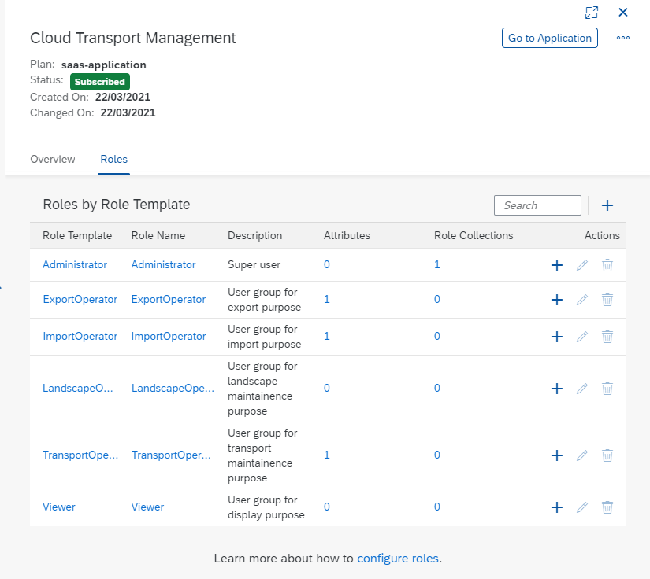](./images/tms8.png?raw=true)
  
3.10. Assign the Cloud Transport Management roles to the role collections you just created.

* ImportOperator > TMS Import Operator
* Administrator > TMS Admin
  
[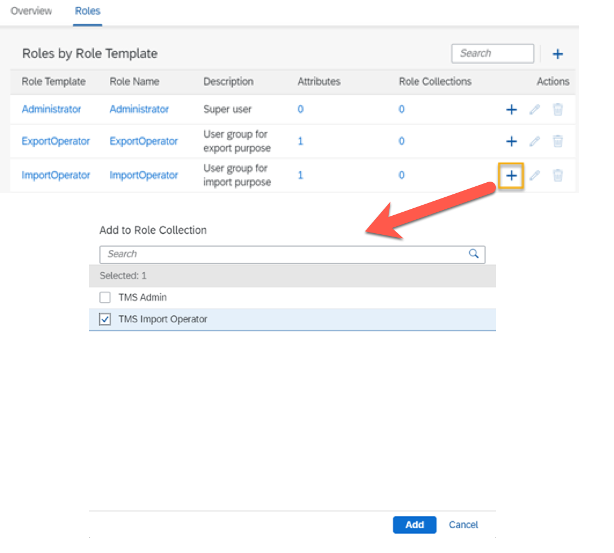](./images/tms9.png?raw=true)
   
3.11. Assign the new role collections (TMS Import Operator & TMS Admin) to your own user.
     
[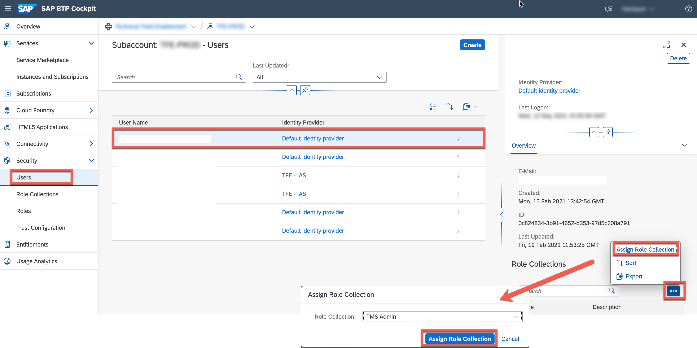](./images/tms11.png?raw=true)


## 4. Configuring the TMS Landscape

Before you can use SAP Cloud Transport Management to transport cloud applications or application content between different subaccounts, you must configure your landscape for transports.

The following steps are required to set up the landscape:

* Create Transport Destinations
* Use the Transport Landscape Wizard
   
Follow the next steps to configure the transport landscape.


### Create Transport Destinations
   
In SAP Cloud Transport Management, transport destinations are used to address the target end point of a deployment process.

4.1. Go to Subaccount where you subscribed to SAP Cloud Transport Management.

4.2. Create two **destinations** pointing to the Test and Prod subaccounts.

> **Important** - Make sure the user you provide in the destination is a Space Developer in the Cloud Foundry Space of the target subaccount. 
  
| Destination  | URL                                                                                         | Authentication       | User/Password                             |
| ------------ | ------------------------------------------------------------------------------------------- | -------------------- | ----------------------------------------- |
| **TMS-TEST**   | https://deploy-service.cfapps.< default-domain >/slprot/< org-test >/< space-test >/slp     | Basic Authentication | username & password of the technical user |
| **TMS-PROD** | https://deploy-service.cfapps.< default-domain >/slprot/< org-prod >/< space-prod >/slp | Basic Authentication | username & password of the technical user |

In the following screenshot, the TEST and PROD subaccounts are situated in different regions. This is possible, as long as the required services are available in a certain region. 

[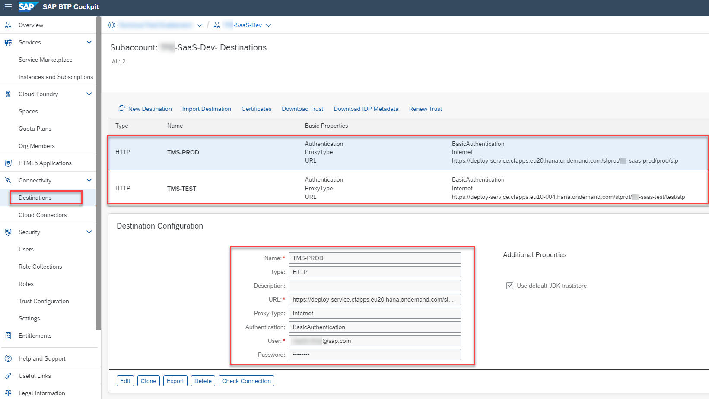](./images/tms12.png?raw=true)

> **Hint** - Instead of Basic Authentication, it is also possible to use OAuth2Password Authentication. More details can be found [here](https://help.sap.com/viewer/7f7160ec0d8546c6b3eab72fb5ad6fd8/Cloud/en-US/c9905c142cf14aea86fe2451434faed9.html)


### Use the Transport Landscape Wizard
   
You can use the Transport Landscape Wizard to configure the transport nodes and transport routes of simple transport landscapes.

4.3. Open your SAP Cloud Transport Management subscription.

[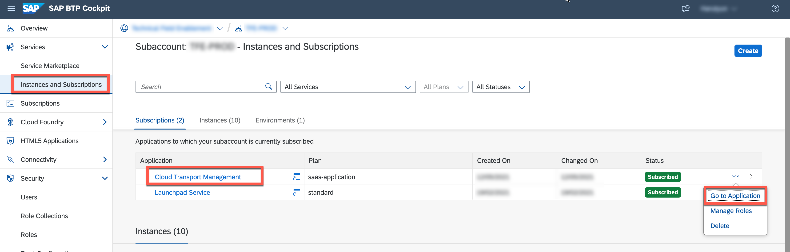](./images/tms10.png?raw=true)

4.4. Start the **Landscape Wizard**.

4.5. Choose Two-Node Landscape (Test and Prod) and go to the next step.

> **Hint** - Two Nodes, since the **Dev** subaccount is part of the development landscape and is delivered by CI.

[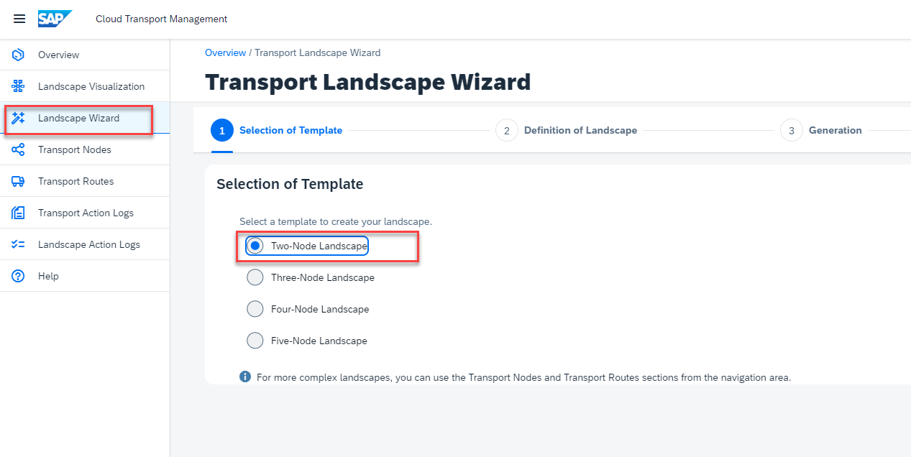](./images/tms13.png?raw=true)

4.6. Provide the details of nodes:
  
| Node   | Name | Allow Upload | Forward Mode | Content Type     | Destination |
| ------ | ---- | ------------ | ------------ | ---------------- | ----------- |
| Node 1 | TEST | true         | Auto         | Multi-Target App | TMS-TEST    |
| Node 2 | PROD | false        | Auto         | Multi-Target App | TMS-PROD    |

[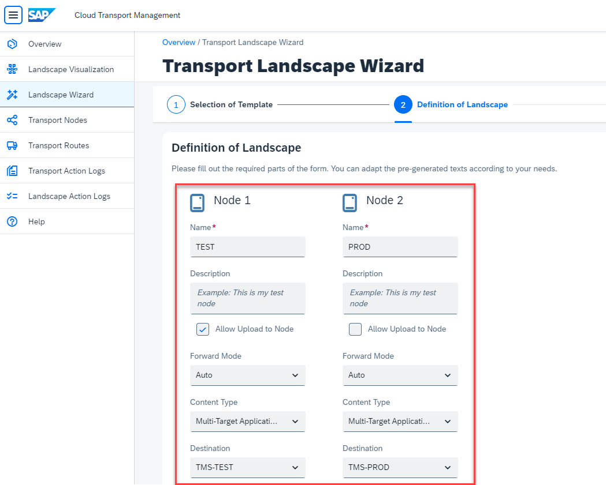](./images/tms14a.png?raw=true)
  
4.7. Give a name for the transport route: **route_test_prod**
    
[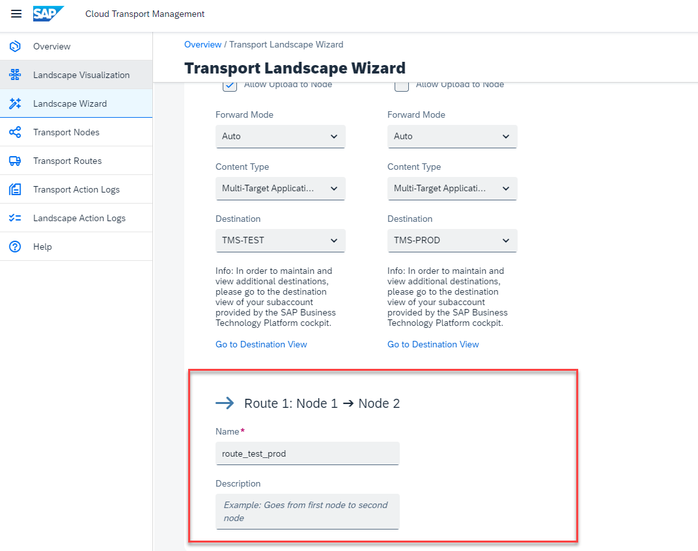](./images/tms14b.png?raw=true)
  
4.8. After successfully finishing the step, you will find the newly defined Nodes in **Landscape Visualization**

[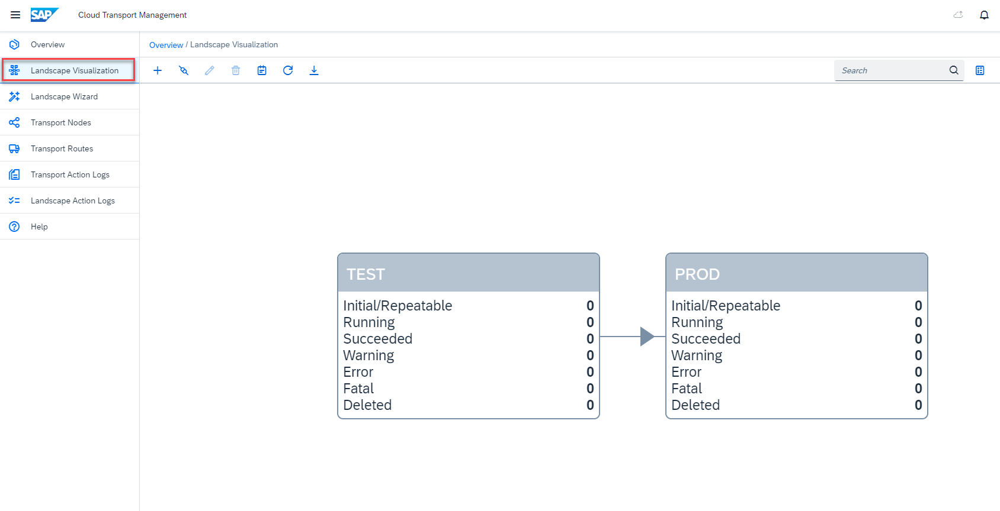](./images/tms15.png?raw=true)


## 5. Connect to CI/CD Pipeline
   
Follow the next steps to connect the CI/CD Pipeline to Cloud Transport Management

[](./images/tms1.png?raw=true)

5.1. First, create new service instance of **Cloud Transport Management** with service plan **standard**.

> **Hint** - If the service plan **standard** is not available, please add it in the **Entitlements**.<br>
>[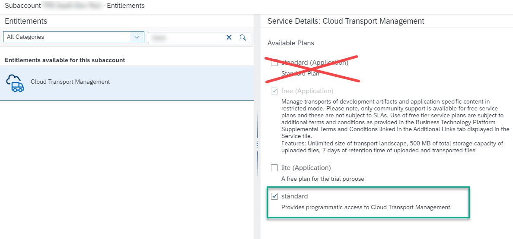](./images/tmsentitlement.png?raw=true)

[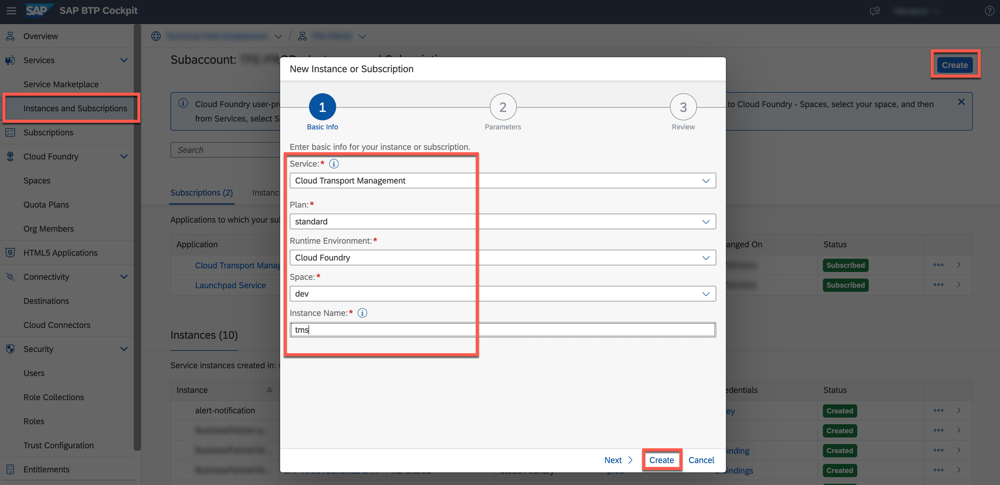](./images/tms16.png?raw=true)

5.2. Create a new **Service Key** and name it  tms-service-key.

[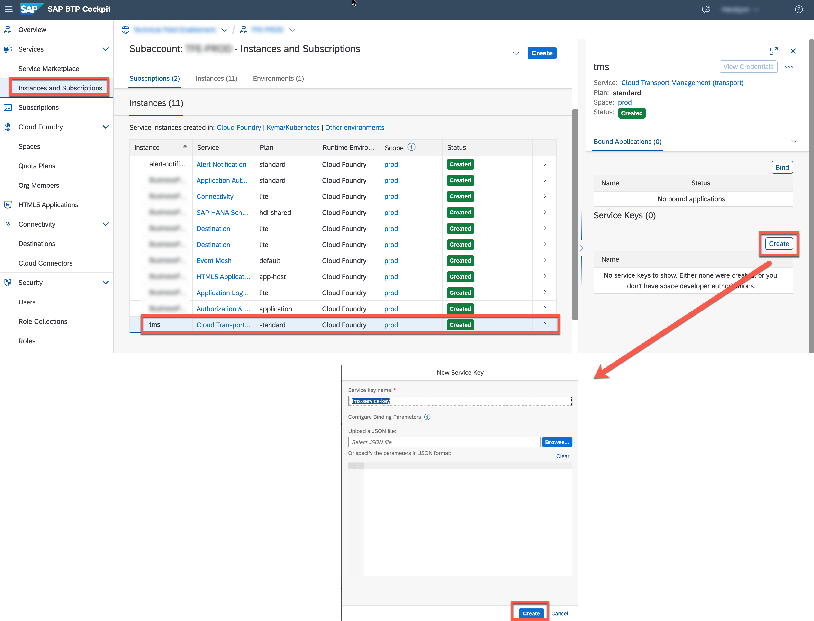](./images/tms17.png?raw=true)

5.3. View the credentials of the service key and copy the JSON.

[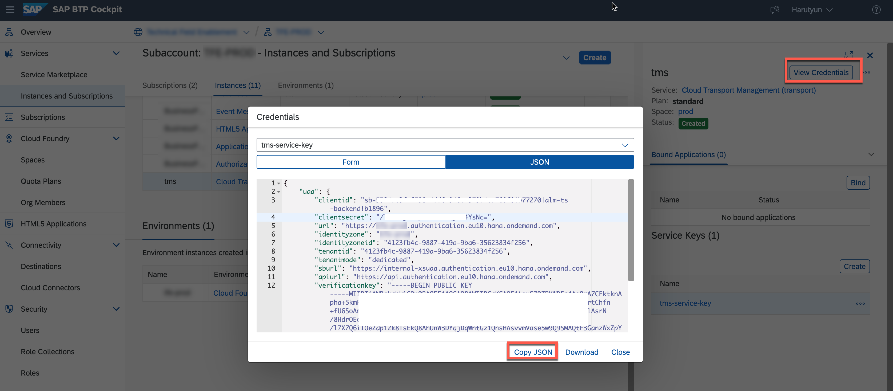](./images/tms18.png?raw=true)

5.4. Open the SAP CI/CD service and go to the **Credentials** tab to create credentials for SAP TMS.
    
5.5. Create a new credential value by clicking on **+**.
  
[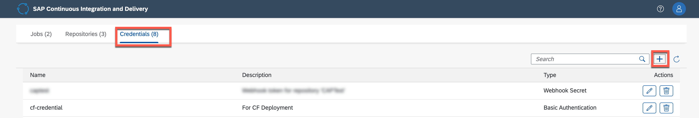](./images/tms19.png?raw=true)

5.6. Provide a name for the credential value like **"tms"**.

5.7. As Type, choose **Service Key**.

5.8. Paste the copied JSON from the previous step and create the credential value.

[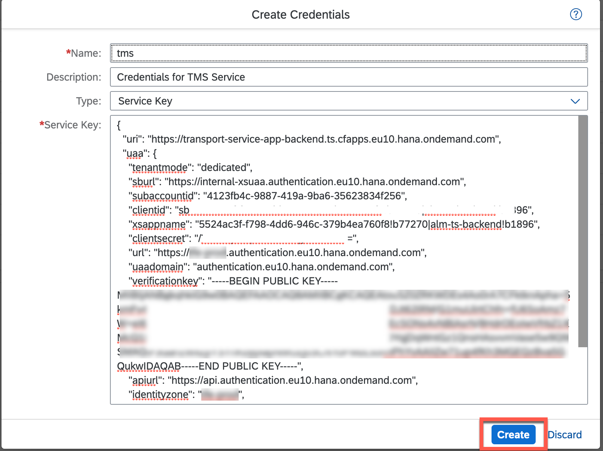](./images/tms20.png?raw=true)

5.9. Activate the **Upload to TMS** in your pipeline by adjusting your ***.pipeline > config.yml*** file. 

5.10. To upload the build artifact to SAP Cloud Transport Management, add the following parameter in the **Release stage**.
      
```bash
  tmsUpload: true  
```

5.11. Comment out the following code snippet in the **steps** section.

```bash
  tmsUpload:
    nodeName: 'TEST'
    credentialsId: 'tms'
    customDescription: 'TMS Upload'
```

> **Hint** - *nodeName* is the TEST Node defined in SAP Cloud Transport Management, *credentialsId* is the credential name defined in the SAP CI/CD service credential store. 

5.12. Push the pipeline changes to Github.

```bash
  git add .
  git commit -m "Pipeline upload to TMS"
  git push
```

5.13. Changes in GitHub will trigger a run of the SAP CI/CD service.
    
[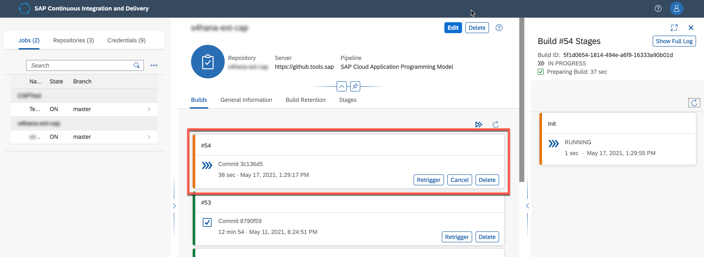](./images/tms21.png?raw=true)


## 6. Import queue of Cloud Transport Management
    
After the pipeline has finished all (Build > Test > Deploy to Dev > Upload TMS), you can find the build results in the **TEST node queue** of SAP Cloud Transport Management.
    
6.1. Open Cloud Transport Management, switch to **Transport Nodes** and select the **TEST** node.

6.2. You will find one entry in a queue with the name **TMS Upload** which is the mtar archive created by the SAP CI/CD service.

[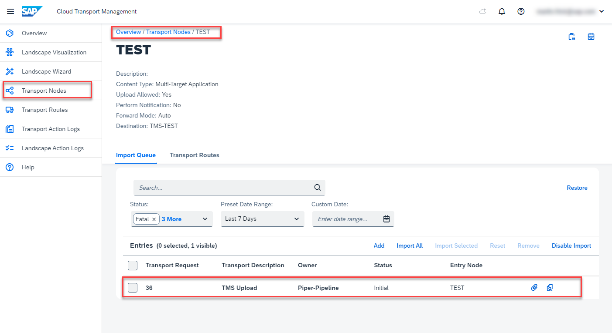](./images/tms22.png?raw=true)

6.3. Before you import this transport request, you need to provide the correct **MTA Extension Descriptor** file for the stage. To do so, please click on the following icon in the top right of your screen. 

[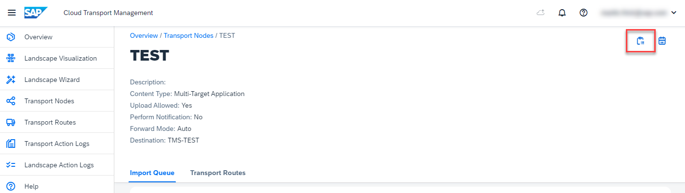](./images/tms22a.png?raw=true)

6.4. In the pop-up, please click on **Add** to upload a new MTA Extension Descriptor (mtaext) file.

[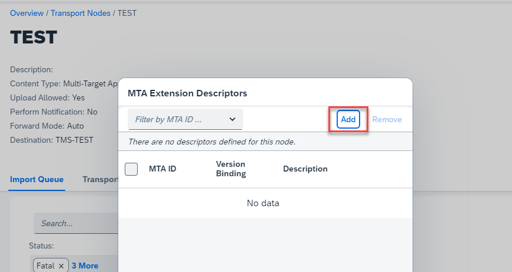](./images/tms22b.png?raw=true)

6.5. Click on **Browse** and upload the correct mtaext file for the current stage. Feel free to change the description. Click on **Submit new descriptor** to finish the upload.

> **Important** - Make sure you pick the right mtaext file containing your hashed API Service Broker credentials (e.g. free-tier-private.mtaext). 

[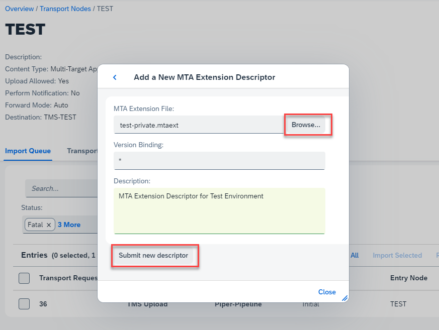](./images/tms22c.png?raw=true)

6.6. You will see the uploaded **mtaext** file in the list of available MTA Extension Descriptors. Click on the details icon to check again whether you picked the correct mtaext file. 

[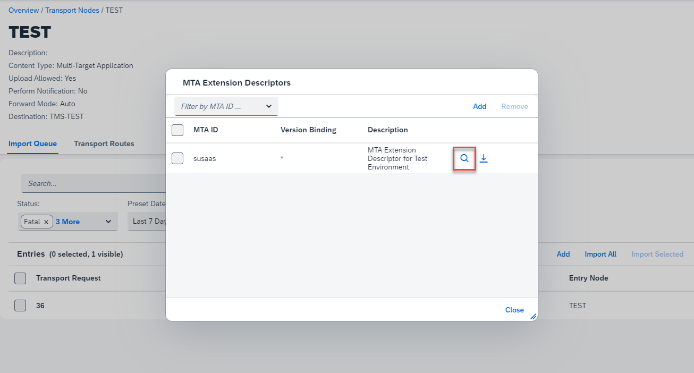](./images/tms22d.png?raw=true)

6.7. Double-check the content and make sure you picked the correct mtaext file containing the hashed API Service Broker credentials for the current stage. If yes, you can close the pop-up and return to the Node overview page. 

[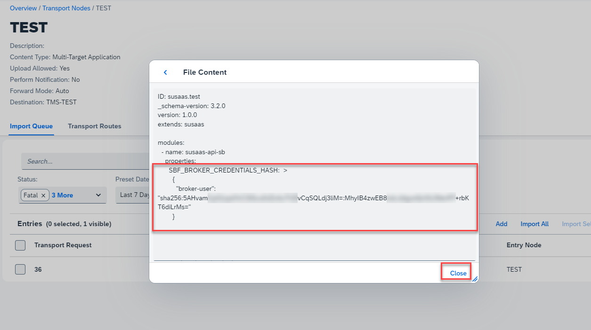](./images/tms22e.png?raw=true)

6.8. Import the changes to the TEST Node by checking the content details of this transport request first.

[](./images/tms24.png?raw=true)

6.9. Select the transport request entry and press **Import Selected**.

[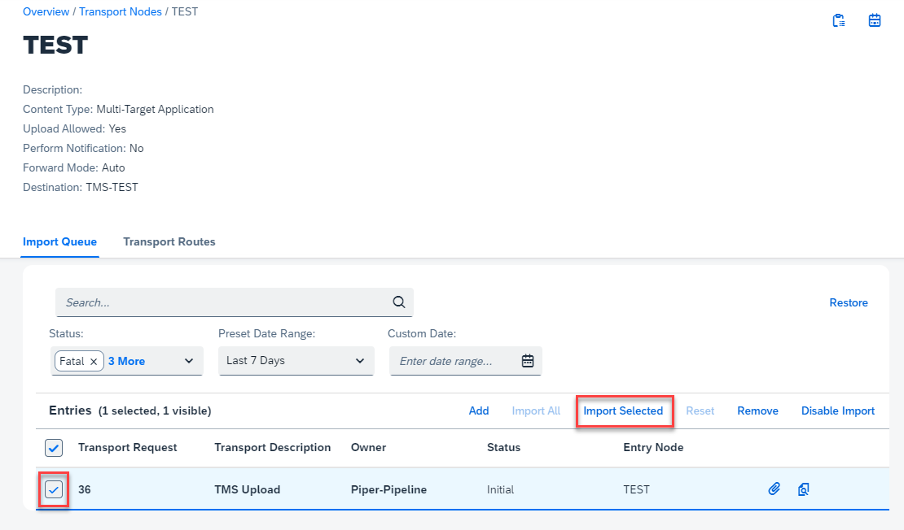](./images/tms23.png?raw=true)

6.10. After **Approval**, SAP TMS will run a deployment to the **TEST** subaccount and forward the mtar file to the PROD Node.

[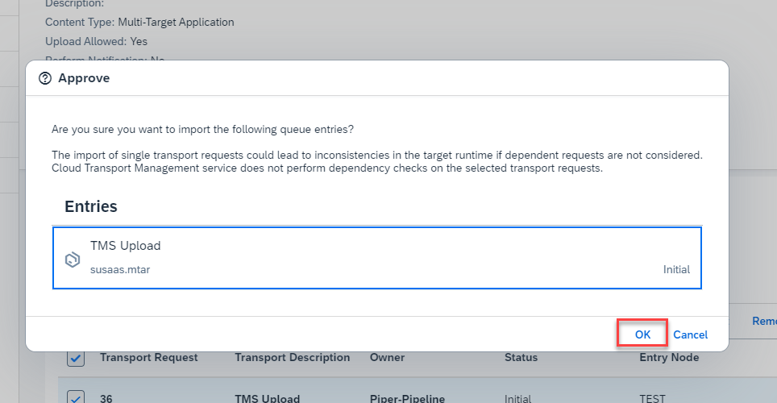](./images/tms24a.png?raw=true)

6.11. While the deployment is running, you can check the **Logs** of the transport entry. 

> **Hint** - In case of issues during deployment, you can find the details of failure in this log.

[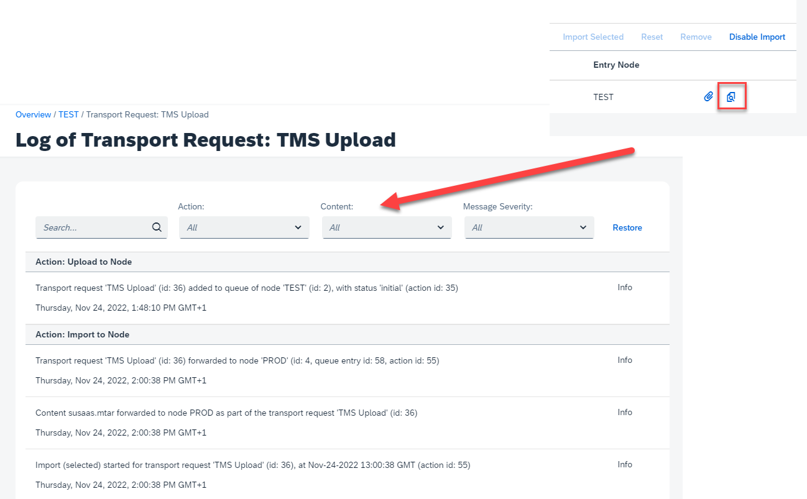](./images/tms25.png?raw=true)

6.12. After finishing the import you will find the application deployed to your **TEST Subaccount**.

[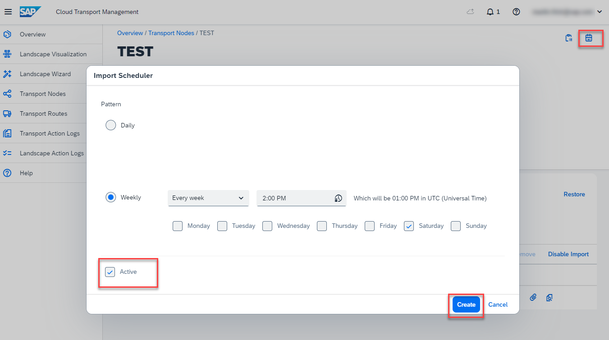](./images/tms26.png?raw=true)

6.13. Similarly, you can import the application to your PROD subaccount from the **PROD Node queue**.

> **Important** - Don't forget to also provide the correct mtaext file for the production environment!

[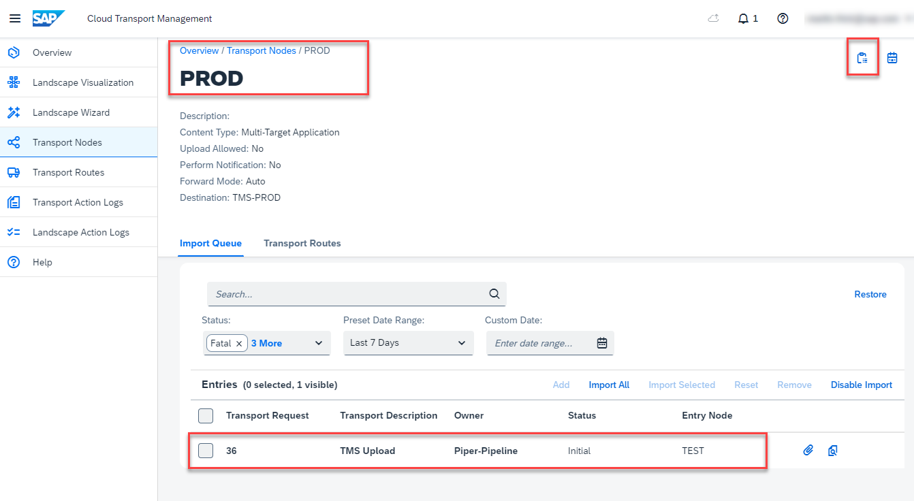](./images/tms27.png?raw=true)

That's it, you've successfully configured SAP Cloud Transport Management Service and implemented an integration with SAP CI/CD service. This allows you to build and deploy your project to your Dev subaccount using SAP CI/CD and a convenient transport option to your Test and Prod subaccounts using SAP Cloud Transport Management.

## 7. Further information

Please use the following links to find further information on the topics above:

* [SAP Help - SAP Cloud Transport Management](https://help.sap.com/docs/TRANSPORT_MANAGEMENT_SERVICE?locale=en-US)
* [Project Piper - Integrate SAP Cloud Transport Management Into Your CI/CD Pipeline](https://www.project-piper.io/scenarios/TMS_Extension/)
* [SAP Blog - How to integrate SAP Cloud Transport Management into your CI/CD pipeline](https://blogs.sap.com/2019/08/20/how-to-integrate-sap-cloud-platform-transport-management-into-your-cicd-pipeline/)
* [Discovery Center - SAP Cloud Transport Management](https://discovery-center.cloud.sap/serviceCatalog/cloud-transport-management)
* [SAP-Samples - Enhance core ERP business processes with resilient applications on SAP BTP](https://github.com/SAP-samples/btp-build-resilient-apps/tree/extension)