# Custom Domain Usage

- ### **Kyma** ❌
- ### **Cloud Foundry** ✅

In this part of the mission you will learn how to configure a custom domain for your SaaS application consumers. The topic of custom domain usage is very comprehensive and we can only cover certain sample scenarios. Depending on your requirements as a SaaS provider and the demand of your customers, things can get complicated quickly! 

- [Custom Domain Usage](#custom-domain-usage)
  - [1. Introduction](#1-introduction)
  - [2. SSL certificates](#2-ssl-certificates)
  - [3. Domain considerations](#3-domain-considerations)
    - [Number of SaaS applications](#number-of-saas-applications)
    - [Dev/Test/.../Production stages](#devtestproduction-stages)
    - [Multi region deployment](#multi-region-deployment)
    - [Dash or dot based (region/stage) separation](#dash-or-dot-based-regionstage-separation)
    - [Consumer domain](#consumer-domain)
    - [Summary](#summary)
  - [4. Custom Domain Service](#4-custom-domain-service)
  - [5. CNAME record in DNS](#5-cname-record-in-dns)
  - [6. Custom Domain Route Mapping](#6-custom-domain-route-mapping)
  - [7. Multi region intelligent routing](#7-multi-region-intelligent-routing)
  - [8. Further Information](#8-further-information)

So, in this part of the **Expert Features**, you will learn how to get from the default cfapps domain (e.g., **abc-7k7tmze3-susaas.cfapps.eu10...**), to a SaaS domain based on your custom domain (e.g., **abc-7k7tmze3.susaas.sap-demo.com**) to a proper consumer-specific custom domain (e.g., **abc.susaas.sap-demo.com**) using the Custom Domain Service. 

If you want to set up the sample scenario with your own custom domain, please make sure to to use the correct MTA extension descriptor file provided in the *files* directory ([click here](./files/free-basic-domain.mtaext)) of this **Expert Feature**. Search for the placeholder \<your domain\> and replace it with your desired wildcard domain configured in the Custom Domain Service as you can see in the sample screenshot below. 

[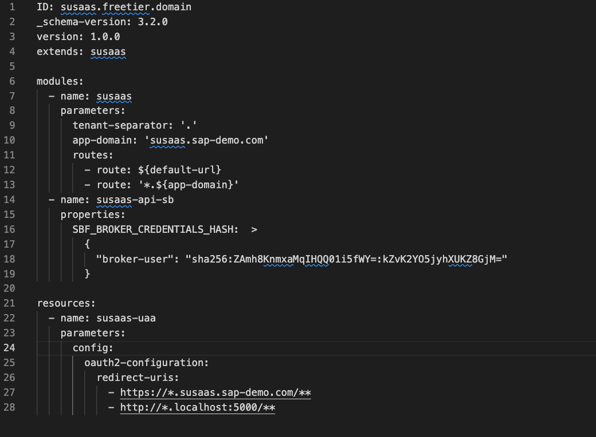](./images/CDS_Mtaext.png?raw=true)

Place the file in your */deploy/cf/mtaext* directory adding the **-private** filename suffix. Then go ahead with the build and deployment as explained in the **Basic** and **Advanced** Features. 

```
mbt build -e ./mtaext/free-basic-domain-private.mtaext
cf deploy mta_archives/susaas_0.0.1.mtar 
```


## 1. Introduction

The SaaS application in our **Basic** and **Advanced Features**, uses the default cfapps domains offered by SAP in the different regions like **cfapps.eu10.hana.ondemand.com**. The resulting consumer subdomains look similar to the following in the sample scenario:

* **abc-8db8a40e**-susaas-test.cfapps.eu10.hana.ondemand.com
* **abc-7k7tmze3**-susaas.cfapps.eu10.hana.ondemand.com

As the consumer-specific hostname is build based on the consumer's subaccount subdomain (e.g., abc-7k7tmze3), the application specifier and sometimes even the landscape (e.g., dev or test), the resulting full qualified domain (FQDN) name doesn't look very nice as the consumer subaccount subdomain by default contains a random ID. This ID is generated when keeping the recommended default values while setting up a new consumer subaccount. 

> **Important** - We **do not** recommend to change the autogenerated subdomain when setting up new consumer subaccounts, as subdomains will be blocked in a whole region! While this might work in some scenario, you will e.g., face issues when trying to create a subaccount subdomain for popular company names as these subdomains might already be taken!

**Don't do this!**

[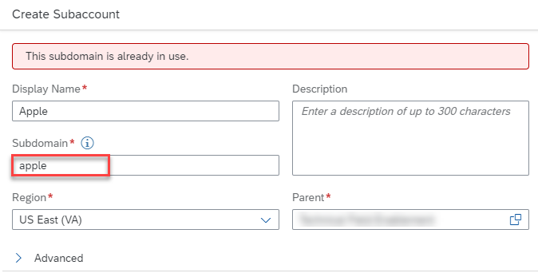](./images/SubDom_fix.png?raw=true)

**Please do this instead!**

[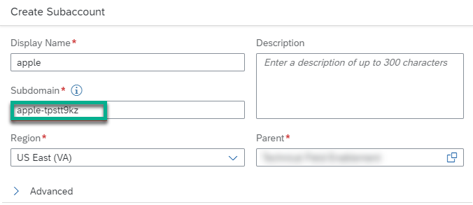](./images/SubDom_dyn.png?raw=true)

Okay, so how can the above setup be improved to achieve an enterprise-ready setup with a fully flexible consumer subdomain based on a custom domain owned by the provider like **susaas.com** or **susaas.sap-demo.com**? Well, This is exactly what you will learn in this part of the **Expert Features**.

> **Important** - The [**SAP Custom Domain Service**](https://discovery-center.cloud.sap/serviceCatalog/custom-domain?service_plan=custom-domain) can only be added as **paid plan** in **PAYG** or **CPEA** accounts. Please check the respective pricing details ([click here](https://discovery-center.cloud.sap/serviceCatalog/custom-domain?service_plan=custom-domain&region=all&commercialModel=cloud&tab=service_plan)) before adding and using this service in your SAP BTP account. 


## 2. SSL certificates 

While the service name resonates differently, the Custom Domain service is charging you based on the number of activated SSL certificates. A single SSL certificate can be used to secure traffic of multiple domains or subdomains. Therefore, please make yourself familiar with some background knowledge on SSL certificates using your favorite search engine before setting up your Custom Domain service instance. It might save you a bunch of money!

In case of a SaaS solution on SAP BTP, you as a SaaS provider should try to run your application with a minimal number of SSL certificates that cover your custom domain requirements. Especially the usage of multi-domain certificates or SAN certificates, can be useful in many scenarios. 

Below you can see some samples of SSL certificate types issued for one or multiple (wildcard) domains. 


**Single-Domain SSL Certificate**

Enabling a secure connection for a dedicated single domain or subdomain. 

> susaas.com


**Wildcard SSL Certificate**

Enabling a secure connection for a random number of subdomains of a dedicated domain. Does not secure the domain itself. 

> *.susaas.com<br>

> **Hint** - Supports same level subdomains only. For securing a sub-level subdomain, a new certificate is required. For example **.eu.susaas.com* would require a new wildcard certificate. 


**Multi-Domain SSL Certificate**

Enabling a secure connection for several dedicated domains. Also known as SAN certificate. Cannot include wildcard subdomains. 

> susaas.com <br>
eu.susaas.com <br>
us.susaas.com


**Multi-Domain Wildcard SSL Certificate**

Enabling a secure connection for a random number of subdomains. Also known as SAN wildcard certificate.

> *.susaas.com<br>
*.eu.susaas.com<br>
*.us.susaas.com

> **Hint** - Keep in mind - a wildcard certificate only secures all subdomains on the same level but not on sub-levels. For example **.dev.eu.susaas.com would* require a new certificate. 


**Further Multi-Domain SSL Certificate options**

Also combinations of multiple subdomains and dedicated domains are possible in multi-domain certificates. <br>

> susaas.com<br>
*.susaas.com<br>
*.eu.susaas.com<br>
*.dev.eu.susaas.com

Depending on your requirements, costs for an SSL certificate can quickly increase, whereas a single-domain SSL certificate is the cheapest option, while a multi-domain SSL certificate is the most expensive but powerful solution. Make sure you understand your setup when it comes to Custom Domain requirements in development, test and production landscapes. Also when providing your solution in different regions, you might need further subdomains and certificates. 

So in the end it's up to you to calculate and decide for your own approach based on the costs and expected effort. 


## 3. Domain considerations

When using a custom domain, for your SaaS scenario, there's a few things to consider. Below you can find an excpert of the most important aspects. Please make sure to choose the correct setup for your requirements, as later adjustments might lead to unexpected URL changes for your existing consumers. Also keep in mind, the following considerations are not independent from each other. You will probably end up in a mix of them depending on your landscape. 

> **Hint** - While for most of the scenarios, a dash-based separation looks like a more cost efficient solution, make sure that you are clear on the negative side-effects. Especially with many consumers, the DNS maintenance should not be underestimated compared to the usage of a dot-based separation. 

### Number of SaaS applications

[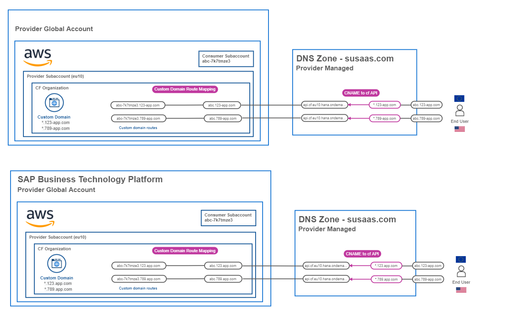](./images/CD_Apps.png?raw=true)

The number of certificates required, depends on the number of SaaS applications you want to use in your landscape. Let's assume the following scenario where you only have one SaaS application in your subaccount:

* *.app.com

This leaves you with the requirement for one single SSL wildcard certificate. Okay, but how does this look in case of three different SaaS applications? 

* *.123.app.com or *.123-app.com
* *.456.app.com or *.456-app.com
* *.789.app.com or *.789-app.com

Now you suddenly need three wildcard SSL certificates or a SAN certificate including all of these domains. So you need to keep in mind how many apps you might deploy in your provider subaccount in the future and decide how to differentiate between them on a domain-basis.  

> **Hint** - Things can be cheaper using a dash as app separator, but it will in increase the effort on your side. In this case, one certificate for ***.app.com** is sufficient, but the maintenance effort on the DNS side will increase! Furthermore, this will (as of today) only work in case your consumer receives a separate subaccount for each of the SaaS applications. <br>
>* *-123.app.com
>* *-456.app.com
>* *-789.app.com<br>
>
> Wildcard CNAMEs like **\*-123.app.com** pointing all consumers to the **123 app** cannot be used! Every consumer needs its own CNAME record in case of a dash-based separation. Find more details below.

<br> 


### Dev/Test/.../Production stages

Depending on your setup, you will need at least two stages in your landscape which are **development** and **production**. Even better would be a three tier landscape including a **test** stage. It is not advisable to deploy and modify an application in a productive environment directly. Well, what does that mean from an SSL certificate perspective? Let's check a scenario with three stages. 

For sure, what you can do is to use different domains or subdomains for these stages:

* *.dev.susaas.com or *.dev-susaas.com (Dev) 
* *.test.susaas.com or *.test-susaas.com (Test) 
* *.susaas.com (Prod)

That means, that three wildcard SSL certificates are required or one SAN certificate containing all three wildcard domains. So it's a comparably cost intensive approach from an SSL certificate perspective. A cheaper alternative, would be the following approach:

* *-susaas-dev.cfapps.eu10.hana.ondemand.com (Dev)
* *-susaas-test.cfapps.eu10.hana.ondemand.com (Test)
* *.susaas.com (Prod)

As you can see, for the development and test stage, you just simply keep the default **\*.cfapps** domain, which any SAP BTP customer can use for free. The only job you have to do, is making sure that you have an application and landscape identifiert in our hostname. Only for the production environment, you're using a nice and shiny domain, so you end up with requiring only one SSL wildcard certificate for **\*.susaas.com**. 

[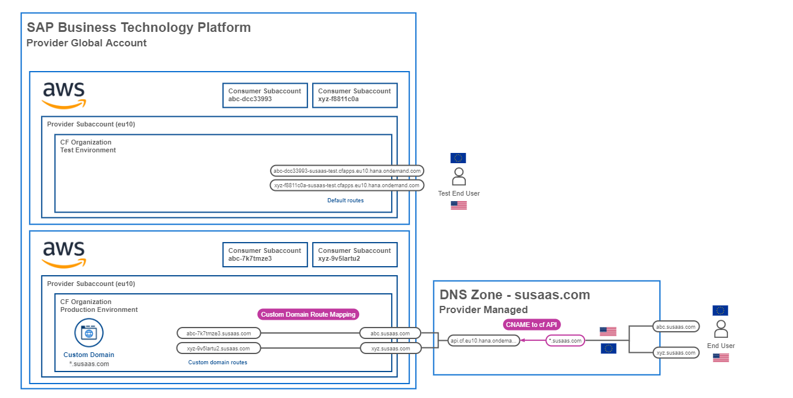](./images/CD_Stages.png?raw=true)

*Sample Setup for two stages*

For sure, if one of your customer wants to have a test account, the URL will not be very shiny and self explainatory to them. If you want to achieve this, and you consumers cannot live with the default cfapps domain, you could think about the following setup:

* *-susaas-dev.cfapps.eu10.hana.ondemand.com (Dev)
* *.test.susaas.com (Test) or  *.test-susaas.com (Test)
* *.susaas.com (Prod)

This will at least save you one wildcard certificate for the development landscape and you end up with two wildcard SSL certificates only. By the way, the following setups are not possible or recommended! 

> **Hint** - **xyz** is a customer in the following samples

* >**xyz.susaas.dev**.cfapps.eu10.hana.ondemand.com<br>
  Not possible, as no further wildcard subdomains can be created for the default **cfapps** domain. Only SAP can create additional subdomains. You need to separate consumers, stages and apps with dashes when using the cfapps domain. 
* > **\*xyz-dev**.cfapps.eu10.hana.ondemand.com<br>
  Not recommended, as routes in a certain region are unique! You might want to create routes for multiple applications in your subaccount in the future. Always include an application separator when using the default domain so that the same consumers can subscribe to multiple apps of the same provider.
* > **\*xyz-susaas**.cfapps.eu10.hana.ondemand.com <br>
  Not recommended, as routes in a certain region are unique! You will not be able to create routes for multiple stages (dev, test) in this case! Always include the stage separator when using the default domain! Only exception - When the production landscape is also using the default cfapps domain, you can skip the stage separator. 

So make up your mind! How many stages are you gonna use in your landscape and which of these stages will use the default cfapps domain and which of them uses a custom domain? Don't forget, each wildcard SSL certificate will cost you extra money.  

> **Hint** - Again, things can be cheaper using a dash as stage separator, but it will increase the effort on your side. In this case, one wildcard certificate for ***.susaas.com** is sufficient, but the maintenance effort on the DNS side will increase! For the **dev** and **test** stages, you need to create all DNS CNAME records manually. Furthermore, this setup will only work with separate subaccounts for each stage. <br>
>* *-dev.susaas.com
>* *-test.susaas.com
>* *.susaas.com
>
> Wildcard CNAMEs like **\*-dev.susaas.com** pointing to the development stage cannot be used! Every customer needs its own CNAME record in case of a dash-based stage separation. Find more details below.

<br> 

### Multi region deployment

If you decide to run your application in multiple regions around the globe, you have to understand the influence on the Custom Domain requirements. While Custom Domains can be easily shared between Subaccounts of the same region (of the same Global SAP BTP Account) this is **not possbile** across regions (e.g., from eu10 to us20). 

Let's assume the following scenario in which your application is supposed to run in three different regions:

* *.eu10.susaas.com
* *.us10.susaas.com
* *.ap20.susaas.com

In case you want to separate your regional domains by a dot, that means you will need three wildcard certificates for that scenario. Additionally, SAP will charge you for the Custom Domain in each region. 

> **Hint** - Once again, things can be cheaper using a dash as stage separator, but it will increase the effort on your side. In this case, one wildcard certificate for **\*.susaas.com** is sufficient, but the maintenance effort on the DNS side will increase! All CNAME records have to be maintained manually. <br>
>* *-eu10.susaas.com
>* *-us10.susaas.com
>* *-ap20.susaas.com
>
> Wildcard CNAMEs like **\*-eu10.susaas.com** pointing to the **eu10 landscape** cannot be used! Every consumer needs its own CNAME record for each landscape in case of a dash-based separation. Find more details below.

<br>

### Dash or dot based (region/stage) separation

The format of your consumer domains highly influences the number of required SSL certificates. To save on the cost of SSL certificates, it can be useful to use dashes to separate regions or landscapes instead of using separate (sub-)subdomains. Check the following samples to see how to reduce the number of wildcard certificates required by using dashes instead of subdomains and a single wildcard certificate.

> **Important** - Keep in mind that the cost of your SSL certificates and the cost of the Custom Domain Service are two very different animals. While one wildcard certificate may be sufficient to all your regions, you might be required to buy multiple Custom Domain service instances in the various regions. 

| 3 wildcard certificates   | 1 wildcard certificate  |
|---|---|
| \<consumer\>.susaas.com <br> \<consumer\>.test.susaas.com <br> \<consumer\>.dev.susaas.com  | \<consumer\>.susaas.com <br> \<consumer\>-test.susaas.com <br> \<consumer\>-dev.susaas.com  |
| *.susaas.com <br> *.test.susaas.com <br> *.dev.susaas.com | *.susaas.com |

| 3 wildcard certificates   | 1 wildcard certificate <br> |
|---|---|
| \<consumer\>.eu.susaas.com <br> \<consumer\>.us.susaas.com <br> \<consumer\>.ap.susaas.com  | \<consumer\>-eu.susaas.com <br> \<consumer\>-us.susaas.com <br> \<consumer\>-ap.susaas.com  |
| *.eu.susaas.com <br> *.us.susaas.com <br> *.ap.susaas.com | *.susaas.com |

Using subdomains instead of dashes to separate stages or regions will **easy the maintenance effort** from a provider perspective, but it will **increase the costs** of required wildcard SSL certificates. Let me give you one more sample. Let us assume you deployed your SaaS application to the eu10 and us20 region. Your sample consumers ABC and XYZ subscribe to the app in both regions. 

**Scenario 1 - Regions separated by subdomain**

>* eu10 - abc.eu10.susaas.com<br>
>* eu10 - xyz.eu10.susaas.com<br>
>* us20 - abc.us20.susaas.com<br>
>* us20 - xyz.us20.susaas.com<br>

**CNAME records** in your DNS<br>
>* *.eu10.susaas.com -> api.cf.eu10.hana.ondemand.com<br>
>* *.us20.susaas.com -> api.cf.us20.hana.ondemand.com

Easy setup, requiring only two CNAME records pointing to the different regions. A bit more expensive, as two wildcard certificates will be required but very flexible as these two CNAMEs will cover all consumers in the two regions.

[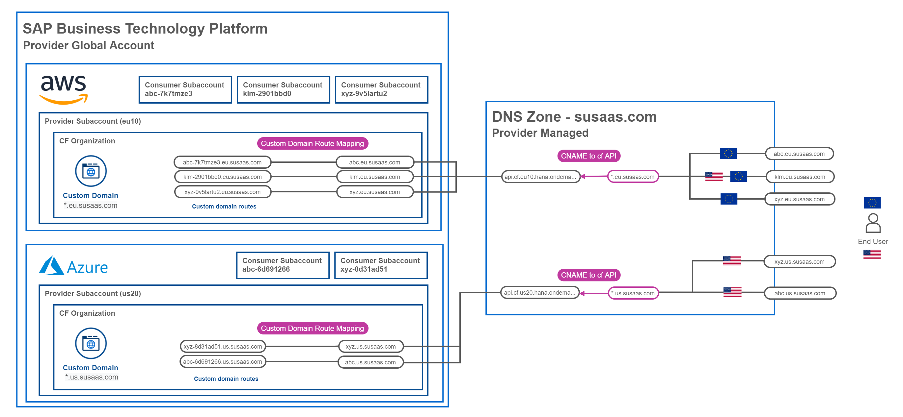](./images/CD_Dot.png?raw=true)

*Sample Setup using a subdomain-based region separation*

**Scenario 2 - Regions separated by dash**

>* eu10 - abc-eu10.susaas.com<br>
>* eu10 - xyz-eu10.susaas.com<br>
>* us20 - abc-us20.susaas.com<br>
>* us20 - xyz-us20.susaas.com<br>

**CNAME records** in your DNS**<br>
>* abc-eu10.susaas.com -> api.cf.eu10.hana.ondemand.com<br>
>* xyz-eu10.susaas.com -> api.cf.eu10.hana.ondemand.com<br>
>* abc-us20.susaas.com -> api.cf.us20.hana.ondemand.com<br>
>* xyz-us20.susaas.com -> api.cf.us20.hana.ondemand.com<br>

More complicated setup, requiring **region AND consumer specific CNAME records** pointing to the different consumers in the different regions. Cheaper as only one wildcard SSL certificate is required but additional effort for each multi-region consumer!

[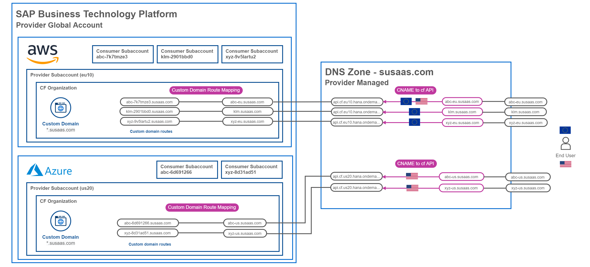](./images/CD_Dash.png?raw=true)

*Sample setup using a dash-based region separation*

<br>

**Scenario 1 vs Scenario 2**

In case of dash-usage for region separation, you cannot use wildcard CNAME records in your DNS zone. Instead, you have to manually maintain the CNAMEs of all consumers manually. This process might be automated by APIs of your DNS provider but still, it's more effort compared to using wildcard records. On the other side, you can save some bugs for additional SSL wildcard certificates in each region. 

> **Important** - The number of CNAMEs in both scenarios doubles, in case you want to equip a region with an additional stage for testing like abc-test-eu10.susaas.com or abc.test.eu10.susaas.com. That means, you now either have four certificates to pay for or 8 CNAME records to maintain.

So all in all, the setup options are not trivial and also depend on the effort you want to spend in maintaining CNAME records and the money in your pocket for wildcard SSL certificates. Okay, so are you ready for the final confusion and a little piece of brilliancy? Read the expert-scenario!

<br>

**Expert scenario - Dot separation**

You can also combine the regional subdomain approach (e.g., eu10.susaas.com), with an additional wildcard domain on your domain's root level (e.g., susaas.com). This is especially useful for consumers, that don't want to see the region in the domain but expect one single point of entry across all regions. 

>* eu10 - abc.eu10.susaas.com<br>
> ------- abc.susaas.com
>* us20 - abc.us20.susaas.com<br>
> ------- abc.susaas.com

Making the consumer's tenant available in different regions using the same domain (e.g., abc.susaas.com), allows you to implement smart routing mechanisms as a SaaS provider. You could route users coming from the US to the us20 region whereas EU users are routed to the eu10 region. This all happens without the end users even noticing. Users will access the application using **abc.susaas.com**. The smart routing happens in the background. Still, if they want access to a dedicated region, they can also call the region specific URL at any time. 

This setup requires a bit more effort, as two so called **route mappings** need to be created for each consumer on the SAP BTP side and you will be requiring a smart routing approach defined with for example an Hyperscaler of your choice (e.g., Azure, AWS, ...).

[](./images/CD_DotExpert.png?raw=true)

*Sample expert setup using subdomain-based region separation*

<br>

**Expert scenario - Dash separation**

In a dash-based approach, the smart routing scenario explained above, is possible without an additional certificate as you anyway only use one certificate for the *.susaas.com domain. 

From an effort perspective, also in this setup two **route mappings** have to be created for each consumer on the SAP BTP side and the smart routing approach has to be defined in your Hyperscaler landscape.

>* eu10 - abc-eu10.susaas.com<br>
> ------- abc.susaas.com
>* us20 - abc-us20.susaas.com<br>
> ------- abc.susaas.com

[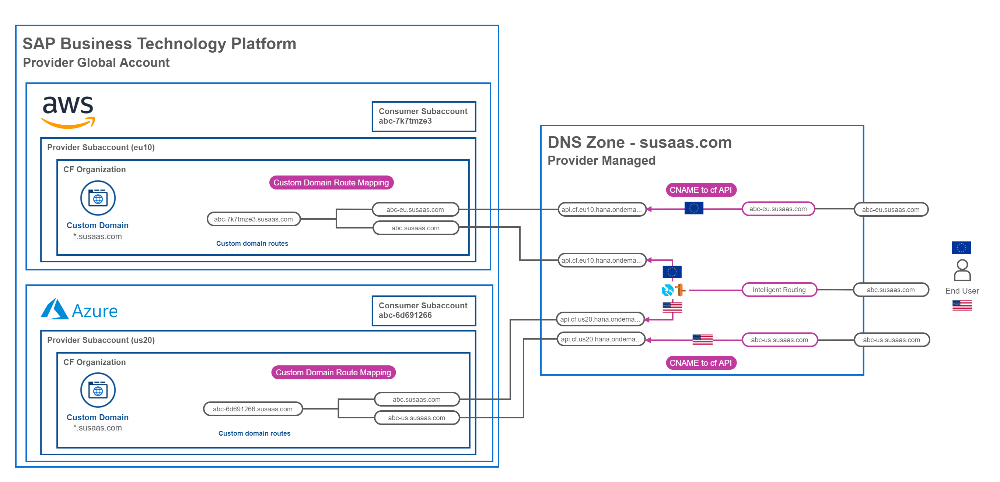](./images/CD_DashExpert.png?raw=true)

*Sample expert setup using dash-based region separation*

<br>


### Consumer domain

Using a consumer's own domain like **abc.com** and providing the users access to your SaaS application via e.g., **susaas.abc.com** instead of *abc.susaas.com* is also possible but not recommended. 

If you want to implement such a setup, you will need to create a new custom domain in your provider subaccount like **susaas.abc.com** and send a Certificate Signing Request (CSR) to your consumer. The consumer needs to sign this CSR using a trusted Certification Authority and send it back to you! Then you can activate the certificate for your consumer and map it to his default domain. While this is technically possible, you might sooner or later face issues when offering this option to your consumers. 

These issues probably start with the required certificate rotations, as certificates have a fixed validity date. While you can manage that for one or two consumers, it will be a lot of effort in case of a hundred consumers. CSRs will need to be created again and again for each of these consumers and you need to make sure to upload the new signed certificates in time! Also from a cost perspective, each new certificate will cause costs on the SAP BTP side, which you need to cross-charge to your consumers. 

Unfortunately, as of today consumers cannot share their own custom domain (which might already be registered in SAP BTP Subacounts of other Global Accounts) with you as a SaaS provider. This has security related reasons and it is not yet forseeable, if a solution will be provided any time soon. 

### Summary

Okay, wow that was a lot of content to digest. In case there is more questionmarks then answers now, don't worry. The topic of custom domains is not an easy topic. Just go through the chapter which you've just read once again and things might become clearer. If not, feel free to get in touch with us! So for now, let us continue with a tutorial on how to setup the Custom Domain Service instance in your provider subaccount.


## 4. Custom Domain Service

Okay, so let's get started with setting up the Custom Domain service in your provider subaccount. Please keep in mind - The **Custom Domain Service** is a **paid-only** service. There is no Free (Tier) plan available for this service and it is not available in Trial accounts. 

> **Important** - Make sure to check the latest service pricing in SAP Discovery Center ([click here](https://discovery-center.cloud.sap/serviceCatalog/custom-domain?service_plan=custom-domain&region=all&commercialModel=cloud&tab=service_plan)) based on your SAP BTP account type (CPEA or PAYG). 

Also feel free to check the official SAP Help documentation ([click here](https://help.sap.com/docs/CUSTOM_DOMAINS/6f35a23466ee4df0b19085c9c52f9c29/1fbba52c03fe4061ac07a9c627f1b600.html?locale=en-US)), which also describes the process below in great detail. 

4.1. To setup a custom domain in your SAP BTP provider subaccount, please add the respective entitlement in your SAP BTP Cockpit. Make sure to use the **standard (Application)** plan, as the *custom_domains* plan is deprecated and will not receive future updates. 

[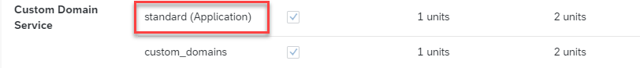](./images/CusDom_Plans.png?raw=true)

4.2. After adding the entitlement to your subaccount, please subscribe to the **Custom Domain Service** using the **standard** service plan.

[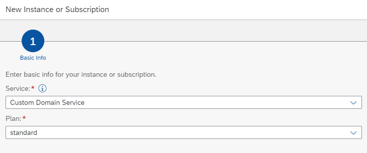](./images/CDS_Subscribe01.png?raw=true)

4.3. Once subscribed, you will see the subscription in your **Instances and Subscriptions** area of your SAP BTP Subaccount. Before using it, please make sure to create and assign the required role collections. 

[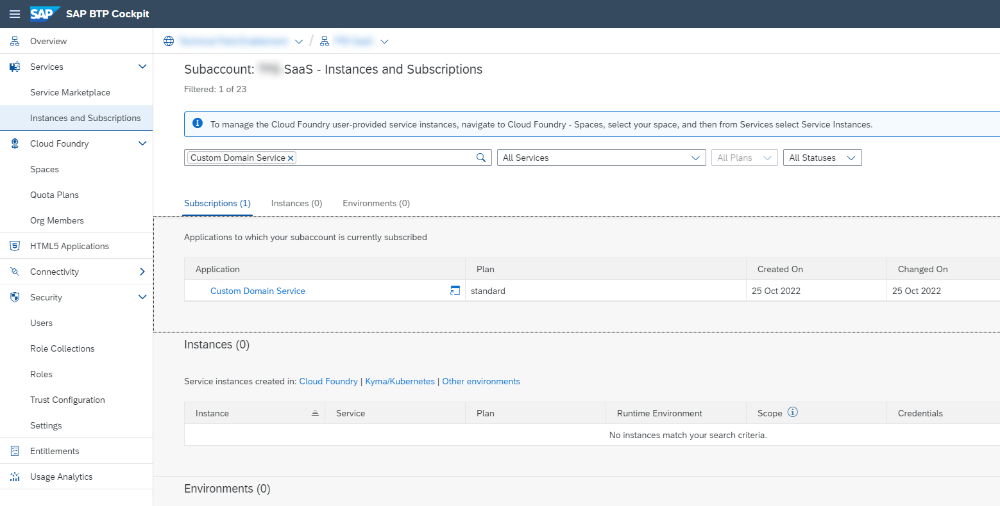](./images/CDS_SetupDomain01.png?raw=true)

4.4. Create a new role collection (e.g., Custom Domain Administrator) in your provider subaccount and add the CustomDomainAdmin role template. Make sure your SAP BTP Subaccount administrator is assigned the new role collection. 

[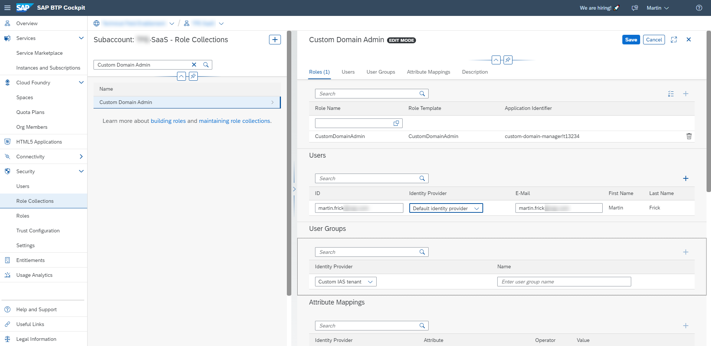](./images/CDS_RoleCollection.png?raw=true)

4.5. After assigning the new role collection, please open the Custom Domain Service subscription you just created in a new browser tab. Once the application has loaded, please click on **Domains**.

[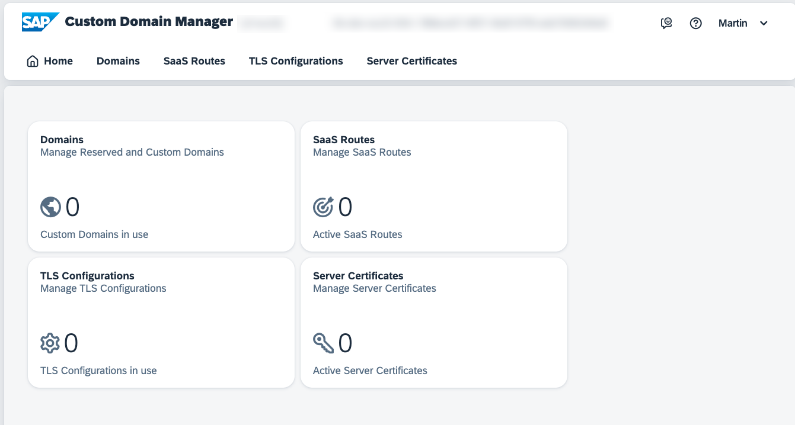](./images/CDS_SetupDomain02.png?raw=true)

4.6. In the following window, you can reserve your custom domain in the current region (e.g. eu10). This ensures, that no other SAP BTP customer can use it or related subdomains. So, please click on **Add Reserved Domain**.

[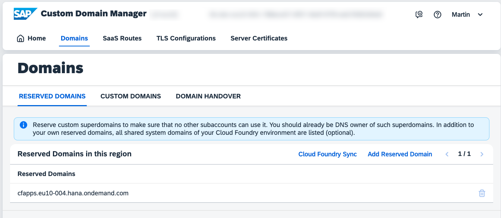](./images/CDS_SetupDomain03.png?raw=true)

4.7. Provide the custom domain which you want to use for your SaaS application. Either provide a domain (like susaas.com) or a dedicated subdomain (like susaas.apps.com) of your choice. If you provide a domain (like susaas.com) you can still add custom subdomains (like eu10.susaas.com) in the next step. Click on **Add**.

> **Important** - You should be a DNS owner of this domain or subdomain!

[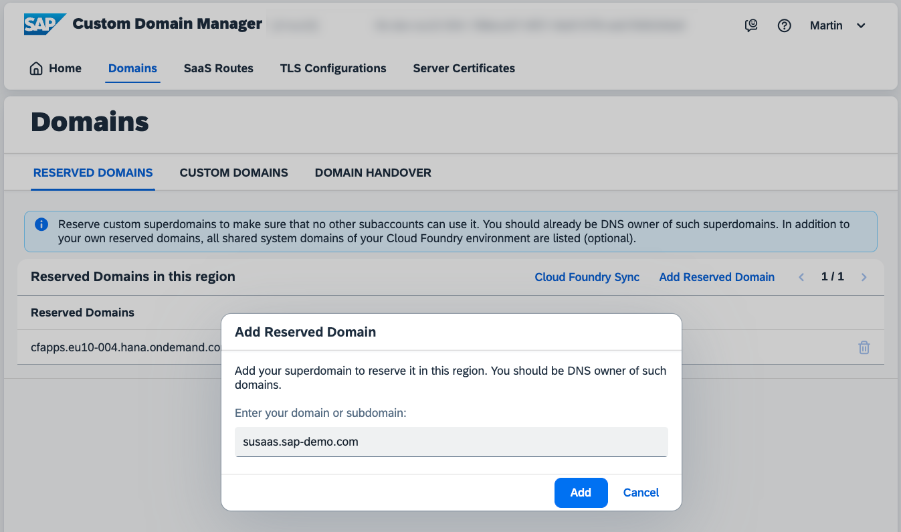](./images/CDS_SetupDomain04.png?raw=true)

4.8. Switch to the Custom Domain tab and click on **Create Cutom Domain**.

[](./images/CDS_SetupDomain05.png?raw=true)

4.8. Select **for your Subaccount's CF Organization**, which allows you to setup a custom domain for your Cloud Foundry based applications. 

[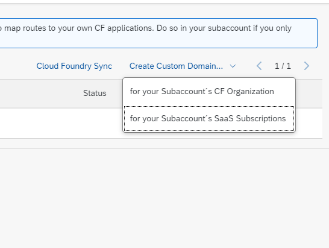](./images/CDS_SetupDomain06.png?raw=true)

4.9. You will see for which Cloud Foundry landscape the custom domain is created. You an only use the custom domain in this landscape. Please click on **Next**.

[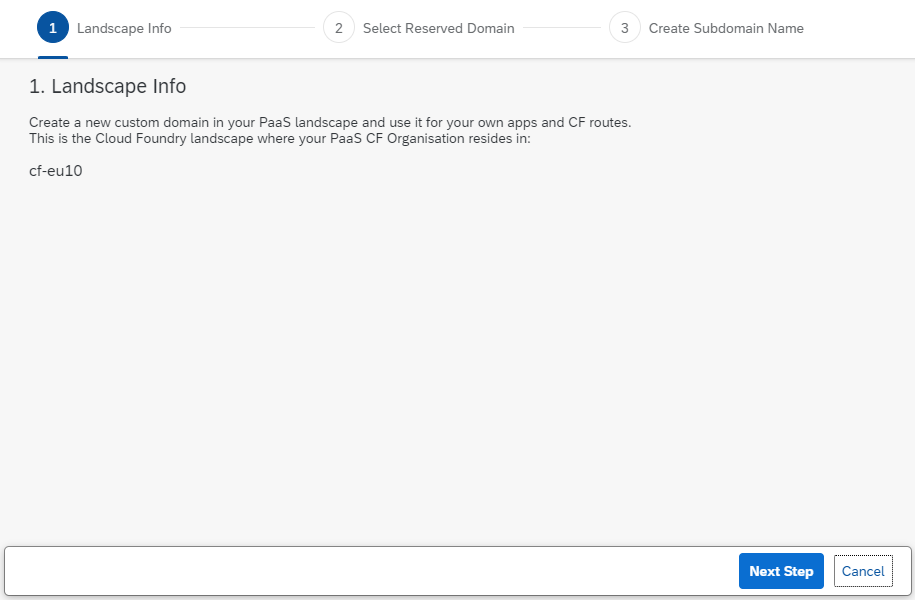](./images/CDS_SetupDomain07.png?raw=true)

4.10. Select the domain which you just added to the **Reserved Domains** and click on **Next**.

[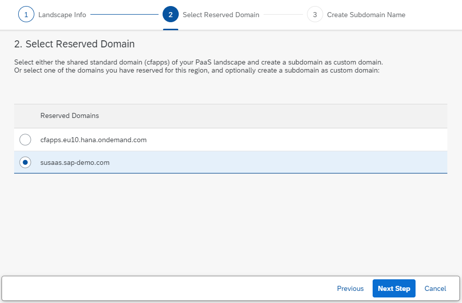](./images/CDS_SetupDomain08.png?raw=true)

4.11. If required, you can define a subdomain of your reserved domain like eu10.susaas.com. In our sample we didn't do so. Click on **Finish**.

[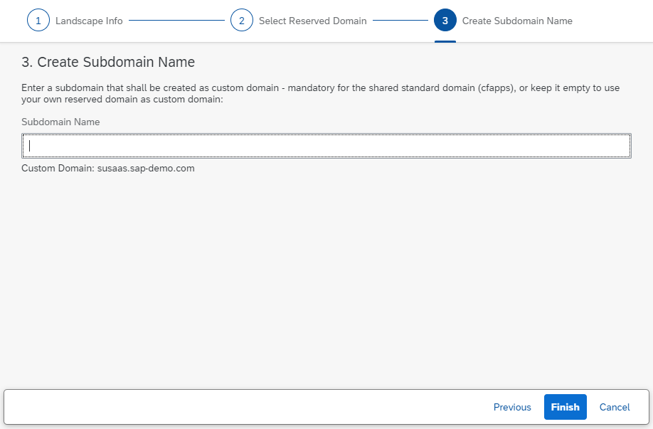](./images/CDS_SetupDomain09.png?raw=true)

4.12. Go back to the Custom Domain Service main menu and click on **TLS Configuration**. In the below screen, please click on **Create TLS Configuration**. 

[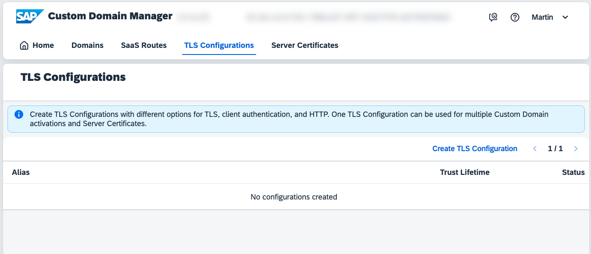](./images/CDS_SetupDomain10.png?raw=true)

4.13. Provide a name for the new TLS configuration like **susaas**. Click on **Next Step**.

[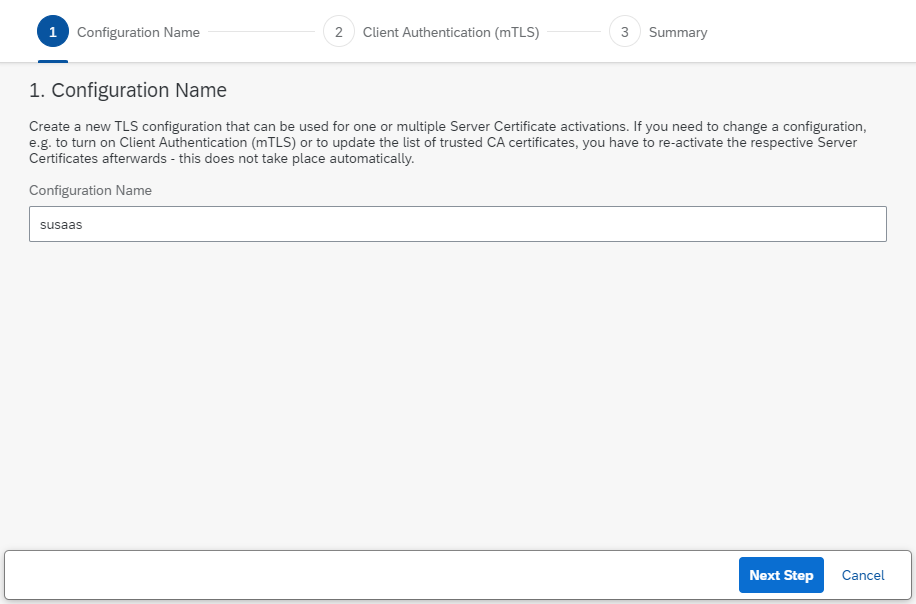](./images/CDS_SetupDomain11.png?raw=true)

4.14. Client Authentication (mTLS) can only be enabled once the configuration is created and you uploaded CA certificates. For now, please click on **Next Step**. 

[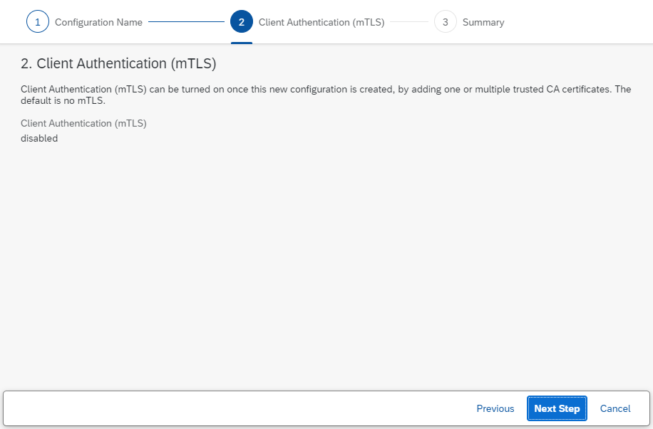](./images/CDS_SetupDomain12.png?raw=true)

4.15. Finish the process by clicking on **Finish**.

[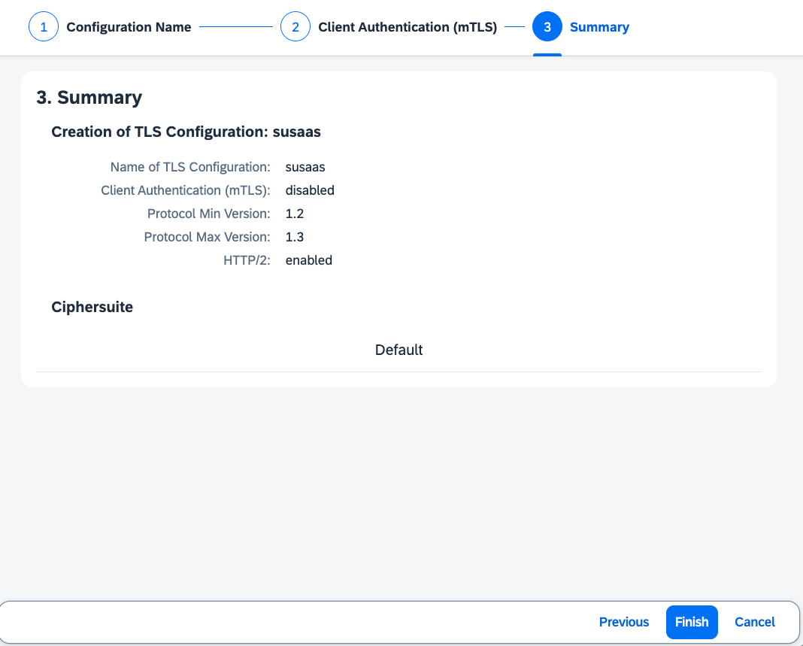](./images/CDS_SetupDomain13.png?raw=true)

4.16. You will see the new TLS configuration which is currently **not used** yet as we did not provide a valid SSL certificate so far. 

[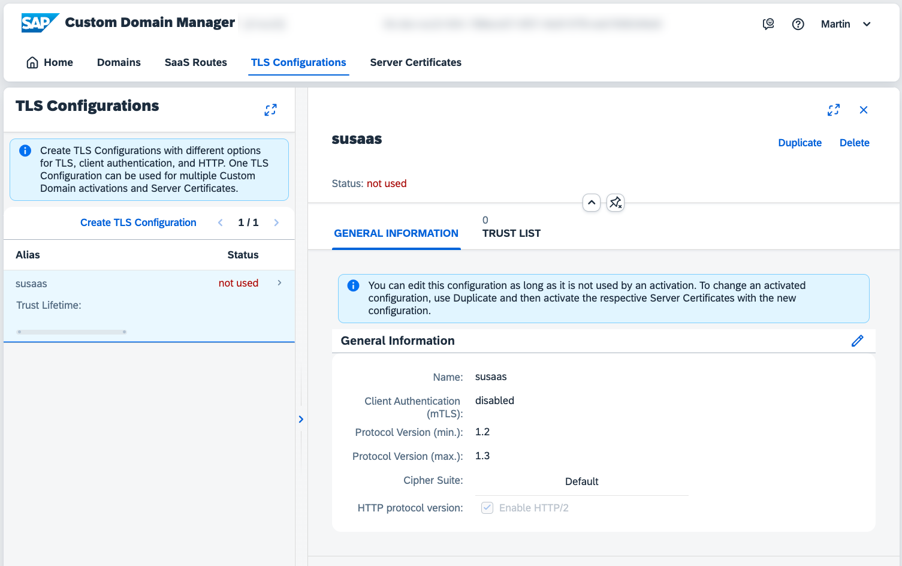](./images/CDS_SetupDomain14.png?raw=true)

4.17. Go back to the Custom Domain Service main menu and click on **Server Certificates**. In the below screen, please click on **Create Server Certificate**. 

[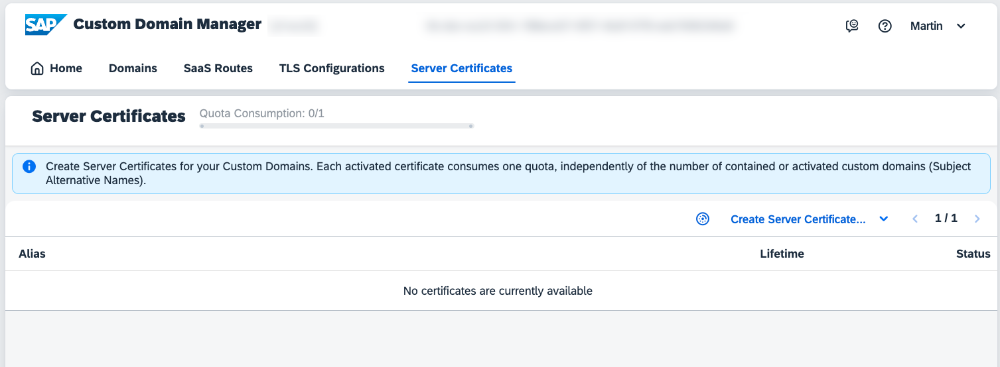](./images/CDS_SetupDomain15.png?raw=true)

4.18. Select the **for your (wildcard) Custom Domains** option.

[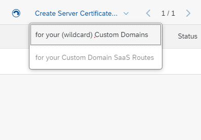](./images/CDS_SetupDomain16.png?raw=true)

4.19. Provide an alias like **susaas** for the new server certificate. If required, you can change the Key Size. Click on **Next Step**.

[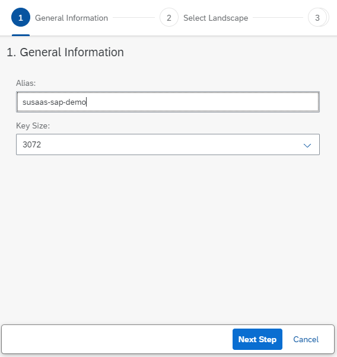](./images/CDS_SetupDomain17.png?raw=true)

4.20. Select your region and click on **Next Step**.

[](./images/CDS_SetupDomain18.png?raw=true)

4.21. As **Subject Alternative Names**, please choose your **wildcard** (sub-)domain, which you've create a few steps ago (e.g., \*.susaas.com) and click on **Next Step**. 

> **Hint** - Only select the Full Qualified Domain Name (FQDN) here (e.g. susaas.com), if you plan to use this certificate for the wildcard subdomain and the FQDN. 

> **Important** - If you plan to use multiple stages like Dev or Test in the same region, make sure to create the respective  wildcard custom domains (e.g., *. dev.susaas.com) first. Then also select these subdomains as Subject Alternative Names. This way you will only pay for one Custom Domain Service instance but can use multiple wildcard subdomains. 

[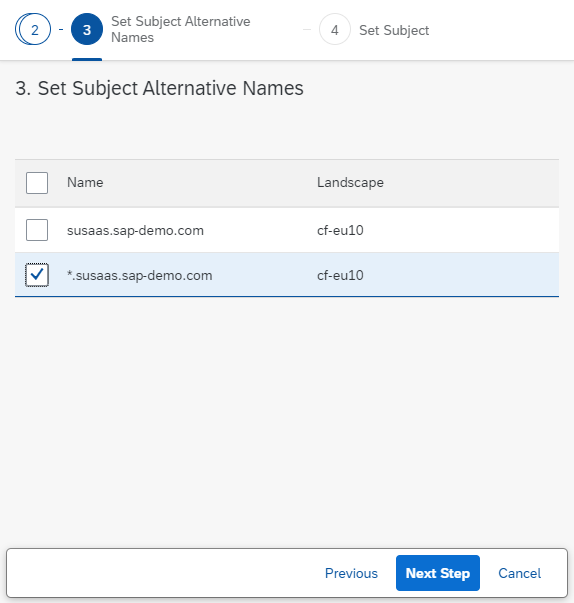](./images/CDS_SetupDomain19.png?raw=true)

4.22. As CommmonName (CN), use the wildcard (sub-)domain, which you created some steps ago (e.g., *.susaas.com). Provide the additional details before clicking on **Finish**. 

> **Hint** - In case you're facing errors when clicking on Finish, only fill the mandatory field (CN) and try again. 

[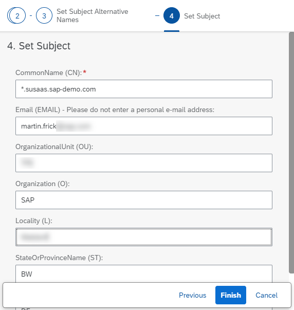](./images/CDS_SetupDomain20.png?raw=true)

4.23. You will see, that an Alias for your server certificate is created and a Certificate Signing Request (CSR) is available. 

[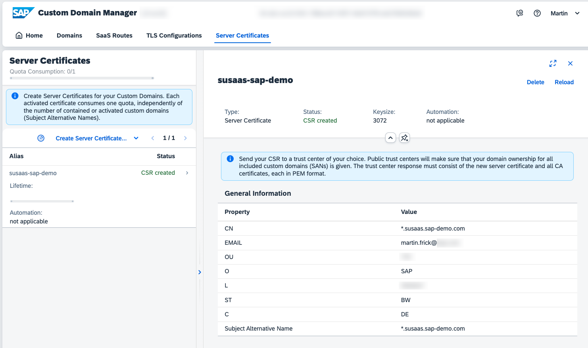](./images/CDS_SetupDomain21.png?raw=true)

4.24. Select your new Alias and scroll down to click on the **Get Certificate Signing Request** button.

[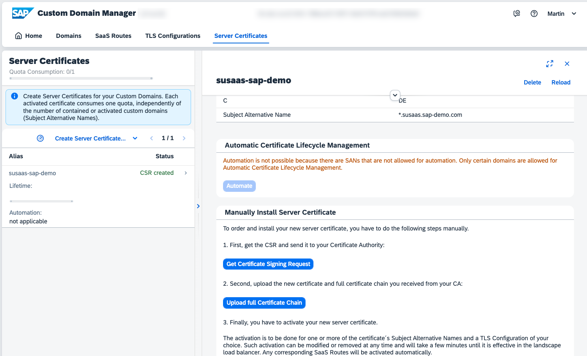](./images/CDS_SetupDomain22.png?raw=true)

4.25. From the popup, please copy the whole CSR content. Save it in a file on your local device and send it to your preferred SSL certificate provider. 

[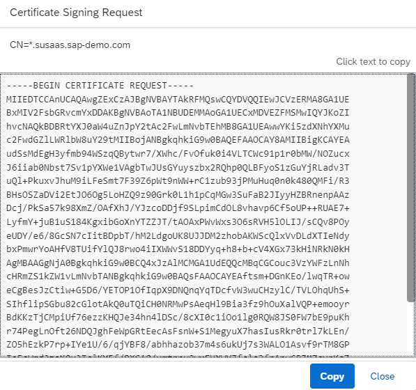](./images/CDS_SetupDomain23.png?raw=true)

> **Hint** - You can use Let's Encrypt ([click here](https://letsencrypt.org/)) for creating a free SSL certificate which is valid for three months. You can find more details how to do so in the following GitHub repository ([click here](https://github.com/SAP-samples/btp-services-intelligent-routing/tree/ci_azure/03-MapCustomDomainRoutes)). Check the steps 10 to 17 of the respective README file.


4.26. Once your certificate has been signed by your SSL certificate provider you will a full certificate chain. This chain contains your signed Server Certificate, one or multiple Intermediate Certificates and a Root Certificate.

4.27. Click on **Upload full Certificate Chain**

[](./images/CDS_SetupDomain22.png?raw=true)

4.28. Paste the certificate chain which your received from your SSL certificate provider and click on **Next Step**.

[](./images/CDS_SetupDomain24.png?raw=true)

4.29. If the certificate chain is correct, you will see an overview of your certificate details. Please click on **Next Step** if everything is correct and confirm the certificate upload

[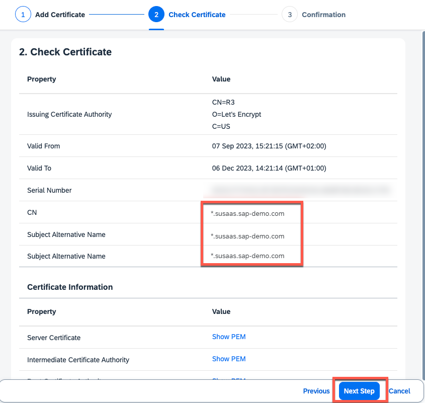](./images/CDS_SetupDomain25.png?raw=true)

> **Hint** - In case you're facing an error message, your certificate chain is probably incomplete. Try to open the certificate manually on your device and check if the full chain certificate contains a root, an intermediate and your sever certificate. 

4.30. Once the upload of your certificate is successful, you will see that your **Server Certificate** will change to status **inactive**. 

[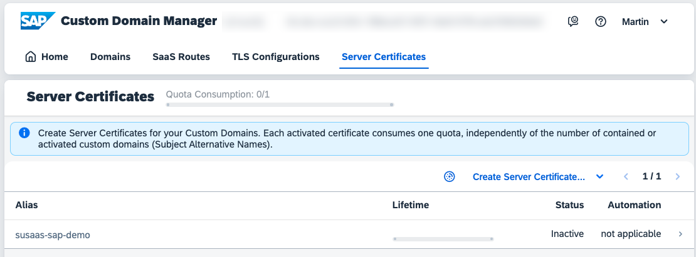](./images/CDS_SetupDomain26.png?raw=true)

4.31. To activate your server certificate, please select the entry from the list and click **Activate** in the respective settings. 

[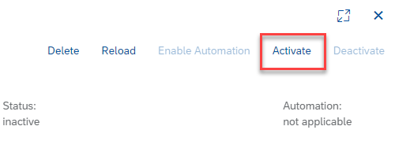](./images/CDS_SetupDomain26a.png?raw=true)

4.32. Once the server certificate is active, it can be used to setup custom domains for applications in your Cloud Foundry environment. 

> **Important** - As already stated you can request an SSL certificate including multiple Subject Alternative Names (SANs). If you include multiple domains like *.abc.com and *.xyz.com or *.dev.abc.com and *.test.abc.com in your server certificate, you can use the same certificate for all of these domains. 

4.33. While you can now use your custom domain(s) to setup routes in Cloud Foundry, these routes will not yet be reachable from the public internet. 

[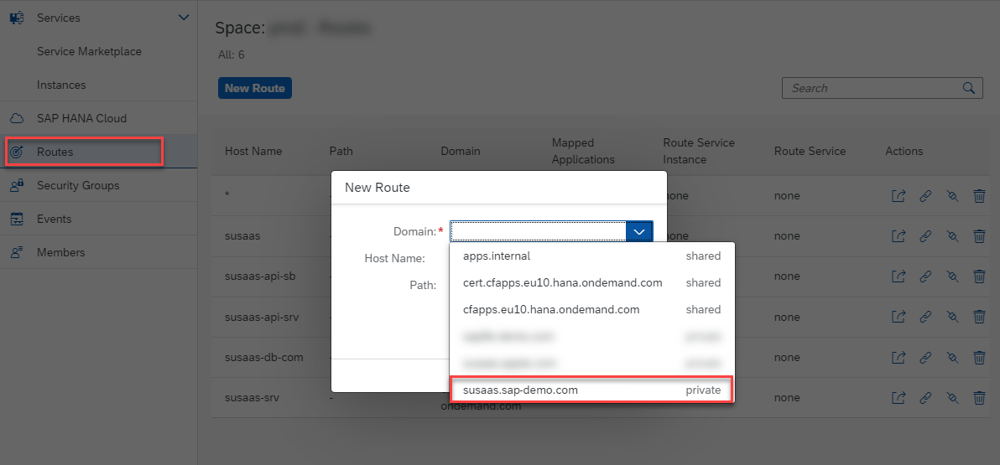](./images/CDS_SetupDomain39.png?raw=true)

4.34. To make your new custom domain routes reachable from the public internet, please continue with the next chapter and create required CNAME record(s) in your DNS zone. 


## 5. CNAME record in DNS

Before you can reach your Cloud Foundry applications using the custom domain(s) you configured, you need to set (a) respective CNAME record(s) in your domain's DNS settings. Below you can see a sample for a multi region deployment scenario using a separate subdomain for each region. For that purpose, in the DNS settings (here within a Microsoft Azure DNS zone) of the sap-demo.com domain, two additional wildcard CNAME records were created. 

> **Hint** - Also check the official SAP Help documentation ([click here](https://help.sap.com/docs/CUSTOM_DOMAINS/6f35a23466ee4df0b19085c9c52f9c29/ec2903f6c1a7400aabd77fbbbdefa25b.html?locale=en-US&version=Cloud)) which provides further information on setting the required CNAME record(s).

[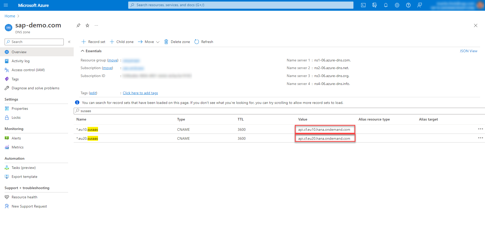](./images/CDS_DNSRecords.png?raw=true)

* \*.eu.susaas.sap-demo.com -> api.cf.eu10.hana.ondemand.com
* \*.us.susaas.sap-demo.com -> api.cf.us10.hana.ondemand.com

These CNAME records will point consumers accessing their SaaS application via the region specific domain, to the correct Cloud Foundry API endpoint based on the URL they're using to access the application. Cloud Foundry will then ensure a correct routing based on the routes defined in your SAP BTP environment. Without creating CNAME record(s) in the DNS of your domain, you cannot reach the custom domains routes in your Cloud Foundry environment from the public internet. 

* abc.eu.susaas.sap-demo.com -> EU10
* xyz.us.susaas.sap-demo.com -> US10

**Additional Information**

Alternatively to setting up a wildcard CNAME record, you can also setup a dedicated CNAME record for each consumer. This is a mandatory step when using a dash-based separation of regions. Wildcard CNAMEs with dashes like \*-eu.susaas.sap-demo.com are unfortunately not possible! So in case you decide to use dashes to save on SSL certificates, make sure to set your CNAME records properly. 

* abc-eu.susaas.sap-demo.com -> api.cf.eu10.hana.ondemand.com
* xyz-us.susaas.sap-demo.com -> api.cf.us10.hana.ondemand.com

**Conclusion**

Once you've created the CNAME records pointing to the Cloud Foundry API endpoint(s) of your region(s), you can reach your consumer tenants using the routes you specified for your consumer tenant within your SAP BTP environment. 

[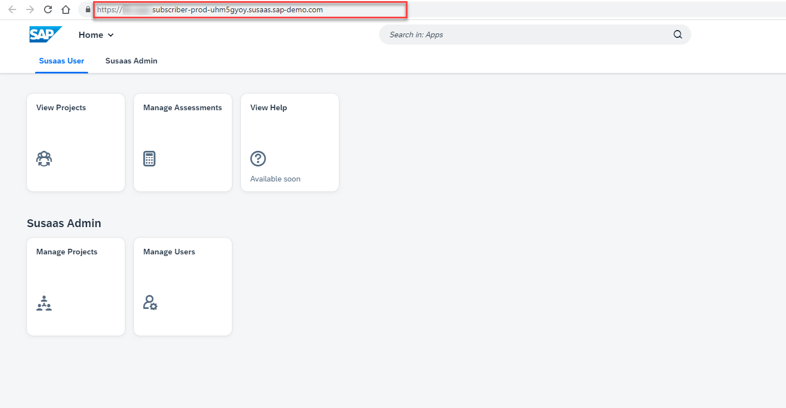](./images/CDS_RouteBefore.png?raw=true)


Okay, so far your consumer can reach their tenants using **abc-7k7tmze3.susaas.com**. But how can we beautify that even more so the resulting domain is **abc.susaas.com**? Well, this is where you can use the so called **Route Mapping** feature for. 


## 6. Custom Domain Route Mapping

The Custom Domain Route Mapping feature allows you to map existing SaaS application routes to any route of your choice based on the available custom domains. Let's check a few samples before going into the details:

**Production route mapping**<br>

* xyz-7k7tmze3.susaas.com -> xyz.susaas.com

**Landscape route mapping**<br>

* xyz-7k7tmze3.dev.susaas.com -> xyz.dev.susaas.com
<br>**or**
* xyz-7k7tmze3.dev.susaas.com -> xyz-dev.susaas.com

**Regional route mapping**<br>

* xyz-7k7tmze3.eu10.susaas.com -> xyz.eu.susaas.com
<br>**or**
* xyz-7k7tmze3.eu10.susaas.com -> xyz-eu.susaas.com

**Consumer domain**<br>

* xyz-7k7tmze3.susaas.com -> susaas.xyz.com

As you can see, the default hostname created based on the consumers subaccount subdomain can be replaced by a proper hostname combined with any of your custom domains. Before using this feature, make sure to read the following important information. 

**Important Information** 

* When using the route mapping, it is of special importance, that the original hostname only contains the subdomain of the consumer's subaccount. The system will check if a subaccount with a respective subdomain exists. If you include your application name or a stage into your consumers SaaS URL (e.g., xyz-7k7tmze3-susaas or xyz-7k7tmze3-dev), you cannot use the route mapping feature! 

  > **Sample** - If e.g., the subaccount subdomain of your consumer xyz is xyz-7k7tmze3, the default SaaS route which you want to map also needs to be **xyz-7k7tmze3.(eu10.)susaas.com**. Only then a mapping to xyz.(eu10.)susaas.com is possible. Therefore, make sure to return the correct default route during the provisioning.

* The route mapping feature can be used with the default **cfapps domain** in special circumstances only. As you cannot create subdomains for the cfapps domain, you typically have to include stages and app names into the hostnames using dashes (e.g., xyz-7k7tmze3-susaas-dev.cfapps.hana....). 

  This makes the usage of the route mapping feature impossible, as the system will not be able to determine a subaccount with a matching subdomain! 

  > **Sample** - If the resulting SaaS domain of consumer xyz is **xyz-7k7tmze3-susaas-dev.cfapps.hana.ondemand.com** but the subaccount subdomain of consumer xyz is **xyz-7k7tmze3**, no mapping can be done!

  The only way to make that such a mapping possible is to create different subaccounts for each app, stage and customer with respective subaccount subdomains (e.g., xyz-7k7tmze3-susaas-dev) which is quite cumbersome. 


6.1. Start with identifying the Tenant ID of the consumer tenant which you want to create a route mapping for. You can find the ID in the **Subscription Management Dashboard** of your provider subaccount. Note the ID for your reference. 

[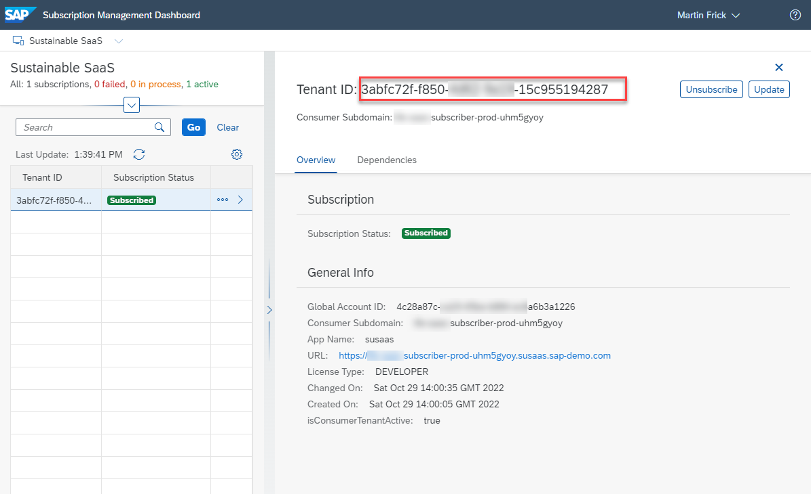](./images/CDS_SetupDomain29.png?raw=true)

6.2. To allow a custom domain route mapping for your consumer subaccounts, you first need to enable the Cloud Foundry environment in that consumer subaccount. Please do so by opening the consumer subaccount in the SAP BTP Cockpit and click on **Enable Cloud Foundry**. 

[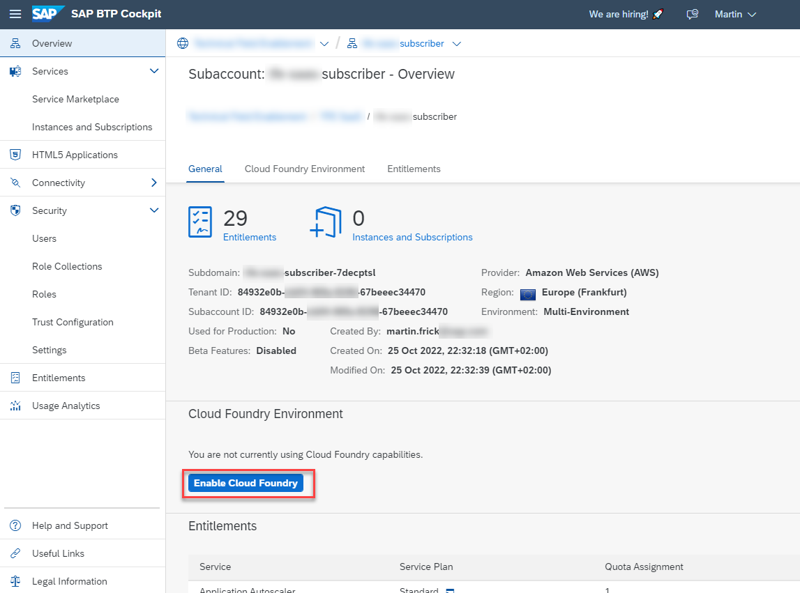](./images/CDS_SetupDomain30.png?raw=true)

6.3. Change the default settings if required and click on **Create**. 

[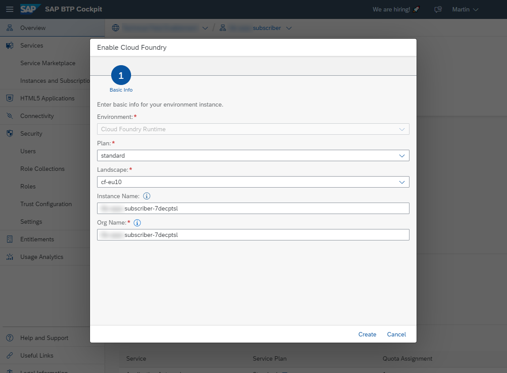](./images/CDS_SetupDomain31.png?raw=true)

6.4. Back in your provider subaccount, open your Custom Domain Service from the Instances and Susbscriptions sectiont. In the menu, click on **SaaS Routes**. 

[](./images/CDS_SetupDomain02.png?raw=true)

6.5. In the below screen, please click on **Create Custom Route**. 

[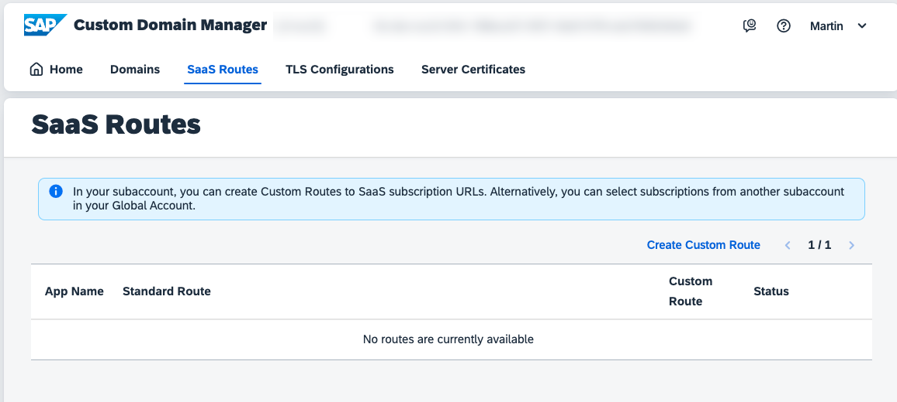](./images/CDS_SetupDomain28.png?raw=true)

6.6. Disable the *Continue with current subaccount's list of subscriptions* checkbox and provide the Tenant ID of your consumer which you noted some steps ago. Click on **Next Step**.

[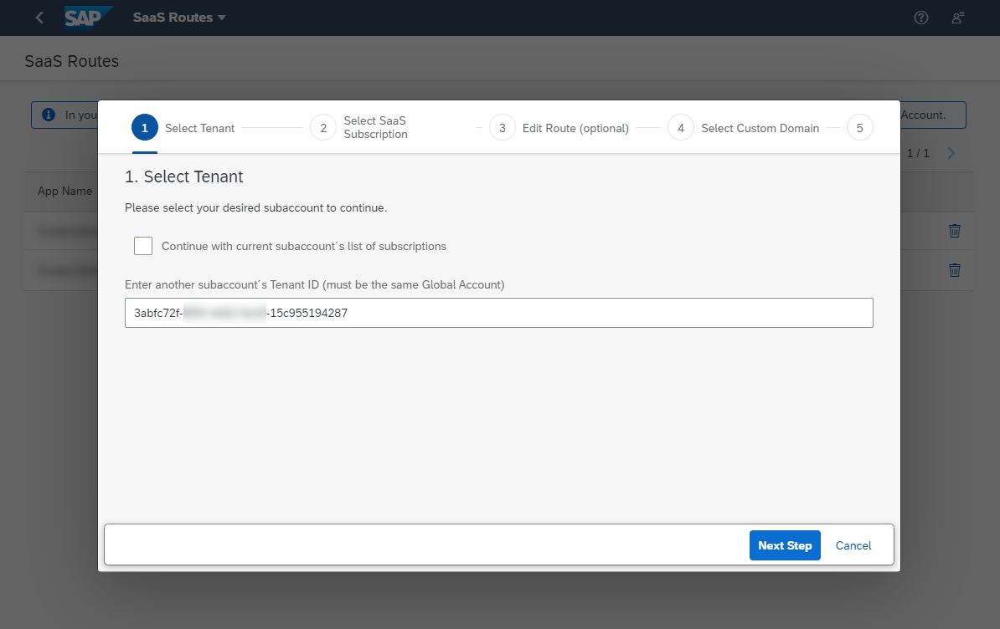](./images/CDS_SetupDomain32.png?raw=true)

6.7. Select the SaaS subscription of your consumer subaccount for which you want to set up a route mapping. Click on **Next Step**.

> **Hint** - If you face an error message instead of the screen below, make sure you enabled Cloud Foundry in the consumer subaccount!

[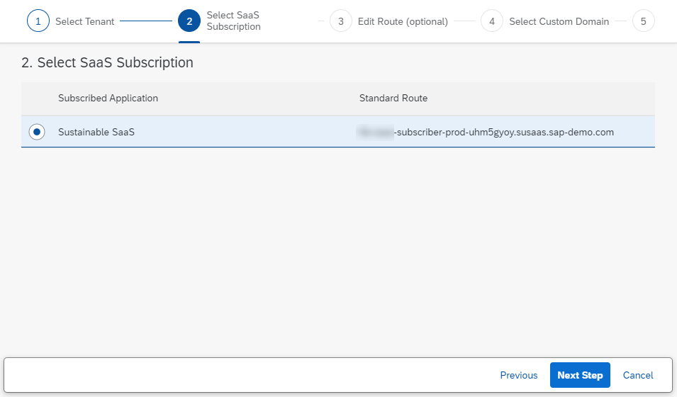](./images/CDS_SetupDomain33.png?raw=true)

6.8. Don't change the standard route which is based on your consumer's subaccount subdomain and click on **Next Step**.

> **Hint** - In this case the subaccount subdomain was **...subscriber-prod-uhm5gyoy**.

[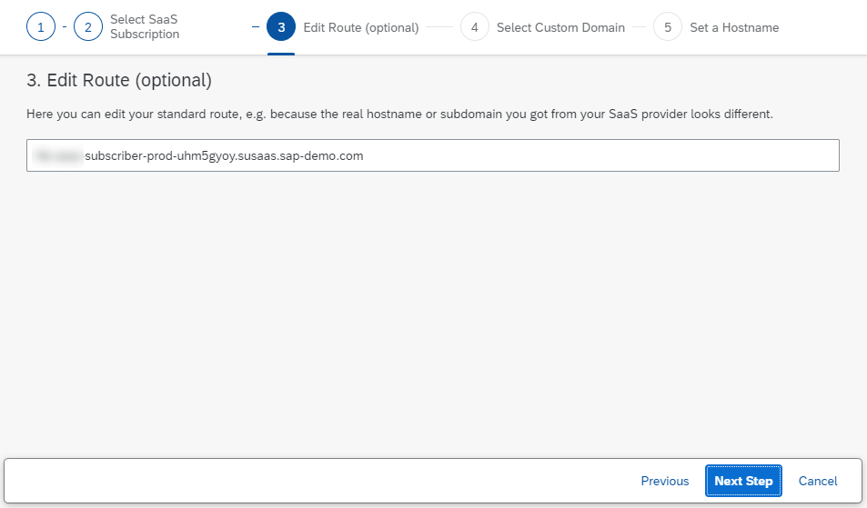](./images/CDS_SetupDomain34.png?raw=true)

6.9. Select the custom domain which you want to use for the route mapping. Click on **Next Step**.

[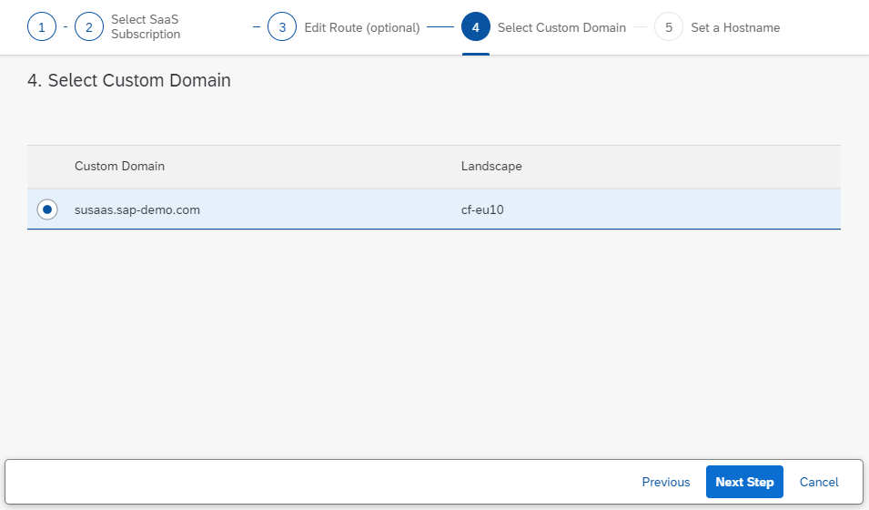](./images/CDS_SetupDomain35.png?raw=true)

6.10. Define the new hostname of your route mapping. You can now provide a proper hostname instead of the GUID-based subaccount subdomain. Click on **Finish** to create the route mapping. 

[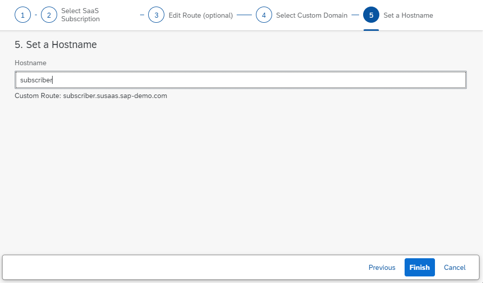](./images/CDS_SetupDomain36.png?raw=true)

[](./images/CDS_SetupDomain36a.png?raw=true)

6.11. To make your mapping available in Cloud Foundry, you need to sync your changes. Therefore, please switch to the main menu and click on the **Domains** tile.

[](./images/CDS_SetupDomain02.png?raw=true)

6.12. Select the **Custom Domains** tab and click on **Cloud Foundry Sync**.

[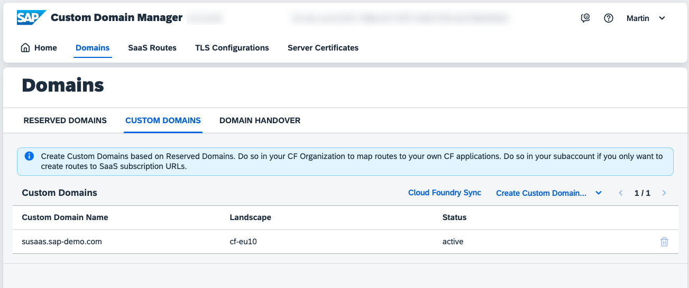](./images/CDS_SetupDomain37.png?raw=true)

6.13. Wait until you see a confirmation message toast.

[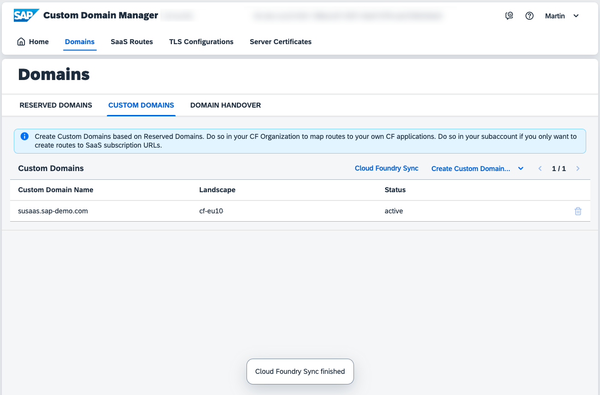](./images/CDS_SetupDomain38.png?raw=true)

6.14. You should now be able to access the consumer SaaS instance using the simplified domain which you specified in the route mapping. 

[](./images/CDS_RouteAfter.png?raw=true)

That's it! Your consumers can now reach their individual SaaS tenants using a proper custom domain.


## 7. Multi region intelligent routing

To complete this tutorial, we well give you a brief introduction how to setup a multi region intelligent routing approach using Azure Traffic Manager. Let's imagine a consumer **subscriber** is created in two different regions **eu10** and **eu20**. For this consumer the following smart routing logic is required. 

* The dedicated SaaS application tenants in the different regions shall be reachable using region specific domains:
  - subscriber.eu10.sap-demo.com -> EU10
  - subscriber.eu20.sap-demo.com -> EU20

* A region independent domain shall route users to the eu10 region preferably and to the eu20 region only in case of failover:
  - subscriber.sap-demo.com
  - Primary -> EU10
  - Secondary -> EU20

Two respective route mappings for the consumer **subscriber** have been definded in the Custom Domain Service of region **eu10**. 

[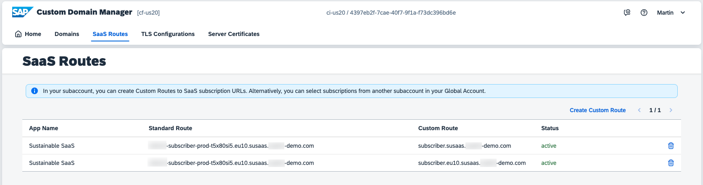](./images/CDS_MultiReg01.png?raw=true)

Two similar route mappings for the consumer **subscriber** have been definded in the Custom Domain Service of region **eu20**. 

[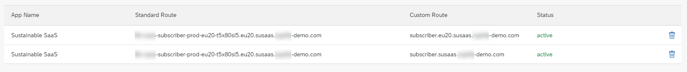](./images/CDS_MultiReg02.png?raw=true)

In Microsoft Azure, a **Traffic Manager** profile has been defined with two endpoints for eu10 and eu20. 

[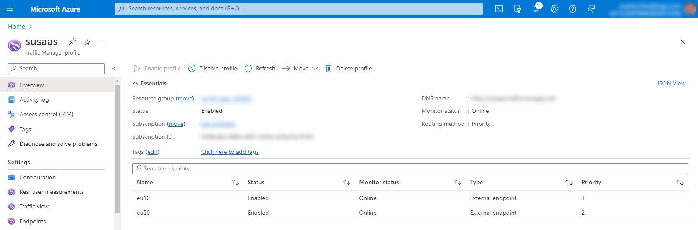](./images/CDS_MultiReg03.png?raw=true)

The Traffic Manager profile has been setup for Priority routing, which allows you to define a priority for your target endpoints. 

[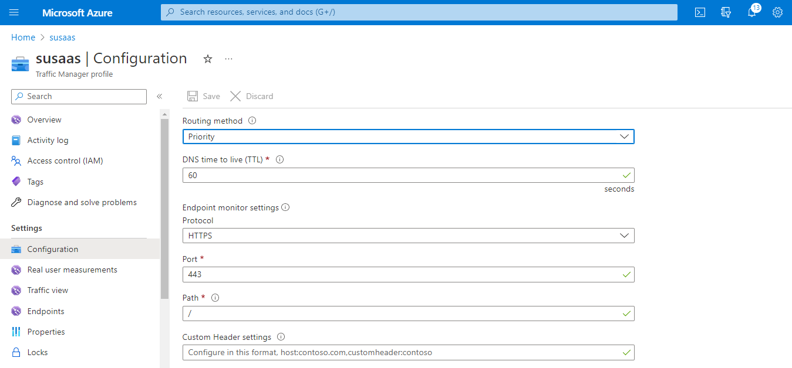](./images/CDS_MultiReg04.png?raw=true)

The target endpoint for region eu10 has been assigned the value **1** whereas region eu20 has the value **2**. You can also have further endpoints if required. 

[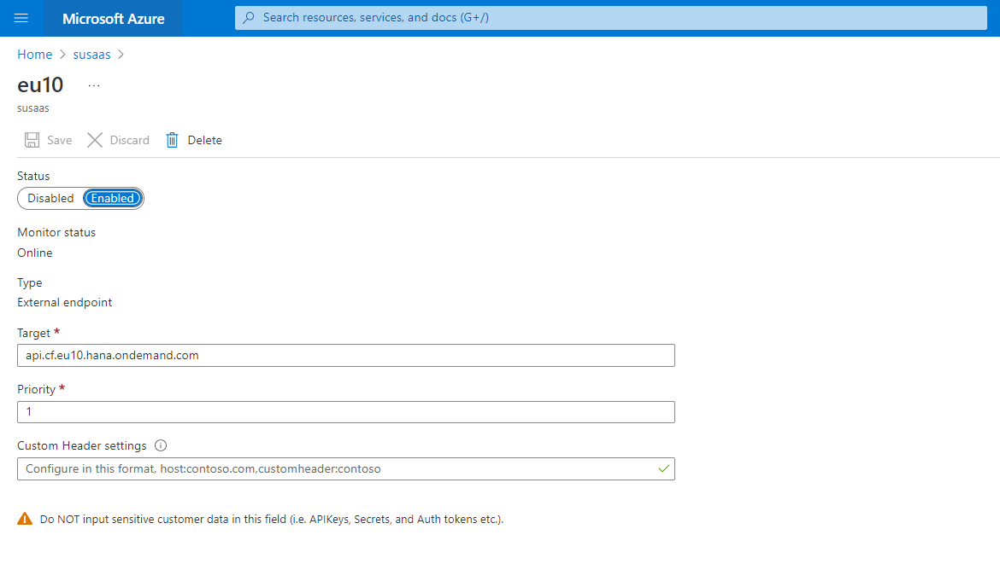](./images/CDS_MultiReg05.png?raw=true)

Three DNS records have been defined for the scenario. Two wildcard CNAME records allowing an access for the region-specific consumer domains (*.eu10.susaas.sap-demo.com and *.eu20.susaas.sap-demo.com) and one wildcard record pointing to Azure Traffic manager (*.susaas.sap-demo.com). 

> **Hint** - A more specific CNAME will be matched before a generic one. If a user tries to open subscriber.eu10.susaas.sap-demo.com the *.eu10.susaas.sap-demo.com CNAME will match before *.susaas.sap-demo.com.

[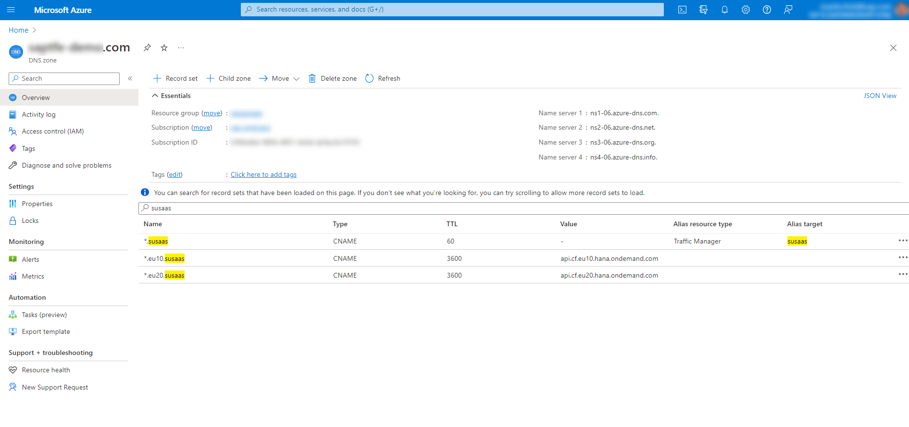](./images/CDS_MultiReg06.png?raw=true)

Users of consumer **subscriber** can now reach the application by using the region specific subdomain or a the region independent subdomain. 

[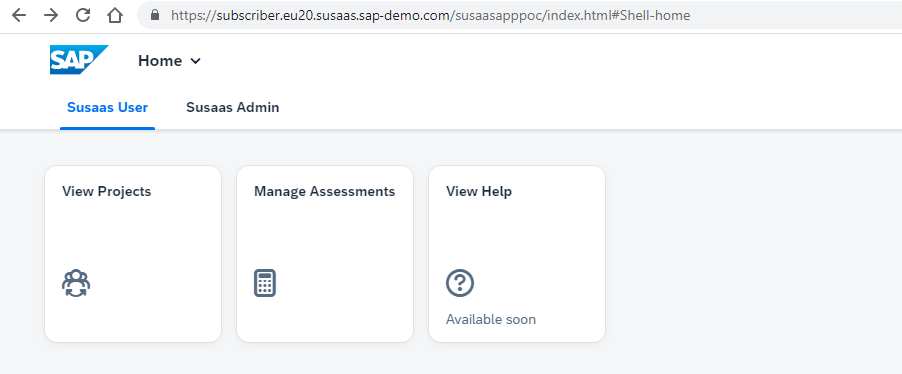](./images/CDS_MultiReg07.png?raw=true)

[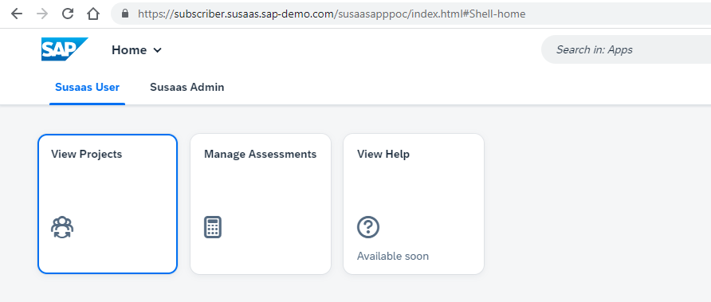](./images/CDS_MultiReg08.png?raw=true)


**Consumer Domain**

To complete the picture, below you can find a sample screenshot in which a default SaaS route was mapped to a dedicated subdomain of a consumer (e.g., **susaas.sap.com**). As already explained in the respective chapter, this is possible but not recommended. 

[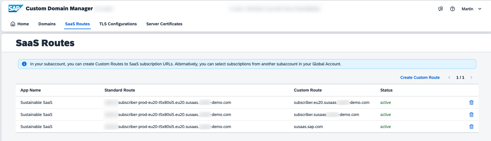](./images/CDS_ConsumerDomain.png?raw=true)


## 8. Further Information

Please use the following links to find further information on the topics above:

* [Cloud Foundry Documentation - Configuring Routes and Domains](https://docs.cloudfoundry.org/devguide/deploy-apps/routes-domains.html)
* [SAP Help - Custom Domain Service](https://help.sap.com/docs/CUSTOM_DOMAINS?locale=en-US)
* [Let's Encrypt](https://letsencrypt.org/)
* [GitHub - Route Multi-Region Traffic to SAP BTP Services Intelligently](https://github.com/SAP-samples/btp-services-intelligent-routing)
* [Microsoft - Traffic Manager documentation](https://learn.microsoft.com/en-us/azure/traffic-manager/)
