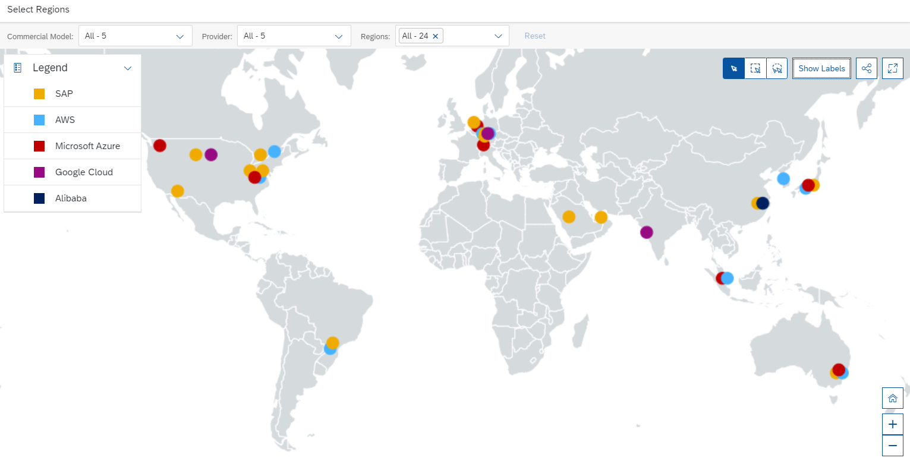
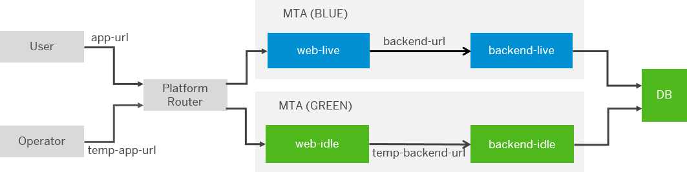
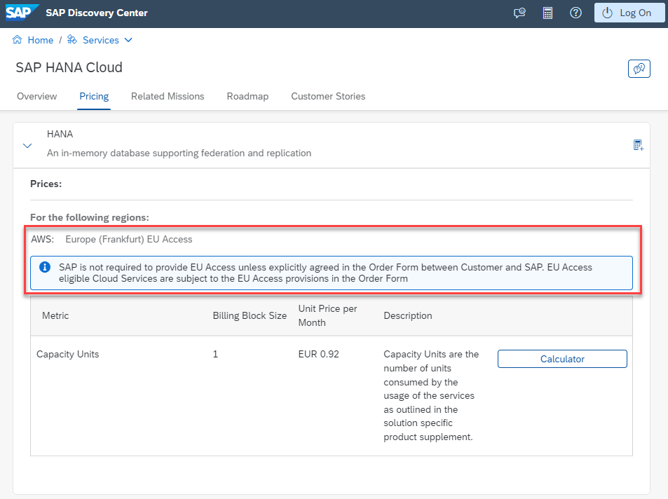
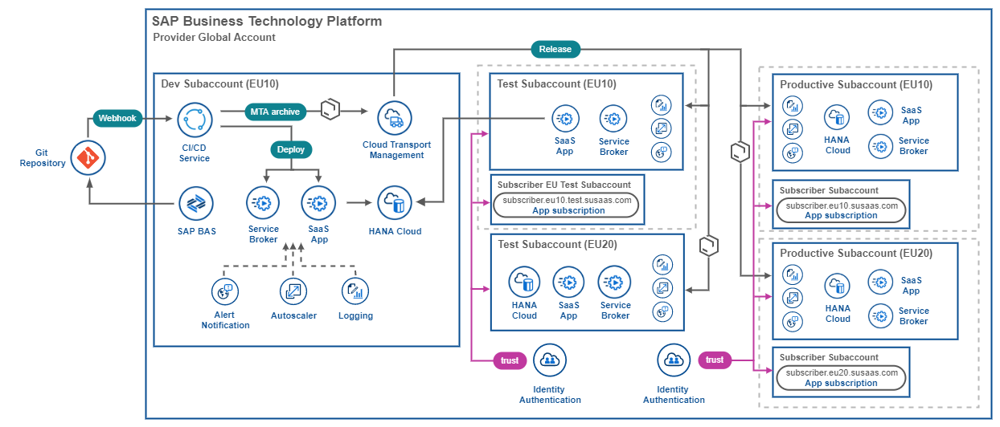
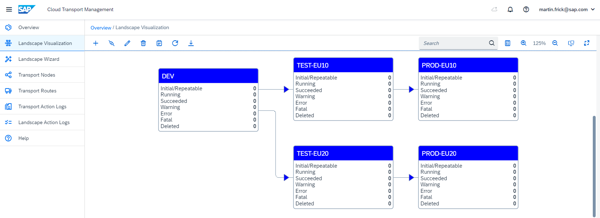
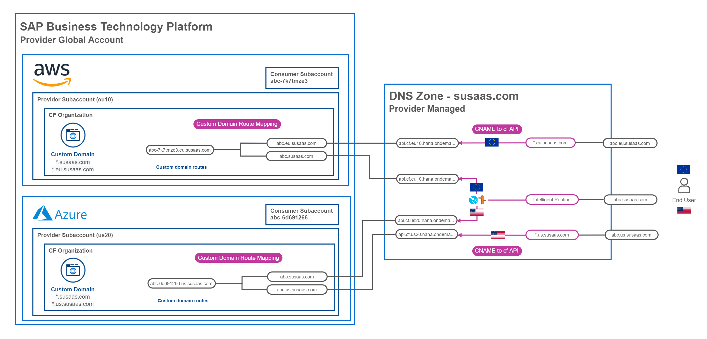

# Deployment to multiple SAP BTP regions

This part of the **Expert Scope** will provide a high-level overview for SaaS providers planning to deploy their solution to multiple SAP BTP regions, including options for intelligent traffic routing. Offering your SaaS application in multiple SAP BTP regions has some great advantages which we will briefly discuss in the following chapter. 

1. [Introduction](#1-Introduction)
2. [Multi Region Scenario](#2-Multi-Region-Scenario)
3. [Sample Scenarios](#3-Sample-Scenarios)
4. [Custom Domain](#4-Custom-Domain)
5. [Further information](#5-Further-information)

This chapter is kept comparatively short, and we ask for your feedback here. The topic of multi-region scenarios can fill books and there is tons of information available online. So we're happy about your input, which topic is of special relevance for you when it comes to multi-region scenarios in SAP BTP. Feel free to reach out to us and we will try to enhance the documentation accordingly. 

## 1. Introduction

The SAP Business Technology Platform allows you to deploy solutions to SAP-managed datacenters and four different hyperscalers (AWS, Azure, Google, Alicloud) using the same SAP BTP Global Account. While this is already a great benefit, as you're not forced to have a separate enterprise contract with all of these providers, you can also benefit from the great regional availability. With four hyperscalers to choose from, your SAP BTP solutions can be deployed all across the globe from Australia to Asia, Europe and North or even South America. 

Let us summarize some major advantages of deploying your solution to multiple SAP BTP regions:

- Multi-region deployments allow you to set up failover scenarios in case of regional downtimes or updates
- Multi-region deployments provide lower latency for the regional users of your application 
- Multi-region deployments will help you increase your local user base in a region 
- Multi-region deployments guarantee compliance with local regulatory requirements and privacy laws

In the following, we will provide you with some ideas and thoughts which you should consider before starting your own scenario and will also show you one example setup for a multi-region deployment.

## 2. Multi-Region Scenarios

While the deployment of an existing application to a different region can be done fairly easily in a Cloud Foundry context (Create Subaccount > Assign Entitlements > Deploy Solution), there are some aspects to consider before offering your solution in multiple regions around the globe. Let us just briefly mention a few of them. 

### Cost vs. Benefits

Hosting your solution in multiple regions comes with increased costs. Not just from a platform or service consumption perspective, but also from a maintenance point of view. You should do an in-depth calculation if investments are justified by a proportional payback in the near future. Please consider, that the cost perspective covers a variety of aspects. A deployment in an additional region might increase your platform costs, but also makes your application more resilient when it comes to failover scenarios. Violating SLAs that you guarantee to your own customers might easily cost you more than additional platform costs for a potential failover region.

### Multi-region scenario

Multi-region is not always the best choice to solve your requirements. Be clear on your multi-region scenario and potential alternative approaches that might be much simpler and cost-efficient. For application updates, consider using [blue-green deployment](https://help.sap.com/docs/BTP/65de2977205c403bbc107264b8eccf4b/772ab72204f04946b79ce2d962e64970.html?locale=en-US) approaches instead of routing traffic to a secondary region during update timeframes. 

Make sure you completely understand the existing scalability and failover options (e.g., using the Autoscaler service or SAP HANA Cloud in multiple Availability Zones) for all your application layers before setting up an additional region. Also, consider provisioning an additional region on-demand only or start and stop expensive resources in a region if not in use. 

### User base location

You should start to deploy the first instance of your SaaS application in a region that is closest to the majority of your user base. This will result in lower latency for your application users. If you expect the majority of your initial users to be situated in Europe, you should go for a European region. If your application go-live is successful and you see a lot of traffic from users in the US, it might make sense to spin up another instance of your application in an American region.

### Regulatory requirements

In case your application is storing data that is subject to government regulations or data privacy laws, you might be enforced to stick to certain regions that guarantee that data is not leaving or can only be accessed from within a certain region.

### Hyperscaler affinity

With new services like **SAP Private Link**, the service offerings of hyperscalers like Azure, AWS, and SAP BTP are getting closer than ever before. If you're experienced in e.g., Amazon AWS or Microsoft Azure it might make sense to go for a region in these landscapes and to leverage your knowledge and existing developments to enhance your SAP BTP solutions. 

### Service offerings in regions

Not all SAP BTP services are available in each region and with each hyperscaler. Please make sure that the region of your choice offers all services required by your (SaaS) application. If not, you need to switch to another close-by region or a different hyperscaler. You can find details about the service availability in [SAP Discovery Center](https://discovery-center.cloud.sap/viewServices?provider=all&regions=all). 

Besides the advantages of providing your application in multiple regions, be aware of some complexities and challenges that arise from such setups. The following list is not encompassing but will give you an idea which further aspects you should consider on your journey.  

### Multiple Services Instances 

When spinning up your application in an additional region, you will need to duplicate all required services. This leads to additional costs and increased maintenance effort. Make sure you have a clear understanding of the services and service plans you are using. For example, a region with 10.000 application users might require a larger database layer than a region with just 1000 users. Especially expensive services like SAP HANA Cloud or the Custom Domain Service will increase your TCO if being used in multiple regions.

### Development, test & maintenance

Multiple regions will increase your effort along the whole DevOps circle. This starts with the application development, the setup of proper pipelines, writing and monitoring tests for the regions, and maintaining your application layers in the different locations. 

This includes e.g., backups, updates, or hotfixes. Also, user management, credential rotation, and many more things will keep you busy with each additional region. Make sure you have sufficient knowledge and resources to develop for and to manage multiple regions. 

### Stages per region

Deploying your application to different regions or even different hyperscalers might be simple from a deployment perspective but the devil is in the details. Different regions and/or hyperscalers might use diverse technology stacks so you cannot assume that a successful deployment in one region will always result in a reliable deployment in another region. 

For that reason, you should also have test stages for your various regions and first, check the latest developments there before applying them to productive landscapes. This will of course again increase the number of required services. You might consider sharing expensive resources between subaccounts in the same region. 

### Persistency considerations

While multi-region deployments can be used to support failover scenarios, please make sure that your application is suitable for such scenarios. While SAP HANA Cloud supports multiple Availability Zones (within a certain region), there is no support for multi-region scenarios yet. If your application relies on data stored by users in a dedicated region, these users will probably appreciate a failover to another region but might be frustrated if their data is not available in the other region.

If you're interested in high availability patterns using globally distributed persistency options of hyperscalers like AWS (e.g. Aurora DB) or Azure (e.g. Cosmos DB), check out the following blog posts:

* [SAP Blog - SAP CAP Application Dynamic Data Source Routing](https://blogs.sap.com/2022/11/10/sap-cap-application-dynamic-data-source-routing/)
* [SAP Blog - Distributed Resiliency of SAP CAP applications using Amazon Aurora (Read Replica) with Amazon Route 53](https://blogs.sap.com/2022/11/14/distributed-resiliency-of-sap-cap-applications-using-amazon-aurora-read-replica-with-amazon-route-53/)

While these setups are a great option for standalone CAP applications, the PostgreSQL support of CAP is still limited and mainly community driven. Especially for SaaS scenarios in a CAP context (requiring tenant isolation using containers), **SAP HANA Cloud** is the database of choice. 

> **Hint** - Check the latest SAP HANA Cloud [Roadmap details](https://roadmaps.sap.com/board?PRODUCT=73554900100800002881&range=CURRENT-LAST), to find the latest news on multi-region support.

### Smart Routing approaches

Smart routing approaches based on the availability of a region, the user's location, or latency, require additional services offered by hyperscalers like Amazon AWS ([Route 53](https://aws.amazon.com/route53/)) or Microsoft Azure ([Traffic Manager](https://learn.microsoft.com/en-us/azure/traffic-manager/traffic-manager-overview)). These kind of DNS routing services are not part of the SAP BTP service portfolio and you will need to get yourself an account with one of the mentioned Infrastructure as a Service providers. 

So much for now about considerations and aspects, you should keep in mind when expanding your application deployment to further regions. Let's have a look at the following sample architecture, which shows a potential multi-region setup in a very simplified scenario. 

## 3. Sample Scenarios

Let us provide you with one sample scenario for a multi-region SaaS application setup and deployment process. Check the below architecture to get an idea what such a simple setup could look like. 

The above sample scenario covers the deployment of a sample SaaS application to **three stages** (dev, test, production) in two different regions **eu10** and **eu20**. Let us check the development, test, and release flow before highlighting some of the discussed multi-region aspects. 

* The application development itself happens in a central **dev** subaccount located in the **eu10** region.
* Using the SAP CI/CD Service combined with SAP Cloud Transport Management the **DevOps processes** can be (partly) automated. 
* In the first step, the latest developments are always deployed to the **test** subaccounts in the **eu10** and **eu20** target regions. 
* In the test stage, the SaaS provider and also consumers (if required) can test the latest developments.
* If the tests are successful, the developments can be transported to the **production** subaccounts of the **eu10** and **eu20** regions.

From a service perspective, you can see that most services are duplicated in the subaccounts of each stage. Exceptions are the SAP CI/CD and SAP Cloud Transport Management service which are situated in the dev subaccount. Also one SAP HANA Cloud Instance is shared between the eu10 dev and the eu10 test subaccounts.

In this sample scenario, one SAP Identity Authentication Service instance per stage is being used and not per region. 

From a persistency aspect, this scenario is only suitable for consumers that don't rely on data stored in specific regions or for consumers that want to use a certain region because of latency or regulatory reasons. 

### Sample Setup in SAP BTP

The following screenshot shows a sample directory and subaccount structure for the above scenario in which a SaaS application is running in two different regions (eu10 and eu20). You can see that the **Subscriber** has a **Test** subaccount in the **eu10** region and **Production** subaccounts in the **eu10** and **eu20** regions. Development happens in a central **eu10** subaccount. 

The number of subaccounts will increase with the number of SaaS consumers, so make sure to properly gather your subaccounts into directories (stages, apps, regions, consumers, ...) and assign proper labels. To add to the above subaccount structure - a potential Landscape Visualization in SAP Cloud Transport Management could look like the following. 

> **Hint** - For sure, you can also include further nodes in your own scenario (Pre-Prod, Performance,  ...) or handle the deployment to different regions using the SAP CI/CD service or your own Jenkins server. 

## 4. Custom Domain

Especially in the case of mult-region deployments, it is important to have an understanding of the Custom Domain service. Instead of offering your consumers a default SAP-provided application domain like **subscriber-7k7tmze3-susaas.cfapps.eu10.hana.ondemand.com**, you can offer them simple domains like **subscriber.eu10.susaas.com** or even **subscriber.susaas.com**.

Using custom domains is also essential in case of failover scenarios. For these scenarios, you usually provide your consumers a single point of entry like **subscriber.susaas.com**. The actual failover from **subscriber.eu10.susaas.com** to **subscriber.eu20.susaas.com** is happening in the background without the user even noticing. 

To get a proper understanding of the Custom Domain service and how to set up scenarios like the one above, please check the respective **Expert Scope** chapter on [Custom Domain Usage](../custom-domain-usage/README.md). Below you can see sample route mappings of a consumer named **subscriber** in two regions (eu10 and eu20). 

These almost equivalent route mappings in the Custom Domain service of both regions are then combined with an intelligent routing mechanism provided by a hyperscaler like AWS ([Route 53](https://aws.amazon.com/route53/)) or Azure ([Traffic Manager](https://learn.microsoft.com/en-us/azure/traffic-manager/traffic-manager-overview)). 

This makes the multi-region application instances reachable by either using region-specific URLs (**subscriber.eu10.susaas.com**) or a region-independent URL (**subscriber.susaas.com**). In the second case, the user is routed to one of both regions based on the availability, latency, geographical distance or other smart routing measures defined by the SaaS provider.

Below you can see sample screenshots of an Azure Traffic Manager profile, which is routing traffic to either **eu10** or **eu20** based on **availability** whereas the eu10 region has the highest priority. 

The screenshots below show the result of such a smart routing feature. One and the same application can now be reached via two different URLs. Either region-dependent or region-independent based on the Traffic Manager profile above. 

## 5. Further information

If you want to learn more about-multi region or high-availability scenarios, we recommend starting with the following sources.

* [SAP Blog - SAP BTP Multi-Region reference architectures for High Availability and Resiliency](https://blogs.sap.com/2022/07/21/sap-btp-multi-region-reference-architectures-for-high-availability-and-resiliency/)
* [SAP Blog - Architecting solutions on SAP BTP for High Availability](https://blogs.sap.com/2021/08/17/architecting-solutions-on-sap-btp-for-high-availability/)
* [SAP Help - Setting Up Your Account Model](https://help.sap.com/docs/BTP/df50977d8bfa4c9a8a063ddb37113c43/2db81f42f5194454beecde6cd4994dda.html?locale=en-US)
* [SAP Help - Planning Failover on SAP BTP](https://help.sap.com/docs/BTP/df50977d8bfa4c9a8a063ddb37113c43/8c46464783664ac4a748e70a91e08508.html?locale=en-US)
* [SAP Help - Implementing Failover](https://help.sap.com/docs/BTP/df50977d8bfa4c9a8a063ddb37113c43/df972c5529004c428e05a90966d17dca.html?locale=en-US)