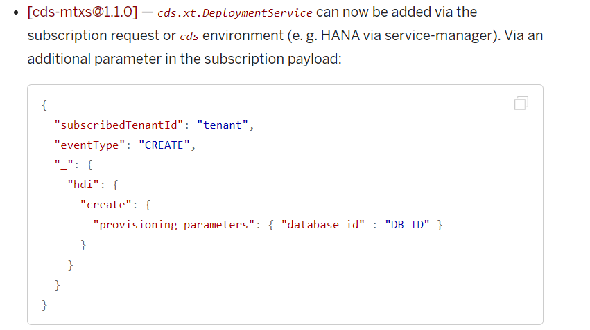
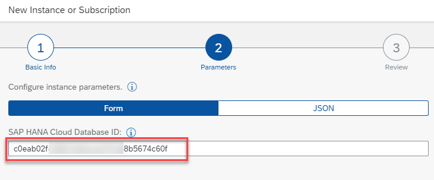
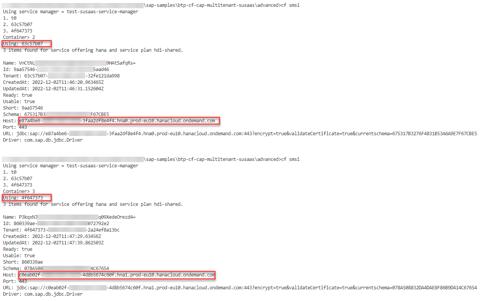

# Use multiple SAP HANA Cloud instances

In this part of the **Expert Scope** you will get an ideo how to set up a scenario in which you do not want to share the same SAP HANA Cloud instance among all your SaaS consumers but require separate SAP HANA Cloud instances for selected or all your customers. This might for example be required for legal reasons concerning data privacy regulations. 

> **Important** - This part of of the Expert Scope has been added based on a question in the SAP Community. As the approach has not been tested extensively by our team, please make sure to test your setup end-to-end including the whole lifecycle of the container managed by the Service Manager - Create, Update, Delete!

1. [Setup Steps](#1-Setup-Steps)
2. [Further Details](#2-Further-Details)

> **Important** - The following scenario assumes that your SaaS application is running in the **same SAP BTP Region** and **SAP BTP Global Account** as the consumer-specific SAP HANA Cloud instances. Scenarios with SAP HANA Cloud instances running in other SAP BTP Regions are not supported by the approach below. For access requirements across SAP BTP Regions or SAP BTP Global Accounts, please consider manually connecting to the SAP HANA Cloud instances from within your application logic using the **@sap/hdbext** npm package. You might store the credentials of each consumer's SAP HANA Cloud instance in a Secure Store and read it when connecting from your application logic. 


## 1. Setup Steps

Since release 1.1.0, the **@sap/cds-mtxs** package ([click here](https://www.npmjs.com/package/@sap/cds-mtx)) provides you an option to pass a **database_id** in the subscription payload ([click here](https://cap.cloud.sap/docs/releases/changelog/?q=provisioning_parameters)) to define the target database of the new tenant container.

[](./images/MHC_Docu.png?raw=true)

If you adapt the **saas-registry** config in your **mta.yaml** file accordingly, you can provide the database_id of an **existing SAP HANA Cloud database** available in your Cloud Foundry Space upon setup of a new subscription. Start by changing the saas-registry resource configuration in your mta.yaml file as you can see below. This allows you to provide a **databaseId** parameter during the subscription process of a new SaaS consumer tenant. 

> **Hint** - You can also set up a new SAP HANA Cloud instance during the subscription process and use the resulting datbase_id instead of creating the SAP HANA Cloud instance upfront manually for each new customer (depending on your use-case).

```yaml
# --------------------- REGISTRY SERVICE ---------------------
- name: susaas-registry
# ------------------------------------------------------------
type: org.cloudfoundry.managed-service
requires:
- name: susaas-uaa
- name: susaas-srv-api
- name: susaas-approuter
parameters:
service: saas-registry
service-name: ${space}-susaas-registry
service-plan: application
config:
    xsappname: ~{susaas-uaa/XSAPPNAME}
    appName: ~{susaas-approuter/application}-${org}
    displayName: Sustainable SaaS ${space}
    description: Sustainable SaaS Application
    category: SaaS Multitenant Apps
    propagateParams: true
    paramsSchema: 
        schemas: 
        subscription:
            create:
            parameters:
                $schema: 'http://json-schema.org/draft-04/schema#'
                additionalProperties: false
                _show_form_view: true
                type: 'object'
                properties:
                databaseId:
                    type: 'string'
                    title: 'SAP HANA Cloud Database ID'
                    description: 'Enter SAP HANA Cloud Database ID'
    appUrls:
        onSubscription: ~{susaas-srv-api/srv-url}/-/cds/saas-provisioning/tenant/{tenantId}
        onSubscriptionAsync: false
        onUnSubscriptionAsync: false
        getDependencies: ~{susaas-srv-api/srv-url}/-/cds/saas-provisioning/dependencies
    appPlans:
        - name: default
        description: Sustainable SaaS default plan
```

The resulting popup when creating a new subscription will look like the following. Just paste the ID of the target SAP HANA Cloud database here when setting up a new subscription in a tenant subaccount. 

[](./images/MHC_Parameter.jpeg?raw=true)

During subscription, you can read the **databaseId** parameter and add it to the subscription payload in the required format (as described in the CAP changelog - [click here](https://cap.cloud.sap/docs/releases/changelog/?q=provisioning_parameters)). 

```js
service.on('UPDATE', 'tenant', async (req, next) => {
    console.log("Subscription data:",JSON.stringify(req.data));
    const Automator = require("./utils/automator");

    if(req.data?.subscriptionParams?.databaseId){
        let params = {
            "_": {
                "hdi": {
                    "create":{
                        "provisioning_parameters": { 
                            "database_id" :  req.data?.subscriptionParams?.databaseId
                        }
                    }
                }
            }
        };

        req.data = { ...req.data, ...params }
    }
    ...
}
```

Before your deploy your changes, make sure to provide a **default** database_id in the **requires** section of your **package.json** or **cdsrc.json** file. A sample can be found below. This is required for the technical **t0** tenant, which contains tables and data managed by CAP. Furthermore, this SAP HANA Cloud database will be used for consumer tenants where you do not provide a separate database ID in the subscription process. 

```json
"[production]": {
    "multitenancy": true,
    "toggles": true,
    "extensibility": true,
    "cds.xt.DeploymentService": {
        "hdi": {
            "create": {
                "provisioning_parameters": { "database_id" : "e87a4be6-abcd-1234-efgh-73ff2df8e4f4" }
            }
        }
    }
}
```

So how can you check whether a container has been deployed to the separate SAP HANA Cloud instance you provided in the subscription process? Well, you can check it in the Service Manager binding details. As you can see in the following screenshot, the Service Manager currently manages three containers. Besides the technical **t0** container, two additional SaaS tenant containers are available. As you can see in the details, the tenant containers are deployed to different SAP HANA Cloud instances, based on the database ID parameter provided in the subscription process.  

[](./images/MHC_Result.png?raw=true)


## 2. Further Details

**Shared Database Container**

Please note, that the usage of a shared database container in such a scenario comes with additional complexity. In our sample scenario, we completely removed the shared database container from our **mta.yaml** and also the references in the CAP data model (**db** folder).

