# Setup CI/CD for your Project

In this part of the **Expert Scope** you will learn how to set up the **SAP Continuous Integration and Delivery (CI/CD)** service to handle all your DevOps-related tasks like automated tests, builds, and deployments of your code changes to speed up your development and delivery cycles.


1. [Introduction](#1-Introduction)
2. [Setup SAP CI/CD Service](#2Setup-SAP-CI/CD-Service)
3. [Provide SAP BTP credentials](#3-Provide-SAP-BTP-credentials)
4. [Provide GitHub credentials](#4-Provide-GitHub-credentials)
5. [Provide Service Broker credentials](#5-Provide-Service-Broker-credentials)
6. [Add your repository](#6-Add-your-repository)
7. [Create a GitHub Webhook](#7-Create-a-GitHub-Webhook)
8. [Add the Webhook to GitHub](#8-Add-the-Webhook-to-GitHub)
9. [Configure a CI/CD Job](#9-Configure-a-CI/CD-Job)
10. [Create the pipeline files](#10-Create-the-pipeline-files)
11. [Push and test](#11-Push-and-test)
12. [Additional Unit Tests](#12-Additional-Unit-Tests)
13. [Enhance your pipeline](#13-Enhance-your-pipeline)
14. [Further Information](#14-Further-Information)


## 1. Introduction

In the following part of the **Expert Scope**, you will learn how to set up an SAP CI/CD service instance in your SAP BTP environment. You will enhance your existing project with some additional files allowing an automated build and deployment of your SaaS application to a Cloud Foundry space of your choice. 

To understand the basics of Continuous Integration and Delivery, please start reading the official **SAP Help** documentation ([click here](https://help.sap.com/docs/CONTINUOUS_DELIVERY/f3d64e9188f242ffb7873da5dfad4278/618ca03fdca24e56924cc87cfbb7673a.html?locale=en-US)).

[](./images/CICD_Basics01.png?raw=true)

Continue with the most important **Concepts**, to understand the differences between **Jobs and Builds** or the concepts of **Pipelines, Stages, and Steps**, as we will use these words throughout this part of the **Expert Scope**. You can find great explanations in the official SAP Help documentation ([click here](https://help.sap.com/docs/CONTINUOUS_DELIVERY/f3d64e9188f242ffb7873da5dfad4278/707017c681aa4bc09d0279f08115dcae.html?locale=en-US))

[](./images/CICD_Basics02.png?raw=true)

[](./images/CICD_Basics03.png?raw=true)

Once you're familiar with the basic concepts, check out the details of the **SAP Cloud Application Programming Model** pipeline which we will use in the following steps. The official SAP Help documentation ([click here](https://help.sap.com/docs/CONTINUOUS_DELIVERY/f3d64e9188f242ffb7873da5dfad4278/bfe48a4b12ed41868f92fa564829f752.html?locale=en-US])) describes the pipeline and the various stages and steps used in great detail. 

[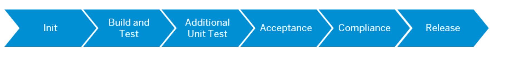](./images/CICD_Basics04.png?raw=true)

Did you get an understanding of the basic wordings and concepts? Well then let's go and get some DevOps into your sample application! 


## 2. Setup SAP CI/CD Service

The **SAP CI/CD Service** gives you access to a selected set of the **Project "Piper"** General Purpose pipeline stages and steps. Learn more about Project "Piper" in - [13. Enhance your pipeline](#13-enhance-your-pipeline). The supported steps are continously enhanced so we appreciate your feedback on any missing functionalities.

2.1. Go to your SAP BTP subaccount.

2.2. Navigate to the **Service Marketplace**.

2.3. Find the Continuous Integration & Delivery Service and subscribe to the application.

[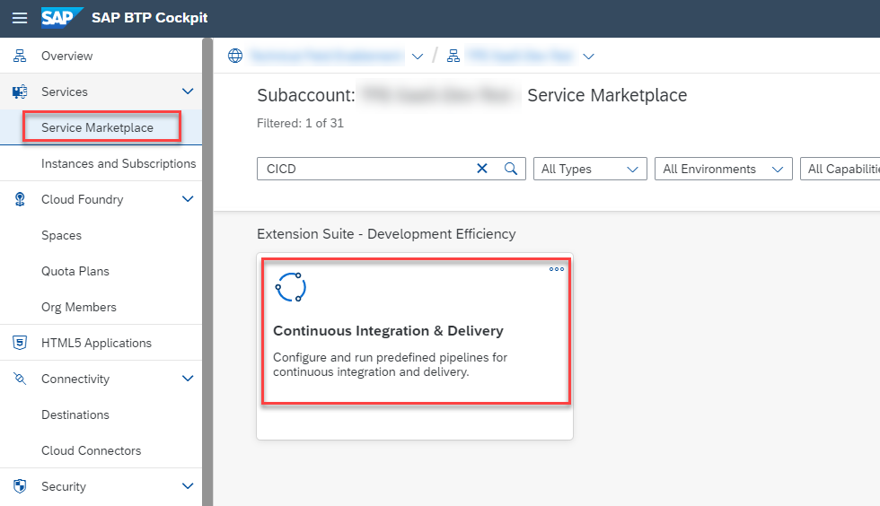](./images/CICD_Setup01.png?raw=true)

2.4. Assign the new Role Collection **"CICD Service Administrator"** to your user.

[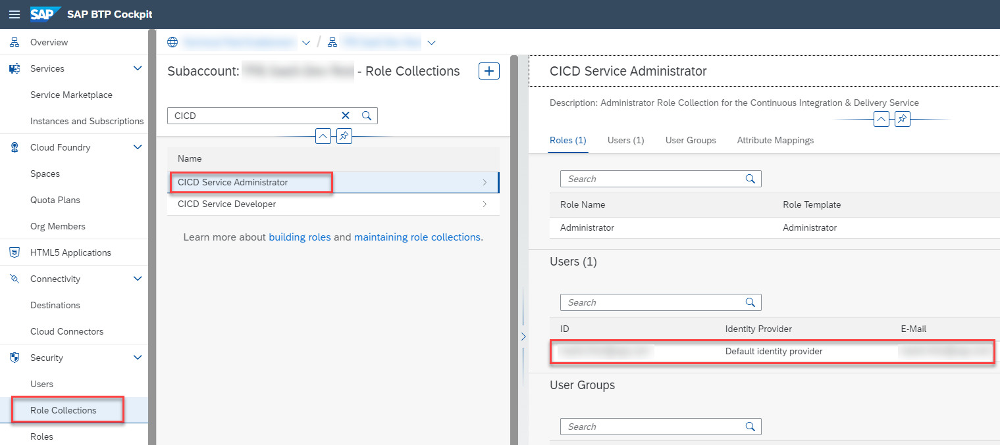](./images/CICD_Setup02.png?raw=true)


## 3. Provide SAP BTP credentials

3.1. In your SAP BTP Cockpit, click on **Instances and Subscriptions**.

3.2. Find your **Continuous Integration & Delivery** subscription.

3.3. Click on **Go to Application**.

[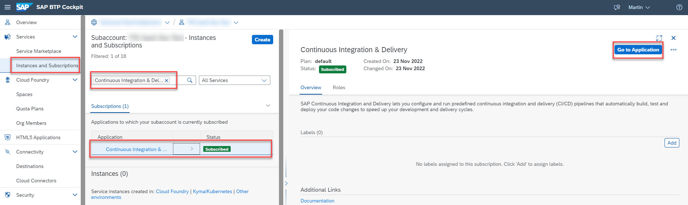](./images/CICD_Setup03.png?raw=true)

3.4. Add your SAP BTP credentials by clicking on the **Credentials** tab.

> **Hint** - These credentials are required during the deployment process. 

3.5. Click on **+**.

[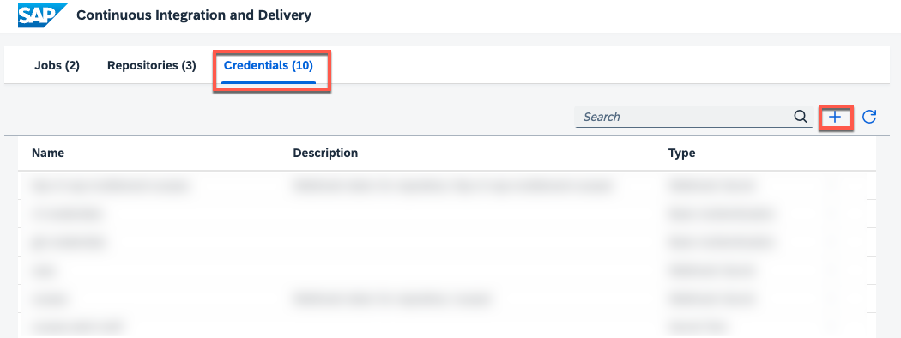](./images/CICD_Setup04.png?raw=true)

3.6. Enter a name of your choice. In this example, the name is **cf-credentials**.

> **Hint** - If you choose a different credential name than our example, you need to change your config.yml as well.

3.7. As Type select **Basic Authentication**.

3.8. As a Username, enter your SAP BTP username/email.

> **Hint** - It is recommended to provide a technical user here which can be easily added in your custom SAP IAS tenant. For test purposes, you can use your own user. Make sure the user is a Space Developer in the target Cloud Foundry Space.

3.9. As a Password, use your SAP BTP password.

3.10. Click on **Create**.

[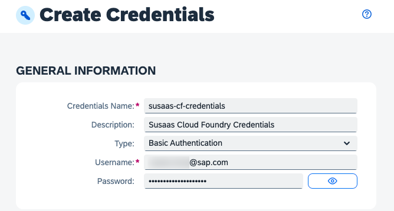](./images/CICD_Setup05.png?raw=true)

## 4. Provide GitHub credentials

4.1. In the **Credentials** menu, click on **+**.

[](./images/CICD_Setup04.png?raw=true)

4.2. Enter a name of your choice. In this example, the name is **git-credentials**.

> **Hint** - These credentials are required to pull your repository from GitHub. 

4.3. As Type select **Basic Authentication**. 

4.4. As a Username, enter your GitHub username/email.

4.5. As a Password, use a **personal access token** created in GitHub.

> **Hint** - Personal access tokens can be created in GitHub by going to *Settings* -> *Developer Settings*. Below you can find the steps to set up a sample access token. Depending on your requirements, you might need to choose a more granular security setup.<br>
[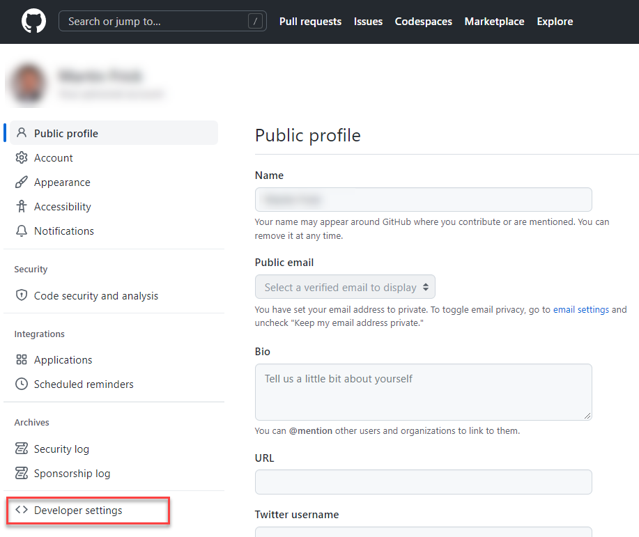](./images/CICD_Setup06.png?raw=true)
[](./images/CICD_Setup07.png?raw=true)
[](./images/CICD_Setup08.png?raw=true)

4.6. Click on create.

[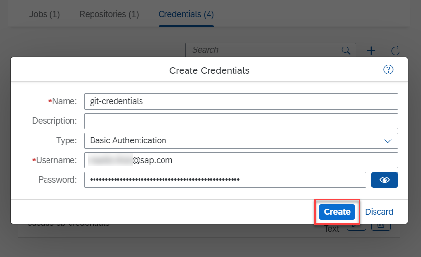](./images/CICD_Setup09.png?raw=true)


## 5. Provide Service Broker credentials

Instead of pushing your hashed API Service Broker credentials to GitHub, the credentials will be injected by SAP CI/CD Service during the deployment of your application. Therefore, you need to store these credentials in SAP CI/CD Service as a **Secret Text**. 

> **Important** - Please ensure to commit the **catalog.json** file in your broker directory including the **generated GUIDs** before running your pipeline! Otherwise, the deployment will fail! <br>
[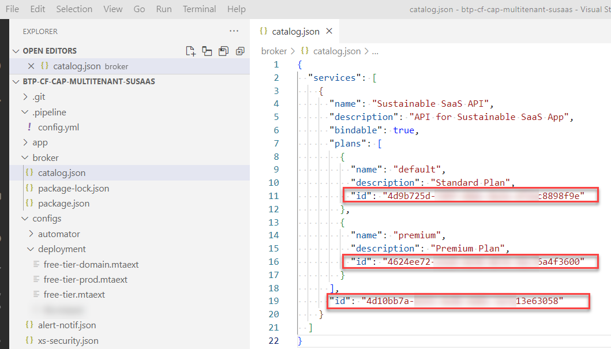](./images/CICD_CatalogIDs.png?raw=true)

5.1. In the **Credentials** menu, click on **+**.

5.2. Enter a name of your choice. In this example, the name is **susaas-sb-credentials**. 

> **Hint** - If you choose a different name, you need to adapt the respective value in your config.yml file. 

5.3. As type select **Secret Text**. 

5.4. Paste in the hashed credentials of your API Service Broker. 

[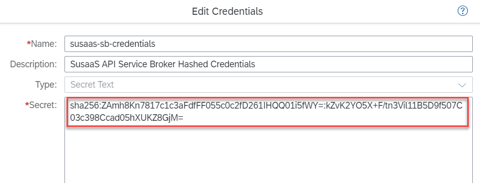](./images/CICD_SecretText.png?raw=true)

5.5. Click on **Create**.


## 6. Add your repository

6.1. Navigate to the **Repository** tab in the CI/CD Service and click on **+** to add your repository.

6.2. Provide a name for your repository like **btp-cf-cap-multitenant-susaas**.

6.3. Enter the **Repository URL** of your **forked** GitHub repository. 

> **Hint** - https://github.com/**YourUser**/btp-cf-cap-multitenant-susaas

6.4. Select your GitHub credentials (**git-credentials**) created in previous steps and click **Add**.

[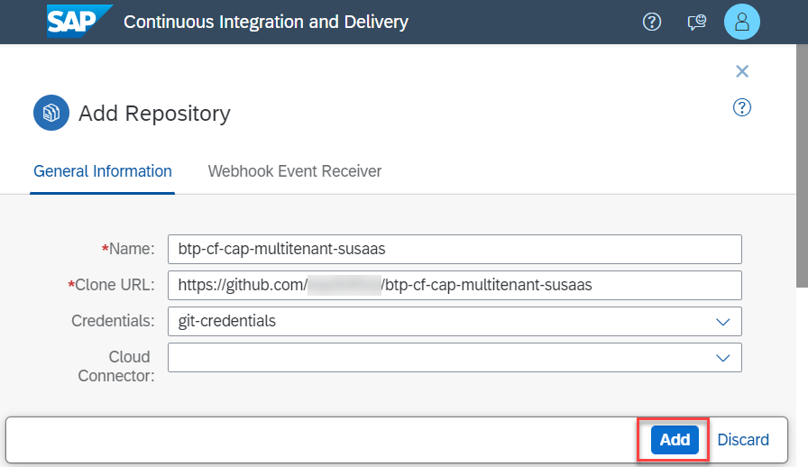](./images/CICD_Setup10.png?raw=true)


## 7. Create a GitHub Webhook
   
In this and the next step, you will read the so-called Webhook Data of the repository you just created in the SAP CI/CD service. Using this data, you can create a Webhook in GitHub. This will allow GitHub to notify your CI/CD service about code changes in your repository and trigger new a new pipeline run.

7.1. Click on **Repositories**.

7.2. Open the **Detail View** of your repository by clicking on the arrow at the end of the row.

7.3. The details view opens up on the right-hand side.

7.4. Click on **Webhook Data**.

[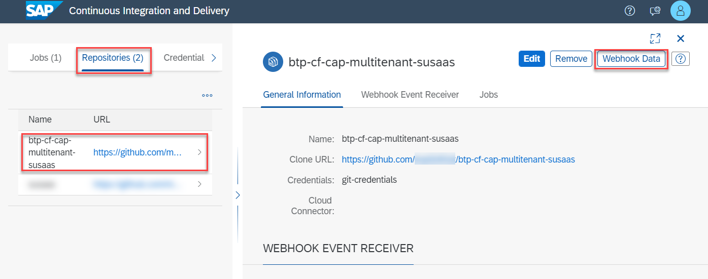](./images/CICD_Setup11.png?raw=true)
   
7.5 You will see a pop-up like the one below. Keep the pop-up open for the next steps. 

[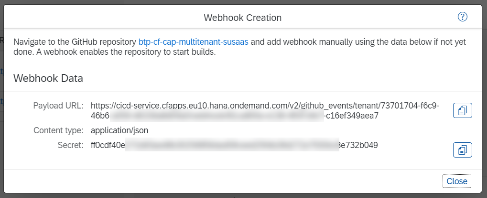](./images/CICD_Setup12.png?raw=true)


## 8.  Add the Webhook to GitHub

8.1. In your GitHub repository (https://github.com/**YourUser**/btp-cf-cap-multitenant-susaas) go to the **Settings** tab.

8.2. From the navigation pane, choose **Hooks/Webhooks**.

8.3. Choose **Add webhook**.

[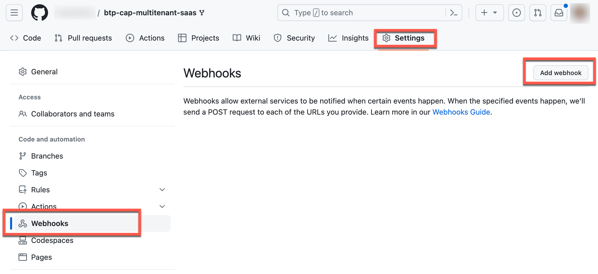](./images/CICD_WebhookGit01.png?raw=true)


8.4. The data required can be found in the CI/CD popup. First, enter the Payload URL.

8.5. Select **application/json** as Content type.

8.6. Enter the Secret.

8.7. Keep the other values default and click on **Add webhook**.

[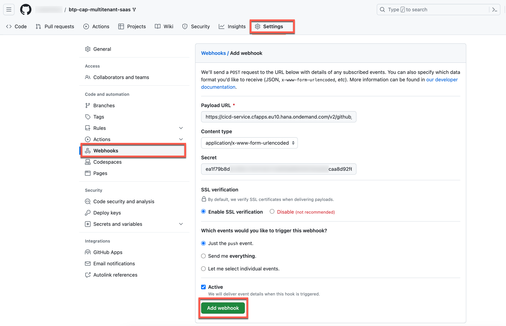](./images/CICD_WebhookGit02.png?raw=true)


## 9. Configure a CI/CD Job

9.1. In the **Jobs** tab of the CI/CD service, choose **+** to create a new job.

9.2. As **Job Name**, enter a name for your job for example **susaas-basic** or **susaas-advanced** depending on which branch you want to deploy.

9.3. From the **Repository** dropdown, select the configured repository.

9.4. As **Branch**, provide the GitHub branch from which you want to receive push events (**basic** or **advanced**).

9.5. As **Pipeline**, choose **SAP Cloud Application Programming Model**.

> **Hint** - You can find the stages and steps of this pipeline in the official SAP Help documentation ([click here](https://help.sap.com/docs/CONTINUOUS_DELIVERY/f3d64e9188f242ffb7873da5dfad4278/bfe48a4b12ed41868f92fa564829f752.html?locale=en-US)).

9.6. Keep the default values in the BUILD RETENTION section.

9.7. In the **STAGES** section, choose **Source Repository** from the **Configuration Mode** dropdown. 

> **Hint** - Instead of defining your pipeline in the source code repository, you can use the Job Editor to configure pipeline steps in the UI. 

9.8. Choose **Create**.

[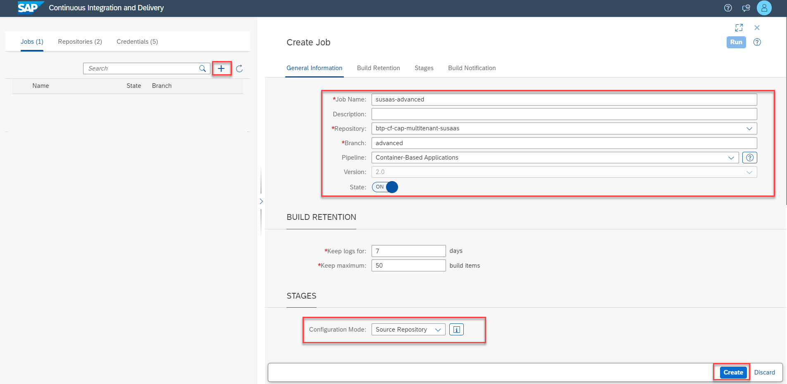](./images/CICD_Setup13.png?raw=true)


## 10. Create the pipeline files

10.1. Copy the provided [config.yml](./files/config.yml) file to a new directory named **.pipeline** (don't forget the dot!) and place the provided [Jenkinsfile](./files/Jenkinsfile) in the root of your project.

[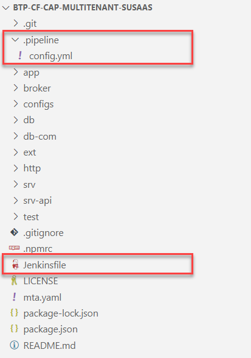](./images/CICD_RepoStructure.png?raw=true)

10.2. Place the provided [free-tier-cicd.mtaext](./files/free-tier-cicd.mtaext) file in the root of your project or add it to the *./configs/deployment/* directory. 

> **Hint** - Take the [trial-cicd.mtaext](./files/trial-cicd.mtaext) file in case of SAP BTP Trial usage. 

10.3. Update the **config.yaml** file in the *.pipline* directory and adjust the values of the **cloudFoundryDeploy** step based on your own environment/setup. Below you can find a sample configuration.


* apiEndpoint - The API endpoint of your Cloud Foundry region
* org - The target Cloud Foundry organization
* space - The target Cloud Foundry space
* mtaExtensionDescriptor - The relative path to which you saved the **mtaext file**. 


[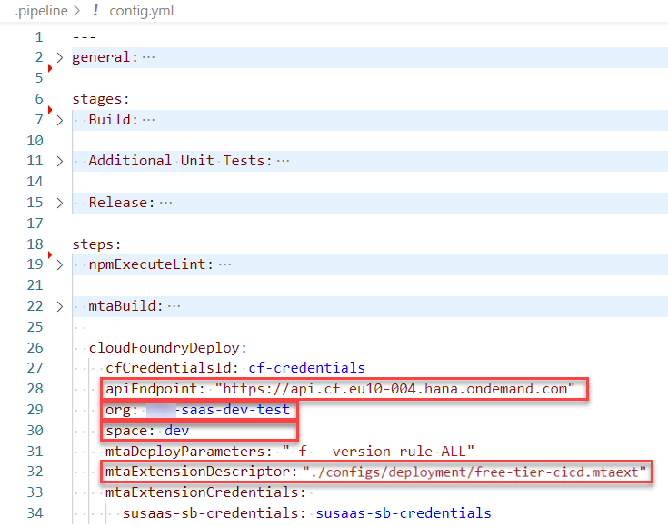](./images/CICD_ConfigSample.png?raw=true)


## 11. Push and test

11.1. Go to the terminal and execute the commands below to push the changes to your fork.

```shell
git add .
git commit -m "config.yml configured for deployment target"
git push
```

11.2. This will trigger the first job if everything went fine. 

11.3. Goto back to your SAP CI/CD service.

11.4. Check on the right-hand side whether the build has been triggered.

[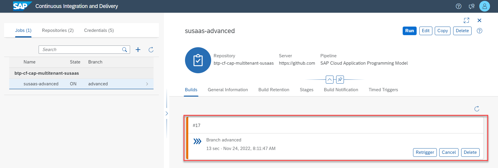](./images/CICD_Setup14.png?raw=true)

That's it, you've successfully configured your pipeline. It's a very basic setup but still should give you a good idea of how to get started and can be enhanced and customized based on your individual needs. 


## 12. Additional Unit Tests 

If you want to add additional unit tests to your pipeline, you can define them as npm scripts in the package.json of your project. Follow the steps below, to call these scripts from within your pipeline.

12.1. In the **.pipeline/config.yml** file add the following lines to execute additional tests.

12.2. In the **Stages** configuration enable the execution of npm scripts during the **Additional Unit Tests** stage. 

```
Additional Unit Tests:
  npmExecuteScripts: true
```
   
12.3. In the steps configuration, you can now add the npm scripts running your tests. 

```
npmExecuteScripts: 
  runScripts:
    - "test:odata"
```

## 13. Enhance your pipeline

The provided pipeline only contains some basic steps to build and deploy your SaaS application to a Cloud Foundry Space of your choice. A real-world pipeline will probably contain a lot more stages and steps, including automated tests, integration with SonarQube or SAP Cloud Transport Management Service, and more features. 

To enhance your pipeline, start with the official [SAP Help documentation](https://help.sap.com/docs/CONTINUOUS_DELIVERY/99c72101f7ee40d0b2deb4df72ba1ad3/bfe48a4b12ed41868f92fa564829f752.html?locale=en-US) of the SAP CI/CD service, describing the different stages and steps available in the **SAP Cloud Application Programming Model** pipeline we used in our sample. The SAP Help documentation will give you a first understanding of what is happening under the hood.

Once you feel comfortable understanding the various stages and steps included in this pipeline, you can deep dive into the official [**Project "Piper"**](https://www.project-piper.io/) documentation. SAP implements most tooling for continuous delivery in the project "Piper". The goal of project "Piper" is to substantially ease setting up continuous delivery in your project using SAP technologies. If you compare the available steps of the **Build stage** described in Project "Piper" ([click here](https://www.project-piper.io/stages/build/#build)), you will find the exact same steps in the official SAP Help documentation ([click here](https://help.sap.com/docs/CONTINUOUS_DELIVERY/99c72101f7ee40d0b2deb4df72ba1ad3/bfe48a4b12ed41868f92fa564829f752.html?locale=en-US)). 

[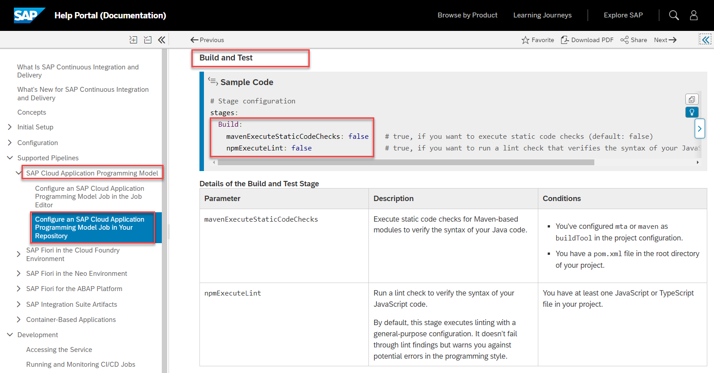](./images/CICD_PiplineComp01.png?raw=true)
[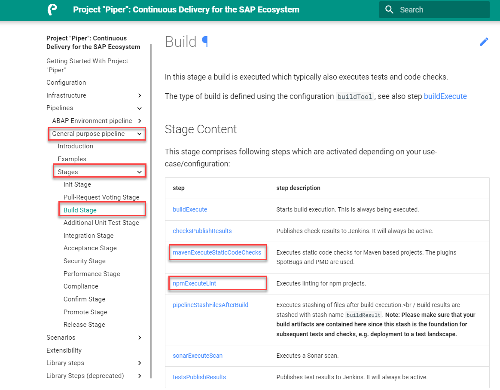](./images/CICD_PiplineComp02.png?raw=true)

The reason is very simple. Under the hood, the SAP CI/CD service also uses Project "Piper" and the various stages and steps available. Therefore, you can also use the Project "Piper" documentation to find even more details about the different stages and steps used by SAP CI/CD service and the CAP-specific pipeline. This will be very helpful to fine-tune your CI/CD pipeline!

If you want to learn more and become an expert in SAP CI/CD topics, check the following tutorial ([click here](https://developers.sap.com/tutorials/cp-uiveri5-cap.html)) in the **Tutorial Navigator**. Here you will learn, how to set up your own Docker-based Jenkins instance and you will create system tests with UIVeri5 using the UI5 Test Recorder for CAP-based projects.

Last but not least, visit the OpenSAP course **Efficient DevOps with SAP** ([click here](https://open.sap.com/courses/devops1)), in which you can learn a lot about SAP DevOps in general but also discover more examples of how to use the SAP CI/CD service in the context of CAP applications.


## 14. Further Information

Please use the following links to find further information on the topics above:

* [SAP Help - Continuous Integration and Delivery Introduction Guide](https://help.sap.com/docs/CICD_OVERVIEW/ee5a61247061455ab232c19179fe4c3b/7fc38a80cda446ef856c01f748dbede8.html?language=en-US&locale=en-US)
* [CAP Documentation - Deploy using CI/CD Pipelines](https://cap.cloud.sap/docs/guides/deployment/cicd)
* [SAP Help - SAP Continuous Integration and Delivery](https://help.sap.com/docs/CONTINUOUS_DELIVERY/99c72101f7ee40d0b2deb4df72ba1ad3/618ca03fdca24e56924cc87cfbb7673a.html?language=en-US&locale=en-US)
* [SAP Help - SAP Cloud Application Programming Model Pipeline](https://help.sap.com/docs/CONTINUOUS_DELIVERY/99c72101f7ee40d0b2deb4df72ba1ad3/7c2a049670f64993b9d67c8f84ba0969.html?language=en-US&locale=en-US)
* [Project Piper - Introduction](https://www.project-piper.io/)
* [Project Piper - General Purpose Pipeline](https://www.project-piper.io/stages/introduction/#project-piper-general-purpose-pipeline)
* [Tutorial Navigator - Automated System Tests for CAP-Based Projects](https://developers.sap.com/tutorials/cp-uiveri5-cap.html)