# Setup CI/CD for your Project

- **Kyma** ❌
- **Cloud Foundry** ✅

In this part of the **Expert Features** you will learn how to set up the **SAP Continuous Integration and Delivery (CI/CD)** service to handle all your DevOps-related tasks like automated tests, builds, and deployments of your code changes to speed up your development and delivery cycles.

- [Setup CI/CD for your Project](#setup-cicd-for-your-project)
  - [1. Introduction](#1-introduction)
  - [2. Setup SAP CI/CD Service](#2-setup-sap-cicd-service)
  - [3. Provide SAP BTP credentials](#3-provide-sap-btp-credentials)
  - [4. Provide GitHub credentials](#4-provide-github-credentials)
  - [5. Provide Service Broker catalog and credentials](#5-provide-service-broker-catalog-and-credentials)
  - [6. Add your GitHub repository](#6-add-your-github-repository)
  - [7. Create a GitHub Webhook](#7-create-a-github-webhook)
  - [8.  Add the Webhook details to GitHub](#8--add-the-webhook-details-to-github)
  - [9. Configure a CI/CD Job](#9-configure-a-cicd-job)
  - [10. Create the pipeline files](#10-create-the-pipeline-files)
  - [11. Provide further config details](#11-provide-further-config-details)
  - [12. Push and test](#12-push-and-test)
  - [13. Additional Unit Tests](#13-additional-unit-tests)
  - [14. Enhance your pipeline](#14-enhance-your-pipeline)
  - [15. Further Information](#15-further-information)


## 1. Introduction

In the following part of the **Expert Features**, you will learn how to set up an SAP CI/CD service instance in your SAP BTP environment. You will enhance your existing project with some additional files allowing an automated build and deployment of your SaaS application to a Cloud Foundry space of your choice. 

To understand the basics of Continuous Integration and Delivery, please start reading the official **SAP Help** documentation ([click here](https://help.sap.com/docs/CONTINUOUS_DELIVERY/f3d64e9188f242ffb7873da5dfad4278/618ca03fdca24e56924cc87cfbb7673a.html?locale=en-US)).

[](./images/CICD_Basics01.png?raw=true)

Continue with the most important **Concepts**, to understand the differences between **Jobs and Builds** or the concepts of **Pipelines, Stages, and Steps**, as we will use these words throughout this part of the **Expert Features**. You can find great explanations in the official SAP Help documentation ([click here](https://help.sap.com/docs/CONTINUOUS_DELIVERY/f3d64e9188f242ffb7873da5dfad4278/707017c681aa4bc09d0279f08115dcae.html?locale=en-US))

[](./images/CICD_Basics02.png?raw=true)

[](./images/CICD_Basics03.png?raw=true)

Once you're familiar with the basic concepts, check out the details of the **SAP Cloud Application Programming Model** pipeline which we will use in the following steps. The official SAP Help documentation ([click here](https://help.sap.com/docs/CONTINUOUS_DELIVERY/f3d64e9188f242ffb7873da5dfad4278/bfe48a4b12ed41868f92fa564829f752.html?locale=en-US])) describes the pipeline and the various stages and steps used in great detail. 

[](./images/CICD_Basics04.png?raw=true)

Did you get an understanding of the basic wordings and concepts? Well then let's go and get some DevOps into your sample application! 


## 2. Setup SAP CI/CD Service

The **SAP CI/CD Service** gives you access to a selected set of the **Project "Piper"** General Purpose pipeline stages and steps. Learn more about Project "Piper" in - "Enhance your pipeline". The supported steps are continously enhanced so we appreciate your feedback on any missing functionalities.

2.1. Go to your SAP BTP subaccount.

2.2. Navigate to the **Service Marketplace**.

2.3. Find the Continuous Integration & Delivery Service and subscribe to the application.

[](./images/CICD_Setup01.png?raw=true)

2.4. Assign the new Role Collection **"CICD Service Administrator"** to your user.

[](./images/CICD_Setup02.png?raw=true)


## 3. Provide SAP BTP credentials

For a deployment to your Cloud Foundry landscape, the SAP BTP, CI/CD Service requires user credentials of a respective SAP BTP user account possessing Space Developer permission in the target Cloud Foundry Space. 

3.1. In your SAP BTP Cockpit, click on **Instances and Subscriptions**.

3.2. Find your **Continuous Integration & Delivery** subscription.

3.3. Click on **Go to Application**.

[](./images/CICD_Setup03.png?raw=true)

3.4. Add your SAP BTP credentials by clicking on the **Credentials** tab.

> **Hint** - These credentials are required during the deployment process. 

3.5. Click on **+**.

[](./images/CICD_Setup04.png?raw=true)

3.6. Enter a name of your choice. In this example, the name is **susaas-cf-credentials**.

> **Hint** - If you choose a different credential name, you need to adapt your *config.yml*.

[](./images/CICD_Setup05.png?raw=true)

3.7. As Type select **Basic Authentication**.

3.8. As Username, enter your SAP BTP username/email. 

> **Hint** - For productive scenarios, it is highly recommended to provide a dedicated **technical user** here which can be easily added in your custom SAP IAS tenant. For test purposes, you can use your own user. Make sure the user is a Space Developer in the target Cloud Foundry Space.

3.9. As Password, use your SAP BTP password.

3.10. Double check your credentials and click on **Create**.


## 4. Provide GitHub credentials

To deploy the latest version of your code, the SAP BTP, CI/CD service requires access to your GitHub repository. The respective credentials will be configured in the next steps. 

4.1. Switch back to the **Credentials** menu and click on **+**.

[](./images/CICD_Setup04.png?raw=true)

4.2. Enter a credential name of your choice. In this example, the name is **git-credentials**.

[](./images/CICD_Setup09.png?raw=true)

4.3. As Type select **Basic Authentication**. 

4.4. As Username, enter your GitHub username/email.

4.5. As Password, use a **personal access token** created in GitHub.

> **Hint** - Personal access tokens can be created in GitHub by going to *Settings* -> *Developer Settings*. Below you can find the steps to set up a sample access token. Depending on your requirements, you might need to choose a more granular security setup.<br>
[](./images/CICD_Setup06.png?raw=true)<br>
[](./images/CICD_Setup07.png?raw=true)<br>
[](./images/CICD_Setup08.png?raw=true)<br>

4.6. Double check your credential details and click on **Create**.


## 5. Provide Service Broker catalog and credentials

Instead of pushing your Service Broker catalog details and hashed credentials to GitHub, those values will be injected dynamically by SAP CI/CD Service during the deployment of your application. Therefore, you need to store the service catalog details and hashed credentials in SAP CI/CD Service as a **Secret Text** credential. 

5.1. Switch to the the **Credentials** menu and click on **+**. 

5.2. Enter a credential name of your choice. In this example, the name is **susaas-sb-credentials**. 

> **Hint** - If you choose a different name, you must adapt the *config.yml* file. 

[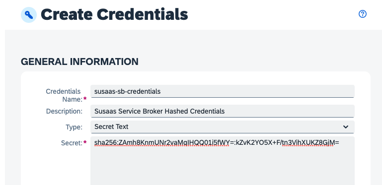](./images/CICD_HashedCred.png?raw=true)

5.3. As **Type** select **Secret Text**. 

5.4. Paste the **hashed credentials** of your Service Broker. 

> **Hint** - These credentials are referenced as part of the CloudFoundryDeploy step of your CI/CD pipeline *config.yml* file. 

```yaml
  cloudFoundryDeploy:
    ...
    mtaExtensionCredentials: 
      susaas-sb-credentials: susaas-sb-credentials
```

> **Hint** - This allows you to reuse the credentials in your **mtaext** Deployment Descriptor Extension file using the <%= susaas-sb-credentials %> format, keeping your GitHub repository clean of any credential values. 

```yaml
modules:
  - name: susaas-api-sb
    properties:
      SBF_BROKER_CREDENTIALS_HASH:  >
        {
          "broker-user": "<%= susaas-sb-credentials %>"
        }
```

5.5. Click on **Create** to finish the configuration.

5.6. Back in the **Credentials** menu, click on **+** again.

5.7. Enter a name credential of your choice for the Service Broker catalog details. In this example, the name is **susaas-sb-catalog**. 

> **Hint** - If you choose a different name, you must adapt the *config.yml* file.  

5.8. As **Type** select **Secret Text** again. 

5.9. Paste in the service **catalog** JSON file of your Service Broker including the respective GUIDs. 

[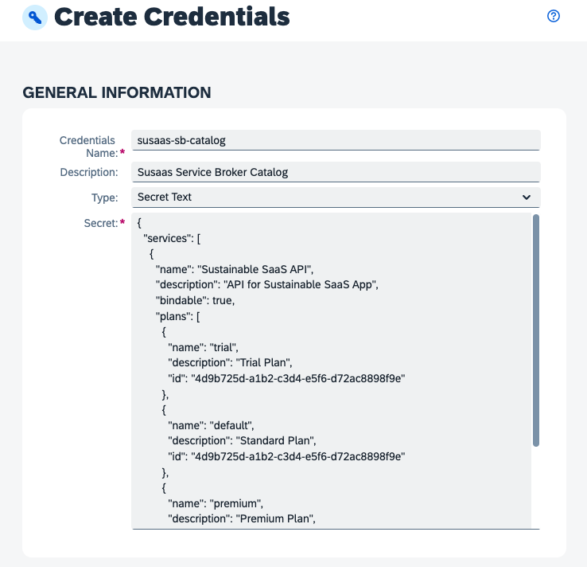](./images/CICD_Catalog.png?raw=true)

> **Hint** - These details will be fetched during the **Build** stage of your CI/CD pipeline and are injected into the respective **broker** directory as part of your *config.yml* file (see below).

```yaml
service:
  stages:
    Build:
      credentialVariables:
        - name: "Catalog"
          credentialId: "susaas-catalog"
      runFirst:
        command: echo "$Catalog" > ./code/broker/catalog-private.json
```

> **Hint** - The **mtaext** Deployment Descriptor Extension file will reference this catalog-private.json file accordingly. This approach allows you to keep your GitHub repository clean of any environment specific details. 

**mtaext.yaml**

```yaml
modules:
  - name: susaas-api-sb
    properties:
      SBF_CATALOG_FILE: ./catalog-private.json
```

5.10. Click on **Create** to finish the configuration.


## 6. Add your GitHub repository

6.1. Navigate to the **Repository** tab in the CI/CD Service and click on **+** to add your GitHub repository.

[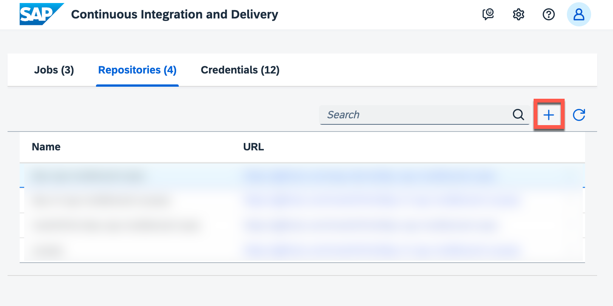](./images/CICD_Repository00.png?raw=true)

6.2. Provide a name for your repository like **btp-cap-multitenant-saas**.

[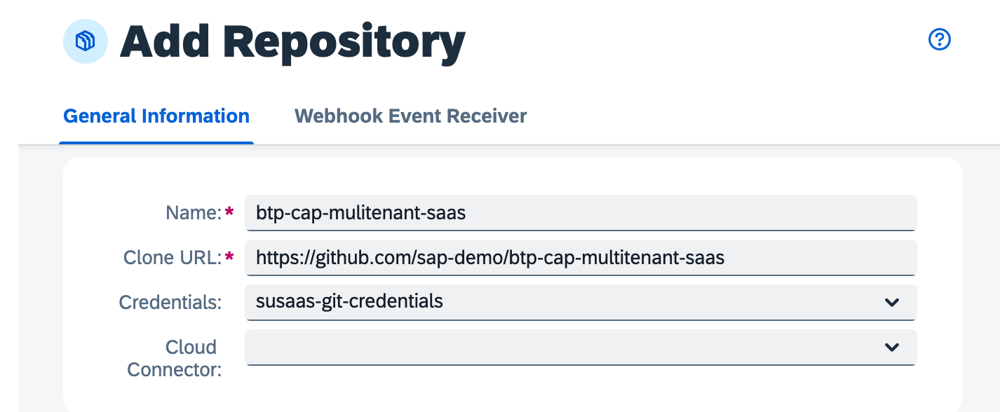](./images/CICD_Repository01.png?raw=true)

6.3. Enter the **Repository URL** of your **forked** GitHub repository. 

> **Hint** - If you forked this sample project, your URL will look like https://github.com/YourUser/btp-cap-multitenant-saas. When using a local GitHub repository, make sure you've successfully configured the Cloud Connector ([click here](https://help.sap.com/docs/continuous-integration-and-delivery/sap-continuous-integration-and-delivery/git-repositories-network-and-communication-security?locale=en-US) for details). 

6.4. Select your GitHub credentials (e.g., **susaas-git-credentials** if you followed this tutorial) created in previous steps.

6.5. Do **not click on Add** yet, but continue with the next step of the tutorial, adding new Webhook Credentials to your new repository configuration details. 
 

## 7. Create a GitHub Webhook
   
In this step, you will create a new Webhook configuration for your new repository. By doing so, you can create a respective Webhook in GitHub. This will allow GitHub to notify your SAP BTP, CI/CD service about code changes in your repository and trigger new a new pipeline run.

7.1. In the **Webhook Event Receiver** section of your new repository configuration, please select the type **GitHub** and press **Create Credentials** from the **Webhook Credential** dropdown list.

[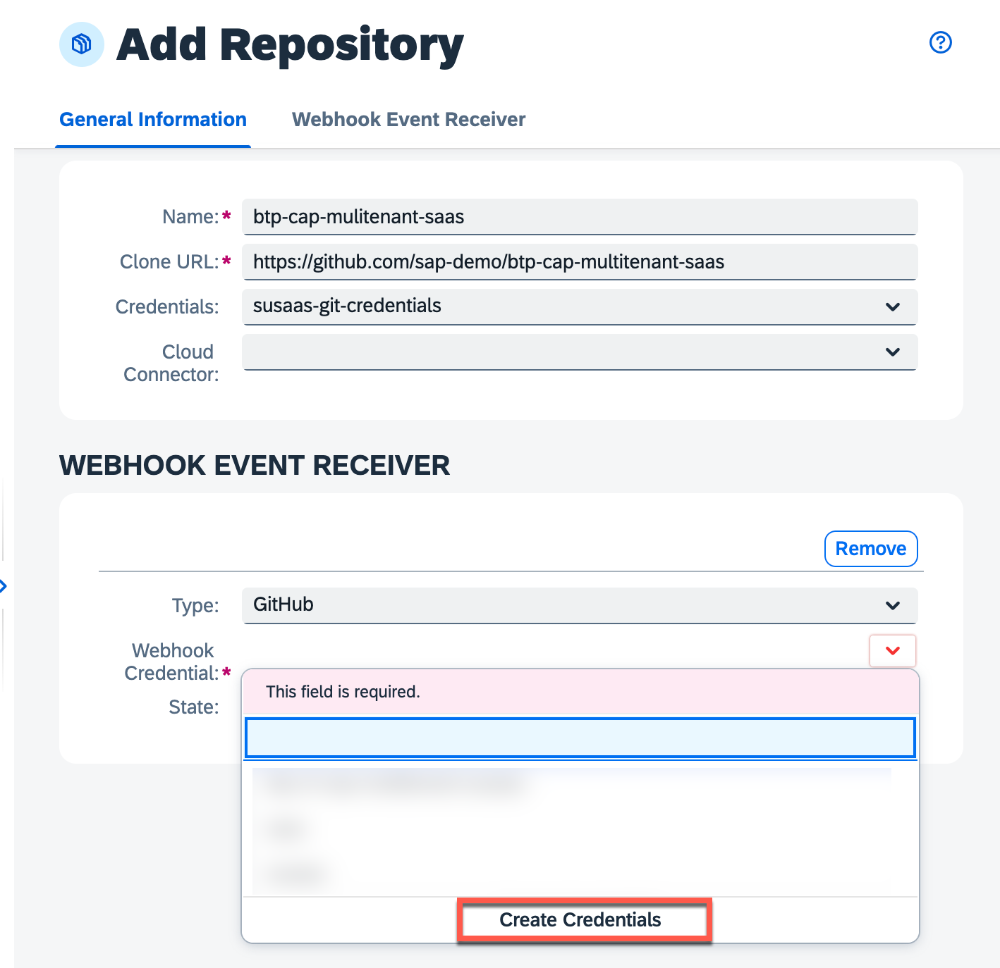](./images/CICD_Repository02.png?raw=true)

7.2. Provide a name of your choice for the new Webhook configuration and add a meaningful description. In this example, the name is **susaas-git-webhook**. 

[](./images/CICD_Repository03.png?raw=true)

7.3. Click on **Generate** to create a new Secret value! 

[](./images/CICD_Repository04.png?raw=true)

7.4. **Copy** and store the **Secret** in a secure place, as you won't be able to access the Secret again after initial creation. 

[](./images/CICD_Repository05.png?raw=true)

7.5. Click on **Create** to create the Webhook configuration in the SAP BTP, CI/CD Service.

[](./images/CICD_Repository06.png?raw=true)

7.6. Click on **Add** to finish the repository setup process. 

[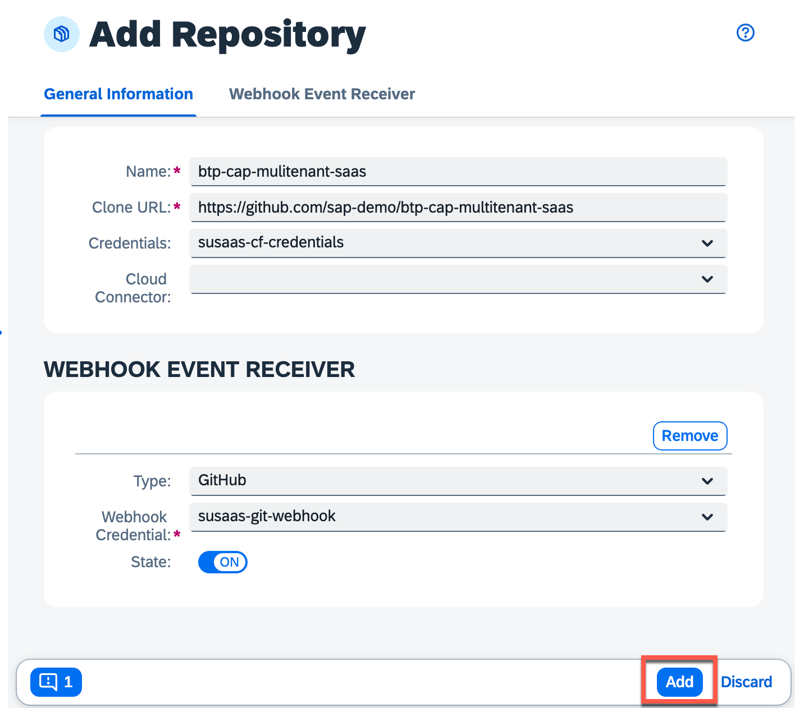](./images/CICD_Repository07.png?raw=true)


## 8.  Add the Webhook details to GitHub

8.1. In your GitHub repository (https://github.com/**YourUser**/btp-cap-multitenant-saas) go to the **Settings** tab.

8.2. From the navigation pane, choose **Webhooks**.

8.3. Choose **Add webhook**.

[](./images/CICD_WebhookGit01.png?raw=true)

8.4. The configuration data can be found in the **Webhook Data** section of your new SAP BTP, CI/CD Service repository configuration. 

[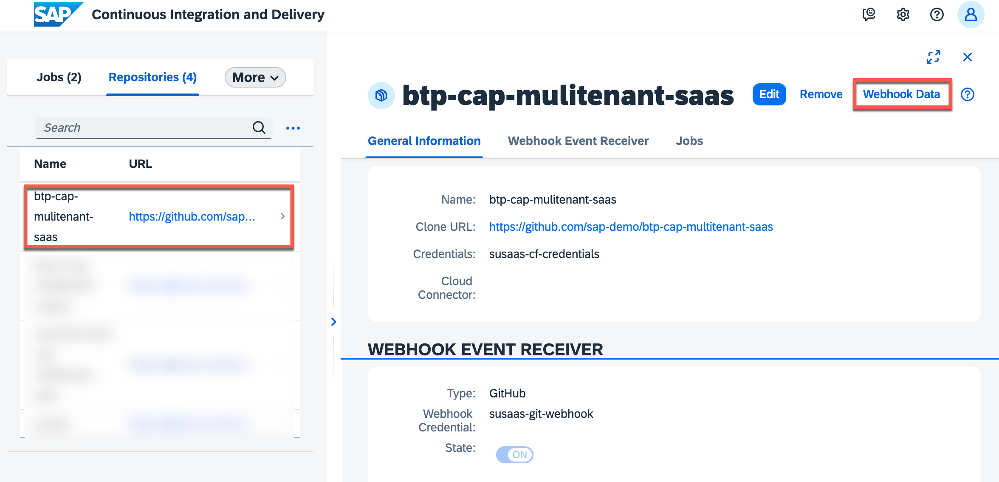](./images/CICD_Webhook01.png?raw=true)

[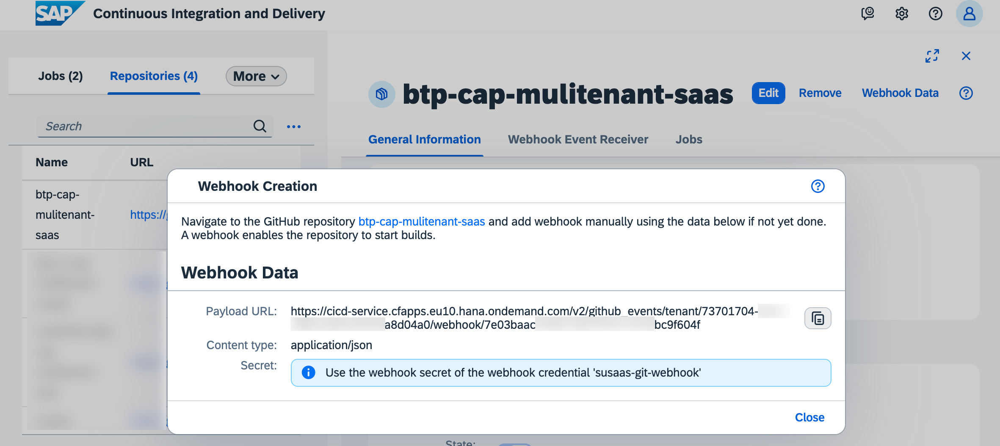](./images/CICD_Webhook02.png?raw=true)

8.5. Copy and paste the **Payload URL** from that popup to GitHub and select **application/json** as Content type.

8.6. Provide the Webhook **Secret**, which you copied and stored in a secure place a few steps before. 

8.7. Set content-type to **application/json** and click on **Add webhook**.

[](./images/CICD_WebhookGit02.png?raw=true)


## 9. Configure a CI/CD Job

9.1. In the **Jobs** tab of the SAP BTP, CI/CD service, choose **+** to create a new job.

[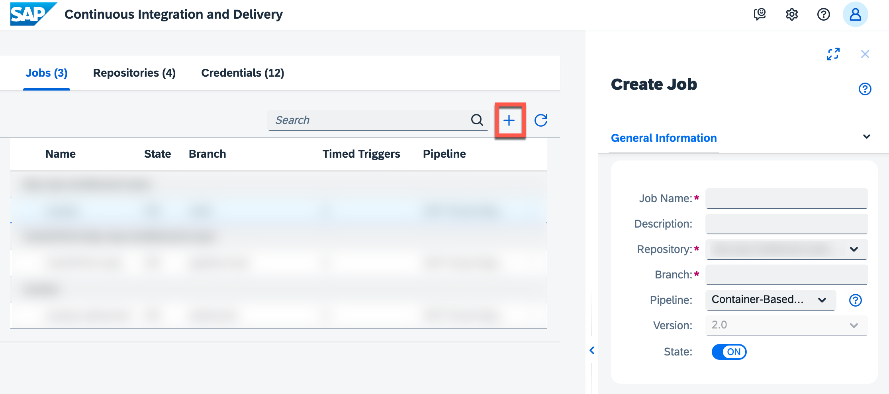](./images/CICD_Job01.png?raw=true)

9.2. As **Job Name**, enter a name for your job for example **susaas** (see below).

9.3. From the **Repository** dropdown, select the configured GitHub repository (see below).

9.4. As **Branch**, type in **main** (see below).

9.5. As **Pipeline**, choose **SAP Cloud Application Programming Model** (see below).

> **Hint** - You can find the stages and steps of this pipeline in the official SAP Help documentation ([click here](https://help.sap.com/docs/continuous-integration-and-delivery/f3d64e9188f242ffb7873da5dfad4278/configure-sap-cloud-application-programming-model-job-in-your-repository?locale=en-US)).

9.6. Keep the default values in the BUILD RETENTION section (see below).

9.7. In the **STAGES** section, choose **Source Repository** from the **Configuration Mode** dropdown (see below). 

> **Hint** - Instead of defining your pipeline in the source code repository, you can use the Job Editor to configure pipeline steps in the UI. 
 
9.8. Choose **Create** (see below).

[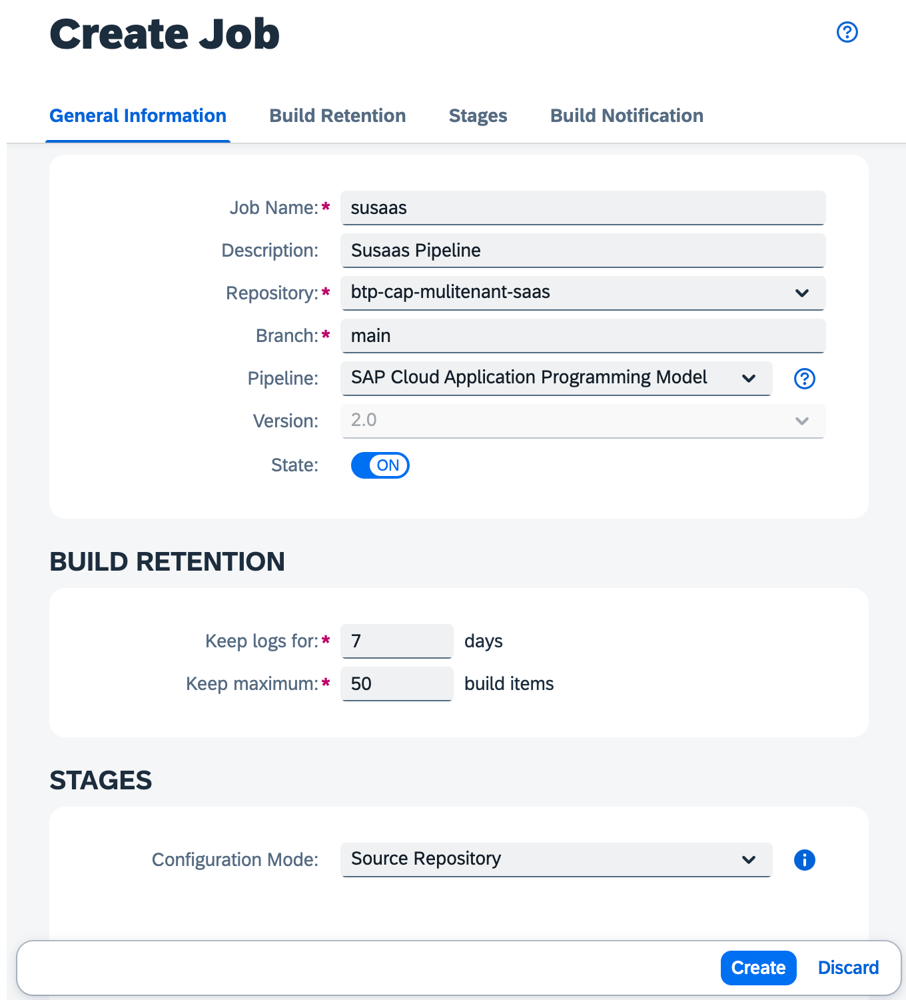](./images/CICD_Job02.png?raw=true) 


## 10. Create the pipeline files

As we configured a **Source Repository**-based pipeline, you have to provide the respective pipeline details as part of your GitHub repository. You can leverage the sample files provided as part of this **Expert Feature** to do so. 

10.1. Copy the provided [*config.yml*](./files/config.yml) file from the [*files*](./files) directory of this **Expert Feature** to a new root directory named **.pipeline** (don't forget the dot!) and also place the provided [Jenkinsfile](./files/Jenkinsfile) in the root of your project.

[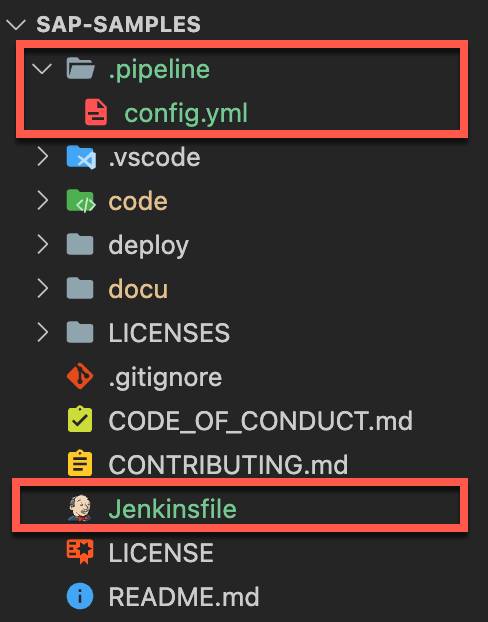](./images/CICD_RepoStructure01.png?raw=true)

10.2. Copy and paste the provided [*free-basic-cicd.mtaext*](./files/free-basic-cicd.mtaext) file from the *files* directory of this **Expert Feature** to the *./deploy/cf/mtaext* directory. 

> **Hint** - Take the [*trial-basic-cicd.mtaext*](./files/trial-basic-cicd.mtaext) file in case of SAP BTP Trial usage.  

[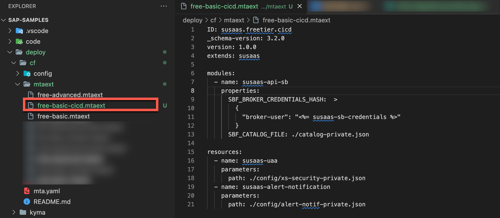](./images/CICD_RepoStructure02.png?raw=true)

> **Hint** - As this file will not contain any confidential or environment specific details, you do not need to extend the filename with a **-private** suffix.

10.3. Update the *config.yaml* file in the *.pipeline* directory and adjust the values of the **cloudFoundryDeploy** step based on your own target Cloud Foundry environment. Below you can find a sample configuration.

> **Hint** - Eventually also these details could also be stored in respective SAP BTP, CI/CD credentials, still as they are not considered extremely confidential in this scenario they will be pushed into GitHub.

* **apiEndpoint** - The API endpoint of your Cloud Foundry region
* **org** - The target Cloud Foundry organization
* **space** - The target Cloud Foundry space
* **mtaExtensionDescriptor** - The path to which you pasted the **mtaext file**. 

```yaml
cloudFoundryDeploy:
    cfCredentialsId: susaas-cf-credentials
    apiEndpoint: 'https://api.cf.eu10.hana.ondemand.com'
    org: 'sap-demo'
    space: 'dev'
    mtaDeployParameters: '-f --version-rule ALL'
    mtaExtensionDescriptor: './deploy/cf/mtaext/free-basic-cicd.mtaext'
    mtaExtensionCredentials: 
      susaas-sb-credentials: susaas-sb-credentials
```
 

## 11. Provide further config details

To make your deployment more dynamic and remove environment-specific details and confidential information from your GitHub repository, two more configuration files will be injected into your CI/CD pipeline using CI/CD Credentials. 

Let's get started with the **Alert Notification** configuration, containing your recipient's email address or potential passwords and credentials, which you might not wanna push into your GitHub repository. 

11.1. Create a new **Credential** of type **Secret Text** and name it **susaas-anf-config** (or any other name of your choice).

11.2. Paste the value of your *alert-notif-private.json* file (located in the *deploy/cf/config* directory). 

[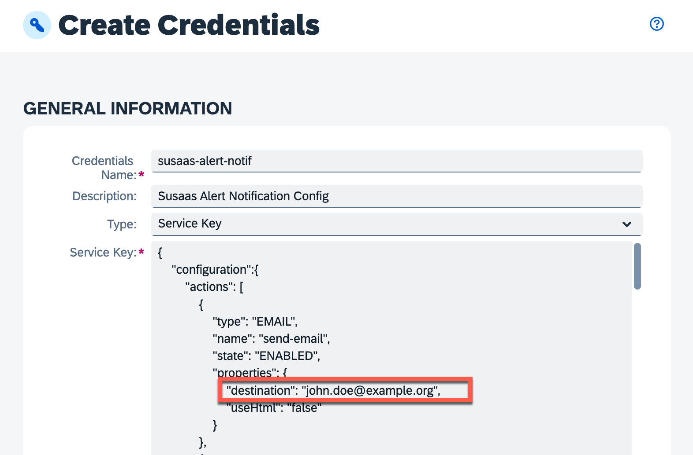](./images/CICD_AnfConfig.png?raw=true) 

11.3. The respective credential details will be dynamically read and injected during the CI/CD **Release stage** and referenced as part of your mtaext Deployment Descriptor extension.


**config.yml**

```yaml
service:
  stages:
    Build:
      # Reference CI/CD Credentials
      credentialVariables:
        - name: "AlertNotif"
          credentialId: "susaas-alert-notif"
      # Dynamically create config file during Release Stage
      runFirst:
        command: echo "$AlertNotif" > ./deploy/cf/config/alert-notif-private.json

```

**mtaext**

```yaml
ID: susaas.freetier.cicd
extends: susaas

- name: susaas-alert-notification
    # Reference dynamically generated config file
    parameters: 
      path: ./config/alert-notif-private.json
```

Repeate the same process for your **Authorization & Trust Management Service** (xsuaa) configuration. As your xsuaa configuration (xs-security.json) contains your application-specific **cfapps** subdomain or own custom domain, we use a Credential value to inject the respective details.

11.5. Create a new **Credential** of type **Secret Text** and name it **susaas-xs-security** (or any other name of your choice).

11.6. Paste the value of your *xs-security.json* file (located in the *deploy/cf/config* directory of your development environment). 

[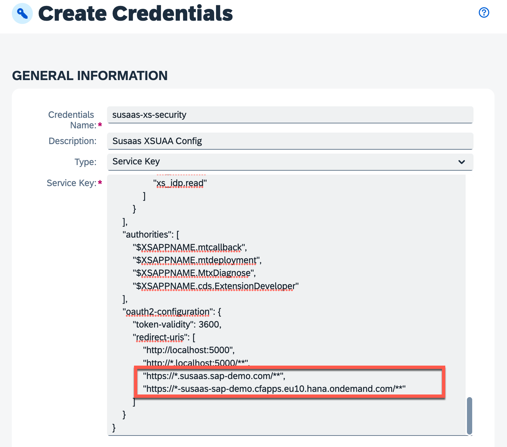](./images/CICD_XsuaaConfig.png?raw=true) 

11.7. The respective credential details will be dynamically injected during the CI/CD **Release stage** and referenced as part of your **mtaext** Deployment Descriptor extension.

**config.yml**

```yaml
service:
  stages:
    Build:
      # Reference CI/CD Credentials
      credentialVariables:
        - name: "XsSecurity"
          credentialId: "susaas-xs-security"
      # Dynamically create config file during Release Stage
      runFirst:
        command: echo "$XsSecurity" > ./deploy/cf/config/xs-security.json

```

**mtaext**

```yaml
ID: susaas.freetier.cicd
extends: susaas

- name: susaas-uaa
    # Reference dynamically generated config file
    parameters:
      path: ./config/xs-security.json
```

In a likewise manner, you can provide and inject almost any kind of environment specific configuration files into your deployments. 

## 12. Push and test

12.1. Go to the terminal and execute the commands below to push the changes to your fork.

```shell
git add .
git commit -m "config.yml configured for deployment target"
git push
```

12.2. This will trigger the first job if everything went fine. 

12.3. Goto back to your SAP CI/CD service.

12.4. Check on the right-hand side whether the build has been triggered.

[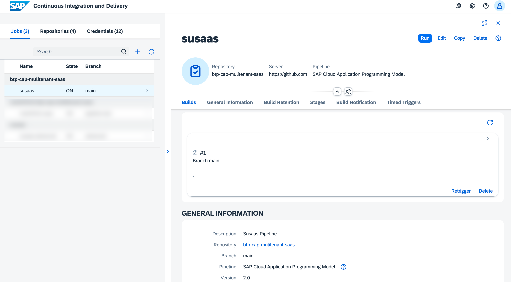](./images/CICD_Job02.png?raw=true) 

That's it, you've successfully configured your pipeline. It's a very basic setup but still should give you a good idea of how to get started and can be enhanced and customized based on your individual needs. 


## 13. Additional Unit Tests 

If you want to add additional unit tests to your pipeline, you can define them as npm scripts in the package.json of your project. Follow the steps below, to call these scripts from within your pipeline.

13.1. In the **.pipeline/config.yml** file add the following lines to execute additional tests.

13.2. In the **Stages** configuration enable the execution of npm scripts during the **Additional Unit Tests** stage. 

```
Additional Unit Tests:
  npmExecuteScripts: true
```
   
13.3. In the steps configuration, you can now add the npm scripts running your tests. 

```
npmExecuteScripts: 
  runScripts:
    - "test"
```

## 14. Enhance your pipeline

The provided pipeline only contains some basic steps to build and deploy your SaaS application to a Cloud Foundry Space of your choice. A real-world pipeline will probably contain a lot more stages and steps, including automated tests, integration with SonarQube or SAP Cloud Transport Management Service, and more features. 

To enhance your pipeline, start with the official [SAP Help documentation](https://help.sap.com/docs/CONTINUOUS_DELIVERY/99c72101f7ee40d0b2deb4df72ba1ad3/bfe48a4b12ed41868f92fa564829f752.html?locale=en-US) of the SAP CI/CD service, describing the different stages and steps available in the **SAP Cloud Application Programming Model** pipeline we used in our sample. The SAP Help documentation will give you a first understanding of what is happening under the hood.

Once you feel comfortable understanding the various stages and steps included in this pipeline, you can deep dive into the official [**Project "Piper"**](https://www.project-piper.io/) documentation. SAP implements most tooling for continuous delivery in the project "Piper". The goal of project "Piper" is to substantially ease setting up continuous delivery in your project using SAP technologies. If you compare the available steps of the **Build stage** described in Project "Piper" ([click here](https://www.project-piper.io/stages/build/#build)), you will find the exact same steps in the official SAP Help documentation ([click here](https://help.sap.com/docs/CONTINUOUS_DELIVERY/99c72101f7ee40d0b2deb4df72ba1ad3/bfe48a4b12ed41868f92fa564829f752.html?locale=en-US)). 

[](./images/CICD_PiplineComp01.png?raw=true)
[](./images/CICD_PiplineComp02.png?raw=true)

The reason is very simple. Under the hood, the SAP CI/CD service also uses Project "Piper" and the various stages and steps available. Therefore, you can also use the Project "Piper" documentation to find even more details about the different stages and steps used by SAP CI/CD service and the CAP-specific pipeline. This will be very helpful to fine-tune your CI/CD pipeline!

If you want to learn more and become an expert in SAP CI/CD topics, check the following tutorial ([click here](https://developers.sap.com/tutorials/cicd-wdi5-cap.html)) in the **Tutorial Navigator**. Here you will learn, how to set up your own Docker-based Jenkins instance and you will create system tests with UIVeri5 using the UI5 Test Recorder for CAP-based projects.

Last but not least, visit the OpenSAP course **Efficient DevOps with SAP** ([click here](https://open.sap.com/courses/devops1), in which you can learn a lot about SAP DevOps in general but also discover more examples of how to use the SAP CI/CD service in the context of CAP applications.


## 15. Further Information

Please use the following links to find further information on the topics above:

* [SAP Help - Continuous Integration and Delivery Introduction Guide](https://help.sap.com/docs/CICD_OVERVIEW/ee5a61247061455ab232c19179fe4c3b/7fc38a80cda446ef856c01f748dbede8.html?language=en-US&locale=en-US)
* [CAP Documentation - Deploy using CI/CD Pipelines](https://cap.cloud.sap/docs/guides/deployment/cicd)
* [SAP Help - SAP Continuous Integration and Delivery](https://help.sap.com/docs/CONTINUOUS_DELIVERY/99c72101f7ee40d0b2deb4df72ba1ad3/618ca03fdca24e56924cc87cfbb7673a.html?language=en-US&locale=en-US)
* [SAP Help - SAP Cloud Application Programming Model Pipeline](https://help.sap.com/docs/CONTINUOUS_DELIVERY/99c72101f7ee40d0b2deb4df72ba1ad3/7c2a049670f64993b9d67c8f84ba0969.html?language=en-US&locale=en-US)
* [Project Piper - Introduction](https://www.project-piper.io/)
* [Project Piper - General Purpose Pipeline](https://www.project-piper.io/stages/introduction/#project-piper-general-purpose-pipeline)
* [Tutorial Navigator - Automated System Tests for CAP-Based Projects](https://developers.sap.com/tutorials/cicd-wdi5-cap.html)
