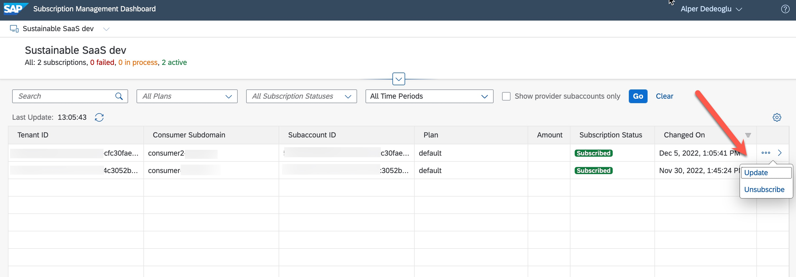
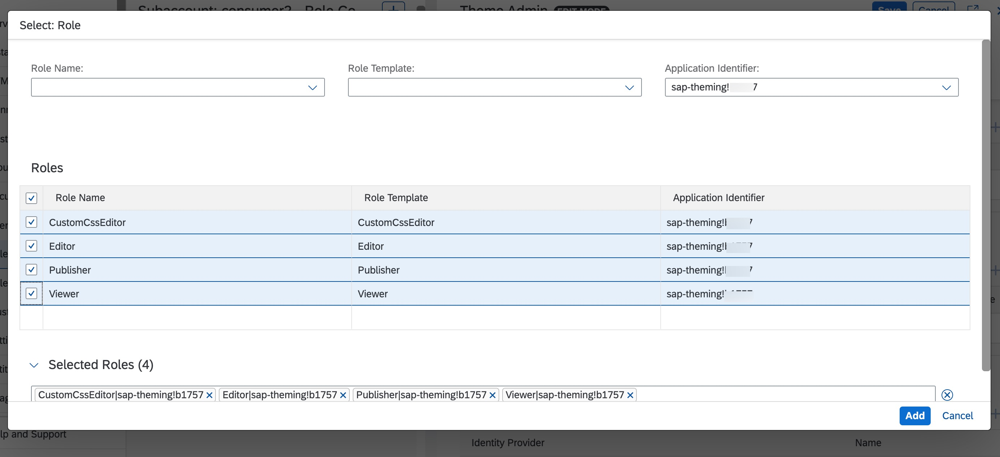
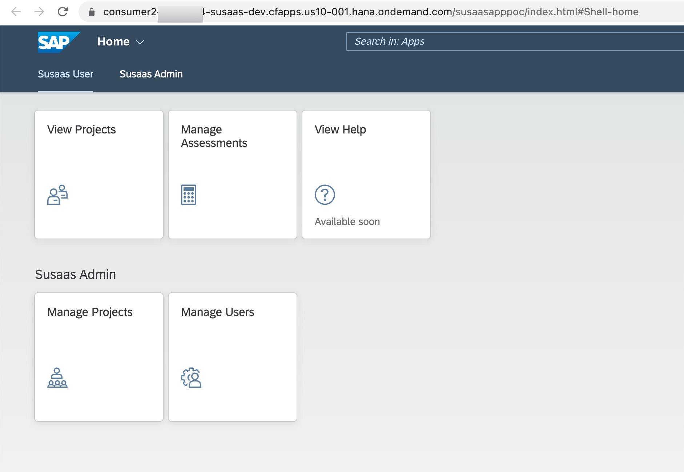
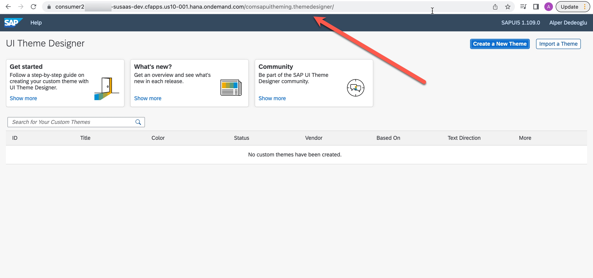
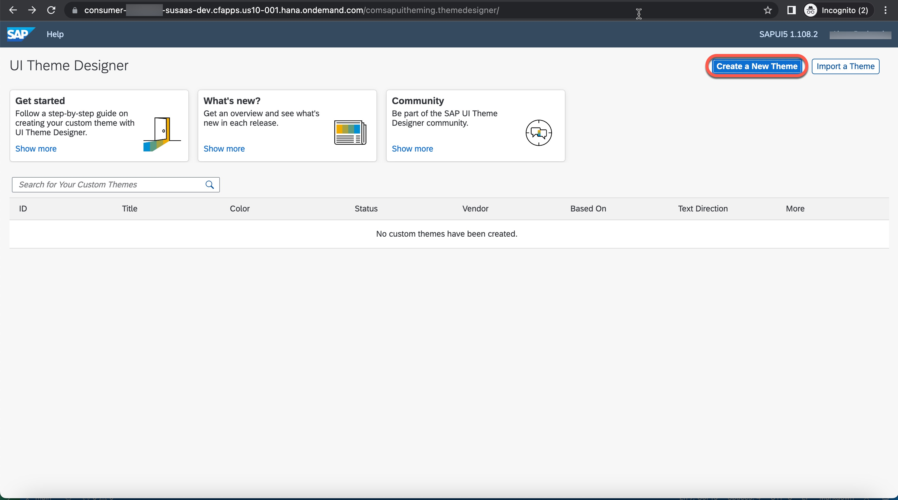
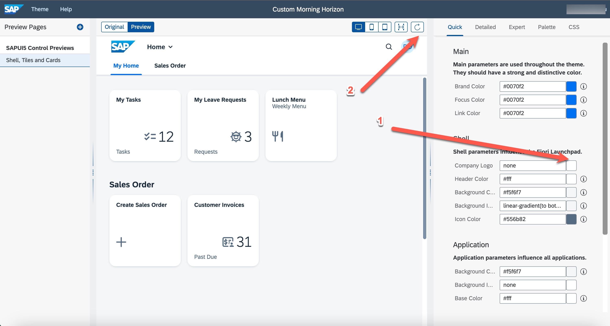
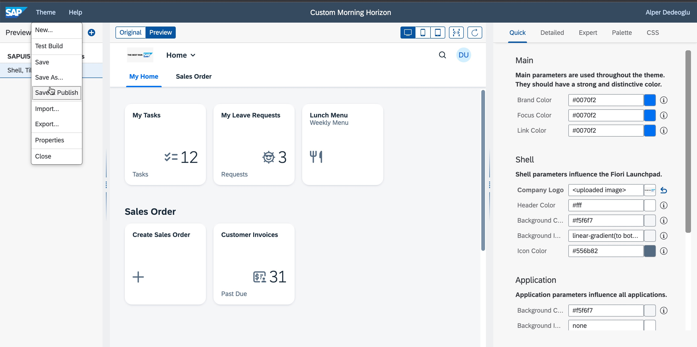
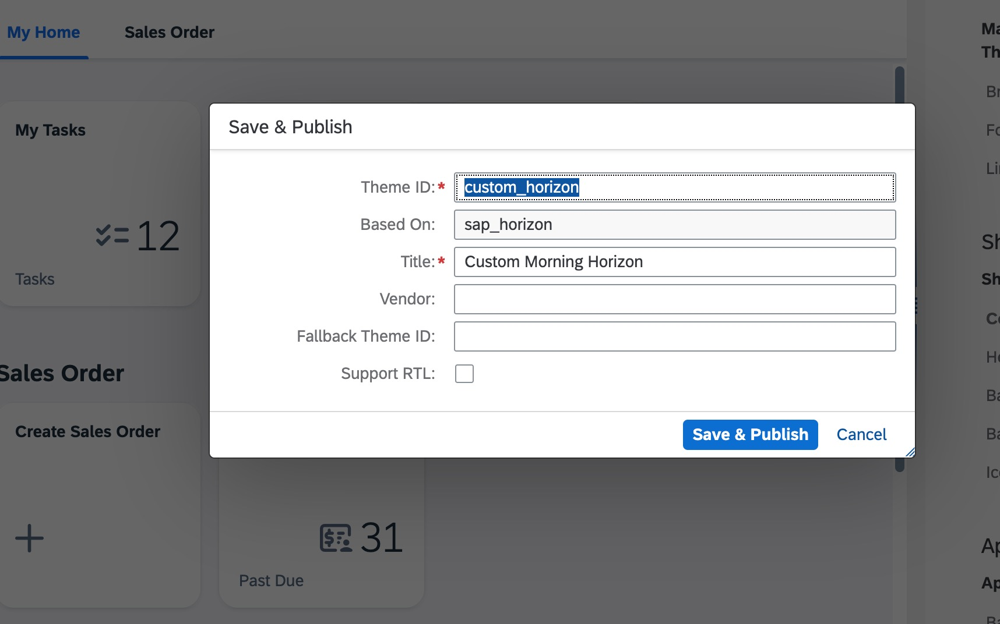
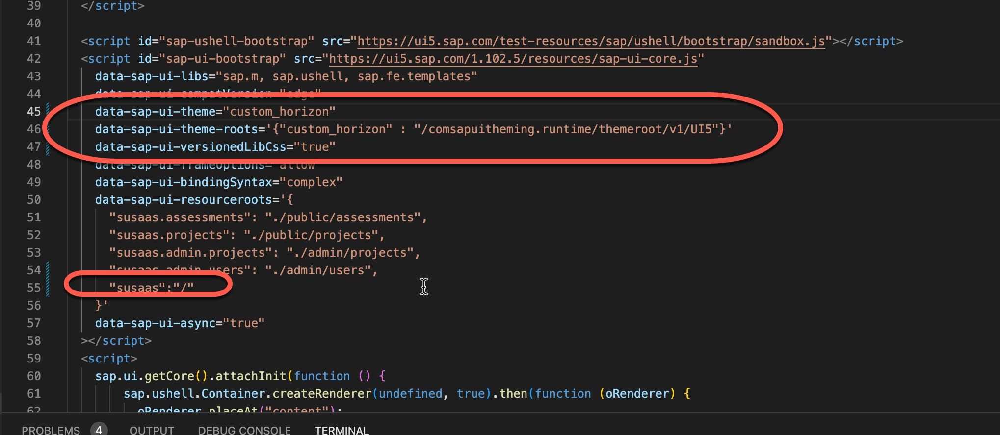

# Using SAP Theme Designer with multitenancy

- **Kyma** ❌
- **Cloud Foundry** ✅

In this part of the mission you will learn how to let your consumers use the SAP Theme Designer for creating their own custom application themes. 

- [Using SAP Theme Designer with multitenancy](#using-sap-theme-designer-with-multitenancy)
  - [Prerequsites](#prerequsites)
  - [1. Adding UI Theme Designer Entitlement](#1-adding-ui-theme-designer-entitlement)
  - [2. Adding the service to mta.yaml](#2-adding-the-service-to-mtayaml)
  - [3. Add UI Theme Designer service as a dependency to provisioning.js](#3-add-ui-theme-designer-service-as-a-dependency-to-provisioningjs)
  - [4. Rebuild and deploy your multitenant application](#4-rebuild-and-deploy-your-multitenant-application)
  - [5. Update your tenants dependencies](#5-update-your-tenants-dependencies)
  - [6. Open UI Theme Designer for your consumer subaccount (tenant)](#6-open-ui-theme-designer-for-your-consumer-subaccount-tenant)
    - [6.1. Add UI Theme Designer Entitlement to your consumer subaccount](#61-add-ui-theme-designer-entitlement-to-your-consumer-subaccount)
    - [6.2. Assign the roles to yourself to be able to use UI Theme Designer service](#62-assign-the-roles-to-yourself-to-be-able-to-use-ui-theme-designer-service)
    - [6.3. Modify the application endpoint](#63-modify-the-application-endpoint)
  - [7. Create a custom theme for your application](#7-create-a-custom-theme-for-your-application)
    - [7.1. Press Create New Theme](#71-press-create-new-theme)
    - [7.2. Change logo of the theme](#72-change-logo-of-the-theme)
    - [7.3. Publish theme with the new logo](#73-publish-theme-with-the-new-logo)
    - [7.4 Edit your SAP UI5 Application to use your custom theme](#74-edit-your-sap-ui5-application-to-use-your-custom-theme)
    - [7.5 Build and deploy the application](#75-build-and-deploy-the-application)
    - [7.6 Go to your consumer subaccount and open your application](#76-go-to-your-consumer-subaccount-and-open-your-application)

## Prerequsites

Before starting please make sure that you already have the following:
- Your multitenant application is deployed and running.

> **Hint** - You might follow this section from both Basic and Advanced Version. This example will do deployment to the **free-tier** SAP BTP Account using the Basic Version.

## 1. Adding UI Theme Designer Entitlement 
Before we start we need to add UI Theme Designer service entitlement to both **consumer** and **provider** subaccounts to be able to 
make use of theme designer service

In your **provider** subaccount, go to Entitlements to add an entitlement for the UI Theme Designer service. To do so, click Configure Entitlements  Add Service Plans and add the UI Theme Designer with plan standard to the relevant subaccount. Then click Save.

Repeat the same steps for your **consumer** subaccount.

## 2. Adding the service to mta.yaml

Go to your mta.yaml file of your application and append the UI Theme Designer service to the resources section of your mta.yaml, so that it gets generated when you make a new deployment.

After that please make sure that you put your service instance definition to the required section of **susaas** and **susaas-srv** modules so that service binding is also generated when you make a new deployment.

```yml
_schema-version: '3.2'
ID: susaas
version: 0.0.1

modules:
  # --------------------- APPROUTER MODULE ---------------------
  - name: susaas
  # ------------------------------------------------------------
    type: approuter.nodejs
    path: app/approuter
    requires:
      - name: susaas-uaa
      - name: susaas-theming # Here the theme designer bounded to approuter

  # --------------------- SERVER MODULE ------------------------
  - name: susaas-srv
  # ------------------------------------------------------------
    type: nodejs
    requires:
      - name: susaas-uaa
      - name: susaas-theming ## Here the theme designer service instance bounded to SRV
...

resources:
  ... 
  # ----------------- THEME DESIGNER ---------------------------------
  - name: susaas-theming
  # ------------------------------------------------------------------
    type: org.cloudfoundry.managed-service
    parameters:
      service: theming
      service-plan: standard
 
```

> **Hint**: You might check this example [**theme-designer-mta.yaml**](./files/theme-designer.mta.yaml) file to see an example of an mta deployment file. This deployment file has been copied from the current basic branch, and only theme designer service instance and bindings has been added to it.

## 3. Add UI Theme Designer service as a dependency to [provisioning.js](https://github.com/SAP-samples/btp-cap-multitenant-saas/blob/main/code/srv/srv/provisioning.js)

To be able to reuse the Theme Designer service within our consumer subaccounts, we need to add the **UI Theme Designer** service instance to the dependencies callback of our multitenant application.

Go to your **srv/provisioning.js** file and make the changes shown below.

```js
    service.on('dependencies', async (req, next) => {
        let dependencies = await next();
        const services = xsenv.getServices({
            html5Runtime: { tag: 'html5-apps-repo-rt' },
            destination:  { tag: 'destination' },
            themeDesigner: { tag: 'sap-theming'} // Add this line
        });

        dependencies.push({ xsappname: services.html5Runtime.uaa.xsappname });
        dependencies.push({ xsappname: services.destination.xsappname });
        dependencies.push({ xsappname: services.themeDesigner.uaa.xsappname}); // Add this line

        console.log("SaaS Dependencies:", JSON.stringify(dependencies));
        return dependencies;
    });
```

## 4. Rebuild and deploy your multitenant application

You need to build and deploy your application to activate the changes you have done on the steps before. Run the commands below to build and deploy your application again.

> **Important** - Please ensure you change your *deploy/cf/mta.yaml* file accordingly as explained above.

```sh
mbt build -e ./mtaext/free-basic-private.mtaext
cf deploy mta_archives/susaas_0.0.1.mtar
```

## 5. Update your tenants dependencies 

You need to update the dependencies of your existing **tenants** because you do not have UI theme designer as a dependency yet, since you have subscribed to this multitenant application earlier then UI Theme Designer modification.

> **Hint** - If you do not have an already subscribed consumer subaccount, you might directly create a new subaccount and subscribe to the application. You may skip the **Subscription Management Steps** below.

Go to your **provider subaccount**, assign the roles for **Subscription Management Dashboard** as documented [here](https://help.sap.com/docs/btp/sap-business-technology-platform/using-subscription-management-dashboard?locale=en-US).

Then open the **Subscription Management Dashboard** from your provider subaccount, and update **all** existing tenants as shown below.

[](./images/subscription-management-update.jpg?raw=true)


## 6. Open UI Theme Designer for your consumer subaccount (tenant)

### 6.1. Add UI Theme Designer Entitlement to your consumer subaccount

In your subaccount, go to **Entitlements** to add an entitlement for the UI Theme Designer service. To do so, click **Configure Entitlements**  Add Service Plans and add the UI Theme Designer with plan standard to the relevant subaccount. Then click **Save**.

### 6.2. Assign the roles to yourself to be able to use UI Theme Designer service

To enable users to work with the UI theme designer, administrators must assign the UI theme designer permissions to the user's role.

Administrators need to add required roles to their role collections and assign them to the users:
 - Editor (sap-theming): Create, edit, copy, and delete custom themes (but no change of Custom CSS possible)
 - CustomCssEditor (sap-theming): Create, edit, copy and delete custom themes (including changes to Custom CSS)
 - Publisher (sap-theming): Publish custom themes (but no editing)
 - Viewer (sap-theming): View custom themes in UI theme designer

So create a role collection as described [here](https://help.sap.com/docs/SAP_S4HANA_Cloud_for_Customer_Payments/b2f6973263b04162a5dfb97d30d2ee4a/913c74be68474887b9498892235f12a6.html?locale=en-US) called : **Theme Admin**.

Then go to your **Theme Admin** role collection and add the roles as shown below.

[](./images/assign-roles.jpg?raw=true)

### 6.3. Modify the application endpoint 

Go to your tenant subaccount, and then click on **Go to Application**.

[](./images/go-to-app.jpg?raw=true)

After that you should be going to your application endpoint.

[](./images/app-main-page.jpg?raw=true)

Replace your application endpoint in the browser with : *<yourapprouterurl>/comsapuitheming.themedesigner/* as shown below.

[](./images/theme-designer-main.jpg?raw=true)

## 7. Create a custom theme for your application

### 7.1. Press Create New Theme 

Press create new theme on your UI Theme Designer page as shown below and then chose theme you want to extend and press create again.

[](./images/create-new-theme.jpg?raw=true)

### 7.2. Change logo of the theme

To be able to change logo, press first company logo section and upload your logo. Then press refresh to see the logo you have uploaded.

[](./images/change-logo.jpg?raw=true)

### 7.3. Publish theme with the new logo

Press on the **Theme** button on top left, then press **Save & Publish** as shown below.

[](./images/publish-theme.jpg?raw=true)

Then give the choice **Theme ID** : custom_horizon (you will need this ID later).

Optional: You can also provide **sap_horizon** as fallback theme id.

[](./images/theme-id.jpg?raw=true)
    
And press **Save & Publish** again to finalize saving.

### 7.4 Edit your SAP UI5 Application to use your custom theme

Go to your [launchpad.html](https://github.com/SAP-samples/btp-cap-multitenant-saas/blob/main/code/app/launchpad.html) file in your application and edit as described below.

[](./images/modify-index.jpg?raw=true)

These properties must be added or modified : 
    - **data-sap-ui-theme**="custom_horizon" 
    - **data-sap-ui-theme-roots**='{"custom_horizon" : "/comsapuitheming.runtime/themeroot/v1/UI5"}'
    - **data-sap-ui-versionedLibCss**="true"
    - **data-sap-ui-resourceroots** ='{
      "susaas":"/" -> add this line
    }'

> **Hint** - Please notice that the theme id you put into **data-sap-ui-theme** and **data-sap-ui-theme-roots** properties should be the same theme id you have filled in [this step.](#73-publish-theme-with-the-new-logo)

For detailed information about step, see the [official documentation](https://help.sap.com/docs/btp/ui-theme-designer/running-custom-theme-via-sapui5-bootstrap-configuration?locale=en-US).

### 7.5 Build and deploy the application 

Do the same steps describe again as on the [step](#4-rebuild-and-deploy-your-multitenant-application). Build and deploy your application again to push the changes to your applcation.

### 7.6 Go to your consumer subaccount and open your application

Go to your consumer subaccount and click on "Go to Application" then you should see the new theme is being used.

[](./images/new-theme.jpg?raw=true)

