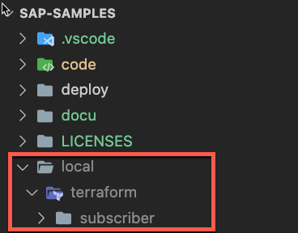
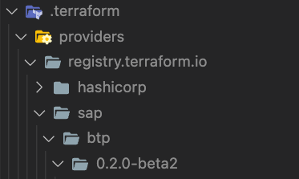

# Subscriber tenant onboarding using Terraform

- **Kyma** ✅
- **Cloud Foundry** ❌

In this part of the tutorial, you will learn how to onboard new Subscriber tenants using the SAP BTP, Terraform provider. Terraform is an open-source infrastructure as code (IAC) tool that enables you to create, manage, and provision cloud resources and infrastructure in a consistent and automated manner.

> **Important** - The SAP BTP, Terraform provider is still in **beta** state. Please use at your own risk, especially in productive scenarios. 

- [Subscriber tenant onboarding using Terraform](#subscriber-tenant-onboarding-using-terraform)
  - [1. Introduction](#1-introduction)
  - [2. Install Terraform](#2-install-terraform)
  - [3. Initialize Terraform](#3-initialize-terraform)
  - [4. Provide the scenario details](#4-provide-the-scenario-details)
  - [5. Run the scenario](#5-run-the-scenario)
  - [6. Destroy the setup](#6-destroy-the-setup)
  - [7. Good 2 Know](#7-good-2-know)
  - [8. Further information](#8-further-information)


## 1. Introduction

Onboarding new Subscriber Subaccounts can be a demanding process, especially with significant interest in your application.

- Creating Subaccounts
- Establishing Trust with SAP Identity Authentication Service
- Subscribing to the Application
- Assigning Roles to SaaS Users
- Creating New API Service Instances
- ...

Leveraging the [SAP BTP, Terraform provider](https://registry.terraform.io/providers/SAP/btp/latest/docs) streamlines these steps using a declarative and automated approach. By specifying essential environment and Subscriber user details, onboarding becomes effortless. Discover how Terraform enhances automation in handling Subscriber subaccount onboarding and offboarding.

For more details about the SAP BTP, Terraform provider please check the following links:

- [Terraform Provider for SAP BTP](https://registry.terraform.io/providers/SAP/btp/0.2.0-beta2)
- [Terraform Provider for SAP BTP - Docu](https://registry.terraform.io/providers/SAP/btp/latest/docs)
- [Terraform Provider for SAP BTP - GitHub Repository](https://github.com/SAP/terraform-provider-btp)
- [Terraform Provider for SAP BTP Announcement - Blog Post](https://blogs.sap.com/2023/06/26/terraform-provider-for-sap-btp-now-available-for-non-productive-use/)
- [Terraform Provider for SAP BTP Sample Scenario - Blog Post](https://blogs.sap.com/2023/07/03/automating-sap-btp-setup-with-the-new-terraform-provider-for-sap-btp/)


**Prerequisites**

Before proceeding, ensure you successfully **deployed the multitenant SaaS sample application** to a Kyma Cluster in your SAP BTP Global Account. Additionally, you must be in possession of **Global Account Administrator** login credentials, which are required by Terraform. 

For an end-to-end automation, please make sure, you have the **SAP BTP CLI installed** in your development environment. Terraform will utilize a SAP BTP CLI command during infrastructure setup. Download and install the SAP BTP CLI by following this [link](https://help.sap.com/docs/btp/sap-business-technology-platform/download-and-start-using-btp-cli-client?locale=en-US). Confirm that your command line displays a similar result when running `btp --version`.

```sh
btp --version

SAP BTP command line interface (client v2.x.x)
```

If you don't want to install the SAP BTP CLI, please set the following **variable** to **false** in your **terraform.tfvars** file! In this case, you will need to configure the respective Identity Provider settings manually (Disable Automatic Shadow User Creation & Disable SAP ID Service Logon).

```sh
btp_cli = false
```


## 2. Install Terraform

If you have not installed Terraform in your development environment, please follow the respective steps of the official documentation. 

(https://developer.hashicorp.com/terraform/downloads)[https://developer.hashicorp.com/terraform/downloads]

After successful installation, please make sure, Terraform is part of your environment variables, by running the following command from your command line.

```sh
terraform -v

Terraform v1.x.x
on darwin_arm64
```

If you see a similar ouput on your device, please continue with the next step of the tutorial.


## 3. Initialize Terraform

To use the SAP BTP, Terraform provider, you need to initialize Terraform in a new directory.

3.1. For this scenario, please copy the [*./files/subscriber*](./files/subscriber/) directory of this **Expert Feature** into a new folder. 

> **Hint** - To prevent confidential information from being committed to GitHub, we suggest creating a new folder called **local** in your project root for this purpose. This folder is part of the *gitignore* configuration. <br>
> [](./images/TER_LocalFolder.png?raw=true)

3.2. Change to this new directory and run the following command from your command line. 

```sh
# Run in e.g., /local/terraform/subscriber #

terraform init
```

3.3. This will initialize Terraform in the respective environment and configure the required SAP BTP, Terraform provider (specified in the *provider.tf* file). You should new see a new folder called *.terraform*. 

[](./images/TER_Providers.png?raw=true)


## 4. Provide the scenario details

Before you can run the automation, you need to provide a few details of your SAP BTP provider environment, as well as information on the Subscriber Subaccount to be created by Terraform. 

4.1. Please open the *terraform.tfvars* file, which contains all required variables. 

> **Hint** - Make sure you are not committing this variables file to GitHub! Add the **-private** suffix to be on the safe side if you like. 

4.2. Provide the details of your SaaS provider environment, including a Global Account Admin user (required to create a new Subscriber subaccount). 

```yaml
### ---------------------------- ###
### Provider environment details ###
### ---------------------------- ###

globacct  = "sap-demo"                       # Global Account subdomain
username  = "global.admin@sap-demo.com"      # Global Account Administrator e-mail
password  = "abcd1234!?#+"                   # Global Account Administrator password
ias_host  = "sap-demo.accounts.ondemand.com" # Custom IdP used for Applications 
region    = "eu10"                           # Kyma Cluster region of SaaS solution
shootname = "a1b2c3"                         # Kyma Cluster shootname of SaaS solution
namespace = "default"                        # Kyma Cluster namespace of SaaS solution
btp_cli   = true                             # Execute BTP CLI commands 
```

4.3. Provide details of the Subscriber subaccount to be created. In the following sample, a new subaccount named **susaas-example-org** (based on a similar subdomain) is created by Terraform.

> **Hint** - The Global Account Administrator used by Terraform, will automatically be added as Subaccount Administrator. 

```yaml
### ----------------------------- ###
### Subscriber Subaccount details ###
### ----------------------------- ###

# Subaccount "${project}-{tenant}" 
project = "susaas"
tenant  = "example-org"

# Additional Subaccount Administrator (optional)
# Do not add the Global Admin used for Terraform here
subaccount_admins = ["admin@sap-demo.com"]  
```

4.4. Finally, fill the details of the SaaS Subscription and API Service Instance to be created as part of the new Subscriber subaccount. 

> **Important** - Please consider, that regular SaaS application users should always be created from within the SaaS solution itself, using the integrated user management. Otherwise, you will not be able to maintain these users as part of your in-app user management.

```yaml
### -------------------- ###
### Subscription details ###
### -------------------- ###

# Subscription and Service details
app_name = "susaas"     # App xsappname w/o Kyma namespace and shootname suffix 
app_plan = "trial"      # trial/default/premium
api_name = "susaas-api" # API xsappname w/o Kyma namespace and shootname suffix 
api_plan = "trial"      # trial/default/premium

# Users being assigned the SaaS Admin Role
saas_admins  = ["saas.admin@example.org"]   
# Users being assigned the SaaS Member Role (optional)
saas_members = ["saas.member@example.org"]  
# Users being assigned the SaaS Extension Developer Role (optional)
saas_extends = ["saas.extend@example.org"]  
```

## 5. Run the scenario

Once you configured your environment specific variable values, you can **apply** the new infrastructure definition to your SAP BTP environment. 

5.1. Please run the following command from your Terraform workspace. This will provide you with an overview of all infrastructure resources (Subscriptions, Services, aso.) being created by Terraform. 

```sh
# Run in e.g., /local/terraform/subscriber #

terraform plan
```

> **Hint** - If you renamed your variables file, you can add it using the **-var-file** parameter. 
> 
> ```terraform plan -var-file=terraform-private.tfvars```

5.2. Double check the list of new resources before you **apply** the configuration to your SAP BTP environment, using the following Terraform command. 

```sh
# Run in e.g., /local/terraform/subscriber #

terraform apply
```

> **Hint** - If you renamed your variables file, you can add it using the **-var-file** parameter. 
> 
> ```terraform apply -var-file=terraform-private.tfvars```


5.3. Confirm the process by typing **yes** when requested by Terraform. 

[](./images/TER_ApplyYes.png?raw=true)

5.4. The process will take a few minutes, until the subscription is set up, all role collections are assigned and a Service Instance for the API Service is created. 


## 6. Destroy the setup

You can use Terraform to decommission the created resources. Terraform will consider defined dependencies during the decommissioning process, so there is no risk of un-registering a Service Broker before deleting the respective Service Instances. 

6.1. To revert all infrastructure setups, please run the following command from your command line. 

```sh
# Run in e.g., /local/terraform/subscriber #

terraform destroy
```

> **Hint** - If you renamed your variables file, you can add it using the **-var-file** parameter. 
> 
> ```terraform destroy -var-file=terraform-private.tfvars```

6.2. Confirm the process by typing **yes** when requested by Terraform. 

[](./images/TER_DestroyYes.png?raw=true)

6.3. Wait until the process has successfully finished and the Subscriber subaccount has been removed from your Global Account. 

## 7. Good 2 Know

As the SAP BTP, Terraform provider is still in **beta** state, please consider our recent findings when evaluating the usage as part of your scenario. 

- **Do not manually modify** or **remove resources** in your SAP BTP Subaccount, which are managed by Terraform! This might result in a scenario which makes your Terraform setup unusable, as Terraform stores the state of your infrastructure and the so-called drift detection will not be able to detect manual changes! Only modify the created resources, if you are not relying on Terraform for any further configurations of the respective subaccount after onboarding. 

- Do not use Terraform to assign the **Subaccount Administrator** role to the user being used by Terraform to setup your Subscriber subaccount. The user used by Terraform will automatically be assigned the Subaccount Administrator role in the respective account. If you assign the respective role collection using the dedicated SAP BTP, Terraform provider resource, you will face an error when destroying the subaccount through Terraform. 

- Some settings, such as the **detailed configuration of trusted Identity Providers** cannot be configured through the SAP BTP, Terraform provider yet. Luckily, you have the flexibility to run custom code, through the so called **null** resource ([click here](https://developer.hashicorp.com/terraform/language/resources/provisioners/null_resource) for details). In our scenario, we rely on the SAP BTP CLI, executing a few more configuration commands on behalf of Terraform! Nevertheless, please ensure you are not creating or removing any SAP BTP resources through this custom command process!

## 8. Further information

Please use the following links to find further information on the topics above:

* [Terraform - Official Website](https://www.terraform.io/)
* [Terraform - Intro](https://developer.hashicorp.com/terraform/intro)
* [SAP BTP Terraform Provider](https://registry.terraform.io/providers/SAP/btp/latest)
* [SAP BTP Terraform Provider Documentation](https://registry.terraform.io/providers/SAP/btp/latest/docs)
* [GitHub - SAP BTP Terraform Provider](https://github.com/SAP/terraform-provider-btp)
