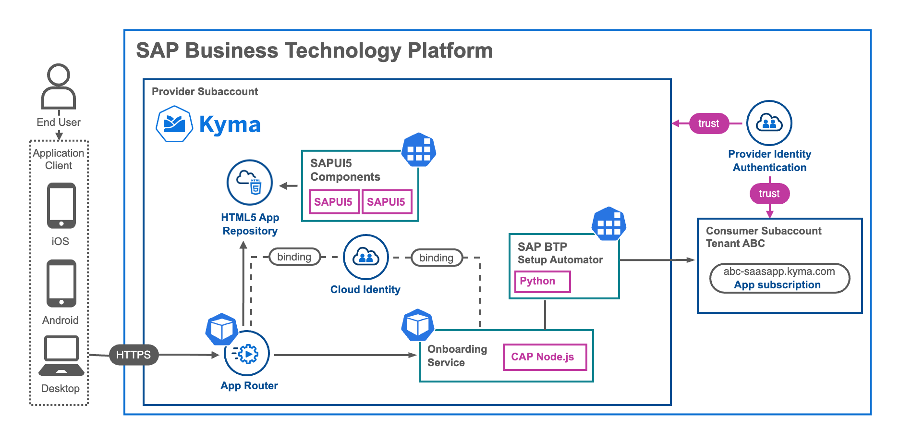
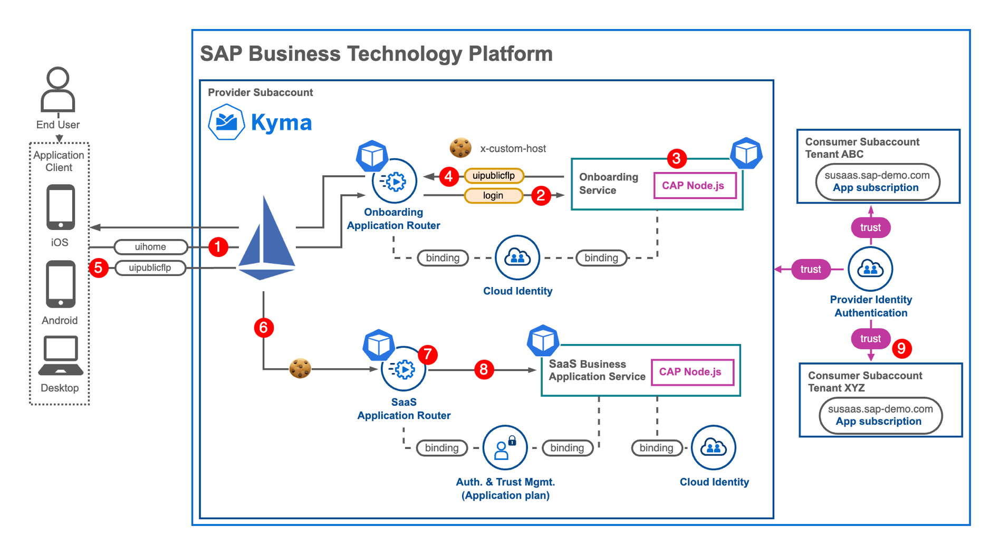
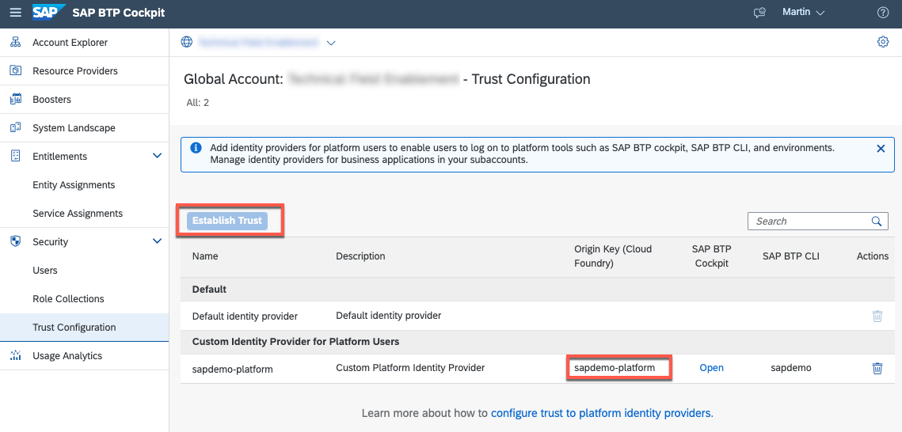
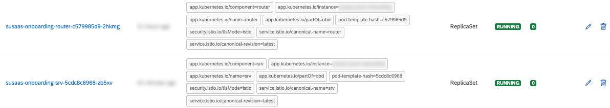
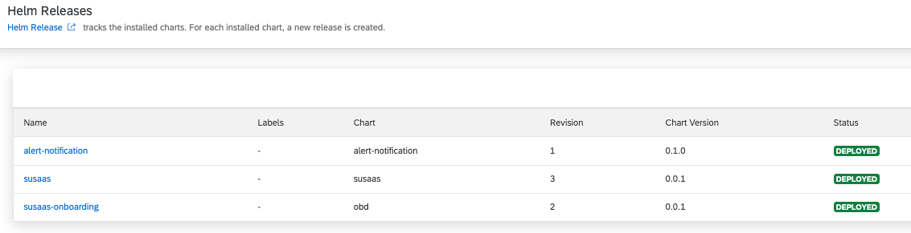
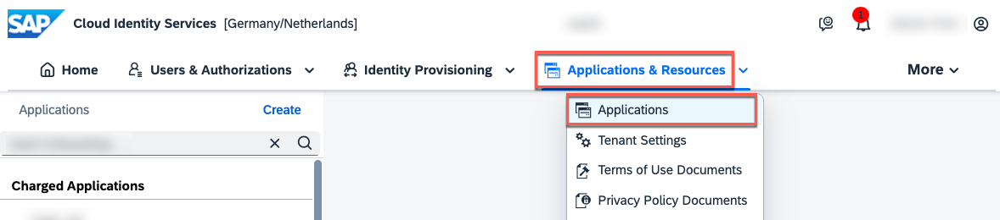
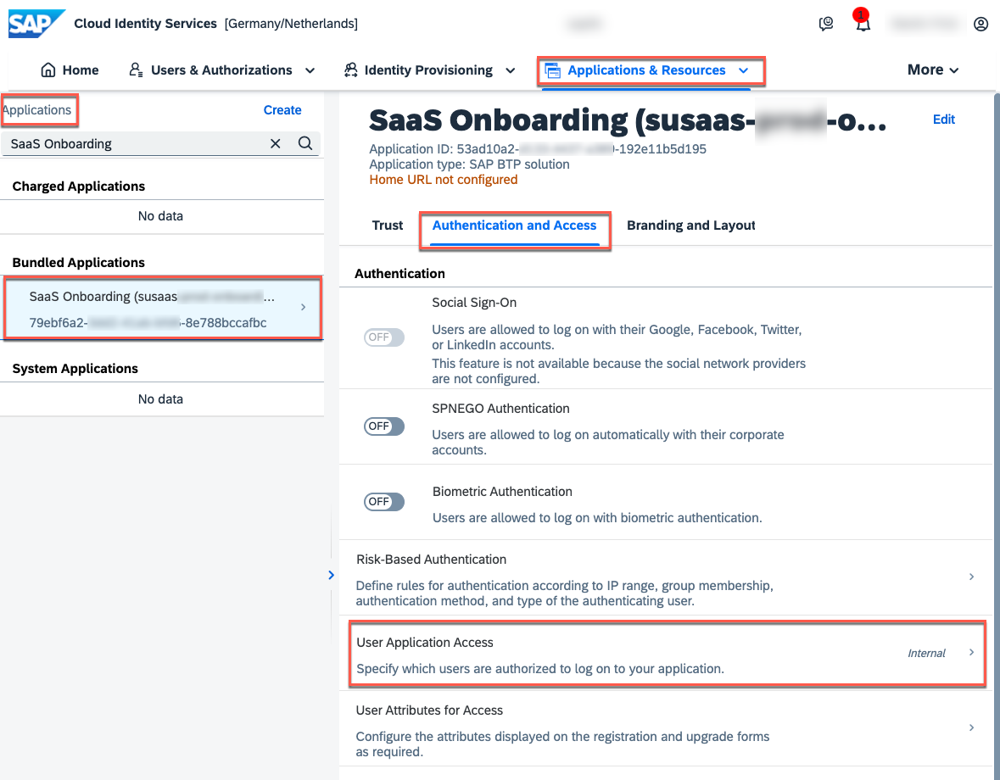
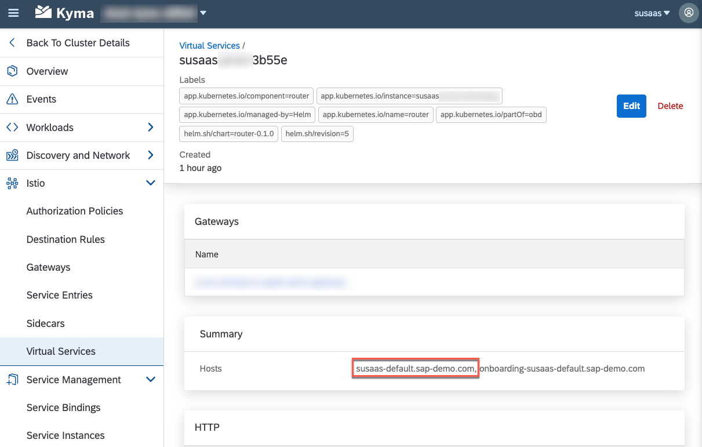

# Self-Registration, Onboarding Automation and One-Domain Concept

- **Kyma** ✅
- **Cloud Foundry** ❌

In this part of the tutorial, you will learn how to set up self-registration, automated tenant onboarding, and an exemplary single-domain concept for your SaaS application.

- [Self-Registration, Onboarding Automation and One-Domain Concept](#self-registration-onboarding-automation-and-one-domain-concept)
  - [1. Introduction and Prerequisites](#1-introduction-and-prerequisites)
  - [2. Build and Push the Container Images](#2-build-and-push-the-container-images)
  - [3. Prepare and Provide the Kyma Secret details](#3-prepare-and-provide-the-kyma-secret-details)
  - [4. Configure your Helm Release](#4-configure-your-helm-release)
  - [5. Deploy to your Kyma Cluster](#5-deploy-to-your-kyma-cluster)
  - [6. Self-Registration in SAP Identity Authentication](#6-self-registration-in-sap-identity-authentication)
  - [7. Test the scenario](#7-test-the-scenario)
  - [8. Clean-up the scenario](#8-clean-up-the-scenario)
  - [9. Good To Know](#9-good-to-know)
    - [Self-Registration / Automation](#self-registration--automation)
    - ["One-Domain" Concept](#one-domain-concept)


## 1. Introduction and Prerequisites

For a SaaS provider, automation is essential. The more manual steps required during the onboarding process for a new SaaS subscriber, the longer it takes for the customer to start using the new solution. In an ideal scenario, similar to various B2C contexts like Apple Store or Google Play Store, users want to sign up for a new application, install it, and try it out. This requirement is what we aim to address as part of this expert topic.

Once you complete the steps in this tutorial, your customers will have the following options:

- Self-register for your SaaS application
- Test a trial plan of your software solution
- Onboard and offboard new SaaS tenant subaccounts
- Access the SAP BTP Cockpit and manage destinations
- Open your SaaS application using a central domain

The last requirement, having a unique application domain across all SaaS consumers instead of separate subdomains for each subscriber, is also quite common in a B2C context. However, in most existing SAP solutions, each tenant receives a separate subdomain. Please refer to the following blog post for a better understanding of both architecture patterns used to meet these requirements.

[](./images/Arch_SelfReg.png?raw=true)

The automation of Subscriber Tenant Subaccount utilizes the **SAP BTP Setup Automator** to establish a new environment for a SaaS customer. This automation goes beyond just setting up the subaccount itself and includes tasks such as role assignments, Identity Provider Trust settings, and data model deployments, among others. While these setup steps can also be configured through custom implementations using the respective command-line interfaces (CLIs) or application programming interfaces (APIs), the SAP BTP Setup Automator simplifies and automates this process to a great extent. It follows a declarative approach in JSON format.

[](./images/Arch_OneDomain.png?raw=true)

Most SAP BTP SaaS scenarios and tutorials typically employ a domain-based tenant identification approach. In this particular sample, however, we utilize the x-custom-host header to identify a tenant. This approach offers a significant advantage as the application user is unaware of this header value, while still being able to utilize a central domain shared by all SaaS customers. To achieve this, a cookie-based approach is implemented, enabling the storage and reuse of a user's tenant assignment in the browser following a successful login.

While integrating these additional expert features into our existing scenario requires minimal changes, there are a few prerequisites that need to be met.

**Prerequisites**

To set up this Expert Feature, it is essential to have the corresponding Sustainable SaaS application deployed and operational on your Kyma Cluster. If you haven't done so already, please ensure you follow the **Basic** and **Advanced** tutorial in this GitHub repository first ([click here](../../../2-basic/0-introduction-basic-version/README.md)).

Furthermore, your SAP BTP target environment must meet the following requirements:

- SAP Identity Authentication Service (SAP IAS) configured as **Platform Identity Provider** (**Global Account** Level)
  > **Hint** - Find more details in the official SAP Help Documentation ([click here](https://help.sap.com/docs/btp/sap-business-technology-platform/establish-trust-and-federation-of-custom-identity-providers-for-platform-users?locale=en-US))
- SAP Identity Authentication Service (SAP IAS) configured as **Application Identity Provider** (**Provider Subaccount** Level)
  > **Hint** - Find more details in the official SAP Help Documentation ([click here](https://help.sap.com/docs/btp/sap-business-technology-platform/establish-trust-and-federation-between-uaa-and-identity-authentication))
- Access to credentials of a **Global Account Administrator** is required for the Subscriber Onboarding Automation

In case you need guidance on how to setup a new SAP Identity Authentication Service tenant, feel free to follow along these tutorials:

- https://blogs.sap.com/2023/04/13/sap-cloud-identity-services-offered-as-trial-version/ (for Trial)
- https://help.sap.com/docs/identity-authentication/identity-authentication/tenant-model-and-licensing (for other SAP BTP Account Types)


In addition to this step-by-step guide, please make sure to check the corresponding [blog post](https://community.sap.com/t5/technology-blogs-by-sap/saas-self-onboarding-and-one-domain-concept-in-sap-btp-kyma-runtime-using/ba-p/13562474), which will explain the architecture in closer detail! 


## 2. Build and Push the Container Images

To implement the self-registration, onboarding automation, and one-domain concept, two additional workloads are introduced. A new **Application Router** and **CAP Backend Services**. Therefore, you will need to build and push two new container images.

> **Hint** - The Onboarding Process cannot be handled by the existing workloads of your Sustainable SaaS application, as for instead of SAP XSUAA, the SAP Identity Authentication Service is being used for authenticating users. A parallel binding of SAP XSUAA and SAP IAS is not supported. 

2.1. Switch to the [*./files/deploy/*](./files/deploy/) directory of this Expert Feature, containing all objects required to setup this expert scenario. 

2.2. Ensure you are connected to your container image repository. 

```sh
docker login

Authenticating with existing credentials...
Login Succeeded
```

2.3. Install the npm dependencies to build the new images. 

```sh
## Run in ./docu/4-expert/-Kyma-/saas-self-onboarding/files/deploy ##
npm run install
```

2.4. Build the CAP artifacts before building your Container Images.

```sh
## Run in ./docu/4-expert/-Kyma-/saas-self-onboarding/files/deploy ##
npm run build
```

2.5. Build the UI5 components which will be part of the HTML5 Deployer Image.

```sh
## Run in ./docu/4-expert/-Kyma-/saas-self-onboarding/files/deploy ##
npm run ui:apps
```

2.6. Build the new Container Images (HTML5 Deployer, Application Router, CAP Backend Service). This process might take a few minutes depending on your machine size and internet connectivity. 


> **Hint** - Replace **sap-demo** with your own container image prefix.

```sh
## Run in ./docu/4-expert/-Kyma-/saas-self-onboarding/files/deploy ##
npx --yes cross-env IMAGE_PREFIX=sap-demo npm run build:all
```

For further more selective builds, you can also use the following command to build dedicated images only. 

```sh
## Run in ./docu/4-expert/-Kyma-/saas-self-onboarding/files/deploy ##
npx --yes cross-env IMAGE_PREFIX=sap-demo npm run build:srv
```

2.10. Push the new Container Images to your container image repository.

> **Hint** - Replace **sap-demo** with your container image prefix. This process might take a few minutes depending on your machine size and internet connectivity. 

```sh
## Run in ./docu/4-expert/-Kyma-/saas-self-onboarding/files/deploy ##
npx --yes cross-env IMAGE_PREFIX=sap-demo npm run push:all
```

For further push processes, you can also use the following commands to push single images separately. 

```sh
## Run in ./docu/4-expert/-Kyma-/saas-self-onboarding/files/deploy ##
npx --yes cross-env IMAGE_PREFIX=sap-demo npm run push:srv
```

That is it! Your Docker Images should be available in your container image repository now! 


## 3. Prepare and Provide the Kyma Secret details

In this scenario, a Kyma/Kubernetes Secret will be used to store your SAP BTP Global Account credentials and configurations necessary for automating the onboarding process of new tenants. To proceed, please follow the steps below to create the corresponding Secret artifact in your Kyma Cluster namespace.

>**Important** - It is crucial to deploy all new components, including Secrets and Helm Release, to the Kyma Namespace where  the original Sustainable SaaS application is deployed. 

3.1. Copy the below **Kyma Secret** template into a new YAML file and name it **obd-btp-cred-private.yaml**. 

> **Important** - By adding the **-private** suffix, you can ensure this file will not be committed to your GitHub Repository!

- The provided **admins** will be assigned **Subaccount Admin** permissions in each subscriber subaccount created by the self-subscription flow!
- The **email** and **password** of a Global Account Administrator are required by the SAP BTP Setup Automator to interact with the SAP BTP CLIs, when setting up and configuring a new subaccount.  

**obd-btp-cred-private.yaml**

```yaml
kind: Secret
apiVersion: v1
metadata:
  # Kyma Secret Name (<ReleaseName>-onboarding-btp-cred)
  name: susaas-onboarding-btp-cred 
  # Kyma Namespace (<Namespace>)
  namespace: default
  labels:
    # Kyma Secret Name (<ReleaseName>-onboarding-btp-cred)
    app.kubernetes.io/name: susaas-onboarding-btp-cred 
type: Opaque
# Please update with your environment details
stringData:
  # SAP BTP Subaccount Provider Administrators
  admins: '"admin.user01@example.org","admin.user02@example.org"'
  # Subdomain of your SAP BTP Global Account (see SAP BTP Cockpit)
  globalaccount: sap-demo 
  # SAP BTP Region where SaaS solution is deployed to
  btpregion: eu10
  # Hostname of your Central SAP IAS instance 
  iashost: sap-demo.accounts.ondemand.com 
  # SAP BTP Global Account Administrator E-Mail
  email: global.admin@example.org 
  # SAP BTP Global Account Administrator Password
  password: SuPeR!SaVe42#Pw 
  # Origin Key of SAP BTP Global Account Platform IdP 
  # (usually "<SAP IAS subdomain>-platform")
  platformidp: sap-demo-platform 
  # GUID/UUID of SAP BTP Provider Subaccount (see SAP BTP Cockpit)
  provsubaccount: 4397eb2f-a1bc-c3d4-e4f6-f73dc396bd6e 
```

3.2. Replace the values based on your own environment details. 

> **Important** - Please make sure to store these details in a safe place and never commit them to GitHub!

3.3. Run the following **kubectl** command to create the Secret in your Kyma Cluster. 

```sh
kubectl apply -f <path-of-yaml-file> -n <target-namespace>

# Example #
kubectl apply -f ./obd-btp-cred-private.yaml -n default
```

Alternatively, you can create the Kubernetes Secret also in your Kyma Dashboard in the **Configuration** - **Secrets** section of your target namespace. 

3.4. Check whether the Secret has been successfully created in your Kyma Cluster using the Cockpit or the following kubectl command. 

```sh
# Run from anywhere #
kubectl get secrets <ReleaseName>-onboarding-btp-cred -n <Namespace>

# Example #
kubectl get secrets susaas-onboarding-btp-cred -n default
```


## 4. Configure your Helm Release

Alright, so you have almost finished all preparation steps to install the required additional Helm Release to your Kyma Cluster. Last but not least, you need to provide a few configuration options for the Helm Chart. 

4.1. Copy or rename the *[values-private.sample.yaml](./files/deploy/charts/values-private.sample.yaml)* sample file located in the *./files/deploy/charts/* directory of this Expert Feature to a **values-private.yaml** file. This file will contain your environment specific configurations for the upcoming Helm deployment.

> **Hint** - Adding the filename suffix **-private**, will ensure the file is not committed to GitHub.

4.2. In the new **values-private.yaml** file, please provide values for the following parameters, based on your own environment and the Container Registry being used. This is very familiar to the deployment of the initial SaaS application.

  **global**

  * imagePullSecret - Name of a Image Pull Secret if required.
    > **Hint** - This value needs to contain the reference to a potential Image Pull Secret of your Container Registry. If you're using a free Docker Hub account and public Docker Images, this property can be left unchanged (empty object). Otherwise, please make sure to create a Kyma **Secret** containing your imagePullSecret and provide the reference to your Secret here. 
    
    > Find more details in the following blog post ([click here](https://blogs.sap.com/2022/12/04/sap-btp-kyma-kubernetes-how-to-pull-from-private-repository/)) or check out the **Deploy Your CAP Application on SAP BTP Kyma Runtime** tutorial in the SAP Tutorial Navigator([click here](https://developers.sap.com/tutorials/btp-app-kyma-prepare-dev-environment.html)). Our colleagues will get you covered! 

  * domain - Your Kyma Cluster default or custom domain.
    > **Hint** - This parameter requires your default Kyma cluster domain (e.g. a1b2c3.kyma.ondemand.com). To get the default domain of your Kyma Cluster you can run the following kubectl command: 
    >
    > ```kubectl get configMaps/shoot-info -n kube-system -o jsonpath='{.data.domain}'```
    > 
    > This will return the required result like *a1b2c3.kyma.ondemand.com*. *a1b2c3* is a placeholder for a string of characters that’s unique for your cluster (the so-called **shootName** which we need in the next step). 

  * shootName - The unique shoot name of your Kyma Cluster.
    > **Hint** - As Kyma is based on [Gardener](https://gardener.cloud/), the managed Clusters are also called **Shoot**-Clusters (flower analogy). In our sample the **shootName** parameter, ensures the uniqueness of application registered in the SAP BTP SaaS Registry. As the SaaS application names registered in the SaaS registry need to be unique across a SAP BTP region (e.g. eu10), the shootName of your Kyma cluster will be part of that SaaS application names. This ensures you are not colliding with any other developer deploying the sample application. To get the **shootName** of your Kyma Cluster, run the following kubectl command:  
    > 
    >```kubectl get configMaps/shoot-info -n kube-system -o jsonpath='{.data.shootName}'```.<br> 
    > 
    > In a productive SAP BTP landscape, your **shootName** will always starts with a letter like *a1b2c3* or with the prefix **c-** like c-1b2c3*. 

  * platformIdp

    * origin - Provide the origin key of your SAP BTP Platform IdP (e.g., sap-demo-platform) being used in your Global SAP BTP Account. You can find it in the "Trust Configuration" section of your Global Account. 

      [](./images/OBD_PlatformIdP.png?raw=true)

    * url - Provide the host of your SAP BTP Platform IdP (e.g., sap-demo.accounts.ondemand.com) being used in your Global SAP BTP Account. 

      > **Hint** - If you did not configure your SAP Identity Authentication Service as Platform IdP, please do so in the **Trust Configuration** of your Global Account. 

      [](./images/OBD_PlatformIdP.png?raw=true)

  * saasRelease - Release Name of the SaaS application to be onboarded in the same Kyma Namespace (default: susaas).
    > **Hint** - This value only need to be changed if your setup deviates from the default sample configuration. This is the case if you intentionally deployed the original SaaS application with a different Release Name like e.g., **susaas-dev**.

  * saasRouter - Name of the Application Router component in the SaaS application to be onboarded in the same Kyma Namespace (default: router).
     > **Hint** - This value only need to be changed if your setup deviates from the default sample configuration. This is the case if you intentionally set a different **fullName** property for your Application Router of the original SaaS application.

  **router**

  * image.repository - Provide the details of your **Onboarding Application Router** Container Image like \<username>/obd-router if your Image is stored in Docker Hub or ghcr.io/\<namespace>/obd-router in case of GitHub. 
  * image.tag - Provide a different tag, if you do not want to use the latest image. 

  **srv**

  * image.repository - Provide the details of your **Onboarding CAP Backend Service** Docker Image repository like \<username>/obd-srv.
  * image.tag - Provide a different tag, if you do not want to use the latest image. 

  **html5_apps_deployer**

  * image.repository - Provide the details of your **Onboarding HTML5 Apps Deployer** Docker Image repository like \<username>/obd-html5-deployer.
  * image.tag - Provide a different tag, if you do not want to use the latest image. 


4.3. A sample configuration for scenario without a custom domain could look as follows.

> **Hint** - In this sample the original SaaS application was deployed as **susaas-dev** in the same namespace. Therefore, the saasRelease property has to be updated.

```yaml
global:
  imagePullSecret: {}
  domain: a1bc2c3.kyma.ondemand.com 
  shootName: a1bc2c3 
  platformIdp: 
    origin: sap-demo-platform 
    url: sap-demo.accounts.ondemand.com
  saasRelease: susaas-dev 
```

In case of using a custom domain, please ensure to also update the Ingress Gateway Details accordingly.

```yaml
global:
  imagePullSecret: {}
  domain: sap-demo.com
  shootName: a1bc2c3
  gateway: susaas/cdomain-gateway
```


4.4. All set? Then let us check if your Kubernetes resource definitions are successfully generated by Helm, running the following command **within** the *files/deploy* directory if this Expert Feature.

> **Hint** - In case of errors, check if you maybe missed one of the above parameters or a mistake (like a space or special character) has sneaked in.

```sh
## Run in ./docu/4-expert/-Kyma-/saas-self-onboarding/files/deploy ##
helm template ./charts -f ./charts/values-private.yaml
```

This will log the generated **yaml** files in your console. If required, you can also store the results into a local file by running the following command. 

```sh
helm template ./charts -f ./charts/values-private.yaml > helm-template.yaml
```

## 5. Deploy to your Kyma Cluster

5.1. Please run the following command from within the *./docu/4-expert/-Kyma-/saas-self-onboarding/files/deploy* directory to deploy the Onboarding application to the **same namespace** in which your target SaaS application resides!

> **Important** - The \<ReleaseName> placeholder has to be replaced with the Release name of the original Saas Application to be onboarded.  

> **Hint** - Feel free to add the *--debug* parameter to get some more verbose output if you're interested what's happening under the hood!
 
```sh
## Run in ./docu/4-expert/-Kyma-/saas-self-onboarding/files/deploy ##
helm install <ReleaseName>-onboarding ./charts -f ./charts/values-private.yaml -n <Namespace>

# Example #
helm install susaas-onboarding ./charts -f ./charts/values-private.yaml -n default
```

An alternative approach using the *helm upgrade* command would look as follows. This will either upgrade an existing installation of our SaaS sample application or install a new version if not available in the respective namespace yet. 

```sh
## Run in ./docu/4-expert/-Kyma-/saas-self-onboarding/files/deploy ##
helm install <ReleaseName>-onboarding ./charts -f ./charts/values-private.yaml --install -n <Namespace>

# Example #
helm install susaas-onboarding ./charts -f ./charts/values-private.yaml --install -n default
```

5.2. The deployment of the Helm Release to your Kyma cluster, will take a few minutes, as the new Pods have to be initiated. 

5.3. You can use this time to switch back to your Kyma Dashboard, where you can monitor the installation/deployment progress and respective objects being instantiated. Once you see the following two new **Pods** in **Running** state, your deployment finished successfully. 

[](./images/OBD_RunningPods.png?raw=true)

5.4. You can also check the successful deployment of your application in the **Apps** section of the Kyma Dashboard. Here you can find all **Helm Releases**. 

[](./images/OBD_HelmOverview.png?raw=true)

5.5. For any further updates of the Helm Release, you must now use the *helm upgrade* command (already mentioned above).

```sh
## Run in ./docu/4-expert/-Kyma-/saas-self-onboarding/files/deploy ##
helm upgrade <ReleaseName>-onboarding ./charts -f ./charts/values-private.yaml -n <Namespace>

# Example #
helm upgrade susaas-onboarding ./charts -f ./charts/values-private.yaml -n default
```

5.6. To undeploy/uninstall a Helm Release, you can use the following command. 

```sh
# Run anywhere #
helm uninstall <ReleaseName>-onboarding -n <Namespace>

# Example #
helm uninstall susaas-onboarding -n default
```

> **Important** - Please ensure that all components are removed from the Cluster. As you manually created the Kyma Secret containing the configuration (incl. SAP BTP Global Account Administrator) details, this component will not be automatically deleted upon **helm uninstall**. 


## 6. Self-Registration in SAP Identity Authentication

Once the Onboarding components have been successfully deployed, the next step is to enable self-registration in SAP Identity Authentication Service (IAS). While an application registration can be automatically created based on a SAP BTP Service Instance, the setting for enabling self-registration needs to be manually enabled by a SAP IAS Administrator.

6.1. Open the Administration UI of your SAP Identity Authentication Service tenant.

> **Hint** - Usually you can reach the Administration UI of your tenant following the **https://\<SUBDOMAIN>.accounts.ondemand.com/admin** pattern.
> 
> Example - https://<span>sap-demo.accounts.ondemand.com/admin

6.2. Open the **Applications** menu. 

[](./images/OBD_EnableReg00.png?raw=true)

6.3. Search for the new **SaaS Onboarding** application and switch to the **Authentication and Access** tab. Select the **User Application Access** settings. 

[](./images/OBD_EnableReg01.png?raw=true)

6.4. Change the settings to **Public**, to allow self-registration for the application and **save** your changes!

[](./images/OBD_EnableReg02.png?raw=true)

> **Important** - From now on, users can self-register for your application! Therefore, please ensure to enable the **E-Mail Verification**, apply a secure **Password Policy** and consider a **Risk-Based Authentication**. All of these settings can be configured in SAP Identity Authentication Service.
>
> In case you do not want a **self-registration**-based user management, you can also import users for your application, and invite them via email to setup an account in SAP Identity Authentication Service ([click here](https://help.sap.com/docs/identity-authentication/identity-authentication/import-or-update-users-for-specific-application)). 


## 7. Test the scenario

You are now ready to test your setup, by self-registering a new user in SAP Identity Authentication and spinning up a new subscriber tenant.

7.1. Open the SaaS application Home Screen in a new browser session or Incognito Mode.  

> **Hint** - You will be able to access it following the **https://\<ReleaseName>-\<namespace>.\<ClusterDomain>** format <br>
> - *https://susaas-default.a1b2c3.kyma.ondemand.com* or *https://susaas-default.sap-demo.com* (when using a custom domain)<br>
> - You can find the respective URI also as part of your new Virtual Service artifact in your Kyma Dashboard (\<ReleaseName>-\<RandomId>)<br>
> [](./images/OBD_VirtualService.png?raw=true)

7.2. Follow the steps explained in our recent blog post, to register a new user in SAP Identity Authentication Service and to onboard a new subscriber tenant. 

[SaaS Self-Onboarding and One-Domain Concept in SAP BTP, Kyma Runtime using CAP](https://community.sap.com/t5/technology-blogs-by-sap/saas-self-onboarding-and-one-domain-concept-in-sap-btp-kyma-runtime-using/ba-p/13562474)

7.3. Check the logs of the Kyma/Kubernetes Job, spinned up by your new CAP  Service, for potential errors and to get an idea of what's happening under the hood! 


## 8. Clean-up the scenario

To clean-up the scenario and to remove the Self-Registration and One-Domain feature from your Kyma Cluster, please follow the steps described below. 

8.1. Undeploy the **Helm Release** from your Kyma Cluster. 

> **Hint** - The \<ReleaseName> placeholder contains the Helm Release Name of your original Sustainable SaaS application deployment.

```sh
# Run from anywhere #
helm uninstall <ReleaseName>-onboarding -n <Namespace>

# Example # 
helm uninstall susaas-onboarding -n default
```

8.2. Delete the Kyma/Kubernetes from your Cluster.

```sh
# Run from anywhere #
kubectl delete secret <ReleaseName>-onboarding-btp-cred -n <Namespace>

# Example # 
kubectl delete secret susaas-onboarding-btp-cred -n default
```

8.3. Double-check, whether all relevant objects have been removed. 

- Kyma Deployments
- Kyma Secret
- SAP BTP Service Instances
- SAP BTP Service Bindings
- SAP IAS Application Registration


## 9. Good To Know

The following sections contain various additional inputs that you should consider if you are planning to set up a similar One-Domain concept or Self-Registration for your SAP BTP SaaS application!


### Self-Registration / Automation

GitHub Actions - If you don't have access to a Kyma Cluster to set up a new SAP BTP Setup Automator instance, you can explore alternative solutions like GitHub Actions. Any environment capable of spinning up a new Docker container can fulfill your requirements in this context. This architecture is also suitable for Cloud Foundry scenarios and eliminates the need to spin up a Docker image in Cloud Foundry Diego Cells.

Security Considerations - In a real-world scenario, it is crucial to properly validate users who register for your SaaS application. Consider implementing email and/or SMS verification for registrants and potentially introducing an **IP/email domain** filter. Without such measures, you run the risk of bot or attacker registrations that could flood your environment with self-registered tenants. Another safety layer to identify genuine users could involve requiring a **credit card** during the sign-up process. While it is challenging to completely prevent your SaaS application from being misused by bots, these measures can reduce the risk to a certain extent.

> **Hint** -  If **public** self-registration is not essential, it is advisable to either avoid it or implement stringent security measures while strictly limiting the workload capacity of **trial** accounts.! 

**Legal requirements** – When using cookies, it is important to inform your application users about their usage and obtain their consent regarding **cookie preferences**. Check the SAPUI5 documentation for a sample fragment that can be used for this purpose ([click here](https://ui5.sap.com//#/entity/sap.m.CookieSettingsDialogPattern)). Additionally, ensure compliance with legal requirements, such as having a **legal notice** or any other necessary information based on your country's regulations when offering a public homepage. The same applies to self-registration options, which may require [**Terms of Use**](https://help.sap.com/docs/identity-authentication/identity-authentication/configuring-terms-of-use) and/or a [**Privacy Policy**](https://help.sap.com/docs/identity-authentication/identity-authentication/configuring-privacy-policies). Both can be configured as part of the SAP Identity Authentication settings for your Onboarding Application Registration.

**SAP partner limitations** – f you are an SAP partner, make sure you comply with the chosen partnership model when offering self-registration. While this approach may be suitable for internal customer developments, as a partner, you may be limited by models like PE Build, which require registering new customers with SAP first. In such cases, the OEM partnership model may be a more suitable choice. 

**Logging architecture** - Consider implementing advanced logging mechanisms, especially since your SaaS application may be publicly facing. It's essential to be aware of the activities happening within your cluster. Implement robust logging practices to monitor and track events effectively.

**Notification mechanisms** – Make sure to have a proper notification mechanism for your self-registering and onboarding process! This is essential to be informed about onboarding errors or any unusual onboarding processes. We suggest using the [SAP BTP Alert Notification Service](https://discovery-center.cloud.sap/serviceCatalog/alert-notification) or considering an email setup using a hyperscaler service offering like Office 365 or AWS SES. A sample on how to integrate Office 365 into a CAP application can be found in the other Expert Features.

**Cross-Region Scenarios** - Assuming you would like to provide your SaaS consumers with a high-availability setup and do not necessarily rely on a persistence layer for your SaaS application, checking a multi-region setup might be a suitable option! Instead of setting up just one subaccount in a dedicated SAP BTP Region, you could offer your subscribers an option to choose whether the application is supposed to be available across multiple regions (for sure based on some extra-fees). Feel free to reach out to us if you have a customer interested in such a scenario! While such a setup comes with an additional price tag and also further service requirements on a global hyperscaler routing offering of your choice (e.g., AWS Route53 or Azure Traffic Manager), this offers your customers a better experience when it comes to availability and performance of your application (e.g., routing requests to the closest region available).

> **Hint** - Setting up a cross-regional service offering bears a lot of complexity and should not be underestimated!

**Customization** – SAP IAS offers you a plethora of customization options allowing you to modify the registration or login page, as well as the email templates used to validate the self-registration user! Check out the documentation and provide your customers an experience aligned with your company's style guide! To learn more, check out the official SAP Help Documentation ([click here](https://help.sap.com/docs/identity-authentication/identity-authentication/configuring-applications) or [click here](https://help.sap.com/docs/identity-authentication/identity-authentication/configuring-email-templates)).

**Trial Features/Limitations** – Currently, this sample application does not contain a concept to reduce the functionality of the self-registered trial tenants. In a productive scenario, you should think about limitations for these free/trial tenants. Otherwise, you might risk that harmful individuals spam or misuse your trial service offering!

**Multiple Tenants** – The sample scenario will allow the setup of one tenant per registered user. You could also consider setups where a user is allowed to set up multiple tenants or different types of tenants (e.g., to test an upcoming release version). While the current architecture maps the SCIM user id to a tenant name, you might need to store multiple tenants in a separate SAP HANA Cloud HDI container for each user.

**Enterprise Tenants** – In a productive scenario, it is rather unrealistic to assume that each and every SaaS user will create their own tenant, but an admin user creating a tenant for a dedicated customer, which is being used by multiple users. While the admin can manage tenant-users leveraging the in-app user management, the users (as of today) still need to log in using the tenant-specific SaaS URL.

To overcome this issue, you could consider a scenario in which you create a user group in SAP IAS for each SaaS tenant, in which you store all users belonging to a certain tenant. This would allow you to provide all users and not just the tenant admin a login feature using the generic Home-Page. On this Home-Page, you could, for example, offer your users an option to switch to a tenant of their choice without knowing the dedicated tenant URL.

Alternatively, you can also store the associations between users and SaaS tenants in a separate SAP HANA Cloud database table. So whenever an admin creates a new user in a certain tenant, you could store the respective subdomain – IAS SCIM user id mapping. Make sure to consider the correct cookie handling for such an approach, and give users an option to switch between available tenants in this case! 

**Monetization Concepts** – Offering a self-registration process is especially useful in scenarios that cover a free trial/test option. In that case, you probably want to provide your customers an easy option to switch from a limited trial/test version to a proper and paid premium version of the application. Ideally, again in a decent automation setup providing payment methods like credit card or PayPal! Good news ahead – we are actively working on such a sample scenario, so subscribe to the tags of this blog post and stay up to date!

**Serverless Implementation** – The topic of serverless is omnipresent across the whole IT industry, and Kyma also offers serverless capabilities known as Kyma Functions. Feel free to take our sample implementation and try to wrap it into a Kyma Function, which is only called when a new tenant is being on- or offboarded. While we have not tested this yet, this could allow you some TCO reduction.

**Undeployment Pitfalls** - It is extremely important to keep track of the created Subscriber tenants and ensure that all tenants have been successfully removed before undeploying the overall SaaS solution from your Kyma Cluster! Failing to do so can result in a corrupt state of your SaaS application, in which certain services like XSUAA or SaaS-Registry cannot be deleted without further ado!


### "One-Domain" Concept

**Concept only** - This sample is a proof of concept (PoC) and does not fulfill the requirements of a productive application. Please consider further essential necessities like extending your cookie lifetime, logout, and tenant-switch options. For example, the SAP IAS details like the host URL could also be retrieved through the service binding instead of providing it in a Kyma Secret. Also, the Global Account user should not be a personalized user like in our scenario, but you should create a dedicated technical user for this purpose!

**Enterprise tenants** - We have designed this scenario in a way that allows you to still use the existing SaaS application as described in the respective documentation. That means if you want to set up a new tenant subaccount for an enterprise customer yourself, you can still do so and decide on a dedicated subdomain assigned to this subscription. Furthermore, you can select between all available plans in this case, while the self-registration and onboarding feature will create a tenant subaccount with a **trial** plan.

**Cookie Collision** - The fact that we are using two different Application Routers for this scenario can lead to cookie collisions! At least it did for us from time to time... As the Application Router stores a JSESSIONID cookie in the browser, sending this cookie to the wrong one of both Application Routers may result in an authentication issue. To prevent/overcome this issue, the respective UI components will automatically reload the current page in case the Application Router returns a 401 status. FYI - In the future, the usage of a standalone Application Router might be obsolete and replaced by a managed Application Router approach, requiring a reconsideration of this pattern.

**Multiple tenants** – Assuming the requirement of supporting users with access to multiple SaaS application tenants will require some further developments in the IAS authentication layer. For example, by storing the available tenants of an SAP IAS user in a HANA database, you can offer your users an option to switch between the tenants by offering a respective selection UI and dynamically changing the x-custom-host cookie value. Theoretically, the respective SAP IAS pre-layer gives you tremendous flexibility when it comes to authenticating and managing users and tenants.

**Logout** – While not covered in detail, this "One-Domain" approach, including the "Self-Onboarding" feature, requires (as of today) two different Application Routers. One Application Router is handling the login for the higher-level IAS-based application (not multitenant!), which determines the tenant(s) of the authenticated user and allows the usage of the onboarding service! The other application router is multitenant enabled and handles the authentication with XSUAA for each and every subscriber tenant!

In case of a (client-initiated or time-based) user logout or session expiry, a logout in both application routers should be initiated. Furthermore, the cookie should be deleted once a user is logged out. In a productive scenario, you need to ensure that a respective logout is properly handled by your application!

**Cookie lifetime** – For a better user experience, you should consider extending the cookie lifetime while the user is actively working with the application. This will prevent a situation in which the tenant cookie is expiring while the user is using the application. You could, for example, use an application router extension to enhance the cookie lifetime.

**Basic Authentication** - For testing purposes, you might want to add additional Basic Authentication to your public-facing user interfaces, adding at least a tiny bit of security for potential attackers! To do so, you can use the following Istio Wasm Plugin, allowing you to enable Basic Authentication for certain hosts and a dedicated path.

```yaml
apiVersion: extensions.istio.io/v1alpha1
kind: WasmPlugin
metadata:
  # Provide your Sustainable SaaS Release Name and Namespace
  # e.g., susaas-default-basic-auth
  name: <ReleaseName>-<Namespace>-basic-auth 
  namespace: istio-system
spec:
  selector:
    matchLabels:
      istio: ingressgateway
  url: oci://ghcr.io/istio-ecosystem/wasm-extensions/basic_auth:1.12.0
  phase: AUTHN
  pluginConfig:
    basic_auth_rules:
      # Hosts protected by Basic Authentication
      # susaas-default.a1b2c3.kyma.ondemand.com
      # onboarding-susaas-default.a1b2c3.kyma.ondemand.com
      - hosts:
          - <ReleaseName>-<Namespace>.<ClusterDomain>
          - onboarding-<ReleaseName>-<Namespace>.<ClusterDomain>
        # Provide secure Basic Authentication credentials
        credentials:
          - <Username>:<Password>
```

Once ingested your own environment values, save the file as a YAML file with the filename suffix **-private.yaml** like e.g., **obd-basic-auth-private.yaml**! This will make sure your file is not committed to GitHub! You can then deploy the plugin by running the following kubectl command. Remember to delete the plugin again when cleaning up your cluster!


```sh
kubectl apply -f <Filename> -n <Namespace>
```

**Example**

```sh
kubectl apply -f ./obd-basic-auth-private.yaml -n default
```

**Get Plugins**

```sh
kubectl get WasmPlugins -n istio-system 
```

**Delete Plugin**

```sh
kubectl delete WasmPlugin <ReleaseName>-<Namespace>-basic-auth -n istio-system
```
