# Setup CI/CD for your Project

- **Kyma** ✅
- **Cloud Foundry** ❌

In this part of the **Expert Features** you will learn how to set up the **SAP Continuous Integration and Delivery (CI/CD)** service to handle all your DevOps-related tasks like automated tests, builds, and deployments of your code changes to speed up your development and delivery cycles.

- [Setup CI/CD for your Project](#setup-cicd-for-your-project)
  - [1. Introduction](#1-introduction)
  - [2. Setup SAP CI/CD Service](#2-setup-sap-cicd-service)
  - [3. Provide SAP BTP, Kyma Service Account details](#3-provide-sap-btp-kyma-service-account-details)
  - [4. Add Container Registry details](#4-add-container-registry-details)
  - [5. Provide GitHub credentials](#5-provide-github-credentials)
  - [6. Provide values-private.yaml file](#6-provide-values-privateyaml-file)
  - [7. Add your GitHub repository](#7-add-your-github-repository)
  - [8. Create a GitHub Webhook](#8-create-a-github-webhook)
  - [9.  Add the Webhook details to GitHub](#9--add-the-webhook-details-to-github)
  - [10. Configure a CI/CD Job](#10-configure-a-cicd-job)
  - [11. Create the pipeline file](#11-create-the-pipeline-file)
  - [12. Push and test](#12-push-and-test)
  - [13. Enhance your pipeline](#13-enhance-your-pipeline)
  - [14. Free Tier and Trial Plan Limitations](#14-free-tier-and-trial-plan-limitations)
  - [15. Further Information](#15-further-information)


## 1. Introduction

In the following part of the **Expert Features**, you will learn how to set up an SAP CI/CD service instance in your SAP BTP environment. You will enhance your existing project with some additional files allowing an automated build and deployment of your SaaS application to a Cloud Foundry space of your choice. 

To understand the basics of Continuous Integration and Delivery, please start reading the official **SAP Help** documentation ([click here](https://help.sap.com/docs/continuous-integration-and-delivery/continuous-integration-and-delivery-internal/what-is-sap-continuous-integration-and-delivery)).

[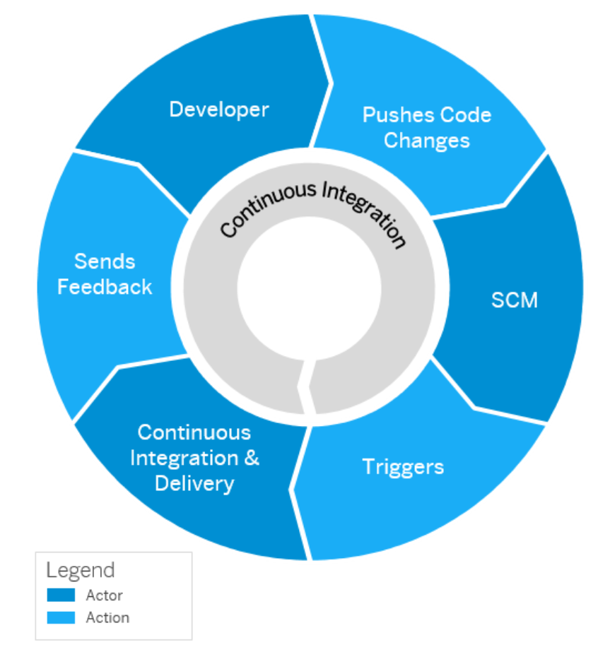](./images/CICD_Basics01.png?raw=true)

Continue with the most important **Concepts**, to understand the differences between **Jobs and Builds** or the concepts of **Pipelines, Stages, and Steps**, as we will use these words throughout this part of the **Expert Features**. You can find great explanations in the official SAP Help documentation ([click here](https://help.sap.com/docs/continuous-integration-and-delivery/continuous-integration-and-delivery-internal/concepts?locale=en-US))

[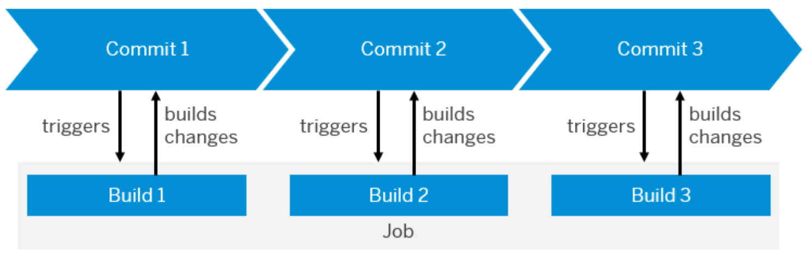](./images/CICD_Basics02.png?raw=true)

[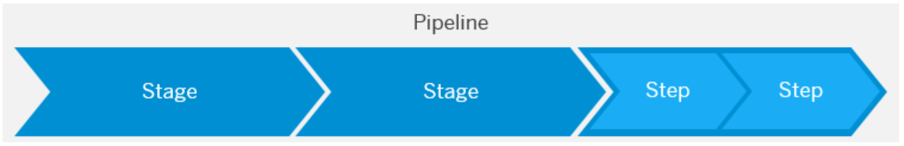](./images/CICD_Basics03.png?raw=true)

Once you're familiar with the basic concepts, check out the details of the **SAP Cloud Application Programming Model** pipeline which we will use in the following steps. The official SAP Help documentation ([click here](https://help.sap.com/docs/continuous-integration-and-delivery/continuous-integration-and-delivery-internal/configure-sap-cloud-application-programming-model-job-in-your-repository)) describes the pipeline and the various stages and steps used in great detail. 

[](./images/CICD_Basics04.png?raw=true)

Did you get an understanding of the basic wordings and concepts? Well then let's go and get some DevOps into your sample application! 


## 2. Setup SAP CI/CD Service

The **SAP CI/CD Service** gives you access to a selected set of the **Project "Piper"** General Purpose pipeline stages and steps. 

> **Hint** - Learn more about Project Piper in - "Enhance your pipeline" ([click here](#13-enhance-your-pipeline)). The supported steps are continuously enhanced so we appreciate your feedback on any missing functionalities.

2.1. Go to your SAP BTP Subaccount.

2.2. Navigate to the **Service Marketplace**.

2.3. Find the Continuous Integration & Delivery Service and subscribe to the application.

[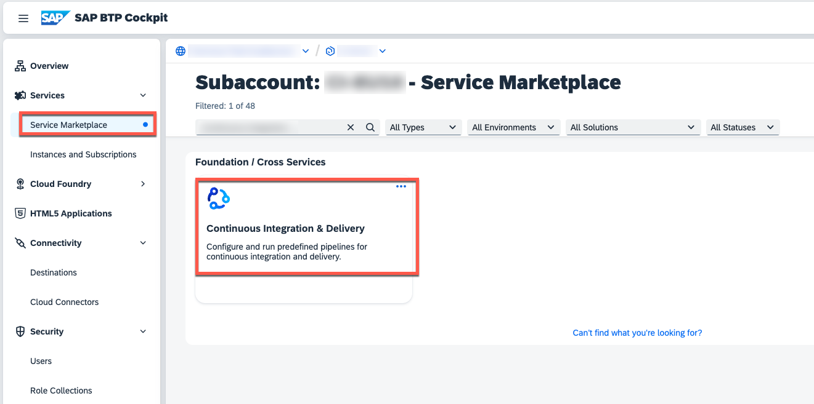](./images/CICD_Setup01.png?raw=true)

2.4. Assign the new Role Collection **"CICD Service Administrator"** to your user.

[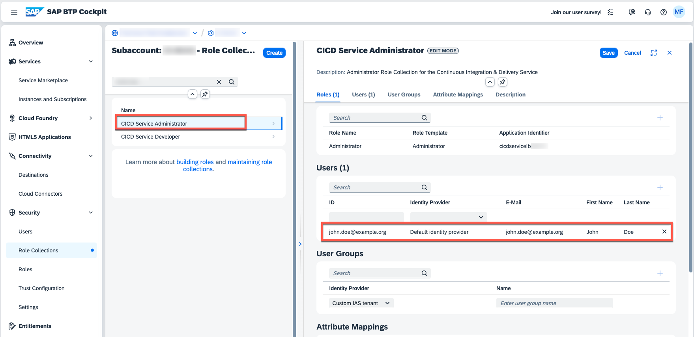](./images/CICD_Setup02.png?raw=true)


## 3. Provide SAP BTP, Kyma Service Account details

For a deployment to your SAP BTP, Kyma Cluster, the SAP BTP, CI/CD Service requires the details of a Kyma Service Account. Generating these details is not trivial, so consider using a plugin to simplify the process.

3.1. Use the provided **service-account.sample.yaml** file to create a new Service Account. This will create a Service Account as part of the **default** namespace. 

> **Hint** - Update the yaml file if you want to rename the generated objects or if you want to create the Service Account in a different namespace. 

> **Important** - This sample Service Account owns the **Cluster Admin** permission. For a productive setup, please make sure to adjust the yaml file with the minimal set of permissions required to deploy solutions to your Kyma Cluster. Additionally, please make sure to store the kubeconfig details in a secure place.

```sh
kubectl apply -f ./files/service-account.sample.yaml -n default
```

3.2. You will need to generate so-called **kubeconfig** definition for your Service Account. Please check the following blog post ([click here](https://blogs.sap.com/2023/06/01/service-accounts-easy-with-sap-btp-kyma-runtime/)) to figure out how to simplify this process. 

One simple option is to create the **kubeconfig** details is using a plugin such as **kubectl-view-serviceaccount-kubeconfig-plugin** ([click here](https://github.com/superbrothers/kubectl-view-serviceaccount-kubeconfig-plugin)). For the plugin installation you will need **krew** [click here](https://krew.sigs.k8s.io/), which is a plugin manager for kubectl. 

> **Important** - The kubeconfig details available through your SAP BTP Cockpit **cannot** be used for this purpose! 

Below you can see a sample command using the **view-serviceaccount-kubeconfig** plugin to generate the required details. 

```sh
kubectl view-serviceaccount-kubeconfig susaas-sa -n default

apiVersion: v1
clusters:
- cluster:
    certificate-authority-data: LS0tLS1CRUdJTiBDRVJ...
```

3.3. Copy the generated kubeconfig details for the next steps and store them in a secure place for any future reference. 

3.4. Switch back to your **Continuous Integration & Delivery** subscription.

[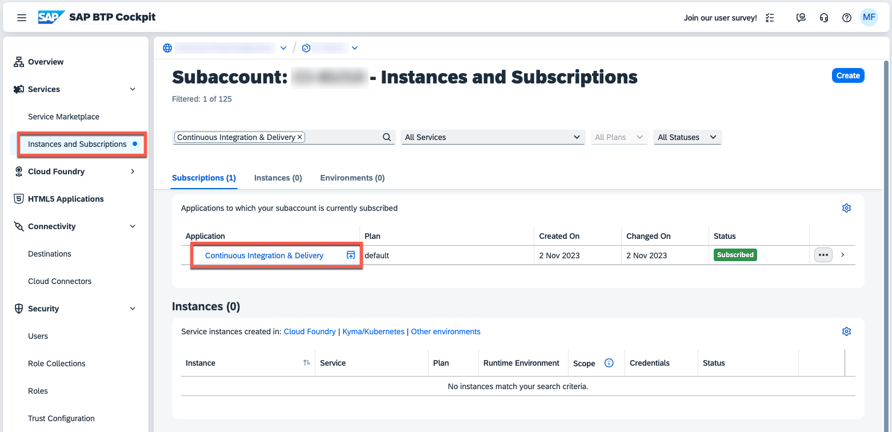](./images/CICD_Setup03.png?raw=true)

3.5. Add your SAP BTP, Kyma Service Account kubeconfig details by clicking on the **Credentials** tab.

3.6. Click on **+**.

3.7. Provide a name for your credential value. In this example, the credential name is **susaas-kube-config**.

> **Hint** - If you choose a different name, you need to adapt your *config.yml*. Consider a naming convention such as including "dev, test, prod" and/or the shoot name of your cluster in your credential names in case of multi-system landscapes.

3.9. As Type select **Kubernetes Configuration**.

3.10. Paste the SAP BTP, Kyma Service Account kubeconfig details. 

[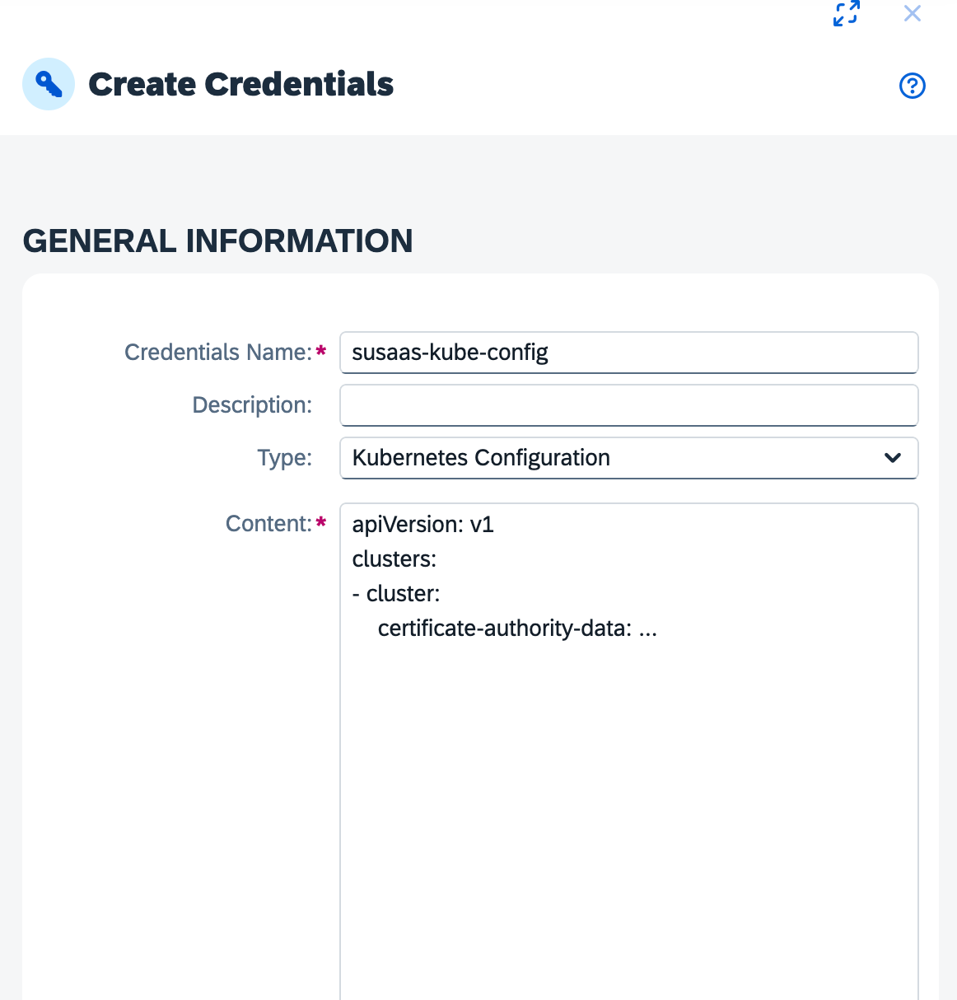](./images/CICD_KubeConfig.png?raw=true)

3.11. Finish the configuration by clicking on **Create**.


## 4. Add Container Registry details

Your SAP BTP, CI/CD Service pipeline will not only deploy the latest Container Images to your Kyma Cluster, but will also build new images based on the latest code changes. To allow the SAP BTP, CI/CD Service to push the latest Container Images to your preferred Container Registry, you need to provide respective authentication details. 

4.1. Switch back to the **Credentials** menu and click on **+**.

[](./images/CICD_Setup04.png?raw=true)


4.2. Enter a name of your choice. In this example, the credential name is **susaas-registry-config**.

4.3. Please use the content of the provided **registry-config.sample.json** file ([click here](./files/registry-config.sample.json)) and provide the authentication details of your Container Registry. Below you can see a sample for a DockerHub scenario.

> **Hint** - In case of DockerHub, the value of the **auth** property will be your DockerHub username and your DockerHub password or an access code as base64 encoded string (username:password). Don't forget to include the colon (:) when encoding your auth details.  

```json
{
    "auths": {
        "https://index.docker.io/v1/": {
          "auth": "dXNlcm5hbWU6cGFzc3dvcmQ="
        },
        "https://gcr.io": {
          "auth": "..."
        }
    }
}
```

For other Container Registries, please consult the respective documentation to determine the URL and the required auth value. 

4.3. Please paste your authentication details in your credential configuration and click on **Create** to finish the process.


## 5. Provide GitHub credentials

To deploy the latest version of your code, the SAP BTP, CI/CD service requires access to the respective GitHub repository. If your GitHub repository is not public, please ensure to walk through the upcoming steps of this tutorial, as the required credentials will be configured now. 

> **Hint** - These steps are required for private GitHub repositories only. If your forked GitHub repository is **Public**, you can skip this part of the tutorial. 

5.1. In the SAP BTP, CI/CD Service, please switch back to the **Credentials** menu and click on **+**.

[](./images/CICD_Setup04.png?raw=true)

5.2. Enter a name of your choice. In this example, the credential name is **susaas-git-credentials**.

[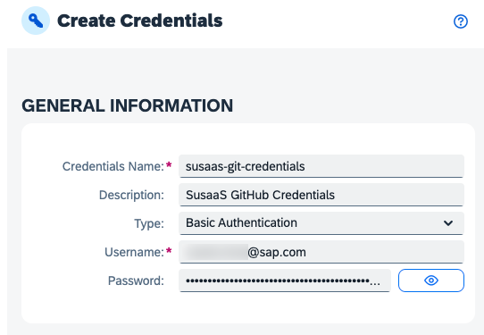](./images/CICD_Setup09.png?raw=true)

5.3. As Type select **Basic Authentication**. 

5.4. As Username, enter your GitHub username/email.

5.5. As Password, use a **personal access token** created in GitHub.

> **Hint** - Personal access tokens can be created in GitHub by going to *Settings* -> *Developer Settings*. <br> Below you can find the steps to set up a sample access token. Depending on your requirements, you might need to choose a more granular security setup. Make sure to update your access token before it expires or generate a token which does not expire.<br>
[](./images/CICD_Setup06.png?raw=true)
[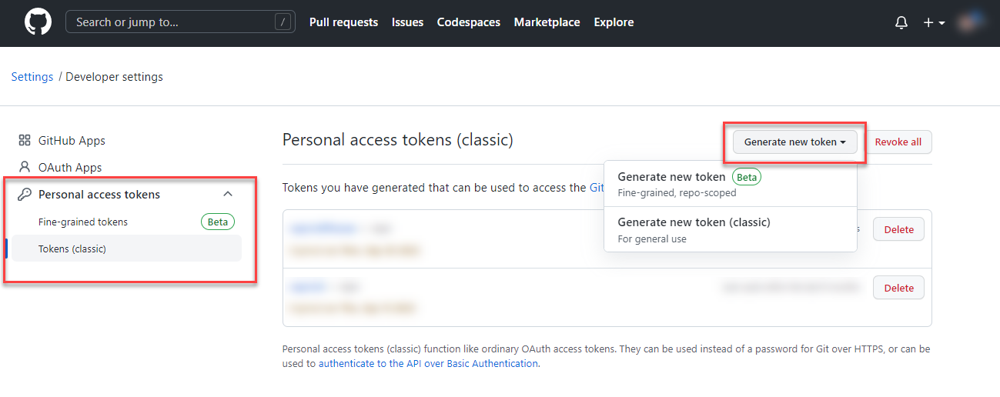](./images/CICD_Setup07.png?raw=true)
[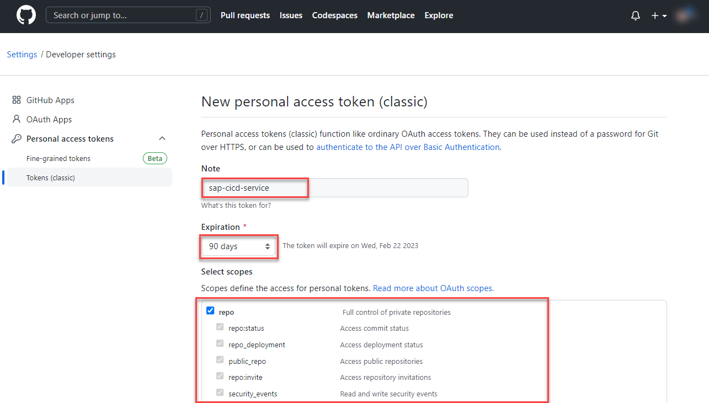](./images/CICD_Setup08.png?raw=true)

5.6. Double check your credential details and click on **Create**. 

You can now use the these GitHub credentials as part of your SAP BTP, CI/CD Service repository configuration. Continue with the next steps to learn more. 


## 6. Provide values-private.yaml file

Instead of pushing your Service Broker catalog details and further deployment-specifics to GitHub, those values will be injected dynamically by the SAP BTP, CI/CD Service during the deployment of your application. Therefore, you will now learn how to store a respective **values-private.yaml** file as **Secret Text** credential, being used by your pipeline during deployment.

> **Hint** - Alternatively, you can also pass additional parameters like the Image Pull Secret as part of your **config.yml** details. Please check the official pipeline documentation to learn more ([click here](https://help.sap.com/docs/continuous-integration-and-delivery/sap-continuous-integration-and-delivery/configure-kyma-runtime-job-in-your-repository#configure-the-stages-of-your-kyma-runtime-job)).

```yaml
Release:
    kubernetesDeploy: true
    ...
    additionalParameters:
      - --set
      - global.imagePullSecret.name=secret-in-namespace
      - --set
      - my.path=myValue
```

6.1. Switch to the the **Credentials** menu and click on **+**. 

6.2. Enter a name of your choice. In this example, we use **susaas-values-private-yaml**. 

> **Hint** - If you choose a different name, you must adapt the *config.yml* file. Consider a suitable naming-convention in case of multi-system landscapes or various namespaces being used.

6.3. As **Type** select **Secret Text**. 

6.4. Duplicate the provided **values-private.sample.yaml** ([click here](./files/values-private.sample.yaml)) file and rename it to **values-private.yaml**. 

> **Hint** - The **private** suffix will ensure that your details are not accidentally committed to GitHub. 

6.5. Update the content in the new **values-private.yaml** file and provide all required details such as the **Cluster Domain**, the **Service Plan IDs** and the **XSUAA configuration**. You can use your existing **values-private.yaml** file in the **/deploy/kyma/sustainable-saas** directory as a reference. 

[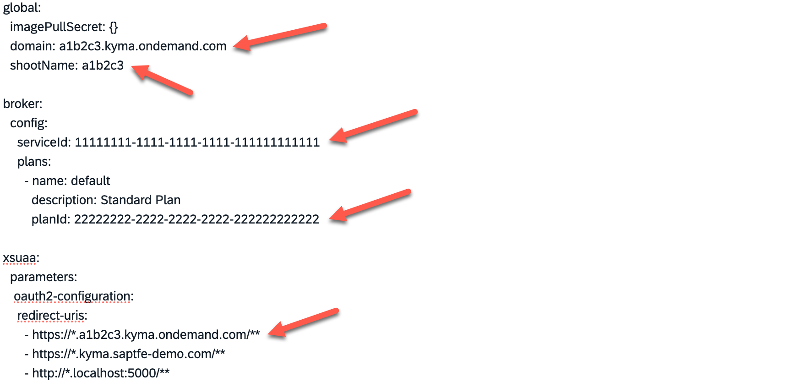](./images/CICD_ValuesPriv00.png?raw=true)

6.6. Once you have updated all your details based on your own environment, please paste the settings into your new **credential** configuration.

[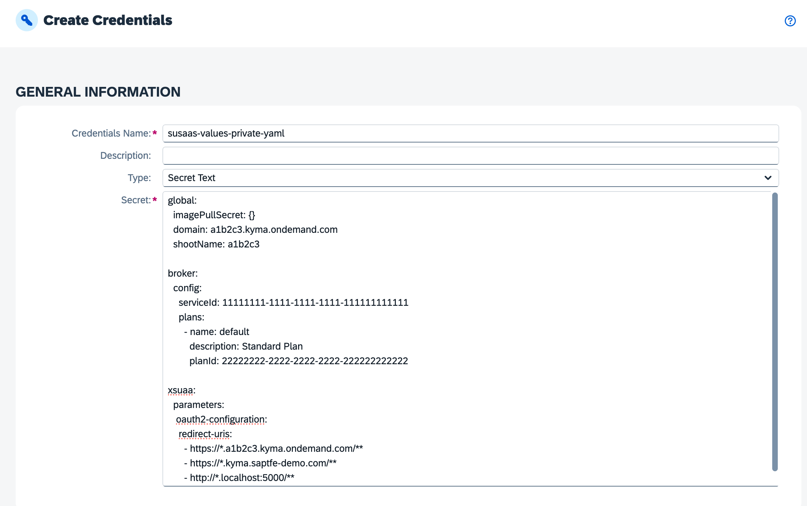](./images/CICD_ValuesPriv01.png?raw=true)

6.7. Click on **Create** to finish the configuration.


## 7. Add your GitHub repository

As the SAP BTP, CI/CD Service will always pull the latest changes from GitHub and also relies on respective webhooks, you will now learn how to setup your GitHub repository in SAP BTP, CI/CD Service. 

7.1. Navigate to the **Repository** tab in the CI/CD Service and click on **+** to add your GitHub repository.

[](./images/CICD_Repository00.png?raw=true)

7.2. Provide a name for your repository like **btp-cap-multitenant-saas**.

[](./images/CICD_Repository01.png?raw=true)

7.3. Enter the **Repository URL** of your **forked** GitHub repository. 

> **Hint** - If you forked this sample project, your URL will look like https://github.com/YourUser/btp-cap-multitenant-saas. When using a local GitHub repository, make sure you've successfully configured the Cloud Connector ([click here](https://help.sap.com/docs/continuous-integration-and-delivery/sap-continuous-integration-and-delivery/git-repositories-network-and-communication-security?locale=en-US) for details). 

7.4. Select your GitHub credentials (e.g., **susaas-git-credentials** if you followed this tutorial) created in previous steps. 

> **Hint** - This is only required if your forked GitHub repository is not public! If your GitHub repository is **public**, you do not have to provide any credentials.

7.5. **Do not click on Add** yet, but continue with the next step of the tutorial, adding new Webhook Credentials to your new repository configuration details. 


## 8. Create a GitHub Webhook
   
In this step, you will create a new Webhook configuration for your new repository. By doing so, you can create a respective Webhook in GitHub. This will allow GitHub to notify your SAP BTP, CI/CD service about code changes in your repository and trigger new a new pipeline run.

8.1. In the **Webhook Event Receiver** section of your new repository configuration, please select the type **GitHub** and press **Create Credentials** from the **Webhook Credential** dropdown list.

[](./images/CICD_Repository02.png?raw=true)

8.2. Provide a name of your choice for the new Webhook configuration and add a meaningful description. In this example, the name is **susaas-git-webhook**. 

[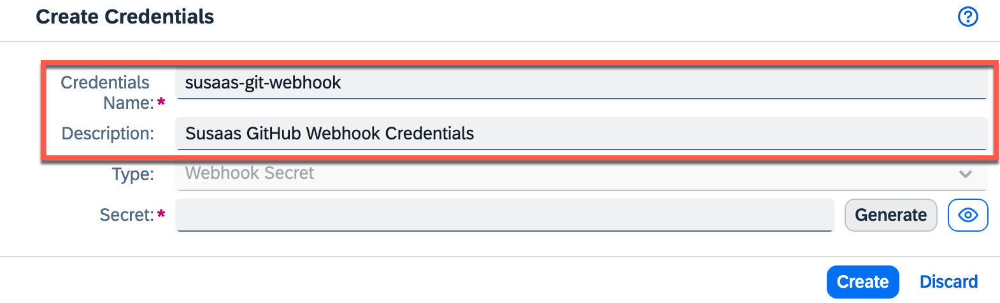](./images/CICD_Repository03.png?raw=true)

8.3. Click on **Generate** to create a new Secret value! 

[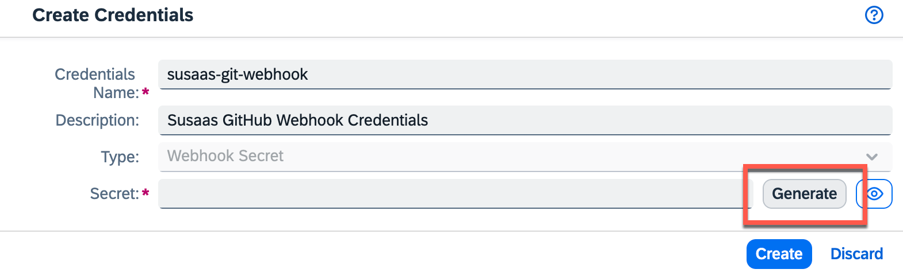](./images/CICD_Repository04.png?raw=true)

8.4. **Copy** and store the **Secret** in a secure place, as you won't be able to access the Secret again after initial creation. 

[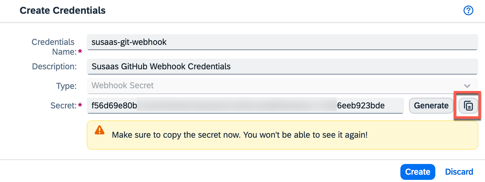](./images/CICD_Repository05.png?raw=true)

8.5. Click on **Create** to create the Webhook configuration in the SAP BTP, CI/CD Service.

[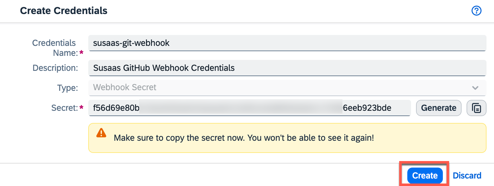](./images/CICD_Repository06.png?raw=true)

8.6. Click on **Add** to finish the repository setup process. 

[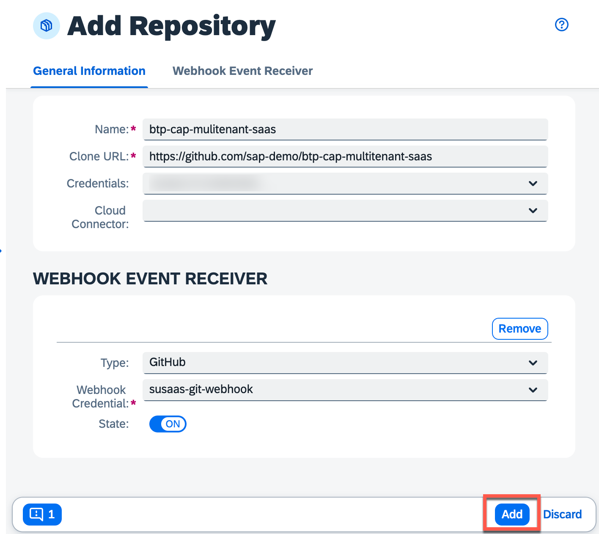](./images/CICD_Repository07.png?raw=true)

Great, this will allow you to configure GitHub to send webhooks to your SAP BTP, CI/CD Service instance in the next step- 


## 9.  Add the Webhook details to GitHub

To allow a secure transmission of GitHub webhooks, you will now add the generated Secret to your GitHub webhook configuration.

9.1. In your GitHub repository (https://github.com/**YourUser**/btp-cap-multitenant-saas) go to the **Settings** tab.

9.2. From the navigation pane, choose **Webhooks**.

9.3. Choose **Add webhook**.

[](./images/CICD_WebhookGit01.png?raw=true)

9.4. The configuration data can be found in the **Webhook Data** section of your new SAP BTP, CI/CD Service repository configuration. 

[](./images/CICD_Webhook01.png?raw=true)

[](./images/CICD_Webhook02.png?raw=true)

9.5. Copy and paste the **Payload URL** from that popup to GitHub and select **application/json** as Content type.

9.6. Provide the Webhook **Secret**, which you copied and stored in a secure place a few steps before. 

9.7. Set content-type to **application/json** and click on **Add webhook**.

[](./images/CICD_WebhookGit02.png?raw=true)

Your webhook has been successfully configured and your SAP BTP, CI/CD instance will receive push events from GitHub. 


## 10. Configure a CI/CD Job

Finally, after configuring your GitHub repository as well as all required credentials, you can now setup the actual CI/CD job. 

10.1. In the **Jobs** tab of the SAP BTP, CI/CD service, choose **+** to create a new job.

10.2. As **Job Name**, enter a name for your job for example **susaas**.

10.3. From the **Repository** dropdown, select the configured GitHub repository.

10.4. As **Branch**, type in **main**.

10.5. As **Pipeline**, choose **Kyma Runtime**.

> **Hint** - You can find the stages and steps of this pipeline in the official SAP Help documentation ([click here](https://help.sap.com/docs/continuous-integration-and-delivery/sap-continuous-integration-and-delivery/configure-kyma-runtime-job-in-your-repository?locale=en-US&version=Cloud#context)).

10.6. Keep the default values in the BUILD RETENTION section.

10.7. In the **STAGES** section, choose **Source Repository** from the **Configuration Mode** dropdown. 

> **Hint** - Instead of defining your pipeline in the source code repository, you can use the Job Editor to configure pipeline steps in the UI. 

[](./images/CICD_Job01.png?raw=true)


10.8. Choose **Create** to finish the Job setup.


## 11. Create the pipeline file

As we configured a **Source Repository-based** pipeline, you have to provide the respective pipeline details as part of your GitHub repository. You can leverage the sample file provided as part of this **Expert Feature** files to do so. 

11.1. Copy the provided [*config.yml*](./files/config.yml) file from the *files* directory of this **Expert Feature** to a new hidden root directory named **.pipeline** (don't forget the dot!).

11.2. Update the *config.yml* file in the *.pipeline* directory and replace all **sapdemo** placeholders with your Container Image Prefix.

> **Hint** - If you use e.g. DockerHub as a Container Registry, please put in your **username** (e.g., johndoe) as Container Image Prefix. If you use the GitHub Container Registry, the prefix will look similar to **ghcr.io** (e.g. **ghcr.io**/johndoe). If required, please refer to the documentation of your Container Registry. Learn more about the **cnbBuild** step in the official **Project Piper** documentation ([click here](https://www.project-piper.io/steps/cnbBuild)).

Below you can find a sample using the Image Prefix **sapdemo** in DockerHub. Please make sure to set the correct containerRegistryUrl based on the Container Registry you are using. When using another Container Registry, also ensure to update your **credential** details with a different **auth** string ([click here](#4-add-container-registry-details) for further details). 

```yaml
steps:
  buildExecute:
    ...
  cnbBuild:
    containerRegistryUrl: docker.io, gcr.io, ...
    dockerConfigJsonCredentialsId: susaas-registry-config
    multipleImages:
      - path: ./code/router
        containerImageName: sapdemo/susaas-router
        containerImageAlias: sapdemo/susaas_router
        buildpacks:
          - "gcr.io/paketo-buildpacks/nodejs"
```

11.3. This *config.yml* contains a very basic pipeline configuration and can be further enhanced by enabling additional Stages (e.g., Acceptance Stage) or Unit Test features (e.g., running additional npm scripts). Please refer to the official documentation to learn more ([click here](https://help.sap.com/docs/continuous-integration-and-delivery/sap-continuous-integration-and-delivery/configure-kyma-runtime-job-in-your-repository)).

```yaml
stages:
  Additional Unit Tests:
    npmExecuteScripts: true
  Acceptance:
    kubernetesDeploy: true
```

## 12. Push and test

You can now test your setup, by pushing a new commit to your GitHub repository. This will trigger a webhook event, which is being send from GitHub to your SAP BTP, CI/CD Service. 

12.1. Go to the terminal and execute the commands below to push the changes including your pipeline configuration.

```shell
git add .
git commit -m "config.yml configured for deployment target"
git push
```

12.2. Given all setups steps have been completed successfully, this will trigger the first Job. 

12.3. Goto back to your SAP BTP, CI/CD Service dashboard.

12.4. Check on the right-hand side whether the initial build has been successfully triggered.

> **Hint** - A successful run of your pipeline might take between 15 and 20 minutes. 

[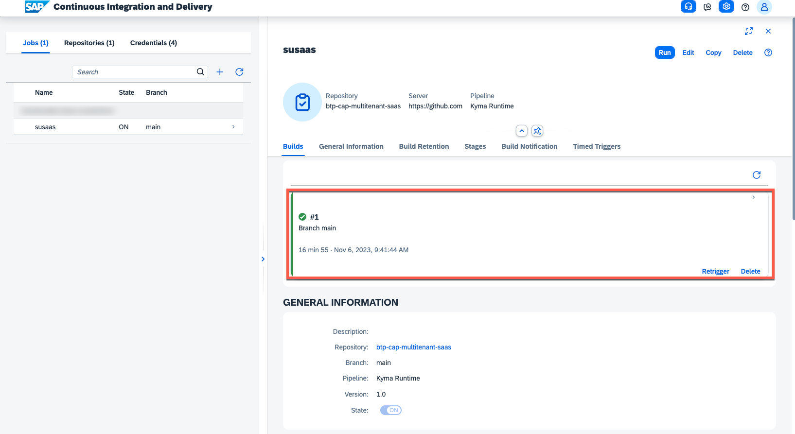](./images/CICD_Job02.png?raw=true) 

That's it, you've successfully configured your pipeline. It's a very basic setup but still should give you a good idea of how to get started and can be enhanced and customized based on your individual needs. 


## 13. Enhance your pipeline

The provided pipeline only contains some basic steps to build and deploy your SaaS application to a Cloud Foundry Space of your choice. A real-world pipeline will probably contain a lot more stages and steps, including automated tests, integration with SonarQube or SAP Cloud Transport Management Service, and more features. 

To enhance your pipeline, start with the official [SAP Help Documentation](https://help.sap.com/docs/continuous-integration-and-delivery/sap-continuous-integration-and-delivery/configure-kyma-runtime-job-in-your-repository) of the SAP CI/CD service, describing the different stages and steps available in the **Kyma Runtime** pipeline we used in our sample. The SAP Help documentation will give you a first understanding of what is happening under the hood.

Once you feel comfortable understanding the various stages and steps included in this pipeline, you can deep dive into the official [**Project "Piper"**](https://www.project-piper.io/) documentation. SAP implements most tooling for continuous delivery in the project "Piper". The goal of project "Piper" is to substantially ease setting up continuous delivery in your project using SAP technologies. If you compare the available steps of the **Build stage** described in Project "Piper" ([click here](https://www.project-piper.io/stages/build/#build)), you will find the exact same steps in the official SAP Help documentation ([click here](https://help.sap.com/docs/continuous-integration-and-delivery/sap-continuous-integration-and-delivery/configure-kyma-runtime-job-in-your-repository)). 

[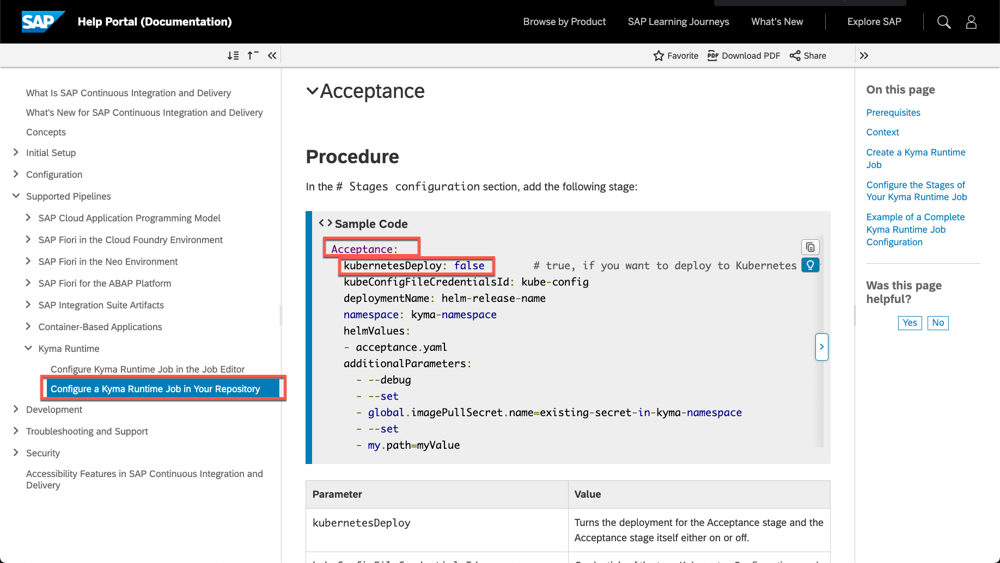](./images/CICD_PiplineComp01.png?raw=true)

[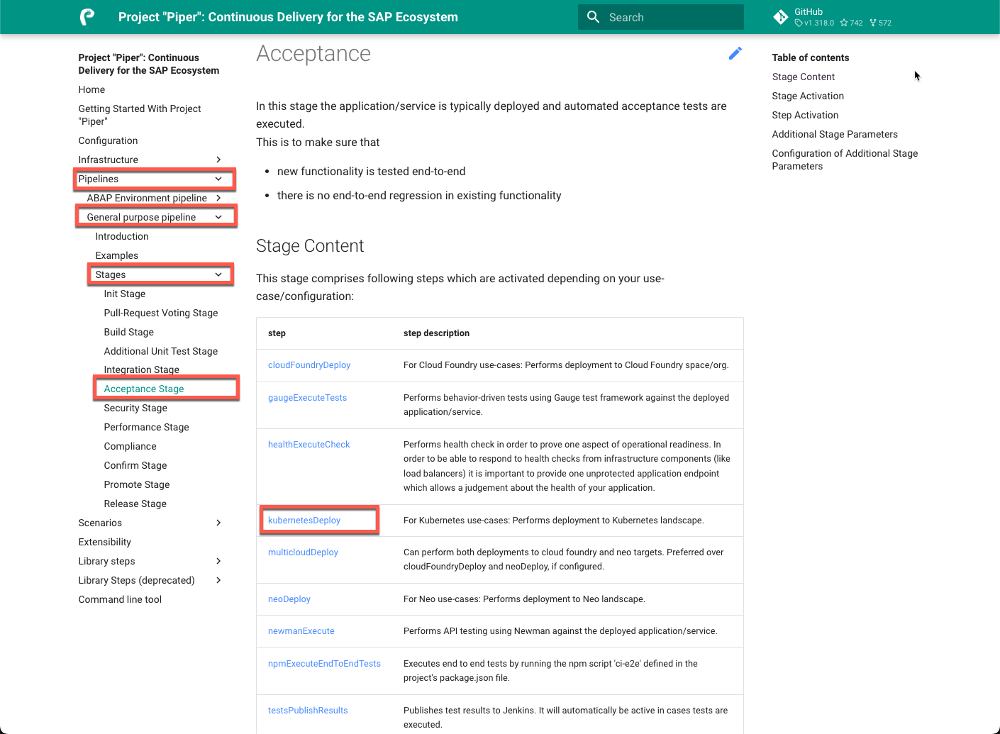](./images/CICD_PiplineComp02.png?raw=true)

The reason is very simple. Under the hood, the SAP CI/CD service also uses Project "Piper" and the various stages and steps available. Therefore, you can also use the Project "Piper" documentation to find even more details about the different stages and steps used by SAP CI/CD service and the CAP-specific pipeline. This will be very helpful to fine-tune your CI/CD pipeline!

If you want to learn more and become an expert in SAP CI/CD topics, check the following tutorial ([click here](https://developers.sap.com/tutorials/cicd-wdi5-cap.html)) in the **Tutorial Navigator**. Here you will learn, how to set up your own Docker-based Jenkins instance and you will create system tests with UIVeri5 using the UI5 Test Recorder for CAP-based projects.

Last but not least, visit the OpenSAP course **Efficient DevOps with SAP** [click here](https://open.sap.com/courses/devops1), in which you can learn a lot about SAP DevOps in general but also discover more examples of how to use the SAP CI/CD service in the context of CAP applications.


## 14. Free Tier and Trial Plan Limitations

Please keep in mind - Jobs that are created in a trial account or using the Free service plan are automatically deactivated after remaining unchanged for one week. You can use the respective **On/Off** toggle button in the SAP BTP, CI/CD Service to reactivate them.

## 15. Further Information

Please use the following links to find further information on the topics above:

* [SAP Help - Continuous Integration and Delivery Introduction Guide](https://help.sap.com/docs/CICD_OVERVIEW/ee5a61247061455ab232c19179fe4c3b/7fc38a80cda446ef856c01f748dbede8.html?language=en-US&locale=en-US)
* [CAP Documentation - Deploy using CI/CD Pipelines](https://cap.cloud.sap/docs/guides/deployment/cicd)
* [SAP Help - SAP Continuous Integration and Delivery](https://help.sap.com/docs/continuous-integration-and-delivery/sap-continuous-integration-and-delivery/what-is-sap-continuous-integration-and-delivery?language=en-US&locale=en-US)
* [SAP Help - Kyma Pipeline](https://help.sap.com/docs/continuous-integration-and-delivery/sap-continuous-integration-and-delivery/kyma-runtime)
* [Project Piper - Introduction](https://www.project-piper.io/)
* [Project Piper - General Purpose Pipeline](https://www.project-piper.io/stages/introduction/#project-piper-general-purpose-pipeline)
* [Tutorial Navigator - Automated System Tests for CAP-Based Projects](https://developers.sap.com/tutorials/cicd-wdi5-cap.html)
