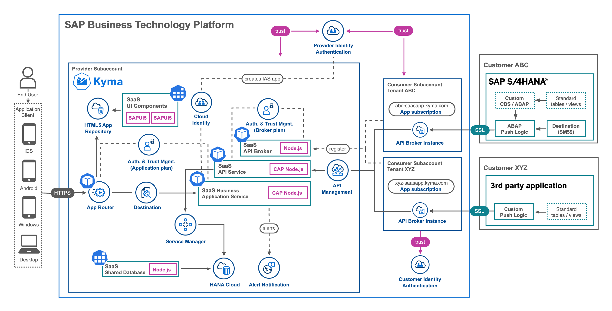
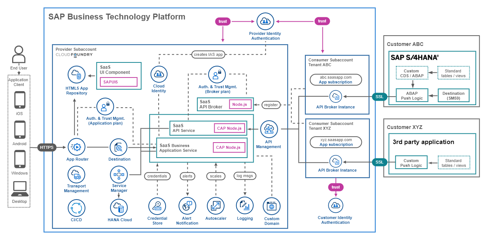

# Introduction to the Expert Features

- ### **Kyma** ✅
- ### **Cloud Foundry** ✅

> **Important** - The **Expert Features** contain selected additional components that can be applied to the Basic **or** the Advanced Version of the SaaS application. Most chapters of the **Expert Features** are still being actively worked on! Feel free to browse the available sections to get an idea of what to expect once published. Some of the chapters already contain useful content while others will be uploaded during the next weeks and months.

In the [Basic Version](../../2-basic/0-introduction-basic-version/README.md) we have provided you the core elements required for a Software as a Service (SaaS) application based on the **SAP BTP, Cloud Foundry** and **Kyma Runtime**. In the [Advanced Version](../../3-advanced/0-introduction-advanced-version/README.md) we covered further highly relevant topics when it comes to enterprise-readiness of your SaaS application going beyond a test scenario usage. The idea of **Expert Feature** tutorials builds on momentum of the Basic and Advanced Version and showcase a variety of additional SaaS Provider and Subscriber requirements.

**Kyma**

**Cloud Foundry**

The **Expert Features** will cover topics from backups of Tenant database containers to custom domain usage for your SaaS application. Below you can find the current list of topics covered. You can set up **most** (but not all!) of the **Expert Feature** topics using **Free (Tier) service plans** of your **Pay-as-you-Go** (PAYG) or **CPEA** account. 

> **Hint** - A tutorial how to setup a PAYG account (allowing you to use all Free Tier service plans) can be found in the [Tutorial Navigator](https://developers.sap.com/tutorials/btp-free-tier-account.html).

> **Hint** - Most Expert Feature topics can also be done in **Trial** accounts (see exclusions below), although we recommend to use one of the account types mentioned above (PAYG or CPEA).

**Expert Features for all SAP BTP accounts using free service plans**

**Kyma & Cloud Foundry**

* Local and hybrid development - ([click here](../local-hybrid-development/README.md))
* Custom domain for SAP IAS - ([click here](../custom-domain-for-ias/README.md))
* Send emails using Microsoft Graph - ([click here](../send-emails-graph-api/README.md))
* Feature Toggles - ([click here](..feature-toggles/README.md))
* SaaS Consumer Extensibility - ([click here](../consumer-extensibility/README.md))
* Manage Tenant database containers - ([click here](../manage-tenant-containers/README.md))
* HDI container administration - ([click here](../hdi-container-administration/README.md))
* Backup database containers - ([click here](../backup-database-containers/README.md))
* Integrate a Consumer IdP - ([click here](../integrate-consumers-idp/README.md))
* Update Tenant database containers - ([click here](../update-tenant-containers/README.md))
  
**Kyma**

* Onboarding Automation and One Domain - ([Kyma](../-Kyma-/saas-self-onboarding/README.md))
* Setup a Continuous Integration Scenario - ([Cloud Foundry](../-CloudFoundry-/setup-cicd-for-project/README.md))
* Using the SAP Theme Designer - ([Cloud Foundry](../-CloudFoundry-/using-sap-theme-designer/README.md))
* Configure SAP Transport Management - ([Cloud Foundry](../-CloudFoundry-/configure-transport-management/README.md))

**Expert Features for non-Trial SAP BTP accounts and paid scenarios**

**Cloud Foundry**

* Multiple SAP HANA Cloud instances - ([Cloud Foundry](../-CloudFoundry-/multiple-hana-cloud/README.md))
* Deployment to multiple regions - ([Cloud Foundry](../-CloudFoundry-/deploy-multiple-regions/README.md))
* Custom domain usage - ([Cloud Foundry](../-CloudFoundry-/custom-domain-usage/README.md)) - ! Paid scenario !

