# SaaS Consumer Extensibility

- **Kyma** ✅
- **Cloud Foundry** ✅

In this part of the mission you will learn how SaaS consumers can extend their SaaS subscriptions with their own **data model extensions** and **user interface extensions** using dedicated **CAP extensibility** features. 

- [SaaS Consumer Extensibility](#saas-consumer-extensibility)
  - [1. Introduction](#1-introduction)
  - [2. Prerequisites](#2-prerequisites)
  - [3. Local testing](#3-local-testing)
  - [4. Productive usage](#4-productive-usage)
  - [5. Further Information](#5-further-information)


## 1. Introduction

Pushing their own extensions using CAP extensibility features, allows SaaS consumers to extend their own SaaS subscriptions in an easy and convenient way. The functionality is very similar to the feature toggle-based extension approach. Only minor code changes are required. In contrast to feature toggle extensions, SaaS consumer extensions are deployed to the individual consumer tenant (HDI container) only.

Due to the complexity of the SaaS consumer extension topic, the actual implementation details will not be covered in this tutorial. Please check the extensive official SAP CAP documentation ([click here](https://cap.cloud.sap/docs/guides/extensibility/customization)) if you're interested in further details. 

> **Hint** - SaaS consumer extensions can also be used in productive SAP BTP deployments but still have some limitations. It is for example not yet possible, to provide CSV files with sample data in SaaS consumer extensions. In our existing sample this has been solved by a workaround using "SELECT"-Statements on a DUMMY table to create a new entity with default values (e.g., required for value helps). 


## 2. Prerequisites

Please unzip the provided **ext.zip** file ([ext.zip](./files/ext.zip)) to a folder on your local device. It contains a sample SaaS consumer extension.

## 3. Local testing

3.1. To test the sample SaaS consumer extension, you first need to start the base SaaS application locally in a command line using the **local-with-mtx** profile.

> **Hint** - We recommend using VS Code to create and handle multiple command line instances. 

```sh
# Run in ./code #
npm run srv:mtx
```

3.2. Once the application is running locally, subscribe the **t1-ext** tenant which you want to extend in the next steps by running the following command in **a new command line instance**. 

```sh
# Run in ./code #
cds subscribe t1-ext --to http://localhost:4004 --user bob:
```

3.3. Once the subscription is successful, please open a **new command line instance** and switch to the path to which you unzipped the **ext.zip** file to or open the path in VS Code (recommended!) 

```sh
cd \path\of\unzipped\ext\folder 
```

or to open the path in VS Code

```sh
code \path\of\unzipped\ext\folder 
```

3.4. In the **ext** folder, fetch the latest CDS model details from the local CAP service by running the following CDS command with the user bob (assigned to the **t1-ext** tenant). 

> **Important** - The **npm run srv:mtx** process still needs to run in the other command line instance. In case the **cds pull** command is executed successfully but you cannot see the required *csn* and *json* files in your **node_modules** directory, please try to run the extensibility scenario in SAP Business Application Studio. 

```sh
cds pull --from http://localhost:4004 --user bob:
```

[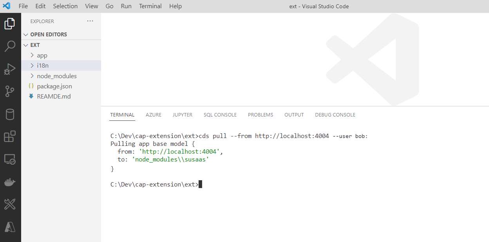](./images/CE_TestPull.png?raw=true)

3.5. Run the following command to push the SaaS consumer extension to the **t1-ext** consumer tenant. 

```sh
cds build
cds push --to http://localhost:4004 --user bob:
```

3.6. Open http://localhost:4004/uimodule/webapp/index.html#Assessments-manage in an **Incognito** browser session.

3.7. Login with **bob** (user of tenant **t1-ext**). Leave the password field blank.

3.8. You should see the extended SaaS application version including the new consumer extension feature.

[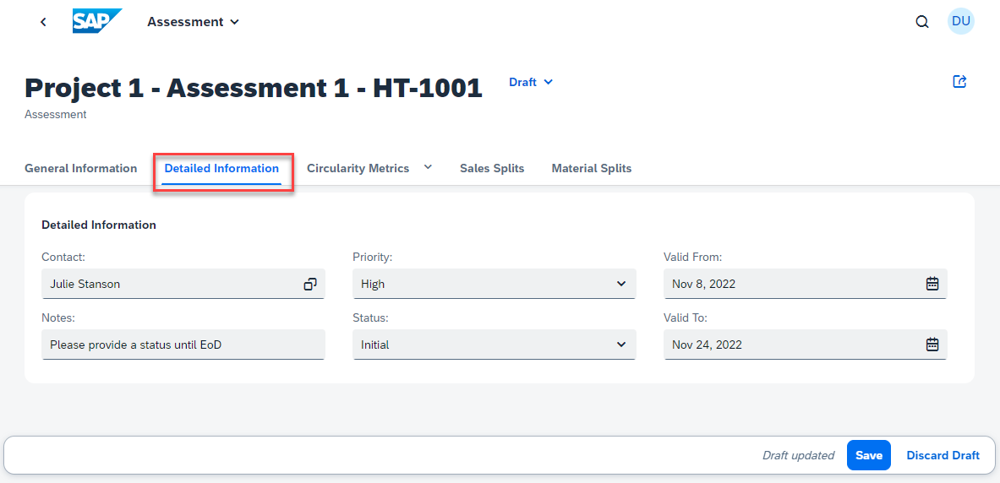](./images/CE_ExtensionFeature.png?raw=true)

3.9. If you want to see the default version of the SaaS application without the consumer extension, please onboard a new **t1** tenant like you've done in step 3.2. already. 

> **Hint** - You can see this time another user alice is used. Check the **local-with-mtx** profile in the package.json file to see the assignments of mock users to the different tenants.

```sh
cds subscribe t1 --to http://localhost:4004 --user alice:
```

3.10. Close the existing Incognito browser session (or use a different browser) and open http://localhost:4004/uimodule/webapp/index.html#Assessments-manage again in a new **Incognito** session.

3.11. Login with **alice** (user of tenant **t1**) instead of bob (user of extended tenant t1-ext).

3.12. You should see the default SaaS application without any consumer extensions.

[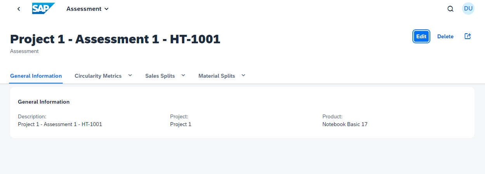](./images/CE_AppNoFeatures.png?raw=true)


## 4. Productive usage

Pushing SaaS consumer extensions in a productive scenario (to a CAP application deployed to SAP BTP) is a bit more complicated. Please check out the steps below, to get an idea about the process steps. All these steps are usually executed by developers of the SaaS consumer. 

> **Hint** - You as a SaaS provider need to assign the required roles to the SaaS consumer developers and provide them with the required URLs used to connect to their tenant (see below).

4.1. It is recommended to provide your SaaS consumers an option to **test** their extension in a **separate tenant** before pushing them to their productive tenant. Therefore, after deploying your SaaS application to a provider subaccount (e.g., SusaaS Provider) please create two new subaccounts (e.g., SusaaS-Subscriber and SusaaS-Subscriber-Ext). 

[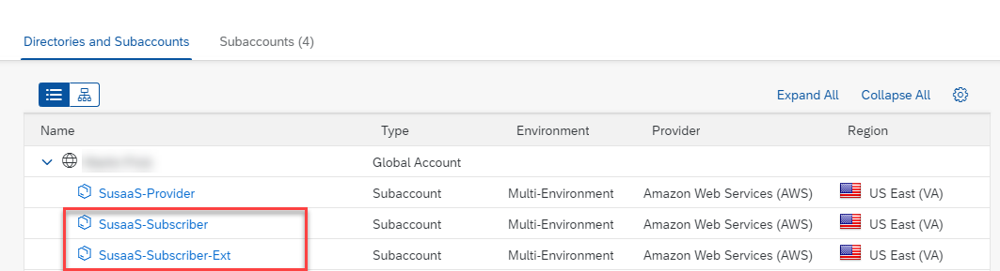](./images/CE_ProdPush01.png?raw=true)

4.2. Create respective **Sustainable SaaS** application subscriptions in both consumer subaccounts. 

[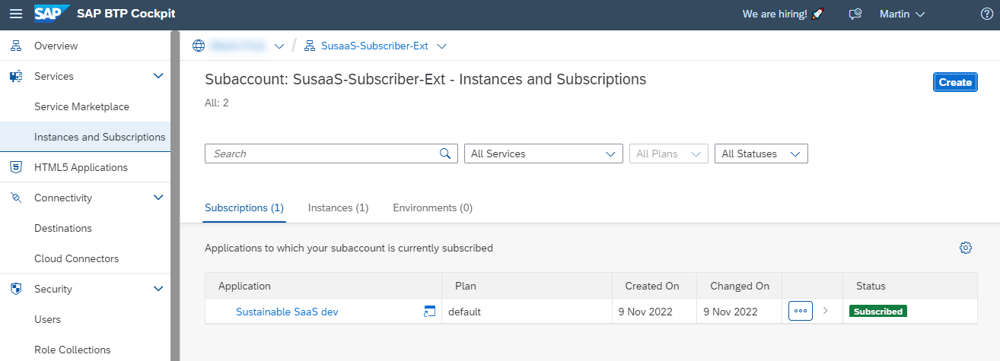](./images/CE_ProdPush02.png?raw=true)

4.3. After successful subscription, please make sure that you assign the **Susaas Extension Developer** role to the consumer's developer user who is supposed to push the SaaS consumer extension in one of the next steps. 

[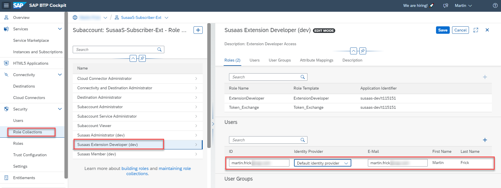](./images/CE_ProdPush03.png?raw=true)

4.4. To push the sample SaaS consumer extension to the **test tenant**, please open the respective consumer test subaccount and note down the **Subdomain** from the subaccount overview. 

[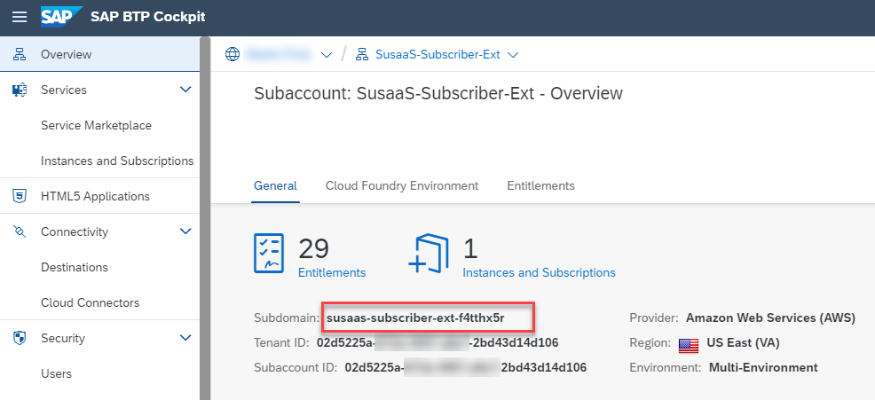](./images/CE_ProdPush05.png?raw=true)

4.5. Furthermore, your consumer will need the URL of the CAP service running in the provider subaccount. This URL has to be provided to consumers that wish to extend their tenants.

**Kyma**

> **Hint** - The following screenshots will use the Cloud Foundry Url, still the process in case of Kyma is congruent. 

[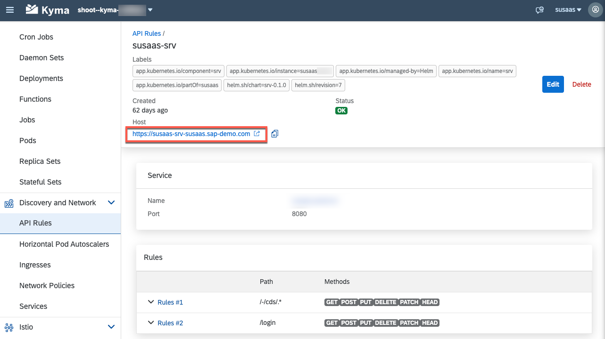](./images/CE_ProdPush06Kyma.png?raw=true)

**Cloud Foundry**

[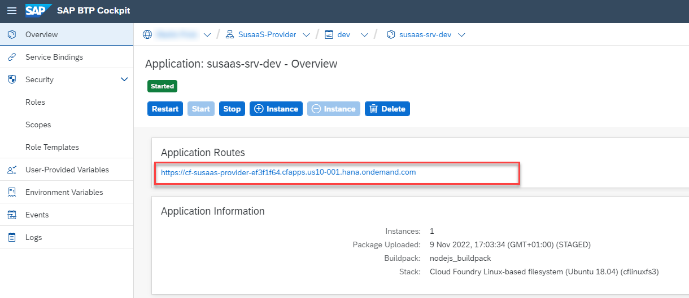](./images/CE_ProdPush06.png?raw=true)

4.6. From now on, please imagine you are a SaaS consumer developer. Open a command line window and switch to the unzipped **ext** folder again (see previous chapter) or open the respective path in VS Code (recommended!). 

```sh
$ cd \path\of\unzipped\ext\folder 
```

or to open the path in VS Code

```sh
$ code \path\of\unzipped\ext\folder 
```

[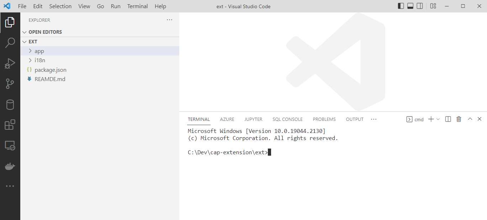](./images/CE_ProdPush04.png?raw=true)

4.7. In the **ext** folder, open a command line and use the **cds login** command to connect to the SaaS extensibility feature as SaaS consumer. 

> **Hint** - You might be asked to install an additional global npm package to store the authentication information. Please do so if required and re-run the cds login command afterward.

```sh
$ cds login <CAP Service Url> -s <Consumer Tenant Subdomain>
```

**Example** 

**Kyma**

```sh
cds login susaas-srv-default.a1b2c3.kyma.ondemand.com -s susaas-subscriber-ext-f4tthx5r
```

**Cloud Foundry**

```sh
cds login cf-susaas-provider-ef3f1f64.cfapps.us10.hana.ondemand.com -s susaas-subscriber-ext-f4tthx5r
```

4.8. You may be asked to enter a (temporary) passcode. 

[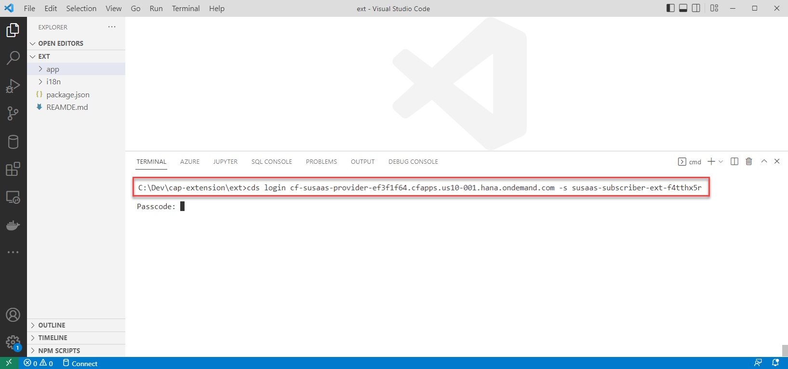](./images/CE_ProdPush07.png?raw=true)

4.9. You can generate that passcode by opening the following URL in your browser and logging in with your credentials.

https://\<ConsumerTenantSubomdain>.authentication.\<REGION>.hana.ondemand.com/passcode

**Example**

https://susaas-subscriber-ext-f4tthx5.authentication.us10.hana.ondemand.com/passcode

[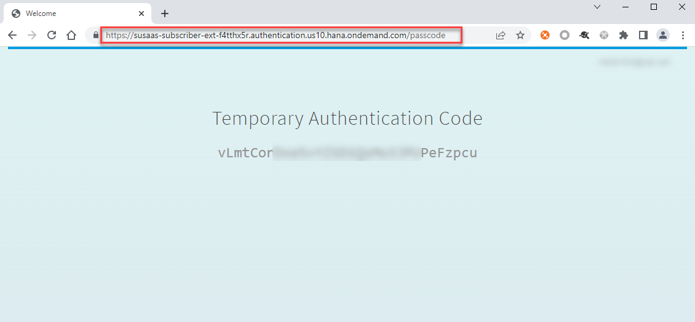](./images/CE_ProdPush08.png?raw=true)

4.10. Copy the passcode and paste it into your command line. Press Enter to continue. The authentication data will be stored on your local device to simplify further process steps. 

[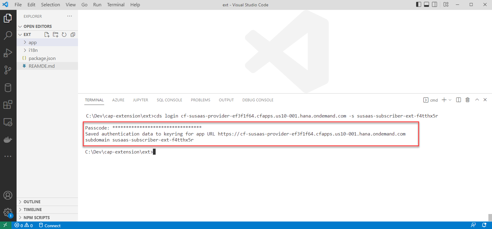](./images/CE_ProdPush09.png?raw=true)

4.11. Pull the latest default CDS model by running the following command in your command line. This will generate a node_modules folder containing the default CDS model which is referenced in the sample SaaS consumer extension.

> **Hint** - You don't have to enter any URL or user, as the information is automatically stored locally by the cds login process. 

```sh
$ cds pull
```

[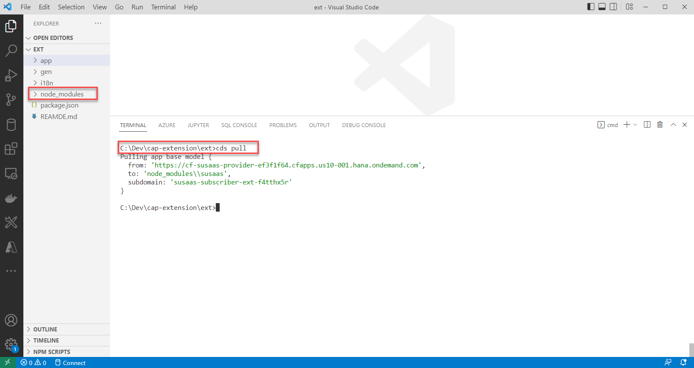](./images/CE_ProdPush10.png?raw=true)

4.12. Build the sample SaaS consumer extension project by running the following command. This will generate the **gen** folder. 

```sh
$ cds build
```

[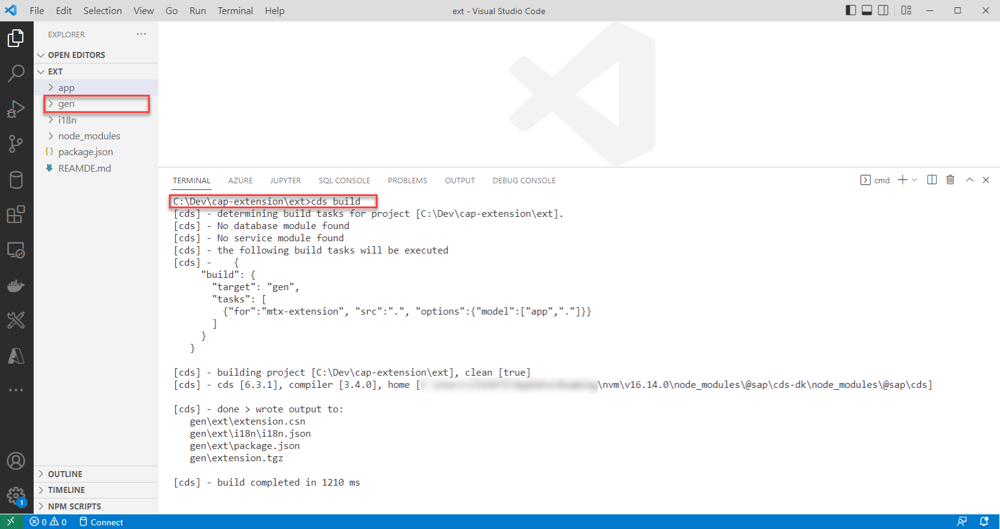](./images/CE_ProdPush11.png?raw=true)

4.13. Push the sample SaaS consumer extension by running the following command in your command line. 

> **Hint** - You don't have to enter any URL or user, as the information is automatically stored locally by the cds login process. 

```sh
$ cds push
```

[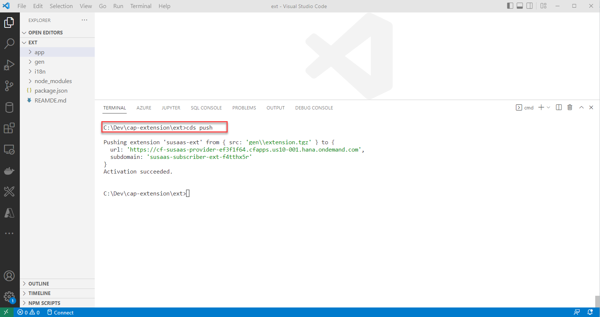](./images/CE_ProdPush12.png?raw=true)

4.14. Once the **Activation succeeded**, you can open the SaaS consumer subscription from the **Instances and Subscriptions** section of the SAP BTP Cockpit. 

> **Important** - Please make sure to the Susaas Administrator or Member role collection to your user if not done yet. 

[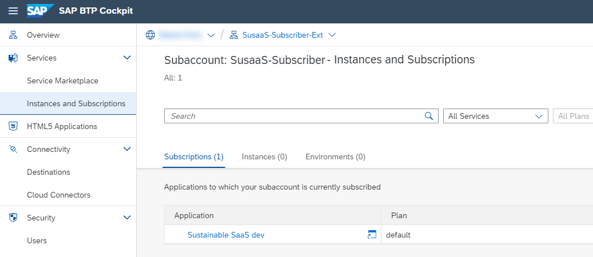](./images/CE_ProdPush13.png?raw=true)

4.15. You can see that the **Detailed Information** tab has been added to the **Assessments** Object Page. 

> **Hint** - To create an assessment, you might need to push some sample data using the SaaS API first. 

[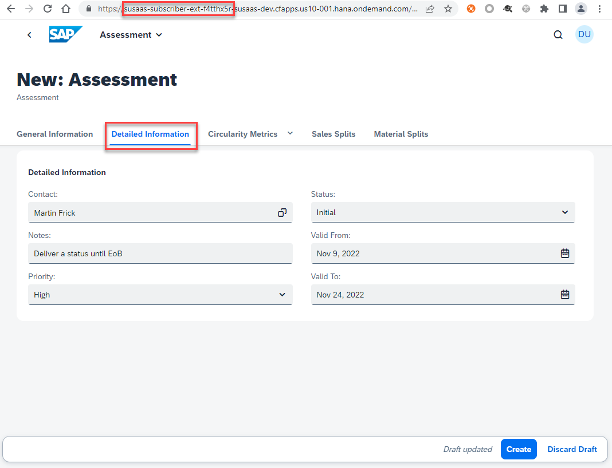](./images/CE_ProdPush14.png?raw=true)

4.16. Once you're comfortable with the extension in the SaaS consumer test tenant, you can repeat the process and push the extension to SaaS consumer production tenant. 


## 5. Further Information

Please use the following links to find further information on the topics above:

* [CAP documentation - Extending SaaS Apps](https://cap.cloud.sap/docs/guides/extensibility/customization)
* [CAP documentation - Provide Extension Guides](https://cap.cloud.sap/docs/guides/extensibility/customization#guide)