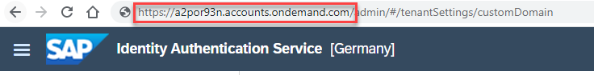
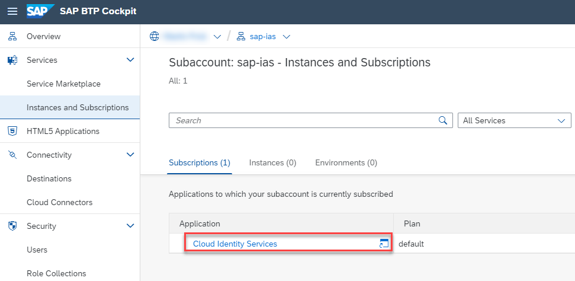
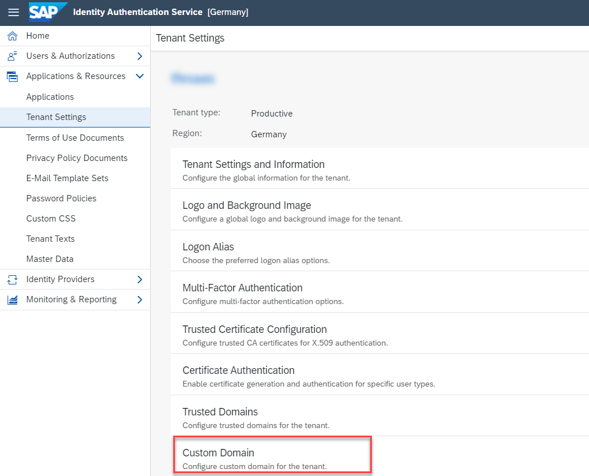
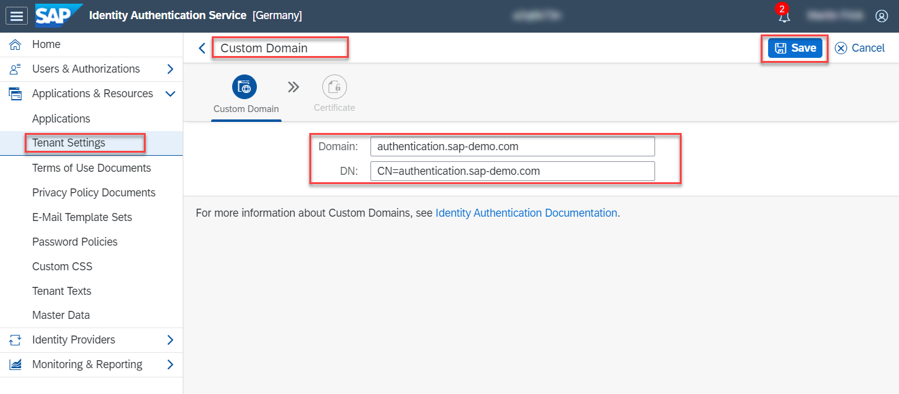
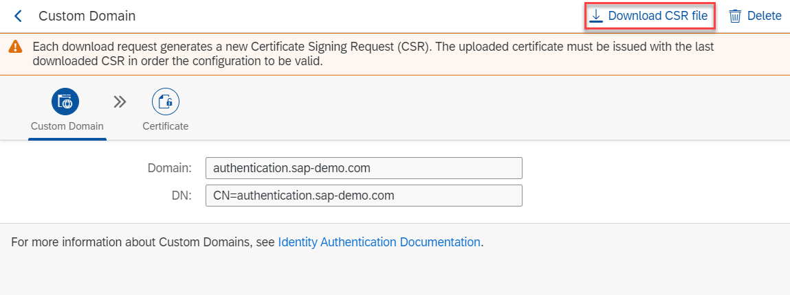
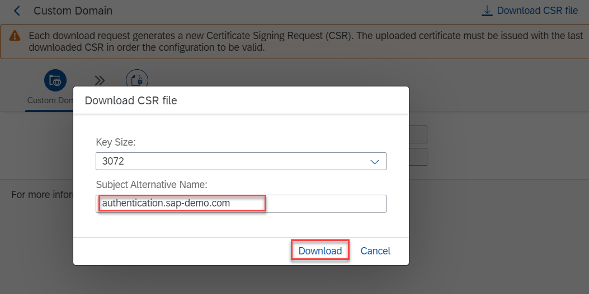
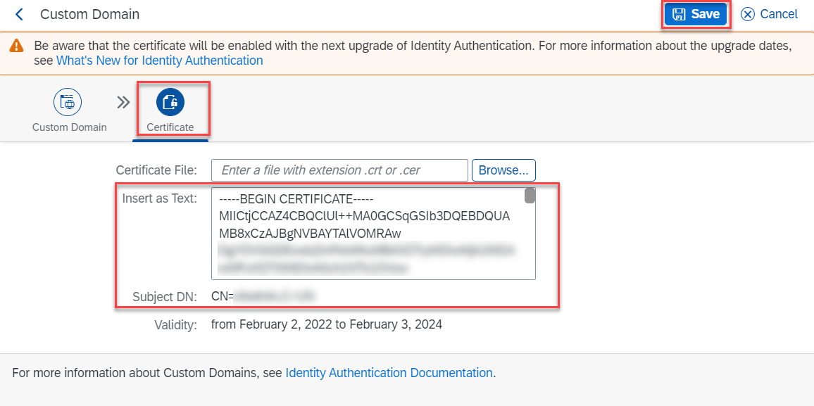
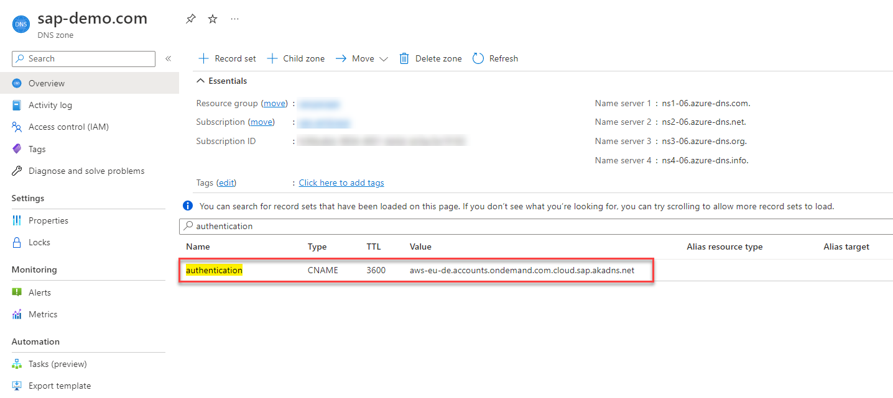
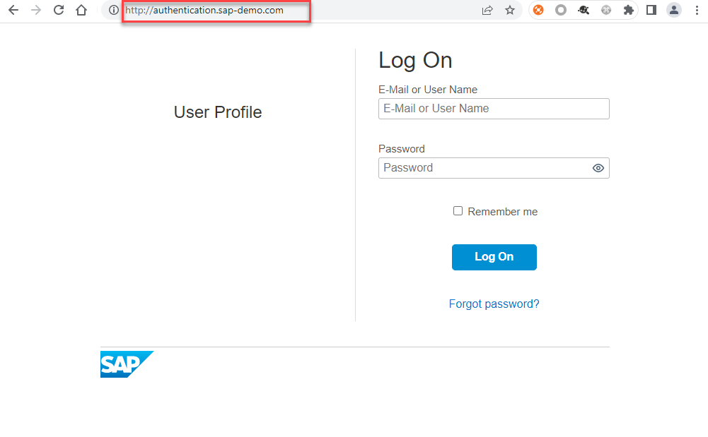

# Custom Domain for SAP Identity Authentication

- ### **Kyma** ✅
- ### **Cloud Foundry** ✅

In this part of the Expert Features you will learn how to configure a custom domain for your SAP Identity Authentication instance. As the official SAP Help documentation ([click here](https://help.sap.com/docs/IDENTITY_AUTHENTICATION/6d6d63354d1242d185ab4830fc04feb1/c4db840ff2464e12ab68d94efb0769c3.html?locale=en-US)) on this requirement is already quite extensive, we will use this tutorial to show you a sample setup and give you some tips and tricks. 

- [Custom Domain for SAP Identity Authentication](#custom-domain-for-sap-identity-authentication)
  - [1. Introduction](#1-introduction)
  - [2. Configure SAP IAS](#2-configure-sap-ias)
  - [3. CNAME record in DNS](#3-cname-record-in-dns)
  - [4. Additional Steps](#4-additional-steps)
  - [5. Further information](#5-further-information)

## 1. Introduction

If you followed the **Advanced Version** of our SaaS sample scenario, you have already set up SAP Identity Authentication Service (SAP IAS) as a central user store. All consumer users will be maintained in SAP IAS and also use it to authenticate to their consumer SaaS instances. While that scenario works properly from a technical perspective, there is a tiny downside to the default setup. Your SAP IAS instance will come with a default domain like https://a2por93n.accounts.ondemand.com. 

So, whenever a user is forwarded to SAP IAS for authentication, this default domain will appear in the browser window. This is not a problem per se, but also not very nice. For that reason, in this part of the **Expert Features** we will show you, how to configure your custom domain for SAP IAS like https://authentication.sap-demo.com. 

## 2. Configure SAP IAS

2.1. To configure a custom domain in SAP IAS, please go to the admin console of your SAP IAS instance. You can find the respective link in the welcome e-mail which you received when setting up your SAP IAS instance. Another way to navigate to your SAP IAS instance is to click on the subscription in your **Instances & Subscriptions** menu of your SAP BTP Cockpit. 

2.2. In the SAP IAS admin console, please switch to **Applications & Resources** -> **Tenant Settings** and select **Custom Domain** from the list of settings. 

2.3. You will see the following screen. In the **Domain field**, please provide the custom (sub-)domain that you want to set up for your SAP IAS instance like **authentication.sap-demo.com**. In the **DN field**, please provide at least the Common Name (CN) using the same domain like **CN=authentication.sap-demo.com**. Click **Save**. 

2.4. Download the **Certificate Signing Request** (CSR), by clicking the respective button. 

2.5. You can choose a different Key Size if required and provide a Subject Alternative Name (if required - not mandatory). Click on **Download** to download the CSR. 

> **Hint** - It is not possible to upload an existing private key/certificate. 

2.6. Send the CSR to your Certification Authority to receive a signed certificate. 

> **Hint** - You can also use Let's Encrypt for testing purposes. 

2.7. Once you received your signed certificate, please open it in a Text Editor and copy the content. In SAP IAS, click on **Certificate** and paste your signed certificate into the respective text box. Double-check the Subject DN value and click on **Save**.

> **Hint** - You can either paste the whole certificate chain (incl. Root and Intermediate certificates), or only the domain certificate itself.

## 3. CNAME record in DNS

As described in the official SAP Help documentation ([click here](https://help.sap.com/docs/IDENTITY_AUTHENTICATION/6d6d63354d1242d185ab4830fc04feb1/c4db840ff2464e12ab68d94efb0769c3.html?locale=en-US#prerequisites)), please make sure to set a correct CNAME record in your domain's DNS settings. Below you can see a sample CNAME set for an SAP Identity Authentication tenant in the eu10 region (AWS). 

Without this CNAME record, you will not be able to reach your SAP IAS tenant using the configured custom domain. 

## 4. Additional Steps

Check the official SAP Help information ([click here](https://help.sap.com/docs/IDENTITY_AUTHENTICATION/6d6d63354d1242d185ab4830fc04feb1/c4db840ff2464e12ab68d94efb0769c3.html?locale=en-US#results-0)) on the latest activation schedule of custom domain certificates. This may take up to two weeks. Once your domain certificate is activated, you will be able to reach your SAP IAS instance using your custom domain. 

After successful activation, you may need to change further settings based on your environment (e.g., redirect configurations). Please check the official SAP Help documentation ([click here](https://help.sap.com/docs/IDENTITY_AUTHENTICATION/6d6d63354d1242d185ab4830fc04feb1/c4db840ff2464e12ab68d94efb0769c3.html?locale=en-US#next-steps)) to learn more! 

## 5. Further information

Please use the following links to find further information on the topics above:

* [SAP Help - Use Custom Domain in Identity Authentication](https://help.sap.com/docs/IDENTITY_AUTHENTICATION/6d6d63354d1242d185ab4830fc04feb1/c4db840ff2464e12ab68d94efb0769c3.html?locale=en-US)
