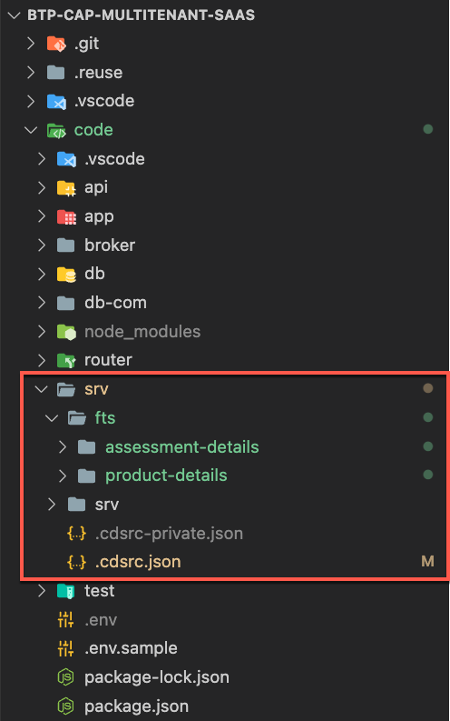
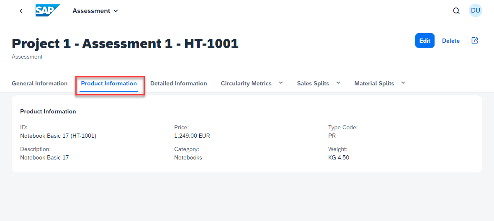
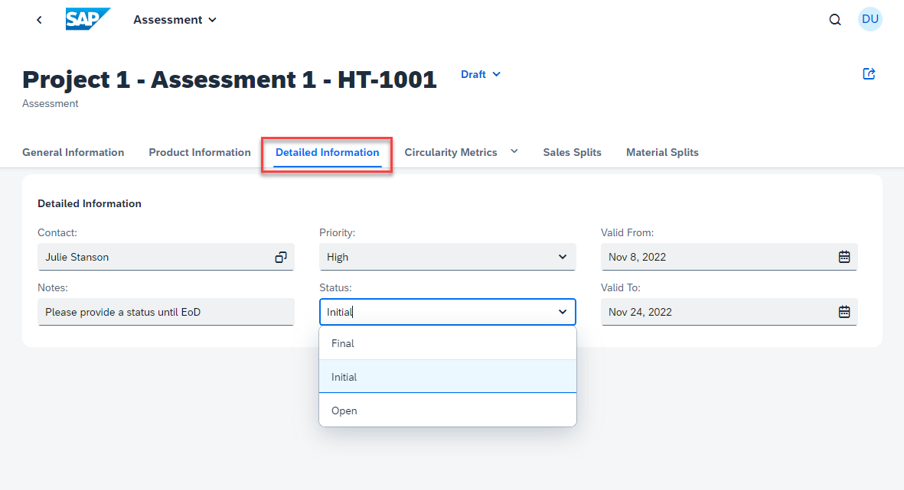

# Feature Toggles

- **Kyma** ✅
- **Cloud Foundry** ✅

In this part of the mission, you will learn how SaaS providers can enable features for dedicated SaaS consumer tenants or even single users using so-called **Feature Toggles**. 

- [Feature Toggles](#feature-toggles)
  - [1. Introduction](#1-introduction)
  - [2. Prerequisites](#2-prerequisites)
  - [3. Feature Toggle Test](#3-feature-toggle-test)
  - [4. Further Information](#4-further-information)


## 1. Introduction

Feature toggles allow a SaaS provider to enable certain application features for dedicated SaaS consumer tenants or even single users in an easy and convenient way. This functionality is very similar to the extensibility features for SaaS consumers. Only minor code changes are required compared to SaaS consumer extensions ([click here](../consumer-extensibility/README.md)).

In contrast to SaaS consumer extensions, features enabled by feature toggles are deployed to all consumer tenants (HDI containers), no matter if the consumer tenant uses the feature or not! It remains invisible until the feature is enabled for the specific tenant or user.

Due to the complexity of the Feature Toggles topic, the actual implementation details will not be covered in this tutorial. Please check the extensive official SAP CAP documentation ([click here](https://cap.cloud.sap/docs/guides/extensibility/feature-toggles)) if you're interested in further details. 

> **Hint** - Feature toggles are (as of today) not yet usable in productive SAP BTP deployments but can only be developed and tested locally. Please find more information on this limitation in the official SAP CAP documentation ([click here](https://cap.cloud.sap/docs/guides/extensibility/feature-toggles#in-production)) 


## 2. Prerequisites 

- Please unzip the **fts.zip** file ([fts.zip](./files/fts.zip)) and copy it to the **code/srv** directory of your cloned project (e.g., basic branch). The folder **fts** contains two additional features for your application. 

    > **Important** - Please don't change the folder name!

    [](./images/FT_RepoStructure.png?raw=true)

- Please add the following **tenants** object to the **local-with-mtx** profile of your *code/srv/.cdsrc.json* file (as you can see below). This enables the two new features (product-details and assessment-details) for tenant **t1-ext** only. Furthermore, please check if the **db** property is set to **sql-mt**. This ensures that changes are persisted even after restart of the application.

    ```json
    ...
        "auth": {
            "[hybrid]": {
                "kind": "xsuaa"
            },
            "[local-with-mtx]": {
                "kind": "mock",
                "tenants": {
                    "t1-ext" : { "features": [ "product-details", "assessment-details"] }
                },
                "users": {
                    ...
                }
            }
        }
    ...
    ```


## 3. Feature Toggle Test

3.1. To test the feature toggle locally, you first need to start the CAP application from a command line using the **local-with-mtx** profile. 

> **Hint** - Please run the following commands from the *code* directory. 

**Command line #1**

```sh
cds watch srv --profile local-with-mtx
```

3.2. Once the application is up and running, open **a new command line** and **subscribe** tenant **t1**, which is supposed to use the default version of the application. 

**Command line #2**

```sh
cds subscribe t1 --to http://localhost:4004 --user alice
```

3.3. After subscription of tenant t1, please also subscribe tenant **t1-ext**, which will see the new features enabled by the **feature toggle**. 

**Command line #2**

```sh
cds subscribe t1-ext --to http://localhost:4004 --user bob
```

You can now open the application in two different browser sessions and test whether the new features are visible for tenant **t1-ext** while tenant **t1** should not see them. 

> **Important** - Make sure to open the application once in a default browser session and once in an **Incognito** session. 

**Default Browser Session (t1 tenant)**

- Open http://localhost:4004/ui-public-assessments/webapp/index.html#Assessments-manage.
- Login with **alice** (user of tenant **t1**). Leave the password field blank.
- You will see the default version of the application without new features.

    [](./images/FT_AppNoFeatures.png?raw=true)

**Incognito Browser Session (t1-ext tenant)**

- Open http://localhost:4004/ui-public-assessments/webapp/index.html#Assessments-manage.
- Login with **bob** (user of tenant **t1-ext**). Leave the password field blank.
- You should see the extended application including the new features enabled by the feature toggle.

    [](./images/FT_AppFeatures01.png?raw=true)

    [](./images/FT_AppFeatures02.png?raw=true)


## 4. Further Information

Please use the following links to find further information on the topics above:

* [CAP documentation - Feature Toggles](https://cap.cloud.sap/docs/guides/extensibility/feature-toggles)
* [CAP documentation - Feature Toggles - Limitations](https://cap.cloud.sap/docs/guides/extensibility/feature-toggles#limitations)
* [CAP documentation - MTX Configuration](https://cap.cloud.sap/docs/guides/multitenancy/mtxs#conf)
* [CAP documentation - Enable MTX only if required](https://cap.cloud.sap/docs/guides/multitenancy/mtxs#enable-mtx-only-if-required)