# HDI Container Administration

- **Kyma** ✅
- **Cloud Foundry** ✅

In this part of the **Expert Features** you will learn how to set up a new HDI Container Group Administrator for your SaaS HDI containers. This user will be able to administrate Tenant database containers (e.g., create or import backups, use the HDI Container API, ...). 

- [HDI Container Administration](#hdi-container-administration)
  - [1. Introduction](#1-introduction)
  - [2. Prerequisites](#2-prerequisites)
  - [3. Login to SAP HANA Cloud Cockpit](#3-login-to-sap-hana-cloud-cockpit)
  - [4. Create a new database user](#4-create-a-new-database-user)
  - [5. Set up a new HDI Container Group administrator](#5-set-up-a-new-hdi-container-group-administrator)
  - [6. Further information](#6-further-information)

Please check the following SAP Help documentation in case you're new to the topic of SAP HANA HDI container administration.

* [SAP HDI Administration](https://help.sap.com/docs/HANA_CLOUD_DATABASE/c2cc2e43458d4abda6788049c58143dc/b36b4b60c9e44291ae02e520135fd898.html?locale=en-US)
* [SAP HDI Administration in Context](https://help.sap.com/docs/HANA_CLOUD_DATABASE/c2cc2e43458d4abda6788049c58143dc/b4b6a8936bc64526b8fd8491c4a40eaa.html?locale=en-US)

## 1. Introduction

Creating an HDI Container (Group) Administrator is a very critical process from a data security perspective. Especially in a productive landscape, you have to be very conscious about which roles and permissions you assign to support or administrative staff. Especially permissions allowing data access to Consumer database containers should be granted in very exceptional cases only! 

As a SaaS provider, you need to ensure this process is well aligned with your SaaS customers and that only a very limited group of people has permissions to access, export, and import customer database containers. Make sure to create and assign dedicated roles in your database by always following the least permission model! 

> **Important** - The user created in this step-by-step guide is assigned very **extensive permissions** to administrate all containers created by the default HDI Container Service Broker for **simplification and demo purposes**. This means he can grant **Full Access permissions** for each HDI Container to any database user. As stated above, especially in a productive environment you will need a much more elaborated security setup. In the following sample, the DBADMIN user has e.g., assigned the sample user SUSAAS_OPS permissions to export **a specific container** only. SUSAAS_OPS has no other container-related permissions except for the export feature.   
>

## 2. Prerequisites

- You need to have **DBADMIN access** to your SAP HANA Cloud Instance to follow this step-by-step guide.
- You need a basic understanding of the SAP HDI concepts including SAP HDI Container Groups (also check the **Further Information** section).

## 3. Login to SAP HANA Cloud Cockpit

3.1. Open the **SAP HANA Cloud** Tools in your **Instances and Subscriptions** menu. Ensure you assigned the respective **Role Collections** if you are facing any permissions errors. 

[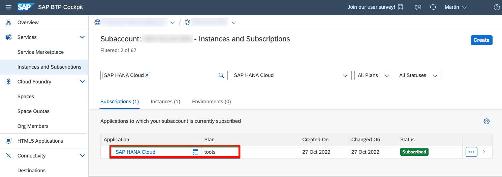](./images/hdi_group_020.png?raw=true)

3.2. Open the **...** (additional actions) of your SAP HANA Cloud instance and select **Open in SAP HANA Cockpit** to access the SAP HANA Cloud administration. 

[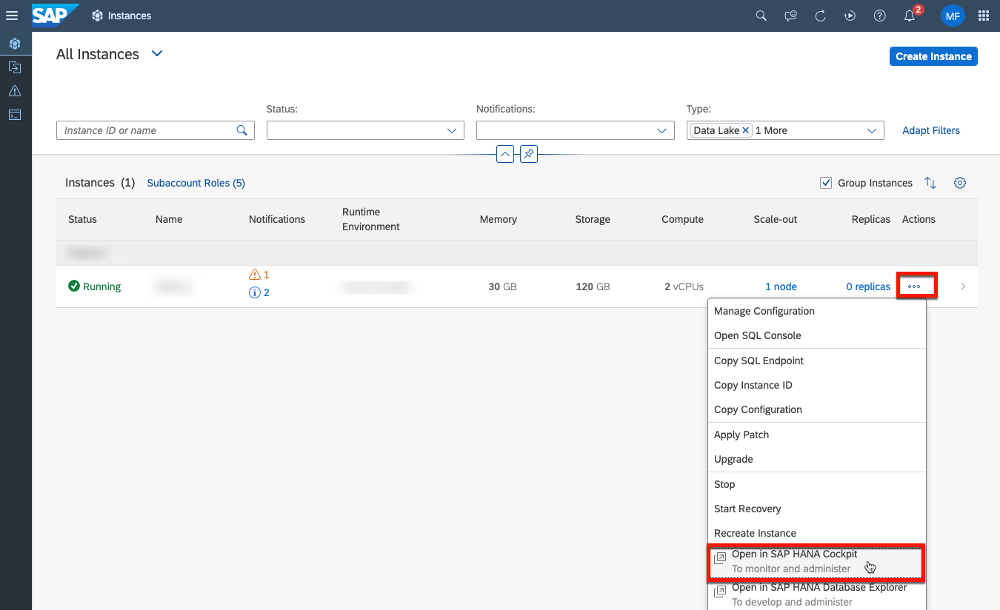](./images/hdi_group_020.png?raw=true)

3.4. Login with the **DBADMIN** user. 

> **Important** - By default, only the **DBADMIN** user has the initial permissions to administrate the default HDI Container Group used by the Service Broker. New HDI Container Group admins can only be added by the DBADMIN user. 

[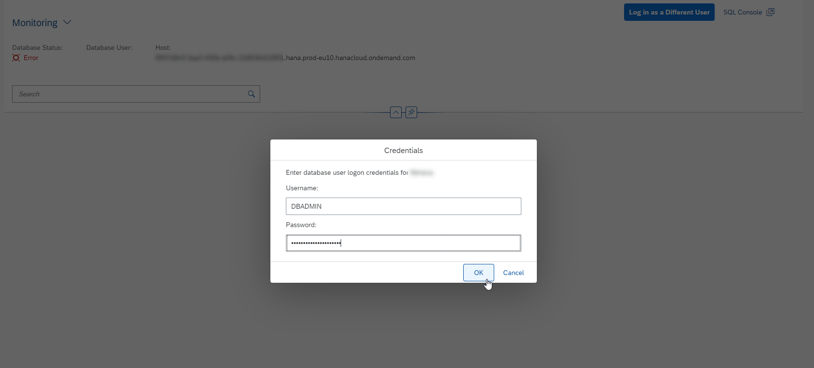](./images/hdi_group_030.png?raw=true)

## 4. Create a new database user

4.1. To create a new user (for support/operations) with administrative permissions on a dedicated HDI Container Group, switch to **Security and User Management** section and click on **User Management**. 

[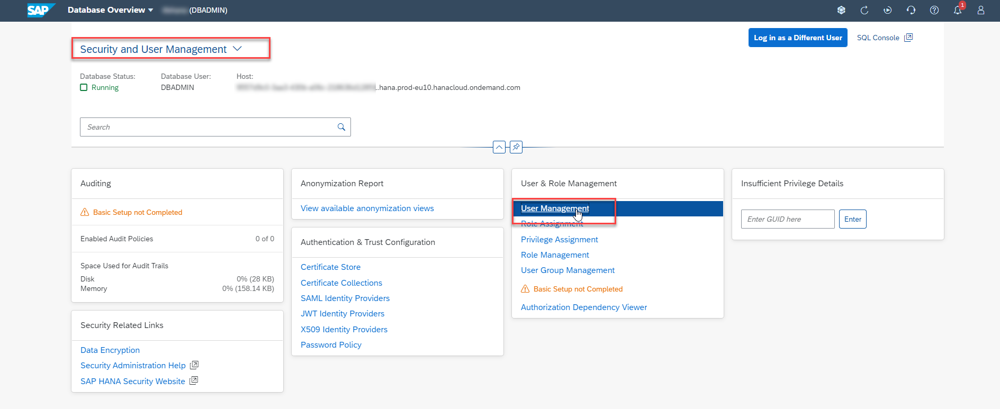](./images/hdi_group_040.png?raw=true)

4.2. Create a new SAP HANA database user by clicking on the **+** button and selecting **Create User**. 

[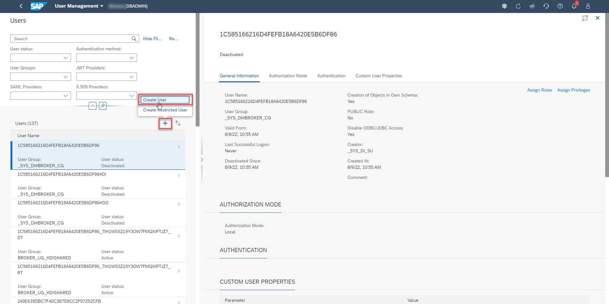](./images/hdi_group_050.png?raw=true)

4.3. Decide on a username and provide a valid e-mail address. Keep the default settings for **PUBLIC role** and **schema object creation**, as the support/operations user e.g., needs to create temporary tables for HDI Container exports in his own schema. 

> **Hint** - In a productive environment, we recommend creating named users like JOHNDOE or usage of employee IDs to allow proper logging of critical database activities. 

[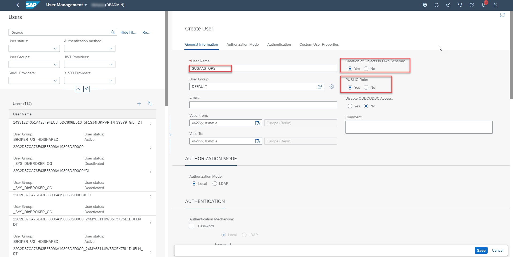](./images/hdi_group_060.png?raw=true)

4.4. Set an initial password for your new user. You can enforce a password change and enable/disable a password lifetime if required. Finally, click on **Save** to create your new database user. 

[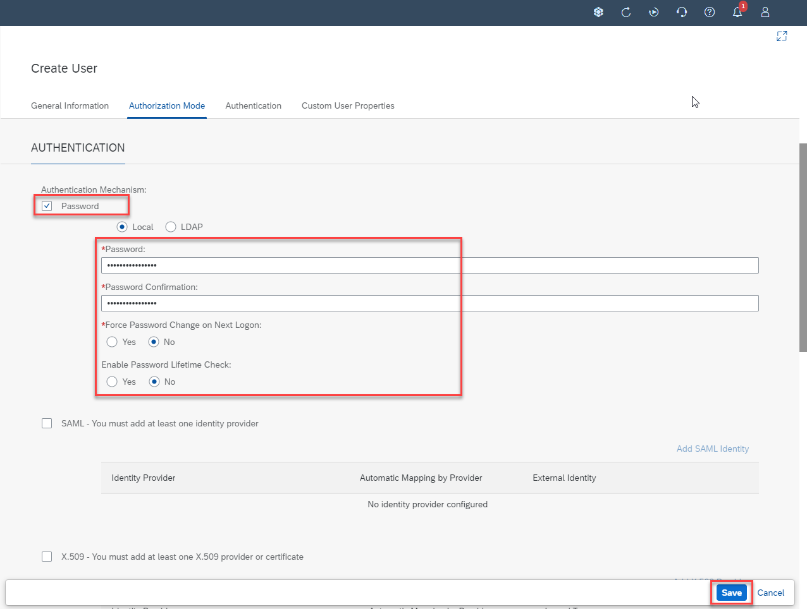](./images/hdi_group_070.png?raw=true)

## 5. Set up a new HDI Container Group administrator

5.1. Switch to the **Administration** section of your SAP HANA Cloud Cockpit. 

5.2. Click on **HDI Administration** to open the HDI Administration user interface. 

> **Hint** - The UI might require a few moments to load all content. 

[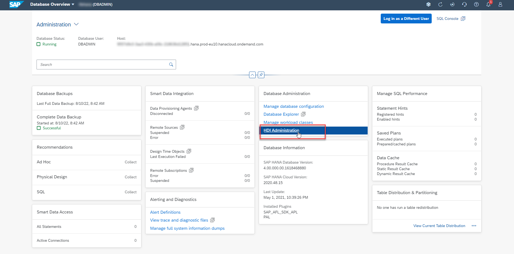](./images/hdi_group_090.png?raw=true)

5.3. Select the **User & Roles** tab. 

[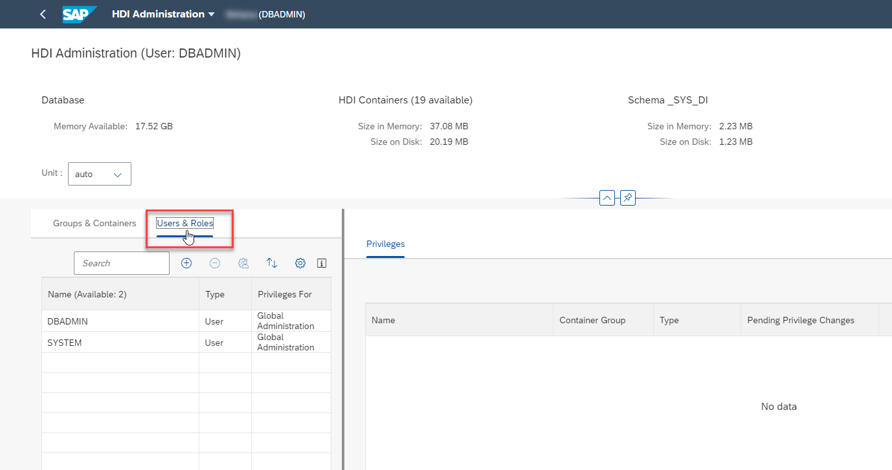](./images/hdi_group_100.png?raw=true)

5.4. Click on the **+** button to add the new support/operations user. 

[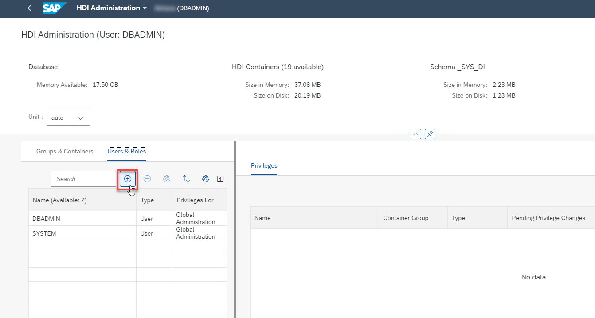](./images/hdi_group_110.png?raw=true)

5.5. In the popup window, search for the username of your new user (e.g., JOHNDOE). Select the user from the list and click on **OK**.

> **Hint** - If the user does not show up, first try to reload the page. If it still doesn't show up, make sure the user was configured correctly (PUBLIC role and permission to create objects in his own schema).

[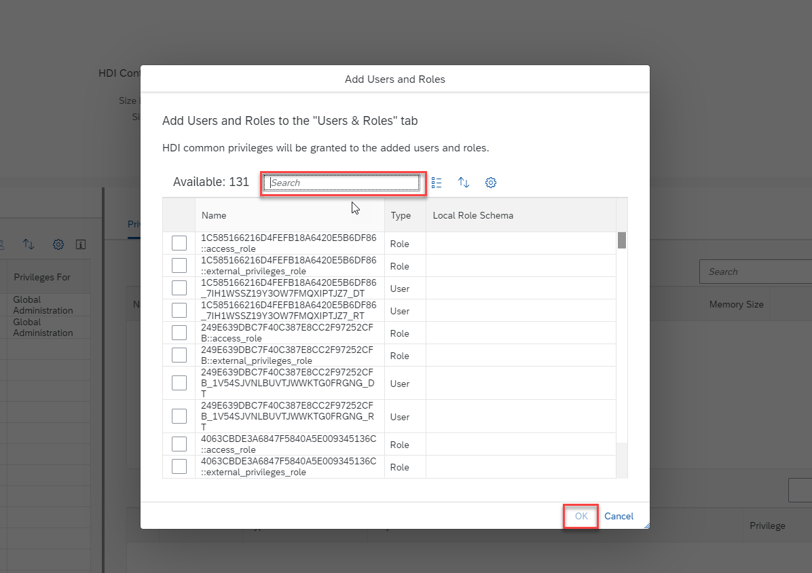](./images/hdi_group_120.png?raw=true)

5.6. First, the user will be assigned some common privileges for HDI container administration. 

[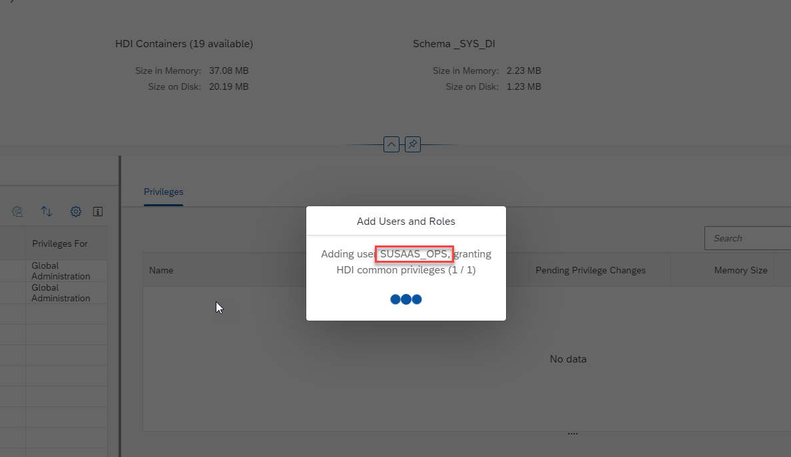](./images/hdi_group_130.png?raw=true)

5.7. You will see a list of permissions assigned to your new support/operations user. 

[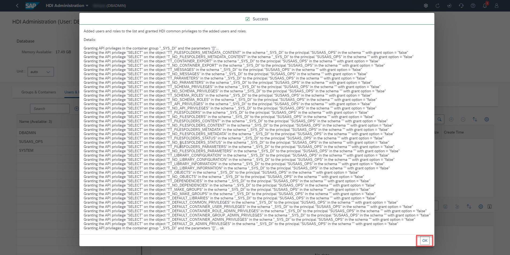](./images/hdi_group_140.png?raw=true)

5.8. After the user was added to the list of users, select it and click on the **+** icon in the **Groups & Containers on which User has Privileges** section. This will allow you to assign HDI Container Group permissions. In the list of Container Groups, you will see the default Service Broker Container Group called **BROKER_CG**. 

> **Hint** - All HDI containers created by the respective SAP BTP Service Broker will be assigned to this Container Group. 

[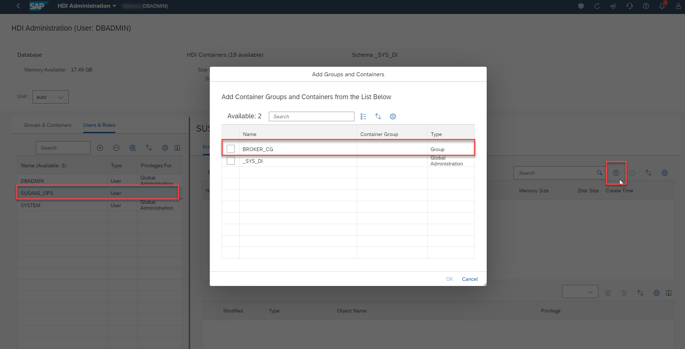](./images/hdi_group_150.png?raw=true)

5.9. Select the **BROKER_CG** Container Group and click on **OK**. 

[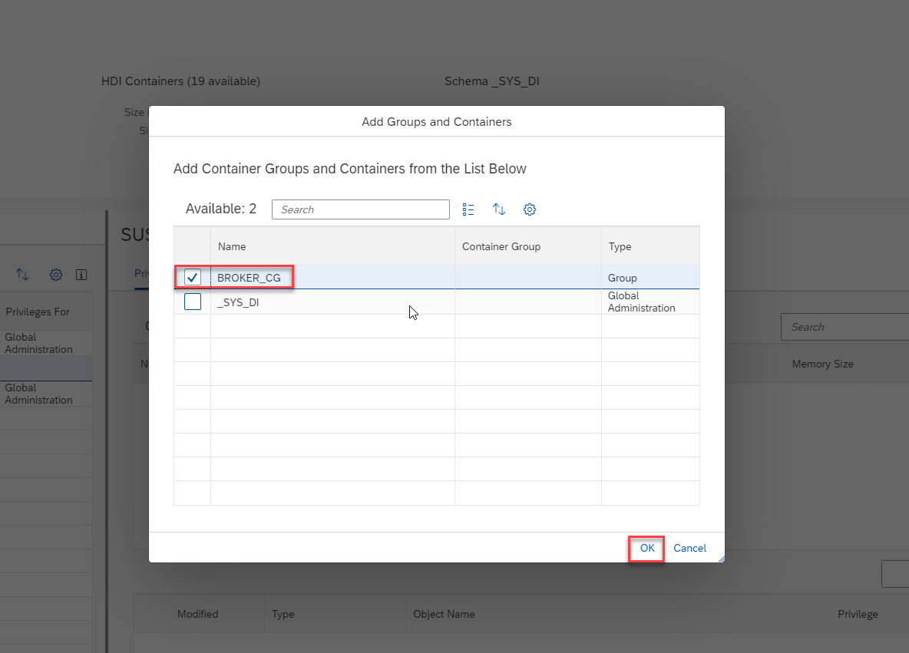](./images/hdi_group_160.png?raw=true)

5.10. You can now assign the required permissions for this Container Group to your support/operations user. Therefore, make sure you selected your user in the user list and select the BROKER_CG Container Group from the list of Groups & Containers. From the dropdown field in the **Privileges on Selected Groups** section, select **Container Group Admin Privileges**. Make sure all permissions are selected and click on the **Save** icon. 

> **Important** - This will assign your user the full scope of permissions to administrate all containers in this default Container Group. As mentioned in the beginning of this step-by-step guide, your security setup will probably require a much more granular permission handling! 

> **Hint** - If you cannot see any values in the **dropdown field**, please assign the available privileges manually. 

[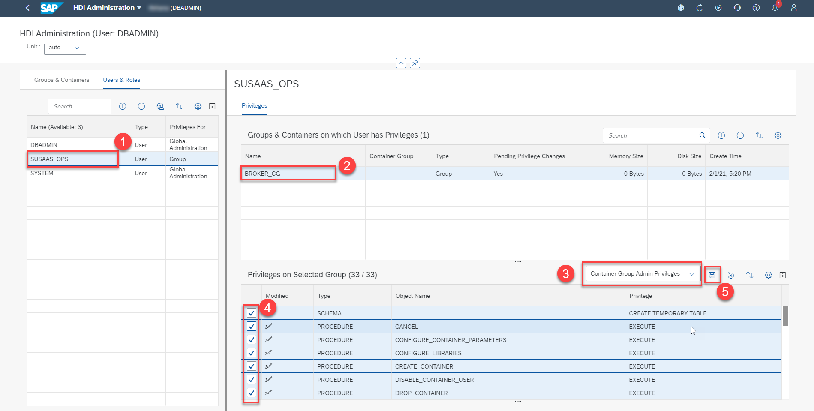](./images/hdi_group_170.png?raw=true)

5.11. Confirm you want to assign the permissions to this user. 

[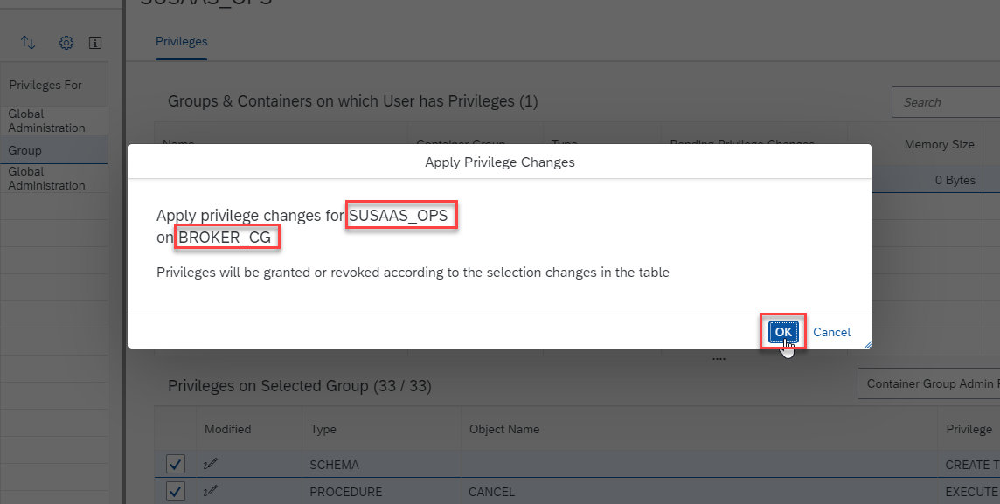](./images/hdi_group_180.png?raw=true)

5.12. You can scroll through the list of permissions and will see that your user can now e.g., export and import all HDI Containers in this Container Group. 

[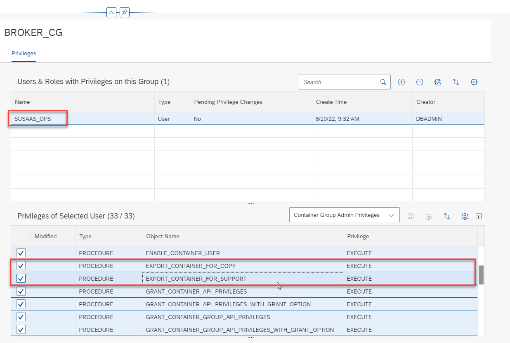](./images/hdi_group_190.png?raw=true)

5.13. One example of using the HDI Container Administration permissions in action can be found in another **Expert Features** scenario covering the [**Backup of Database Containers**](../backup-database-containers/README.md). 

5.14. Furthermore, you can log in to **SAP HANA Database Explorer** with the new database user (in this case SUSAAS_OPS) and make use of the powerful HDI Container SQL API. One example can be seen in the screenshot below, in which the schema role **COM_EXTERNAL_ACCESS** of container **4D7A05F.........93C338B** was assigned to the **DBADMIN** user.

[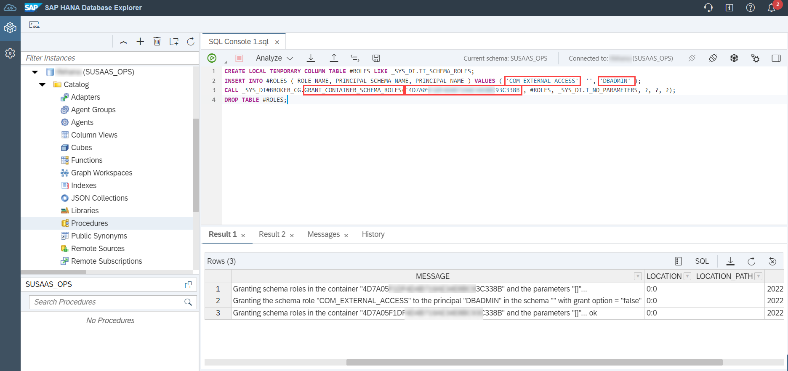](./images/hdi_assignrole.png?raw=true)

## 6. Further information

The concept of HDI Container Administration is a very powerful concept, which allows you to assign administrative permissions for your database containers to dedicated database users. This simplifies the maintenance and support of database/container-related incidents. Make yourself familiar with the official SAP Help documentation to learn how to use this great SAP HANA database feature for your requirements.

[SAP Help - SAP HDI Administration](https://help.sap.com/docs/HANA_CLOUD_DATABASE/c2cc2e43458d4abda6788049c58143dc/b36b4b60c9e44291ae02e520135fd898.html?locale=en-US)

[SAP Help - SAP HDI Administration in Context](https://help.sap.com/docs/HANA_CLOUD_DATABASE/c2cc2e43458d4abda6788049c58143dc/b4b6a8936bc64526b8fd8491c4a40eaa.html?locale=en-US)

[SAP Help - Maintaining SAP HDI Container Groups](https://help.sap.com/docs/HANA_CLOUD_DATABASE/c2cc2e43458d4abda6788049c58143dc/4e9d59759b294124baa97c5b6d675072.html?locale=en-US)

[SAP Help - Maintaining SAP HDI Containers](https://help.sap.com/docs/HANA_CLOUD_DATABASE/c2cc2e43458d4abda6788049c58143dc/bcd6e27173464d9eb6a5ff9e53275240.html?locale=en-US)

[Youtube - SAP HANA Deployment Infrastructure (HDI) Administration](https://www.youtube.com/watch?v=njVZWRGTJAI)