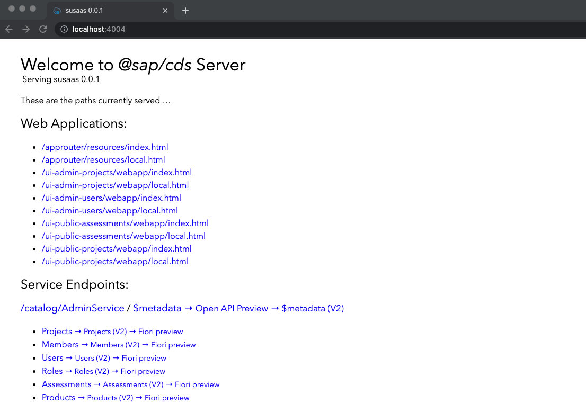
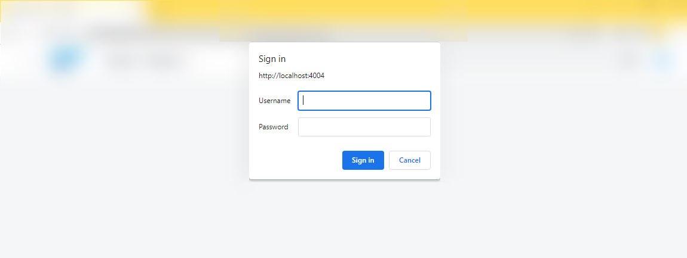
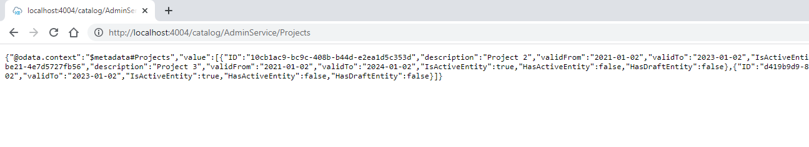
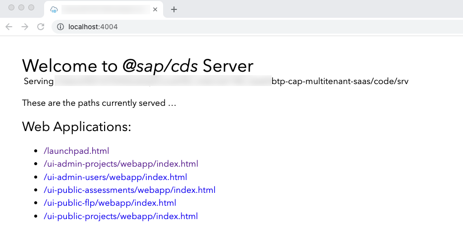
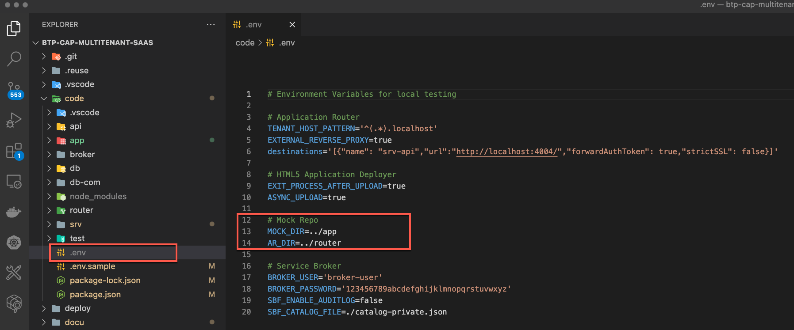
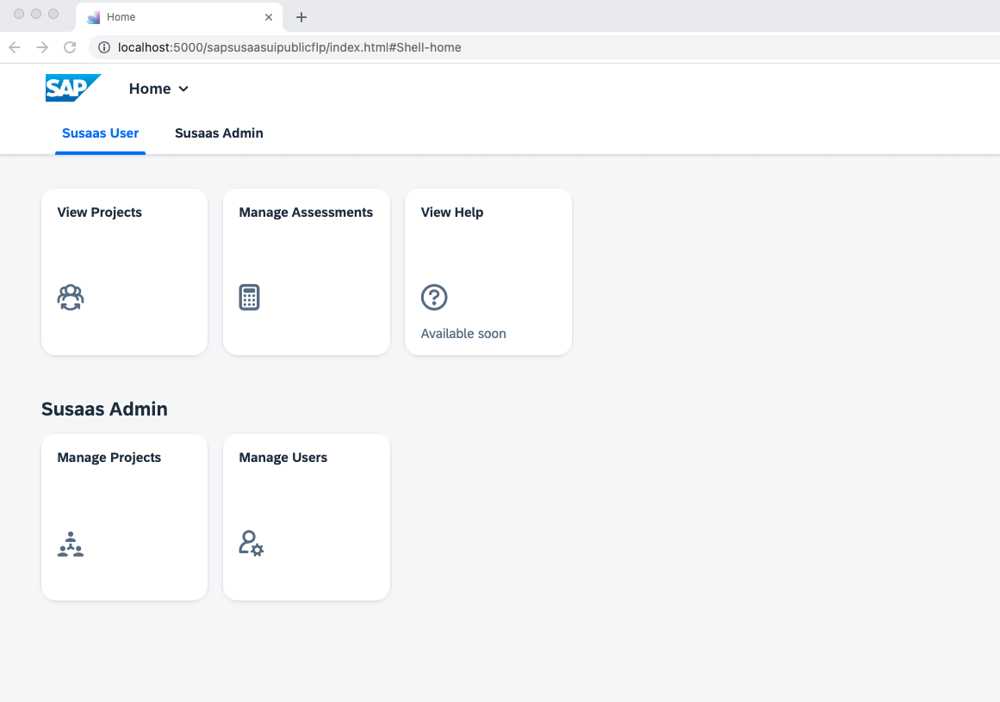
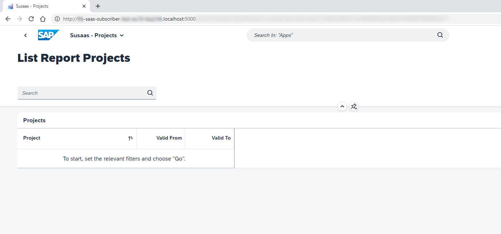
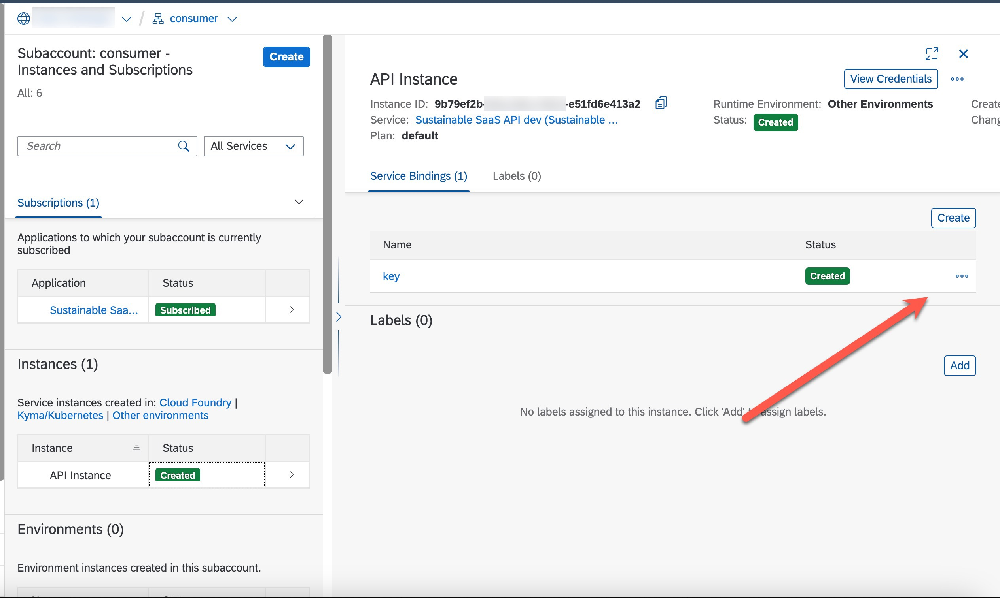

# Local and hybrid development

- **Kyma** ✅
- **Cloud Foundry** ✅

In this part of the **Expert Features** you will learn how to use the local and hybrid development features of CAP. This will simplify the development process and let's you implement new features in a local environment with and without multitenancy enable. 

- [Local and hybrid development](#local-and-hybrid-development)
- [Local Development](#local-development)
  - [1. Running the multitenant application locally (susaas-srv)](#1-running-the-multitenant-application-locally-susaas-srv)
    - [1.1. Start the application with local multitenancy](#11-start-the-application-with-local-multitenancy)
    - [1.2. Onboard a new SaaS tenant to your application](#12-onboard-a-new-saas-tenant-to-your-application)
    - [1.3. Check the application](#13-check-the-application)
  - [2. Running the frontend application locally (susaas)](#2-running-the-frontend-application-locally-susaas)
    - [2.1. Local testing using cds serve](#21-local-testing-using-cds-serve)
    - [2.2. Local testing using the HTML5 Repo Mock](#22-local-testing-using-the-html5-repo-mock)
  - [3. Running the API Endpoint locally](#3-running-the-api-endpoint-locally)
    - [3.1. Start the API locally](#31-start-the-api-locally)
    - [3.2. Read data from API locally](#32-read-data-from-api-locally)
    - [3.4. Insert recycling materials with API locally](#34-insert-recycling-materials-with-api-locally)
- [Hybrid Development](#hybrid-development)
  - [Prerequisites](#prerequisites)
  - [1. Running the multitenant application in hybrid mode (susaas-srv)](#1-running-the-multitenant-application-in-hybrid-mode-susaas-srv)
    - [1.1. Login to the environment of your provider subaccount](#11-login-to-the-environment-of-your-provider-subaccount)
    - [1.2. Prepare your hybrid testing environment](#12-prepare-your-hybrid-testing-environment)
    - [1.3. Start the multitenant application in hybrid mode with hybrid profile](#13-start-the-multitenant-application-in-hybrid-mode-with-hybrid-profile)
  - [2. Running frontend application in hybrid mode](#2-running-frontend-application-in-hybrid-mode)
    - [2.1. Read environment variables from Approuter (susaas)](#21-read-environment-variables-from-approuter-susaas)
    - [2.2. Run the frontend application in hybrid mode](#22-run-the-frontend-application-in-hybrid-mode)
    - [2.3. Start the UI Application](#23-start-the-ui-application)
  - [3. Running the multitenant API in hybrid mode (susaas-api-srv)](#3-running-the-multitenant-api-in-hybrid-mode-susaas-api-srv)
    - [3.1. Getting the environment variables for multitenant API](#31-getting-the-environment-variables-for-multitenant-api)
    - [3.2. Start the API in hybrid mode](#32-start-the-api-in-hybrid-mode)
    - [3.3. Test the API in hybrid mode](#33-test-the-api-in-hybrid-mode)


# Local Development 

A local development environment (LDE) is the way of running applications and services on your laptop/desktop. Software developers use local development to test their development, examine newly added features and debug their applications.

> **Hint**: You may follow this documentation for both the **Basic** and **Advanced Version** of the application.

## 1. Running the multitenant application locally (susaas-srv)

With SAP Cloud Application Programming Model's (CAP) latest MTX package release (@sap/cds-mtxs) developers are able to run their applications in local mode as mentioned [here](https://cap.cloud.sap/docs/guides/multitenancy/mtxs#test-drive-locally).

### 1.1. Start the application with local multitenancy

Run the command below in the **code** directory to start the backend application locally. This will start the application including multitenancy support on your local device. An initial **t0** tenant is initialized which contains technical data managed by CAP. The t0 tenant is not a real SaaS application tenant. 

```sh
# Run in ./code #
npm run srv:mtx
```

If everything is fine, you should see an output as shown below.

```sh
[cds] - connect to db > sqlite { url: '../db.sqlite' }
[cds] - using auth strategy: {
  kind: 'basic-auth',
  impl: '../node_modules/@sap/cds/lib/auth/basic-auth.js'
} 

[cds] - serving cds.xt.SaasProvisioningService { path: '/-/cds/saas-provisioning' }
[cds] - serving cds.xt.DeploymentService { path: '/-/cds/deployment' }
[cds] - serving cds.xt.ModelProviderService { path: '/-/cds/model-provider' }
[cds] - serving cds.xt.ExtensibilityService { path: '/-/cds/extensibility' }
[cds] - serving cds.xt.JobsService { path: '/-/cds/jobs' }
[cds] - serving AdminService { path: '/catalog/AdminService', impl: 'srv/admin-service' }
[cds] - serving PublicService { path: '/catalog/PublicService', impl: 'srv/public-service' }
[cds|t0] - loaded model from 1 file(s):

  ../node_modules/@sap/cds-mtxs/db/t0.cds


[cds] - server listening on { url: 'http://localhost:4004' }
[cds] - launched at 9/27/2023, 5:35:52 PM, version: 7.1.1, in: 979.997ms
[cds] - [ terminate with ^C ]
```

### 1.2. Onboard a new SaaS tenant to your application

Since we have our application up and running, the next step is adding a new SaaS tenant to our application so that a new SQLITE instance for that specific tenant is generated.

Create a new terminal instance and run the command below to onboard tenant **t1**.

```sh
# Run in ./code #
cds subscribe t1 --to http://localhost:4004 -u alice
```

You should see an output as shown below.

```sh
Subscribing { tenant: 't1' } to { url: 'http://localhost:4004' }
Subscription succeeded.
```

Please note that user **alice** is defined in your [.cdsrc.json](../../../code/srv/.cdsrc.json) file as a member of tenant **t1** with the roles **Admin**, **cds.Subscriber** and **cds.ExtensionDeveloper** as shown below. Therefore we were able to subscribe the credentials of user **alice** since that user has privileges to subscribe a tenant.

```json
...
  "[local-with-mtx]": {
    "kind": "basic",
    "users": {
      "alice": {
        "tenant": "t1",
        "roles": [
          "Admin",
          "cds.Subscriber",
          "cds.ExtensionDeveloper"
        ]
      },
  ...
```

For further information, please see the [official documentation](https://cap.cloud.sap/docs/guides/multitenancy/mtxs#deploymentservice).


### 1.3. Check the application

Now that the application backend is running, we can directly go to [http://localhost:4004](http://localhost:4004).

[](./images/localhost.png?raw=true)

After e.g., clicking on the **Projects** entity, a popup will ask for your credentials. You can again enter **alice** as username since that is our tenant **t1** sample user. Leave the password field blank and hit **Enter**.

[](./images/localhostcreds.png?raw=true)

You should see the projects in your browser as a response, as shown below.

[](./images/projects-response.png?raw=true)


## 2. Running the frontend application locally (susaas)

Local frontend development is also crucial for the developers, since as a developer you would like to try things locally first then deploy the real environment. By following this section, you will be able to run your frontend application locally and do the local development. 

Local testing can be as easy as calling **cds serve** (hidden behind some npm scripts), but if you want to test like in a production environment, you can make use of the so called **HTML5 Repo Mock**. This tool allows you to mock an SAP HTML5 Application Repository like it is used in you SAP BTP account. 


### 2.1. Local testing using cds serve

For local testing without the HTML5 Repo Mock, just simply start the application as explained in the previous step w/ multitencany or w/o multitenancy. The npm scripts will trigger a respective **cds serve** command. 

**w/ Multitenancy**

```sh
# Run in ./code #
npm run srv:mtx
```

> **Hint** - Don't forget to subscribe your t1 tenant in this case before opening the application in your browser. This will create a new SQLite database as **db-t1.sqlite** file within your **code** directory. 
> ```sh
> cds subscribe t1 --to http://localhost:4004 -u alice
> ```


**w/o multitenancy**

> **Hint** - If not done yet, don't forget to deploy your data model to a SQLite database before running the below command. 
> ```sh
> # Run in ./code #
> npm run db:deploy
> ```
> This will create the required SQLite objects in **db.sqlite** file within the **code** directory. Using multitenancy this will happen automatically upon onboarding of new tenants.

```sh
# Run in ./code #
npm run srv:watch
```

Open your browser and navigate to **http://localhost:4004**. You will see a link *launchpad.html* pointing to a **Web Application** providing a mocked Fiori Launchpad for opening and testing all provided SAPUI5 apps. Furthermore, you will find links to the standalone SAPUI5 apps if required for testing.

[](./images/localwomock.png?raw=true)

Click on the standalone link(s) or the respective tiles within the Fiori Launchpad and you will be asked for username and password in a dialog. Use **alice** as username and leave the password field blank as we explained in the previous step. Then you can explore the application, modify the UI by changing the annotations in the backend and test your development.


### 2.2. Local testing using the HTML5 Repo Mock 

Using the HTML5 Repo Mock requires a few more steps compared to using the **cds serve** test approach. Still, this approach is similar to what's actually happening in your SAP BTP environment. To use the HTML5 Repo Mock, you need to rename or copy the *.env.sample* file in your *code* directory to an **.env** file (if not done yet). The *.env* file contains some relevant environment variables for running the HTML5 Repo Mock locally.

[](./images/env-local.png?raw=true)

```
# Application Router
TENANT_HOST_PATTERN='^(.*).localhost'
EXTERNAL_REVERSE_PROXY=true
destinations='[{"name": "susaas-srv-api","url":"http://localhost:4004/","forwardAuthToken": true,"strictSSL": false}]'

# Mock Repo
MOCK_DIR=../app
AR_DIR=../router
```

Before you start the HTML5 Repo Mock, make sure your SaaS backend is started (*npm run srv:watch*). Then start your frontend application locally (using the HTML5 Repo Mock) by running the commands below:

```sh
# Run in ./code #
npm run mock:watch
```

After running the commands, go to [http://localhost:5000](http://localhost:5000). You should see the application as below.

[](./images/local-running-app-ui.png?raw=true)

Click on anything and you will be asked for username and password in a dialog. Use **alice** as username and leave the password field blank as we explained in the previous step. Then you can explore the application, modify the UI by changing the annotations in the backend and test your development.


## 3. Running the API Endpoint locally 

In addition to frontend and backend, we also have a multitenant API endpoint which you might want to test locally. Please note that on local mode your changes will not be reflected to frontend or backend application since the sqlite does not share. But you will still be able to check your API, if the relevant data is inserted correctly, if the handlers are running correctly and so on.

### 3.1. Start the API locally

In your root directory run the command below.

**w/ Multitenancy**

> **Hint** - Please ensure to subscribe a tenant using th *cds subscribe* command before testing the API in this case. If not done yet please run the backend service and subscribe a tenant first!
> ```sh
> npm run srv:mtx
> cds subscribe t1 --to http://localhost:4004 -u alice
> ```
> This will ensure a SQLite database file (named **db-t1.sqlite**) for the respective subscriber is created in **code** directory. 

```sh
# Run in ./code #
npm run api:mtx
```

**w/o Multitenancy**

> **Hint** - If not done yet, don't forget to deploy your data model to a SQLite database before running the below command. 
> ```sh
> # Run in ./code #
> npm run db:deploy
> ```
> This will create the required SQLite objects in a **db.sqlite** file within the **code** directory.

```sh
# Run in ./code #
npm run api:watch
```

You should see that API is running locally as shown below.

```sh
[cds] - connect using bindings from: { registry: '~/.cds-services.json' }
[cds] - connect to db > sqlite { url: '../db.sqlite' }
[cds] - using auth strategy: {
  kind: 'basic-auth',
  impl: '../node_modules/@sap/cds/lib/auth/basic-auth.js'
} 

[cds] - serving ApiService { path: '/rest/api', impl: 'srv/api-service' }

[cds] - server listening on { url: 'http://localhost:4005' }
[cds] - launched at 9/27/2023, 5:49:06 PM, version: 7.1.1, in: 4.474s
[cds] - [ terminate with ^C ]
```

### 3.2. Read data from API locally 

You can use the request below from a terminal to read the current products.

> **Hint** - The port might be different in your case (e.g., 4004). Check the output of your *npm run api:watch* command.

```sh
curl http://localhost:4005/rest/api/Products -u "system-user"

Enter host password for user 'system-user':  # <- Just hit "Enter"
{"ID":"HT-1000","typeCode":"PR","category":"Notebooks","supplierId":"0100000046",...}
``` 


### 3.3. Insert Products to API locally

You can use the request below from a terminal to insert products.

```sh
curl --location --request POST 'http://localhost:4005/rest/api/bulkUpsertProducts' \
-u 'system-user' \
--header 'Content-Type: application/json' \
--data-raw '
{
      "products" : [
            {"ID": "HT-1000-1","eolProductDesign": 43,"traditionalSalesShare": 82,"repairSalesShare": 8,"resellSalesShare": 10},
            {"ID": "HT-1001-2","eolProductDesign": 38,"traditionalSalesShare": 97,"repairSalesShare": 3,"resellSalesShare": 0}
      ]
}'

Enter host password for user 'system-user':  # <- Just hit "Enter"
Records successfully updated!
``` 


### 3.4. Insert recycling materials with API locally 

You can use the request below from a terminal to insert recycling materials.

```sh
curl --location --request POST 'http://localhost:4005/rest/api/bulkUpsertRecyclingMaterials' \
--user 'system-user' \
--header 'Content-Type: application/json' \
--data-raw '{
      "recyclingMaterials" : [
            {"product_ID":"HT-1000","material":"MT10000001","materialName":"Aluminium","weightShare":14,"recycleShare":23},
            {"product_ID":"HT-1000","material":"MT20000008","materialName":"Plastic","weightShare":34,"recycleShare":30}

      ]
}'
```

Feel free to modify this requests and try other endpoints which are served by your API.


# Hybrid Development

> **Important** - We are currently analyzing issues that are affecting Hybrid development and testing in **SAP Business Application Studio**. We apologize for any inconvenience caused and appreciate your patience. If you are experiencing similar issues, please be assured that we are working to resolve them as quickly as possible. In the meantime, you can try the proposed hybrid development in Visual Studio Code. Thank you for your understanding.

You can easily test your CAP application using a local database and mock ups. But at some point, you’re going to want to test with real cloud services. Of course, you can always deploy your application to the cloud.

With hybrid testing capabilities, you can stay in your local development environment and avoid the long turnaround times of cloud deployment, and you can selectively decide which services you want to use from the cloud.

To explain it a bit simpler, you will be still running on your laptop but you will be using SAP BTP Services like SAP HANA Cloud or XSUAA.


## Prerequisites

To be able to start hybrid development you need to deploy your multitenant application to your SAP BTP Kyma Cluster or Cloud Foundry Runtime at least once and you should have at least one subscribed tenant to your multitenant application. 


## 1. Running the multitenant application in hybrid mode (susaas-srv)

In this section you will learn how to run your susaas-srv module in hybrid mode. That means the application runtime will be on your laptop but all the other backing services will be used from your SAP BTP Account.


### 1.1. Login to the environment of your provider subaccount 

**Kyma**

If you are using the SAP BTP, Kyma Runtime please use **kubectl** to set the context to the right namespace of your Kyma Cluster, because all the backing services are created there.

```sh
kubectl config set-context --current --namespace=<KymaNamespace>
```

**Example**

```sh
kubectl config set-context --current --namespace=default
```

You can double-check whether the context was correctly set by running the following command:

```sh
kubectl config get-contexts

CURRENT   NAME                   CLUSTER                AUTHINFO               NAMESPACE
          docker-desktop         docker-desktop         docker-desktop         
*         shoot--kyma--a1b2c3    shoot--kyma--a1b2c3    shoot--kyma--a1b2c3    default
```

**Cloud Foundry**

Run the command below and please make sure to log in to the correct Cloud Foundry Space, because all the backing services are created there.

```sh
# Run in ./code #
cf login 
```

Make sure to target the correct Cloud Foundry Organization and Space. 


### 1.2. Prepare your hybrid testing environment


**Kyma**

For hybrid testing in a Kyma scenario, you need to store valid Service Binding details in the *srv/.cdsrc-private.json* file. To do so, please run the following commands from the *code* directory.

> **Important** - Please replace the **\<ReleaseName>** placeholder with the Kyma Release Name of your Deployment (e.g., susaas or susaas-prod). Only bind **alert-notification** if you installed it previously.

```sh
# Run in ./code #
cds bind -2 <ReleaseName>-srv-destination,<ReleaseName>-srv-xsuaa --on k8s --for hybrid --output-file srv/.cdsrc-private.json
cds bind hana -2 <ReleaseName>-srv-hana --kind hana --on k8s --for hybrid --output-file srv/.cdsrc-private.json
cds bind saas-registry -2 <ReleaseName>-srv-saas-registry --kind saas-registry --on k8s --for hybrid --output-file srv/.cdsrc-private.json
cds bind sm-admin -2 <ReleaseName>-srv-sm-admin --kind service-manager --on k8s --for hybrid --output-file srv/.cdsrc-private.json
cds bind sm-container -2 <ReleaseName>-srv-sm-container --kind service-manager --on k8s --for hybrid --output-file srv/.cdsrc-private.json
cds bind alert-notification -2 <ReleaseName>-srv-alert-notification --kind alert-notification --on k8s --for hybrid --output-file srv/.cdsrc-private.json
```

This will create a new *.cdsrc-private.json* file in your **srv** folder, containing all binding details. Those bindings are dynamically resolved when running your application in hybrid mode. 


**Cloud Foundry**

Run the following commands in your *code* directory to create Service Keys in Cloud Foundry, which can be used for hybrid testing. 

> **Important** - Please replace the **\<SpaceName\>** placeholder with your Cloud Foundry Space name.

```sh
# Run in ./code #
cf csk <SpaceName>-susaas-uaa <SpaceName>-susaas-uaa-key
cf csk <SpaceName>-susaas-registry <SpaceName>-susaas-registry-key
cf csk <SpaceName>-susaas-destination <SpaceName>-susaas-destination-key
cf csk <SpaceName>-susaas-service-manager <SpaceName>-susaas-service-manager-key 
cf csk <SpaceName>-susaas-com-hdi-container <SpaceName>-susaas-com-hdi-container-key
cf csk <SpaceName>-susaas-alert-notification <SpaceName>-susaas-alert-notification-key
cf csk <SpaceName>-susaas-service-manager-admin <SpaceName>-susaas-service-manager-admin-key
```

Once all Service Keys have been created successfully, please add them to your hybrid testing profile, stored in *srv/.cdsrc-private.json*. To do so, please run the following commands from the *code* directory.

> **Important** - Please replace the **\<SpaceName>** placeholder with your Cloud Foundry Space name.

```sh
# Run in ./code #
cds bind -2 <SpaceName>-susaas-destination,<SpaceName>-susaas-uaa --for hybrid --output-file srv/.cdsrc-private.json
cds bind hana -2 <SpaceName>-susaas-com-hdi-container --kind hana --for hybrid --output-file srv/.cdsrc-private.json
cds bind saas-registry -2 <SpaceName>-susaas-registry --kind saas-registry --for hybrid --output-file srv/.cdsrc-private.json
cds bind sm-container -2 <SpaceName>-susaas-service-manager --kind service-manager --for hybrid --output-file srv/.cdsrc-private.json
cds bind sm-admin -2 <SpaceName>-susaas-service-manager-admin --kind service-manager --for hybrid --output-file srv/.cdsrc-private.json
cds bind alert-notification -2 <SpaceName>-susaas-alert-notification --kind alert-notification --for hybrid --output-file srv/.cdsrc-private.json
```

This will create a new *.cdsrc-private.json* file in your **srv** folder, containing all binding details. Those bindings are dynamically resolved when running your application in hybrid mode. 

This is it, you are ready to proceed with the next steps and start your service in hybrid mode. 


### 1.3. Start the multitenant application in hybrid mode with hybrid profile

Now that you downloaded the environment variables, run the command below to start your application in hybrid mode.

```sh
# Run in ./code #
npm run srv:hybrid
```

After executing this command your application should be up and running but the logs will look different. As the application is now running with the production profile, the application logs are formatted for SAP BTP Application Logging service.

> **Hint** - Please notice that your service is now using the backing services in your SAP BTP Cloud Foundry Runtime such as XSUAA or SAP HANA Cloud.


## 2. Running frontend application in hybrid mode

In this section you will be running your frontend application with the connection to the backing services in your SAP BTP Cloud Foundry Space such as XSUAA or Destination Service. For hybrid testing of your frontend application, you will again use the HTML5 Repo Mock. A simplified testing using *cds serve* (or the respective npm scripts) is not possible in this case as a SAP Approuter instance is required. 


### 2.1. Read environment variables from Approuter (susaas)

**Kyma**

For hybrid testing in a Kyma scenario, you need to store valid Service Binding details in the *router/.cdsrc-private.json* file. To do so, please run the following commands from the *code* directory.

> **Important** - Please replace the **\<ReleaseName>** placeholder with the Kyma Release Name of your Deployment (e.g., susaas or susaas-prod).

```sh
# Run in ./code #
cds bind -2 <ReleaseName>-router-destination,<ReleaseName>-router-xsuaa --on k8s --for hybrid --output-file router/.cdsrc-private.json
cds bind html5-apps-repo -2 <ReleaseName>-router-html5-apps-repo --kind html5-apps-repo --on k8s --for hybrid --output-file router/.cdsrc-private.json
```

This will create a new *.cdsrc-private.json* file in your **router** folder, containing all binding details. Those bindings are dynamically resolved when running your Application Router in hybrid mode. 

This is it, you are ready to proceed with the next steps and start your router in hybrid mode. 

**Cloud Foundry**

Run the following commands in your *code* directory to create Service Keys in Cloud Foundry, which can be used for hybrid testing. 

> **Important** - Please replace the **\<SpaceName>** placeholder with your Cloud Foundry Space Name.

```sh
# Run in ./code #
cf csk <SpaceName>-susaas-uaa <SpaceName>-susaas-uaa-key
cf csk <SpaceName>-susaas-destination <SpaceName>-susaas-destination-key
cf csk <SpaceName>-susaas-html5-repo-runtime <SpaceName>-susaas-html5-repo-runtime-key
```

Once all Service Keys have been created successfully, please add them to your hybrid testing profile, stored in *router/.cdsrc-private.json*. To do so, please run the following commands from the *code* directory.

> **Important** - Please replace the **\<SpaceName>** placeholder with your Cloud Foundry Space name.
```sh
# Run in ./code #
cds bind -2 <SpaceName>-susaas-destination,<SpaceName>-susaas-uaa --for hybrid --output-file router/.cdsrc-private.json
cds bind html5-apps-repo -2 <SpaceName>-susaas-html5-repo-runtime --kind html5-apps-repo --for hybrid --output-file router/.cdsrc-private.json
```

This will create a new *.cdsrc-private.json* file in your **router** folder, containing all binding details. Those bindings are dynamically resolved when running your Application Router in hybrid mode. 

This is it, you are ready to proceed with the next steps and start your router in hybrid mode. 


### 2.2. Run the frontend application in hybrid mode

Go to the *code* directory and run the command below to start your Application Router in **hybrid** mode.

```sh
# Run in ./code #
npm run router:hybrid
```

You should see that your application will be up and running and your Application Router is listening on **localhost:5000**.


### 2.3. Start the UI Application

Go to your **consumer subaccount** and get its subdomain (e.g., from the Subaccount Overview page). Start the application by going to - **yourconsumersubdomain**.localhost:5000. 

For example if your consumer subdomain is - **consumer-123xyz** - the endpoint that you should go is - **consumer-123xyz**.localhost:5000.

You should see that the app is up and running as below.

[](./images/hybrid-ui-running.png?raw=true)


## 3. Running the multitenant API in hybrid mode (susaas-api-srv)

Before running the SaaS API in hybrid mode, please make sure to terminate your local SaaS Backend instances if still up and running.


### 3.1. Getting the environment variables for multitenant API

**Kyma**

For hybrid testing in a Kyma scenario, you need to store valid Service Binding details in the *api/.cdsrc-private.json* file. To do so, please run the following commands from the *code* directory.

> **Important** - Please replace the **\<ReleaseName>** placeholder with the Kyma Release Name of your Deployment (e.g., susaas or susaas-prod).

```sh
# Run in ./code #
cds bind -2 <ReleaseName>-api-xsuaa-api --on k8s --for hybrid --output-file api/.cdsrc-private.json
cds bind sm-container -2 <ReleaseName>-api-sm-container --kind service-manager --on k8s --for hybrid --output-file api/.cdsrc-private.json
```

This will create a new *.cdsrc-private.json* file in your **api** folder, containing all binding details. Those bindings are dynamically resolved when running your API Service in hybrid mode. 

This is it, you are ready to proceed with the next steps and start your API in hybrid mode. 

**Cloud Foundry**

Run the following commands in your *code* directory to create Service Keys in Cloud Foundry, which can be used for hybrid testing. 

> **Important** - Please replace the **\<SpaceName>** placeholder with your Cloud Foundry Space Name.

```sh
# Run in ./code #
cf csk <SpaceName>-susaas-api-uaa <SpaceName>-susaas-api-uaa-key
cf csk <SpaceName>-susaas-service-manager <SpaceName>-susaas-service-manager-key 
```

Once all Service Keys have been created successfully, please add them to your hybrid testing profile, stored in *api/.cdsrc-private.json*. To do so, please run the following commands from the *code* directory.

> **Important** - Please replace the **\<SpaceName>** placeholder with your Cloud Foundry Space name.
```sh
# Run in ./code #
cds bind -2 <SpaceName>-susaas-api-uaa --for hybrid --output-file api/.cdsrc-private.json
cds bind sm-container -2 <SpaceName>-susaas-service-manager --kind service-manager --for hybrid --output-file api/.cdsrc-private.json
```

This will create a new *.cdsrc-private.json* file in your **api** folder, containing all binding details. Those bindings are dynamically resolved when running your API Service in hybrid mode. 

This is it, you are ready to proceed with the next steps and start your API in hybrid mode. 


### 3.2. Start the API in hybrid mode

Run the command below to start API in hybrid mode.

```sh
# Run in ./code #
npm run api:hybrid
```


### 3.3. Test the API in hybrid mode

Before testing your API in hybrid mode, go to your existing consumer subaccount. Make sure this consumer subaccount already has a **Sustainable SaaS API** service instance including an existing service binding. If not, please create both. 

[](./images/api-key-hybrid.jpg?raw=true)

Select the service instance and open your service binding credentials. Copy the binding credentials, use them to fill the placeholders in the following [http file](https://github.com/SAP-samples/btp-cap-multitenant-saas/blob/main/code/test/http/api-test-hybrid.http) and you're ready to go.

> **Hint** - You might consider copying the http file and renaming it to api-test-hybrid-private.http first. This ensures that your credentials are not committed to GitHub. 

You can use the [http file](../../../code/test/http/api-test-hybrid.http), to send the requests one by one.