# Manage Tenant Database Containers

In this part of the **Expert Scope** you will learn how to access and manage tenant database containers. In this sample scenario, you will be accessing a respective tenant database container with a user that is assigned administrative permissions for the underlying database schema like **CREATE ANY, SELECT, EXECUTE, or DROP** SQL permissions. 

1. [Introduction](#1-Introduction)
2. [Prerequisites](#2-Prerequisites)
3. [Get the database container credentials](#3-Get-the-database-container-credentials)
4. [Access the tenant database container](#4-Access-the-tenant-database-container)
5. [Further Information](#5-Further-Information)

Please also check out the blog post by Andrew Lunde which is part of the **Further Information** section ([click here](./README.md#5-further-information)). It provides even more details and different approaches on how to interact with containers managed by the so-called SAP Service Manager. 

## 1. Introduction

The demonstrated approach explains how to access a tenant database container with a so-called technical **Runtime user**. This user has extensive permissions to interact with the underlying database schema and the presented access should only be used in very exceptional scenarios! This technical user is able to modify any data in a tenant container and to create and drop schema objects using plain SQL commands. 

> **Hint** - If you want to adapt the permissions of this default access role assigned to Runtime users, please read the following SAP Help documentation ([click here](https://help.sap.com/docs/HANA_CLOUD_DATABASE/b9902c314aef4afb8f7a29bf8c5b37b3/9235c9dd8dbf410f915ffe305296a032.html?locale=en-US)). Please keep in mind, this will also restrict the permissions of the Runtime user used by the Service Manager when accessing the tenant database containers. 

No developer in a productive environment should ever have access to the credentials used in this step-by-step guide. This can be achieved by **not assigning** any Cloud Foundry roles like Space Developer/Supporter/Manager to developers in a productive subaccount. Instead, a very limited number of named database users should be used in combination with dedicated **support roles** provided by the database schema. 

Please use this approach for learning purposes only e.g., when working in a development environment or in very exceptional circumstances by a dedicated administrator having access to the Service Binding details of the Service Manager instance! 

## 2. Prerequisites

- You need to have a Developer role in the Cloud Foundry Space in which your SaaS application is deployed. 
- You need to have access to the Subscription Management Dashboard which simplifies the identification of tenant IDs. 

## 3. Get the database container credentials

3.1. Identify the tenant ID of the respective consumer tenant (in this case **thebestrun**) using the Subscription Management Dashboard.

> **Hint** - Make sure your SAP BTP subaccount user has the required roles to access the Subscription Management Dashboard. If necessary, create and assign a new role collection containing the required roles. 

[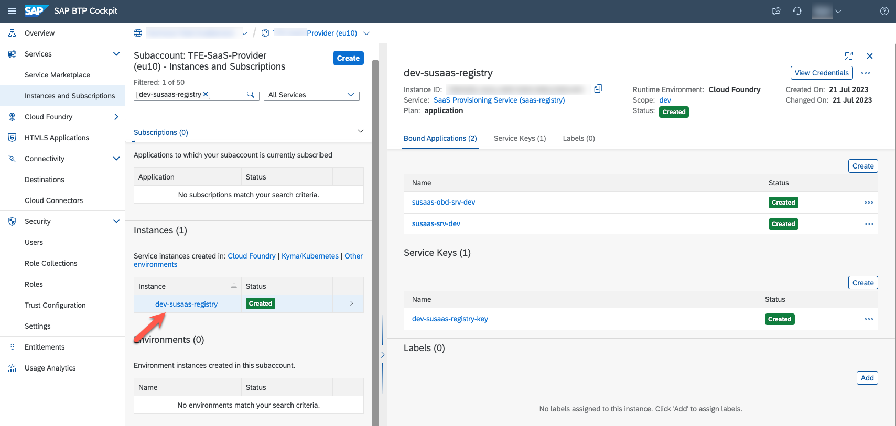](./images/manage_010.png?raw=true)

[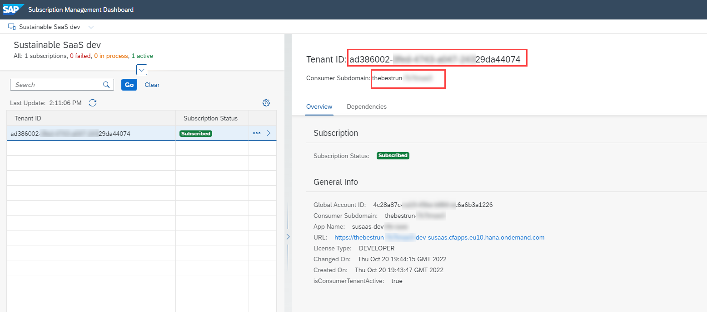](./images/manage_020.png?raw=true)

3.2. Identify the related tenant database container instance within your SaaS Service Manager by checking the labels and comparing it to the tenant ID you identified in the Subscription Management Dashboard. 

[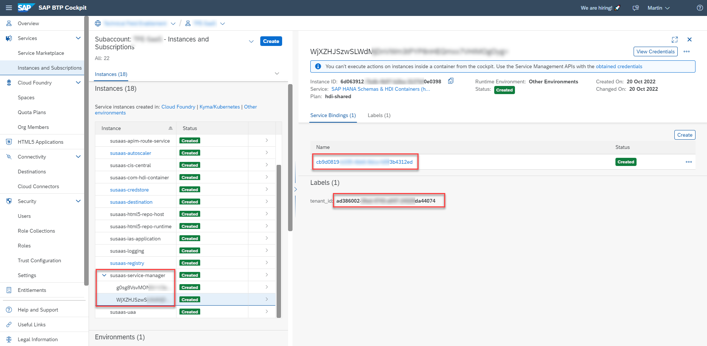](./images/manage_030.png?raw=true)

3.3. Open the existing **Service Binding**, to read the credentials of the tenant database container you want to access. Please note the **host**, **port**, **user** and **password** property. 

> **Hint** - You can see that the **user** property ends with *RT*, which stands for **RunTime** user. The **hdi_user** property ending with *DT* is the so-called **DesignTime** user. 

[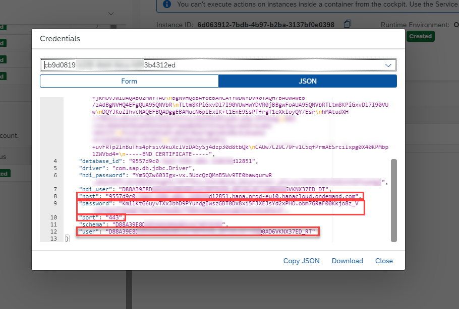](./images/manage_040.png?raw=true)

3.4. Switch to the SAP HANA Database Explorer to add the tenant database container connection.

[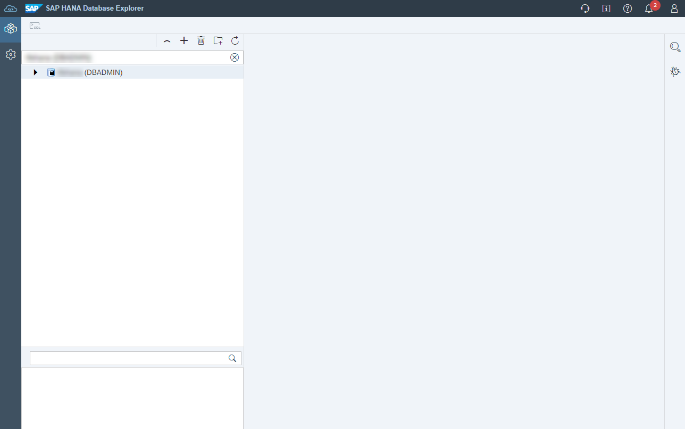](./images/manage_050.png?raw=true)

## 4. Access the tenant database container

4.1. Click the **+** icon to add a new database connection. Select the Instance Type **SAP HANA Database**.

[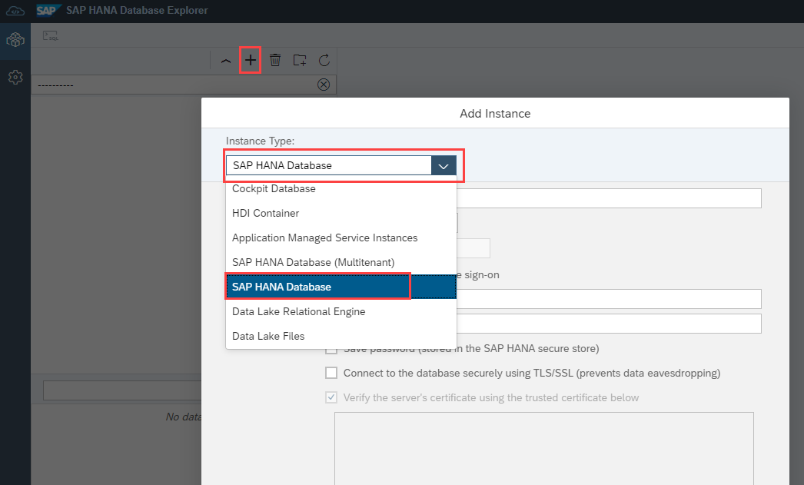](./images/manage_055.png?raw=true)

4.2. Provided the service binding credentials of step 3.3. into the corresponding fields. Enable the SSL-based communication as shown in the screenshot. Click **OK** to add the tenant container/schema to your SAP HANA Database Explorer. 

[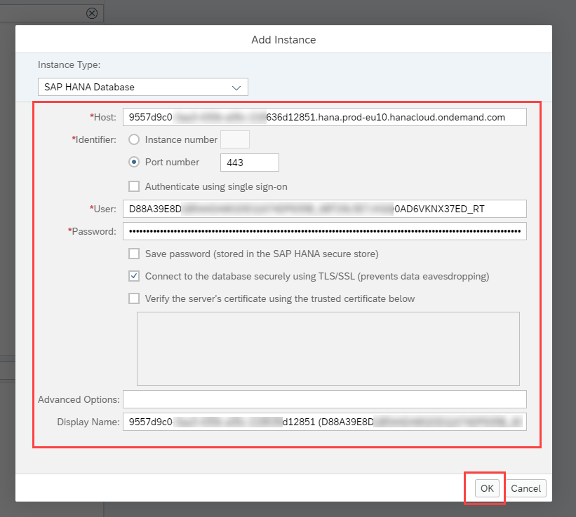](./images/manage_060.png?raw=true)

4.3. Once the container appears in your list of available connections, please switch to the **Tables** section. To see the tables of your tenant database container/schema, please click on the value help icon. 

> **Hint** - Currently you only see tables of the Runtime user's (_RT user) own schema which is empty. Keep in mind, that a database container is nothing different than a collection of database schemas. 

[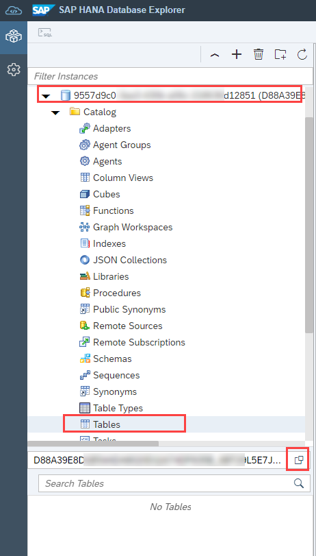](./images/manage_070.png?raw=true)

4.4. Select the two available schemas with randomly generated names, which are the **shared database container schema** and the **tenant database container schema**. Click on **Select** to close the value help.

> **Hint** - You can uncheck the **RT** (Runtime) user's own schema. 

[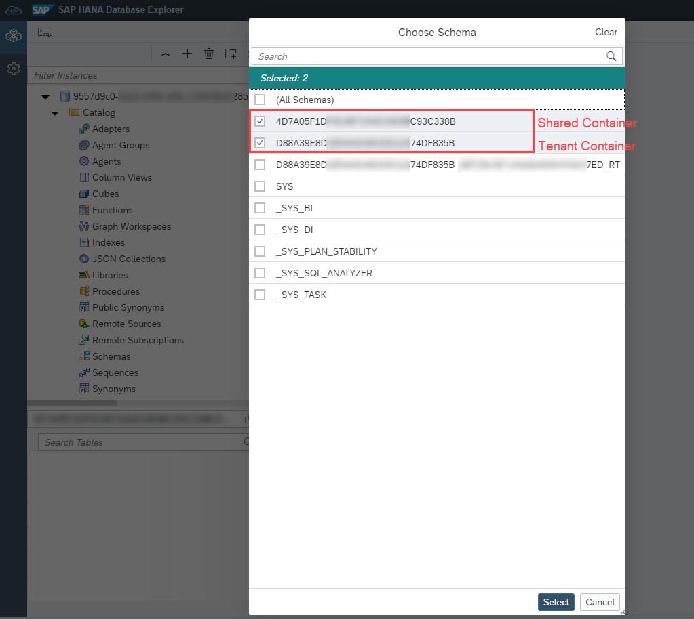](./images/manage_080.png?raw=true)

4.5. You should now have access to all tables in the *shared database container/schema* and the *tenant database container/schema* of the bestrun tenant. You can use SQL commands or available user interface options to view table content, insert/delete/modify records or create and drop schema objects. 

[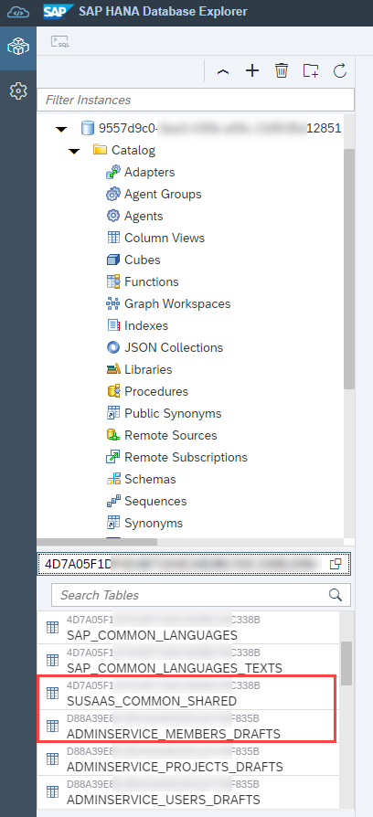](./images/manage_090.png?raw=true)

4.6. An alternative approach to access the tenant database container is displayed in the following screenshots using the Instance Type **Application Managed Service Instance**. Just make sure to select the correct Service Manager instance in the second dropdown.

> **Hint** - Please be aware that you don't have direct access to the corresponding **shared database container/schema objects** using this approach. 

[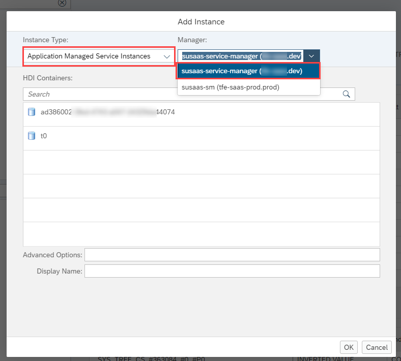](./images/manage_100.png?raw=true)
[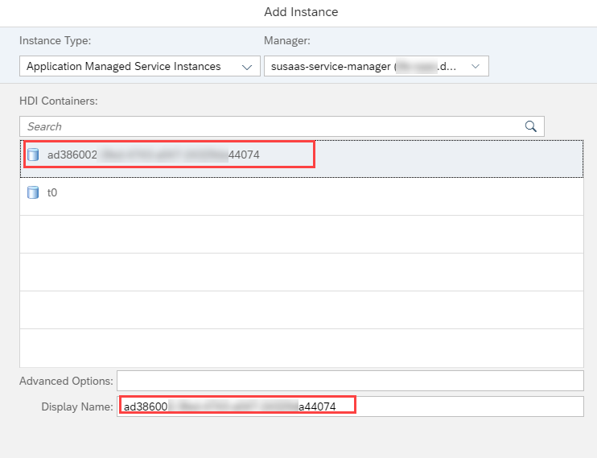](./images/manage_110.png?raw=true)

## 5. Further information

Please use the following links to find further information on the topics above:

* [SAP Help - The Default Access Role for HDI Containers](https://help.sap.com/docs/HANA_CLOUD_DATABASE/b9902c314aef4afb8f7a29bf8c5b37b3/9235c9dd8dbf410f915ffe305296a032.html?locale=en-US)
* [SAP Help - Using the Subscription Management Dashboard](https://help.sap.com/docs/BTP/65de2977205c403bbc107264b8eccf4b/434be695f9e946ccb4c28911dd1e16d0.html?locale=en-US)
* [SAP Blog - The hidden life of ServiceManager handled containers](https://blogs.sap.com/2021/02/15/the-hidden-life-of-servicemanager-handled-containers/)
* [CAP documentation - Deploy as Multitenant SaaS Application](https://cap.cloud.sap/docs/guides/deployment/as-saas#intro--overview)
* [SAP Help - SAP Service Manager Broker Plans](https://help.sap.com/docs/SERVICEMANAGEMENT/09cc82baadc542a688176dce601398de/917a8a7c926444cf99d0230c82db1831.html?locale=en-US&q=container)
