# Self-Registration and Onboarding Automation using Terraform

In this **Expert Feature**, we'll walk you through the process of using the SAP Identity Authentication Service and Terraform to implement a self-registration option and streamline the onboarding of tenant subaccounts.

You can find further expert features, explaining how to use **Terraform** from your own development environment to setup new tenant subaccounts, as well as a tutorial how to use the **SAP BTP Setup Automator** as part of an automated Self-Registration and Onboarding. 

- [Subscriber tenant onboarding using Terraform](../btp-terraform-setup/README.md)
- [Self-Registration, Onboarding Automation and One-Domain Concept](../-Kyma-/saas-self-onboarding/README.md) (Deprecated!)

As the Terraform Provider for SAP BTP is the recommended way forward when it comes to automation scenarios on SAP BTP, we highly suggest to follow along the current tutorial. The SAP BTP Setup Automator should only be used in exceptional cases.  

- [Self-Registration and Onboarding Automation using Terraform](#self-registration-and-onboarding-automation-using-terraform)
  - [1. Prerequisites](#1-prerequisites)
  - [2. Prepare Subaccount](#2-prepare-subaccount)
  - [3. Build components](#3-build-components)
    - [3.1. Cloud Foundry](#31-cloud-foundry)
    - [3.2. Kyma](#32-kyma)
  - [4. Deploy components](#4-deploy-components)
    - [4.1. Cloud Foundry](#41-cloud-foundry)
    - [4.2. Kyma](#42-kyma)
  - [5. Enable Self-Registration](#5-enable-self-registration)
  - [6. Test the Self-Onboarding](#6-test-the-self-onboarding)
  - [7. Self-Offboarding Excursus](#7-self-offboarding-excursus)
  - [8. Good To Know](#8-good-to-know)
    - [8.1. Security Considerations \& Legal requirements](#81-security-considerations--legal-requirements)
    - [8.2. Logging architecture \& Notification mechanisms](#82-logging-architecture--notification-mechanisms)
    - [8.3. Customization](#83-customization)
    - [8.4. Trial Features/Limitations](#84-trial-featureslimitations)
    - [8.5. Undeployment Pitfalls](#85-undeployment-pitfalls)
  - [9. Enhancement Options](#9-enhancement-options)
    - [9.1. Custom Domain](#91-custom-domain)
    - [9.2. Upgrade Feature](#92-upgrade-feature)
    - [9.3. Payment Integration](#93-payment-integration)
    - [9.4. Serverless Implementation](#94-serverless-implementation)
    - [9.5. Multiple Tenants](#95-multiple-tenants)
    - [9.6. Cross-Region Scenarios](#96-cross-region-scenarios)


Below, you'll find the architecture of our Self-Registration and Self-Onboarding scenario, applicable to both SAP BTP, Cloud Foundry Runtime, and SAP BTP, Kyma Runtime.

[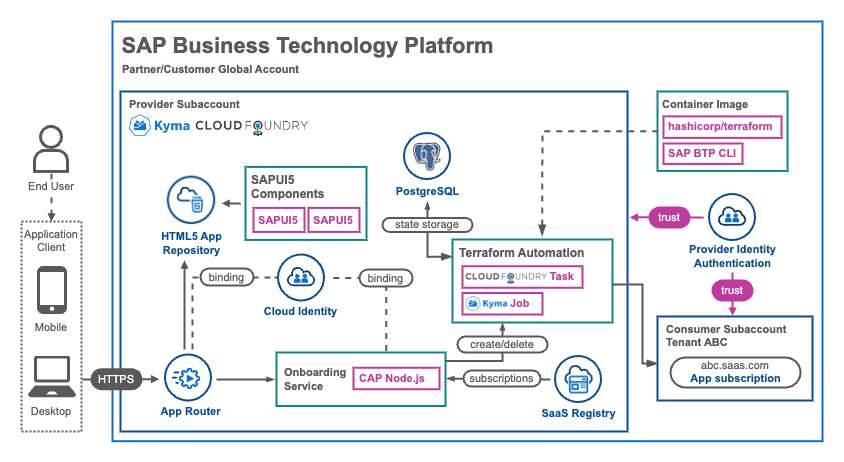](./images/TerraformOnboarding.png?raw=true)

The essence of this scenario lies in leveraging the Cloud Application Programming Model (CAP) and the Application Router, both of which support user authentication via the SAP Identity Authentication Service (IAS). With the SAP IAS self-registration feature, we empower users to register for an account and access a new user-friendly Self-Onboarding interface.

Using the unique User ID contained within the JWT token provided by SAP IAS, we initiate a Subaccount Onboarding process through Terraform. This process can run within a Docker Container as part of a **Cloud Foundry Task**, or a **Kyma Job**. Terraform manages the state of each self-onboarded subaccount in a PostgreSQL database (using the SAP BTP Service Offering), ensuring easy infrastructure teardown or potential enhancements in the future (although this is beyond the scope of this sample).

Our existing multitenant SaaS application's SaaS-Registry service instance plays a vital role in determining whether a user already has a subscription in our environment, preventing redundant subscriptions or subaccount setups for the same self-registered user. In this setup, the self-onboarded subaccount name and subdomain are consistently derived from the User ID of the self-registered user using a hashing approach on the backend.

In cases where different logic is required for handling runtime-specific scenarios, you'll encounter code snippets that check for the existence of the **VCAP_APPLICATION** environment variable, which is specific to Cloud Foundry environments.

```js
if (process.env["VCAP_APPLICATION"]) {
    await cfUtils.initialize();
    await cfUtils.runTask(
      process.env["terraformName"], 
      cmd.replace(/(\r\n|\n|\r)/gm, ""), 
      config.tenant
    );
} else {
    await KymaUtils.runJob(
      cmd.replace(/(\r\n|\n|\r)/gm, ""), 
      config.tenant
    );
}
```

## 1. Prerequisites

To successfully test the Self-Registration and Subaccount Onboarding Automation, your landscape should meet the following requirements:

**General**

- Existing deployment of the Sustainable SaaS application, hosted on either Kyma or Cloud Foundry.
- SAP Identity Authentication Service (IAS) configured as the Central User Management system within your Sustainable SaaS application.

**Cloud Foundry**

- Available memory in your Cloud Foundry environment to accommodate the Onboarding Components.
- Please note that the **free** service plan for the **PostgreSQL** service (used for storing Terraform states) is currently supported only in AWS regions. If you are operating in Azure or Google Cloud Platform environments, you will need to opt for a paid service plan to implement this scenario.
- Ensure that the SAP BTP Global Account Admin user is correctly configured and maintained in the Credential Store of your Sustainable SaaS application, following the guidelines provided.

**Kyma**

- Sufficient capacity within your Kyma Cluster to accommodate the Onboarding Components.
- Please be aware that the required **PostgreSQL** service, both the **free** and paid plans, for storing Terraform states is currently supported exclusively in **AWS** regions such as **eu10** or **us10**.


## 2. Prepare Subaccount

To begin, you'll need to allocate a new entitlement to your Provider subaccount (which will also host the Self-Onboarding components). In order to store the Terraform **state** files - generated by Terraform for each newly onboarded tenant subaccount — the setup necessitates the use of a persistent storage service. In this sample scenario, we've opted for a PostgreSQL database (Free and Trial service plans available!).

Assign a new entitlement for **PostgreSQL, Hyperscaler Option** to your SaaS provider subaccount. Select the appropriate service plan that aligns with your requirements. Please bear in mind:

- For **Kyma** scenarios, only **AWS** regions are currently supported (as of today). In the case of Cloud Foundry, all hyperscalers are supported. However, note that the **free** service plan is exclusively available in **AWS** regions.

- Trial environments offer the **trial** service plan, accessible in AWS, GCP, and Azure.

> **Important Note** - Utilize the **free** service plan for Free Tier scenarios or the **trial** service plan for Trial accounts. For production scenarios, we recommend reviewing the pricing details of alternative service plans in the [Discovery Center](https://discovery-center.cloud.sap/serviceCatalog/postgresql-hyperscaler-option?region=all&tab=service_plan) beforehand.

[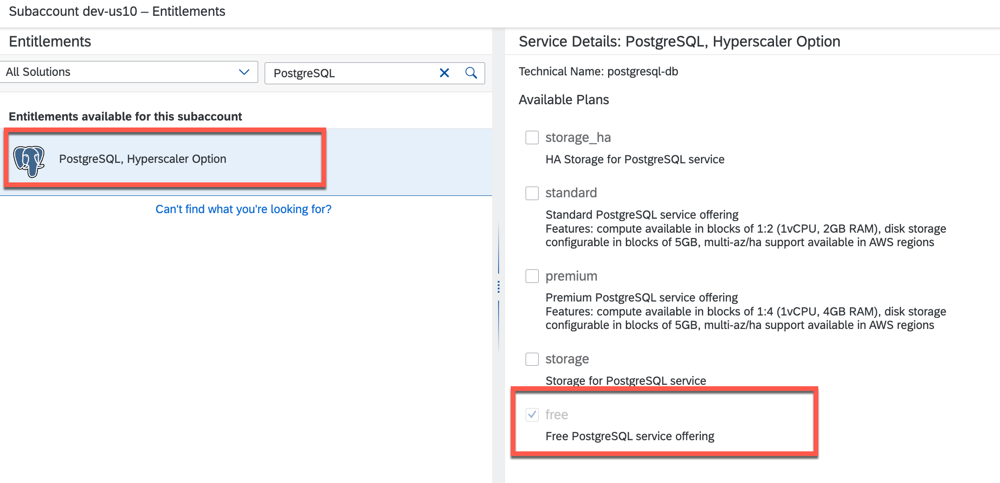](./images/PostgreSQLEntitlement.png?raw=true)

Please note that you are not required to assign a **storage** plan for the **free** and **trial** service plans; this is solely necessary for **paid** service plans.

With these steps complete, you're ready to proceed and build the components of the Onboarding Self-Service.


## 3. Build components

In this scenario, you will utilize a Container Image within a Cloud Foundry Task. This approach necessitates not only the creation of a Multi-Target Application Archive for your Cloud Foundry Deployment but also the building and pushing of a Docker Image.


### 3.1. Cloud Foundry

In this scenario, you will make use of a Container Image running in a Cloud Foundry Task. Therefore, besides creating a Multi-Target Application Archive for your Cloud Foundry Deployment, you also need to build and push a Docker Image. 

3.1.1. To kick things off, begin by either forking and cloning or simply pulling the latest version of this repository.

```sh
git clone https://github.com/SAP-samples/btp-cap-multitenant-saas.git
```

3.1.2. Navigate to the **/files/deploy/cf** directory within this **Expert Feature**. Here, you'll find all the necessary files to build the Cloud Foundry artifacts. 

```sh
cd docu/4-expert/saas-self-onboarding/files/deploy/cf
```

3.1.3. Execute the following npm script to compile the CDS artifacts of the project.

```sh
# Run in ./files/deploy/cf # 

npm run build
```

3.1.4. After the **build** process is complete, it's time to create the Terraform-based Container Image, which handles the Onboarding Automation.

> **Hint** - This Container Image is built upon the official Terraform Container Image and includes an installation of the **SAP BTP CLI**. The SAP BTP CLI empowers you with additional commands, expanding beyond what the latest Terraform Provider offers. You'll find the corresponding **Dockerfile** in the **terraform** directory [(click here)](./files/terraform/Dockerfile). While the Dockerfile uses the latest Terraform Container Image, you can specify a particular SAP BTP CLI version in the Dockerfile if needed.

3.1.5. Before proceeding to build and push the necessary Container Image to your selected Container Registry, it's essential to meet these prerequisites.

> **Hint** - For testing and validation purposes, consider leveraging free offerings while carefully reviewing the license conditions, such as those of Docker Desktop.

- Ensure you have Podman, Docker Desktop, or another Container Management Tool installed in your development environment.
- Have an active account on your chosen Container Registry, which could be DockerHub, GitHub Container Registry, AWS Amazon Elastic Container Registry, or any other.
- Make sure you're authenticated with your Container Registry by executing commands like *docker login* or *podman login*.

3.1.6. Now, it's time to run the following npm script to build your Container Image for the Terraform Onboarding Automation scenario. Be sure to replace the placeholder **IMAGE_PREFIX** with your personalized Docker Image prefix.

> **Hint** - If you're using DockerHub as your Container Registry, use your **username** (e.g., johndoe) as the Container Image Prefix. For those utilizing the GitHub Container Registry, the prefix will resemble **ghcr.io/\<namespace\>** (e.g., ghcr.io/johndoe).

> **Important** - If you're not using Docker Desktop but, for instance, Podman, please to adjust the script in the package.json accordingly.

```sh
# Run in ./files/deploy/cf # 

npx --yes cross-env IMAGE_PREFIX=sap-demo npm run build:terraform
```

3.1.7. Next, execute the following command to push the Container Image to your chosen Container Registry. Don't forget to specify your unique Container Image prefix.

> **Important** - If you're not using Docker Desktop but, for example, Podman, remember to modify the script in the package.json as needed.


```sh
# Run in ./files/deploy/cf # 

npx --yes cross-env IMAGE_PREFIX=sap-demo npm run push:terraform
```

3.1.8. After successfully pushing your Container Image, proceed with the standard Cloud Foundry deployment process. Before deploying the Onboarding Application to your Cloud Foundry Provider Subaccount, take a moment to update the MTA Deployment Extension Descriptor file found in the *mtaext* directory. This file will include your landscape-specific **environment variables** and additional configurations.


### 3.2. Kyma

For Kyma scenarios, follow these steps to build and push the CAP artifacts, the Terraform Container Image, and all other application component Container Images. Below, you'll find a sample of the new Container Images for this scenario hosted on DockerHub.

[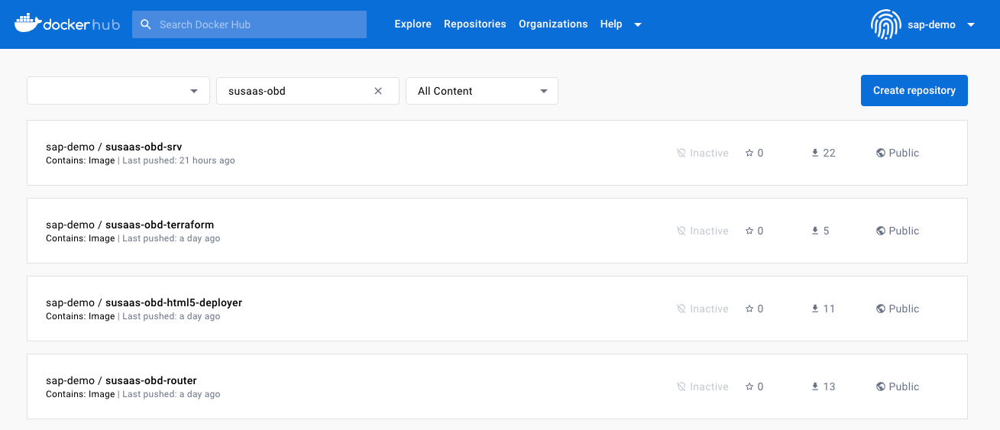](./images/DockerHubImages.png?raw=true)

3.2.1. To get started, begin by (forking and) cloning or simply pulling the latest version of this repository.

```sh
git clone https://github.com/SAP-samples/btp-cap-multitenant-saas.git
```

3.2.2. Navigate to the **/files/deploy/kyma** directory within this **Expert Feature**. This directory contains all the necessary files to build the Kyma artifacts.

```sh
cd docu/4-expert/saas-self-onboarding/files/deploy/kyma
``` 

3.2.3. Execute the following npm script to compile the CAP artifacts necessary for the scenario.

```sh
# Run in ./files/deploy/kyma # 

npm run build
```

3.2.4. To build the SAPUI5 app components, execute the following npm script.

```sh
# Run in ./files/deploy/kyma # 

npm run ui:apps
```

3.2.5. Before proceeding to build and push the required Container Images (Application Router, Onboarding Service, Terraform) to your chosen Container Registry, it's essential to meet these prerequisites.

> **Hint** - For testing and validation purposes, consider leveraging free offerings, while always reviewing the license conditions, such as those of Docker Desktop.

- Ensure you have Podman, Docker Desktop, or another Container Management Tool installed in your development environment.
- Have an active account on your chosen Container Registry, which could be DockerHub, GitHub Container Registry, AWS Amazon Elastic Container Registry, or any other.
- Make sure you're authenticated with your Container Registry by executing commands like *docker login* or *podman login*.


3.2.6. Now, run the following npm script to build your Container Images for this Automation scenario. Be sure to replace the placeholder **IMAGE_PREFIX** with your personalized Docker Image prefix.

> **Hint** - If you're using DockerHub as your Container Registry, use your **username** (e.g., johndoe) as the Container Image Prefix. For those utilizing the GitHub Container Registry, the prefix will resemble **ghcr.io/\<namespace\>** (e.g., ghcr.io/johndoe).

> **Important** - If you're not using Docker Desktop but, for example, Podman, remember to modify the script in the package.json accordingly.

```sh
# Run in ./files/deploy/kyma # 

npx --yes cross-env IMAGE_PREFIX=sap-demo npm run build:all
```

3.2.7. Next, execute the following command to push the Container Images to your chosen Container Registry. Don't forget to specify your unique Container Image prefix.

> **Important** - If you're not using Docker Desktop but, for example, Podman, remember to modify the script in the package.json as needed.

```sh
# Run in ./files/deploy/kyma # 

npx --yes cross-env IMAGE_PREFIX=sap-demo npm run push:all
```

3.2.8. After successfully pushing your Container Images, proceed with the deployment steps for Kyma and make sure to update your **values-private.yaml** file based on your environment. 


## 4. Deploy components

Deployment of the sample scenario to your SAP BTP environment involves distinct steps based on your chosen runtime. Please refer to the relevant subchapter below for detailed instructions.

### 4.1. Cloud Foundry

For Cloud Foundry deployment, it's essential to provide specific environment variables through a Multitarget Descriptor Extension File.

4.1.1. Navigate to the **/files/deploy/cf/mtaext** directory within this **Expert Feature**. Here, you'll find the Multi-Target Application Extension Descriptor files, which allow you to furnish environment-specific details for your deployment.

4.1.2. Depending on your SAP BTP landscape (CPEA and PAYG or Trial), choose the appropriate **mtaext** file and remove the **sample** filename suffix. However, keep the **private** suffix to ensure that your configuration details remain confidential and are not inadvertently committed to GitHub.

4.1.3. While we recommend using the existing Credential Store instance for SAP BTP Global Admin credentials, you do have the option to provide them as environment variables. In this case, remember to disable the Credential store instance in your **mtaext** file accordingly.

```yaml
resources:
  - name: susaas-credstore
    active: false
```

4.1.4. Now, let's update the environment variables as described below.

- **CF_LOGIN_HINT (optional)**: 
  
  This is required if you want to use a specific Identity Provider to authenticate with the Cloud Foundry API during your Terraform Automation. You can find the respective value in the **Trust Configuration** of your Global Account. This is especially crucial for **technical user** scenarios, recommended over using a named user and the SAP ID Service

  [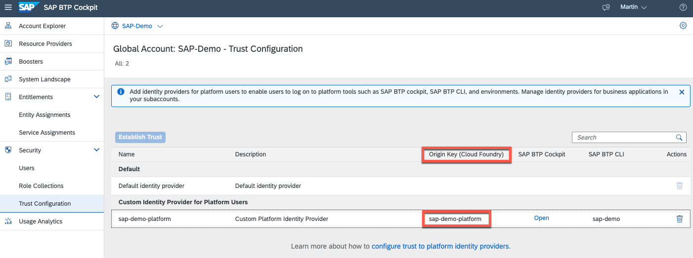](./images/CfLoginCustomIdp.png?raw=true)

- **OBD_APP_NAME (mandatory)** 
  
  This is the name of the SaaS application to be automated by the Self-Onboarding process. You can find it in the list of available services, with the syntax as follows (Cloud Foundry - **AppName**-Space-Org / Kyma - **AppName**-Namespace-Shootname).
  
  > **Important** - Only use the **AppName** suffix (e.g., **susaas** for default deployments) and exclude Space, Namespace, Org, or Shootname.

    [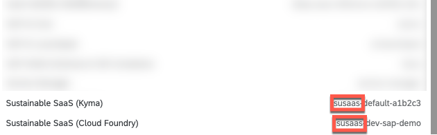](./images/SaasAppName.png?raw=true)

- **OBD_APPLICATION_IDP (mandatory)** 
  
  Provide the hostname (**without https://**) of the SAP Identity Authentication Instance used for Central User Management in your SaaS application and configured as a Trusted Identity Provider in the Provider Subaccount. This SAP IAS instance will also serve as the Custom Application Identity Provider in the Self-Onboarded Subaccount.

- **OBD_GLOBACCT (mandatory)**
  
  The Global Account Subdomain, available in your SAP BTP Cockpit **Global Account** Account Explorer View.

- **OBD_PLATFORM_IDP (optional)** 
  
  You can provide the hostname (**without https://**) of a Platform Identity Provider if you manage your SAP BTP Platform Roles using this Platform Identity Provider. If you configure additional **Subaccount Admins** with this environment variable, they will be assigned to the respective Platform Identity Provider instead of the default SAP ID Service. The same applies if you enable the **Viewer Role** assignment using the respective variable.

- **OBD_ORG (mandatory)** 
  
  This is the **subdomain** of your Cloud Foundry Organization, where your SaaS application is hosted.

- **OBD_PARENT_DIR (optional)** 
  
  You have the option to provide the **Directory ID** of an existing SAP BTP Directory if you wish to organize new subaccounts within a dedicated directory. Otherwise, subaccounts will be created at the root level of your Global Account.
 
- **OBD_REGION (mandatory)** 
  
  Provide the SAP BTP **Region** of the Subaccount in which your SaaS application resides. 
  
  > **Important** - Only specify the **main** region such as **eu10** or **us10** and do not specify the **extension** landscapes such as **eu10-004**. 
 
- **OBD_SPACE (mandatory)** 
  
  Specify the name of the **Cloud Foundry Space** where your SaaS application operates.

- **OBD_SAAS_ADMINS (optional)** 
  
  Here, you can include additional users who will be granted the **Susaas Administrator** role during the onboarding process. The user initiating self-onboarding will automatically receive this role.

- **OBD_SUBACCOUNT_ADMINS (optional)**
  
  Provide additional users to be assigned the **Subaccount Administrator** role during onboarding. The technical user used by Terraform for onboarding will also receive this role automatically.

  > **Important** - If you configured the **OBD_PLATFORM_IDP** environment variable, these users will be created within the context of the configured Platform Identity Provider, rather than the default SAP ID Service.

- **OBD_VIEWER_ROLE (optional)** 
  
  Enable this option if you want to assign the **Subaccount Viewer** permission to all SaaS Administrators. This includes the user initiating self-onboarding and any users configured in the **OBD_SAAS_ADMINS** environment variable.

  > **Important** - If you configured the **OBD_PLATFORM_IDP** environment variable, it's important to note that users will be created within the context of the configured Platform Identity Provider, rather than the default SAP ID Service. To ensure smooth operation, please consider the following. Make sure to use the same Identity Provider for both the Platform Identity Provider (Platform IdP) and Custom Application Identity Provider (Custom App IdP) if you have set up custom identity providers.Alternatively, if you decide to use different Identity Providers, ensure that you create the respective users in the Platform IdP. This ensures that users are correctly associated with the Platform Identity Provider and can access the resources they need within that context.


Further Optional Environment variables:

- OBD_API_NAME : Name of the API Service Instance (default - susaas-api)
- OBD_API_PLAN : Service plan of the API Service Instance (default - trial)
- OBD_APP_PLAN : Service Plan of the SaaS Subscription (default - trial)

If SAP Credential Store Service is not supposed to be used (! Not suggested !):

- BTP_ADMIN_USER : SAP BTP Global Account Admin User e-mail
- BTP_ADMIN_PASSWORD : SAP BTP Global Account Admin User password


4.1.5. Last but not least, it's essential to update the **docker.image** property of the **susaas-obd-terraform** module within the same **mtaext** file with your specific Container Image details.

> **Hint** - Your entry will resemble something like **sap-demo/susaas-obd-terraform:latest** if you're using DockerHub. If you're utilizing the GitHub Container Registry, it will take the form of **ghcr.io/sap-demo/susaas-obd-terraform:latest**.

> **Important** - If you're using a Container Registry that necessitates a secret to access your images, please consult the Cloud Foundry documentation ([here](https://docs.cloudfoundry.org/devguide/deploy-apps/push-docker.html)) for further details. Additional parameters, like a **username** and **password** property, might be necessary!
> 
> ```yaml
>   - name: susaas-obd-terraform
>     parameters:
>       docker:
>         image: sap-demo/susaas-obd-terraform:latest
>         username: sap-demo
>         password: dckr_pat_TuxVUhag...
> ```
> 
> **Important** - Always exercise caution to avoid committing any sensitive credentials to GitHub!

4.1.6. Alright, once you've configured all the settings and environment variables, execute the following npm script to deploy the application to your **Cloud Foundry** environment.

> **Important** - Ensure that you are signed into the correct Cloud Foundry Space where your SaaS application is hosted. You can confirm this using ```cf t``` or sign in to a new Org/Space using ```cf login```.

```sh
# Run in ./files/deploy/cf # 

# Free Tier 
npm run deploy

# Trial
npm run deploy:trial
```

4.1.7. After the deployment process is complete, you can access the new **Home** and **Self-On/-Offboarding** pages by using the URL of the deployed **Application Router**.

> **Hint** - For a more appealing touch, consider utilizing a Custom Domain for your application, such as **saas-sap-demo.com**.

[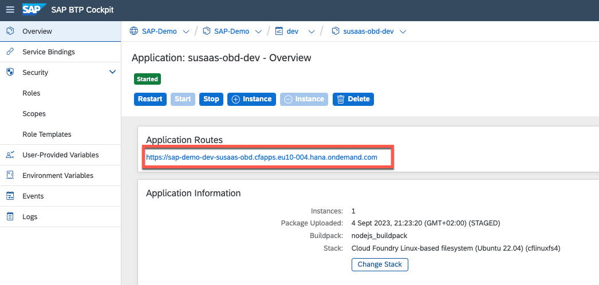](./images/CfObdRouterUrl.png?raw=true)


### 4.2. Kyma

In Kyma, configuring your **values-private.yaml** file requires a few additional details compared to a Cloud Foundry deployment. Follow these steps carefully to ensure a correct setup.

4.2.1. Navigate back to the **/files/deploy/kyma** directory of this **Expert Feature**.

4.2.2. Duplicate the existing **values-private.sample.yaml** file and remove the *sample* filename suffix. The *private* suffix is essential to safeguard your configuration details from unintentional exposure on GitHub.

4.2.3. For **Trial environments**, ensure that you update the service plan of the **postgres** service instance by removing the associated comment ('#').

```yaml
postgresql_db:
  servicePlanName: trial
```

4.2.4. To enable communication between your Kyma Cluster and the PostgreSQL instance, you need to run the provided Shell script, which will determine the egress IP addresses of your Cluster. If you encounter permission errors while trying to execute the file on Mac or Linux, make sure to assign execute permissions to your user.

> **Hint** - You can also find these scripts in the following GitHub repository: [Kyma Runtime Extension Samples](https://github.com/SAP-samples/kyma-runtime-extension-samples/tree/main/get-egress-ips).

```sh
# Run in ./deploy/kyma # 

# Mac / Linux #
sh ./get-egress-ips.sh

# Windows - PowerShell #
get-egress-ips.ps1
```

4.2.6. Now, you need to add the retrieved IP addresses to the PostgreSQL service instance details in your **values-private.yaml** file as **allow_access** values (comma separated).

```yaml
postgresql_db:
  # servicePlanName: trial
  parameters:
    allow_access: 12.345.678.90,09.876.543.21,12.345.678.90
```

4.2.7. Now, it's time to update the names (or precisely the prefix) of the Container Images fetched by **helm** during deployment. This process should be familiar to you from the deployment of the SaaS solution itself.

> **Hint** - If you use DockerHub as a Container Registry, please use your **username** (e.g., johndoe) as the Container Image Prefix placeholder. If you use the GitHub Container Registry, the prefix will look similar to **ghcr.io/\<namespace\>** (e.g., ghcr.io/johndoe).

```yaml
image:
    repository: sap-demo/susaas-obd-router
    tag: latest
...
image:
    repository: sap-demo/susaas-obd-srv
    tag: latest
...
html5_apps_deployer:
  image:
    repository: sap-demo/susaas-obd-html5-deployer
    tag: latest
```

4.2.8. Now, it's time to update the global values based on your Kyma instance details. This process should be familiar to you from the deployment of the SaaS solution itself, and you can copy the values used in that scenario. Find the details on how to retrieve those values in the respective chapter ([click here](../../2-basic/3-kyma-deploy-application/README.md)).


> **Hint** - Only provide an `imagePullSecret` if your Container Images are not publicly accessible. This secret must be created in your Kyma Cluster in advance and will also be used to fetch the Terraform Container Image when setting up a new Job in Kyma. Check out the following Blog Post ([click here](https://blogs.sap.com/2022/12/04/sap-btp-kyma-kubernetes-how-to-pull-from-private-repository/)) to learn how to create the necessary Image Pull Secret.
 

```yaml
global:
  imagePullSecret: 
    - name: image-pull-secret
  domain: a1b2c3.kyma.ondemand.com 
  shootName: a1b2c3 
```

4.2.9. Double-check the **SaaS Registry** binding of your **srv** configuration. The `serviceInstanceFullname` property should resemble the **SaaS Registry** service instance name of your Sustainable SaaS application. If you deployed the Sustainable SaaS solution using a different Release Name, please update the property accordingly (e.g., `susaas-dev-saas-registry`).


```yaml
bindings:
    saas-registry:
        serviceInstanceFullname: susaas-saas-registry
```

4.2.10. Please update the environment variables of the **srv** module as described below.

- **OBD_APP_NAME (mandatory)**
  
  This is the name of the SaaS application to be automated by the Self-Onboarding process. You can find it in the list of available services, with the syntax as follows (Cloud Foundry - **AppName**-Space-Org / Kyma - **AppName**-Namespace-Shootname).
  
  > **Important** - Only use the **AppName** suffix (e.g., **susaas** for default deployments) and exclude Space, Namespace, Org, or Shootname.  

    [](./images/SaasAppName.png?raw=true)

- **OBD_APPLICATION_IDP (mandatory)** 
  
  Provide the hostname (**without https://**) of the SAP Identity Authentication Instance used for Central User Management in your SaaS application and configured as a Trusted Identity Provider in the Provider Subaccount. This SAP IAS instance will also serve as the Custom Application Identity Provider in the Self-Onboarded Subaccount.

- **OBD_GLOBACCT (mandatory)**
  
  The Global Account Subdomain, available in your SAP BTP Cockpit **Global Account** Account Explorer View.

- **OBD_PLATFORM_IDP (optional)** 
  
  You can provide the hostname (**without https://**) of a Platform Identity Provider if you manage your SAP BTP Platform Roles using this Platform Identity Provider. If you configure additional **Subaccount Admins** with this environment variable, they will be assigned to the respective Platform Identity Provider instead of the default SAP ID Service. The same applies if you enable the **Viewer Role** assignment using the respective variable.

- **OBD_SHOOTNAME (mandatory)** 
  
  This is the **Shootname** of the Kyma Cluster where your SaaS application is hosted.

- **OBD_PARENT_DIR (optional)** 
  
  You have the option to provide the **Directory ID** of an existing SAP BTP Directory if you wish to organize new subaccounts within a dedicated directory. Otherwise, subaccounts will be created at the root level of your Global Account.

- **OBD_REGION (mandatory)** 
  
  Provide the SAP BTP **Region** of the Subaccount in which your SaaS application resides. 
  
  > **Important** - Only specify the **main** region such as **eu10** or **us10** and do not specify the **extension** landscapes such as **eu10-004**. 
 
- **OBD_NAMESPACE (mandatory)** 
  
  Specify the name of the **Kyma Namespace** where your SaaS application operates.

- **OBD_SAAS_ADMINS (optional)** 
  
  Here, you can include additional users who will be granted the **Susaas Administrator** role during the onboarding process. The user initiating self-onboarding will automatically receive this role.

- **OBD_SUBACCOUNT_ADMINS (optional)**
  
  Provide additional users to be assigned the **Subaccount Administrator** role during onboarding. The technical user used by Terraform for onboarding will also receive this role automatically.

  > **Important** - If you configured the **OBD_PLATFORM_IDP** environment variable, these users will be created within the context of the configured Platform Identity Provider, rather than the default SAP ID Service.

- **OBD_VIEWER_ROLE (optional)** 
  
  Enable this option if you want to assign the **Subaccount Viewer** permission to all SaaS Administrators. This includes the user initiating self-onboarding and any users configured in the **OBD_SAAS_ADMINS** environment variable.

  > **Important** - If you configured the **OBD_PLATFORM_IDP** environment variable, it's important to note that users will be created within the context of the configured Platform Identity Provider, rather than the default SAP ID Service. To ensure smooth operation, please consider the following. Make sure to use the same Identity Provider for both the Platform Identity Provider (Platform IdP) and Custom Application Identity Provider (Custom App IdP) if you have set up custom identity providers.Alternatively, if you decide to use different Identity Providers, ensure that you create the respective users in the Platform IdP. This ensures that users are correctly associated with the Platform Identity Provider and can access the resources they need within that context.

- **OBD_TERRAFORM_IMAGE (mandatory)** 
  
  Provide the name of your Terraform image, which is based on your Container Image prefix and has been build in one of the previous steps and should look similar to the following format \<Container Image Prefix\>/susaas-obd-terraform (e.g., sap-demo/susaas-obd-terraform).

  > **Hint** - If you use DockerHub as a Container Registry, please put in your **username** (e.g., johndoe) as Container Image Prefix placeholder. If you use the GitHub Container Registry, the prefix will look similar to **ghcr.io/\<namespace>** (e.g. ghcr.io/johndoe). 

 

Further optional **environment variables**:

- OBD_API_NAME : Name of the API Service Instance (default - susaas-api)
- OBD_API_PLAN : Service plan of the API Service Instance (default - trial)
- OBD_APP_PLAN : Service Plan of the SaaS Subscription (default - trial)

4.2.11. Now that you've configured all the necessary settings and environment variables, it's time to deploy the application to your **Kyma Cluster**. Make sure you're deploying the Onboarding application to the same namespace where your SaaS deployment resides.

> **Important** - While you do have the option to include the username and password of your SAP BTP Global Account Administrator in your `values-private.yaml` file, we recommend providing these credentials during the `helm install` command. This way, they will be securely stored in a **Kyma Secret** upon deployment.

```sh
# Run in ./files/deploy/kyma # 

helm install <ReleaseName> ./charts -f ./charts/values-private.yaml -n <Namespace> \
  --set global.btpadmin.username=<SAPBTPGlobalAdminEmail> \
  --set global.btpadmin.password=<SAPBTPGlobalAdminPassword> \

# Example #
helm install susaas-onboarding ./charts -f ./charts/values-private.yaml -n default \
  --set global.btpadmin.username=terraform@sap-demo.com \
  --set global.btpadmin.password=SuperSafePassword 
```

4.2.12. And that's all there is to it! Once the deployment process is complete, you can access the new **Home** and **Self-On/-Offboarding** pages by using the URL of the deployed **Application Router**.

> **Hint** - If you want to give your application a more professional touch, consider setting up a Custom Domain like **saasapp.com**..  

[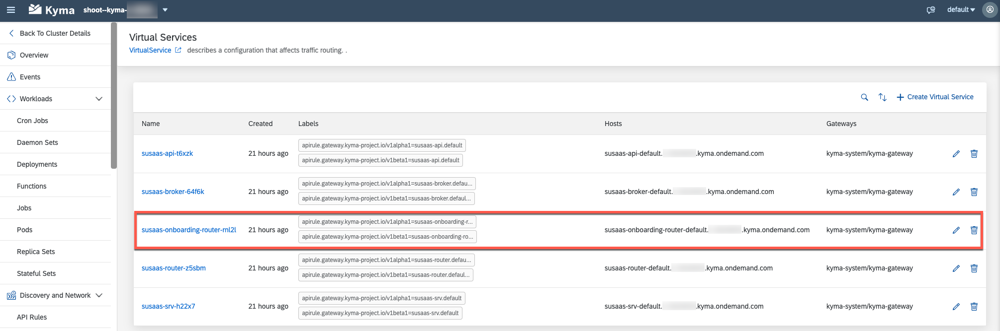](./images/KymaObdRouterUrl.png?raw=true)


## 5. Enable Self-Registration

Once the Self-Onboarding components have been successfully deployed to Kyma or Cloud Foundry, the next step is to enable self-registration in SAP Identity Authentication Service (IAS). While an application registration can be automatically created based on a SAP BTP Service Instance, the setting for enabling self-registration needs to be manually enabled by a SAP IAS Administrator.

5.1. Open the Administration UI of your SAP Identity Authentication Service tenant.

> **Hint** - Usually you can reach the Administration UI of your tenant following the **https://\<SUBDOMAIN>.accounts.ondemand.com/admin** pattern.
> 
> Example - https://<span>sap-demo.accounts.ondemand.com/admin

5.2. Open the **Applications** menu. 

[](./images/OBD_EnableReg00.png?raw=true)

5.3. Search for the new **SaaS Onboarding** application and switch to the **Authentication and Access** tab. Select the **User Application Access** settings. 

[](./images/OBD_EnableReg01.png?raw=true)

5.4. Change the settings to **Public**, to allow self-registration for the application and **save** your changes!

[](./images/OBD_EnableReg02.png?raw=true)

> **Important** - From now on, users can self-register for your application! Therefore, please ensure to enable the **E-Mail Verification**, apply a secure **Password Policy** and consider a **Risk-Based Authentication**. All of these settings can be configured in SAP Identity Authentication Service.
>
> In case you do not want a **self-registration**-based user management, you can also import users for your application, and invite them via email to setup an account in SAP Identity Authentication Service ([click here](https://help.sap.com/docs/identity-authentication/identity-authentication/import-or-update-users-for-specific-application)). 


## 6. Test the Self-Onboarding

In this chapter you will learn how use the recently deployed components to onboard a new Subscriber Subaccount. 

6.1. Open the new **Home** user interface of your Self-Onboarding application, by loading the URL of your **Application Router** in your browser. 

6.2. Click on **Login or Register** in the center of the **Home** screen. 

[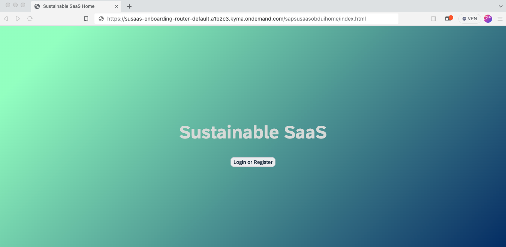](./images/SelfSubscrTutorial_01.png?raw=true)

6.3. Click on **Register** to create a new SAP Identity Authentication Service user account. 

[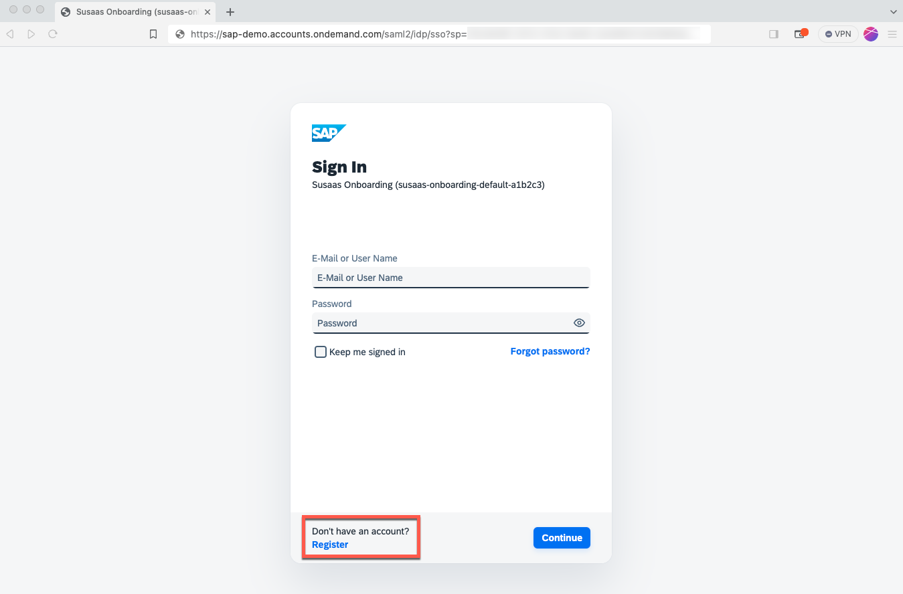](./images/SelfSubscrTutorial_02.png?raw=true)

6.4. Provide some basic infos about your user including a valid e-mail address and click on **Continue**. 

[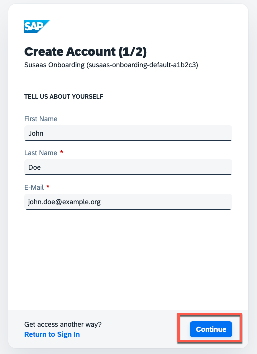](./images/SelfSubscrTutorial_03.png?raw=true)

6.5. Set a new initial password for your new user and click on **Register**. 

[](./images/SelfSubscrTutorial_04.png?raw=true)

6.6. You should see the following screen informing you about a confirmation e-mail being send to your inbox. 

[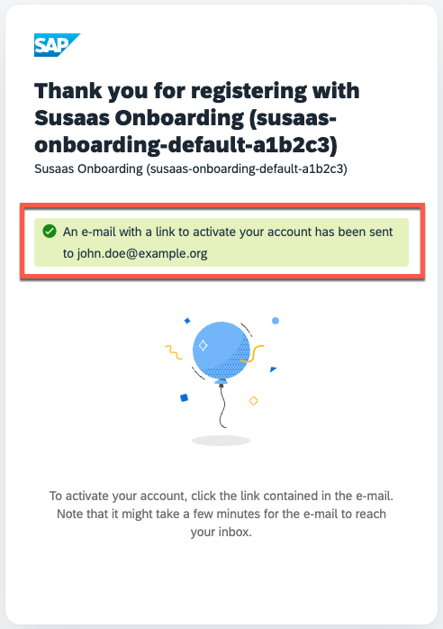](./images/SelfSubscrTutorial_05.png?raw=true)

6.7. Confirming the e-mail address will redirect you to the login screen again. Please enter your e-mail and initial password and click on **Continue**. You might need to change your password upon initial login. 

[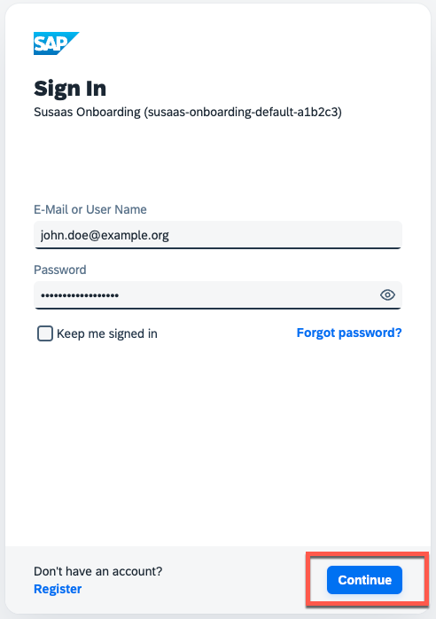](./images/SelfSubscrTutorial_06.png?raw=true)

6.8. Once the **Self-Onboarding** screen has loaded, please click on **Trigger Onboarding** to start the Onboarding process. 

[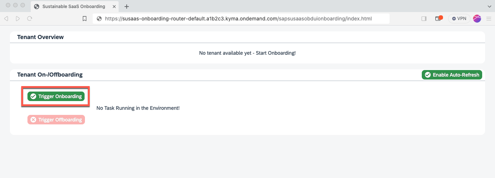](./images/SelfSubscrTutorial_07.png?raw=true)

6.9. Once you triggered the Onboarding process, the data model will be reloaded every five seconds to refresh the status. You can disable the automatic-refresh clicking on the respective toggle button.

[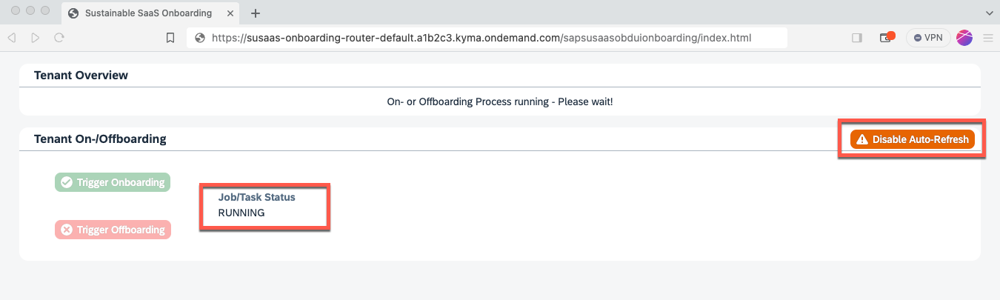](./images/SelfSubscrTutorial_08.png?raw=true)

6.10. Depending on your runtime, either a new Job will be started in the **Kyma** environment or a new task will be triggered in the **Cloud Foundry** environment. 

**Kyma**

[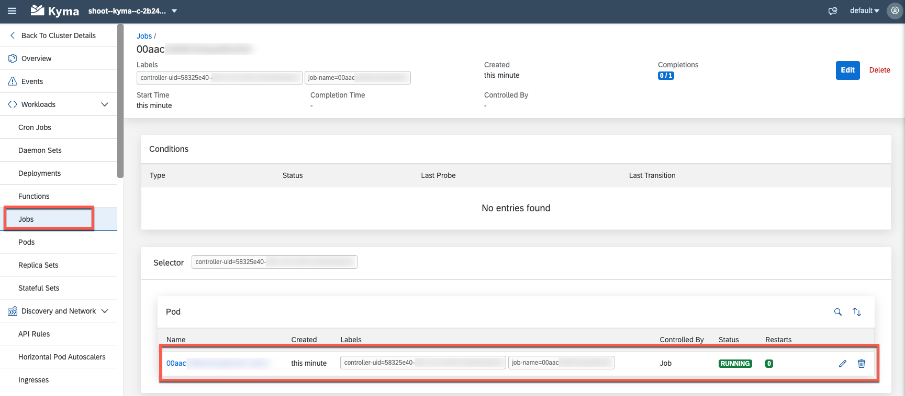](./images/SelfSubscrTutorial_09.png?raw=true)

**Cloud Foundry**

[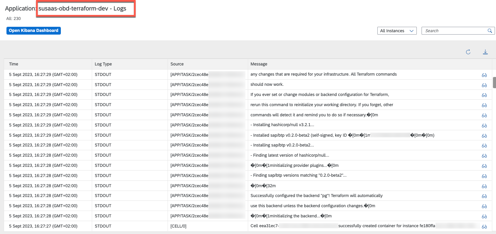](./images/SelfSubscrTutorial_09CF1.png?raw=true)


6.11. In that Job/Task, you can now see that Terraform is setting up the new subaccount for the user who started the self-onboarding process. 

**Kyma**

[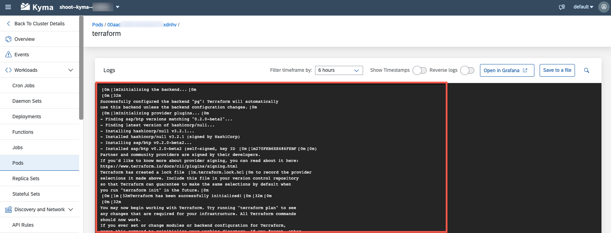](./images/SelfSubscrTutorial_10.png?raw=true)

**Cloud Foundry**

[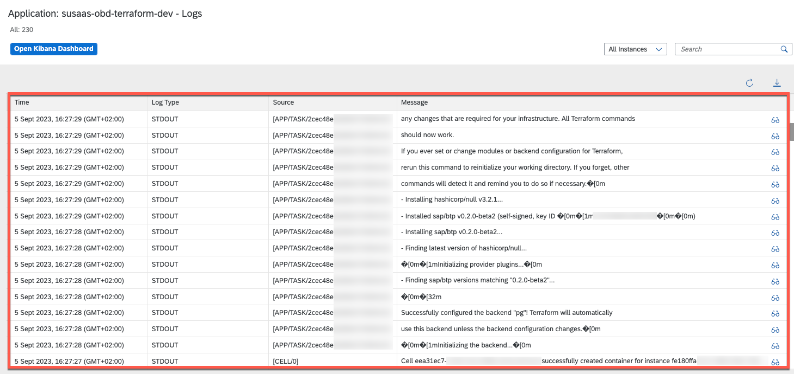](./images/SelfSubscrTutorial_09CF2.png?raw=true)

6.12. Once the Job/Task finished and the Self-Onboarded Subaccount is available, you can click on **Tenant Access** to access the new Subaccount. You can **Disable** the **Auto-Reload** again by clicking on the **Toggle Button**. 

[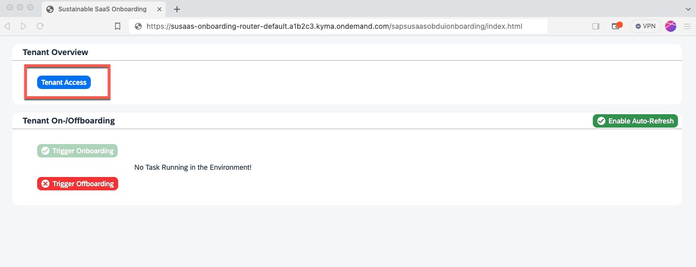](./images/SelfSubscrTutorial_11.png?raw=true)

6.13. You will be redirected to the login page of your Self-Onboarded subaccount, which should forward you to the Mock Launchpad of the well-known Sustainable SaaS application using Single-Sign-On.  

[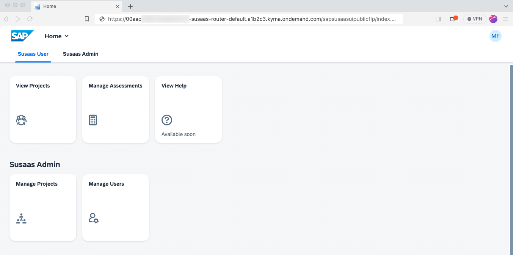](./images/SelfSubscrTutorial_12.png?raw=true)

6.14. Let us have a look behind the scenes of what has been setup on the SAP BTP side. First of all, you can see that a new Subaccount has been created. The Subaccount Name and Subdomain are derived from the SAP IAS SCIM ID of the user triggering the Self-Onboarding process. 

[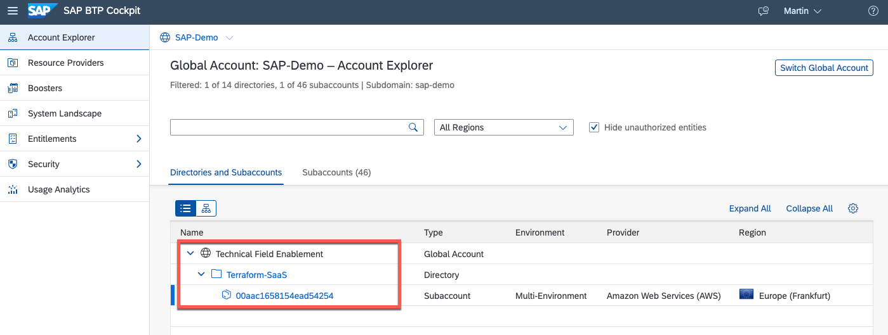](./images/SelfSubscrTutorial_13.png?raw=true)

6.15. The new Self-Onboarded Subaccount will contain a new Sustainable SaaS application subscription, as well as an API Service instance including a default Service Key which can be used by the Subscriber to authenticate against the SaaS API. 

[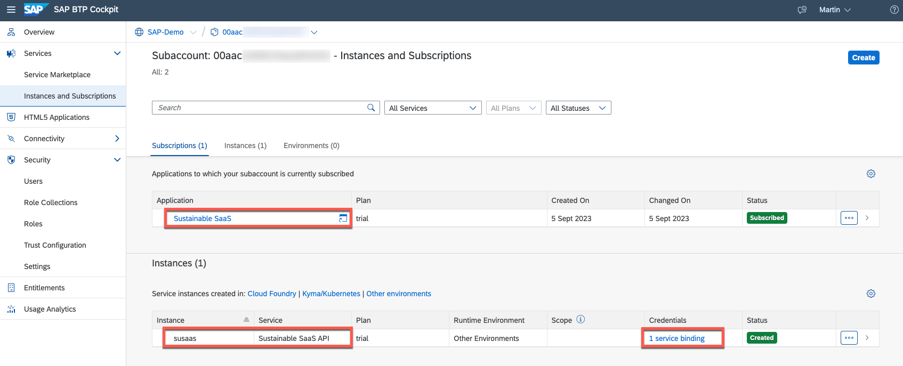](./images/SelfSubscrTutorial_14.png?raw=true)

6.16. In the Trust Configuration of the Self-Onboarded Subaccount you can see that a new Custom Application Identity Provider has been added. In fact, this is the same SAP Identity Authentication Service instance also used for the Self-Registration process, allowing the actual Single-Sign-On process described above. 

[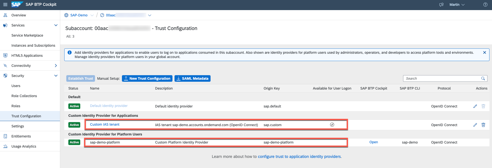](./images/SelfSubscrTutorial_15.png?raw=true)

6.17. In the Users Overview, you can see multiple users depending on your setup. You will see the user used by Terraform, being added as **Subaccount Admin**. The Self-Registered User triggering the Onboarding process will be added as SaaS Application Administrator and Subaccount Viewer (if configured). Additionally, further Subaccount or SaaS Application Admins (if configured in the environment variables) should be visible in the Users list. 

[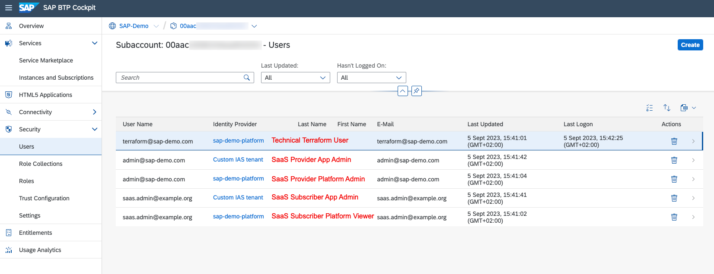](./images/SelfSubscrTutorial_16.png?raw=true)


## 7. Self-Offboarding Excursus

Similar to the Self-Onboarding process, you can also initiate a Self-Offboarding process from the respective interface. Simply click on the **Trigger Offboarding** button once the new Subaccount has been successfully set up. The Offboarding process will then be initiated by **Terraform**. 

[](./images/SelfOffboarding.png?raw=true)

Terraform will fetch the current state of the Subaccount to be offboarded from the PostgreSQL service instance and run a `terraform destroy` command to remove all created resources in the correct order before removing the whole subaccount. 


## 8. Good To Know

This section provides valuable insights into setting up Self-Registration for your SAP BTP SaaS application, covering security and legal considerations.

### 8.1. Security Considerations & Legal requirements

In a real-world scenario, it's crucial to properly validate users who register for your SaaS application. Consider implementing email and/or SMS verification for registrants and potentially introducing an **IP/email domain** filter. Without such measures, you risk bot or attacker registrations that could inundate your environment with self-registered tenants. Another layer of security to identify genuine users could involve requiring a **credit card** during the sign-up process. While it's challenging to completely prevent your SaaS application from being misused by bots, these measures can mitigate the risk to some extent.

> **Hint** - If **public** self-registration is not essential, it's advisable to either avoid it or implement stringent security measures. Additionally, consider strictly limiting the workload capacity of **trial** subscriptions!

Ensure compliance with legal requirements, such as including a **legal notice** or any other necessary information in accordance with your country's regulations when offering a public homepage. The same applies to self-registration options, which may necessitate [**Terms of Use**](https://help.sap.com/docs/identity-authentication/identity-authentication/configuring-terms-of-use) and/or a [**Privacy Policy**](https://help.sap.com/docs/identity-authentication/identity-authentication/configuring-privacy-policies).


### 8.2. Logging architecture & Notification mechanisms

Consider implementing advanced logging mechanisms, especially since your SaaS application may be publicly facing. It's essential to remain aware of the activities occurring within your cluster. Implement robust logging practices to effectively monitor and track events.

Ensure you have a proper notification mechanism for your self-registration and onboarding process. This is crucial for staying informed about onboarding errors or any unusual onboarding processes. We recommend using the [SAP BTP Alert Notification Service](https://discovery-center.cloud.sap/serviceCatalog/alert-notification) or exploring email setup options through hyperscaler services like Office 365 or AWS SES. You can find a sample of how to integrate Office 365 into a CAP application in the Expert Features section.


### 8.3. Customization

SAP IAS offers a multitude of customization options that enable you to modify the registration or login page, as well as the email templates used for self-registration user validation. Explore the documentation and provide your customers with an experience that aligns with your company's style guide! For more information, please refer to the official SAP Help Documentation ([click here](https://help.sap.com/docs/identity-authentication/identity-authentication/configuring-applications) or [click here](https://help.sap.com/docs/identity-authentication/identity-authentication/configuring-email-templates)).


### 8.4. Trial Features/Limitations

At present, this sample application does not incorporate a mechanism to limit the functionality of self-registered trial tenants. In a production environment, it's advisable to consider implementing restrictions for these free/trial tenants. Otherwise, you run the risk of potential misuse or spam from individuals with malicious intent using your trial service offering.


### 8.5. Undeployment Pitfalls

It is of utmost importance to maintain a record of the created Subscriber tenants and verify that all tenants have been successfully removed before undeploying the entire SaaS solution from your Kyma Cluster. Failing to do so can lead to a compromised state of your SaaS application, where certain services like XSUAA or SaaS-Registry cannot be deleted without additional complications.


## 9. Enhancement Options

Below, you will find some ideas for potential enhancements in the given scenario.

### 9.1. Custom Domain

Utilize a Custom Domain in Cloud Foundry or Kyma to provide your SaaS customers with a proper domain for the **Home** Page and the respective **Tenant** Subaccounts, such as **saasapp.com** (Home Page) and **abc.saasapp.com** (Sample Tenant Subdomain). By leveraging the Custom Domain Service in Cloud Foundry or Kyma's standard features, you can create URL mappings for your Subscriber Subaccounts (e.g., abcdefgh123456.saasapp.com -> abc.saasapp.com).


### 9.2. Upgrade Feature

Offer self-onboarded tenants a **trial** plan for your application, and include an option on the **Onboarding** screen to easily **upgrade** to a paid plan. This process can also be automated using Terraform, facilitating updates to the corresponding service plan.


### 9.3. Payment Integration

Providing a self-registration process proves especially beneficial in scenarios involving a free trial or testing option. In such cases, you likely want to offer your customers a seamless transition from a limited trial or test version to a full-fledged, paid premium version of the application. Ideally, this transition should be facilitated through a well-automated setup, offering payment methods such as credit card or PayPal.


### 9.4. Serverless Implementation

The subject of serverless computing is pervasive throughout the entire IT industry, and Kyma also provides serverless capabilities known as Kyma Functions. Feel free to take our sample implementation and attempt to encapsulate it within a Kyma Function, which is invoked solely when a new tenant is being onboarded or offboarded. While we have not yet tested this, it has the potential to reduce total cost of ownership (TCO).


### 9.5. Multiple Tenants

The sample scenario is designed to enable the setup of one tenant per registered user. However, you may also want to explore configurations where a user is permitted to establish multiple tenants or various types of tenants (e.g., for testing upcoming release versions). While the existing architecture links the SCIM user ID to a tenant name, you might find it necessary to store multiple tenants in separate SAP HANA Cloud HDI containers for each user.


### 9.6. Cross-Region Scenarios

If you aim to provide your SaaS consumers with a high-availability setup and don't necessarily require a persistence layer for your SaaS application, considering a multi-region setup might be a viable option. Instead of configuring just one subaccount in a dedicated SAP BTP Region, you could offer your subscribers the choice to make the application available across multiple regions, with additional fees applied.

While this setup does come with an additional cost and places further demands on a global hyperscaler routing service of your choice (e.g., AWS Route53 or Azure Traffic Manager), it enhances your customers' experience by ensuring better availability and performance of your application, such as routing requests to the nearest available region.

> **Hint** - It's important to note that setting up a cross-regional service offering involves considerable complexity and should not be underestimated.
