# Send e-mails using Microsoft Graph

- **Kyma** ✅
- **Cloud Foundry** ✅

In this tutorial, you will learn how to send e-mails from your SaaS application using the Microsoft Graph API and Exchange Online. This can be useful in scenarios requiring automated messages sent to users from within your application. This is just one approach how to programmatically send e-mails using popular Microsoft services. Alternatively, you might think about configuring a destination to your SMTP server or using similar services offered by other providers like AWS Simple Email Service (SES) or SendGrid. 

- [Send e-mails using Microsoft Graph](#send-e-mails-using-microsoft-graph)
  - [1. Introduction](#1-introduction)
  - [2. Prerequisites](#2-prerequisites)
  - [3. Create a Shared Mailbox](#3-create-a-shared-mailbox)
  - [4. Create an Application Registration](#4-create-an-application-registration)
  - [5. Test the sample application](#5-test-the-sample-application)
  - [6. Resource Owner Password Flow](#6-resource-owner-password-flow)
  - [7. Further Information](#7-further-information)

> **Important** - The below sample approach works with a very powerful Graph API permission on Application-level. In a productive environment, this permission should be immediately restricted after setup, to prevent misuse by application developers. Otherwise, this setup allows anyone in possession of the respective credentials to send e-mails on behalf of any Active Directory user! Please follow the official Microsoft documentation ([click here](https://learn.microsoft.com/en-us/graph/auth-limit-mailbox-access)) to set up a corresponding restriction. 


## 1. Introduction

Most SaaS applications will require a way to interact with their users via e-mail or other messaging channels. Therefore, nowadays you as a SaaS Provider have various ways of how to set up such an e-mail service integration in your environment. As Microsoft Office 365 and Exchange Online are among the most popular products on the market we will show you how to use them to send out e-mails right from within your application with just a few lines of code. 

While SAP Business Technology Platform offers the option to define a destination of type **MAIL**, you will probably face authentication issues when trying to connect to modern mail servers using IMAP, POP or SMTP. Let's have a look at the example of Microsoft Exchange Online, which is used by many enterprise companies out there.  

In September 2021 Microsoft published the following statement: "*[...] effective October 1, 2022, we will begin disabling Basic authentication for Outlook, EWS, RPS, POP, IMAP, and EAS protocols in Exchange Online. SMTP Auth will also be disabled if it is not being used. [...] we strongly encourage customers to move away from using Basic authentication with SMTP AUTH when possible. Other options for sending authenticated mail include using alternative protocols, such as the Microsoft Graph API.*" ([See details here](https://learn.microsoft.com/en-us/exchange/clients-and-mobile-in-exchange-online/deprecation-of-basic-authentication-exchange-online))

As a consequence, IMAP or POP protocol usage with basic authentication will not be possible anymore in Exchange Online. Furthermore, SMTP Auth will be disabled by default and has to be **explicitly enabled** for an organization or specific mailboxes ([see here](https://learn.microsoft.com/en-us/exchange/clients-and-mobile-in-exchange-online/authenticated-client-smtp-submission)). Last but not least, if Basic Authentication has been disabled by a respective authentication policy even SMTP Auth protocol will not be usable by clients anymore! 

Given all these security-related restrictions, Microsoft recommends switching to alternative protocols like the **Microsoft Graph API** which will be covered by the following Expert Feature tutorial. 

> **Hint** - If you are using a different e-mail service provider, enabled SMTP AUTH and Basic Authentication in your environment, or host your own e-mail server in an On-Premise landscape, considering a destination of type **MAIL** or usage of **SAP Cloud Integration** might still be an option for you ([click here](https://blogs.sap.com/2020/01/08/cloud-integration-connect-cpi-with-your-on-premise-mail-server/)). SAP Cloud Integration also offers an OAuth2 based integration with Microsoft Exchange ([click here](https://blogs.sap.com/2020/08/20/cloud-intgration-connect-to-microsoft-365-mail-with-oauth2/)).


## 2. Prerequisites

**Microsoft Azure**

To create an application registration that can be used to send e-mails via Microsoft Graph, you will need an active Microsoft Azure account including an Azure Active Directory.  You can sign up for a free Microsoft Azure account here [https://azure.microsoft.com/en-in/free/](https://azure.microsoft.com/en-in/free/).

> **Hint** - For testing purposes, you can go with a free Azure account and you don't need a paid Azure subscription.

**Exchange Online**

You can send e-mails by either using a shared mailbox or a regular user's inbox. For both scenarios, you need to have at least one valid license including Exchange Online access (like Office 365 F3). After creating a Microsoft Azure account, log in to the Microsoft 365 Admin Center here [https://admin.microsoft.com/#/homepage](https://admin.microsoft.com/#/homepage). This is where you can buy and see your licensed products like an Office 365 F3 subscription. 

> **Hint** - For testing purposes, check if you're eligible for a free [Microsoft Teams Exploratory](https://learn.microsoft.com/en-us/microsoftteams/teams-exploratory) license. This license also contains the required Exchange Online access. 


## 3. Create a Shared Mailbox

Having a valid license (including the Exchange Online feature) assigned to your Microsoft 365 account, you can switch to the [Exchange Admin Center](https://admin.exchange.microsoft.com/#/mailboxes) (https://admin.exchange.microsoft.com/) to create a new shared mailbox. You can find more information and limitations of Shared Mailboxes in the official Microsoft documentation ([click here](https://learn.microsoft.com/en-us/microsoft-365/admin/email/about-shared-mailboxes)).

In the below sample, we created two shared mailboxes. One is for automated messages sent by the application, which is not supposed to receive any response messages (**donotreply@susaas.com**). The other shared mailbox is the contact e-mail address of our SaaS application (**info@susaas.com**) accessible by one or multiple delegate users. This contact mailbox can also receive messages. 

[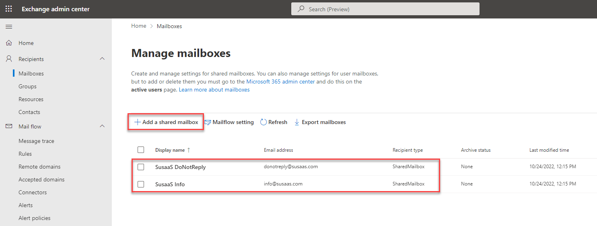](./images/Mail_SharedMailbox.png?raw=true)

> **Hint** - In this case, susaas.com was registered as a custom Domain in the respective Admin Center settings. For test scenarios, you can also go with the default *.onmicrosoft.com domain assigned to your account. 

The Exchange Admin Center provides a lot of options that we cannot cover in this tutorial like the rule used in our DoNotReply mailbox which automatically deletes all messages arriving in the mailbox. Feel free to explore further options of Exchange Online.

[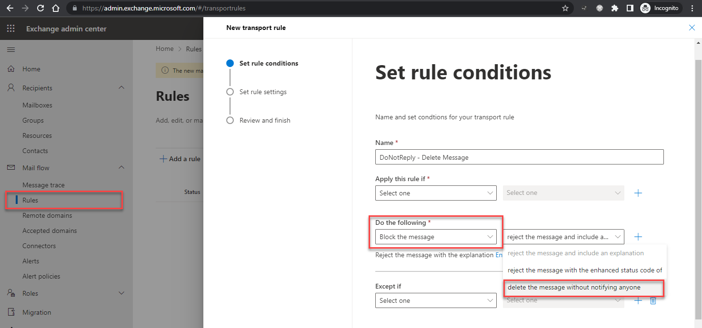](./images/Mail_DoNotReply.png?raw=true)

While the DoNotReply mailbox does not need any delegate access permissions as it is only used to send e-mails from within the SaaS application, the regular contact mailbox requires delegate access. You can add multiple users responsible for maintaining the contact mailbox. 

[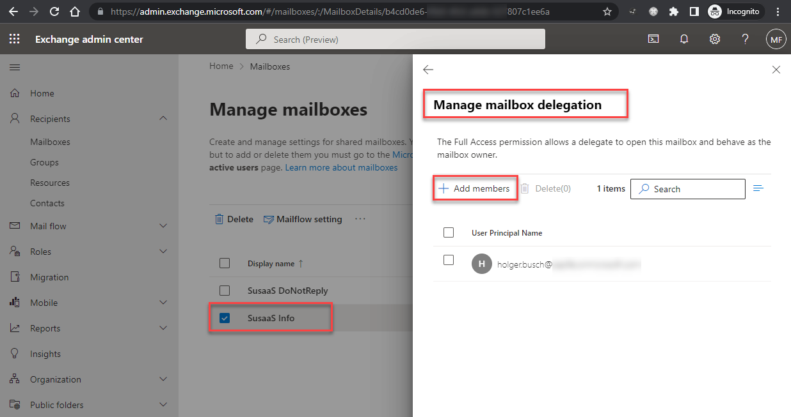](./images/Mail_DelegateAccess.png?raw=true)

Each delegate user needs to have a valid license assigned that contains Exchange Online access (like Office 365 F3). If the user does not appear in the list of available users in the Exchange Admin Center, please switch back to the [Microsoft 365 Admin Center](https://admin.microsoft.com/#/homepage) (https://admin.microsoft.com/), select the user, and switch to the **Mail** tab. This should initialize the Exchange Online usage within a few minutes. 

[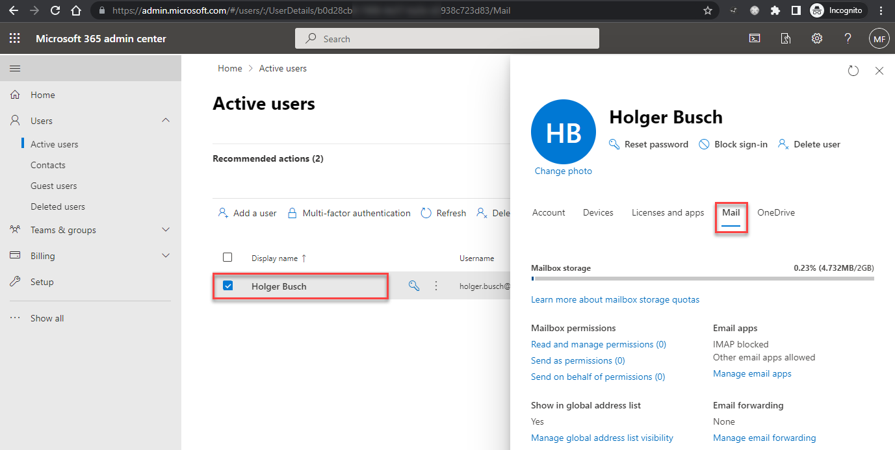](./images/Mail_ActivateMail.png?raw=true)

> **Important** - Each shared mailbox results in a new user in your Microsoft 365 Admin Center. This user is not supposed to be used for logins and the password must not be changed! Furthermore, you don't need to assign any licenses to the shared mailbox users. 


## 4. Create an Application Registration

You can use a standard Azure Active Directory **Application Registration** to send e-mails using the Microsoft Graph API. An application registration allows you to retrieve access tokens from Azure Active Directory for a certain scope (e.g., Microsoft Graph usage). The authorized scopes/permissions can be defined for each Application Registration. The process to create such an Application Registration is very simple. 

4.1. Go to the [Azure Portal](https://portal.azure.com/#home) and access your Azure Active Directory instance.

[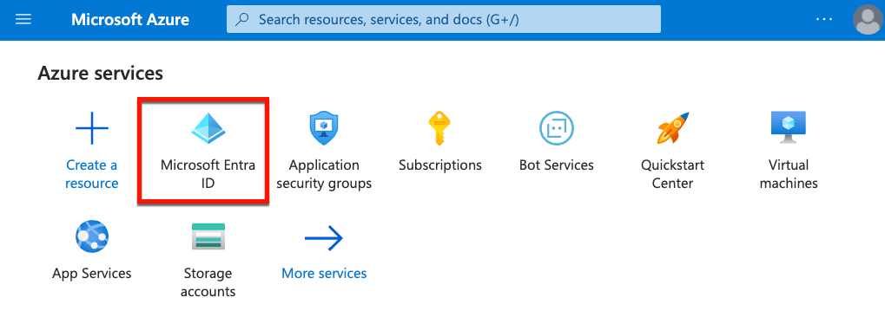](./images/Azure_AppReg01.png?raw=true)

4.2. Switch to **App registrations** and click on **New registration**. 

[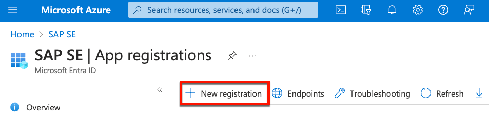](./images/Azure_AppReg02.png?raw=true)

4.3. Define a name of your choice, select the Single Tenant mode and click on **Register**.

[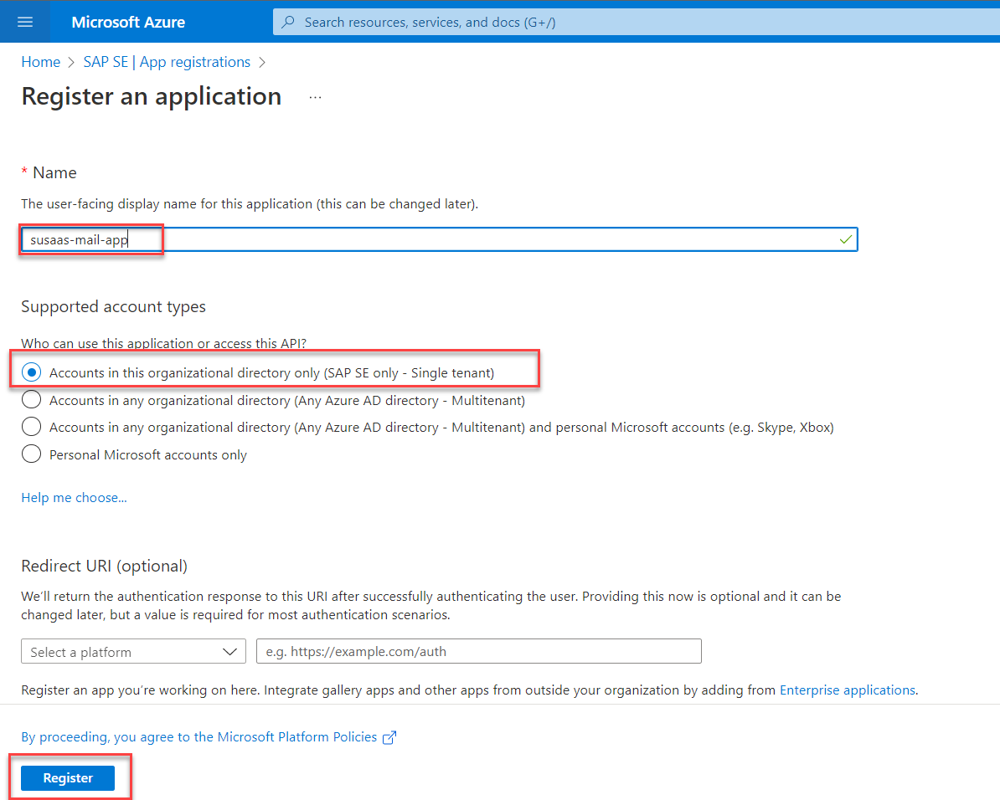](./images/Azure_AppReg03.png?raw=true)

4.4. Your Application Registration is created and you are redirected to the Overview page. 

> **Hint** - Note the **Application (client) ID** and the **Directory (tenant) ID**. You will need these values for authentication in your sample application.

[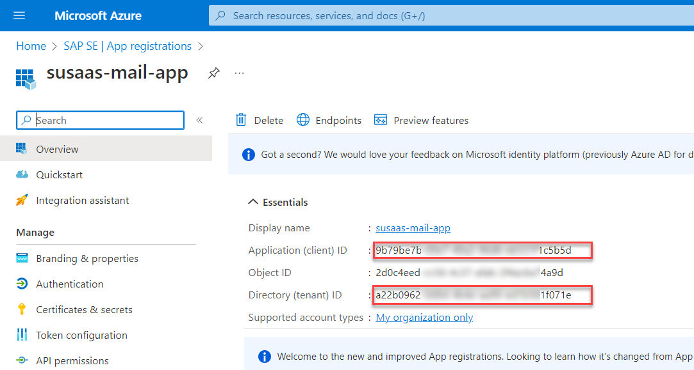](./images/Azure_AppReg04.png?raw=true)

4.5. Switch to **API permissions** and click on **Add a permission**.

[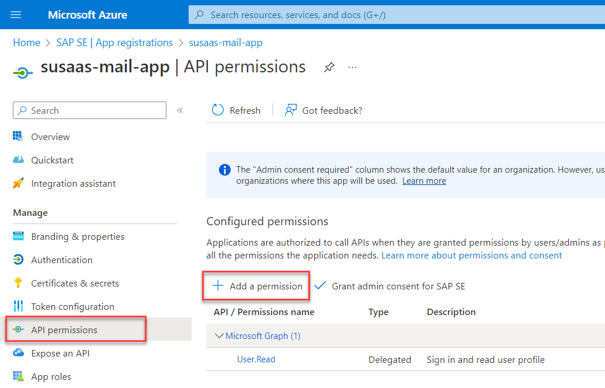](./images/Azure_AppReg05.png?raw=true)

4.6. Select **Microsoft Graph** from the available APIs, click on **Application permissions** and search for the **Mail.Send** permission. Select it and click on **Add permissions**. 

[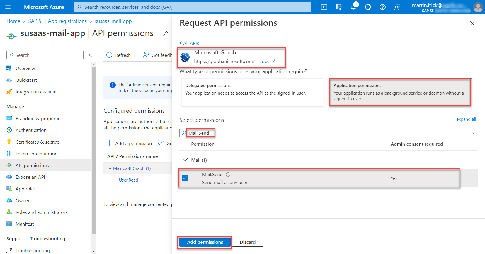](./images/Azure_AppReg06.png?raw=true)

4.7. This is a very powerful permission, as it is set on Application-level and allows you to send e-mails on behalf of any user in your directory. For that reason, **admin consent** has to be given for this permission. 

> **Important** - Please check the official [Microsoft documentation](https://docs.microsoft.com/en-us/graph/auth-limit-mailbox-access) to learn more about how to restrict the application's access permissions to certain mailboxes! 

[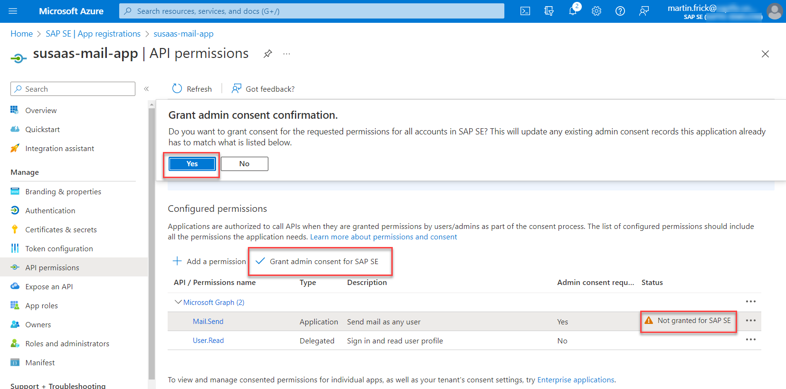](./images/Azure_AppReg07.png?raw=true)

4.8. You can remove the **User.Read** permission and admin consent from the API permissions list as you can see in the below screenshots. 

[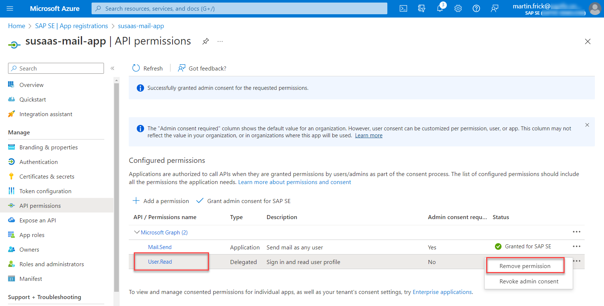](./images/Azure_AppReg08.png?raw=true)

[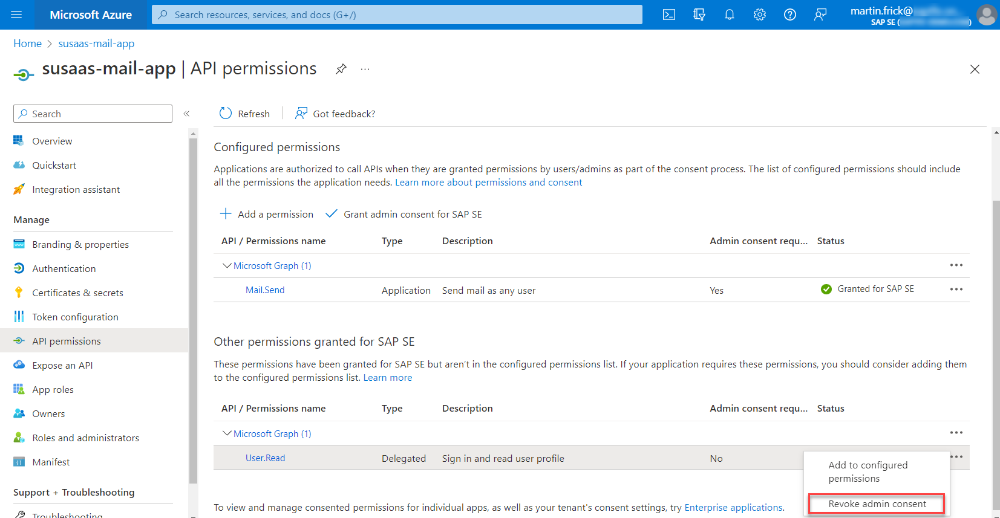](./images/Azure_AppReg09.png?raw=true)

4.9. Switch to the **Certificates & secrets** section and create a new **Client Secret**. Please copy the Secret value as you won't be able to see it again once you leave the page. 

[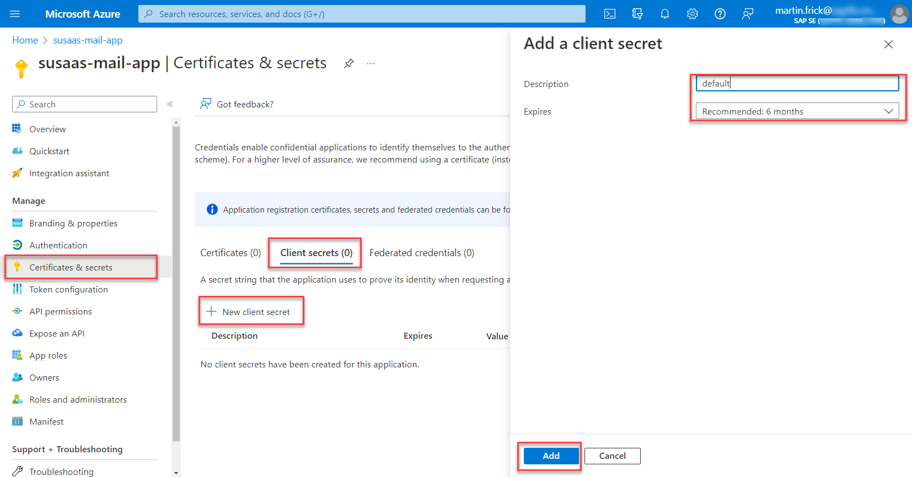](./images/Azure_AppReg10.png?raw=true)

[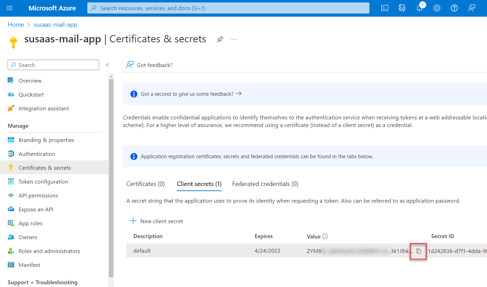](./images/Azure_AppReg11.png?raw=true)


## 5. Test the sample application

5.1. Go to the [*./code*](./code/) of this Expert Feature topic where you can find the sample application for testing your setup. Copy the index.js and package.json files to place on your local device - just to ensure you're not pushing any of your secrets to GitHub. 

5.2. Open a terminal window and switch to the directory in which you copied the provided files. Install the required dependencies by running the **npm install** command in the respective directory. 

5.3. Open the index.js file and update the following code sections. 

5.3.1. Update the credentials based on the Secret you created in the previous steps and the application details you can find in the Overview page of the application registration.

```js
const credential = new ClientSecretCredential(
    '<<a22bd-...-a1f071e>>',    // Directory (tenant) ID
    '<<9b79b-...-1f1c55d>>',    // Application (client) ID
    '<<ZYM8Q~...~SUscdn2>>'     // Application Secret
);
```

5.3.2. Insert a valid e-mail address for the recipient of your test message. 

```js
const sendMail = {
    message: {
        subject: 'Meet for lunch?',
        body: {
            contentType: 'Text',
            content: 'The new cafeteria is open!'
        },
        toRecipients: [{
            emailAddress: { 
                address: '<<mail.address@of.recipient>>'    // Recipient's e-mail address
            }
        }]
    },
    saveToSentItems: 'false'
};
```

5.3.3. Insert the e-mail address of your shared mailbox which you created at the beginning of this tutorial.

```js
client.api('/users/<<mail.address@of.mailbox>>/sendMail')   // Shared mailbox e-mail address
    .header("Content-type", "application/json")
    .post(sendMail, (err, res, rawResponse) => {
        console.log(res);
        console.log(rawResponse);
        console.log(err);
    });
```

5.4. Save the index.js file and run **npm run start** in your terminal. If you see a result like below, your e-mail was sent successfully. 

[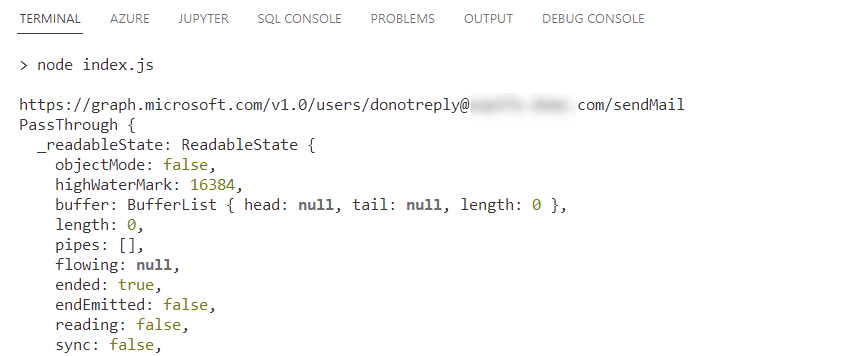](./images/Azure_SendMail.png?raw=true)

5.5. Check the inbox of your recipient's e-mail address where the message should have arrived. 

[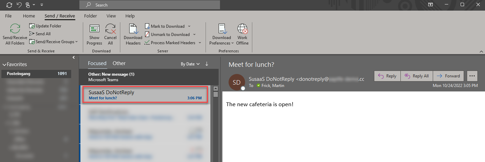](./images/Azure_SendMail01.png?raw=true)

5.7. You can now integrate the above coding into your application by using e.g., a new helper class in your Business Application Service. 

> **Important** - Make sure to store your credential values securely in your SAP Credential Store and rotate the values on a regular basis! Furthermore, you might think about improving your security setup by using an X.509 certificate to obtain the access token instead of Client Credentials. 

## 6. Resource Owner Password Flow

Although Microsoft does not recommend the usage of the following alternative approach ([see here](https://learn.microsoft.com/en-us/azure/active-directory/develop/v2-oauth-ropc)), we still want to quickly mention it here. Instead of using the Client Credentials Flow in combination with permissions on Application-level, you can also make use of the Resource Owner Password Flow, combined with Delegate permissions. 

[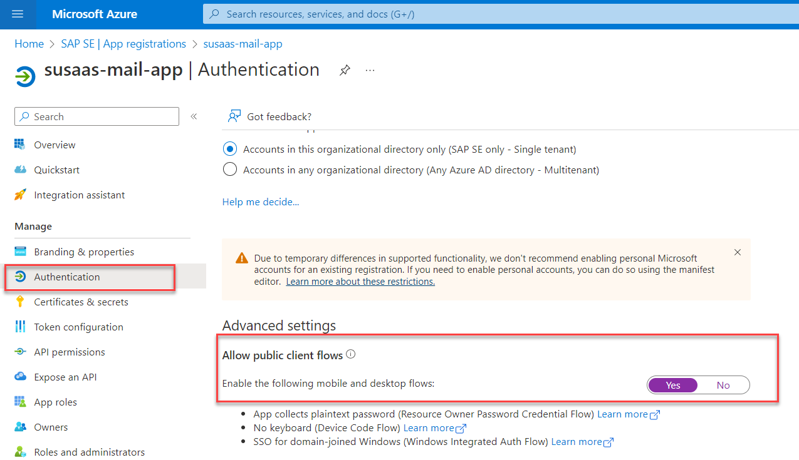](./images/Azure_AppPwFlow01.png?raw=true)

[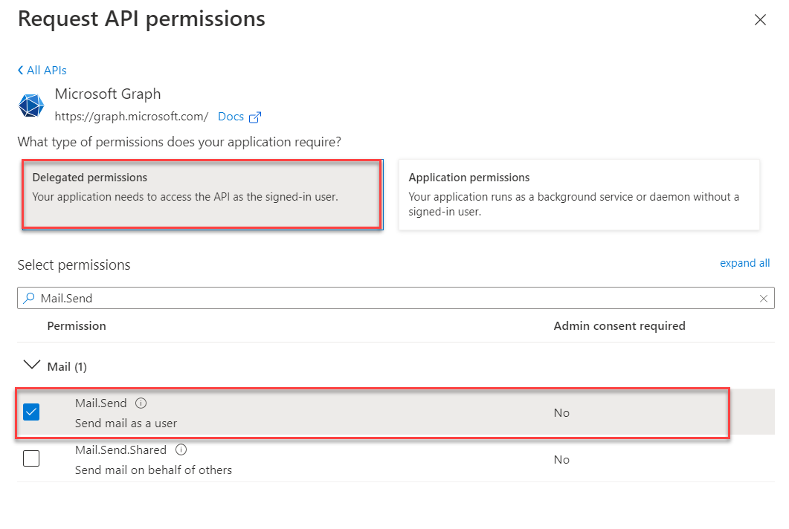](./images/Azure_AppPwFlow02.png?raw=true)

This approach comes with the drawback, that the Application Registration has to be configured for Public Client access, and you need to store the password of a dedicated Directory user in your SAP Credential Store. As said, this approach is not recommended by Microsoft and should only be used if the Client Credentials Flow (combined with a mailbox restriction) cannot be used for any reason. 

```js
const { UsernamePasswordCredential } = require("@azure/identity");
```

```js
const credential = new UsernamePasswordCredential(
    '<<a22bd-...-a1f071e>>',            // Directory (tenant) ID
    '<<9b79b-...-1f1c55d>>',            // Application (client) ID
    '<<sample.user@azure.directory>>'   // Username
    '<<password-of-sample-user>>'       // Password
);
```

In this case, if you want to use the shared mailbox as sender of the message, you need to add the user as a delegate to this mailbox. Otherwise, you can only send messages on behalf of this user as shown below. 

```js
client.api('/users/<<mail.address@sample.user>>/sendMail')   // User e-mail address
    .header("Content-type", "application/json")
    .post(sendMail, (err, res, rawResponse) => {
        console.log(res);
        console.log(rawResponse);
        console.log(err);
    });
```

## 7. Further Information

Please use the following links to find further information on the topics above:

* [SAP Blog - Cloud Integration – Connect to Microsoft 365 Mail with OAuth2](https://blogs.sap.com/2020/08/20/cloud-intgration-connect-to-microsoft-365-mail-with-oauth2/)
* [SAP Blog - Cloud Integration – Connect CPI with Your On-Premise Mail Server](https://blogs.sap.com/2020/01/08/cloud-integration-connect-cpi-with-your-on-premise-mail-server/)
* [SAP Blog - Send an email from a nodejs application](https://blogs.sap.com/2019/11/28/send-an-email-from-a-nodejs-application/)
* [Microsoft - Azure Free Trial](https://azure.microsoft.com/en-us/free/)
* [Microsoft - Exchange Online](https://www.microsoft.com/en-us/microsoft-365/exchange/exchange-online)
* [Microsoft - About shared mailboxes](https://learn.microsoft.com/en-us/microsoft-365/admin/email/about-shared-mailboxes?view=o365-worldwide)
* [Microsoft - Application model](https://learn.microsoft.com/en-us/azure/active-directory/develop/application-model)
* [Microsoft - Graph API](https://learn.microsoft.com/en-us/graph/overview)
* [Microsoft - Graph API - sendMail](https://learn.microsoft.com/en-us/graph/api/user-sendmail)
* [Microsoft - Introduction to permissions and consent](https://learn.microsoft.com/en-us/azure/active-directory/develop/permissions-consent-overview)
* [Microsoft - Admin-restricted permissions](https://learn.microsoft.com/en-us/azure/active-directory/develop/v2-permissions-and-consent#admin-restricted-permissions)
* [Microsoft - Limiting application permissions to specific Exchange Online mailboxes](https://learn.microsoft.com/en-us/graph/auth-limit-mailbox-access)