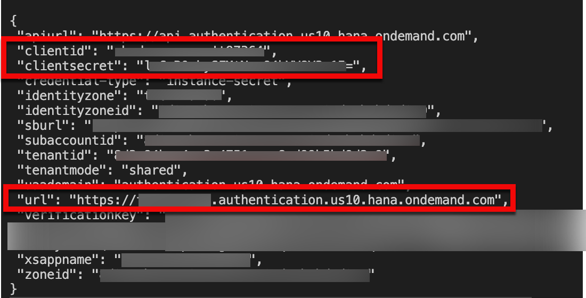
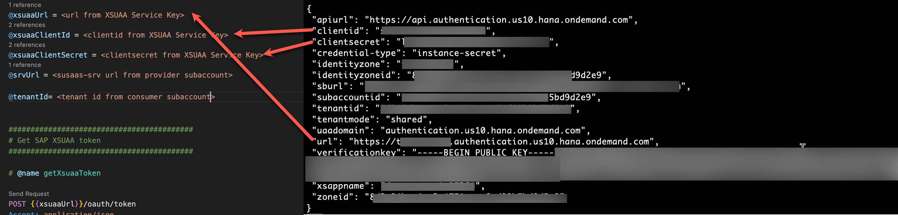
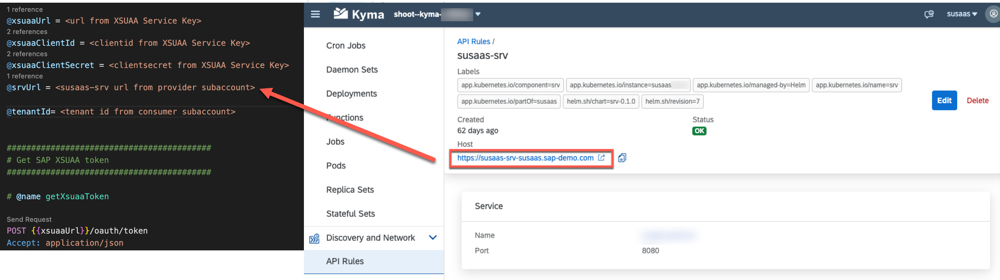
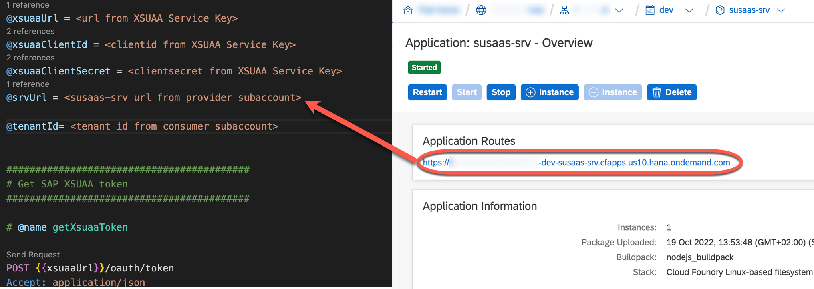
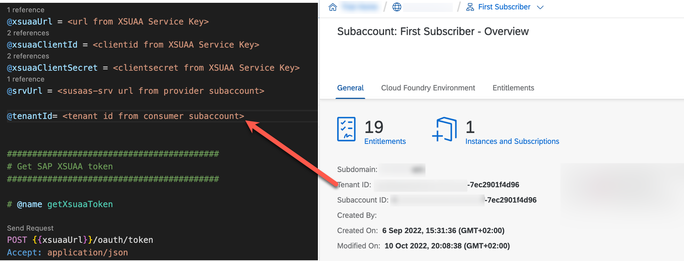

# Update tenant database containers

- ### **Kyma** ✅
- ### **Cloud Foundry** ✅

In this part of the **Expert Features**, you will learn how to distribute data model changes to your tenant database containers using API calls.

- [Update tenant database containers](#update-tenant-database-containers)
  - [1. Prerequisites](#1-prerequisites)
  - [2. Introduction](#2-introduction)
  - [3. Add a field to CDS model](#3-add-a-field-to-cds-model)
  - [4. Build and deploy your application with the new added column](#4-build-and-deploy-your-application-with-the-new-added-column)
  - [5. Create and display a service key for your XSUAA instance](#5-create-and-display-a-service-key-for-your-xsuaa-instance)
  - [6. Fill the HTTP test file with the values and distribute the changes](#6-fill-the-http-test-file-with-the-values-and-distribute-the-changes)
    - [6.1. Put the service key values into your HTTP test file](#61-put-the-service-key-values-into-your-http-test-file)
    - [6.3. Put the SaaS Backend Service Url into your HTTP test file](#63-put-the-saas-backend-service-url-into-your-http-test-file)
    - [6.3. Put the Tenant Id of your Consumer Subaccount into your HTTP test file](#63-put-the-tenant-id-of-your-consumer-subaccount-into-your-http-test-file)
  - [7. Send DB Upgrade request for your tenant](#7-send-db-upgrade-request-for-your-tenant)
    - [7.1. Send token request](#71-send-token-request)
    - [7.2. Upgrade the tenant schema](#72-upgrade-the-tenant-schema)
  - [8. Access your tenant container to see your changes](#8-access-your-tenant-container-to-see-your-changes)


## 1. Prerequisites

1. You have completed the [**Basic**](../../2-basic/0-introduction-basic-version/README.md) or [**Advanced**](../../3-advanced/0-introduction-advanced-version/README.md) version of the tutorial.
2. You have a **deployed** and **running** multitenant application on your SAP BTP Provider Subaccount.
3. You already have a **subscription** from a consumer subaccount to your mulititenant SaaS application.


## 2. Introduction 

On your journey with your multitenant application, at some point, you will probably need to **update** your CDS model while you are having active subscribed consumer subaccounts to your application.

When you as a developer have added or removed a field from your CDS model, it is not automatically reflected to tenant's HDI container automatically after deployment. You need to send a request to your multitenant CAP application re-deploy the latest changes to the tenant’s HDI container and that is what you will learn on this section.


## 3. Add a field to CDS model

Go to your [**Users**](https://github.com/SAP-samples/btp-cap-multitenant-saas/blob/main/code/db/data-model.cds) entity in your local environment and add a **dummy** column as shown below.

```js
context susaas.db {

...
      @assert.unique : {email : [email]}
      entity Users : cuid, managed {
            @Core.Computed:true
            fullName : String;
            firstName : String;
            lastName  : String;
            email     : String;
            shadowId  : UUID;
            iasLocation: String;
            dummy : String; // new added column
            // associations
            role : Association to Roles;
      }
...
```

## 4. Build and deploy your application with the new added column

Build, push (in case of Kyma) and deploy your latest changes from the respective *deploy* directories.

**Kyma**

> **Hint** - The below commands are just samples. Please replace the **container image prefix** and also add additional yaml files, in case your current deployment includes the **Central User Management** or the **API Management Integration**.

```sh
# Run in ./deploy/kyma #
npm run build
npx cross-env IMAGE_PREFIX=sap-demo npm run build:srv
npx cross-env IMAGE_PREFIX=sap-demo npm run push:srv
helm upgrade susaas ./charts/sustainable-saas -f ./charts/sustainable-saas/values-private.yaml -n default
```

**Cloud Foundry**

> **Hint** - The below commands are just samples. If your current deployment is based on the **Basic Version**, please change the respective mtaext filename.

```sh
# Run in ./deploy/cf #
mbt build -e mtaext/free-advanced-private.mtaext
cf deploy mta_archives/susaas-0.0.1.mtar
```


## 5. Create and display a service key for your XSUAA instance

Run the commands below depending on your deployment environment to get the Client Credentials required for the next steps.

**Kyma**

> **Hint** - Replace the <ReleaseName> placeholder with your Kyma Release name like *susaas* or *susaas-prod*.

```sh
kubectl get secret <ReleaseName>-srv-xsuaa -o jsonpath='{.data.clientid}' | base64 --decode | awk '{print "Client-Id: "$1}'
kubectl get secret <ReleaseName>-srv-xsuaa -o jsonpath='{.data.clientsecret}' | base64 --decode | awk '{print "Client-Secret: "$1}'
kubectl get secret <ReleaseName>-srv-xsuaa -o jsonpath='{.data.url}' | base64 --decode | awk '{print "XSUAA-Url: "$1}'
```

**Cloud Foundry**

> **Hint** - Replace the <CfSpace> placeholder with your Cloud Foundry Space name like *dev* or *prod*.

```sh
cf create-service-key <CfSpace>-susaas-uaa susaas-uaa-key 
cf service-key <CfSpace>-susaas-uaa susaas-uaa-key
```

[](./images/uaa-service-key.png?raw=true)


## 6. Fill the HTTP test file with the values and distribute the changes

Since you have created all the required credentials, now you can start filling the variables and send requests using the *tenantUpgrade.http* file in the *code/test/http* directory. 

> **Important** - You might want to copy that file and change the filename to **tenantUpgrade-private.http** first, to ensure that changes are not unintentionally committed to GitHub. 

### 6.1. Put the service key values into your HTTP test file

Replace the credentials from your service key with your HTTP file placeholders as shown below. 

[](./images/credmapping.png?raw=true)

### 6.3. Put the SaaS Backend Service Url into your HTTP test file

Copy the Url of your SaaS Backend Service from your SAP BTP Cockpit or Kyma Dashbaord into your relevant file placeholder in your http file.

**Kyma**

[](./images/srv-url-mapping-kyma.png?raw=true)


**Cloud Foundry**

[](./images/srv-url-mapping.png?raw=true)

### 6.3. Put the Tenant Id of your Consumer Subaccount into your HTTP test file

Go to your **Consumer Subaccount** overview. After that put the **Tenant Id** into your relevant file placeholder in your HTTP test file.

[](./images/tenantid-mapping.png?raw=true)


## 7. Send DB Upgrade request for your tenant

Since we have filled all the required information for a tenant DB model upgrade we might start sending requests.

### 7.1. Send token request

Go to your HTTP test file and click send request as shown below. 

```http
##########################################
# Get SAP XSUAA token 
##########################################

# @name getXsuaaToken

POST {{xsuaaUrl}}/oauth/token
Accept: application/json
Content-Type: application/x-www-form-urlencoded
Authorization: Basic {{xsuaaClientId}}:{{xsuaaClientSecret}}

?client_id={{xsuaaClientId}}
&client_secret={{xsuaaClientSecret}}
&grant_type=client_credentials

```

> **Hint** - If you are unableto retrieve the token from the request above, you should double check if your credentials are correctly placed into your HTTP test file.

### 7.2. Upgrade the tenant schema

After retrieving the token, you should send the request to your multitenant application. This request will deploy the newest version of your DB model which contains **dummy** column from Step 1.

```http
################################################
# Call CAP endpoint (BTP) For DB Model Upgrade
################################################

@access_token = {{getXsuaaToken.response.body.$.access_token}}

# @name upgradeTenantDBModel
POST {{srvUrl}}/-/cds/deployment/upgrade
Authorization: Bearer {{access_token}}
Content-type: application/json

{ "tenant": "{{tenantId}}"  }

```
> **Hint** - Please note that this will deploy the new changes **only** for the tenant given in the request.
> If you want to upgrade tenant db model for more than one tenant, please send the request with those tenant id's as well.


## 8. Access your tenant container to see your changes

The last step is accessing the tenant container as it is described [here](../manage-tenant-containers/README.md). You should see your **dummy** column added to the  **Users** table as shown below.